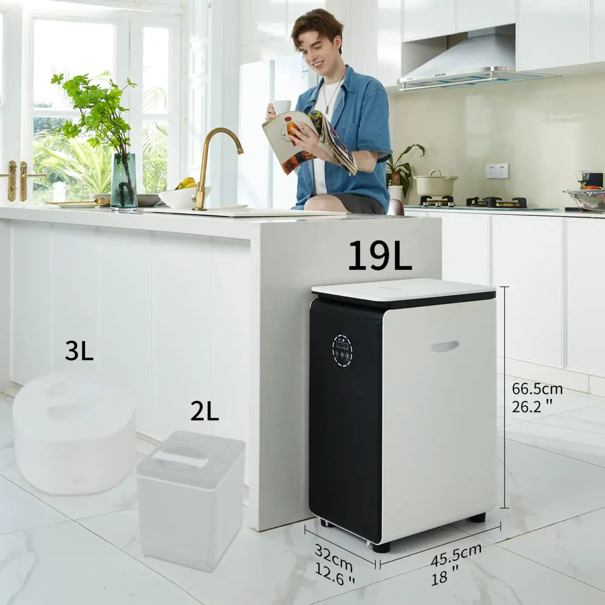
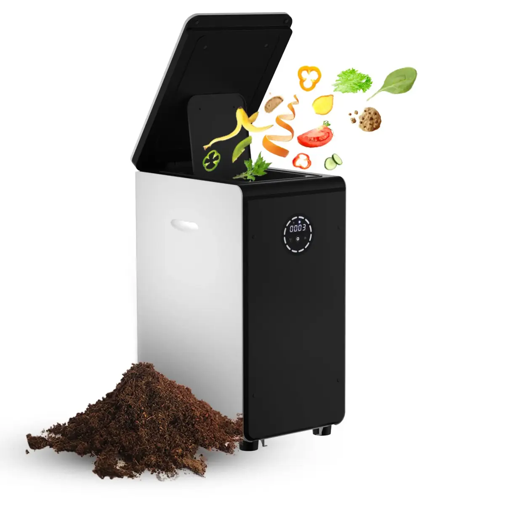
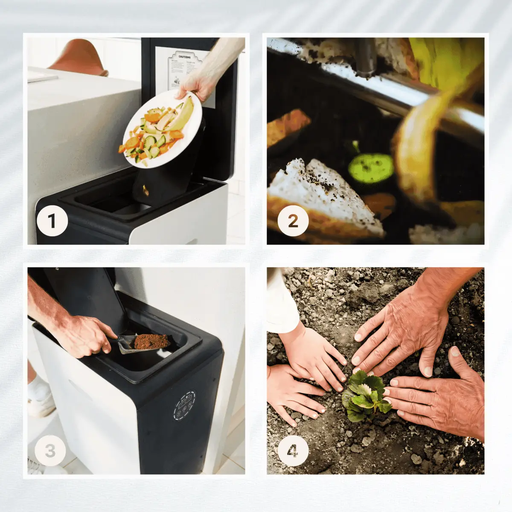

import GemeComposterCTA from '@site/src/components/GemeComposterCTA' 
import RelatedArticles from '@site/src/components/RelatedArticles'
import ReactPlayer from 'react-player'

In recent years, eco-conscious lifestyles have turned to electric kitchen composters to reduce food waste and greenhouse gas emissions. 

The GEME Composter is a leading countertop composter that turns food scraps into real compost in just hours. As the most exciting shopping day - Black Friday approaches, GEME composter will take part in the show. We offer big savings for shoppers hunting for kitchen appliances deals. 

Below, let’s find out the best GEME Composter discounts on GEME's official website.

<!-- truncate -->

<h2 class="jump-to">Jump To</h2>

1. **[The Best GEME Composter Discount](#1-the-best-geme-composter-discount)**

2. **[Where to Find the GEME Composter Discount](#2-where-to-find-the-geme-composter-discount)**

3. **[The Benefits of GEME Composter](#3-the-benefits-of-geme-composter-discount)**

4. **[Why Invest in a Countertop Composter](#4-why-invest-in-a-countertop-composter)**

5. **[How to Use the GEME Composter](#5-using-the-geme-composter-overview)**

6. **[Compare GEME Composter to Other Composters](#6-comparing-geme-to-other-electric-composters)**

7. **[Key Features of the GEME Countertop Composter](#7-the-geme-electric-countertop-composter--key-features)**

8. **[Planning Your GEME Composter Purchase](#8-conclusion-planning-your-geme-composter-purchase)**

## 1. The Best GEME Composter Discount

First of all, let's get it straight! On this Black Friday, the best GEME Composter discount is a great bundle saving - the Geme Kit + Quarterly Kobold Supply (1 Pack) For Free + 2-Year Warranty, with \$200 off. Here's the detail: 
 
- GEME Composter: 1 unit
- GEME Kobold: 1+1 = 2 Packs of Quarterly Supply (Worth \$36)
- Shovel & Scraper: 1
- Warranty: 1+1 = 2 Years (Worth \$170)
- Free Shipping

Original price: \$1098

<b>Black Friday Exclusive: \$899</b>

Discount: around \$200 off

## 2. Where to Find the GEME Composter Discount

For Black Friday 2025, you can get the GEME Composter Discount through:

  1. **GEME’s official product page**: 
  
  https://www.geme.bio/product/geme 

  2. **GEME’s Amazon Product page**: 
  
  (For US users) https://www.amazon.com/GEME-Composter-Real-Composting-Electric/dp/B0BV31KTCN?maas=maas_adg_1D1327F2B6769D19FFBFD6A0E636E38D_afap_abs&ref_=aa_maas&tag=maas
  
  (For Deutschland users) https://www.amazon.de/GEME-Elektrischer-Dauerhafter-Kompostierung-Kompostbeh%C3%A4lter/dp/B0CJY4K9J3?maas=maas_adg_97B704A2C272860E61DF4501F27A1DDE_afap_abs&ref_=aa_maas&tag=maas 

  3. **GEME’s Walmart Product page**: 
  
  https://www.walmart.com/ip/GEME-World-First-Bio-Smart-19L-Electric-Composter-Kitchen-Filter-No-Need-Change-Not-Dehydration-Tec-Add-Waste-Anytime-Compost-Machine-Bin-Food-Cycler/1670817413  

  4. **Subscribe for Early Alerts**: 
  
  Sign up for the [GEME newsletter](https://www.geme.bio/signup) or follow our social channels. We will release Black Friday promo emails to subscribers for Black Friday and Cyber Monday 2025.

<GemeComposterCTA 
 imgSrc="/img/geme-bio-composter.jpg"
 productTitle="GEME Countertop Composter"
 features={[
    "✅ Compost food waste within 8 hours",
    "✅ Rich Compost For Soil Health & Garden Plants",
    "✅ Quiet, Odour-Free, Real Compost",
    "✅ Reduce Landfill Waste & Greenhouse Gases"
 ]}
buttonText="Use GEME Kitchen Composter to Reduce Food Waste"
  href="https://www.geme.bio/product/geme?utm_medium=blog&utm_source=geme_website&utm_campaign=general_seo_content&utm_content=compost-pile-vs-electric-composter"
/>

## 3. The Benefits of GEME Composter Discount

Black Friday deals on kitchen appliances are exclusive in the year of 2025. For the above bundle, it's worth \$1098 on regular days. However, you will get around \$200 off for **a freebie of Quarterly Kobold Supply and a 2-year warranty, which is priced at \$899 only!**
 
For the freebie of Kobold, you can use it for 6 months compared with the original kit. Also, the extended warranty will ensure you have the best experience of composting at home. 

## 4. Why Invest in a Countertop Composter?

Using a countertop composter for home composting is one of the most impactful ways to cut household waste. According to the U.S. EPA, food scraps make up roughly 24% of municipal waste, and keeping them out of landfills slashes methane emissions. Instead, composting transforms kitchen waste into a nutrient-rich soil amendment. 
 
By running the GEME composter, you dramatically reduce landfill waste and create free fertiliser. The EPA notes that composting “reduces greenhouse gas emissions” by preventing wasted food from rotting anaerobically in landfills. In short, a countertop composter helps you recycle kitchen scraps indoors year-round, even without a backyard pile.

 
Using a GEME countertop composter also handles foods that outdoor bins usually avoid. For example, high-heat units like GEME can safely process meat, dairy, and cooked food by killing pathogens with heat of up to 160℉ -212℉. This convenience means fewer fruit peels, coffee grounds, or even chicken scraps in your weekly garbage. Compared to manual compost piles, an electric system works continuously and finishes composting in hours instead of months.
 
What’s more, Black Friday comes in winter in the northern hemisphere. Outdoor compost piles will be cold composting, which means they cannot reach a high enough temperature and active microbes to process your food waste, leading to an extremely slow breakdown process and the remaining of harmful bacteria and pathogens, along with pests, flies, and odours. 
When your town is covered by snow, a compost pile will definitely fail to compost your food waste, whereas the indoor GEME composter stands out from its own heating system to break down all food scraps. 

## 5. Using the GEME Composter (Overview)

Operating a GEME composter is straightforward. You pour kitchen scraps into the bin and hit “start”. The internal mixing shaft and heating system take over, maintaining temperatures around 160–212°F to kill pathogens. Over several hours, the waste is ground and fermented. At the end of a cycle, excess moisture is expelled, and the remaining material settles. Every few weeks (depending on use), the composter will be full of rich compost. You simply open the hatch and scoop out the dark, earthy compost. One user notes that all the dinner waste can disappear by morning! (See reviews from the official GEME site: www.geme.bio.)

  <ReactPlayer 
    className="video__player" 
    controls height="100%" 
    url="https://r2.geme.bio/media/videos/home-video/hero-banner-window-video-19s-480p.mp4" width="100%" 
  />

### Important tips: 

GEME can handle fruit peels, veggies, coffee grounds, eggshells, meat, dairy, and even certain plant matter that you’d avoid in a backyard pile. Do not add very hard items (like big bones) or non-biodegradables (plastics, metal, glass). Because GEME’s microbes need a little care, you should add a 20g microbial refill (“Kobold”) about every two weeks to keep the composting active. But aside from cleaning the bin occasionally, the device is largely self-sufficient.

## 6. Comparing GEME to Other Electric Composters

When evaluating Black Friday deals, consider how the GEME composter stacks up against peers. As mentioned, GEME’s microbe fermentation is its unique selling point. Competing models mainly grind and dry scraps in 3–6 hours. They are often smaller (3–5L capacity), but you end up with a powdery byproduct that can’t be ready to use. By contrast, the GEME composter boasts one of the fastest breakdown rates (full cycle in 6–8h) and yields real finished compost.
 
### Feature Comparison:
 
- **Capacity**: GEME ~19L (~5kg/day) vs. Lomi Classic ~8L (2kg/day) or Vitamix ~7L (daily use).

- **Output**: GEME – real compost; Others – dried pulp or liquid.

- **Noise & Size**: GEME is relatively large (42 lbs, 18×12.6×26.2 in) but runs quietly. Some smaller units can be lighter but also smaller capacity that can’t process all your daily kitchen waste.

- **Cost**: Discounted GEME Kit 899 US Dollars for Black Friday deals; Others can exceed 900 US Dollars or can be at a lower price, but not a full breakdown or real composting (dehydrating instead).
 
The GEME composter bridges the gap between outdoor piles and simple food recyclers. Compared to a backyard compost bin, the GEME composter is space-efficient and works year-round indoors. It eliminates pests and odours common to outdoor piles because of its sealed design. 

Against other countertop composters, GEME’s microbe-based approach is unique. Many popular models simply grind and dry scraps, producing a dry “pulp” that still needs finishing. A consumer review notes that GEME is “the world’s first microbe-based electric home composter” whose end product is real compost. This sets GEME apart, whereas competitors often deliver inert dried waste. 
 
For example, Wired Magazine points out that most countertop composters do not produce ready-to-use soil: they mainly reduce volume and odours. GEME, by contrast, adds true composting biology to achieve a fuller breakdown.
 
Buying a GEME composter on sale means enjoying its premium features. For modern families, quick, ready compost is always our goal. The GEME composter can be justified by the convenience.

## 7. The GEME Electric Countertop Composter – Key Features

The GEME composter is marked as a 19-litre countertop composter with advanced composting tech. It’s one of the first models to use live microbes (“Kobold” culture) to ferment waste, rather than just dehydrating it. 
 
In practice, you add a starter packet of beneficial bacteria once, and the machine continuously introduces those microbes to break down scraps. Each cycle lasts about 6–8 hours, after which over 95% of the input is reduced (the remaining ~5% continues to compost until ready). The result is true microbe-rich compost, not just dry pellets. 
 
As GEME’s documentation explains: “By the end of each cycle, over 95% of the food scraps have been broken down… finished compost – it is true, microbial-rich compost”.
 
Some of GEME’s standout features include:
 
- **Real Compost Output**: Unlike many dehydrator-style units, GEME’s microbial system yields genuine compost with nutrients and soil microbes.

- **Large Capacity**: A single GEME bin holds ~19 litres and can process up to 5 kg of waste per day (estimates vary by source). This is much larger than compact models.

- **Permanent Odour Filter**: GEME uses an industrial-grade air filter that never needs replacing, eliminating charcoal filter costs.

- **Continuous Feed**: Food scraps can be added anytime, even mid-cycle. No need to wait for an empty cycle to toss in more waste.

- **Quiet, Odour-Free Operation**: The sealed design and filter keep smells out, and the machine runs quietly. (Users report a nearly silent operation.)

- **Ease of Use**: Simply add kitchen scraps, press a button, and let GEME do the work. After a few days or weeks of cycles, you empty the dark, soil-like compost, ready for plants.

 
Overall, the GEME composter is a high-tech, countertop composter. It replaces tedious turning and monitoring of a pile with automated mixing and heating. **For Black Friday 2025, its official US price is around \$899 for the GEME kit, which includes the composter, a half-year supply of microbes (Kobold), a shovel, a scraper, and a two-year warranty**.

## 8. Conclusion: Planning Your GEME Composter Purchase

A GEME composter can be a game-changer for an eco-friendly kitchen. Its unique microbial composting and large capacity set it apart from other countertop electric composters. 
 
For Black Friday 2025, shoppers should watch official GEME discounted kits. Since kitchen appliance deals often extend to green gadgets, the GEME composter might be featured alongside other discounted countertop appliances. By comparing prices at GEME’s own store, Amazon, and Walmart, you can pinpoint the best GEME Composter Discount available.
 
In summary: Embrace composting with GEME’s convenience, and maximise your savings by shopping early for Black Friday appliance deals. With the right promotion, you could turn your food waste into rich compost at a fraction of the usual cost. 
 
Enjoy your eco-conscious lifestyle! Let’s turn waste into gold for our planet. Happy composting and happy shopping!

<RelatedArticles
  slugs={[
  "the-best-composter-to-reduce-food-waste",
  "compost-pile-vs-electric-composter",
  "how-to-make-bananas-last-longer",
  "garden-soil-vs-compost-pros-and-cons",
  "how-long-do-blueberries-last-in-fridge",
  "how-long-do-apples-last-in-the-fridge",
  "can-i-compost-moldy-grapes",
  ]}
/>

_Ready to transform your gardening game? Subscribe to our [newsletter](http://geme.bio/signup) for expert composting tips and sustainable gardening advice._

