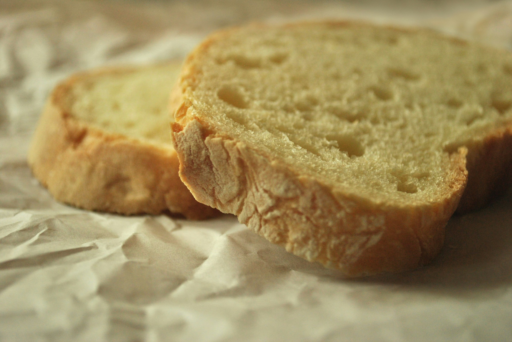
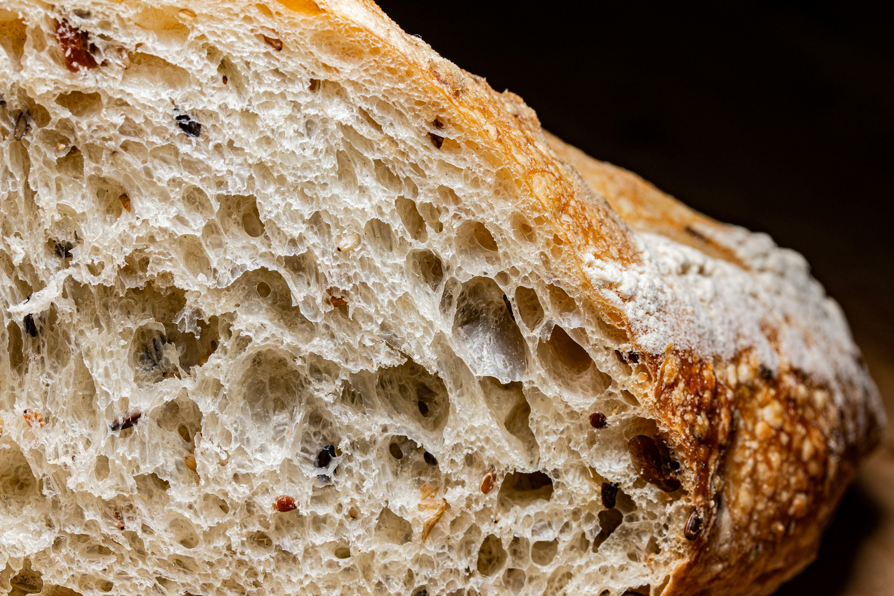

import GemeComposterCTA from '@site/src/components/GemeComposterCTA' 
import RelatedArticles from '@site/src/components/RelatedArticles'
import ReactPlayer from 'react-player'

Bread spoils quickly and becomes moldy fast, many people wonder: Can you compost bread? Is moldy bread safe for compost? And what happens if you eat moldy bread accidentally?

Bread is one of the most commonly wasted foods in American and European households. This guide walks you through composting bread safely — using advice aligned with expert guidelines from the USDA, food safety research, and environmentally responsible composting practices.

### Quick Recap

- Can you compost bread? **Yes — even moldy bread**.

- Can bread be composted safely? **Absolutely, especially in a GEME composter**.

- Is moldy bread dangerous to eat? **Yes, avoid it due to allergens and potential toxins**.

You’ll also learn why bread composts more reliably in a GEME composter, which uses active microorganisms to break it down fully.

<!-- truncate -->

<h2 className="jump-to">Jump To</h2>

1. **[Can You Compost Moldy Bread?](#1-can-you-compost-bread-especially-moldy-bread)**

2. **[How to Tell If Bread Goes Bad or Moldy](#2-when-can-bread-be-composted-how-to-tell-if-bread-goes-bad-or-moldy)**

3. **[What Happens If You Eat Moldy Bread?](#3-what-happens-if-you-eat-moldy-bread)**

4. **[Turn Moldy Bread Into Rich Compost](#4-bread-doesnt-belong-in-your-trash--it-belongs-in-compost)**

## 1. Can You Compost Bread? (Especially Moldy Bread)

Yes, bread can be composted — including moldy bread.

Bread is made from organic materials such as flour, yeast, water, and sometimes sugar or grains. These ingredients break down naturally and are suitable for composting. As bread ages, it becomes dry and crumbly, making it even easier for microbes to digest.

### ✔ Why can bread be composted

Bread is considered a “green” compost ingredient because it contains nitrogen-rich components that contribute to microbial activity. The microorganisms responsible for decomposition — fungi, bacteria, and beneficial microbes — can digest bread just like any other food waste.

### ✔ Is moldy bread OK for compost?

Yes. Mold is simply a fungus — and fungi play a major role in composting. Once bread begins to sprout mold, it’s already halfway through the decomposition process. Adding it to compost accelerates breakdown.

### ⚠ But bread in traditional backyard compost piles attracts pests

Bread decomposes quickly, but it also:

- gives off odors that attract rats, raccoons, insects, and wildlife

- becomes a “moist lump” that compacts and slows airflow

- grows harmful molds in unmanaged piles

This is why many university extension programs and composting experts recommend burying bread deep in compost or avoiding it in open piles altogether.

### ⭐ Why a GEME electric composter handles bread best

A GEME Composter uses heat + continuous mixing + living microbes to digest food waste rapidly. Bread — especially soft or moldy bread — is one of the easiest items for GEME Kitchen Composter to process.

 **Benefits include**:

- no pests, no odor

- complete breakdown into microbial-rich compost

- safe handling of moldy or stale bread

- works even for small indoor spaces

Because bread can attract pests and spoil anaerobically in traditional piles, indoor electric composting is the cleanest, fastest option.

## 2. When Can Bread Be Composted? (How to Tell If Bread Goes Bad or Moldy)

Bread can be composted at almost any stage, but knowing when bread has gone bad helps you manage food waste smartly — and safely.

### ✔ Stage 1: Dry or stale bread

Dry, hardened bread is perfect for composting. It breaks down quickly and poses no safety issues.

### ✔ Stage 2: Slightly stale or expired bread

If bread tastes old or has passed the “best by” label, it is still safe to compost.

### ✔ Stage 3: Moldy bread

Once you see green, white, black, or blue fuzz, the bread has fungal growth. This stage is completely safe for compost — fungi help accelerate decomposition.

### When not to compost bread

You should avoid composting bread if:

- It has visible chemical contamination (cleaners, sprays, oils not used for cooking)

- It has packaging stuck to it

- It contains animal fats or fillings (like cheese-filled bread) unless you’re using a closed-system electric composter like GEME.

### How to compost bread properly

To avoid clumping or slow anaerobic breakdown:

- Tear bread into small pieces

- Mix it into the centre of the compost bin

- Combine with “brown” materials like dried leaves, cardboard, or shredded paper

However, **in a GEME composter, you can simply drop it in — the machine handles moisture and breakdown automatically**.

<GemeComposterCTA 
 imgSrc="/img/geme-bio-composter.jpg"
 productTitle="GEME Countertop Composter"
 features={[
    "✅ Compost Moldy Bread within 6-8 hours",
    "✅ Rich Compost For Soil Health & Garden Plants",
    "✅ Quiet, Odour-Free, Real Compost",
    "✅ Reduce Landfill Waste & Greenhouse Gases"
 ]}
buttonText="Use GEME Kitchen Composter to Reduce Food Waste"
  href="https://www.geme.bio/product/geme?utm_medium=blog&utm_source=geme_website&utm_campaign=general_seo_content&utm_content=can-you-compost-bread"
/>

## 3. What Happens If You Eat Moldy Bread?

Even though moldy bread is safe for compost, it is not safe to eat. The USDA and food safety experts warn that bread is one of the most dangerous foods to consume once mold appears.

### ✔ Why moldy bread is unsafe to eat

Bread is porous, meaning mold roots (called hyphae) spread deep below the visible surface. Even if you cut mold off, microscopic filaments and potential toxins remain.

### What happens if you eat moldy bread?

Reactions vary depending on the mold type and the person’s health, but potential effects include:

  1. **Digestive discomfort**
  
  Symptoms may include:
  
  - nausea
  
  - stomach irritation
  
  - vomiting
  
  - diarrhea

These are caused by mold spores or microbial byproducts.

  2. **Allergic reactions**
  
  People sensitive to mold may experience:
  
  - sneezing
  
  - watery eyes
  
  - coughing
  
  - itching
  
  - sinus pressure

Severe reactions are more common in people with asthma.

  3. **Exposure to mycotoxins**
  
  Some molds produce mycotoxins, toxic compounds that can harm health when eaten. While most bread molds are not the most dangerous species, it is impossible to identify them safely at home.
  
  **If someone ate moldy bread accidentally**:
  
  - Most healthy adults will be fine with mild symptoms.
  
  - Drink water and monitor for reactions.
  
  **Seek medical advice if**:
  
  - symptoms worsen
  
  - a child or immunocompromised person ingested it
  
  - you suspect large consumption

Bottom line: If bread shows mold — compost it. Do not eat it.

## 4. Bread Doesn’t Belong in Your Trash — It Belongs in Compost

Bread is one of the easiest foods to compost. Whether it’s fresh, stale, dried, or completely moldy, it can be broken down safely and efficiently in a composting system.
But because bread attracts pests and grows fungi quickly, a sealed electric composter like GEME Composter is the safest, cleanest, and fastest way to recycle it into valuable compost for plants and gardens.

By composting bread instead of throwing it out, you reduce food waste, cut greenhouse gas emissions, and create nutrient-rich compost naturally — all while keeping your kitchen cleaner and more sustainable. And together we turn waste into nutrients to feed the earth. 

<RelatedArticles
  slugs={[
  "the-best-composter-to-reduce-food-waste",
  "compost-pile-vs-electric-composter",
  "how-to-make-bananas-last-longer",
  "garden-soil-vs-compost-pros-and-cons",
  "how-long-do-blueberries-last-in-fridge",
  "how-long-do-apples-last-in-the-fridge",
  "can-i-compost-moldy-grapes",
  "best-black-friday-deals-on-geme-composter-2025"
  ]}
/>

_Ready to transform your gardening game? Subscribe to our [newsletter](http://geme.bio/signup) for expert composting tips and sustainable gardening advice._

