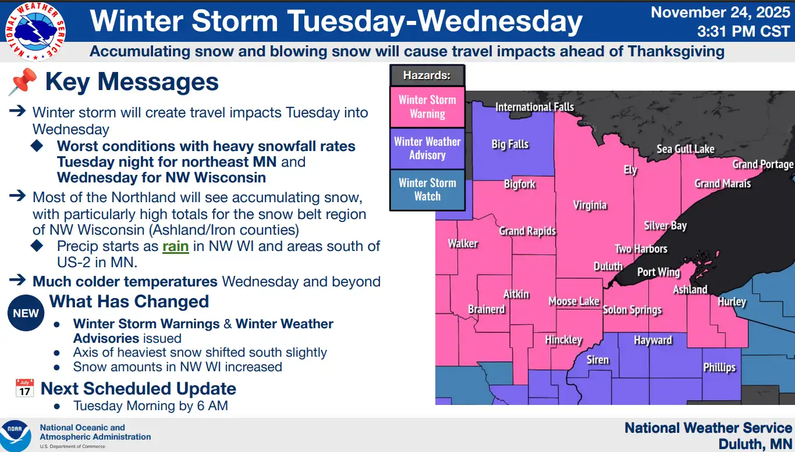
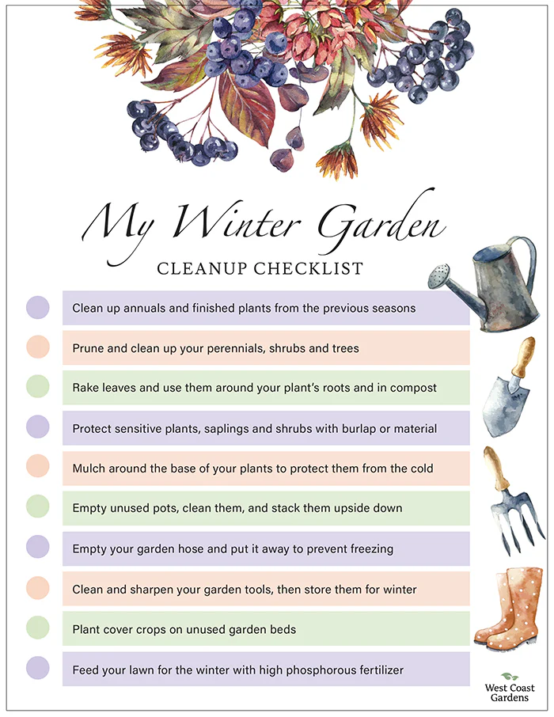
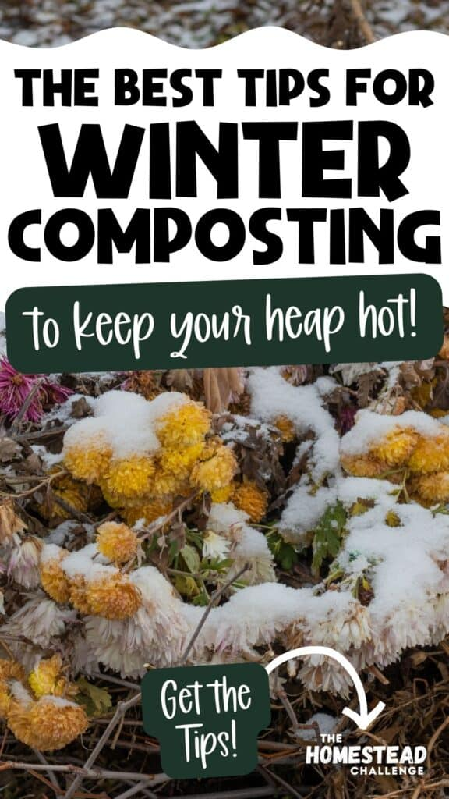

import GemeComposterCTA from '@site/src/components/GemeComposterCTA' 
import RelatedArticles from '@site/src/components/RelatedArticles'
import ReactPlayer from 'react-player'

According to [NOAA](https://www.wpc.ncep.noaa.gov/wwd/wso/), a winter storm warning is issued for central and northern Minnesota, especially the North Shore where terrain and lake-effects will enhance snowfall rates. Accumulating snow and blowing snow will cause travel impacts ahead of Thanksgiving.

When a winter storm rolls in — bringing snow, sleet, freezing rain, and plunging temperatures — most gardeners worry about plants, but few think about their compost piles. 

Can we compost in winter? Yes, but only by indoor electric Composter. Cold weather can shut down decomposition, leaving your food scraps rotting, saturating, or freezing. That’s where a GEME kitchen composter becomes a game-changer: it lets you compost indoors year-round, even when outdoor piles stall.

Here’s a practical guide for what to do when a winter storm warning is in effect — from protecting plants to keeping compost alive — and why using a GEME composter offers a safer, more reliable solution.

<!-- truncate -->

<h2 class="jump-to">Jump To</h2>

1. **[Why Winter Storm threatens Your Compost?](#1-why-winter-storm-threatens-your-compost-system)**

2. **[Why Use GEME Kitchen Composter in Winter?](#2-why-you-should-use-a-geme-kitchen-composter-in-winter)**

3. **[How to Protect Your Garden During A Winter Storm](#3-how-to-protect-your-outdoor-garden-during-a-winter-storm)**

4. **[Outdoor Compost Protecting Tips](#4-protecting-compost-outdoors-when-its-freezing)**

5. **[What to Do During A Winter Storm?](#5-what-to-do-during-a-winter-storm-warning-action-plan)**

6. **[Why Choose GEME Kitchen Composter During A Winter Storm?](#conclusion-why-geme-kitchen-composter-during-a-winter-storm)**

## 1. Why Winter Storm Threatens Your Compost System

  1. **Freezing Kills Microbial Activity**
  
  According to extension experts, decomposition slows dramatically when temperatures drop, and when a pile fully freezes, the microbial activity essentially stops. 

  2. **Heat Loss from the Core**
  
  Without insulation, outdoor compost piles can’t retain the warmth generated by bacteria and fungi. [That’s why successful winter composters like GEME wrap bins with straw or leaves](https://www.canr.msu.edu/news/compost_piles_will_warm_up_and_steam_in_the_winter?utm_source=chatgpt.com).

  3. **Moisture Overload from Snow Melt**
  
  Melting snow can saturate compost bins, leading to compaction and anaerobic conditions unless it’s properly ventilated or drained.

  4. **Anaerobic Breakdown or “Cold Composting”**
  
  In very cold months, the pile may revert to “cold composting,” where decomposition is nearly stopped or less efficient, especially for food scraps.
  
  5. **Risk of Pile Collapse or Bin Damage**
  
  Heavy snow and ice can collapse or warp lighter compost bins. Without planning, your compost system may physically fail just when you need it most.

## 2. Why You Should Use a GEME Kitchen Composter in Winter

[A GEME kitchen composter](https://www.geme.bio/?srsltid=AfmBOorv-q4A61iS3wfbAb_Yi7Pp6qVyBBcLBRIeKNsGGCa7ExErADZQ) offers several advantages when outdoor composting becomes unreliable under winter storm conditions:

- **Indoor Processing**: Unlike outdoor piles that can freeze solid, GEME operates indoors where temperatures remain stable.

- **Consistent Microbial Activity**: Its built-in microbe culture (like the “Kobold” strain) keeps breaking down food scraps, regardless of how cold it is outside.

- **No Heat Loss Risk**: You don’t need to worry about insulating or covering; the machine’s sealed design maintains ideal conditions.

- **No Pest or Wildlife Problem**: Meat, dairy, and other tricky scraps can be composted safely without attracting animals or rodents.

- **Year-Round Waste Reduction**: Throughout the winter storm, you can keep diverting kitchen waste into compost instead of sending it to the trash.

In short: when a winter storm warning is issued, GEME ensures your food scraps continue to decompose, even if your backyard pile is dormant. **In a GEME composter, you can simply drop your food waste or yard waste in — the machine handles moisture and breakdown automatically**.

<GemeComposterCTA 
 imgSrc="/img/geme-bio-composter.jpg"
 productTitle="GEME Kitchen Composter"
 features={[
    "✅ Best Way Of Composting in Winter",
    "✅ Quiet, Odour-Free, Real Compost",
    "✅ Rich Compost Output For Garden Soil & Plants",
    "✅ Reduce Landfill Waste & Greenhouse Gases"
 ]}
buttonText="Use GEME Kitchen Composter to Compost in Winter"
  href="https://www.geme.bio/product/geme?utm_medium=blog&utm_source=geme_website&utm_campaign=general_seo_content&utm_content=protect-garden-and-compost-from-winter-storm"
/>

## 3. How to Protect Your Outdoor Garden During a Winter Storm

While your indoor composter handles food scraps, don’t forget your plants. Here’s how to safeguard your garden when freezing weather is coming:

  1. **Bring Potted Plants Inside or Sheltered**
  
  If you have container plants, bring them into a garage, shed, or unheated basement. If that's not possible, wrap the pots with insulating materials like burlap or bubble wrap.
  
  2. **Cover Vulnerable Plants**
  
  Use frost blankets, horticultural fleece, or heavy sheets to cover perennials and shrubs. Ensure tops are covered, but allow some airflow to avoid condensation freezing.
  
  3. **Mulch Root Zones**
  
  Apply a thick (2–4 inch) layer of mulch — leaves, straw, or wood chips — around garden beds to help insulate roots against soil freezing.
  
  4. **Secure Garden Structures**
  
  Tie up trellises, secure trellised vines, and brace any support structures. Heavy snow and ice can put tremendous stress on garden architecture.
  
  5. **Drain Irrigation Lines & Hoses**
  
  Disconnect and drain hoses or irrigation systems so they won’t freeze, crack, or add weight to your garden.

## 4. Protecting Compost Outdoors When It’s Freezing

If you still use a backyard compost pile or bin, here are steps to protect it when cold weather hits:

- **Insulate the Pile**: Use straw bales, leaf piles or wood chips around the sides of your compost bin to trap heat.

- **Cover the Top**: Place a tarp or breathable lid to catch snow and keep the pile warmer. 

- **Adjust Moisture**: Check your compost like a “wrung-out sponge.” Too wet from melting precipitation? Add dry browns (like shredded leaves or cardboard). 

- **Limit Turning**: During freeze periods, [turn less often to avoid losing core heat](https://www.canr.msu.edu/news/compost_piles_will_warm_up_and_steam_in_the_winter?utm_source=chatgpt.com). 

- **Build a Larger Pile**: Bigger compost masses retain heat better. Experts recommend 3×3×3-foot piles or more for effective winter insulation. 

But even with these steps, some winter piles may simply “stall” — microbial activity slows, and added scraps may sit longer than months. That’s why combining outdoor methods with a GEME kitchen composter can be such a smart strategy.

## 5. What to Do During a Winter Storm Warning: Action Plan

When you hear a winter storm warning, follow these steps to maintain your compost momentum and protect your garden:

  1. **Switch to the GEME Composter**
  
  Begin placing your kitchen scraps directly into your GEME. This avoids dropping them into a frozen or waterlogged outdoor bin.
  
  2. **Pre-Insulate Your Outdoor Pile**
  
  Wrap your compost bin with straw or insulating material before the worst weather hits.
  
  3. **Cover and Seal**
  
  Use a tight lid or tarp to prevent snow and ice from penetrating your compost heap.
  
  4. **Reduce Turning Frequency**
  
  Avoid turning on very cold days; wait for a thaw or warmer mid-day.
  
  5. **Save Dry “Browns” Inside**
  
  Stockpile leaves, shredded paper, or straw indoors or in a dry area — you’ll need them to balance your compost and absorb moisture.
  
  6. **Maintain a Winter Scrap Bucket**
  
  Use a kitchen-safe, sealable bin to hold scraps when the weather is too severe to access your outdoor pile. Then transfer them to GEME once safe or manageable.

## Conclusion: Why GEME Kitchen Composter During A Winter Storm

Winter storms don’t have to mean the end of composting for the season. While outdoor compost piles struggle in the cold — slowing down significantly or even freezing completely — a GEME electric composter offers a reliable, indoor alternative that keeps food scraps active even when it's freezing outside. 

When a winter storm warning hits, act early: insulate your pile, switch to GEME for kitchen scraps, and treat your garden with extra care. Doing so not only helps you weather the storm but ensures you'll have rich compost ready for spring.

<RelatedArticles
  slugs={[
  "the-best-composter-to-reduce-food-waste",
  "compost-pile-vs-electric-composter",
  "how-to-make-bananas-last-longer",
  "how-long-do-blueberries-last-in-fridge",
  "how-long-do-apples-last-in-the-fridge",
  "can-i-compost-moldy-grapes",
  "best-black-friday-deals-on-geme-composter-2025",
  "can-you-compost-moldy-bread"
  ]}
/>

_Ready to transform your gardening game? Subscribe to our [newsletter](http://geme.bio/signup) for expert composting tips and sustainable gardening advice._

