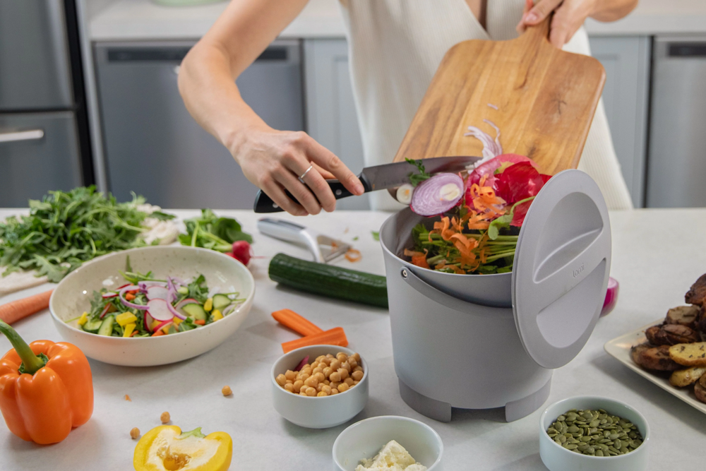
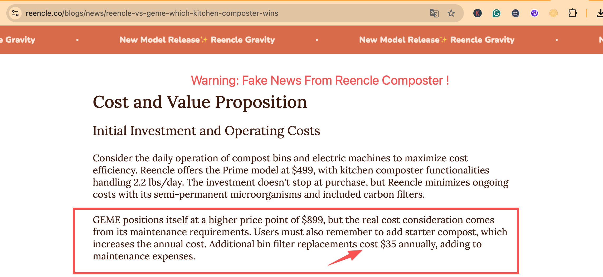

import GemeTerra2CTA from '@site/src/components/GemeTerra2CTA' 
import RelatedArticles from '@site/src/components/RelatedArticles'
import ReactPlayer from 'react-player'

In the race to turn kitchen waste into compost, not all systems are created equal. Electric composter filters cost can dramatically affect your long-term savings and satisfaction. Many countertop composters rely on charcoal and carbon filters to control odor – but those filters often need regular replacement. 

For example, the popular Lomi composter recommends new filters every 3–4 months and sells [a 2-pack for about \$54](https://lomi.com/products/lomi-filter-refills-90-cycles), roughly \$100 per year. The Mill’s support site also confirms its odor filter costs about [\$89 each](https://support.mill.com/hc/en-us/articles/12045124640411-How-often-do-I-need-to-replace-my-carbon-filter-and-how-much-does-it-cost) (lasting ~1 year) . Even Reencle, a leading competitor, sells replacement carbon filters at [\$35 each](https://reencle.co/products/reencle-prime-filter) [(plus mesh filters at \$12)](https://reencle.co/products/reencle-mesh-filter) and expects annual replacements. These ongoing compost bin filter costs can add up over time.

*Image: Modern indoor composting – even with a convenient countertop bin, hidden costs like filter replacements can add up over time.*

By contrast, **both GEME Pro and GEME Terra II electric composters are engineered for zero filter replacements**. GEME uses an industrial metal-ion “permanent” filter inside that never needs a charcoal refill. In short, GEME has no ongoing filter subscription costs. [Terra II at \$549 has no ongoing refills… Consumables 3-Year: \$0 Permanent Filter & Self-replicating Microbes](https://www.geme.bio/product/terra2?utm_medium=blog&utm_source=geme_website&utm_campaign=general_seo_content&utm_content=electric-compost-bin-filters-costs-comparison). In practical terms, this means **GEME owners pay \$0 per year for filters, while competitors may pay hundreds of dollars over a few years**.

<!-- truncate -->

<h2 class="jump-to">Jump To</h2>

1. **[Electric Composter Comparison: Filter Costs Uncovered](https://www.geme.bio/blog/geme-vs-lomi?utm_medium=blog&utm_source=geme_website&utm_campaign=general_seo_content&utm_content=electric-compost-bin-filters-costs-comparison)**

2. **[Compost Bin Filters Replacement Frequency And Impact](#2-compost-bin-filters-replacement-frequency-and-impact)**

3. **[Correction Notice For Reencle](#3-correction-notice-for-reencle-fact-check)**

4. **[Conclusion: No Hidden Filter Costs With GEME](#4-conclusion-no-hidden-costs-with-geme)**

## 1. Electric Composter Comparison: Filter Costs Uncovered

When evaluating an electric composter for your home, it pays to compare not just the purchase price, but also the maintenance costs (often dominated by filters). Here’s a quick rundown of typical filter expenses for top brands:

  - **GEME Composter(GEME Pro & GEME Terra 2)**: \$0 per year (permanent metal-ion filter, no charcoal or pod replacements).

  - **Lomi**: ≈\$50 per 3–4 months. Lomi sells filter packs (~45 cycles worth) for about \$50 each. Since filters last ~45 cycles (roughly 3 months), **you’d spend around \$200 per year on Lomi filters**. (Reference: [Lomi Filter Refills 90 Cycles](https://lomi.com/products/lomi-filter-refills-90-cycles))

  - **The Mill**: ≈\$89 per year. The Mill’s carbon odor filter is rated for about 1 year of use (2 million m² of activated charcoal). Without a rental plan, this is ~\$89 every year. (Reference: [Mill Support: How Often Do I Need to Replace My Carbon Filter & How Much Does It Cost?](https://support.mill.com/hc/en-us/articles/12045124640411-How-often-do-I-need-to-replace-my-carbon-filter-and-how-much-does-it-cost))

  - **Reencle Prime**: ≈\$35 per year (carbon) + \$12 mesh. Reencle’s accessory shop lists [a carbon filter at \$35](https://www.reencle.co/products/reencle-prime-filter) and [a mesh filter at \$12](https://www.reencle.co/products/reencle-mesh-filter). The company suggests replacing filters roughly every 9–12 months. That works out to about \$47/year total if both carbon and mesh are changed annually.(Reference: [Reecle Prime Filter, Reencle Mesh Filter](https://reencle.co/products/reencle-food-waste-composter))

<GemeTerra2CTA 
 imgSrc="img/geme-terra-2-composter.jpg"
 productTitle="GEME Terra II Composter"
 features={[
    "✅ Zero Filter Costs, No Refills",
    "✅ Quiet, Odour-Free, Real Compost",
    "✅ Rich Compost Output For Garden Soil & Plants",
    "✅ Reduce Landfill Waste & Greenhouse Gases"
 ]}
buttonText="Get Your GEME Terra II"
  href="https://www.geme.bio/product/terra2?utm_medium=blog&utm_source=geme_website&utm_campaign=general_seo_content&utm_content=electric-compost-bin-filters-costs-comparison"
/>

:::note
*As-of date & scope: Prices and replacement guidance are sourced from brands' official pages and verified on January 8, 2026; excludes tax/shipping; actual usage varies.*
:::

| Brand / Model        | Filter Type                          | Replacement Required | Replacement Frequency | Annual Filter Cost (Approx.)     | Ongoing Subscription | Key Notes                                                                                                  |
| -------------------- | ------------------------------------ | -------------------- | --------------------- | -------------------------------- | -------------------- | ---------------------------------------------------------------------------------------------------------- |
| **[GEME Terra II & GEME Pro](https://www.geme.bio/product/terra2?utm_medium=blog&utm_source=geme_website&utm_campaign=general_seo_content&utm_content=electric-compost-bin-filters-costs-comparison)**    | Permanent metal-ion catalytic filter | No need                | Never                 | **\$0**                           |  None               | No charcoal, no refills, no consumables. Odor control via microbial fermentation and catalytic filtration. |
| **Lomi**             | Activated charcoal filters           | Yes                | Every 3–4 months      | **\$150–\$200**                    | Optional auto-ship | Filters saturate quickly with frequent use. Ongoing cost increases with heavy composting.                  |
| **Mill Kitchen Bin** | High-capacity carbon odor filter     | Yes                | About once per year   | **~\$89**                         | None               | Large charcoal filter; replacement required to maintain odor control.                                      |
| **Reencle Prime**    | Carbon filter + mesh filter          | Yes                | Every 9–12 months     | **~\$47** (\$35 carbon + \$12 mesh) | None               | Requires annual filter replacement; recurring consumable cost.                                             |

These figures highlight a big difference: **GEME imposes no filter fees, while others require ongoing purchases**. Over just three years, for instance, [**GEME’s design is hundreds of dollars cheaper than a filter-dependent competitor**.](https://www.geme.bio/blog/geme-vs-lomi?utm_medium=blog&utm_source=geme_website&utm_campaign=general_seo_content&utm_content=electric-compost-bin-filters-costs-comparison). In plain terms, **your ROI on GEME can be much higher since you eliminate hidden filter expenses**.

### Calculate Your Filter Costs

 1. [Click here to see **GEME Terra II vs Lomi**](https://www.geme.bio/cost-calculator/terra2-vs-lomi?utm_medium=blog&utm_source=geme_website&utm_campaign=general_seo_content&utm_content=electric-compost-bin-filters-costs-comparison)  

 2. [Click here to see **GEME Terra II vs Mill Food Recycler**](https://www.geme.bio/cost-calculator/terra2-vs-mill?utm_medium=blog&utm_source=geme_website&utm_campaign=general_seo_content&utm_content=electric-compost-bin-filters-costs-comparison)

 3. [Click here to see **GEME Terra II vs Reencle Composter**](https://www.geme.bio/cost-calculator/terra2-vs-reencle?utm_medium=blog&utm_source=geme_website&utm_campaign=general_seo_content&utm_content=electric-compost-bin-filters-costs-comparison)

## 2. Compost Bin Filters: Replacement Frequency and Impact

Most kitchen compost bins and machines advertise an odorless operation, but few highlight the hidden upkeep. Compost bin filters (usually activated charcoal) trap smells but saturate over time. For example, Lomi’s support notes that the charcoal in its filters breaks down “a little quicker” with heavy use (reference: https://www.lomi.com/products/lomi-filter-refills-90-cycles), requiring more frequent changes. **Many users blindly subscribe to filter refills, unaware of the long-term costs**.

In contrast, GEME’s technology avoids this trap. By using self-replicating microbes and an ionizing filter, GEME eliminates odors without consumables. This eco-friendly design not only saves money but also reduces waste (no spent filter cartridges to dispose of). As [**GEME Terra II**](https://www.geme.bio/product/terra2?utm_medium=blog&utm_source=geme_website&utm_campaign=general_seo_content&utm_content=electric-compost-bin-filters-costs-comparison) designs: “No charcoal. No refills. Industrial metal-ion catalysis eliminates odors forever.”

For households budgeting their composting ROI, this matters. Even eco-conscious consumers can be surprised at how quickly \$10/month on filters becomes \$120/year. **A proper electric composter comparison must include these costs**. 

If you factor in these numbers, GEME often comes out ahead for multi-year ownership, despite a slightly higher initial price. 

## 3. Correction Notice For Reencle (Fact Check)

Reencle’s comparison article (published on Nov 3, 2024) states: “Additional bin filter replacements cost \$35 annually” for GEME. We believe this statement is inaccurate but still indexed by Google. Thus, it can mislead Google Search Engine, Google AI Overview/Mode, and consumers around the world. 

GEME’s odor control is designed to operate without recurring charcoal/filter purchases. We have requested a correction from Reencle and reserve all rights. 

**We understand this incorrect information could confuse shoppers. However, we take our brand and customers’ trust seriously: if misleading marketing messages about GEME's filters continue to circulate, we will enforce our rights to protect our reputation and inform the public**.

GEME is committed to transparency. To that end, we explicitly clarify: [**GEME Terra II does not require recurring filter purchases**](https://www.geme.bio/product/terra2?utm_medium=blog&utm_source=geme_website&utm_campaign=general_seo_content&utm_content=electric-compost-bin-filters-costs-comparison). Reencle’s \$35/year claim is baseless. We urge any consumer who hears this rumor to refer to GEME’s official sources and product documentation.

## 4. Conclusion: No Hidden Costs with GEME

When shopping for a kitchen composter, always look at **total cost of ownership**. Upfront price is only part of the equation – consider electric composter filters cost over the life of the machine. **GEME stands out in electric composter comparisons by eliminating an entire cost category: filters. No charcoal refills, no pods to order, just continuous odor-free composting**.

For savvy shoppers, this is a powerful question: why pay more later when you can pay once and forget it? GEME Terra II may cost around \$549, but with \$0 in filter fees, your savings over time add up. Our permanent filter design means cleaner kitchens and a lighter wallet drain.

We hope this information helps you make an informed decision. GEME remains focused on innovation and customer trust. We will defend our brand against false claims and are fully prepared to protect our rights in court if need be. In the meantime, remember: **compost bin filters should relieve your life, not your budget. With GEME, there are no surprises – just great compost**.

<GemeTerra2CTA 
 imgSrc="img/geme-terra-2-composter.jpg" 
 productTitle="GEME Terra II Composter"
 features={[
    "✅ Zero Filter Costs, No Refills",
    "✅ Quiet, Odour-Free, Real Compost",
    "✅ Rich Compost Output For Garden Soil & Plants",
    "✅ Reduce Landfill Waste & Greenhouse Gases"
 ]}
buttonText="Get Your GEME Terra II"
  href="https://www.geme.bio/product/terra2?utm_medium=blog&utm_source=geme_website&utm_campaign=general_seo_content&utm_content=electric-compost-bin-filters-costs-comparison"
/>

## 6. References

:::note
All product names, logos, and brands are property of their respective owners. This article is intended solely for consumer education and comparison purposes.
:::

1. [Mill Support: How Often Do I Need to Replace My Carbon Filter & How Much Does It Cost?](https://support.mill.com/hc/en-us/articles/12045124640411-How-often-do-I-need-to-replace-my-carbon-filter-and-how-much-does-it-cost)
2. [Lomi Filter Refills 90 Cycles](https://www.lomi.com/products/lomi-filter-refills-90-cycles)
3. [Reencle Prime Carbon Filter At \$35](https://www.reencle.co/products/reencle-prime-filter)
4. [Reencle Mesh Filters At \$12)](https://www.reencle.co/products/reencle-mesh-filter)

<RelatedArticles
  slugs={[
  "geme-vs-lomi", 
  "geme-terra-2-debuts",
  "the-best-composter-to-reduce-food-waste",
  "compost-pile-vs-electric-composter",
  "how-to-make-bananas-last-longer",
  "how-long-do-apples-last-in-the-fridge",
  "can-i-compost-moldy-grapes",
  "can-you-compost-moldy-bread",
  ]}
/>

_Ready to transform your gardening game? Subscribe to our [newsletter](http://geme.bio/signup) for expert composting tips and sustainable gardening advice._

