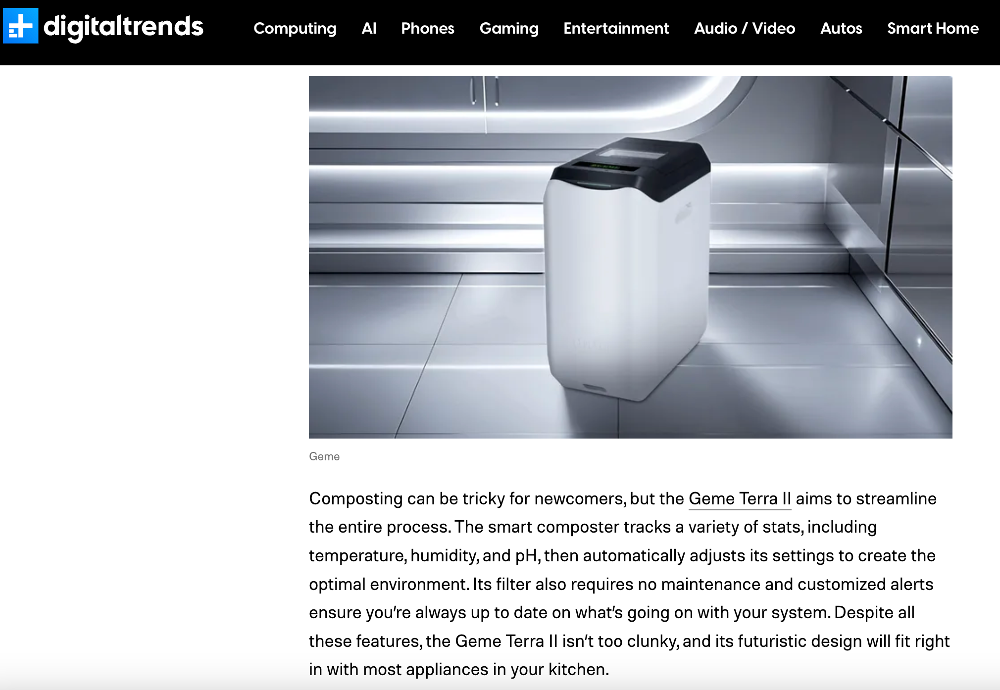
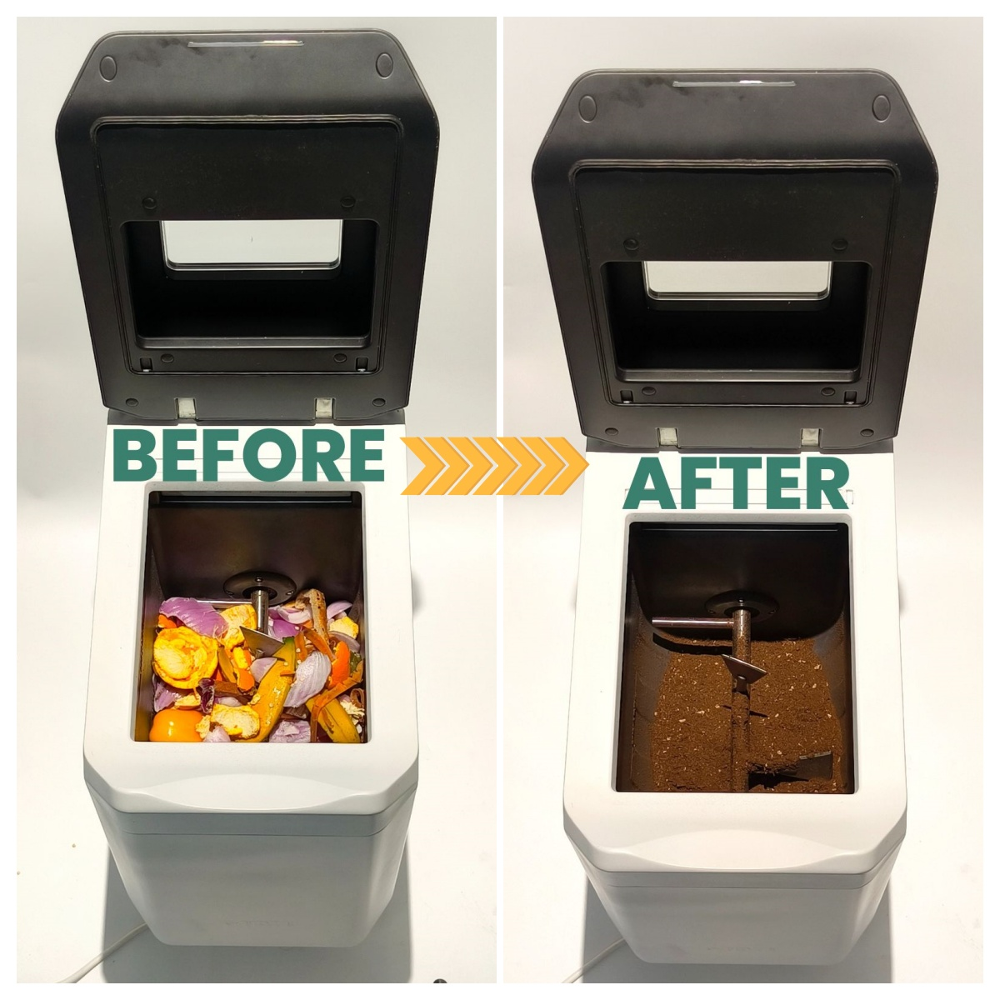
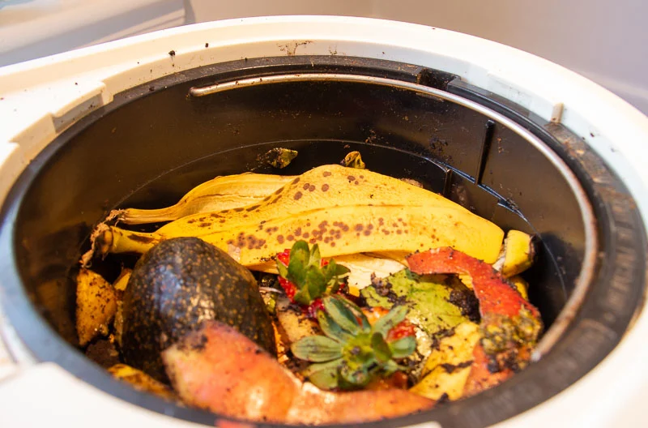

import GemeTerra2CTA from '@site/src/components/GemeTerra2CTA' 
import RelatedArticles from '@site/src/components/RelatedArticles'
import ReactPlayer from 'react-player'

If you are comparing **Geme Terra 2** and **Lomi**, you are probably looking for one thing: a smarter way to deal with kitchen scraps at home.

All Lomi models are often described as a **countertop composter**, whereas **GEME Terra II** is a **kitchen composter**. They do not work in the same way. That difference matters. If your goal is a more practical **zero waste** lifestyle, less smell in the kitchen, and a better end product for plants or soil, it is important to understand what each machine actually does.

In this guide, we compare **Geme Terra 2 vs Lomi**, including how they work, what kind of output they create, how much food waste they can handle, and which type of home each machine fits best.

<!-- truncate -->

## Reviewers Say

One reviewer, [**Helen Rosner from The New Yorker**](https://www.newyorker.com/culture/annals-of-gastronomy/the-promises-of-the-home-composting-machine) noted, Lomi’s output was **“dark-brown, crumbly dust”, “not compost, exactly”**. Lomi excels at reducing volume, but **[Terra II](https://www.geme.bio/product/terra2?utm_medium=blog&utm_source=geme_website&utm_campaign=general_seo_content&utm_content=geme-vs-lomi)’s** biological process produces a nutrient-rich fertilizer you can mix straight into plants. Let’s compare their features head-to-head.

## Quick Answer: Geme Terra 2 vs Lomi

If you want a machine that continuously handles food scraps and is designed around microbial composting, [**Geme Terra 2**](https://www.geme.bio/product/terra2?utm_medium=blog&utm_source=geme_website&utm_campaign=general_seo_content&utm_content=geme-vs-lomi) is the stronger option according to GEME’s own product specifications. Terra 2 uses AI-sensors to manage heat, oxygen, and moisture, supports a 14L chamber, allows continuous feeding, uses a permanent filter, and is designed to turn food waste into a soil-like amendment in hours. 

<GemeTerra2CTA 
 imgSrc="/img/geme-terra-2-composter.jpg"
 productTitle="GEME Terra II Composter"
 features={[
    "✅ Winner of the Best Kitchen Composters",
    "✅ Quiet, Odour-Free, Real Compost",
    "✅ Rich Compost Output For Garden Soil & Plants",
    "✅ Reduce Landfill Waste & Greenhouse Gases"
 ]}
buttonText="Get Your GEME Terra II"
  href="https://www.geme.bio/product/terra2?utm_medium=blog&utm_source=geme_website&utm_campaign=general_seo_content&utm_content=geme-vs-lomi"
/>

If you want a compact electric food recycler that heats, dries, and grinds scraps in batches, **Lomi** is a simpler alternative. [Lomi’s official product page]((https://lomi.com/products/lomi-3-food-recycler)) describes the machine as a food recycler with a 3-liter capacity, two processing modes plus a cleaning cycle, and a filter system that lasts about 45 cycles. Lomi also says the output is, technically, **“pre-compost,”** not finished compost. 

So the short version is this:

 - Choose **Geme Terra 2** if you want a more compost-like, continuous, microbial approach.

 - Choose **Lomi** if you want to dry and reduce food waste volume in batches.

## Why This Comparison Matters for Zero Waste Living

The phrase **zero waste** is often used loosely. In reality, no kitchen device makes waste disappear. But composting and food waste diversion can still be meaningful. The [U.S. EPA](https://www.epa.gov/sustainable-management-food/composting) says composting helps reduce trash sent to landfills, returns nutrients to soil, and can reduce methane emissions associated with landfilled organic waste. [The EPA also notes that food is the single most common material landfilled in U.S. municipal solid waste](https://www.epa.gov/recycle/preventing-wasted-food-home). 

That is why choosing the right **countertop composter** or **kitchen composter** matters. The best machine is not just the one with the nicest design. It is the one that fits your kitchen habits, your tolerance for maintenance, and the kind of output you actually want to use.

## Geme Terra 2 vs Lomi: Side-by-Side Comparison

| **Feature** | **Geme Terra 2** | **Lomi** |
|---|---|---|
| **Core method** | Microbial composting with AI-sensor-managed heat, oxygen, and moisture | Heat, grinding, airflow, and drying |
| **Feeding style** | Continuous-feed design | Batch processing |
| **Claimed chamber/capacity** | 14L chamber; up to 2kg/day | 3L capacity |
| **Output positioning** | Soil-like amendment / real microbial composting approach | “Pre-compost” / Lomi Earth / Not Compost |
| **Filters** | Permanent filter | Filters included for about 45 cycles |
| **Noise** | 35–40 dB | Lomi 3: 45 dB |
| **Best fit** | Higher-volume daily kitchen scrap handling | Small-batch food waste reduction |

Sources: GEME product pages and Lomi official product page.

<GemeTerra2CTA 
 imgSrc="/img/geme-terra-2-composter.jpg"
 productTitle="GEME Terra II Composter"
 features={[
    "✅ Winner of the Best Kitchen Composters",
    "✅ Quiet, Odour-Free, Real Compost",
    "✅ Rich Compost Output For Garden Soil & Plants",
    "✅ Reduce Landfill Waste & Greenhouse Gases"
 ]}
buttonText="Get Your GEME Terra II"
  href="https://www.geme.bio/product/terra2?utm_medium=blog&utm_source=geme_website&utm_campaign=general_seo_content&utm_content=geme-vs-lomi"
/>

## How Geme Terra 2 Works

**Geme Terra 2** is built around microbial decomposition rather than simple drying. The system uses AI-assisted sensors to maintain the right environment for microbes by adjusting oxygen, moisture, and temperature. GEME Terra 2 is also designed for continuous feeding, meaning you can add scraps without waiting for a full cycle to end. 

That matters for daily life. If you cook often, generate vegetable peels every day, or want one machine to stay active in the background, a continuous system is much easier to live with than a strict batch machine.

### Easy “Toss, Wait, Harvest” Operation

1. **Toss It In**. Simply scrape your food scraps (even meat, dairy, or small bones) into the GEME Terra II. The 14L tank holds up to 45+ days’ worth of waste.

2. **Walk Away**. GEME’s built-in AI and sensors automatically manage heat, oxygen and moisture. There are no complicated buttons – just press to start one of three modes and forget it.

3. **Harvest Compost**. In 6–8 hours (depending on mode and material), the machine converts scraps into a dark soil-like amendment. You simply scoop it out and mix it into your garden or potted plants.

This “Add & Forget” experience fits busy lives: **Terra II only needs emptying every 1–2 months (95% of waste volume is reduced)**. Throughout this cycle the system stays whisper-quiet (≤40 dB) so it won’t disturb your household. Overall, GEME Terra II delivers a high-tech, low-effort composting solution that traditional dehydrators (like Lomi) simply can’t match.

### Why that matters in practice

For many households, the real pain point is not just “Can this machine process scraps?” It is:

 - Can I add scraps anytime?

 - Will it smell?

 - Do I need refill parts all the time?

 - Can the output go into soil with less extra handling?

Geme positions Terra 2 around those exact use cases, with a permanent filter and continuous-feed workflow.

<GemeTerra2CTA 
 imgSrc="/img/geme-terra-2-composter.jpg"
 productTitle="GEME Terra II Composter"
 features={[
    "✅ Winner of the Best Kitchen Composters",
    "✅ Quiet, Odour-Free, Real Compost",
    "✅ Rich Compost Output For Garden Soil & Plants",
    "✅ Reduce Landfill Waste & Greenhouse Gases"
 ]}
buttonText="Get Your GEME Terra II"
  href="https://www.geme.bio/product/terra2?utm_medium=blog&utm_source=geme_website&utm_campaign=general_seo_content&utm_content=geme-vs-lomi"
/>

## How Lomi Works

**Lomi** works differently. On its official page, Lomi says the machine begins by **heating and grinding** food waste, while sensors help manage temperature and moisture and airflow helps with odor control. Lomi 3 offers two main food recycling modes plus a cleaning cycle, and its official specs list a **3-liter capacity**.

This makes Lomi easy to understand: load the bucket, run a cycle, and get a dry, reduced output.

That output is useful, but the wording matters. Lomi’s own site says that what comes out is technically **pre-compost**. Review coverage aligns with that distinction. In [*The New Yorker*, Helen Rosner](https://www.newyorker.com/culture/annals-of-gastronomy/the-promises-of-the-home-composting-machine) described Lomi’s output as “not compost, exactly,” while [Serious Eats](https://www.seriouseats.com/lomi-composter-review-11889800) recently wrote that the machine is better understood as a dehydrator and grinder than a one-step composting solution. 

## Is Lomi Really a Composter?

This is one of the most searched questions around the **Lomi composter**, and it deserves a clear answer.

Lomi is commonly marketed and discussed as a countertop composter, but even Lomi’s own current product copy says its output is **pre-compost**. Independent reviewers have made similar distinctions:

- [*The New Yorker*](https://www.newyorker.com/culture/annals-of-gastronomy/the-promises-of-the-home-composting-machine) described the result as “not compost, exactly.”

- [Serious Eats](https://www.seriouseats.com/lomi-countertop-composter-review-7098305) said Lomi is more of a food dehydrator and grinder than a true one-step composter.

- [WIRED](https://www.wired.com/story/home-composters-buying-guide) describes Lomi 3 as a **grind-and-dry food recycler** and says that if you want something closer to compost, other products may be a better fit.

So, from a credibility standpoint, the most accurate language is this:

> Lomi is an electric food recycler that reduces and dries food scraps.  
>
> Geme Terra 2 is a microbial kitchern composter designed to produce a more compost-like soil amendment. 

## Capacity: Which Countertop Composter Handles Real Family Waste Better?

Capacity is one of the biggest practical differences in **Geme vs Lomi**.

Lomi’s official page lists a **3-liter** capacity. GEME Terra 2 has a **14L chamber** and can process **up to 2kg per day**. 

That means the choice depends on your home:

### Lomi may fit you better if:
 
 - You live alone or as a couple

 - You want small, neat batch processing

 - Your main goal is just reducing food waste volume

### Geme Terra 2 may fit you better if:

 - You cook frequently

 - You generate scraps daily

 - You want a more continuous, less stop-start workflow

 - You care about a more compost-oriented output

<GemeTerra2CTA 
 imgSrc="/img/geme-terra-2-composter.jpg"
 productTitle="GEME Terra II Composter"
 features={[
    "✅ Winner of the Best Kitchen Composters",
    "✅ Quiet, Odour-Free, Real Compost",
    "✅ Rich Compost Output For Garden Soil & Plants",
    "✅ Reduce Landfill Waste & Greenhouse Gases"
 ]}
buttonText="Get Your GEME Terra II"
  href="https://www.geme.bio/product/terra2?utm_medium=blog&utm_source=geme_website&utm_campaign=general_seo_content&utm_content=geme-vs-lomi"
/>

## Noise, Maintenance, and Ongoing Costs

These details strongly affect user satisfaction.

Lomi 3’s official page says the machine runs at **under 45 dB**, while GEME Terra 2 runs around **35–40 dB**. Both are positioned as relatively quiet for indoor kitchen use. 

The bigger maintenance difference is filtration and consumables:

 - **Lomi** includes filters for about **45 cycles**, meaning replacement filters are part of long-term ownership, which can cost hundreds of dollars for users. 

 - **Geme Terra 2** uses a **permanent filter**, which reduces refill dependency, meaning no ongoing costs at all. 

That does not automatically make one better for everyone, but for users comparing long-term convenience, Terra 2 has a stronger value story.

### Pay $50 more, Save much more

Terra II at \$549 has no ongoing refills, so the extra \$50 can pay back in about 3 months, up to \$550 cheaper to own. And it makes soil, not just smaller trash.

| Cost Category            | **Lomi**                                      | **GEME Terra II**                                   |
|-------------------------|-------------------------------------------|-------------------------------------------------|
| Machine Cost            | \$499                                      | \$549                                            |
| Consumables (3-Year)    | \$600 (Charcoal Filters & Microbe Pods)    | \$0 (Permanent Filter & Self-replicating Microbes)|
| 3-Year Total            | \$1099                                     | \$549                                            |

In summary, GEME Terra II not only handles more waste but also provides real compost, all with quieter, smarter operation. The table below from GEME highlights some of these advantages:

| Feature               | **GEME Terra 2**                       | **Lomi Composter**                           |
|-----------------------|------------------------------------|------------------------------------------|
| **Working Mode**      | Continuous microbial composting     | Periodic grinding/dehydrating            |
| **End Result**        | True living soil                    | Dried, sterile waste / Lomi Dust                    |
| **Interaction**       | Add scraps anytime                  | Wait for cycle completion                |
| **Filter System**     | Permanent (no refills)              | Replaceable carbon filter (every ~3 months) for \$50 each    |
| **Days to Fill**      | 45+ days                            | ~1 day (per fill)                        |
| **Sound Level**       | 35–40 dB                            | 45 dB                                   |
| **Energy Cost**       | 58.3Wh (like a laptop)              | 500Wh+ (like an oven)                    |
| **Accepts Liquids/Meat** | Yes (up to 2 kg per load)        | Limited                                       |

<GemeTerra2CTA 
 imgSrc="/img/geme-terra-2-composter.jpg"
 productTitle="GEME Terra II Composter"
 features={[
    "✅ Winner of the Best Kitchen Composters",
    "✅ Quiet, Odour-Free, Real Compost",
    "✅ Rich Compost Output For Garden Soil & Plants",
    "✅ Reduce Landfill Waste & Greenhouse Gases"
 ]}
buttonText="Get Your GEME Terra II"
  href="https://www.geme.bio/product/terra2?utm_medium=blog&utm_source=geme_website&utm_campaign=general_seo_content&utm_content=geme-vs-lomi"
/>

## What Reviewers and Experts Suggest

Independent reviews are useful because they often highlight the gap between marketing language and daily reality.

Recent coverage from Serious Eats says Lomi is effective for odor-controlled food waste reduction, but not ideal for people who want true finished compost directly from one machine. 

WIRED’s current buying guide calls Lomi 3 the **best grind-and-dry food recycler**, which is a more precise and credible description than simply calling it a composter. WIRED also notes that if your goal is something closer to actual compost, Lomi may not be the best fit.

This is exactly why the **Geme Terra 2 vs Lomi** comparison is useful: these products may look similar in search results, but they solve different problems.

## Which One Is Better for a Zero Waste Kitchen?

If your definition of **zero waste** is “I want to shrink and dry my food scraps before disposal or secondary composting,” Lomi can work well.

If your definition is “I want to turn daily kitchen scraps into something closer to a usable soil amendment through a microbial process,” **Geme Terra 2** is the stronger fit based on its product design and positioning. 

That makes Terra 2 especially appealing for:

 - gardeners

 - families

 - apartment users who still want a compost-oriented result

 - buyers comparing alternatives to the typical grind-and-dry countertop composter

 - people who hate hidden ongoing costs like filter costs

## Final Verdict: Geme Terra 2 vs Lomi

Both machines help reduce kitchen food waste, but they do it in different ways.

**Lomi** is best understood as a sleek electric food recycler that heats, dries, and grinds scraps into a reduced output that can later be used or further composted. Lomi’s own site calls that output **pre-compost**. Meanwhile, Lomi composter requires hundreds of dollars for filter replacements, which makes it much more expensive than you see from the upfront cost. 

**Geme Terra 2** is the better choice if you want a **kitchen composter** built around microbial action, continuous use, a larger chamber, no ongoing costs, and a stronger composting narrative for a **zero waste** home. GEME Terra 2 is designed to create a soil-like amendment in hours with continuous-feed convenience and no filter replacements. 

<GemeTerra2CTA 
 imgSrc="/img/geme-terra-2-composter.jpg"
 productTitle="GEME Terra II Composter"
 features={[
    "✅ Winner of the Best Kitchen Composters",
    "✅ Quiet, Odour-Free, Real Compost",
    "✅ Rich Compost Output For Garden Soil & Plants",
    "✅ Reduce Landfill Waste & Greenhouse Gases"
 ]}
buttonText="Get Your GEME Terra II"
  href="https://www.geme.bio/product/terra2?utm_medium=blog&utm_source=geme_website&utm_campaign=general_seo_content&utm_content=geme-vs-lomi"
/>

So if you are choosing between **Geme Terra 2** and **Lomi**, the better option depends on your goal:

- Want batch drying and food waste reduction? Choose **Lomi**.

- Want a more compost-oriented, microbial, continuous system? Choose **Geme Terra 2**.

## FAQ (Answered)

### Is Geme Terra 2 better than Lomi?

For users who want continuous microbial processing, a larger chamber, no hidden costs, and a more compost-oriented output, **Geme Terra 2** is the better fit. For users who mainly want to dry and reduce scraps in batches, **Lomi** may be enough. 

### Is Lomi a real composter?

No. While Lomi is widely marketed as a composter, its own official page says the output is technically **pre-compost**, not real compost. Independent reviews also describe it more as a dehydrator and grinder than a one-step composting solution. 

### What is the best countertop composter for zero waste homes?

That depends on what you mean by zero waste. If you want a microbial system designed to create a soil-like amendment, **Geme Terra 2** is the better match. If you want simpler batch-based food waste reduction, **Lomi** is a practical option. 

## 8. References

1. [GEME Terra 2 Official Page](https://www.geme.bio/product/terra2?utm_medium=blog&utm_source=geme_website&utm_campaign=general_seo_content&utm_content=geme-vs-lomi)

2. [The New Yorker: Helen Rosner](https://www.newyorker.com/culture/annals-of-gastronomy/the-promises-of-the-home-composting-machine)

3. [Serious Eats: recent Lomi review](https://www.seriouseats.com/lomi-composter-review-11889800)

4. [Serious Eats: earlier Lomi review](https://www.seriouseats.com/lomi-countertop-composter-review-7098305)

5. [WIRED: Best Kitchen Composters and Food Recyclers](https://www.wired.com/story/home-composters-buying-guide)

6. [U.S. EPA: Composting](https://www.epa.gov/sustainable-management-food/composting)

7. [U.S. EPA: Preventing Wasted Food at Home](https://www.epa.gov/recycle/preventing-wasted-food-home)

<RelatedArticles
  slugs={[
  "geme-terra-2-debuts",
  "the-best-composter-to-reduce-food-waste",
  "compost-pile-vs-electric-composter",
  "how-to-make-bananas-last-longer",
  "how-long-do-blueberries-last-in-fridge",
  "how-long-do-apples-last-in-the-fridge",
  "can-i-compost-moldy-grapes",
  "best-black-friday-deals-on-geme-composter-2025",
  "can-you-compost-moldy-bread",
  "protect-garden-and-compost-from-winter-storm"
  ]}
/>

_Ready to transform your gardening game? Subscribe to our [newsletter](http://geme.bio/signup) for expert composting tips and sustainable gardening advice._

