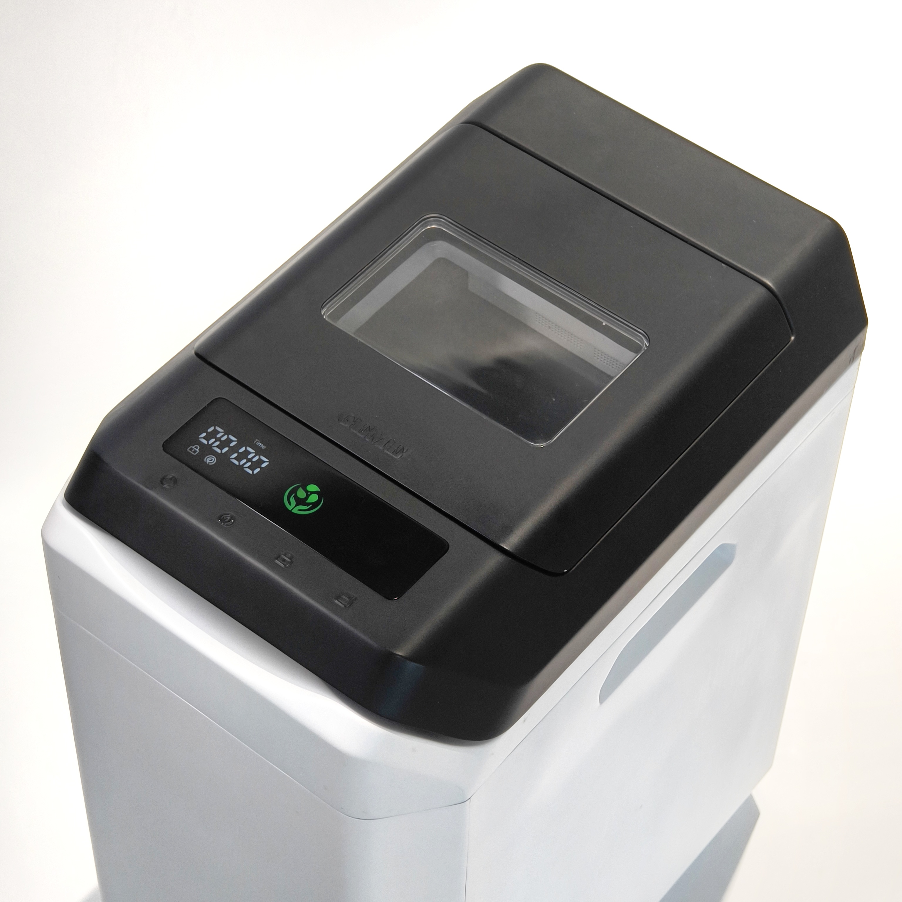

import GemeTerra2CTA from '@site/src/components/GemeTerra2CTA' 
import RelatedArticles from '@site/src/components/RelatedArticles'
import ReactPlayer from 'react-player'

You’re not buying a kitchen composter because you love appliances. You’re buying it because your trash can smells like a crime scene by day two, and you’re tired of carrying wet scraps outside like a sad raccoon. So, let’s do this properly.

This is a buyer-first comparison between GEME Terra II and Reencle Prime—two microbial composters (yes, Reencle is microbial). The real difference is: **Which one fits your life with less effort, less refills, and fewer “why is it wet?” moments**.

If you want the short answer: **most households should buy Terra II because it’s built around higher daily capacity and lower maintenance**, and that’s what makes people actually keep using a composter.

## The 90-Second Truth

 ### 1. Output expectation matters more than speed
  
  Two machines can reduce volume quickly, but still produce very different “end states” (**finished compost vs. partially stabilized residue that benefits from curing**).

 ### 2. Daily capacity and routine should match your kitchen
  
  Reencle commonly recommends an optimal daily input of **~0.7 kg** (max ~1.0 kg), whereas GEME Terra II's max daily input can be up to **~2.0 kg**. If your household produces more scraps, “continuous handling” and capacity become decision drivers.

 ### 3. Maintenance isn’t just cleaning, it’s consumables

  Reencle documentation commonly recommends carbon filter replacement every ~9–12 months, depending on use. (For any brand, ongoing costs add up and should be evaluated as TCO.) GEME Terra II doesn't have any ongoing consumables. 

<!-- truncate -->

## Quick Comparison Summary

| **Dimension**                             | **GEME Terra 2**                                                     | **Reencle Prime**                                                                      |
| ------------------------------------- | ---------------------------------------------------------------- | ---------------------------------------------------------------------------------- |
| **Core approach**                         | Continuous composting workflow (positioned as “real composting”) | Warm microorganism-based composting (~55–60°C)                       |
| **Best fit for**                          | Daily cooks who want a steady “waste-to-soil” habit              | Users who want warm, microbe-driven processing with a defined daily input guidance |
| **Daily input guidance**                  | ~2.0 kg/day                                | Optimal ~0.7 kg/day; max ~1.0 kg/day                     |
| **Odor control & consumables**            | Permanent Metal-ion filter (no replacements or purchases of filter required)                         | Carbon filter typically replaced ~9–12 months                       |

<GemeTerra2CTA 
 imgSrc="/img/geme-terra-2-composter.jpg"
 productTitle="GEME Terra II Composter"
 features={[
    "✅ Zero Filter Costs, No Refills",
    "✅ Quiet, Odour-Free, Real Compost",
    "✅ Rich Compost Output For Garden Soil & Plants",
    "✅ Reduce Landfill Waste & Greenhouse Gases"
 ]}
buttonText="Get Your GEME Terra II"
  href="https://www.geme.bio/product/terra2?utm_medium=blog&utm_source=geme_website&utm_campaign=general_seo_content&utm_content=best-kitchen-composter-2026"
/>

## What “Real Compost” Means (and why buyers get confused)

A lot of “kitchen composting” content mixes these ideas:

 - Volume reduction (it looks smaller)

 - Moisture reduction (it looks drier)

 - Biological stabilization (it stops smelling and becomes soil-friendly)

 - Maturity (it behaves like compost in soil, not just “dried scraps”)

A fair comparison must separate marketing terms from user outcomes:

 - What does the output look like after a week?

 - Does it need curing time?

 - How often do you harvest?

 - How stable is it for soil use?

**GEME**: Terra 2 is built around “real compost” and a continuous routine.
**Reencle**: Reencle describes microbe-based composting at a warm temperature band, not simple dehydration.

## Core Technology Difference

###  How GEME Terra 2 Works

GEME Terra 2 uses a **biological composting process** that mimics natural soil ecosystems:

 - Microbial decomposition

 - Continuous oxygen circulation

 - Low-temperature operation

 - Natural moisture regulation

Food waste is broken down gradually, resulting in **actual compost suitable for soil use**. Because the system runs continuously, users can add scraps at any time — even during operation.

### How Reencle Prime Works (based on their published docs)

Reencle presents its process as:

 - composting with microorganisms

 - operating in a warm internal range around 55–60°C to support decomposition

 - with recommended daily input guidance (optimal ~0.7 kg/day; max ~1.0 kg/day)

This is important because it’s different from “high-heat sterilize + dry.” If you’re evaluating systems, ask: Is the machine trying to keep microbes active—or cook them off? Reencle explicitly argues for microbe-friendly conditions versus dehydrator-style sterilization.

## How fast does food waste disappear? (Decomposition Speed)

### Reencle Prime

  - Standard cycle: ~24 Hours.

  - Continuous processing.

### GEME Terra 2

  - Rapid breakdown: 6–8 Hours.

  - Continuous processing.

  - **Benefit**: Faster turnover for next meal.

GEME Terra 2 is designed for a 6-8 hour visible breakdown cycle; Reencle operates on a standard 24-hour digestion cycle. Faster turnover means higher effective daily capacity.

## What powers the breakdown? (Biology)

### Reencle Prime

  - Synthetic / Artificial microbes.

  - Lab-formulated for home stability.

### GEME Terra 2

  - Natural / Industrial-Verified Kobold.

  - Adapted from large-scale biological treatment.

  - **Benefit**: Robust digestion of tough scraps.

Reencle uses synthetic biology; GEME uses industrial-grade natural microbes. If you want verified industrial power at home, GEME is the choice. [**Learn about Kobold →**](https://www.geme.bio/geme-kobold?utm_medium=blog&utm_source=geme_website&utm_campaign=general_seo_content&utm_content=best-kitchen-composter-2026)

## Same 14L, different build? (Density & Weight)

|                  | **Reencle Prime**               | **GEME Terra 2**                          |
|------------------|---------------------------------|--------------------------------------------|
| **Weight**       | ~9 kg                           | ~12 kg                                     |
| **Build**        | Lightweight consumer chassis    | Dense insulation for thermal stability     |

While both cite ~14L volume, GEME is 3kg heavier (~12kg vs 9kg), utilizing denser materials for thermal retention and stability.

## Compost Output — What Do You Actually Get?

### Terra 2 Output

- **Up to 95% volume reduction**

- Compost can be harvested every **1–2 months**

- Suitable for gardens, planters, or soil blending

- No secondary processing required

This makes Terra 2 appealing to users who want **true waste-to-soil conversion at home**.

### Reencle Output

- Dry, lightweight residue

- Reduced odor and volume

- Requires further composting if soil use is desired

For users without gardening needs, this may be sufficient, but it’s important to understand the distinction.

## Capacity & Daily Use Experience

### Continuous vs Batch Processing

**GEME Terra 2**

- Published capacity: **up to 2kg per day**

- Waste can be added anytime

- Designed for daily cooking households

**Reencle**

- Cycle-based processing

- Waste is added, then processed as a batch

- Less flexible during active cycles

### Why This Matters

Households that cook frequently tend to prefer **continuous systems**, while light-use kitchens may be comfortable with batch-style processing.

## Filters, Maintenance & Long-Term Cost

Reencle user manuals recommend annual carbon filter replacement. GEME uses a permanent metal-ion filter designed for the machine's lifetime.

### GEME Terra 2 Ownership Model

 - One-time purchase

 - **Permanent metal-ion catalytic filter**

 - No mandatory subscriptions

 - Minimal ongoing costs

### Reencle Maintenance Model

 - Replaceable carbon filters

 - Periodic maintenance required

 - Long-term costs depend on usage and filter replacement frequency

[Click here to **Calculate Your Cost**](https://www.geme.bio/cost-calculator/terra2-vs-reencle?utm_medium=blog&utm_source=geme_website&utm_campaign=general_seo_content&utm_content=best-kitchen-composter-2026)

## Which One Should You Choose?

### Choose Reencle if:

 - You want fast, automated drying

 - You don’t need finished compost

 - You prioritize convenience over compost quality

### Choose GEME Terra 2 if:

 - You want **real compost**, not just waste reduction

 - You cook often and generate daily food scraps

 - You prefer ownership without recurring fees

<GemeTerra2CTA 
 imgSrc="/img/geme-terra-2-composter.jpg"
 productTitle="GEME Terra II Composter"
 features={[
    "✅ Zero Filter Costs, No Refills",
    "✅ Quiet, Odour-Free, Real Compost",
    "✅ Rich Compost Output For Garden Soil & Plants",
    "✅ Reduce Landfill Waste & Greenhouse Gases"
 ]}
buttonText="Get Your GEME Terra II"
  href="https://www.geme.bio/product/terra2?utm_medium=blog&utm_source=geme_website&utm_campaign=general_seo_content&utm_content=best-kitchen-composter-2026"
/>

## Common Buyer Misunderstandings

### 1. “All kitchen composters make compost”
Not true. Many systems dry or grind waste but stop short of biological composting.

### 2. “Faster processing is always better”
Speed often comes at the cost of compost maturity and soil usability.

### 3. “Maintenance costs are minor”
Filters and consumables add up over time.

## FAQ

### 1. Does Reencle make real compost?
Reencle primarily dries food waste. The output may require further composting before soil use.

### 2. Is GEME Terra 2 suitable for apartments?
Yes. It’s designed for indoor, floor-standing use with low noise.

### 3. How often do you empty Terra 2?
Typically every **1–2 months**, depending on usage.

### 4. Does Terra 2 require filter replacement?
No. The filter is permanent.

## Final Decision

If your goal is **true composting with minimal long-term cost**,  
**GEME Terra 2** offers a more complete waste-to-soil solution.

If your goal is **clean, fast waste reduction with automation**,  
**Reencle** may better match your expectations.

## Practical Decision Rules

 1. **The "Pet Owner" Rule**
 If you have pets in the kitchen, GEME's intentional foot-switch prevents accidental openings better than a motion sensor.

 2. **The "Heavy Chef" Rule**
 If you cook daily for 3+ people, GEME's 2kg capacity handles the load better than Reencle's 0.7kg standard recommendation.

 3. **The "Mobility" Rule**
 If you need to move the unit frequently, Reencle (9kg) is lighter and easier to lift than GEME (12kg).

## Verified Sources (Pricing & Specs)

[1] **Lid Mechanism Specs**. <a href="https://reencle.co/products/reencle-food-waste-composter" rel="nofollow">Reencle Prime product page (Motion Sensor)</a> vs GEME Terra 2 manual (Foot Switch). Accessed Jan 2026.

[2] **Filter Maintenance**. <a href="https://help.reencle.co/en-US/reencle-instruction-manual-and-guidesheet-download-160282" rel="nofollow">Reencle User Manual (p.14: "Replace filter every 9-12 months")</a>. GEME Technology Page ("Permanent Filter"). Accessed Jan 2026.

[3] **Physical Specs**. Net Weight: Reencle (~9kg) vs GEME (~12kg). Daily Capacity: Reencle (~0.7kg/1.5lb) vs GEME (~2kg). Accessed Jan 2026.

[4] **Activation Process**. <a href="https://help.reencle.co/en-US/how-to-start-reencle-137605" rel="nofollow">Reencle Setup Guide (Water Mix Required)</a> vs GEME Quick Start (Dry Pour). Accessed Jan 2026.

[5] **Breakdown Speed**. [GEME Technical Data Sheet (6-8 hours for visible reduction)](https://www.geme.bio/manual) vs Reencle Standard Cycle (~24 hours). Accessed Jan 2026.

<RelatedArticles
  slugs={[
  "geme-vs-mill-composter-2026",
  "best-kitchen-composter-2026",
  "advanced-geme-compost-application-guide",
  "electric-compost-bin-filters-costs-comparison",
  "geme-vs-lomi", 
  "geme-terra-2-debuts",
  "the-best-composter-to-reduce-food-waste",
  "compost-pile-vs-electric-composter",
  "how-to-make-bananas-last-longer",
  "how-long-do-apples-last-in-the-fridge",
  "can-i-compost-moldy-grapes",
  "can-you-compost-moldy-bread",
  ]}
/>

_Ready to transform your gardening game? Subscribe to our [newsletter](http://geme.bio/signup) for expert composting tips and sustainable gardening advice._

