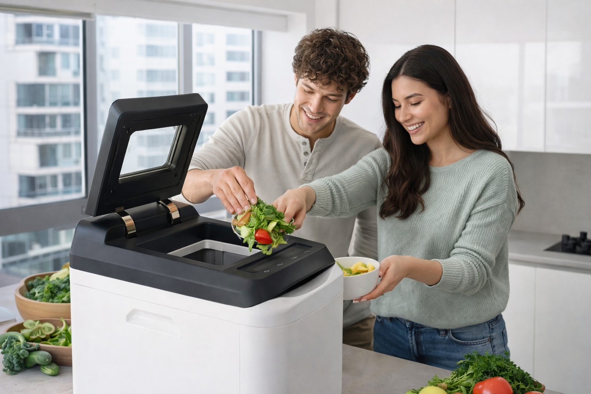

import GemeTerra2CTA from '@site/src/components/GemeTerra2CTA' 
import GemeComposterCTA from '@site/src/components/GemeComposterCTA' 
import RelatedArticles from '@site/src/components/RelatedArticles'
import ReactPlayer from 'react-player'

For many people living in apartments, the idea of composting sounds great in theory — and absolutely miserable in practice. You care about sustainability. You want to reduce food waste. You’ve read about composting being the foundation of a zero-waste lifestyle. And then reality hits: smell, bugs, mess, and endless maintenance.

This article is not here to romanticize traditional composting. It’s here to explain why it fails in apartments, and more importantly, how modern apartment dwellers can finally compost at home without odor, insects, or effort.

<!-- truncate -->

## The Apartment Composting Reality No One Talks About

Search for “apartment composting” online and you’ll see cheerful guides suggesting countertop bins, balcony piles, or DIY worm boxes.

What they rarely mention is what actually happens after week two.

Apartment composting doesn’t fail because people are lazy.
It fails because traditional composting was never designed for indoor, high-density living.

Let’s break down the three biggest problems.

### Problem #1: Indoor Composting Smell (The Deal-Breaker)

#### Why Traditional Compost Smells — Especially Indoors

Traditional composting relies on open biological decomposition. When oxygen, moisture, and food waste aren’t perfectly balanced, anaerobic bacteria take over — producing:

 - Sulfur-like rotten egg smells

 - Sour, fermented odors

 - Ammonia-like stench from protein breakdown

In a backyard, these smells dissipate. In an apartment kitchen? They linger. Even “sealed” compost bins are not truly sealed — they trap moisture and heat, accelerating odor formation. Emptying them daily helps, but defeats the purpose of convenience.

This is why indoor composting smell is the #1 reason apartment dwellers give up.

### Problem #2: Fruit Flies, Gnats, and Unwanted Guests

#### Compost + Apartment = Insect Magnet

Traditional compost attracts insects by design. It’s decomposing organic matter. In apartments, common issues include:

 - Fruit flies laying eggs within days

 - Fungus gnats breeding in moist scraps

 - Maggots if protein waste is involved

Even freezer-storage “hacks” only delay the problem — the moment scraps warm up, insects return. Once bugs appear in a small living space, composting stops feeling eco-friendly and starts feeling like a hygiene risk.

### Problem #3: Turning, Balancing, and Constant Monitoring

#### Composting Is a Process — Not an Appliance

Traditional compost requires:

 - Correct green/brown ratios

 - Manual turning or aeration

 - Moisture monitoring

 - Weeks or months of waiting

In apartments, this usually means:

 - No space to turn piles

 - No airflow

 - No margin for error

Miss one step, and you’re back to smell and bugs. This is why most “how to compost at home” guides quietly assume you have a yard, a garage, or at least a balcony you don’t mind sacrificing.

### The Core Problem: Traditional Composting Doesn’t Scale Indoors

Let’s be honest, traditional composting is an outdoor agricultural system, while apartments are small, enclosed, climate-controlled, odor-sensitive. Trying to force outdoor composting methods into apartments is like using a campfire to heat a studio — technically possible, practically disastrous.

So what’s the fix?

## The Fix: Composting Needs to Become a Closed, Controlled System

For composting to work in apartments, it must:

 1. Eliminate odor at the source (not mask it)

 2. Prevent insects entirely

 3. Require zero manual turning or monitoring

 4. Fit seamlessly into daily kitchen life

This is where modern electric composting comes in — and where GEME changes the game.

<GemeTerra2CTA 
 imgSrc="/img/geme-terra-2-composter.jpg"
 productTitle="GEME Terra II: Best Kitchen Composter"
 features={[
    "✅ Best Composter For Apartment Dwellers",
    "✅ Quiet, Odour-Free, Real Compost",
    "✅ Zero Filter Costs, No Refills",
    "✅ Reduce Landfill Waste & Greenhouse Gases"
 ]}
buttonText="Get Your GEME Terra II"
  href="https://www.geme.bio/product/terra2?utm_medium=blog&utm_source=geme_website&utm_campaign=general_seo_content&utm_content=how-to-compost-at-home"
/>

### Why GEME Is the Only Real Apartment Composting Solution

GEME was not designed to “help” traditional composting. It was designed to **replace it for apartments**.

#### 1. No Indoor Composting Smell — By Design

Unlike open or semi-open bins, GEME uses a fully enclosed microbial system that controls:

 - Temperature

 - Oxygen levels

 - Microbial activity

Odors don’t escape because decomposition happens in a managed biological environment, not an exposed container.

No baking soda. No charcoal subscriptions. No “take it out before it smells” anxiety.

#### 2. Zero Bugs, Zero Exposure

Fruit flies can’t infest what they can’t access. With GEME Terra 2:

 - Food scraps go directly into a sealed system

 - No standing wet waste

 - No open fermentation

Apartment dwellers consistently report no flies, no gnats, no pests — even with meat, dairy, and cooked food waste.

#### 3. No Turning, No Guesswork, No Maintenance

Traditional compost fails because it depends on you to manage biology. GEME Terra 2 automates the entire process:

 - No balancing greens and browns

 - No turning

 - No curing pile on your balcony

You add scraps. GEME handles the rest. That’s how composting finally becomes compatible with modern life.

#### “But What If It Smells?” — The 30-Day Risk-Free Safety Net

Let’s address the real hesitation head-on. Most apartment dwellers don’t avoid composting because they don’t care. They avoid it because they’re afraid of odor in their home.

That’s exactly why GEME offers a 30-day no-questions-asked refund policy. You can:

 - Test GEME in your actual kitchen

 - Compost real food waste (including meat and leftovers)

 - See for yourself whether it fits your space

If it doesn’t? You return it. This removes the biggest psychological barrier to apartment composting: the fear of being stuck with a smelly mistake.

<GemeTerra2CTA 
 imgSrc="/img/geme-terra-2-composter.jpg"
 productTitle="GEME Terra II: Best Kitchen Composter"
 features={[
    "✅ Best Composter For Apartment Dwellers",
    "✅ Quiet, Odour-Free, Real Compost",
    "✅ Zero Filter Costs, No Refills",
    "✅ Reduce Landfill Waste & Greenhouse Gases"
 ]}
buttonText="Get Your GEME Terra II"
  href="https://www.geme.bio/product/terra2?utm_medium=blog&utm_source=geme_website&utm_campaign=general_seo_content&utm_content=how-to-compost-at-home"
/>

## Why “Dehydrators” Don’t Solve the Apartment Composting Problem

Some countertop devices dry and grind food waste. They reduce volume — but they don’t compost. That means:

 - No living soil

 - No nutrient cycling

 - Still requires disposal or external composting

Let's compare: [**Real Compost vs Dehydrated Scraps** -->](https://www.geme.bio/compare/real-compost-vs-dehydrated-scraps?utm_medium=blog&utm_source=geme_website&utm_campaign=general_seo_content&utm_content=how-to-compost-at-home)

GEME is different because it completes the biological loop indoors, producing real compost — not just dried trash. For apartment dwellers who actually want to compost at home, this distinction matters.

### Comparison Table: GEME Terra 2 vs Mill vs Lomi

| Feature              | **GEME Terra 2**            | [**Mill Food Recycler**](https://www.geme.bio/compare/geme-vs-mill?utm_medium=blog&utm_source=geme_website&utm_campaign=general_seo_content&utm_content=how-to-compost-at-home)        | [**Lomi Composter**](https://www.geme.bio/compare/geme-vs-lomi?utm_medium=blog&utm_source=geme_website&utm_campaign=general_seo_content&utm_content=how-to-compost-at-home)             |
| -------------------- | --------------------------- | ----------------------------- | ------------------------------ |
| Composting Method    | [**AI-Assisted Microbial**](https://www.geme.bio/kobold-introduction?utm_medium=blog&utm_source=geme_website&utm_campaign=general_seo_content&utm_content=how-to-compost-at-home)      | Heat + Grinding (no microbes) | Dehydration + Grinding         |
| Output               | Real Compost, Soil-Ready    | Food Grounds (dehydrated)     | Pre-Compost (dry matter)       |
| Handles Meat & Small Bones | Yes (biologically digested) | Limited              | Limited                        |
| Ongoing Consumables  | None                        | Subscription / Filters        | Filters / Consumables          |
| Volume Reduction     | ~95% + real compost         | ~70–80%                       | ~60–80%                        |
| Noise                | Quiet (~35–45 dB)           | Moderate (~ up to 60 dB)      | Quiet                          |
| Best For             | True compost at home        | Waste volume reduction        | Odor control & waste reduction |

This comparison makes clear that only GEME Terra 2 completes the composting cycle indoors, creating useable nutrient soil for apartment dwellers.

## The Bottom Line: Traditional Composting Isn’t Broken — It’s Just Not for Apartments

Traditional composting works great where it was designed to work: outdoors, with space and airflow. However, Apartments are different.

If you’ve failed at composting before, it wasn’t because you did it wrong. It’s because the system was wrong for your environment.

**GEME fixes that**.

 - No smell.
 - No bugs.
 - No pile-turning.
 - No stress.

And with a 30-day risk-free return, there’s finally no reason not to try composting at home — even in the smallest apartment.

## Frequently Asked Questions (FAQ Answered.)

### 1. Does GEME produce real compost or just dried waste?

GEME produces biologically active compost using microbial fermentation. This is fundamentally different from heat-drying or grinding methods. See [**Real Compost vs Dehydrated Scraps** -->](https://www.geme.bio/compare/real-compost-vs-dehydrated-scraps?utm_medium=blog&utm_source=geme_website&utm_campaign=general_seo_content&utm_content=how-to-compost-at-home)

### 2. Will my apartment smell?

No. GEME prevents odor at the source by avoiding rot entirely. There’s no open bin and no anaerobic decay.

### 3. Can I compost meat and dairy?

Yes. GEME is designed to handle foods that traditional composting struggles with—including meat, dairy, and bones.

### 4. Is GEME safe for apartments?

Absolutely. It’s fully enclosed, quiet, and includes a child-lock system.

### 5. What if I change my mind?

You’re covered by a 30-day no-questions-asked refund policy.

### 6. Is this suitable for beginners?

Yes. GEME was designed for people who failed at composting before.

Ready to Compost Without the Mess?

Try GEME Terra 2 risk-free for 30 days.
Turn food scraps into real compost—without smells, bugs, or hassle.

<GemeTerra2CTA 
 imgSrc="/img/geme-terra-2-composter.jpg"
 productTitle="GEME Terra II: Best Kitchen Composter"
 features={[
    "✅ Best Composter For Apartment Dwellers",
    "✅ Quiet, Odour-Free, Real Compost",
    "✅ Zero Filter Costs, No Refills",
    "✅ Reduce Landfill Waste & Greenhouse Gases"
 ]}
buttonText="Get Your GEME Terra II"
  href="https://www.geme.bio/product/terra2?utm_medium=blog&utm_source=geme_website&utm_campaign=general_seo_content&utm_content=how-to-compost-at-home"
/>

<RelatedArticles
  slugs={[
  "zero-waste-home-kitchen-composter",
  "does-lomi-composter-really-compost",
  "5-best-kitchen-composters-in-2026",
  "best-kitchen-composter-in-2026-geme-terra-2",
  "geme-vs-reencle-composter-2026",
  "geme-vs-mill-composter-2026",
  "best-kitchen-composter-2026",
  "advanced-geme-compost-application-guide",
  "electric-compost-bin-filters-costs-comparison",
  "geme-vs-lomi", 
  "geme-terra-2-debuts",
  "the-best-composter-to-reduce-food-waste",
  "compost-pile-vs-electric-composter",
  "how-to-make-bananas-last-longer",
  "how-long-do-apples-last-in-the-fridge",
  "can-i-compost-moldy-grapes",
  "can-you-compost-moldy-bread",
  ]}
/>

_Ready to transform your gardening game? Subscribe to our [newsletter](http://geme.bio/signup) for expert composting tips and sustainable gardening advice._

