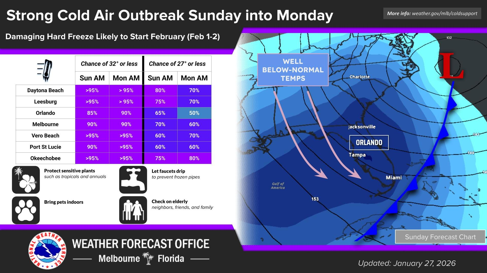
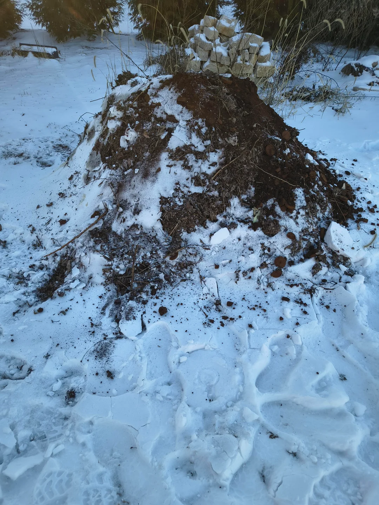

import GemeTerra2CTA from '@site/src/components/GemeTerra2CTA' 
import GemeComposterCTA from '@site/src/components/GemeComposterCTA' 
import RelatedArticles from '@site/src/components/RelatedArticles'
import ReactPlayer from 'react-player'

The winter of 2026 is rewriting the record books. A historic bomb cyclone has unleashed a cascade of Arctic air, bringing freeze warnings as far south as Florida and promising some of the coldest temperatures the Sunshine State has seen in 15 years. For gardeners and eco-enthusiasts, this presents an immediate and frustrating challenge: how to compost at home when your backyard pile is a frozen, immovable block of ice.

A recent, poignant Reddit post titled ["**How do I turn my frozen compost pile**?"](https://www.reddit.com/r/composting/comments/1qppv27/how_do_i_turn_my_frozen_compost_pile/) captures the universal struggle. The user describes outdoor temperatures plunging between -10°F to 15°F (-23°C to -9°C) for weeks, rendering their pitchfork useless against a solidly frozen mass. This isn't just an inconvenience; it's a complete halt to the natural process of decomposition.

(Image: NWS, Jan 27, 2026. [*While cold weather is currently impacting east central Florida, even colder conditions are forecast to start February. There is increasing potential for hard freeze conditions across east central Florida both Sunday and Monday mornings (Feb 1-2)*](https://x.com/NWSMelbourne/status/2016299436041703697).)

This article is your definitive guide to navigating composting in winter. We'll dissect the science of why frozen piles fail, explore traditional methods for winterizing outdoor bins, and make a compelling case for the most reliable solution for serious composters: transitioning to a controlled, efficient indoor composter.

<!-- truncate -->

## The Deep Freeze: Why Winter Stops Outdoor Composting Dead in Its Tracks

To understand the crisis sparked by the 2026 bomb cyclone, we must first understand the biology we're trying to protect. Composting is driven by aerobic microorganisms—bacteria, fungi, and actinomycetes—that consume organic matter and generate heat as a byproduct.

### The Science of the "Cold Pile"

These microbes are temperature-sensitive. According to the comprehensive composting guidelines from the [**United States Composting Council (USCC)**](https://www.compostingcouncil.org/page/TMECC), optimal microbial activity occurs between 135°F and 160°F (57°C and 71°C). This is the "hot compost" zone where decomposition is rapid, and pathogens and weed seeds are destroyed.

When external temperatures plummet during a freeze warning event, maintaining this heat becomes a battle against physics. A pile must be sufficiently large (generally a minimum of 1 cubic yard/meter) and rich in nitrogen "greens" to self-insulate. The 2026 bomb cyclone conditions, with prolonged sub-freezing temperatures and wind chill, actively steal this vital heat energy. The outer layers freeze, insulating the core from necessary oxygen exchange. Microbial activity slows to a near standstill, creating what's known as a "cold" or "static" pile.

As noted by the [**University of Illinois Extension**](https://extension.illinois.edu/composting/composting-homepage), in a cold pile, "**decomposition occurs very slowly, and may stop completely in winter**." The Reddit user's impenetrable pile is a perfect example; the process isn't just slow, it's inactive. The organic matter is preserved in ice, not decomposing, which can lead to a significant backlog and extended composting timelines—potentially adding months to the process.

### The Practical Problems of a Frozen Pile

Beyond biology, a frozen pile creates logistical nightmares:

 - **Impossible Turning**: Aeration is critical. A frozen mass cannot be turned, starving any surviving microbes of oxygen.

 - **Accumulation Buildup**: Kitchen scraps continue to generate, leaving you with nowhere to put them.

 - **Pest Attraction**: Unincorporated food scraps on top of a frozen pile can attract rodents searching for winter food.

 - **Delayed Spring Gardening**: The pile will not be ready to nourish your spring seedlings.

<GemeTerra2CTA 
 imgSrc="/img/geme-terra-2-composter.jpg"
 productTitle="GEME Terra II: Best Kitchen Composter"
 features={[
    "✅ Best Composter For Composting in Winter",
    "✅ Quiet, Odour-Free, Real Compost",
    "✅ Zero Filter Costs, No Refills",
    "✅ Reduce Landfill Waste & Greenhouse Gases"
 ]}
buttonText="Get Your GEME Terra II"
  href="https://www.geme.bio/product/terra2?utm_medium=blog&utm_source=geme_website&utm_campaign=general_seo_content&utm_content=composting-in-winter"
/>

## Traditional Strategies for Winter Composting (And Their Limitations)

Before the advent of modern technology, dedicated composters developed techniques to extend the season. While helpful in moderate climates, these methods are severely tested by historic events like the 2026 bomb cyclone.

### 1. Insulation and Mass: The "Big Pile" Method

The most common advice is to build a large volume pile in fall. The core's heat, if sufficient, can keep it active. Insulation with straw bales, leaves, or even old carpets is recommended by resources like the EPA's Guide to Composting at Home.

**Limitation**: This requires significant space and a massive amount of "brown" carbon material (leaves, shredded paper) gathered in advance. In extreme, prolonged cold, even large piles can freeze solid at the edges and lose core heat, especially during a bomb cyclone 2026-level event with its severe wind chill.

### 2. The "No-Turn" Winter Pile

This involves adding scraps to a pile throughout winter without turning, accepting that decomposition will resume in spring. The University of Minnesota Extension suggests this passive approach for cold climates.

**Limitation**: This method strictly preserves waste; it does not manage it actively. It can lead to odor issues from anaerobic pockets and guarantees no compost for early spring use.

### 3. Trench or Pit Composting

Burying food scraps directly in the garden bed allows decomposition to continue slowly underground, where temperatures are more stable.

**Limitation**: This is not feasible for all gardeners, especially those with small plots, frozen ground, or who generate scraps daily. It offers no harvested compost and can disturb root systems.

### Addressing the Reddit User's Dilemma

For the Reddit user and anyone with a currently frozen pile, the guidance from authorities like the Cornell Waste Management Institute is pragmatic: wait. Forcing a frozen pile can damage your tools and the pile structure. The focus should shift to:

 - **Diverting new scraps**: Start a new, insulated pile or find an alternative method for the remainder of winter.

 - **Spring recovery**: Once the thaw begins, the pile will need significant turning, moisture adjustment, and likely fresh greens to reactivate.

This reality—that traditional composting in winter is a seasonal, weather-dependent gamble—is precisely what leads us to the modern, guaranteed solution.

<GemeTerra2CTA 
 imgSrc="/img/geme-terra-2-composter.jpg"
 productTitle="GEME Terra II: Best Kitchen Composter"
 features={[
    "✅ Best Composter For Composting in Winter",
    "✅ Quiet, Odour-Free, Real Compost",
    "✅ Zero Filter Costs, No Refills",
    "✅ Reduce Landfill Waste & Greenhouse Gases"
 ]}
buttonText="Get Your GEME Terra II"
  href="https://www.geme.bio/product/terra2?utm_medium=blog&utm_source=geme_website&utm_campaign=general_seo_content&utm_content=composting-in-winter"
/>

## The Fail-Safe Revolution: Why an Indoor Composter is the Ultimate Winter Solution

The limitations of outdoor winter composting highlight a clear advantage: control. Bringing the process indoors eliminates dependency on the weather. This is where understanding how to compost at home evolves from a backyard activity into a year-round, kitchen-based practice.

### Defining a True Indoor Composter

It's crucial to distinguish between devices. The market contains "food waste dehydrators" or "food recyclers" that primarily use heat, agitation, and sometimes a bulking agent to dehydrate and pulverize waste into a shelf-stable material. This is a form of waste reduction, but not true composting, as the microbial decomposition process is minimal or absent.

A genuine indoor composter, like the GEME Terra II, is engineered to foster and accelerate the same aerobic microbial decomposition that happens in a hot outdoor pile. It creates the ideal environment—controlled temperature, consistent aeration, and optimal moisture—for specific thermophilic (heat-loving) microbes to thrive and break down waste in hours, not months.

### The Unbeatable Benefits of Going Indoors in Winter

 - **Absolute Climate Independence**: Whether it's a freeze warning in Florida or a blizzard in Minnesota, your composting process remains unaffected. The 2026 bomb cyclone becomes a meteorological event you watch from your window, not a crisis for your sustainability habits.

 - **Continuous, Rapid Output**: Instead of a frozen, static pile, you get finished, nutrient-rich compost in a matter of days. This keeps your kitchen scrap stream flowing and provides a constant supply of "black gold" for houseplants or storage for spring.

 - **Odor and Pest Control**: A sealed, professionally designed system contains odors and is impervious to insects and rodents, a common winter concern with outdoor piles.

 - **Space and Convenience**: It requires no backyard, no trudging through snow, and no battling frozen masses. Composting in winter becomes as easy as taking out the recycling.

<GemeTerra2CTA 
 imgSrc="/img/geme-terra-2-composter.jpg"
 productTitle="GEME Terra II: Best Kitchen Composter"
 features={[
    "✅ Best Composter For Composting in Winter",
    "✅ Quiet, Odour-Free, Real Compost",
    "✅ Zero Filter Costs, No Refills",
    "✅ Reduce Landfill Waste & Greenhouse Gases"
 ]}
buttonText="Get Your GEME Terra II"
  href="https://www.geme.bio/product/terra2?utm_medium=blog&utm_source=geme_website&utm_campaign=general_seo_content&utm_content=composting-in-winter"
/>

## GEME Terra II: Engineered for True Winter Composting

In the face of unprecedented weather, half-measures fall short. The GEME Terra II isn't a dehydrator; it's a biomechanical system designed to solve the core problem exposed by the Reddit post and the bomb cyclone 2026.

### The Technology Behind 24/7 Microbial Activity

While we avoid overly technical jargon here, the principle is key: GEME Terra II uses a proprietary blend of thermophilic bacteria (often referred to as "bokashi" microbes on a thermophilic level) and intelligent aeration to create a perpetually active decomposition chamber. This mimics and accelerates the hot compost process, maintaining a core temperature where microbes are most voracious, regardless of the outdoor temperature.

### Your Year-Round Composting Partner

With GEME Terra II, the question of how to compost at home in winter has a simple answer:

 - **Add** your daily kitchen scraps (including meats, dairy, and grains often avoided in outdoor piles).

 - **Let** the integrated biome and smart aeration work continuously.

 - **Harvest** ready-to-use compost in days, not seasons.

This winter, while others stare forlornly at their frozen piles, you can maintain a zero-waste kitchen and produce valuable soil amendment without pause. The extreme weather catalyzed by the 2026 bomb cyclone isn't just a challenge; it's a compelling reason to upgrade your approach to composting in winter.

## Conclusion: Embrace the Indoor Composting Future

The historic freeze of 2026 is a stark reminder of our dependence on stable climates. For the eco-conscious individual, it disrupts a fundamental sustainable practice. The Reddit user's frozen pile is a symbol of this vulnerability.

We have a choice: continue the seasonal struggle with outdoor piles, hoping winters are mild, or adopt a resilient, technology-enabled system that guarantees success. Learning how to compost at home in the 21st century means embracing solutions that work in all seasons.

An indoor composter like the GEME Terra II transforms composting in winter from a frustrating pause into a period of peak productivity. It ensures that your commitment to sustainability remains unbroken, no matter what the weather brings.

Don't let the next freeze warning or bomb cyclone stop your compost. Explore the future of year-round, worry-free composting. Visit our website to learn how GEME Terra II can keep your kitchen zero-waste and your garden dreams alive, all winter long.

<GemeTerra2CTA 
 imgSrc="/img/geme-terra-2-composter.jpg"
 productTitle="GEME Terra II: Best Kitchen Composter"
 features={[
    "✅ Best Composter For Composting in Winter",
    "✅ Quiet, Odour-Free, Real Compost",
    "✅ Zero Filter Costs, No Refills",
    "✅ Reduce Landfill Waste & Greenhouse Gases"
 ]}
buttonText="Get Your GEME Terra II"
  href="https://www.geme.bio/product/terra2?utm_medium=blog&utm_source=geme_website&utm_campaign=general_seo_content&utm_content=composting-in-winter"
/>

## References & Authoritative Resources

1. [**United States Composting Council (USCC)**. Composting Process Parameters](https://www.compostingcouncil.org/page/TMECC). Focus on temperature ranges and microbial activity.

2. [**University of Illinois Extension**. Composting in the Home Garden](https://extension.illinois.edu/composting/composting-homepage). Discusses cold vs. hot composting and winter inactivity.

3. [**U.S. Environmental Protection Agency (EPA)**. Composting at Home](https://www.epa.gov/recycle/composting-home). Guide covering methods, including pile insulation techniques.

4. [**University of Minnesota Extension**. Composting in Rural Areas](https://extension.umn.edu/preparing-livestock-emergencies/composting-livestock-and-poultry-carcasses). Includes recommendations for passive winter composting.

5. [**Cornell Waste Management Institute**. Home Composting Basics](https://cwmi.css.cornell.edu/composting.htm). Provides practical troubleshooting, including management of seasonal issues.

<RelatedArticles
  slugs={[
  "how-to-compost-at-home",
  "zero-waste-home-kitchen-composter",
  "does-lomi-composter-really-compost",
  "5-best-kitchen-composters-in-2026",
  "best-kitchen-composter-in-2026-geme-terra-2",
  "geme-vs-reencle-composter-2026",
  "geme-vs-mill-composter-2026",
  "best-kitchen-composter-2026",
  "advanced-geme-compost-application-guide",
  "electric-compost-bin-filters-costs-comparison",
  "geme-vs-lomi", 
  "geme-terra-2-debuts",
  "the-best-composter-to-reduce-food-waste",
  "compost-pile-vs-electric-composter",
  "how-to-make-bananas-last-longer",
  "how-long-do-apples-last-in-the-fridge",
  "can-i-compost-moldy-grapes",
  "can-you-compost-moldy-bread",
  ]}
/>

_Ready to transform your gardening game? Subscribe to our [newsletter](http://geme.bio/signup) for expert composting tips and sustainable gardening advice._

