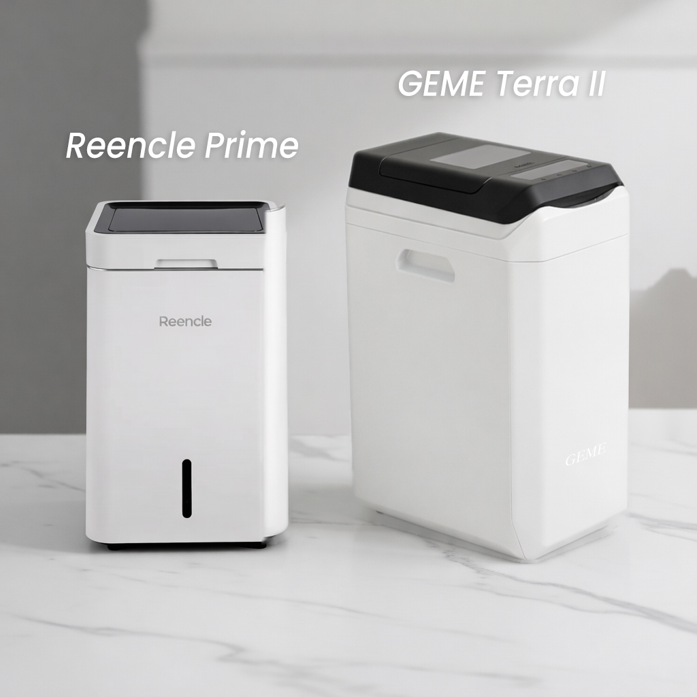
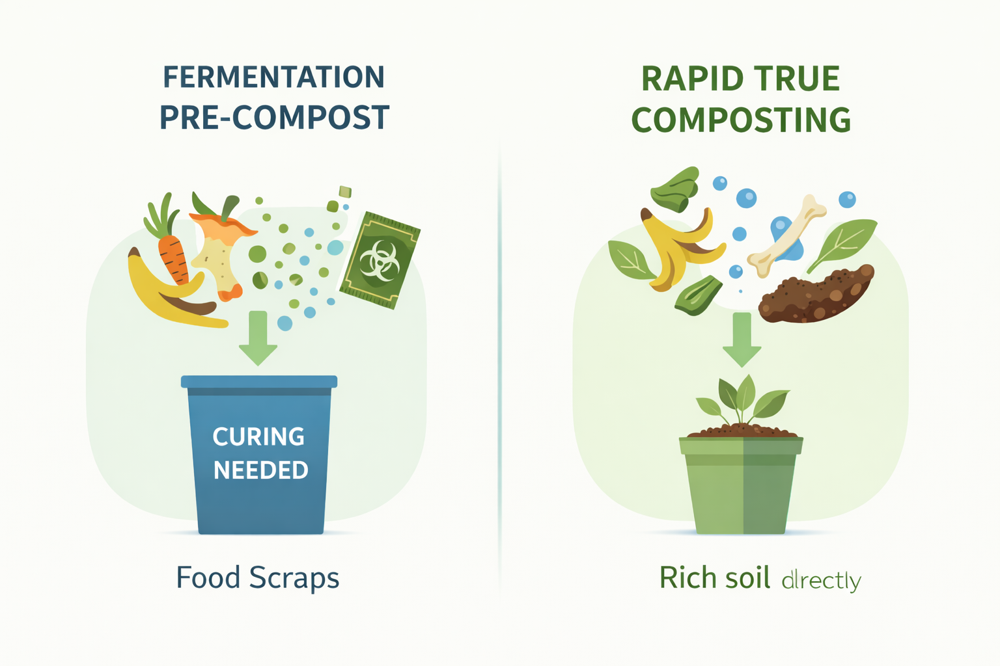

import GemeTerra2CTA from '@site/src/components/GemeTerra2CTA' 
import GemeComposterCTA from '@site/src/components/GemeComposterCTA' 
import RelatedArticles from '@site/src/components/RelatedArticles'
import ReactPlayer from 'react-player'

You’ve decided to reduce food waste and bring eco-friendly composting into your kitchen — awesome! 🍃 But in the growing market of electric composters, the label “microbial” can be misleading.

Today we’re pitting two microbial composters against each other:

 - **Reencle composter**: a popular microbial system from South Korea.

 - **GEME Terra 2**: the world’s first AI-powered kitchen composter that produces real compost you can use immediately.

This showdown isn’t just about specs — it’s about real results, ownership costs, kitchen convenience, and long-term sustainability. Let’s dive in.

<!-- truncate -->

### Why This Comparison Matters

Many eco-conscious families and apartment dwellers want to compost kitchen scraps but are overwhelmed by:

 - confusing marketing claims

 - hidden subscription costs

 - unclear compost output quality

This article cuts through the noise and gives you a data-grounded comparison of the Reencle composting method vs GEME Terra 2’s microbial system, focusing on output quality, costs, daily usability, and environmental value.

## Quick Verdict 

| Feature             | **Reencle Composter**                                         | **GEME Terra 2**                                                  | Verdict                                |
| ------------------- | ------------------------------------------------------------- | ----------------------------------------------------------------- | -------------------------------------- |
| Composting Method   | Aerobic microbes (ReencleMicrobe™)     | AI-regulated thermophilic microbes ([**GEME Kobold™**](ttps://www.geme.bio/kobold-introduction?utm_medium=blog&utm_source=geme_website&utm_campaign=general_seo_content&utm_content=does-reencle-composter-produce-real-compost))          | GEME wins — faster microbial breakdown |
| Output              | Fermented pre-compost requiring curing  | Ready-to-use compost in 6-8h               | GEME wins — no extra steps             |
| Continuous Feed     | Yes                                                           | Yes                                                               | Tie                                    |
| Odor Management     | Carbon filters (replaceable)           | Permanent metal-ion filter, no replacements  | GEME wins — zero recurring costs       |
| Capacity (Daily)    | ~1.0–1.5 kg (approx)                | ~2 kg+ (continuous)                        | GEME wins — larger throughput          |
| Real Compost Output | Yes (needs curing)                   | Yes (finished)                            | GEME wins — direct garden usage        |
| Best for            | Kitchen beginners wanting low odor                            | True waste-to-soil conversion                                     | GEME wins overall                      |

<GemeTerra2CTA 
 imgSrc="/img/geme-terra-2-composter.jpg"
 productTitle="GEME Terra II: Best Kitchen Composter"
 features={[
    "✅ AI-Powered Microbial Composter",
    "✅ Quiet, Odour-Free, Real Compost",
    "✅ Zero Filter Costs, No Refills",
    "✅ Reduce Landfill Waste & Greenhouse Gases"
 ]}
buttonText="Get Your GEME Terra II"
  href="https://www.geme.bio/product/terra2?utm_medium=blog&utm_source=geme_website&utm_campaign=general_seo_content&utm_content=does-reencle-composter-produce-real-compost"
/>

[**Learn more about GEME Kobold and the controlled microbial fermentation** -->](https://www.geme.bio/kobold-introduction?utm_medium=blog&utm_source=geme_website&utm_campaign=general_seo_content&utm_content=does-reencle-composter-produce-real-compost)

## Round 1: Technology Breakdown — How They Compost

### Reencle’s Microbial System

Reencle composters (Prime and Gravity) mix food scraps with a proprietary mix of aerobic bacteria and maintain an oxygen-rich environment to support decomposition.

According to reviewers, Reencle’s system does biologically break down organic waste using bacteria — a marked improvement over simple dehydrators — and can handle meat, dairy, and typical food scraps.
The process is continuous, meaning you can add scraps anytime without waiting for a batch to complete.

However:

 - Reencle output still requires curing or mixing with soil before use in gardens.

 - Larger fibrous items or pits need pre-preparation.

 - The compost removal can be messy or require manual scooping.

This means Reencle does create biologically active compost — but with some extra work before it becomes truly usable.

### GEME Terra 2: AI-Powered Microbial Composting

GEME Terra 2 takes microbial composting to the next level:

 - It uses AI algorithms to automatically regulate internal temperature, moisture, oxygen, and pH — the key variables for effective microbial decomposition.

 - Proprietary Kobold™ microbes thrive in a “Goldilocks Zone” optimized for rapid breakdown.

 - Soil-ready compost is biologically active and usable right from the machine in as little as 6-8 hours — no curing or additional steps required.

So while both use microbes, the automation and output quality in Terra 2 significantly differ from Reencle’s approach.

## Round 2: Output Comparison — Soil-Ready or Not?

### What Comes Out of Reencle?

Reencle’s fermentation produces a biologically active material that:

 - Is nutrient-rich

 - Reduces waste volume significantly

 - Supports plant growth after curing

However, many users and reviewers stress that the compost still benefits from additional curing or blending before use. Even Wired’s evaluation noted that final compost needed sifting and curing for best gardening results.

This means the Reencle Composter:

- Breaks down complex scraps

- Biological process

- Needs extra steps

- Output consistency varies

### What Comes Out of GEME Terra 2?

GEME Terra 2 produces finished compost — material that can be used directly on:

 - Houseplants

 - Patio gardens

 - Potted herb beds

All without extra curing or blending. This is because the microbes digest materials thoroughly and continuously, unlike some fermenting systems that create intermediate compost requiring more time outside the machine.

In short: GEME Terra 2’s output is ready-to-use, whereas Reencle’s often isn’t immediately soil-ready.

<GemeTerra2CTA 
 imgSrc="/img/geme-terra-2-composter.jpg"
 productTitle="GEME Terra II: Best Kitchen Composter"
 features={[
    "✅ AI-Powered Microbial Composter",
    "✅ Quiet, Odour-Free, Real Compost",
    "✅ Zero Filter Costs, No Refills",
    "✅ Reduce Landfill Waste & Greenhouse Gases"
 ]}
buttonText="Get Your GEME Terra II"
  href="https://www.geme.bio/product/terra2?utm_medium=blog&utm_source=geme_website&utm_campaign=general_seo_content&utm_content=does-reencle-composter-produce-real-compost"
/>

[**See how GEME Terra II works & why it matters** -->](https://www.geme.bio/how-it-works?utm_medium=blog&utm_source=geme_website&utm_campaign=general_seo_content&utm_content=does-reencle-composter-produce-real-compost)

[**Learn more about GEME Kobold and the controlled microbial fermentation** -->](https://www.geme.bio/kobold-introduction?utm_medium=blog&utm_source=geme_website&utm_campaign=general_seo_content&utm_content=does-reencle-composter-produce-real-compost)

## Round 3: Long-Term Cost & Maintenance

Another big difference is what happens after the purchase.

| Cost Factor          | **Reencle Composter**                                                             | **GEME Terra 2**                                                   |
| -------------------- | --------------------------------------------------------------------------------- | ------------------------------------------------------------------ |
| Starter Microbe Pack | Included but may need repeat additions (varies by model)   | Included; microbes self-replicate            |
| Odor Filters         | Carbon filters (replaceable)                             | Permanent metal-ion filter (no replacements)  |
| Ongoing Consumables  | Some reports suggest filter replacements may be a future cost …  | Zero consumables                             |
| Electricity          | ~1.25 kWh/day                                             | ~ similar range (built into AI cycles)      |

:::Note
 Reencle comes with microbe starter packs, but many users report that microbes self-sustain once established — meaning consumables may be minimal, but filter replacements are still likely over time.
:::

By contrast, GEME Terra 2’s permanent filter and self-replicating microbes mean no subscription or recurring filter expenses — a major advantage for cost-conscious buyers.

## Round 4: Daily Usability — Does It Fit Into Your Life?

### Reencle Composter Daily Experience

✔ Quiet operation (&lt;45 dB)

✔ Handles up to ~2.2 lbs/day

✘ Some items may need pre-chopping

✘ Manual emptying can be awkward and messy

### GEME Terra 2 Daily Experience

✔ Continuous feed — toss scraps anytime

✔ Quiet operation (&lt;40 dB)

✔ Larger daily processing capacity (~2 kg+)

✔ Simple harvest — no extra curing required

In everyday use, both systems simplify kitchen composting, but GEME Terra 2’s truly finished output and simplified maintenance make it easier for zero-waste households and busy apartment dwellers.

<GemeTerra2CTA 
 imgSrc="/img/geme-terra-2-composter.jpg"
 productTitle="GEME Terra II: Best Kitchen Composter"
 features={[
    "✅ AI-Powered Microbial Composter",
    "✅ Quiet, Odour-Free, Real Compost",
    "✅ Zero Filter Costs, No Refills",
    "✅ Reduce Landfill Waste & Greenhouse Gases"
 ]}
buttonText="Get Your GEME Terra II"
  href="https://www.geme.bio/product/terra2?utm_medium=blog&utm_source=geme_website&utm_campaign=general_seo_content&utm_content=does-reencle-composter-produce-real-compost"
/>

### Compost Like Nature, But Faster

Think composting takes months? Not anymore. GEME Terra 2 turns your kitchen waste into finish-ready soil in as little as 6–8 hours, thanks to continuous AI optimization and microbial synergy.

Reencle can take a day or more for breakdown and may require curing afterward — so GEME’s speed and simplicity give you finished soil faster, and with less effort.

### Own It, Don’t Subscribe

Many electric composter brands lock you into filter replacements or microbial refills. GEME Terra 2’s self-replicating microbial ecosystem and permanent filter mean no subscriptions, no hidden costs, and no hassle — ever.

That’s a big deal if you care about long-term sustainability and predictable household expenses.

## Frequently Asked Questions (FAQs)

### 1. Does Reencle produce real compost?

 Yes, it uses aerobic microbes to biologically break down food scraps into nutrient-rich matter that benefits soil, though some users find it needs curing or sifting before use.

### 2. Is GEME Terra 2 suitable for apartments?

 Absolutely. It’s compact, quiet, odor-free, and designed for indoor use — ideal for urban households.

### 3. Which one handles more waste daily?

 GEME Terra 2 generally handles more continuous waste (~2 kg/day) than the standard Reencle models (~1.5–2.2 lbs/day).

### 4. Do I need to replace filters or microbes for GEME?

 No. GEME’s permanent filter and self-replicating microbes mean zero recurring costs.

## Conclusion: The Best Composter for Real Results

If your goal is true composting — converting kitchen scraps into finished, soil-ready compost — the evidence points clearly to GEME Terra 2. Its AI-managed microbial system consistently produces usable compost faster, with no recurring consumables and simplified upkeep.

Reencle is a strong microbial composter and a solid choice for users seeking continuous decomposition without smell or bugs, but its output often requires secondary processing before use — a step GEME’s system eliminates.

For eco-conscious families, apartment dwellers, and zero-waste advocates who want real results with minimal friction, GEME Terra 2 is the best composter you can bring into your kitchen today.

## Verified Source Citations

 1. <a href="https://www.reencle.com.sg/reencle-prime" rel="nofollow">Reencle official product details and microbial composting info, Reencle Prime & Gravity</a>.

 2. [Reencle continuous composting review & experience, Techlicious](https://www.techlicious.com/review/reencle-prime-kitchen-composter-review/).

 3. [Reviewed evaluation of Reencle compost quality and daily use](https://www.reviewed.com/cooking/content/reencle-composter-review).

 4. [GEME Terra 2 bio-composter official product info, microbial composting and AI control](https://www.geme.bio/product/terra2?utm_medium=blog&utm_source=geme_website&utm_campaign=general_seo_content&utm_content=does-reencle-composter-produce-real-compost).

 5. [Comparison of kitchen compost methods highlighting GEME’s output](https://www.geme.bio/blog/zero-waste-home-kitchen-composter).

<RelatedArticles
  slugs={[
  "does-mill-composter-really-compost",
  "how-to-reduce-food-waste-at-home-2026",
  "free-mcnugget-caviar-raises-food-waste-concerns",
  "composting-in-winter",
  "how-to-compost-at-home",
  "zero-waste-home-kitchen-composter",
  "does-lomi-composter-really-compost",
  "5-best-kitchen-composters-in-2026",
  "best-kitchen-composter-in-2026-geme-terra-2",
  "geme-vs-reencle-composter-2026",
  "geme-vs-mill-composter-2026",
  "best-kitchen-composter-2026",
  "advanced-geme-compost-application-guide",
  "electric-compost-bin-filters-costs-comparison",
  "geme-vs-lomi", 
  "geme-terra-2-debuts",
  "the-best-composter-to-reduce-food-waste",
  "compost-pile-vs-electric-composter",
  "how-to-make-bananas-last-longer",
  "how-long-do-apples-last-in-the-fridge",
  "can-i-compost-moldy-grapes",
  "can-you-compost-moldy-bread",
  ]}
/>

_Ready to transform your gardening game? Subscribe to our [newsletter](http://geme.bio/signup) for expert composting tips and sustainable gardening advice._

