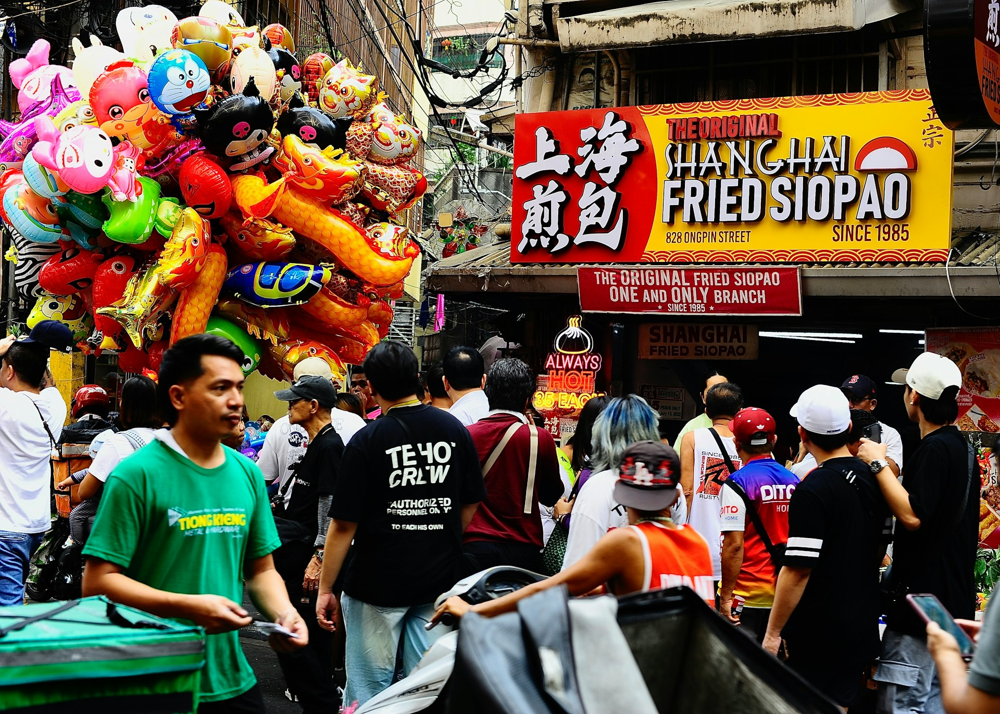
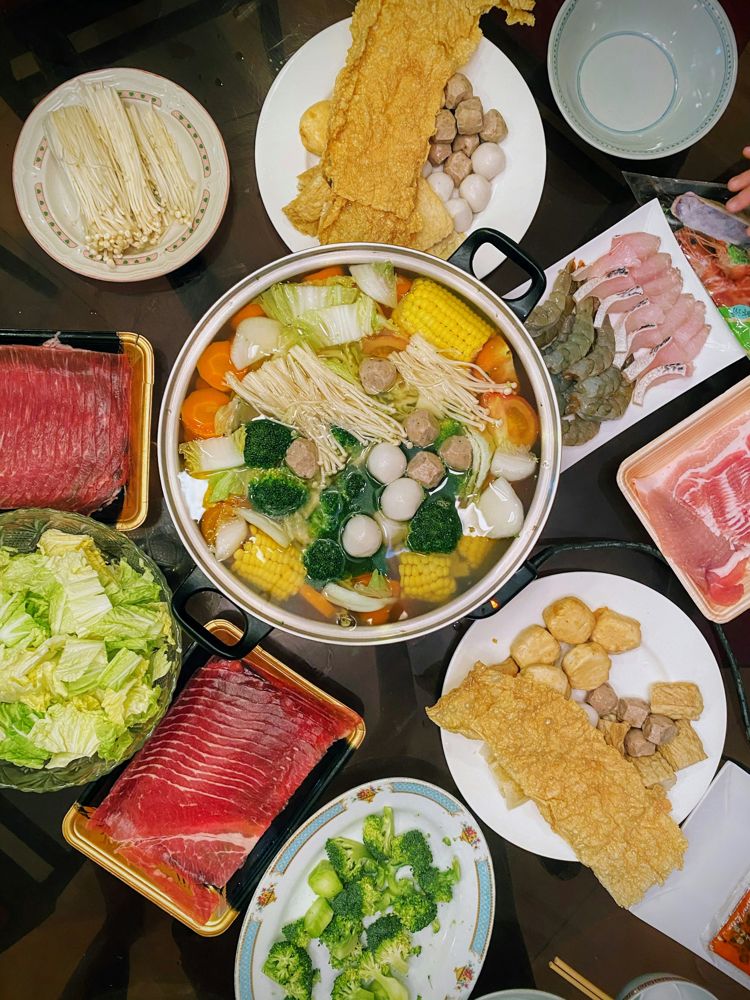

import GemeTerra2CTA from '@site/src/components/GemeTerra2CTA' 
import GemeComposterCTA from '@site/src/components/GemeComposterCTA' 
import RelatedArticles from '@site/src/components/RelatedArticles'
import ReactPlayer from 'react-player'

The Spring Festival is coming. It is a time of reunion, joy, and, inevitably, abundant feasts. From the lavish reunion dinner to the endless stream of snacks and gifts, our kitchens overflow with food and good intentions. Yet, this celebration often leads to a silent post-holiday guest: a significant spike in food waste.

Dealing with piles of food scraps, leftovers, and packaging after the festivities can feel overwhelming and guilt-inducing. But what if this year could be different? What if you could enjoy every delicacy knowing that not a single scrap would be wasted? 

Reducing holiday food waste isn't about eating less; it's about planning smarter, storing better, and having the right tools to close the loop. This guide will walk you through a stress-free, sustainable strategy to handle your Spring Festival food waste with ease, transforming it from a problem into a positive outcome for your home and the planet.

<!-- truncate -->

## The Pre-Feast Plan: Smart Strategies to Prevent Waste at the Source

The most effective way to handle waste is to not create it in the first place. Before the shopping frenzy begins, a little strategy goes a long way in how to reduce food waste.

 ### 1. The Smarter Shopping List:

 Resist the urge to buy "just in case." Plan your meals for the key festive days. Take inventory of your pantry and fridge before heading to the market. When writing your list, quantify ingredients with specific amounts (e.g., "500g of pork for dumplings," "6 oranges for dessert"), which prevents over-purchasing. Consider the shelf life of items; buy longer-lasting staples early and fresh perishables like vegetables and fish just a day or two before the big meal.

 ### 2. Embrace "Potluck" and Portion Control:

 If hosting a large family gathering, don't shoulder all the cooking. Make it a collaborative feast where each family brings a signature dish. This not only adds variety but naturally controls the quantity of food prepared in one kitchen. When serving, use smaller plates for the initial round. People can always go back for seconds, but this dramatically reduces the amount of untouched food that gets scraped off overloaded plates into the bin.

 ### 3. Creative Leftover Blueprint:

 Plan for leftovers before they exist. That whole steamed fish from the reunion dinner? Flake it for congee or fish cakes the next day. The roast chicken carcass is the perfect start for a hearty soup. Having a "Leftover Remix Day" (like the second day of the Spring Festival) is a delightful tradition that challenges your culinary creativity and ensures every morsel is enjoyed.

## The Post-Celebration Solution: Transforming Scraps, Not Trashing Them

Despite our best plans, some food scraps are inevitable: vegetable peels from all that chopping, fruit skins from festive platters, bones, and unavoidable plate scraps. This is where traditional waste systems fail, but your sustainable home system can shine.

 ### 1. The Sorting Station:

 Set up a simple sorting area in your kitchen with two bins: one for general dry trash and one dedicated to all food waste. This includes everything that often causes hesitation: citrus peels, onion skins, cooked food, meat bones, and oily leftovers. Educating the whole family on what goes into the food waste bin during the holidays is the first step to empowerment.

 ### 2. The Limitations of Traditional "Solutions":

 - **The Trash Can**: Sending nutrient-rich organic waste to the landfill is the worst outcome. In anaerobic conditions, it generates methane, a potent greenhouse gas, and wastes a valuable resource.

 - **The Outdoor Compost Pile (for those who have one)**: During the cold Spring Festival period, microbial activity in outdoor piles grinds to a halt. Adding a large volume of holiday scraps, especially oils and meats, can attract pests, create odors, and overwhelm the system, leading to a slow, frozen, and unmanaged mess.

 - **The Stockpot**: While making stock from bones is excellent, it only addresses a fraction of the total scrap volume.

This is where modern home technology provides a perfect, hygienic, and efficient answer to how to compost at home, especially during the hectic holiday season.

<GemeTerra2CTA 
 imgSrc="/img/geme-terra-2-composter.jpg"
 productTitle="GEME Terra II: Best Kitchen Composter"
 features={[
    "✅ Turn Your Food Waste Into Compost",
    "✅ Quiet, Odour-Free, Real Compost",
    "✅ Zero Filter Costs, No Refills",
    "✅ Reduce Landfill Waste & Greenhouse Gases"
 ]}
buttonText="Get Your GEME Terra II"
  href="https://www.geme.bio/product/terra2?utm_medium=blog&utm_source=geme_website&utm_campaign=general_seo_content&utm_content=how-to-reduce-food-waste-during-spring-festival"
/>

## The Modern Kitchen Essential: Your Holiday Food Waste Partner

Imagine finishing a massive family meal and simply scraping all the plate scraps—sticky rice, vegetable bits, fish bones, and all—into a sleek kitchen appliance. No bagging, no smelling, no running to a frozen outdoor bin. This is the convenience a true indoor electric composter like GEME offers, making it the ultimate tool for holiday food waste management.

Unlike simple food dehydrators that just dry and shrink waste, GEME uses powerful, self-sustaining microbes to digest waste through true aerobic composting. Here’s why it’s a game-changer for the Spring Festival:

 - **Handles the Holiday Menu**: From greasy dumpling fillings and lobster shells to sticky nian gao (rice cake) remnants and all fruit peels, GEME processes the diverse and challenging food waste of the festive season that other methods cannot.

 - **Works Overtime, So You Can Relax**: Its robust capacity and continuous processing mean you can feed it multiple times a day as you cook and clean, keeping your kitchen pristine. There's no waiting for a cycle to end.

 - **Zero Odor, Zero Hassle**: The built-in permanent filter ensures that even with strong-smelling items like garlic or fish, your kitchen remains fresh. No need to take out stinking bags of scraps in the cold.

 - **From Waste to Gift in Days**: In as little as 6-8 hours, GEME transforms your festive scraps into dark, earthy, nutrient-rich compost. This "black gold" can be used to nourish houseplants, start an herb garden for the new year, or shared with gardening friends—a truly auspicious and circular gift symbolizing growth and renewal.

<GemeTerra2CTA 
 imgSrc="/img/geme-terra-2-composter.jpg"
 productTitle="GEME Terra II: Best Kitchen Composter"
 features={[
    "✅ Turn Your Food Waste Into Compost",
    "✅ Quiet, Odour-Free, Real Compost",
    "✅ Zero Filter Costs, No Refills",
    "✅ Reduce Landfill Waste & Greenhouse Gases"
 ]}
buttonText="Get Your GEME Terra II"
  href="https://www.geme.bio/product/terra2?utm_medium=blog&utm_source=geme_website&utm_campaign=general_seo_content&utm_content=how-to-reduce-food-waste-during-spring-festival"
/>

[**See how GEME Terra II works & why it matters** -->](https://www.geme.bio/how-it-works?utm_medium=blog&utm_source=geme_website&utm_campaign=general_seo_content&utm_content=does-reencle-composter-produce-real-compost)

[**Learn more about GEME Kobold and the controlled microbial fermentation** -->](https://www.geme.bio/kobold-introduction?utm_medium=blog&utm_source=geme_website&utm_campaign=general_seo_content&utm_content=does-reencle-composter-produce-real-compost)

## Conclusion: Celebrate Abundance, Not Waste

The spirit of the Spring Festival is abundance, family, and hope for a prosperous new year. By adopting smart planning and embracing technology like GEME, we can align our celebrations with a deeper value: respect for the resources that sustain us.

Managing holiday food waste with ease is more than a chore; it's a meaningful practice. It allows us to enjoy the feast to its fullest, knowing that every peel, bone, and leftover is completing a natural cycle and returning to the earth. This Lunar New Year, give your family the gift of a cleaner kitchen, a clearer conscience, and the simple, powerful ability to turn food waste into life.

Ready to make zero-waste festivals your new tradition? Discover how GEME can transform your holiday kitchen and become a cornerstone of your sustainable home.

## Verified Source Citations

 1. [Eat Sustainably During the Festive Season](https://www.parkwaycancercentre.com/sg/news-events/news-articles/news-articles-details/eat-sustainably-during-the-festive-season)

 2. [Feed the soil, feed the plants, Create your own compost](https://www.wwf.org.uk/challenges/feed-soil-feed-plants)

 3. [Composting 101: How to Get Started on a Budget at Home](https://www.huntsvilleal.gov/composting-101-how-to-get-started-on-a-budget-at-home/)

 4. [In the kitchen: Innovations in residential food waste](https://trellis.net/article/kitchen-innovations-residential-food-waste/).

 5. [UA Little Rock School of Social Work Reduces Food Waste with GEME Composter](https://ualr.edu/news/2025/10/24/new-campus-composter/)

<RelatedArticles
  slugs={[
  "does-reencle-composter-produce-real-compost",
  "does-mill-composter-really-compost",
  "how-to-reduce-food-waste-at-home-2026",
  "free-mcnugget-caviar-raises-food-waste-concerns",
  "composting-in-winter",
  "how-to-compost-at-home",
  "zero-waste-home-kitchen-composter",
  "does-lomi-composter-really-compost",
  "5-best-kitchen-composters-in-2026",
  "best-kitchen-composter-in-2026-geme-terra-2",
  "geme-vs-reencle-composter-2026",
  "geme-vs-mill-composter-2026",
  "best-kitchen-composter-2026",
  "advanced-geme-compost-application-guide",
  "electric-compost-bin-filters-costs-comparison",
  "geme-vs-lomi", 
  "geme-terra-2-debuts",
  "the-best-composter-to-reduce-food-waste",
  "compost-pile-vs-electric-composter",
  "how-to-make-bananas-last-longer",
  "how-long-do-apples-last-in-the-fridge",
  "can-i-compost-moldy-grapes",
  "can-you-compost-moldy-bread",
  ]}
/>

_Ready to transform your gardening game? Subscribe to our [newsletter](http://geme.bio/signup) for expert composting tips and sustainable gardening advice._

