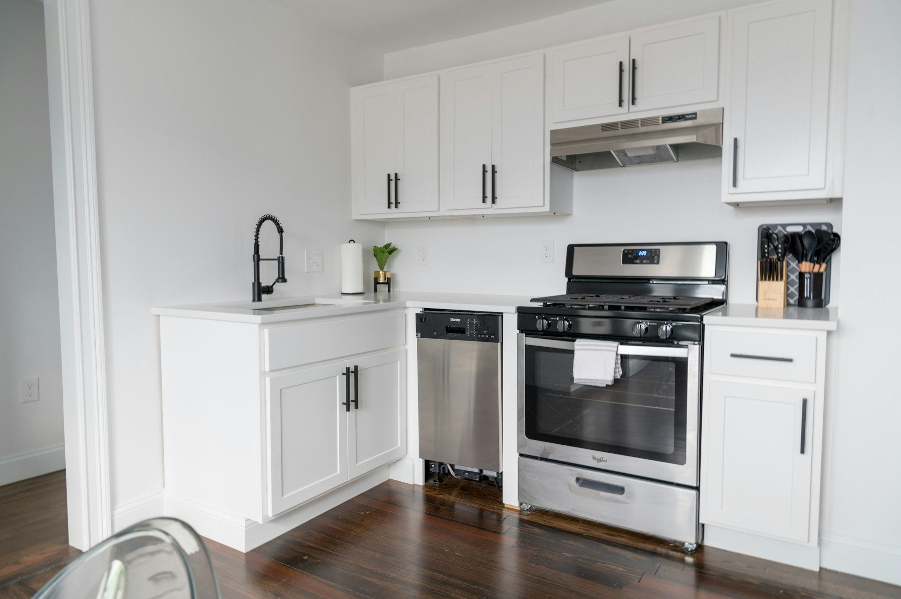
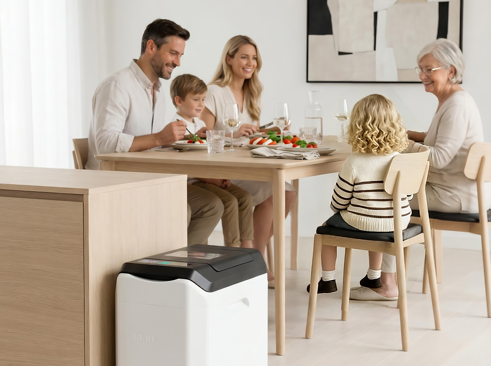
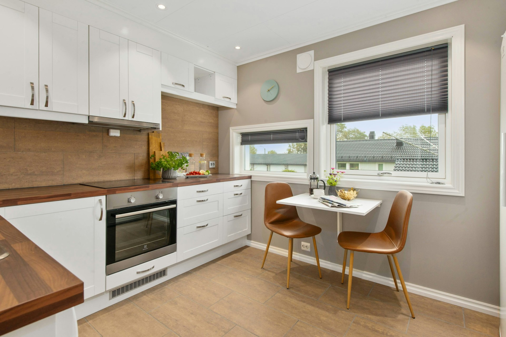

import GemeTerra2CTA from '@site/src/components/GemeTerra2CTA' 
import GemeComposterCTA from '@site/src/components/GemeComposterCTA' 
import RelatedArticles from '@site/src/components/RelatedArticles'
import ReactPlayer from 'react-player'

Let’s face it: **in a small kitchen, every square inch is sacred territory**. Between the air fryer, the coffee maker, and that one appliance you swear you’ll use someday, the thought of adding another bulky gadget to manage food waste can feel… overwhelming. You want to do the right thing and learn how to compost at home, but the options are confusing, and the last thing you need is a smelly, noisy eyesore cramping your culinary style.

What if you could have [**a clean, quiet, and truly effective system that fits seamlessly into your space**](https://www.geme.bio/product/terra2?utm_medium=blog&utm_source=geme_website&utm_campaign=general_seo_content&utm_content=the-best-composter-for-kitchen)? The search for the best composter for small kitchens isn't just about size; it's about cutting through marketing hype to find a machine that actually works without becoming a burden. Buckle up; we’re about to turn your food scraps into a success story.

<!-- truncate -->

## The Great Kitchen Composter Lie: Is Your Machine Just a Food Dehydrator?

Here’s the dirty little secret of the countertop composter world: many popular devices don’t actually compost. This is the single most important concept to grasp, and it’s backed by expert testing. [Publications like *Good Housekeeping* categorize these appliances into two distinct types: simple compost bins for storage, and electric units that “dry and grind your food scraps”]((https://www.goodhousekeeping.com/home-products/g43441519/best-countertop-composters/)).

The latter, which includes big names like Lomi and Mill, is more accurately described as a high-tech dehydrator and grinder. They use heat and mechanical agitation to remove moisture and chop up your waste. The result is a dry, shelf-stable material that’s reduced in volume and odor, but it is not biologically finished compost. [As *House Beautiful* testers noted, the output from these devices often needs to be mixed with soil at a specific ratio or given weeks to break down further before it’s truly plant-ready](https://www.housebeautiful.com/lifestyle/g44512525/best-countertop-composters/).

So, **what makes a true composter**? Real composting is a biological process driven by [**microorganisms that digest organic matter, transforming it into nutrient-rich humus**]((https://www.geme.bio/kobold-introduction?utm_medium=blog&utm_source=geme_website&utm_campaign=general_seo_content&utm_content=does-reencle-composter-produce-real-compost)). It’s the difference between mummifying your food scraps and letting a team of microscopic helpers turn them into “black gold” for your plants.

### The Fundamental Technology Divide

| Feature                | **Food Waste Dehydrator/Grinder (e.g., Lomi, Mill)**                              | **True Microbial Composter (e.g., GEME Terra 2)**                                             |
|------------------------|----------------------------------------------------------------------------------|----------------------------------------------------------------------------------------------|
| **Core Process**       | High-heat drying & mechanical grinding.                                          | Aerobic microbial digestion (true composting).                                               |
| **Primary Output**     | Dehydrated, ground-up “food grounds” or “dirt”.                                  | Real, biologically active compost ready for soil.                                            |
| **Soil Readiness**     | Output is not finished compost—often requires further processing or mixing with soil. | Output can be directly added to houseplants or gardens as a soil amendment.                  |
| **Handles All Scraps?**| Typically limited; often cannot process meat, bones, dairy, or oily foods reliably. | Yes. Designed to break down meat, dairy, small bones, and more through microbial action.     |
| **Long-Term Value**    | Ongoing costs for replacement carbon filters and consumable pods are common.      | No recurring filter costs with a permanent filtration system, offering higher long-term value.|

Understanding this divide is your first step toward making a smart choice. If your goal is simply to reduce trash volume, a dehydrator might suffice. But if you want to complete the cycle and create genuine, nutrient-dense compost for your plants, you need a machine that does the real biological work.

<GemeTerra2CTA 
 imgSrc="/img/geme-terra-2-composter.jpg"
 productTitle="GEME Terra II: Best Kitchen Composter"
 features={[
    "✅ Turn Your Food Waste Into Compost",
    "✅ Quiet, Odour-Free, Real Compost",
    "✅ Zero Filter Costs, No Refills",
    "✅ Reduce Landfill Waste & Greenhouse Gases"
 ]}
buttonText="Get Your GEME Terra II"
  href="https://www.geme.bio/product/terra2?utm_medium=blog&utm_source=geme_website&utm_campaign=general_seo_content&utm_content=the-best-composter-for-kitchen"
/>

## Meet GEME Terra 2: The “Add & Forget” Genius for Kitchens

Enter the GEME Terra 2, a device engineered from the ground up to be [the best kitchen composter for space-conscious homes](/blog/best-kitchen-composter-2026/). It doesn’t just take up less physical space; it takes up less mental space by making the entire process effortless.

### Size, Sound & Smell: The Holy Trinity of Small-Kitchen Appliances

 1. **The Footprint**: With dimensions comparable to a large countertop rice cooker or a small trash bin, the Terra 2 is designed to be floor-standing, freeing up your precious counter space. As noted in reviews of similar appliances, measuring your intended spot is always wise.

 2. **The Volume**: Operating at a quiet hum (around 35-40 dB), it’s quieter than most conversations and won’t disrupt your peaceful kitchen or open-plan living area. This is a stark contrast to some dehydrator-style models that testers have found to be “louder than expected”.

 3. **The Odor (or Lack Thereof)**: This is where the permanent metal-ion catalytic filter shines. Unlike systems that rely on replaceable carbon filters (an added cost and chore), GEME’s filter is designed to last the lifetime of the machine, actively neutralizing odors without ever needing replacement. Users and testers of true composting systems consistently report minimal to no unpleasant smells.

### The AI-Powered Magic: [How It Actually Works](https://www.geme.bio/how-it-works?utm_medium=blog&utm_source=geme_website&utm_campaign=general_seo_content&utm_content=does-reencle-composter-produce-real-compost)

The GEME Terra 2 is billed as the world’s first AI-powered kitchen composter. But what does that mean to you? It means the machine’s brain continuously monitors and adjusts the internal environment, temperature, moisture, oxygen, to keep its proprietary “Kobold” microbes in their ideal, happy state.
These aren’t lab-created packets you buy every month; they are robust, self-replicating microorganisms adapted from large-scale industrial composting. They work continuously, allowing you to add scraps anytime, after breakfast prep, while making dinner, during cleanup, without waiting for a batch cycle to end. This “continuous feed” design is a game-changer for the daily cooking rhythm.

Imagine this, no more holding onto stinky scraps, no more checking cycle lights, and no more limitations on what you can toss in (yes, those chicken bones and cheese rinds are welcome here). It turns how to compost at home from a scheduled chore into a simple, daily habit: open, toss, forget.

[**See how GEME Terra II works & why it matters** -->](https://www.geme.bio/how-it-works?utm_medium=blog&utm_source=geme_website&utm_campaign=general_seo_content&utm_content=does-reencle-composter-produce-real-compost)

[**Learn more about GEME Kobold and the controlled microbial fermentation** -->](https://www.geme.bio/kobold-introduction?utm_medium=blog&utm_source=geme_website&utm_campaign=general_seo_content&utm_content=does-reencle-composter-produce-real-compost)

### Side-by-Side Smackdown: GEME Terra 2 vs. Dehydrators

Let’s get specific. How does the Terra 2 stack up against the other names you’re likely considering? This comparison table cuts through the noise.

| Aspect                 | [**GEME Terra 2**](https://www.geme.bio/product/terra2?utm_medium=blog&utm_source=geme_website&utm_campaign=general_seo_content&utm_content=the-best-composter-for-kitchen)                                                      | **Reencle Prime**                                      | **Lomi**                                     | **Mill Gen 2**                                 |
|------------------------|-------------------------------------------------------------------|----------------------------------------------------|-------------------------------------------|--------------------------------------------|
| **True Technology**    | **Microbial Composter**                                               | Microbial Fermentation                             | Dehydrator/Grinder                        | Dehydrator/Grinder                         |
| **Final Output**       | **Real, ready-to-use compost**                                        | “Pre-compost” needing curing                       | “Lomi Earth” (dried waste)                | “Food Grounds” (not compost)               |
| **Daily Capacity**     | Up to **~2 kg (continuous)**                                          | ~0.7 kg                                            | Cycle-based (approx. 3L bin)              | Batch-based (6.5L bucket)                  |
| **Handles Meat/Bones?**| **Yes** (small bones, meat, dairy)                                    | Limited (no hard bones)                            | Limited                                   | Limited                                    |
| **Ongoing Costs**      | **\$0 (Permanent filter)**                                             | ~\$35/year (carbon filters)                         | High (filter/pod refills)                 | \$89/filter + service fees                  |
| **Best For**           | **Gardeners & serious composters wanting soil-ready output & no fees**.| Users wanting microbial action but okay with curing output.| Users seeking fast waste reduction, not true compost.| Users integrated into a pickup/service ecosystem. |

As you can see, the Terra 2 stands apart by delivering real compost with no subscription traps. [A reviewer from *Techlicious* noted that even with well-regarded microbial units like the Reencle, output often requires a secondary curing period and has limitations on hard scraps](https://www.techlicious.com/review/reencle-prime-kitchen-composter-review/). The Terra 2 is designed to overcome these very hurdles.

<GemeTerra2CTA 
 imgSrc="/img/geme-terra-2-composter.jpg"
 productTitle="GEME Terra II: Best Kitchen Composter"
 features={[
    "✅ Turn Your Food Waste Into Compost",
    "✅ Quiet, Odour-Free, Real Compost",
    "✅ Zero Filter Costs, No Refills",
    "✅ Reduce Landfill Waste & Greenhouse Gases"
 ]}
buttonText="Get Your GEME Terra II"
  href="https://www.geme.bio/product/terra2?utm_medium=blog&utm_source=geme_website&utm_campaign=general_seo_content&utm_content=the-best-composter-for-kitchen"
/>

## The Real Cost: Your Wallet and the Planet

Let’s talk numbers, because value matters. A dehydrator might have a lower upfront price tag, but the hidden, recurring costs of proprietary filters and enzyme pods can add hundreds of dollars over a few years.

The GEME Terra 2 flips this model. Its slightly higher initial investment buys you complete ownership. With no mandatory refills, pods, or filter replacements, your total cost of ownership becomes predictable and often lower in the long run. You’re not just buying an appliance; you’re investing in a closed-loop system for your home. Beyond dollars, you’re diverting waste from methane-producing landfills and creating a genuine resource for your plants, whether that’s a windowsill herb garden or a collection of houseplants.

[**Calculate the hidden costs: Terra 2 Vs. Lomi** -->](https://www.geme.bio/cost-calculator/terra2-vs-lomi?utm_medium=blog&utm_source=geme_website&utm_campaign=general_seo_content&utm_content=the-best-composter-for-kitchen)

[**Calculate the hidden costs: Terra 2 Vs. Mill** -->](https://www.geme.bio/cost-calculator/terra2-vs-mill?utm_medium=blog&utm_source=geme_website&utm_campaign=general_seo_content&utm_content=the-best-composter-for-kitchen)

[**Calculate the hidden costs: Terra 2 Vs. Reencle** -->](https://www.geme.bio/cost-calculator/terra2-vs-reencle?utm_medium=blog&utm_source=geme_website&utm_campaign=general_seo_content&utm_content=the-best-composter-for-kitchen)

## FAQs: All Your Kitchen Composting Worries, Solved.

 ### 1. I live in an apartment. Is the GEME Terra 2 really the best kitchen composter for me?

  Absolutely. [Its quiet operation, effective odor control, and compact, floor-standing design make it **ideal for apartments**](/blog/how-to-compost-at-home). You get the benefits of how to compost at home without any of the traditional downsides.

 ### 2. How often do I actually have to empty it?

  Thanks to up to 95% volume reduction through microbial digestion, you only need to harvest the finished compost every 1-2 months, depending on your household size. It’s remarkably low-maintenance.

 ### 3. Can it really handle onion peels, citrus, and avocado pits?

  Yes. The robust Kobold microbes are specifically engineered to break down tough, fibrous materials that frustrate other systems, including citrus rinds and small pits.

 ### 4. What about power consumption?

  As a true bioreactor that maintains optimal conditions for microbes, it uses energy efficiently. Comparative analyses suggest it often uses less energy over a cycle than dehydrators that rely on sustained high heat.

## Final Verdict: The Clear-Cut Choice for Small-Space Sustainability

Finding the best composter for a small kitchen isn’t about finding the smallest container. It’s about finding the smartest, most efficient system that aligns with a sustainable goal: turning waste into a resource.

The GEME Terra 2 wins this contest by not playing the same game as the dehydrators. It offers a fundamental technological advantage, real, microbial composting, packaged into a quiet, odor-free appliance that fits your life and your space. It removes the hassle, the hidden fees, and the guesswork from how to compost at home.

Ready to close your kitchen’s loop? Stop managing waste and start creating soil. Visit the GEME website today to learn more about the Terra 2 and see how it can transform your small kitchen into a powerhouse of sustainability. Your plants (and your planet) will thank you.

<GemeTerra2CTA 
 imgSrc="/img/geme-terra-2-composter.jpg"
 productTitle="GEME Terra II: Best Kitchen Composter"
 features={[
    "✅ Turn Your Food Waste Into Compost",
    "✅ Quiet, Odour-Free, Real Compost",
    "✅ Zero Filter Costs, No Refills",
    "✅ Reduce Landfill Waste & Greenhouse Gases"
 ]}
buttonText="Get Your GEME Terra II"
  href="https://www.geme.bio/product/terra2?utm_medium=blog&utm_source=geme_website&utm_campaign=general_seo_content&utm_content=the-best-composter-for-kitchen"
/>

## Verified Source Citations

1. [**Good Housekeeping** - “What to Know About Countertop Composters”](https://www.goodhousekeeping.com/home-products/g43441519/best-countertop-composters/)

2. [**House Beautiful** - “We Tested 5 Top Countertop Composters”](https://www.housebeautiful.com/lifestyle/g44512525/best-countertop-composters/)

3. [**Techlicious** - “Reencle Prime Kitchen Composter Review”](https://www.techlicious.com/review/reencle-prime-kitchen-composter-review/)

4. [**GEME Official Website** - GEME Terra 2 Product Page](https://www.geme.bio/product/terra2?utm_medium=blog&utm_source=geme_website&utm_campaign=general_seo_content&utm_content=the-best-composter-for-kitchen)

5. [**EPA: Food Recovery Hierarchy**](https://19january2017snapshot.epa.gov/sustainable-management-food/food-recovery-hierarchy_.html)

<RelatedArticles
  slugs={[
  "how-to-reduce-food-waste-during-spring-festival",
  "does-reencle-composter-produce-real-compost",
  "does-mill-composter-really-compost",
  "how-to-reduce-food-waste-at-home-2026",
  "free-mcnugget-caviar-raises-food-waste-concerns",
  "composting-in-winter",
  "how-to-compost-at-home",
  "zero-waste-home-kitchen-composter",
  "does-lomi-composter-really-compost",
  "5-best-kitchen-composters-in-2026",
  "best-kitchen-composter-in-2026-geme-terra-2",
  "geme-vs-reencle-composter-2026",
  "geme-vs-mill-composter-2026",
  "best-kitchen-composter-2026",
  "advanced-geme-compost-application-guide",
  "electric-compost-bin-filters-costs-comparison",
  "geme-vs-lomi", 
  "geme-terra-2-debuts",
  "the-best-composter-to-reduce-food-waste",
  "compost-pile-vs-electric-composter",
  "how-to-make-bananas-last-longer",
  "how-long-do-apples-last-in-the-fridge",
  "can-i-compost-moldy-grapes",
  "can-you-compost-moldy-bread",
  ]}
/>

_Ready to transform your gardening game? Subscribe to our [newsletter](http://geme.bio/signup) for expert composting tips and sustainable gardening advice._

