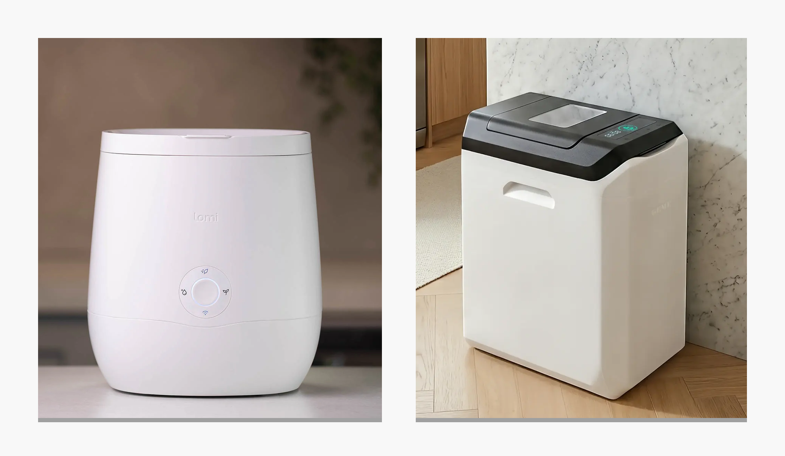
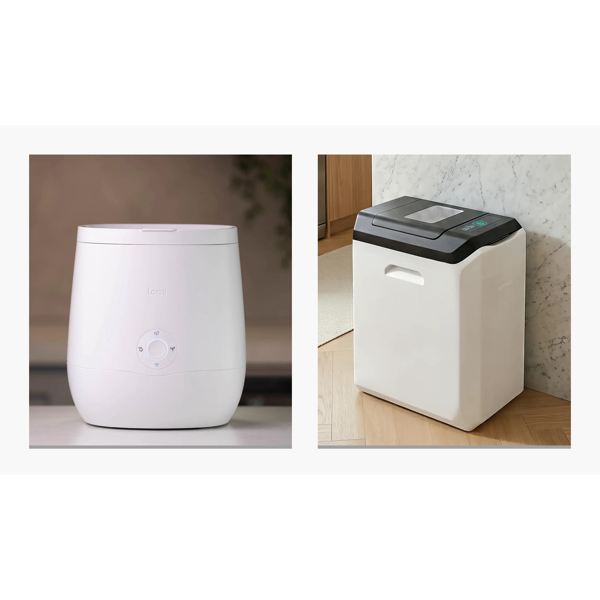

import GemeTerra2CTA from '@site/src/components/GemeTerra2CTA' 
import GemeComposterCTA from '@site/src/components/GemeComposterCTA' 
import RelatedArticles from '@site/src/components/RelatedArticles'
import ReactPlayer from 'react-player'

Let’s be honest. You want to save the planet, but you don’t want your 500-square-foot apartment smelling like a dumpster behind a seafood restaurant. You want to compost at home without actually "composting", you know, the turning, the worms, the backyard you don’t have.

I get it. I’ve been there.

The good news? The age of the indoor composter is here. The bad news? The market is currently flooded with expensive machines that are lying to you. They claim to make "dirt," but in reality, they’re just expensive food dehydrators that grind your avocado skins into dust.

Today, we are looking at the two biggest names in the game: [**the Lomi (by Pela) and the GEME Terra 2 (the world’s first AI-powered kitchen composter)**](https://www.geme.bio/product/terra2?utm_medium=blog&utm_source=geme_website&utm_campaign=general_seo_content&utm_content=best-indoor-composter-for-apartment-geme-vs-lomi). By the end of this, you won’t just know which machine is better, you’ll understand why calling one a "composter" is a bit of a stretch.

<!-- truncate -->

## Why Your Apartment Is Begging for a Composter?

If you live in a high-rise or a walk-up, you know the struggle. You can’t just toss scraps in the backyard. You either let them rot in a plastic bag under the sink (inviting a fruit fly rave) or you freeze them like a storing evidence. This is why the kitchen composter category has exploded.

However, how to compost at home in an apartment requires a specific kind of magic. It needs to be:

 - **Small-ish**: It needs to fit on your counter or in a corner.

 - **Odorless**: Your neighbor doesn't want to smell your coffee grounds.

 - **Low Maintenance**: You are busy; you don’t want a pet project.

This brings us to the main event. We are putting the Pela Lomi against the GEME Terra 2. But first, we have to address the elephant in the room, or rather, the microbe in the machine.

## The Fundamental Difference: The "Blow Dryer" vs. The "Bioreactor"

To understand who wins the title of best composter, you must understand that these two machines do not have the same job.

### Lomi (The Dehydrator)

Lomi is a grind-and-dry machine . It uses a grinding blade and intense heat to bake your food waste until it shrinks. It’s like putting an apple in the oven to make a chip. The result is a "dark-brown, crumbly dust" . It looks like dirt, but as soil scientists and experts at Epic Gardening note, it is technically organic matter, not soil . It lacks the living biology required to feed plants naturally.

### GEME Terra 2 (The AI Bioreactor)

The GEME Terra 2 is different. It doesn't just cook your food; it digests it. It uses a proprietary blend of microorganisms (lovingly named "Kobold") that actually eat the waste . It maintains a "Goldilocks" temperature (45–55°C) where these microbes thrive. The result is genuine, living compost teeming with beneficial bacteria.

### The Funny Analogy

Think of Lomi as a high-tech garbage disposal with a blow-dryer attachment. It makes your trash smaller and drier. Think of GEME as having a tiny, invisible, AI-managed farm of pets that get hungry and poop out soil. One manages waste; the other creates life.

[**See how GEME Terra II works & why it matters** -->](https://www.geme.bio/how-it-works?utm_medium=blog&utm_source=geme_website&utm_campaign=general_seo_content&utm_content=best-indoor-composter-for-apartment-geme-vs-lomi)

[**Learn more about GEME Kobold and the controlled microbial fermentation** -->](https://www.geme.bio/kobold-introduction?utm_medium=blog&utm_source=geme_website&utm_campaign=general_seo_content&utm_content=best-indoor-composter-for-apartment-geme-vs-lomi)

<GemeTerra2CTA 
 imgSrc="/img/geme-terra-2-composter.jpg"
 productTitle="GEME Terra II: Best Kitchen Composter"
 features={[
    "✅ Turn Food Waste Into Real Compost",
    "✅ Quiet, Odour-Free, Real Compost",
    "✅ Zero Filter Costs, No Refills",
    "✅ Reduce Landfill Waste & Greenhouse Gases"
 ]}
buttonText="Get Your GEME Terra II"
  href="https://www.geme.bio/product/terra2?utm_medium=blog&utm_source=geme_website&utm_campaign=general_seo_content&utm_content=best-indoor-composter-for-apartment-geme-vs-lomi"
/>

## Head-to-Head: Specs Don't Lie

### Table 1: GEME Terra 2 vs. Lomi - The Feature Smackdown

| Feature                  | GEME Terra 2                                  | Lomi (All Models)                          |
|--------------------------|-----------------------------------------------|--------------------------------------------|
| **Technology**           | Microbial Fermentation (AI Controlled)        | Grinding & Dehydration                     |
| **Output**               | Real, Living Compost                          | Sterile, Dried Dust ("Lomi Earth")         |
| **Capacity**             | 14L Tank (45+ days of waste)                  | 3L Bucket (1-4 days of waste)              |
| **Operation Mode**       | Continuous Feed (Add anytime)                 | Batch Cycle (Locked during run)            |
| **Can it handle meat/dairy?** | Yes (Up to 3kg)                             | Limited (Grease issues reported)           |
| **Noise Level**          | 35–40 dB (Whisper quiet)                      | 60+ dB (Comparable to a blender)           |
| **Filter System**        | Permanent Metal-Ion (No replacement)          | Charcoal Filters (Replace every 3-6 months)|
| **Energy Consumption**   | ~58Wh (Like a laptop)                        | ~500Wh - 1kWh (Like an oven)               |
| **App/Smart Features**   | AI Optimization                               | Smart Cycle Tracking                       |
| **Availability**         | Available Globally                            | Halted in U.S. (as of April 2024)          |

### Table 2: The True Cost of Ownership (The "Subscription Trap")

This is where things get spicy. A \$500 machine is an investment. But a \$500 machine that requires \$50 refills every few months is a subscription you didn’t sign up for.

Lomi requires two specific consumables to function effectively:

 - **LomiPods**: Microbe tablets to aid breakdown (**~\$53.99 for 90 cycles**).

 - **Charcoal Filters**: To control odor (**~\$20-30 every 3 months**).

**GEME Terra 2 requires \$0**. You read that right. Zero. The metal-ion filter is permanent. The microbes (Kobold) replicate themselves as they eat your waste .

| **Cost Category**                   | **Lomi** (3-Year Estimate) | **GEME Terra 2** (3-Year Estimate) |
|---------------------------------|------------------------|-------------------------------|
| **Machine Cost**                    | \$499                   | \$549                          |
| **Consumables (Filters/Pods)**      | ~\$600                  | \$0                            |
| **Total 3-Year Investment**         | \$1,099                 | \$549                          |
| **Resale Value**                    | Low (E-waste)          | High (Durable goods)          |

**The Verdict**: You pay \$50 more upfront for the GEME, but you save \$550 over three years. That’s the kind of math that makes accountants cry (happy tears).

[**Calculate the hidden costs: Terra 2 Vs. Lomi** -->](https://www.geme.bio/cost-calculator/terra2-vs-lomi?utm_medium=blog&utm_source=geme_website&utm_campaign=general_seo_content&utm_content=best-indoor-composter-for-apartment-geme-vs-lomi)

<GemeTerra2CTA 
 imgSrc="/img/geme-terra-2-composter.jpg"
 productTitle="GEME Terra II: Best Kitchen Composter"
 features={[
    "✅ Turn Food Waste Into Real Compost",
    "✅ Quiet, Odour-Free, Real Compost",
    "✅ Zero Filter Costs, No Refills",
    "✅ Reduce Landfill Waste & Greenhouse Gases"
 ]}
buttonText="Get Your GEME Terra II"
  href="https://www.geme.bio/product/terra2?utm_medium=blog&utm_source=geme_website&utm_campaign=general_seo_content&utm_content=best-indoor-composter-for-apartment-geme-vs-lomi"
/>

## Does "Real Compost" Actually Matter? (Yes, and Here is Why)

You might be thinking, "Who cares if it’s ‘real’ compost? I just want less trash."

Fair point. But let me paint you a picture. You buy a Lomi. You run a 20-hour "Grow Mode" cycle. You get a cup of coffee grounds-smelling dust. You sprinkle it on your basil plant. A week later, your basil looks... sad.

Why? Because sterile, dehydrated dust lacks the microbiome necessary to unlock nutrients in the soil. As noted by The New Yorker and Wired, Lomi’s output is essentially "**pre-compost**". It needs to be mixed into an existing outdoor pile or diluted heavily, otherwise, **it can actually harm plants by robbing nitrogen from the soil as it continues to decompose**.

GEME Terra 2 outputs compost that is ready to go. It’s dark, it smells like earth, and it contains active bacteria. **You mix it 1:8 with soil, and your plants get an immediate nutrient hit**.

## Apartment Living: The "Will My Roommate Kill Me?" Test

### 1. The Space Invader

 Lomi is bulky. [Users on Amazon complain that it eats up counter space](https://www.amazon.ae/product-reviews/B0B3FSQTRS/ref=zg_bs_g_12148530031_d_sccl_29_cr/260-7624195-6046715). GEME is also large, but because it holds 45+ days of waste, you don't actually need to keep it on the counter. You can tuck it in a corner and feed it once a week . You can’t do that with Lomi, the 3L bucket fills up in a day, forcing you to run a cycle immediately.

### 2. The Sound of Silence

 There are verified reports of Lomi operating at a volume that disrupts open-plan apartments. GEME operates at 35–40 dB. That’s quieter than a library.

### 3. The "I Forgot" Factor

 Lomi locks. Once you press that button, you cannot add food. If you have a dinner party and generate scraps while Lomi is running, those scraps sit in your sink until morning. GEME lets you open the lid and toss more in, even mid-cycle . It’s a game-changer.

## Verified Citations: What the Media Says

We aren't just making this up. Let’s look at the receipts.

 - **On Lomi**: Wired’s guide bluntly called it “a grinder-and-dryer.” Serious Eats noted the lid is finicky and the consumables are expensive .

 - **On GEME**: [Digital Trends named GEME among the “**best smart home tech of IFA 2024**”](https://www.amazon.ae/product-reviews/B0B3FSQTRS/ref=zg_bs_g_12148530031_d_sccl_29_cr/260-7624195-6046715). [Good Housekeeping and other testing labs emphasize that **true sustainability comes from low-maintenance, high-output device**s](https://www.goodhousekeeping.com/appliances/g60373874/best-countertop-composter/).

 - **User Review Snapshot**: One Lomi user from Canada loved their machine specifically because they weren't trying to make soil; they just wanted to eliminate fruit flies. This proves the point: **Lomi is a sanitation device. GEME is a composting device**.

## Frequently Asked Questions, Solved

 ### Q: What is the best indoor composter for a small family?
  
  A: For a family of 3-4, the GEME Terra 2 is superior. Its 14L capacity handles 45+ days of waste, whereas a 3L Lomi requires daily emptying .

 ### Q: How to compost at home without smell?
 
 A: Look for microbial systems with metal-ion oxidation (like GEME) rather than carbon filters. Carbon filters just trap smell; metal-ion destroys it at the molecular level .

 ### Q: Is Lomi actually composting?

 A: Technically, no. It is dehydrating. The output is dried food scraps, not humus. It is excellent for volume reduction but does not create living soil .

 ### Q: Can I put cooked chicken bones in a kitchen composter?
 
 A: In Lomi? No. You risk breaking the gears. In GEME Terra 2? Yes. The microbes can break down soft bones and meat .

 ### Q: Why is GEME called the world’s first AI-powered composter?
 
 A: GEME Terra 2 uses AI sensors to monitor the internal environment, adjusting oxygen and temperature to keep the Kobold microbes happy and hungry.

<GemeTerra2CTA 
 imgSrc="/img/geme-terra-2-composter.jpg"
 productTitle="GEME Terra II: Best Kitchen Composter"
 features={[
    "✅ Turn Your Food Waste Into Compost",
    "✅ Quiet, Odour-Free, Real Compost",
    "✅ Zero Filter Costs, No Refills",
    "✅ Reduce Landfill Waste & Greenhouse Gases"
 ]}
buttonText="Get Your GEME Terra II"
  href="https://www.geme.bio/product/terra2?utm_medium=blog&utm_source=geme_website&utm_campaign=general_seo_content&utm_content=best-indoor-composter-for-apartment-geme-vs-lomi"
/>

## Conclusion: Which One Should You Buy?

Look, I’m not here to tell you that Lomi is useless. It’s not. It’s a great gadget for someone who lives alone, generates very little waste, and just wants to throw less stuff in the trash. If you have no plants and no garden, Lomi is a very expensive trash compactor.

But if you want to close the loop. If you want to take your banana peel, turn it into fuel, and grow a new tomato on your balcony, you need the GEME Terra 2.

Stop renting your compost. Every time you buy a LomiPod or a charcoal filter, you are paying a subscription fee for waste. GEME Terra 2 frees you. Pay \$549 once, and you never pay again .

We don’t need to make "less trash." We need to make more soil. The world’s topsoil is disappearing. By using a microbial indoor composter, you aren't just recycling; you are regenerating.

### The Final Verdict

The best composter isn’t the one with the prettiest marketing or the celebrity endorsements. It’s the one that actually turns an eggshell back into earth.

[**Get your GEME Terra 2 today and start growing, not just grinding**](https://www.geme.bio/product/terra2?utm_medium=blog&utm_source=geme_website&utm_campaign=general_seo_content&utm_content=best-indoor-composter-for-apartment-geme-vs-lomi).

## Verified Source Citations

1. [**Wired**: Lomi is "A grinder-and-dryer, not a true composter"](https://www.wired.com/review/lomi-composter/)

2. [**Epic Gardening**: “Soil scientists confirm Lomi output is "organic matter, not compost"”](https://www.epicgardening.com/lomi-review/)

3. [**The New Yorker**: The False Promise of Kitchen Composting Machines, “Lomi output is "pre-compost" and requires dilution”](https://www.newyorker.com/culture/annals-of-inquiry/the-false-promise-of-kitchen-composting-machines)

4. [**Serious Eats**: Lomi Review --> "Finicky lid" and "expensive consumables"](https://www.seriouseats.com/lomi-composter-review-5189438)

5. [**Digital Trends**: GEME Terra 2 named among top smart home innovations](https://www.digitaltrends.com/home/ifa-2024-best-smart-home-tech/)

6. [**Amazon (Lomi Reviews)**: Verified complaints regarding counter space and noise levels](https://www.amazon.ae/product-reviews/B0B3FSQTRS/ref=zg_bs_g_12148530031_d_sccl_29_cr/260-7624195-6046715)

7. [**GEME TrustPilot / Reviews**: Verified user feedback on 35dB low noise level and continuous feed capability](https://www.trustpilot.com/review/geme.bio)

8. [Lomi Consumables Pricing (Verified on Feb 11th, 2026): LomiPods 90-Pack, Official Store, at \$53.99](https://lomi.com/products/lomi-pods-90-cycles)

9. [Lomi Consumables Pricing (Verified on Feb 11th, 2026): Lomi Carbon Filter Replacement, 2 refills(90-cycle), at \$53.99](https://lomi.com/products/lomi-filter-refills-90-cycles)

<RelatedArticles
  slugs={[
  "the-best-composter-for-kitchen",
  "how-to-reduce-food-waste-during-spring-festival",
  "does-reencle-composter-produce-real-compost",
  "does-mill-composter-really-compost",
  "how-to-reduce-food-waste-at-home-2026",
  "free-mcnugget-caviar-raises-food-waste-concerns",
  "composting-in-winter",
  "how-to-compost-at-home",
  "zero-waste-home-kitchen-composter",
  "does-lomi-composter-really-compost",
  "5-best-kitchen-composters-in-2026",
  "best-kitchen-composter-in-2026-geme-terra-2",
  "geme-vs-reencle-composter-2026",
  "geme-vs-mill-composter-2026",
  "best-kitchen-composter-2026",
  "advanced-geme-compost-application-guide",
  "electric-compost-bin-filters-costs-comparison",
  "geme-vs-lomi", 
  "geme-terra-2-debuts",
  "the-best-composter-to-reduce-food-waste",
  "compost-pile-vs-electric-composter",
  "how-to-make-bananas-last-longer",
  "how-long-do-apples-last-in-the-fridge",
  "can-i-compost-moldy-grapes",
  "can-you-compost-moldy-bread",
  ]}
/>

_Ready to transform your gardening game? Subscribe to our [newsletter](http://geme.bio/signup?utm_medium=blog&utm_source=geme_website&utm_campaign=general_seo_content&utm_content=best-indoor-composter-for-apartment-geme-vs-lomi) for expert composting tips and sustainable gardening advice._

