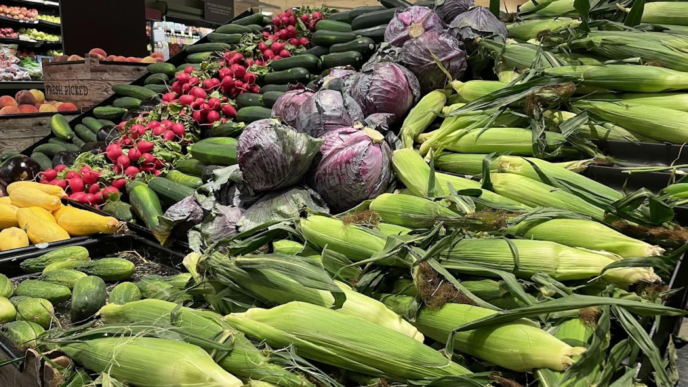
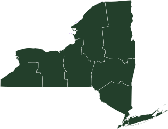

import GemeTerra2CTA from '@site/src/components/GemeTerra2CTA' 
import GemeComposterCTA from '@site/src/components/GemeComposterCTA' 
import RelatedArticles from '@site/src/components/RelatedArticles'
import ReactPlayer from 'react-player'

## Introduction: The Banana Peel That Costs \$25

Picture this: You're rushing out the door on a Tuesday morning. You finish a banana, toss the peel in the regular trash, and head to work. You just committed a \$25 offense.

Welcome to New York City in 2026.

As of January 1, the Department of Sanitation (DSNY) has fully reinstated fines for buildings that fail to separate organic waste . After a brief pause in 2025 following public backlash, the city is now serious about enforcement . Whether you live in a five-story walk-up in Brooklyn or a high-rise in Manhattan, how to compost at home is no longer a lifestyle choice—it's the law.

But here's the problem: Apartment living wasn't designed for compost bins. The smell, the fruit flies, the limited counter space—it's a nightmare. Fortunately, technology has caught up with regulation.

Enter the [**GEME Terra 2, the world's first AI-powered kitchen composter that doesn't just dry your food—it turns it into real, living compost using live microorganisms**](https://www.geme.bio/product/terra2?utm_medium=blog&utm_source=geme_website&utm_campaign=general_seo_content&utm_content=nyc-composting-fines-2026-geme-terra-2-best-electric-compost). And in a city where fines start at \$25 and can balloon to $300 for repeat offenses, investing in the best electric composter isn't just eco-friendly; it's financial self-defense .

In this article, we'll break down exactly what NYC requires, why traditional composting fails apartment dwellers, and how the GEME Terra 2 outperforms every other electric composter on the market.

<!-- truncate -->

## The 2026 NYC Composting Mandate: What You Need to Know

### A Timeline of Chaos and Consequences

New York's journey to mandatory composting has been... let's call it "tumultuous."

It started with Local Law 85 of 2023, which required the city to implement a citywide organics collection program . By October 2024, the program was live across all five boroughs. A grace period ran through March 2025, during which the city focused on education rather than enforcement .

Then came April 1, 2025—no joke. Fines officially began.

Within two weeks, DSNY issued over 4,000 tickets . The backlash was immediate. Mayor Eric Adams paused fines for smaller buildings just weeks later, promising "additional outreach and education" . Council members accused the administration of sabotaging the program .

But the pause was temporary. As of January 1, 2026, fines are back in full force—and this time, they're here to stay .

### The Fine Schedule (Read This and Tremble)

If you're a renter, the fine goes to your building owner—but guess who ultimately pays? Higher maintenance fees, stricter lease enforcement, or just a very angry landlord.

Here's the official DSNY penalty structure :

| **Building Size** | **First Offense** | **Second Offense** | **Third+ Offense** (within 12 months) |
|--------------|---------------|---------------|------------------------------------|
| 1–8 units    | \$25           | \$50           | \$100                               |
| 9+ units     | \$100          | \$200          | \$300                               |

And that's just for improper separation. If you set out waste at the wrong time or in the wrong container, add \$50–\$200 more in fines .

### What Must Be Composted?

According to DSNY's 311 portal, the following items must go into the brown compost bin :

**All food waste**: Meat, bones, dairy, prepared foods, fruit and vegetable scraps

**Food-soiled paper**: Greasy pizza boxes, uncoated paper plates, napkins, paper towels

## Why "Just Use a Bucket" Doesn't Work in an Apartment

If you've never lived in a New York apartment, let me paint you a picture. Your kitchen is roughly the size of a walk-in closet. You share a trash room with 50 other people. And in the summer, your apartment hits 85 degrees with 70% humidity.

Now add a bucket of food scraps.

Here's why traditional methods fail:

### 1. The Smell Factor

Even with a tight lid, food waste starts decomposing immediately. In a small, hot apartment, that means odor—fast.

### 2. Fruit Flies

Nothing invites fruit flies like exposed banana peels. Once they're in your apartment, they're nearly impossible to eradicate.

### 3. Space Constraints

A countertop compost pail takes space. A freezer stash takes even more. And if you're in a building with 30+ units, hauling scraps to a central bin is a hike.

### 4. The "I Forgot" Penalty

Miss collection day? Your scraps sit for another week. In summer. With fruit flies.

This is precisely why the city's focus on "education" misses the point. The barrier isn't knowledge, it's logistics.

## Enter GEME Terra 2: The World's First AI-Powered Kitchen Composter

The GEME Terra 2 isn't just another electric composter. It's a fundamental reimagining of what home composting can be.

### How It Works (And Why It's Different)

Most kitchen composter machines on the market—looking at you, Lomi—are essentially high-speed dehydrators. They grind your food and bake it until it shrinks into dust. That dust looks like dirt, but it's not. It's sterile, lacks microbial life, and can actually harm plants if used improperly .

### GEME Terra 2 works differently:

**Live Microorganisms**: A proprietary blend called "Kobold" literally eats your food waste.

**AI Control**: Sensors monitor temperature, humidity, and oxygen levels to keep the microbes happy.

**Real Compost Output**: The result is living, nutrient-rich soil—not dehydrated dust.

It's the difference between a food dehydrator and a living ecosystem.

[**See how GEME Terra II works & why it matters** -->](https://www.geme.bio/how-it-works?utm_medium=blog&utm_source=geme_website&utm_campaign=general_seo_content&utm_content=nyc-composting-fines-2026-geme-terra-2-best-electric-compost)

[**Learn more about GEME Kobold and the controlled microbial fermentation** -->](https://www.geme.bio/kobold-introduction?utm_medium=blog&utm_source=geme_website&utm_campaign=general_seo_content&utm_content=nyc-composting-fines-2026-geme-terra-2-best-electric-compost)

<GemeTerra2CTA 
 imgSrc="/img/geme-terra-2-composter.jpg"
 productTitle="GEME Terra II: Best Kitchen Composter"
 features={[
    "✅ Turn Food Waste Into Compost Effortlessly",
    "✅ Quiet, Odour-Free, Real Compost",
    "✅ Zero Filter Costs, No Refills",
    "✅ Reduce Landfill Waste & Greenhouse Gases"
 ]}
buttonText="Get Your GEME Terra II"
  href="https://www.geme.bio/product/terra2?utm_medium=blog&utm_source=geme_website&utm_campaign=general_seo_content&utm_content=nyc-composting-fines-2026-geme-terra-2-best-electric-compost"
/>

### GEME Terra 2 vs. Typical Dehydrator

| **Feature**                 | **GEME Terra 2**                                 | **Typical Dehydrator (e.g., Lomi)**           |
|-----------------------------|--------------------------------------------------|-----------------------------------------------|
| **Process**                 | Microbial fermentation                           | Grinding + high heat                         |
| **Output**                  | Living compost                                   | Sterile, dried scraps                        |
| **Capacity**                | 14L (holds 45+ days of waste)                    | 3L (holds 1–4 days)                          |
| **Operation**               | Continuous feed (add anytime)                    | Batch cycle (locked during run)               |
| **Noise**                   | 35–40 dB (whisper quiet)                         | 60+ dB (blender volume)                      |
| **Filters**                 | Permanent metal-ion (no replacement)             | Charcoal filters (replace every 3–6 months)  |
| **Energy Use**              | ~117Wh (like a laptop)                           | ~500Wh–1kWh (like an oven)                   |
| **Can handle meat/dairy?**  | Yes                                              | Limited                                      |
| **Annual consumable cost**  | \$0                                               | \$100–\$200                                    |

### The "Continuous Feed" Game Changer

Here's why this matters for apartment living: **You can add waste anytime**.

With batch-cycle machines, once you start a cycle, the lid locks. If you cook dinner while it's running, those scraps sit on your counter overnight. With GEME, you just lift the lid and toss them in.

In a small apartment, that flexibility isn't a luxury—it's a necessity.

[**Calculate the hidden costs: Terra 2 Vs. Lomi** -->](https://www.geme.bio/cost-calculator/terra2-vs-lomi?utm_medium=blog&utm_source=geme_website&utm_campaign=general_seo_content&utm_content=nyc-composting-fines-2026-geme-terra-2-best-electric-compost)

<GemeTerra2CTA 
 imgSrc="/img/geme-terra-2-composter.jpg"
 productTitle="GEME Terra II: Best Kitchen Composter"
 features={[
    "✅ Turn Food Waste Into Real Compost",
    "✅ Quiet, Odour-Free, Real Compost",
    "✅ Zero Filter Costs, No Refills",
    "✅ Reduce Landfill Waste & Greenhouse Gases"
 ]}
buttonText="Get Your GEME Terra II"
  href="https://www.geme.bio/product/terra2?utm_medium=blog&utm_source=geme_website&utm_campaign=general_seo_content&utm_content=nyc-composting-fines-2026-geme-terra-2-best-electric-compost"
/>

## How GEME Solves the NYC Compliance Problem

Let's connect the dots between city policy and your kitchen counter.

### Problem 1: Fines for Improper Disposal

If your building gets caught with food in the trash, you get fined. But if you run a GEME, there is no food in your trash. Meat bones, coffee grounds, moldy leftovers—all go into the machine. Your regular trash becomes mostly packaging and non-organic waste.

### Problem 2: Building-Wide Compliance

For property managers, providing a GEME to tenants (or encouraging them to buy one) drastically reduces the risk of DSNY violations. One tenant who "forgets" can cost the building hundreds in fines. Individual machines eliminate that risk.

### Problem 3: The "I Want Real Soil" Factor

Samantha MacBride, former DSNY research director, noted that policy success depends on residents seeing the value of composting—watching scraps turn into soil . GEME delivers that experience. You see the transformation. You use the compost for your plants. You become invested in the process.

### Problem 4: Space Constraints

NYC apartments don't have room for outdoor compost piles. GEME fits on a counter or in a corner, holds 45+ days of waste, and operates silently. It's designed for the space you actually have.

## The Environmental Case: Why Real Compost Matters

New York City's stated goal is reducing methane emissions from landfills . But here's the uncomfortable truth: Much of the city's organic waste doesn't become compost at all.

According to Grist, only about one-fifth of collected food waste actually makes it to the Staten Island composting facility . The rest goes to an anaerobic digester at the Newtown Creek wastewater plant, where it's mixed with sewage and flared for energy—a process that critics say entrenches fossil fuel infrastructure .

When you compost at home with GEME, you bypass this broken system entirely. You create:

 - Real soil amendment for your houseplants or community garden

 - Zero methane emissions (the process is aerobic)

 - Educational value for kids and neighbors

And when the city hosts "Compost Giveback Events" where residents can claim free compost made from collected waste, you'll already have your own.

## Cost-Benefit Analysis for NYC Residents

| **Scenario**                   | **Annual Cost**                    | **Output**             | **Fulfills NYC Mandate?**    |
|----------------------------|-------------------------------|--------------------|--------------------------|
| Do nothing (risk fines)    | \$25–\$300+ per violation       | N/A                | ❌                       |
| Curbside bin only          | \$0 (but hauling required)     | None (city processes) | ✅ (if compliant)     |
| Dehydrator composter       | \$100–\$200 (filters + pods)    | Sterile dust       | ✅                       |
| GEME Terra 2               | \$0 consumables                | Living compost     | ✅                       |

**The Verdict**: Over three years, a dehydrator costs $300–$600 in filters and additives alone. GEME costs zero. And you get real soil instead of dust.

<GemeTerra2CTA 
 imgSrc="/img/geme-terra-2-composter.jpg"
 productTitle="GEME Terra II: Best Kitchen Composter"
 features={[
    "✅ Turn Food Waste Into Compost Effortlessly",
    "✅ Quiet, Odour-Free, Real Compost",
    "✅ Zero Filter Costs, No Refills",
    "✅ Reduce Landfill Waste & Greenhouse Gases"
 ]}
buttonText="Get Your GEME Terra II"
  href="https://www.geme.bio/product/terra2?utm_medium=blog&utm_source=geme_website&utm_campaign=general_seo_content&utm_content=nyc-composting-fines-2026-geme-terra-2-best-electric-compost"
/>

## How to Compost at Home: A Step-by-Step Guide with GEME

If you're new to this, here's exactly how to integrate GEME into your NYC apartment routine.

### Step 1: Set Up Your GEME Terra 2

Find a spot near an outlet. The machine is sleek enough for countertops but unobtrusive enough for a corner.

### Step 2: Add Your Microbes

The Kobold starter culture goes in once. These microbes multiply as they eat, so you never need to buy more .

### Step 3: Dump Scraps Daily

Every time you cook, scrape leftovers, peels, and expired food into the GEME. Meat, bones, dairy—all welcome.

### Step 4: Let AI Do the Work

The machine monitors itself. When the bin gets full, it processes continuously. No buttons to press, no cycles to schedule.

### Step 5: Harvest Compost

Every few weeks, remove rich, earthy compost. Mix it 1:8 with potting soil for houseplants, or donate to a community garden.

### Step 6: Avoid Fines

With no organic waste in your trash, you're automatically compliant with DSNY rules.

## Frequently Asked Questions (Answered)

### What is the best electric composter for apartments?

The GEME Terra 2 is widely considered the best composter because it produces living soil, requires no consumables, and operates continuously .

### How to compost at home without smell?

GEME uses metal-ion oxidation, which neutralizes odors at the molecular level. Unlike carbon filters, it's permanent and requires no replacement .

### Can I compost meat and bones in a kitchen composter?

Yes, if you use GEME. The Kobold microbes break down meat, bones, and dairy efficiently. Dehydrators struggle with these items .

### What's the difference between GEME and Lomi?

Lomi dehydrates and grinds food into sterile dust. GEME uses live microorganisms to create real compost. Lomi requires expensive filters and pods; GEME has zero recurring costs .

### Will my building still get fined if I use GEME?

No. The fine applies when organic waste is found in regular trash. If your organic waste goes into GEME, your trash is compliant.

### Where can I buy GEME Terra 2?

[Click here for direct purchase](https://www.geme.bio/product/terra2?utm_medium=blog&utm_source=geme_website&utm_campaign=general_seo_content&utm_content=nyc-composting-fines-2026-geme-terra-2-best-electric-compost) and shipping to NYC addresses.

## Conclusion: Turn Compliance into Contribution

New York City's mandatory composting program isn't going away. The fines are real, the enforcement is real, and the environmental stakes are real. Methane from landfills is a major driver of climate change, and organic waste is a primary source .

But here's the good news: You don't have to dread this policy. You can embrace it—with the right tool.

The GEME Terra 2 transforms a municipal requirement into a personal benefit. You avoid fines, eliminate food waste odor, and create something valuable: real soil for real plants. It's the only electric composter that uses AI and live microorganisms to do what nature intended.

A \$25 fine buys you one banana peel in the wrong bin. For less than the cost of two violations, you can own a GEME and never pay another cent in consumables or penalties .

New York City's composting system captures only 20% of organic waste for actual soil creation . When you use GEME, you operate at 100% efficiency. Every scrap becomes soil, not emissions.

<GemeTerra2CTA 
 imgSrc="/img/geme-terra-2-composter.jpg"
 productTitle="GEME Terra II: Best Kitchen Composter"
 features={[
    "✅ Turn Food Waste Into Compost Effortlessly",
    "✅ Quiet, Odour-Free, Real Compost",
    "✅ Zero Filter Costs, No Refills",
    "✅ Reduce Landfill Waste & Greenhouse Gases"
 ]}
buttonText="Get Your GEME Terra II"
  href="https://www.geme.bio/product/terra2?utm_medium=blog&utm_source=geme_website&utm_campaign=general_seo_content&utm_content=nyc-composting-fines-2026-geme-terra-2-best-electric-compost"
/>

### The Final Word

 - Stop worrying about what goes in the brown bin. Start creating black gold.

 - Get your GEME Terra 2 today and compost like the city depends on it—because it does.

## Verified Sources Citations

[GEME Official Website – GEME Terra 2 Product Specifications and Comparison Data](https://www.geme.bio/compare?utm_medium=blog&utm_source=geme_website&utm_campaign=general_seo_content&utm_content=nyc-composting-fines-2026-geme-terra-2-best-electric-compost)

[New York City Council – Int. No. 152-2026: Voluntary Organics Collection Program Legislation](https://legistar.council.nyc.gov/LegislationDetail.aspx?ID=7861797&GUID=5001E3C2-C128-4758-9EE8-396A614E9E46)

[NYC Council (Shahana Hanif) – NYC Pauses Fines on Composting, April 2025](https://council.nyc.gov/shahana-hanif/2025/04/21/nyc-pauses-fines-on-this-service-just-weeks-after-enforcement/)

[FirstService Residential – 2025 NYC Composting Rules Guide](https://www.fsresidential.com/new-york/news-events/articles-and-news/2025-nyc-composting-rules/) 

[NYC Food Waste Composting Report](https://news.pts.org.tw/article/771315)

[NYC Council (Shahana Hanif) – City Pauses Curbside Composting Fines, Drawing Criticism, April 2025](https://council.nyc.gov/shahana-hanif/2025/04/18/city-pauses-curbside-composting-fines-drawing-council-criticism/) 

[El Comercio Perú – Multas por no reciclar orgánicos en Nueva York (Fines for Not Recycling Organics in NYC), February 2026](https://elcomercio.pe/mag/usa/local-us/dsny-retoma-las-multas-por-no-reciclar-organicos-en-nueva-york-de-cuanto-son-las-sanciones-a-los-edificios-nnda-nnlt-noticia/) 

[NYC 311 Official Portal – Curbside Composting Rules and Fines](https://portal.311.nyc.gov/article/?kanumber=KA-02030) 

[Grist.org – New York City is making people compost — or pay up, April 2025](https://grist.org/food-and-agriculture/new-york-city-is-making-people-compost-or-pay-up/) 

<RelatedArticles
  slugs={[
  "best-indoor-composter-for-apartment-geme-vs-lomi",
  "the-best-composter-for-kitchen",
  "how-to-reduce-food-waste-during-spring-festival",
  "does-reencle-composter-produce-real-compost",
  "does-mill-composter-really-compost",
  "how-to-reduce-food-waste-at-home-2026",
  "free-mcnugget-caviar-raises-food-waste-concerns",
  "composting-in-winter",
  "how-to-compost-at-home",
  "zero-waste-home-kitchen-composter",
  "does-lomi-composter-really-compost",
  "5-best-kitchen-composters-in-2026",
  "best-kitchen-composter-in-2026-geme-terra-2",
  "geme-vs-reencle-composter-2026",
  "geme-vs-mill-composter-2026",
  "best-kitchen-composter-2026",
  "advanced-geme-compost-application-guide",
  "electric-compost-bin-filters-costs-comparison",
  "geme-vs-lomi", 
  "geme-terra-2-debuts",
  "the-best-composter-to-reduce-food-waste",
  "compost-pile-vs-electric-composter",
  "how-to-make-bananas-last-longer",
  "how-long-do-apples-last-in-the-fridge",
  "can-i-compost-moldy-grapes",
  "can-you-compost-moldy-bread",
  ]}
/>

_Ready to transform your gardening game? Subscribe to our [newsletter](http://geme.bio/signup?utm_medium=blog&utm_source=geme_website&utm_campaign=general_seo_content&utm_content=nyc-composting-fines-2026-geme-terra-2-best-electric-compost) for expert composting tips and sustainable gardening advice._

