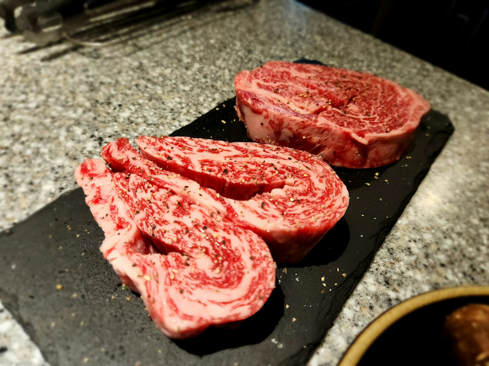

import GemeTerra2CTA from '@site/src/components/GemeTerra2CTA' 
import GemeComposterCTA from '@site/src/components/GemeComposterCTA' 
import RelatedArticles from '@site/src/components/RelatedArticles'
import ReactPlayer from 'react-player'

## How Long Can Ground Beef Stay in the Fridge?

Ground beef is a staple in many cuisines, but keeping it safe and fresh requires knowing the limits. According to food safety experts, raw ground beef (hamburger) can [only remain refrigerated **at 40°F (4°C) or below for about 1–2 days**](https://www.foodsafety.gov/food-safety-charts/cold-food-storage-charts). 

Similarly, [**cooked ground beef should be eaten within 3–4 days**](https://www.canada.ca/en/health-canada/services/meat-poultry-fish-seafood-safety/hamburger-safety-tips.html). These guidelines come from official sources like FoodSafety.gov (U.S. Department of Health) and Health Canada, reflecting both U.S. and international standards. By following these limits, you minimize the growth of harmful bacteria (like E. coli and Salmonella) and ensure the meat’s freshness.

<!-- truncate -->

## Guidelines for Refrigerator and Freezer Storage of meats and leftovers (U.S./Canadian data)

Below, Table 1 summarizes recommended refrigerator and freezer storage times for ground beef and other common foods:

| **Food Type**                     | **Refrigerator (≤40°F)**     | **Freezer (0°F)** |
| --------------------------------- | ---------------------------- | ----------------- |
| Raw Ground Beef (hamburger)       | **1–2 days**                   | 3–4 months        |
| Steak, Chops, Roasts (beef, pork) | 3–5 days                     | 4–12 months       |
| Cooked Ground Beef                | **3–4 days**                   | 2–3 months        |
| Cooked Meat/Poultry Leftovers     | 3–4 days                     | 2–6 months        |
| Fresh Poultry (whole/pieces)      | 1–2 days                     | 6–12 months       |
| Dairy (milk, yogurt, etc.)        | See label (usually 5-7 days) | 1–2 months        |

Practically speaking, when you bring ground beef home, plan to cook or freeze it within a day or two. Many supermarket packages have a “sell by” or “use by” date; the USDA recommends using raw ground beef no later than that date or freezing it immediately. If you can’t cook it soon, freezing is safer. Always store meat on a bottom shelf in a clean container to catch drips, and ensure your fridge is at 40°F (4°C) or colder.

### Raw vs Cooked Ground Beef: Different Storage Times

It’s important to distinguish raw from cooked ground beef storage. Raw ground beef is more perishable because it contains more moisture and has not been heated to kill bacteria. Expert guidelines agree: raw ground beef should be cooked or frozen within 1–2 days of purchase. 

In contrast, cooked ground beef (leftovers or dishes) can be kept slightly longer – about 3–4 days in the fridge. After cooking, let the beef cool quickly (within two hours), then refrigerate it in a sealed container. Labeling leftovers with a date is a good practice.

Factors that affect these times include initial meat quality (fresher meat lasts a bit longer) and refrigerator conditions. Keep the fridge temperature stable at or below 40°F (4°C); higher temperatures shorten shelf life. Vacuum packaging or airtight containers can help maintain moisture but still follow the 1–2 day rule for raw beef.

### How to Tell If Ground Beef Goes Bad

Even within the safe window, always check ground beef for spoilage before use. Ground beef that has gone bad often shows:

 - **Color Change**: Fresh beef is bright red on the outside (due to oxygen); the interior may be slightly darker. If it turns brown, gray, or green overall, that indicates oxidation and possible spoilage.

 - **Off-Odor**: Fresh ground beef has a mild, meaty smell. A sour, rancid, or sulfurous odor means bacteria may have multiplied. Trust your nose – discard if it smells off.

 - **Slimy or Sticky Texture**: Fresh ground beef should be firm and crumbly. A slimy or tacky film signals bacterial growth.

 - **Packaging Swelling**: If vacuum-sealed beef shows any ballooning, it’s a bad sign.

If any of these are present, it’s best to throw the meat out. Do not try to salvage spoiled meat by cooking it longer – toxins might remain. When in doubt, err on the side of caution. [****Food safety agencies emphasize these visual and smell cues to decide if meat is still edible**](https://grassrootscoop.com/blogs/recipes/how-long-can-ground-beef-stay-in-the-fridge).

<GemeTerra2CTA 
 imgSrc="/img/geme-terra-2-composter.jpg"
 productTitle="GEME Terra II: Best Kitchen Composter"
 features={[
    "✅ Compost Bad Ground Beef With Ease",
    "✅ Quiet, Odour-Free, Real Compost",
    "✅ Zero Filter Costs, No Refills",
    "✅ Reduce Landfill Waste & Greenhouse Gases"
 ]}
buttonText="Get Your GEME Terra II"
  href="https://www.geme.bio/product/terra2?utm_medium=blog&utm_source=geme_website&utm_campaign=general_seo_content&utm_content=how-long-can-ground-beef-stay-in-the-fridge"
/>

## Maximizing Freshness: Proper Handling Tips

To extend ground beef’s usability:

 - **Temperature Control**: As noted, keep your fridge at 40°F or lower. A fridge thermometer is worthwhile.

 - **Quick Refrigeration**: Don’t leave raw meat sitting out. [After shopping, refrigerate ground beef within 2 hours (1 hour if the temp is above 90°F/32°C)](https://www.canada.ca/en/health-canada/services/meat-poultry-fish-seafood-safety/hamburger-safety-tips.html).

 - **Separate Storage**: Store meat on a plate or sealed container on the lowest shelf to prevent cross-contamination with other foods.

 - **Thaw Safely**: Always thaw frozen beef in the fridge, not on the counter. This keeps it at a safe temperature as it defrosts.

 - **Freeze Early**: If you won’t use beef within 1 day, freeze it. Frozen raw ground beef keeps its best quality for 3-4 months (though it stays safe indefinitely if kept frozen).

By following these practices, you help ensure how long does ground beef stay in the fridge is as long as possible – but always within 1–2 days for raw.

## Global Guidelines and Updates

Food safety agencies worldwide echo the 1–2 day guidance for raw ground beef. For example, Canada’s Health Canada advises cooking or freezing fresh ground beef within 1–2 days of purchase. Similarly, USDA’s Food Safety and Inspection Service lists hamburger/ground meats as 1–2 days in the fridge. Many European and international food authorities recommend comparable limits (roughly 1 day), reflecting the science of bacterial growth.

Guidelines can update as new research emerges, so it’s wise to check current sources like foodsafety.gov and your country’s health website for any changes. For instance, FoodSafety.gov’s Cold Food Storage Chart was reviewed in 2023, confirming these times. In short, whether in the US, Canada, or EU, the consensus is consistent: don’t exceed a couple of days for raw ground beef.

## Can You Compost Meat?

Aside from storage, many home cooks worry about food waste. Scraps like meat bones or fat often end up in the trash. Can you actually compost meat? Conventional wisdom and EPA guidelines say no, composting meat, dairy, or oils in a backyard pile is discouraged because it attracts pests and pathogens. [The U.S. EPA even notes that material “ground up, dehydrated, or liquified by a residential food scraps dehydrator” is not considered compost](https://www.epa.gov/sustainable-management-food/composting). In other words, simply turning food to dehydrated pulp is not real compost.

However, new technology is changing the game. GEME Terra 2, an AI-driven kitchen composter, is specifically designed to handle meat, dairy, and all kitchen scraps. Unlike typical countertop “composters” (which actually just dehydrate waste), GEME Terra 2 uses live microorganisms to biologically digest scraps into genuine compost.

This means Terra 2 is uniquely capable of composting things even traditional composters and dehydrators can’t – for example, meat and small bones. On their site, GEME explicitly answers “Can I compost meat and bones?” with “Yes. Unlike dehydrators, GEME thrives on meat, dairy, and small bones.”. In short, with GEME Terra 2, the answer to “can you compost meat?” is a resounding yes.

## Comparison: GEME Terra 2 vs. Typical Electric Dehydrator

| **Feature**                    | **GEME Terra 2 (Bio-Composter)**                               | **Standard Dehydrator Composter**                          |
| ------------------------------ | -------------------------------------------------------------- | ---------------------------------------------------------- |
| **Process Method**             | Biological composting (microbes)                               | High-heat drying & grinding                                |
| **Output**                     | Nutrient-rich, microbe-rich compost                            | Dried, sterile organic pulp                                |
| **Accepted Waste**             | All food scraps (vegetables, fruits, meat, fish, bones, dairy) | Primarily vegetable/fruit peels; **no** meat or oily foods |
| **Odor & Filtration**          | Permanent metal-ion filter; odor-free                          | Needs activated charcoal filter; odors possible            |
| **Adding Waste**               | Continuous, 24/7 – toss anytime                                | Batch process – must load and run cycles                   |
| **Noise Level**                | Quiet (≈25–40 dB, whisper-quiet in improved model)             | Louder (often 60+ dB)                                      |
| **Filter Replacement**         | Never – permanent filter (lifetime)                            | Frequent (charcoal pads ~3 months)                         |
| **Energy Use**                 | Low (about 1.4 kWh/day)                                    | High (comparable to 500W+ appliance)                       |
| **Size & Capacity**            | ~14L chamber; handles ~2 kg/day of waste                       | Smaller (3-4L);  less daily throughput                     |
| **Special Waste (meat/dairy)** | Yes (handles meat, bones, grease)                              | No (can’t compost meat, poultry, etc.)                     |

<GemeTerra2CTA 
 imgSrc="/img/geme-terra-2-composter.jpg"
 productTitle="GEME Terra II: Best Kitchen Composter"
 features={[
    "✅ Compost Bad Ground Beef With Ease",
    "✅ Quiet, Odour-Free, Real Compost",
    "✅ Zero Filter Costs, No Refills",
    "✅ Reduce Landfill Waste & Greenhouse Gases"
 ]}
buttonText="Get Your GEME Terra II"
  href="https://www.geme.bio/product/terra2?utm_medium=blog&utm_source=geme_website&utm_campaign=general_seo_content&utm_content=how-long-can-ground-beef-stay-in-the-fridge"
/>

This table highlights why GEME Terra 2 stands out. A standard “electric composter” (actually a dehydrator) never produces living compost; it just bakes the waste. In contrast, the GEME Terra 2 is essentially a compact bio-reactor. It keeps its internal chamber at an optimal temperature (about 45–55°C, the “Goldilocks Zone” for thermophilic microbes) so that proprietary Kobold™ microbes thrive. These microbes self-replicate and actively digest scraps, up to 30 times faster than natural composting, turning garbage into usable soil in hours. 

**The result**: living compost full of nutrients, not just dried flakes.

In practice, this means no more throwing meat or bones in the trash. Terra 2 even handles pet food waste and cooking fats that dehydrators cannot digest. The permanent filter system in Terra 2 also ensures no odor or replacement costs, unlike dehydrators which need frequent charcoal filter changes. As one GEME comparison notes, over three years a typical dehydrator plus filter subscriptions can cost ~$1099, whereas Terra II is a one-time $549 purchase with zero recurring consumable costs. In short, GEME Terra 2 is built for real composting, convenience, and long-term savings.

[**Calculate the hidden costs: Terra 2 Vs. Lomi** -->](https://www.geme.bio/cost-calculator/terra2-vs-lomi?utm_medium=blog&utm_source=geme_website&utm_campaign=general_seo_content&utm_content=ow-long-can-ground-beef-stay-in-the-fridge)

## How GEME Terra 2 Works: Real Compost in Your Kitchen

GEME Terra 2 is marked as “the first AI-powered kitchen composter”. In practice, this means:

 - **Toss & Forget**: You simply throw food scraps (peels, coffee grounds, meat scraps, etc.) into Terra 2’s 14-liter chamber. You can add scraps any time – it’s continuous-feed. No need to batch.

 - **AI + Microbes**: Once waste is added, an onboard AI system monitors temperature, moisture, oxygen, and pH. It creates an ideal environment for the built-in microbial culture to work. This is not cooking – it’s biology. The machine stays around 45–55°C to keep thermophilic microbes active.

 - **High-Temperature Safety**: At up to ~75°C inside, pathogens in meat or moldy food are killed. This allows Terra 2 to safely compost items like raw meat and bones that backyard composters can’t.

 - **Fast Breakdown**: In about 6–8 hours, almost all waste is digested. Over time, 95% of the volume is reduced. The output is a dark, soil-like compost.

 - **Harvest**: Every 1–2 months you harvest the finished compost (rich fertilizer for plants). It’s ready to mix into garden soil, no further curing needed.

Thus, Terra 2 literally turns your kitchen scraps into usable plant food. As GEME explains, it “creates life”, yielding living soil rather than just reducing trash volume.

[**See how GEME Terra II works & why it matters** -->](https://www.geme.bio/how-it-works?utm_medium=blog&utm_source=geme_website&utm_campaign=general_seo_content&utm_content=how-long-can-ground-beef-stay-in-the-fridge)

[**Learn more about GEME Kobold and the controlled microbial fermentation** -->](https://www.geme.bio/kobold-introduction?utm_medium=blog&utm_source=geme_website&utm_campaign=general_seo_content&utm_content=how-long-can-ground-beef-stay-in-the-fridge)

### GEME Terra 2 Key Highlights

Real Microbial Composting: Unlike other appliances, Terra 2 relies on a proprietary microbial formula (GEME Kobold™) to digest waste.

 - **First AI Kitchen Composter**: It’s billed as the first of its kind – AI-controlled, microbe-driven.

 - **Odor-Free**: Permanent metal-ion filter means no charcoal and essentially no smell.

 - **Quiet & Compact**: Foot-pedal opening (no accidental opens) and noise around 35–40 dB – whisper-quiet.

 - **High Capacity**: Designed for households; Terra 2 handles about 2 kg (4.4 lbs) of waste per day.

 - **No Consumables**: Just add water and microbes once. No ongoing filter refills or pod subscriptions.

 - **Pet & Meat Friendly**: Accepts pet waste, bones, dairy – many others can’t.

These features mean Terra 2 changes how we answer “can you compost meat?”. With Terra 2, if you can eat it, Terra can compost it.

<GemeTerra2CTA 
 imgSrc="/img/geme-terra-2-composter.jpg"
 productTitle="GEME Terra II: Best Kitchen Composter"
 features={[
    "✅ Compost Bad Ground Beef With Ease",
    "✅ Quiet, Odour-Free, Real Compost",
    "✅ Zero Filter Costs, No Refills",
    "✅ Reduce Landfill Waste & Greenhouse Gases"
 ]}
buttonText="Get Your GEME Terra II"
  href="https://www.geme.bio/product/terra2?utm_medium=blog&utm_source=geme_website&utm_campaign=general_seo_content&utm_content=how-long-can-ground-beef-stay-in-the-fridge"
/>

## Conclusion

In conclusion, food safety and sustainability go hand in hand. Knowing how long can ground beef stay in the fridge (about 1–2 days raw, 3–4 days cooked) is vital for avoiding foodborne illness. But even with perfect storage, some scraps are inevitable. Instead of discarding meat bones or leftovers, innovative solutions like GEME Terra 2 allow you to compost those scraps. This device, as the world’s first AI-powered kitchen composter, can safely transform meat, dairy, and kitchen waste into real compost, all while staying quiet and easy to use.

For readers in the U.S. and abroad seeking to improve food waste habits, Terra 2 represents a practical next step. It addresses the critical question “can you compost meat?” with advanced science, making composting inclusive of most organic waste. By adopting proper storage methods and leveraging new composting technologies, you can keep your meals safe and your kitchen green.

Ready to break new ground in kitchen sustainability? [**Consider the GEME Terra 2 for your home: composting that truly delivers living soil, year-round**](https://www.geme.bio/product/terra2?utm_medium=blog&utm_source=geme_website&utm_campaign=general_seo_content&utm_content=how-long-can-ground-beef-stay-in-the-fridge).

## Frequently Asked Questions (Answered)

### Q1: How long can raw ground beef stay in the fridge?

Raw ground beef is highly perishable. Most authorities (USDA/FoodSafety.gov) recommend using or freezing it within 1–2 days of purchase. Always check the “use by” date and keep the fridge at or below 40°F (4°C).

### Q2: How long does cooked ground beef stay good in the refrigerator?

Cooked ground beef (like leftover chili or burgers) should be refrigerated promptly and is generally safe to eat for 3–4 days. Store it in airtight containers and reheat thoroughly when eating. For longer storage, freeze cooked beef, where it can last 2–3 months.

### Q3: Can I freeze raw ground beef to extend its shelf life?

Yes. If you won’t use raw ground beef within 1–2 days, freezing is the best option. Wrap it tightly (vacuum-seal or heavy freezer wrap) and use within 3–4 months for optimal quality. Thaw frozen beef in the fridge, not on the counter.

### Q4: How can I tell if my ground beef has gone bad?

Check appearance, smell, and texture. Discard beef that has turned gray/green, smells sour or sulfurous, or feels sticky/slimy. When uncertain, throw it out— spoiled beef can cause serious food poisoning.

### Q5: Can you compost meat scraps (bones, fat, etc.)?

Traditional home composting systems generally exclude meat and dairy (to avoid pests). However, with GEME Terra 2’s microbial composter, yes, you can safely compost meat and small bones. GEME Terra 2 is specifically designed to break down meat and dairy (unlike most dehydrator systems) and produce real compost.

### Q6: How is GEME Terra 2 different from other kitchen composters or dehydrators?

GEME Terra 2 uses an AI-driven biological process with special microbes to actively digest waste, yielding nutrient-rich compost. In contrast, most competitors simply dry and grind waste. GEME’s approach allows it to process meat, keeps operation odor-free, and requires no filter replacements.

### Is GEME Terra 2 suitable for apartment or small kitchens?

Yes. Terra 2 is designed to fit on a countertop (about 14L capacity) and runs quietly (about 35–40 dB). It’s a compact, hands-off appliance – just toss scraps and let it run on its own.

### Q8: What happens to the compost produced by GEME Terra 2?

The end product is a dark, soil-like compost rich in organic nutrients. You can use it directly in your garden, potted plants, or lawn. The mix (typically a 1:8 ratio with soil) will boost plant growth. No further composting is needed, Terra 2’s output is stable and ready to use.

### Q9: Where can I find more information or purchase a GEME Terra 2?

[**GEME’s official website**]((https://www.geme.bio/product/terra2?utm_medium=blog&utm_source=geme_website&utm_campaign=general_seo_content&utm_content=how-long-can-ground-beef-stay-in-the-fridge)) has details on the Terra 2, tech specs, and pre-order information. Availability may vary by region (they currently ship to the US and EU), so check the site for updates and local retailers.

### Q10: How long does the GEME Terra 2 composter last?

It’s built as a durable appliance with a permanent metal-ion filter and reusable microbe pack. There are no recurring filter or pod purchases, so the main investment is the one-time purchase of the unit. Performance and microbes are engineered to last for years of use.

By following safe storage guidelines and making smart decisions about food waste, you protect your health and the environment. How long can ground beef stay in the fridge? Only up to a day or two raw, and a few days when cooked. And can you compost meat? Yes – with innovative technology like GEME Terra 2. Embrace these best practices, and turn waste into resource with confidence.

<GemeTerra2CTA 
 imgSrc="/img/geme-terra-2-composter.jpg"
 productTitle="GEME Terra II: Best Kitchen Composter"
 features={[
    "✅ Compost Bad Ground Beef With Ease",
    "✅ Quiet, Odour-Free, Real Compost",
    "✅ Zero Filter Costs, No Refills",
    "✅ Reduce Landfill Waste & Greenhouse Gases"
 ]}
buttonText="Get Your GEME Terra II"
  href="https://www.geme.bio/product/terra2?utm_medium=blog&utm_source=geme_website&utm_campaign=general_seo_content&utm_content=how-long-can-ground-beef-stay-in-the-fridge"
/>

## Verified Sources Citations

References: Authoritative sources and references used above include US and Canadian food safety guidelines, the EPA, and official GEME Terra 2 documentation. For further reading, see the following:

 1. [**U.S. FoodSafety.gov Cold Storage Chart (USDA/FDA)**](https://www.foodsafety.gov/food-safety-charts/cold-food-storage-charts)

 2. [**Health Canada “Hamburger Safety Tips”**](https://www.canada.ca/en/health-canada/services/meat-poultry-fish-seafood-safety/hamburger-safety-tips.html)

 3. [**U.S. EPA Composting Guidelines**](https://www.epa.gov/sustainable-management-food/composting#:~:text=What%20is%20not%20Compost%3F)

<RelatedArticles
  slugs={[
  "nyc-composting-fines-2026-geme-terra-2-best-electric-compost"
  "best-indoor-composter-for-apartment-geme-vs-lomi",
  "the-best-composter-for-kitchen",
  "how-to-reduce-food-waste-during-spring-festival",
  "does-reencle-composter-produce-real-compost",
  "does-mill-composter-really-compost",
  "how-to-reduce-food-waste-at-home-2026",
  "free-mcnugget-caviar-raises-food-waste-concerns",
  "composting-in-winter",
  "how-to-compost-at-home",
  "zero-waste-home-kitchen-composter",
  "does-lomi-composter-really-compost",
  "5-best-kitchen-composters-in-2026",
  "best-kitchen-composter-in-2026-geme-terra-2",
  "geme-vs-reencle-composter-2026",
  "geme-vs-mill-composter-2026",
  "best-kitchen-composter-2026",
  "advanced-geme-compost-application-guide",
  "electric-compost-bin-filters-costs-comparison",
  "geme-vs-lomi", 
  "geme-terra-2-debuts",
  "the-best-composter-to-reduce-food-waste",
  "compost-pile-vs-electric-composter",
  "how-to-make-bananas-last-longer",
  "how-long-do-apples-last-in-the-fridge",
  "can-i-compost-moldy-grapes",
  "can-you-compost-moldy-bread",
  ]}
/>

_Ready to transform your gardening game? Subscribe to our [newsletter](http://geme.bio/signup?utm_medium=blog&utm_source=geme_website&utm_campaign=general_seo_content&utm_content=nyc-composting-fines-2026-geme-terra-2-best-electric-compost) for expert composting tips and sustainable gardening advice._

