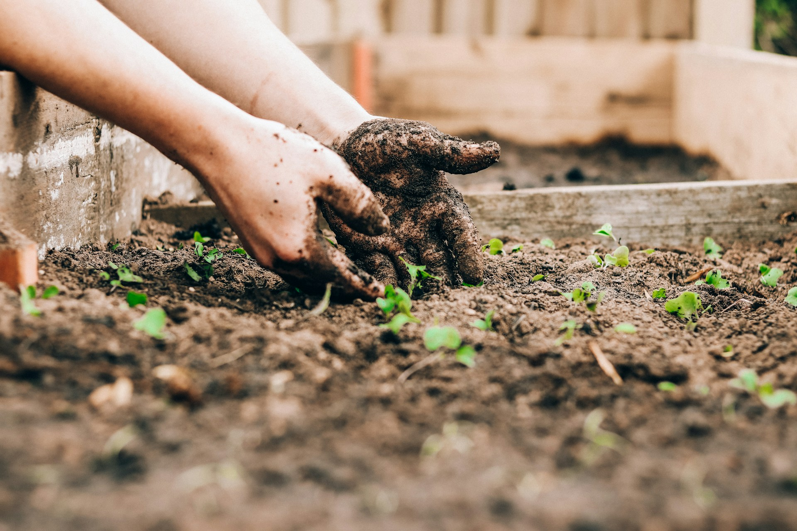
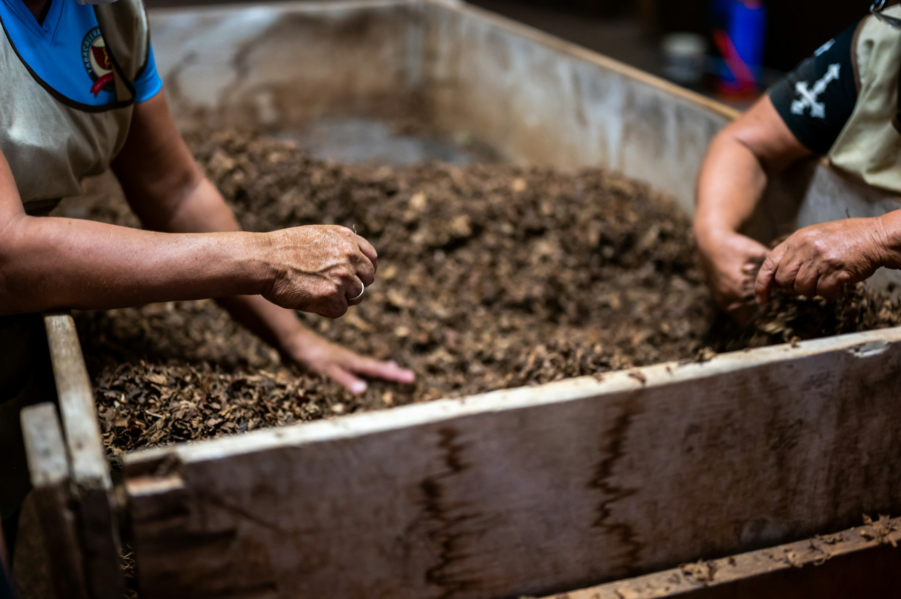

import GemeTerra2CTA from '@site/src/components/GemeTerra2CTA' 
import GemeComposterCTA from '@site/src/components/GemeComposterCTA' 
import RelatedArticles from '@site/src/components/RelatedArticles'
import ReactPlayer from 'react-player'

## Introduction: The Smell That Stops Composting Dreams

Let's be honest. You want to save the planet. [You've read the statistics: **95% of food waste in the United States ends up in landfills, generating methane and accelerating climate change**](https://www.housedigest.com/1742696/compost-without-space-yard-program-indoor/). You're ready to join the movement. You buy a cute little countertop bin, start tossing in banana peels and coffee grounds, and then... it happens.

**The smell**.

That sour, rotting odor that makes your kitchen feel like a dumpster. Your roommate gives you the look. Your partner suggests maybe composting "isn't for everyone." Suddenly, your eco-friendly aspirations are buried under a pile of shame and stench.

**Here's the truth: Your indoor compost bin doesn't have to smell. Not even a little**.

As a community composter in New York City recently noted, ["**I can't compost, I don't want my kitchen to get stinky**" is the number one objection people have](https://davidwilliamrosales.com/2026/01/29/indoor-compost-smells/). And it's completely understandable—but also completely preventable.

This guide will teach you exactly how to compost at home without creating odors. Whether you're using a basic countertop collection bin or considering a high-tech solution, these practical tips will keep your kitchen fresh and your composting journey on track.

<!-- truncate -->

## Why Does Indoor Compost Smell? Understanding the Science of Stink

Before we fix the problem, let's understand it. [**According to Cornell University's composting experts, a well-constructed compost system should NOT produce offensive odors**](https://www.compost.css.cornell.edu/monitor/monitorodor.html). If it does, something is off-balance.

### The Three Culprits: Moisture, Time, and Temperature

Indoor bin smells are almost always caused by one of three factors :

| **Culprit**   | **Why It Causes Smells**                                                        | **The Fix**                                     |
|---------------|--------------------------------------------------------------------------------|-------------------------------------------------|
| Moisture      | Wet scraps create anaerobic conditions (no oxygen), producing sulfur compounds and foul gases | Add dry "browns" to absorb excess moisture      |
| Time          | Scraps left too long decompose fully, releasing odors                           | Empty weekly or freeze scraps                   |
| Temperature   | Heat accelerates decomposition; warm bins smell faster                          | Store in cool spot away from appliances         |

### What Your Nose Is Telling You

Your nose is actually a sophisticated diagnostic tool. Different smells indicate different problems:

 - **Ammonia odor**: Too much nitrogen (too many "greens"). Mix in carbon-rich materials.

 - **Musty odor**: Too much moisture. Add dry browns immediately.

 - **Foul sulfurous/rotten egg smell**: Anaerobic conditions. Your bin needs oxygen and probably more browns.

Think of your indoor compost bin as a living system. When it smells bad, it's sending you a distress signal. The good news? These signals are easy to fix.

## Tip 1: Choose the Right Indoor Compost Bin

Not all bins are created equal. If you're serious about how to compost at home without smells, start with the right container.

### The Non-Negotiables

[**According to multiple composting experts, your bin needs two critical features**](https://www.homenetwork.ca/composting-tips-to-reduce-odour/):

 - **A tight-fitting lid**: This is non-negotiable. Your bin should close completely with no gaps. [**A good seal eliminates odor escape 99% of the time**](https://davidwilliamrosales.com/2026/01/29/indoor-compost-smells/).

 - **The right size**: Too small and you'll empty it constantly. Too large and scraps sit too long. For most households, a 1-gallon countertop bin works well.

### Optional But Helpful Features

 - **Charcoal filters**: [Many bins include replaceable carbon filters that trap odors. Swap them every 2–3 months](https://serenefacilitygroup.com.au/composting-and-cleaning-how-to-keep-your-compost-bin-odor-free/).

 - **Removable inner bucket**: [Makes washing significantly easier](https://serenefacilitygroup.com.au/composting-and-cleaning-how-to-keep-your-compost-bin-odor-free/).

 - **Airtight seal**: Test this before buying.

### The Freezer Hack

Here's a secret from experienced composters: [**Skip the countertop bin entirely and use your freezer**](https://kisstheground.com/education/resources/how-to-compost-at-home/).

When you freeze scraps, decomposition stops completely. No bacteria, no smells, no fruit flies. Just frozen food waste waiting for transfer to your outdoor bin or drop-off location. This is especially useful if you only empty your compost once a week or less.

<GemeTerra2CTA 
 imgSrc="/img/geme-terra-2-composter.jpg"
 productTitle="GEME Terra II: Best Kitchen Composter"
 features={[
    "✅ Eliminate Odor When composting",
    "✅ Quiet, Odour-Free, Real Compost",
    "✅ Zero Filter Costs, No Refills",
    "✅ Reduce Landfill Waste & Greenhouse Gases"
 ]}
buttonText="Get Your GEME Terra II"
  href="https://www.geme.bio/product/terra2?utm_medium=blog&utm_source=geme_website&utm_campaign=general_seo_content&utm_content=how-to-reduce-odor-indoor-composting-tips"
/>

## Tip 2: Master the Green-Brown Balance

This is the single most important concept in composting. If you learn nothing else, learn this.

### What Are Greens and Browns?

| **Type**                | **Materials**                                                              | **Role**                                             |
|------------------------|----------------------------------------------------------------------------|------------------------------------------------------|
| Greens (Nitrogen-rich)  | Fruit/veg scraps, coffee grounds, tea leaves, fresh grass                  | Provide nitrogen for microbial growth                |
| Browns (Carbon-rich)    | Shredded paper, cardboard, dry leaves, paper towels, sawdust               | Absorb moisture, provide structure, prevent odors    |

### The Golden Rule:

Odor usually means too many greens. Your compost needs balance. Aim for roughly **2–3 parts browns to 1 part greens by volume** in your indoor bin.

Every time you add wet scraps, top them with a handful of browns. Think of it as tucking your food waste into bed with a cozy blanket of dry material .

This simple habit:

 - Absorbs excess moisture

 - Blocks odors from escaping

 - Discourages fruit flies

 - Creates air pockets for oxygen flow

### Where to Get Browns in an Apartment

You don't need a yard to access brown materials :

 - Shredded junk mail and office paper

 - Cardboard boxes (broken down)

 - Paper towels (unused or used, if not greasy)

 - Newspaper (shredded)

 - Coffee filters (used)

Keep a box or bag of browns under your sink, right next to your compost bin. When you add scraps, add a scoop of browns.

## Tip 3: What to Put In (and What to NEVER Put In)

Your indoor compost bin is not a garbage can. Some items create smells no matter what you do.

### Compost These Indoors ✅

| **Safe for Indoor Bin**           | **Notes**                        |
|-----------------------------------|----------------------------------|
| Fruit and vegetable scraps        | All types                        |
| Coffee grounds and filters        | Great nitrogen source            |
| Tea leaves (remove staples)       | Compostable                      |
| Eggshells (crushed)               | Adds calcium, odor-free          |
| Shredded paper/cardboard          | Your browns!                     |
| Indoor plant trimmings            | Perfectly fine                   |
| Small amounts bread/pasta         | Mix with browns                  |

### AVOID These Indoors ❌

| **Problem Items**               | **Why They Cause Smells**                                 |
|---------------------------------|-----------------------------------------------------------|
| Meat, fish, poultry             | Rot quickly, attract pests, smell terrible                |
| Dairy products                  | High fat content, slow to break down                      |
| Oils and greasy foods           | Create rancid odors, difficult to manage                  |
| Cooked foods with sauces        | Often contain problem ingredients                         |
| Large citrus quantities         | Very wet, can overwhelm small bins                        |

If you want to compost occasional onion, garlic, or citrus scraps, mix them with extra browns immediately to absorb moisture.

[As one composting expert puts it: "**If your compost bin is coffee grounds, carrot greens, and banana peels, and you're adding browns, then it's not going to smell**"](https://davidwilliamrosales.com/2026/01/29/indoor-compost-smells/).

## Tip 4: The Daily Routine That Eliminates Odors

Consistency matters more than perfection. Build these habits and your bin will stay fresh.

### The Layer-Cap-Vent Method

 - **Layer**: After each addition of food scraps, add a small handful of browns on top .

 - **Cap**: Close the lid tightly.

 - **Vent**: Open the lid for 10–20 seconds after adding browns; odors dissipate as moisture is absorbed .

### Empty Frequently

Most indoor compost smells come from one simple issue: scraps sitting too long .

 - Empty every 1–2 days in warm weather 

 - Empty weekly minimum in cooler conditions 

 - If you cook a lot or generate significant waste, empty every 4–5 days 

Building a regular drop-off routine eliminates the risk of bad smells.

### Store in a Cool Spot

Heat accelerates decomposition. Keep your indoor compost bin:

 - Away from the stove

 - Away from radiators or heat vents

 - Out of direct sunlight

 - Under the sink (ideal location) 

<GemeTerra2CTA 
 imgSrc="/img/geme-terra-2-composter.jpg"
 productTitle="GEME Terra II: Best Kitchen Composter"
 features={[
    "✅ Eliminate Odor When composting",
    "✅ Quiet, Odour-Free, Real Compost",
    "✅ Zero Filter Costs, No Refills",
    "✅ Reduce Landfill Waste & Greenhouse Gases"
 ]}
buttonText="Get Your GEME Terra II"
  href="https://www.geme.bio/product/terra2?utm_medium=blog&utm_source=geme_website&utm_campaign=general_seo_content&utm_content=how-to-reduce-odor-indoor-composting-tips"
/>

## Tip 5: Clean Your Bin Properly

Even when you empty your bin completely, tiny bits of food residue stick to the sides and bottom. Over time, those scraps rot and create lingering odors .

### The Rinse-Outside Rule

After emptying your bin, rinse it outside if possible. This keeps compost gunk out of your kitchen sink. A quick rinse with water removes residue before it can smell.

### Weekly Cleaning Routine

Once a week, give your bin a proper cleaning:

 - Wash with warm water and a drop of pH-neutral dish soap

 - Sprinkle baking soda, scrub lightly, rinse

 - Mist with diluted white vinegar or 3% hydrogen peroxide

 - Let sit 2–3 minutes

 - Rinse and air-dry completely before relining

### Monthly Deep Clean

Once a month, clean the lid creases, handle joints, and filter slot. If your bin has a charcoal filter, replace it every 2–3 months or per manufacturer instructions.

## Tip 6: Natural Deodorizing Boosters

Sometimes you need extra help. These natural additions keep your bin fresh :

 - **Baking soda sachet**: Slip a small breathable sachet under the lid (replace monthly)

 - **Coffee grounds layer**: A thin layer over today's scraps masks transient smells

 - **Citrus peel ring**: A few thin dry peels add fresh scent (don't overdo it)

 - **Dry browns jar**: Keep a jar of shredded paper beside the bin for easy access

**Remember: These mask symptoms, not causes**. If your bin consistently smells, revisit moisture management and emptying frequency.

## Tip 7: Troubleshooting Common Problems

### Table: Quick Fixes for Common Odor Issues

| **Problem**                       | **Likely Cause**                  | **Solution**                                                            |
|-----------------------------------|-----------------------------------|-------------------------------------------------------------------------|
| Sour, rotten smell                | Too wet, anaerobic conditions     | Add generous browns, mix well, empty more frequently                    |
| Ammonia odor                      | Too many greens, low carbon       | Add browns immediately                                                  |
| Musty smell                       | Too much moisture                 | Add dry browns, leave lid cracked briefly                               |
| Fruit flies                       | Exposed fruit scraps, poor seal   | Freeze fruit scraps first, thicken browns layer, check lid seal         |
| Smell returns after cleaning      | Residue in lid crevices           | Deep clean with toothbrush + baking soda paste                          |
| Bin washed but still smells       | Deep-set odors                    | Soak 10 minutes in warm water + oxygen bleach, rinse, sun-dry           |

### The Freezer Solution for Persistent Problems

If you're fighting constant odors, freeze your scraps. This stops decomposition entirely. Use a container or reusable bag in your freezer, then transfer directly to your outdoor bin or drop-off. No smells, no flies, no stress.

## When Manual Composting Isn't Enough: The Tech Solution

Let's be real. All these tips require consistent effort. You need to remember browns. You need to empty on schedule. You need to clean regularly. For many busy households, that's a genuine challenge.

This is where technology enters the picture.

### Understanding Your Options: Dehydrators vs. Microbial Composters

The market for electric kitchen composter machines has exploded, but not all are created equal. Most popular machines like Lomi, are actually high-speed dehydrators. They grind your food and bake it into sterile dust. This dust looks like dirt, but it's not compost. [As one reviewer noted, **Lomi's output is "dark-brown, crumbly dust", helpful for volume reduction but essentially sterile**](https://www.geme.bio/blog/geme-vs-lomi).

### Table: Traditional Bin vs. Electric Options Compared

| **Method**                               | **Odor Management**                      | **Effort Required**                  | **Output**                         | **Ongoing Cost**        |
|------------------------------------------|------------------------------------------|--------------------------------------|------------------------------------|-------------------------|
| Basic countertop bin                     | Manual (browns, cleaning, freezing)      | Daily/Weekly                         | Compost (with proper management)    | \$0                     |
| Dehydrator (e.g., Lomi)                  | Carbon filters (replaceable)             | Batch cycles                         | Sterile dried waste                 | \$100–200/year           |
| Microbial composter (e.g., GEME Terra 2) | Permanent metal-ion filter                | Minimal (add scraps, harvest monthly)| Living, ready-to-use compost        | \$0                      |

## GEME Terra 2: The Odor-Free Microbial Solution

The GEME Terra 2 represents a fundamentally different approach. Instead of drying waste, it uses live microorganisms (proprietary "Kobold" microbes) to actually eat your food scraps .

### How it eliminates odor:

 1. **Permanent metal-ion filter**: Unlike carbon filters that need replacement, GEME's filter permanently neutralizes odors at the molecular level .

 2. **AI-controlled environment**: Sensors maintain optimal temperature, moisture, and oxygen levels, preventing the anaerobic conditions that cause smells .

 3. **Continuous operation**: Add scraps anytime; the microbes keep working without the "batch cycle" interruptions that can lead to odor buildup .

 4. **The result**: A machine that operates at 35–40 dB (whisper quiet) with zero recurring filter costs and genuine compost output.

[As GEME's R&D supervisor noted at IFA Berlin 2024, "**Most products on the market are food dehydrators, which cannot produce true organic compost. GEME is committed to redefining the home composting industry standard**"](https://www.finanzen.net/nachricht/aktien/revolutionizing-home-sustainability-geme-debuts-the-future-of-composting-at-ifa-berlin-2024-13794462).

For apartment dwellers who want the environmental benefits without the daily maintenance, this represents a compelling option.

[**See how GEME Terra II works & why it matters** -->](https://www.geme.bio/how-it-works?utm_medium=blog&utm_source=geme_website&utm_campaign=general_seo_content&utm_content=how-to-reduce-odor-indoor-composting-tips)

[**Learn more about GEME Kobold and the controlled microbial fermentation** -->](https://www.geme.bio/kobold-introduction?utm_medium=blog&utm_source=geme_website&utm_campaign=general_seo_content&utm_content=how-to-reduce-odor-indoor-composting-tips)

## Frequently Asked Questions

 1. **Q: How to compost at home in a small apartment?**

 A: Use a countertop bin with tight lid, store under sink (cool location), add browns after each deposit, and empty weekly. [Or freeze scraps and transfer directly to drop-off](https://www.housedigest.com/1742696/compost-without-space-yard-program-indoor/).

 2. **Q: What is the best indoor compost bin for odor control?**

 A: Look for a bin with a tight-sealing lid and, optionally, a charcoal filter. The bin matters less than your habits—proper browns layering and frequent emptying are what truly control odors .

 3. **Q: Can I compost citrus peels indoors?**

 A: Yes, but they're very wet. Add extra browns to absorb moisture and prevent sour smells .

 4. **Q: Do I really need to add browns to my indoor bin?**

 A: It's not required, but it helps enormously. A small amount of dry material on top absorbs moisture and blocks odors, especially if you store scraps for more than a few days .

 5. **Q: Should I use baking soda to control compost smells?**

 A: Baking soda masks symptoms but doesn't fix causes. If your bin smells, you need to empty more often or manage moisture better .

 6. **Q: Are electric composters worth the money?**

 A: Depends on your priorities. Basic bins cost little but require daily attention. High-end microbial composters like [****GEME Terra 2 eliminate most maintenance and produce genuine compost**](https://www.geme.bio/product/terra2?utm_medium=blog&utm_source=geme_website&utm_campaign=general_seo_content&utm_content=how-to-reduce-odor-indoor-composting-tips), but cost a bit more upfront. [**Dehydrators fall in between but don't create real soil**](https://www.geme.bio/blog/does-reencle-composter-produce-real-compost).

 7. **Q: What causes fruit flies in my compost?**

 A: Fruit flies are attracted to exposed, decomposing fruit. If your bin has a tight seal and you cover scraps with browns, you won't get fruit flies. Freezing fruit scraps before adding also helps .

<GemeTerra2CTA 
 imgSrc="/img/geme-terra-2-composter.jpg"
 productTitle="GEME Terra II: Best Kitchen Composter"
 features={[
    "✅ Eliminate Odor When composting",
    "✅ Quiet, Odour-Free, Real Compost",
    "✅ Zero Filter Costs, No Refills",
    "✅ Reduce Landfill Waste & Greenhouse Gases"
 ]}
buttonText="Get Your GEME Terra II"
  href="https://www.geme.bio/product/terra2?utm_medium=blog&utm_source=geme_website&utm_campaign=general_seo_content&utm_content=how-to-reduce-odor-indoor-composting-tips"
/>

## Conclusion: You Can Compost Without the Stink
Let's circle back to where we started. The fear of smell keeps countless people from composting, and that's a tragedy, both for their households and for the planet.

But here's the truth: **Your indoor compost bin doesn't have to smell. Not ever**.

Whether you choose the manual route with careful browns management, the freezer hack for zero-effort storage, or a high-tech microbial solution, odor-free composting is absolutely achievable.

### The Manual Route (Zero Cost)

 - Tight-lidded bin

 - Browns always on hand

 - Weekly emptying

 - Regular cleaning

### The Freezer Route (Minimal Cost)

 - Any container in freezer

 - Transfer on your schedule

 - No decomposition = no smell

### The Tech Route (Investment)

 - [**GEME Terra 2 microbial composter**](https://www.geme.bio/product/terra2?utm_medium=blog&utm_source=geme_website&utm_campaign=general_seo_content&utm_content=how-to-reduce-odor-indoor-composting-tips)

 - Permanent odor filter

 - Zero daily maintenance

 - Real compost output 

A basic bin costs nothing but asks for your time every day. A dehydrator seems convenient but locks you into filter subscriptions costing \$100–\$200 annually . [**GEME Terra 2 costs a little more upfront but delivers zero consumable costs and genuine compost you can actually use**](https://www.geme.bio/product/terra2?utm_medium=blog&utm_source=geme_website&utm_campaign=general_seo_content&utm_content=how-to-reduce-odor-indoor-composting-tips).

[The EPA estimates that 95% of food waste ends up in landfills, generating methane that accelerates climate change](https://www.housedigest.com/1742696/compost-without-space-yard-program-indoor/). Every pound you compost is a pound not producing greenhouse gases. When you use a system that creates living soil rather than sterile dust, you're not just reducing waste—you're regenerating resources.

### The Final Word

You don't need to tolerate a stinky kitchen to be eco-friendly. You don't need a yard. You don't need to be a composting expert. **You just need the right system and the right habits**.

## Verified Sources Citations

 1. [Homedit: Smell-Free Food Scrap Composting](https://www.homedit.com/indoor-composting-without-the-smell/) 

 2. [David William Rosales: How to Keep Indoor Compost from Smelling (It's Easier Than You Think), January 2026](https://davidwilliamrosales.com/2026/01/29/indoor-compost-smells/) 

 3. [GEME Official Blog: Reencle vs. GEME: The Ultimate Microbial Composter Showdown, February 2026](https://www.geme.bio/blog/does-reencle-composter-produce-real-compost) 

 4. [Home Network: Composting Tips to Keep Your Apartment Odour-Free, March 2025](https://www.homenetwork.ca/composting-tips-to-reduce-odour/) 

 5. [Serene Facility Group: Composting and Cleaning: How to Keep Your Compost Bin Odor-Free, November 2025](https://serenefacilitygroup.com.au/composting-and-cleaning-how-to-keep-your-compost-bin-odor-free/) 

 6. [GEME Official Blog: GEME vs Lomi: Electric Composter Comparison for Zero Waste Homes, January 2026](https://www.geme.bio/blog/geme-vs-lomi) 

 7. [House Digest: How To Compost When You Don't Have Outdoor Space, December 2024](https://www.housedigest.com/1742696/compost-without-space-yard-program-indoor/) 

 8. [Finanzen.net: Revolutionizing Home Sustainability GEME Debuts the Future of Composting at IFA Berlin 2024, August 2024](https://www.finanzen.net/nachricht/aktien/revolutionizing-home-sustainability-geme-debuts-the-future-of-composting-at-ifa-berlin-2024-13794462) 

 9. [Kiss the Ground: How to Compost at Home, May 2025](https://kisstheground.com/education/resources/how-to-compost-at-home/) 

 10. [Cornell University: Monitoring Compost Odors](https://www.compost.css.cornell.edu/monitor/monitorodor.html) 

<RelatedArticles
  slugs={[
  "how-long-can-ground-beef-stay-in-the-fridge",
  "nyc-composting-fines-2026-geme-terra-2-best-electric-compost",
  "best-indoor-composter-for-apartment-geme-vs-lomi",
  "the-best-composter-for-kitchen",
  "how-to-reduce-food-waste-during-spring-festival",
  "does-reencle-composter-produce-real-compost",
  "does-mill-composter-really-compost",
  "how-to-reduce-food-waste-at-home-2026",
  "free-mcnugget-caviar-raises-food-waste-concerns",
  "composting-in-winter",
  "how-to-compost-at-home",
  "zero-waste-home-kitchen-composter",
  "does-lomi-composter-really-compost",
  "5-best-kitchen-composters-in-2026",
  "best-kitchen-composter-in-2026-geme-terra-2",
  "geme-vs-reencle-composter-2026",
  "geme-vs-mill-composter-2026",
  "best-kitchen-composter-2026",
  "advanced-geme-compost-application-guide",
  "electric-compost-bin-filters-costs-comparison",
  "geme-vs-lomi", 
  "geme-terra-2-debuts",
  "the-best-composter-to-reduce-food-waste",
  "compost-pile-vs-electric-composter",
  "how-to-make-bananas-last-longer",
  "how-long-do-apples-last-in-the-fridge",
  "can-i-compost-moldy-grapes",
  "can-you-compost-moldy-bread",
  ]}
/>

_Ready to transform your gardening game? Subscribe to our [newsletter](http://geme.bio/signup?utm_medium=blog&utm_source=geme_website&utm_campaign=general_seo_content&utm_content=nyc-composting-fines-2026-geme-terra-2-best-electric-compost) for expert composting tips and sustainable gardening advice._

