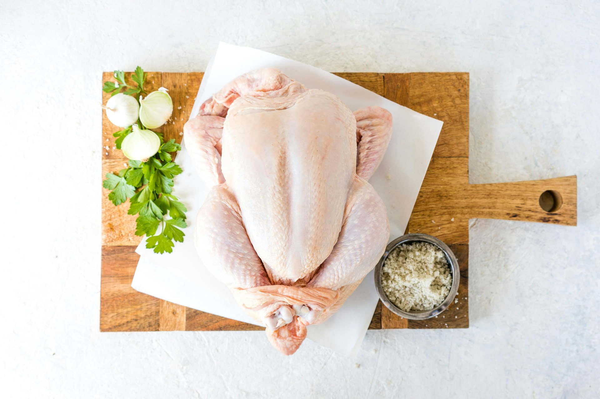

import GemeTerra2CTA from '@site/src/components/GemeTerra2CTA' 
import GemeComposterCTA from '@site/src/components/GemeComposterCTA' 
import RelatedArticles from '@site/src/components/RelatedArticles'
import ReactPlayer from 'react-player'

## Introduction: The Chicken Dilemma We've All Faced

It's Saturday afternoon. You open your refrigerator, and there it is—that package of chicken you bought on a whim earlier in the week. You stare at it. It stares back. The question forms in your mind: Is this still safe to eat?

You're not alone. Chicken is America's most popular protein, but it's also one of the most confusing when it comes to storage. One wrong guess, and you're either wasting money or risking a nasty case of food poisoning.

According to food safety experts, the stakes are real. The Centers for Disease Control and Prevention estimates that 1 in 6 Americans suffers from foodborne illness each year, with poultry being a common culprit when mishandled . But here's the good news: understanding a few simple rules about how long can chicken stay in the fridge can keep your family safe while saving you money.

In this comprehensive guide, we'll cover everything you need to know:

 - **Exact timelines for raw and cooked chicken storage**

 - **Foolproof methods to tell if chicken has gone bad**

 - **The best way to compost bad chicken—turning waste into resources**

Let's settle the chicken storage question once and for all.

<!-- truncate -->

## 1. How Long Can Raw Chicken Stay in the Fridge?

This is the question that sparks the most debate in kitchens everywhere. The answer is surprisingly straightforward—but it comes with important caveats.

### The Official Guidelines

According to the United States Department of Agriculture (USDA) and multiple food safety experts, raw chicken should be refrigerated for only 1 to 2 days .

Yes, you read that right. Just one to two days maximum.

This applies to all forms of raw chicken:

| **Type of Raw Chicken**                           | **Refrigerator Shelf Life (40°F / 4°C or below)** |
|---------------------------------------------------|---------------------------------------------------|
| Whole chicken                                    | 1–2 days                                         |
| Chicken pieces (breasts, thighs, drumsticks)      | 1–2 days                                         |
| Ground chicken                                   | 1–2 days                                         |
| Previously frozen chicken (after thawing)         | 1–2 days                                         |

### Why Such a Short Window?

"Chicken needs cold for its correct conservation," explains Lluís Riera, a food safety expert. "The room temperature that is reached in many kitchens is the perfect breeding ground for the reproduction of bacteria".

Raw chicken is particularly perishable because:

 - It has high moisture content

 - It's rich in protein (which bacteria love)

 - It's often handled multiple times before reaching your kitchen

The clock starts ticking the moment you bring chicken home from the store. If you purchased chicken with a "use by" date that's several days away, that date assumes continuous proper refrigeration from the store to your home .

### Does Packaged Chicken Last Longer?

You might have noticed that chicken in supermarket packaging sometimes has a "use by" date longer than 2 days from purchase. This is because many commercial chicken packages use modified atmosphere packaging—they add gases that slow spoilage and extend shelf life .

However, once you open that package, the clock resets. "It is best to always follow the instructions and dates indicated by the manufacturer if it is packaged chicken," Riera notes. "The duration is usually 2 or 3 days, while non-packaged chicken—which we buy whole or cut in pieces at the butcher shop—is better not to exceed two days" .

### The Critical Temperature Factor

All of these timelines depend on one crucial factor: your refrigerator temperature.

"The colder the environment, the slower those spoilage microbes grow," explains Donald Schaffner, PhD, distinguished professor of food science at Rutgers University .

Your fridge should be set to 40°F (4°C) or below. The USDA recommends 40°F as the maximum safe temperature . If your fridge runs warmer than this, your chicken's shelf life shrinks dramatically.

**Pro tip: Keep a refrigerator thermometer in your fridge**. It's the only way to know for sure that your food is stored at safe temperatures.

<GemeTerra2CTA 
 imgSrc="/img/geme-terra-2-composter.jpg"
 productTitle="GEME Terra II: Best Kitchen Composter"
 features={[
    "✅ Compost Bad Chicken in 8 hours",
    "✅ Quiet, Odour-Free, Real Compost",
    "✅ Zero Filter Costs, No Refills",
    "✅ Reduce Landfill Waste & Greenhouse Gases"
 ]}
buttonText="Get Your GEME Terra II"
  href="https://www.geme.bio/product/terra2?utm_medium=blog&utm_source=geme_website&utm_campaign=general_seo_content&utm_content=how-long-can-chicken-stay-in-the-fridge"
/>

## 2. How Long Can Cooked Chicken Stay in the Fridge?

Cooked chicken lasts longer than raw—but not as long as you might think.

### The 3-to-4-Day Rule

"Even cooked chicken will eventually spoil," says Schaffner. "As a rule of thumb, we recommend for best quality to use the cooked chicken within 3 to 4 days" .

This guideline applies to all cooked chicken:

 - Roasted whole chicken

 - Grilled chicken breasts

 - Shredded chicken

 - Chicken casseroles or dishes containing chicken

### The 7-Day Exception

Under ideal conditions, cooked chicken can last up to 7 days. Ellen Shumaker, PhD, director of outreach for the Safe Plates program at NC State Extension, explains: "If a fridge is kept at 41°F or below, leftover prepared foods like cooked chicken can be safely kept for up to 7 days" .

But—and this is a big but—this requires:

 - Consistent temperature below 41°F

 - Proper storage in airtight containers

 - Minimal exposure to warm temperatures before refrigerating

If you're not certain about any of these factors, stick to the 3-to-4-day window.

### Storage Chart: Raw vs. Cooked Chicken

| **Chicken Type**                   | **Refrigerator Shelf Life**                  | **Freezer Shelf Life**              |
|------------------------------------|----------------------------------------------|-------------------------------------|
| Raw whole chicken                  | 1–2 days                                     | Up to 9 months                      |
| Raw chicken pieces                 | 1–2 days                                     | Up to 9 months                      |
| Cooked chicken                     | 3–4 days (up to 7 days in ideal conditions)  | 3–4 months for best quality         |
| Rotisserie chicken (store-bought)  | 3–4 days                                     | 3–4 months                          |

## 3. How to Know When Chicken Is Bad

Even with strict adherence to timelines, chicken can spoil before its expected shelf life—or sometimes last a little longer. That's why knowing how to know when chicken is bad is essential.

### The Three Senses Test

Food safety experts agree on three reliable indicators of spoilage: smell, touch, and sight.

#### 1. The Smell Test

"Raw chicken doesn't have much of a smell, so if it's bad, it will smell 'off' or like rotten eggs," says Aly Romero, a Texas-based private chef .

What to watch for:

 - **Sour or rancid odor**: This is the most reliable indicator

 - **Sulfur or "rotten egg" smell**: A sure sign of spoilage

 - **Any unpleasant odor**: Fresh chicken should have little to no smell

One composter recalls a horror story: "I distinctly recall a time I took chicken out of my garage freezer with the intent to bring it in and forgot it for a couple of days. Needless to say, the overwhelming stench in my garage was unforgettable" .

#### 2. The Touch Test

Fresh chicken should feel:

 - **Moist but not slippery**

 - **Firm and elastic—when pressed, it should spring back** 

Bad chicken feels:

 - **Slimy or sticky**: "If it looks like mucus, throw it out," advises one food safety writer 

 - **Soft or mushy**: The texture breaks down as bacteria multiply 

 - **Gummy or tacky**: Any unusual texture is a red flag 

#### 3. The Sight Test

| **Color**                      | **What It Means**                                                                                   |
|--------------------------------|-----------------------------------------------------------------------------------------------------|
| Pink or peachy-pink            | Fresh, healthy raw chicken                                                                          |
| Gray, green, or yellow patches | Spoiled—do not eat                                                                                  |
| White, uniform color           | Properly cooked chicken                                                                             |
| Gray or dull in cooked chicken | Possibly spoiled                                                                                    |

> **Important note:** Yellow fat on chicken is normal. "Yellow fat on your chicken breasts IS okay—just make sure the uncooked chicken itself hasn't experienced any weird color changes," explains Food Fanatic. Similarly, chicken skin may naturally be yellow—that's different from the meat itself changing color.

### Table: Quick Reference for Spotting Spoiled Chicken

| **Indicator**       | **Fresh Chicken**                       | **Spoiled Chicken**                       |
|---------------------|-----------------------------------------|-------------------------------------------|
| **Smell**           | Neutral, mild                           | Sour, sulfur-like, "off"                  |
| **Color (raw)**     | Pink, peachy-pink                       | Gray, green, yellow patches               |
| **Color (cooked)**  | White, uniform                          | Gray, discolored                          |
| **Texture**         | Firm, moist, elastic                    | Slimy, sticky, mushy                      |
| **Packaging**       | Intact, no leaks                        | Bloated, leaking (before opening)         |

### Can You Rely on the "Use By" Date?

The "use by" date is a guideline, not a guarantee. Romero explains: "Generally, this means cooking it within 1 to 2 days of the 'use by' date. If the 'use by' date has already passed by two days, it's best to toss it, just to be safe".

However, even chicken within its "use by" date can spoil if improperly stored. Always use your senses before cooking.

### The Golden Rule of Food Safety

Here's the simplest, most important rule: "When in doubt, throw it out."

As one food safety advocate puts it, "My motto is, and always will be, 'When in doubt, throw it out.' That said, there are times when the doubt may be unfounded, and I sometimes find myself on the fence when tossing valuable food, especially meat" .

The cost of a package of chicken is nothing compared to the cost of a trip to the emergency room.

## 4. Best Way to Compost Bad Chicken

So you've determined your chicken has gone bad. Now what?

Throwing it in the trash means it ends up in a landfill, where it generates methane—a greenhouse gas 25 times more potent than carbon dioxide. But composting chicken requires special handling because of food safety concerns.

### Why Chicken Composting Is Different

Composting chicken—especially raw or spoiled chicken—isn't as simple as tossing it in your backyard bin. Meat products:

 - **Attract pests**: Rats, raccoons, flies, and other scavengers

 - **Create odors**: As they decompose anaerobically

 - **May harbor pathogens**: Including Salmonella and Campylobacter

However, with the right techniques, chicken can be composted safely and effectively.

### The Science of Composting Poultry

Agricultural research provides a model. Mississippi State University Extension explains that composting poultry mortalities has been practiced successfully since the late 1980s . The key principles apply to home composting as well.

"The composting process works well" when you have:

 - Adequate carbon source (sawdust, wood shavings, dry leaves)

 - Proper moisture (50-60 percent)

 - Sufficient oxygen (from turning or aeration)

 - Correct temperature (130° to 140°F) 

At these temperatures, "most disease-causing organisms" are killed while "good bacteria thrive".

<GemeTerra2CTA 
 imgSrc="/img/geme-terra-2-composter.jpg"
 productTitle="GEME Terra II: Best Kitchen Composter"
 features={[
    "✅ Compost Bad Chicken in 8 hours",
    "✅ Quiet, Odour-Free, Real Compost",
    "✅ Zero Filter Costs, No Refills",
    "✅ Reduce Landfill Waste & Greenhouse Gases"
 ]}
buttonText="Get Your GEME Terra II"
  href="https://www.geme.bio/product/terra2?utm_medium=blog&utm_source=geme_website&utm_campaign=general_seo_content&utm_content=how-long-can-chicken-stay-in-the-fridge"

### Method 1: Backyard Hot Composting

If you have an outdoor compost system, you can compost chicken—but you must do it carefully.

**What you'll need**:

 - A compost pile that reaches 130-150°F

 - Plenty of brown materials (carbon sources)

 - A way to contain the material from scavengers

**The layering method**:

According to poultry mortality composting guidelines, proper layering is essential:

 - Start with a 6-inch base layer of carbon materials (sawdust, wood chips, dry leaves)

 - Add the chicken in the center, surrounded by carbon material

 - Cover with another 6-inch layer of carbon material

 - Ensure the chicken is completely encased—this "acts as a biofilter, preventing odors and bioaerosols from escaping" 

 - Leave undisturbed for at least 10-14 days 

The carbon material should be at a 2:3 ratio (by volume) of chicken to carbon source .

**Critical safety points**:

 - Do not turn the pile for at least two weeks

 - Wear gloves and wash hands thoroughly after handling

 - Keep children and pets away from the composting area

 - Only attempt this if your pile reliably reaches high temperatures

### Method 2: In-Vessel Composting (The GEME Solution)

For most home composters, the backyard method is impractical and potentially unsafe. This is where technology offers a better solution.

In-vessel composting is done in an enclosed container that maintains optimal conditions. As Mississippi State University explains, "Because they are totally enclosed, there is less chance of leachate escaping; they are quicker and more efficient at material breakdown due to daily turning and aeration" .

This is where GEME Terra 2 enters the picture.

### GEME Terra 2: The Smart Solution for Composting Chicken

The GEME Terra 2 is the world's first AI-powered kitchen composter, and it handles chicken waste differently from any other home composting device.

Why GEME works for chicken:

 1. **Live microorganisms**: Unlike dehydrators that simply dry waste, GEME uses proprietary "Kobold" microbes that actually eat organic matter—including meat and bones 

 2. **Temperature control**: The system maintains optimal temperatures (similar to the 130-140°F range recommended by extension services) without overheating 

 3. **Continuous operation**: Add chicken scraps anytime; the microbes keep working

 4. **Complete containment**: The sealed system prevents odors and attracts no pests

 5. **No consumables**: Unlike other composters requiring expensive filters, GEME's metal-ion filter is permanent

 6. **The result**: Real, living compost from chicken waste—not just dehydrated scraps.

### Table: Composting Chicken Options Compared

| **Method**                  | **Safety**                              | **Time**             | **Effort**  | **Result**                        |
|-------------------------|-------------------------------------|------------------|---------|-------------------------------|
| **Trash** (landfill)        | Safe but environmentally harmful    | Instant          | Minimal | Methane emissions             |
| **Backyard hot compost**    | Requires careful management         | Weeks to months  | High    | Compost (if done correctly)   |
| **Dehydrator** (e.g., Lomi) | Safe, but output is sterile dust    | Hours            | Medium  | Sterile dried waste           |
| **GEME Terra 2**            | Safe, pathogen-free process         | Days to weeks    | Minimal | Living compost                |

### What Not to Do

Never compost chicken in:

 - A passive backyard bin that doesn't reach high temperatures

 - A worm bin (vermicomposting)—meat will kill worms and create terrible odors

 - A countertop collection bin meant for vegetable scraps only

**Never do this**:

One blogger admits to a dangerous practice: "I smelled the slimy thighs a bit and washed them—no, no, but they were steamed and grilled fine and I'm still here". This is extremely risky and not recommended.

### Step-by-Step: Composting Bad Chicken with GEME

If you have a GEME Terra 2, here's how to handle spoiled chicken:

 1. Double-bag the chicken to transport it to your GEME

 2. Add to the GEME along with your regular food scraps

 3. Ensure the carbon-to-nitrogen ratio stays balanced—add extra browns if needed

 4. Let the microbes work—GEME's AI maintains optimal conditions

 5. Harvest compost in a few weeks, safe and ready for plants

The microbes handle what they're designed to handle. As extension services note, "Given the right conditions, microorganisms break down organic material (poultry mortalities, in this case) and carbon into a useful and valuable finished product" .

<GemeTerra2CTA 
 imgSrc="/img/geme-terra-2-composter.jpg"
 productTitle="GEME Terra II: Best Kitchen Composter"
 features={[
    "✅ Compost Bad Chicken in 8 hours",
    "✅ Quiet, Odour-Free, Real Compost",
    "✅ Zero Filter Costs, No Refills",
    "✅ Reduce Landfill Waste & Greenhouse Gases"
 ]}
buttonText="Get Your GEME Terra II"
  href="https://www.geme.bio/product/terra2?utm_medium=blog&utm_source=geme_website&utm_campaign=general_seo_content&utm_content=how-long-can-chicken-stay-in-the-fridge"
/>

## 5. Proper Storage to Maximize Shelf Life

Prevention is better than disposal. Here's how to store chicken correctly so it lasts as long as possible.

### Storing Raw Chicken

 1. Keep it cold

 Place raw chicken in the refrigerator immediately upon returning from the store. "For meat and poultry that means storing it in the refrigerator at 40 degrees Fahrenheit," the USDA states .

 2. Prevent cross-contamination

 Store chicken on the bottom shelf of your refrigerator so juices can't drip onto other foods . Keep it in its original packaging or place it in a sealed container or zip-top bag .

 3. The coldest spot

 Store meat "toward the back of the fridge," as "this area of the fridge is the coldest and least prone to temperature fluctuations" .

 4. Freeze what you won't use

 "If you know you won't finish your leftovers within a few days, the freezer is your friend," advises Schaffner . For raw chicken, freeze by the "use by" date or within 1-2 days of purchase.

### Storing Cooked Chicken

 1. Cool quickly

 "Always be sure to place chicken in the fridge after cooking it within two hours at moderate temperatures and in an hour or less when the room temperature is hot, such as in summertime" .

 2. Use airtight containers

 "If the chicken is stored in a tight container, this will stop it from drying out" .

 3. Portion wisely

 Separate leftovers into smaller containers or bags . This helps them cool faster and means you only reheat what you need.

### Freezing Chicken Properly

| **Chicken Type**             | **Freezer Temperature** | **Maximum Storage Time**           |
|------------------------------|-------------------------|-------------------------------------|
| Raw whole chicken            | 0°F (-18°C)            | Up to 9 months                     |
| Raw chicken pieces           | 0°F (-18°C)            | Up to 9 months                     |
| Cooked chicken               | 0°F (-18°C)            | 3-4 months for best quality        |
| Previously frozen (refrozen) | 0°F (-18°C)            | Not recommended                    |

**Freezer tips**:

 - "Remove as much air as possible from food storage bags to help stop freezer burn" 

 - Label packages with the date

 - Freeze in portions you'll actually use

### Thawing Safely

The USDA recommends three safe thawing methods:

 1. Refrigerator thawing (best)

 Place frozen chicken in the refrigerator. "It should be consumed right then to avoid it sitting in the temperature danger zone" . A whole chicken may take 24 hours per 5 pounds to thaw.

 2. Cold water thawing (faster)

 Submerge the sealed chicken in cold water, changing water every 30 minutes. Cook immediately after thawing .

 3. Microwave thawing (quickest)

 Use the defrost setting, then cook immediately .

Never thaw chicken on the counter at room temperature. This allows bacteria to multiply rapidly.

<GemeTerra2CTA 
 imgSrc="/img/geme-terra-2-composter.jpg"
 productTitle="GEME Terra II: Best Kitchen Composter"
 features={[
    "✅ Compost Bad Chicken in 8 hours",
    "✅ Quiet, Odour-Free, Real Compost",
    "✅ Zero Filter Costs, No Refills",
    "✅ Reduce Landfill Waste & Greenhouse Gases"
 ]}
buttonText="Get Your GEME Terra II"
  href="https://www.geme.bio/product/terra2?utm_medium=blog&utm_source=geme_website&utm_campaign=general_seo_content&utm_content=how-long-can-chicken-stay-in-the-fridge"

## 6. Frequently Asked Questions

### Q: How long can raw chicken stay in the fridge after the sell-by date?

A: The sell-by date is for stores, not consumers. If properly refrigerated, raw chicken is safe 1-2 days after the sell-by date—but always check for signs of spoilage before cooking .

### Q: Can I eat chicken that's been in the fridge for 5 days?

A: For cooked chicken, 5 days is borderline. If your fridge is consistently 40°F or below and the chicken was properly stored, it might be safe—but it's approaching the end of its safe window . For raw chicken, 5 days is definitely too long .

### Q: How can you tell if frozen chicken is bad?

A: Freezer burn appears as white or grayish patches—it's safe but may taste dry. If frozen chicken thaws and smells bad, it was likely spoiled before freezing. Always thaw in the refrigerator and check using the smell, touch, and sight tests after thawing.

### Q: Is yellow chicken safe to eat?

A: "No, not unless you're referring to the fat, skin, or seasoning," explains Food Fanatic . Yellow fat is normal. Yellow meat indicates spoilage.

### Q: What's the best way to compost bad chicken in an apartment?

A: For apartment dwellers, the GEME Terra 2 is the safest and most effective solution. It's enclosed (no pests), uses live microbes to break down meat safely, and produces real compost you can use for houseplants .

### Q: Can I put chicken in my regular compost bin?

A: Only if you have a hot composting system that reaches 130-150°F and is properly managed. Passive bins or tumblers won't get hot enough to safely break down meat and may attract pests.

## 7. The Environmental Impact—Why Composting Matters

Before you toss that spoiled chicken in the trash, consider this:

Food waste in landfills generates methane, a greenhouse gas 28-36 times more potent than carbon dioxide over a 100-year period. The EPA estimates that food waste is the single most common material landfilled, representing 24% of landfilled municipal solid waste.

When you compost chicken instead of trashing it:

 - You eliminate methane production (composting is aerobic)

 - You create soil amendment instead of pollution

 - You close the nutrient loop—what came from the earth returns to it

This is where GEME's mission aligns with environmental sustainability. By making it possible to compost meat safely at home, GEME enables apartment dwellers and urban residents to participate in true waste reduction—not just waste "management."

### Conclusion: Knowledge Is Power (and Safety)

Let's recap the essential takeaways:

**How long can chicken stay in the fridge**?

 - **Raw chicken**: 1-2 days maximum 

 - **Cooked chicken**: 3-4 days (up to 7 under ideal conditions) 

**How to know when chicken is bad**:

 - **Smell**: Sour, sulfur-like, or "off" odor 

 - **Touch**: Slimy, sticky, or mushy texture 

 - **Sight**: Gray, green, or yellow discoloration 

### Best way to compost bad chicken:

 - **For outdoor systems**: Hot composting with proper carbon layering, reaching 130-150°F 

 - **For indoor/apartment living**: GEME Terra 2 microbial composter—safe, enclosed, and effective

Every time you throw away spoiled chicken, you're throwing away money. A 3-pound package of organic chicken breasts can cost \$15-20. When that chicken spoils because you weren't sure about storage times, that's money in the trash.

**The GEME Terra 2 helps you maximize your food investment by**:

 - Processing scraps (including meat) into valuable compost

 - Eliminating the "ick factor" that makes people avoid composting meat

 - Operating with zero consumable costs—unlike dehydrators that require expensive filters and additives

The average American throws away 325 pounds of food per person per year. Much of it ends up in landfills, generating methane and contributing to climate change. By composting chicken and other meat products, you're not just reducing waste—you're actively fighting climate change.

GEME's microbial technology represents a paradigm shift. As Mississippi State University's extension service notes, composting "minimizes water and air pollution by retaining nutrients, pathogens, and odors" while producing "a useful and valuable finished product" . This isn't just disposal—it's regeneration.

### The Final Word

You now have the knowledge to store chicken safely, recognize when it's spoiled, and dispose of it responsibly. The question isn't whether you'll have chicken go bad—it's what you'll do when it happens.

Will you send it to a landfill to generate methane? Or will you transform it into something valuable?

**Choose the smarter path. Choose GEME**.

## Sources Cited

[Martha Stewart: How Long Cooked Chicken Lasts in the Fridge, November 2025](https://www.marthastewart.com/how-long-does-cooked-chicken-last-in-the-fridge-11836254) 

[Vinmec: How to Store Raw Chicken Properly, January 2026](https://www.vinmec.com/eng/blog/how-to-preserve-raw-chicken-en) 

[Tyson Brand: Storing Chicken Guidelines](https://www.tyson.com/how-to/storing) 

[Southern Living: How Can You Tell If Chicken Has Gone Bad?, August 2024](https://www.southernliving.com/how-to-tell-if-chicken-has-gone-bad-8690964) 

[Chicken Meat Extension (Australia): Setting up and managing mortality composting piles](https://chicken-meat-extension-agrifutures.com.au/docs/poultry-waste-composting-guidelines/composting/setting-up-and-managing-mortality-compositing-piles/) 

[Martha Stewart: How Long Cooked Chicken Lasts in the Fridge, November 2025](https://www.marthastewart.com/how-long-does-cooked-chicken-last-in-the-fridge-11836254) 

[The Kitchn: How Long Does Raw Chicken Last in the Fridge?](https://www.thekitchn.com/how-long-will-raw-chicken-stay-good-in-the-fridge-248178) 

[Vocal Media: How Long Does Uncooked Chicken Last In The Refrigerator?, July 2024](https://Vocal.media/lifehack/how-long-does-uncooked-chicken-last-in-the-refrigerator) 

[Food Fanatic: Is Yellow Chicken Safe to Eat? 3 Signs It's Gone Bad, October 2024](https://www.foodfanatic.com/cooking/faqs/is-yellow-chicken-safe-to-eat/)

[Mississippi State University Extension: Rotary Drum Composting of Poultry Mortalities](https://www.msucares.com/publications/rotary-drum-composting-poultry-mortalities) 

<RelatedArticles
  slugs={[
  "how-to-reduce-odor-indoor-composting-tips",
  "how-long-can-ground-beef-stay-in-the-fridge",
  "nyc-composting-fines-2026-geme-terra-2-best-electric-compost",
  "best-indoor-composter-for-apartment-geme-vs-lomi",
  "the-best-composter-for-kitchen",
  "how-to-reduce-food-waste-during-spring-festival",
  "does-reencle-composter-produce-real-compost",
  "does-mill-composter-really-compost",
  "how-to-reduce-food-waste-at-home-2026",
  "free-mcnugget-caviar-raises-food-waste-concerns",
  "composting-in-winter",
  "how-to-compost-at-home",
  "zero-waste-home-kitchen-composter",
  "does-lomi-composter-really-compost",
  "5-best-kitchen-composters-in-2026",
  "best-kitchen-composter-in-2026-geme-terra-2",
  "geme-vs-reencle-composter-2026",
  "geme-vs-mill-composter-2026",
  "best-kitchen-composter-2026",
  "advanced-geme-compost-application-guide",
  "electric-compost-bin-filters-costs-comparison",
  "geme-vs-lomi", 
  "geme-terra-2-debuts",
  "the-best-composter-to-reduce-food-waste",
  "compost-pile-vs-electric-composter",
  "how-to-make-bananas-last-longer",
  "how-long-do-apples-last-in-the-fridge",
  "can-i-compost-moldy-grapes",
  "can-you-compost-moldy-bread",
  ]}
/>

_Ready to transform your gardening game? Subscribe to our [newsletter](http://geme.bio/signup?utm_medium=blog&utm_source=geme_website&utm_campaign=general_seo_content&utm_content=nyc-composting-fines-2026-geme-terra-2-best-electric-compost) for expert composting tips and sustainable gardening advice._

