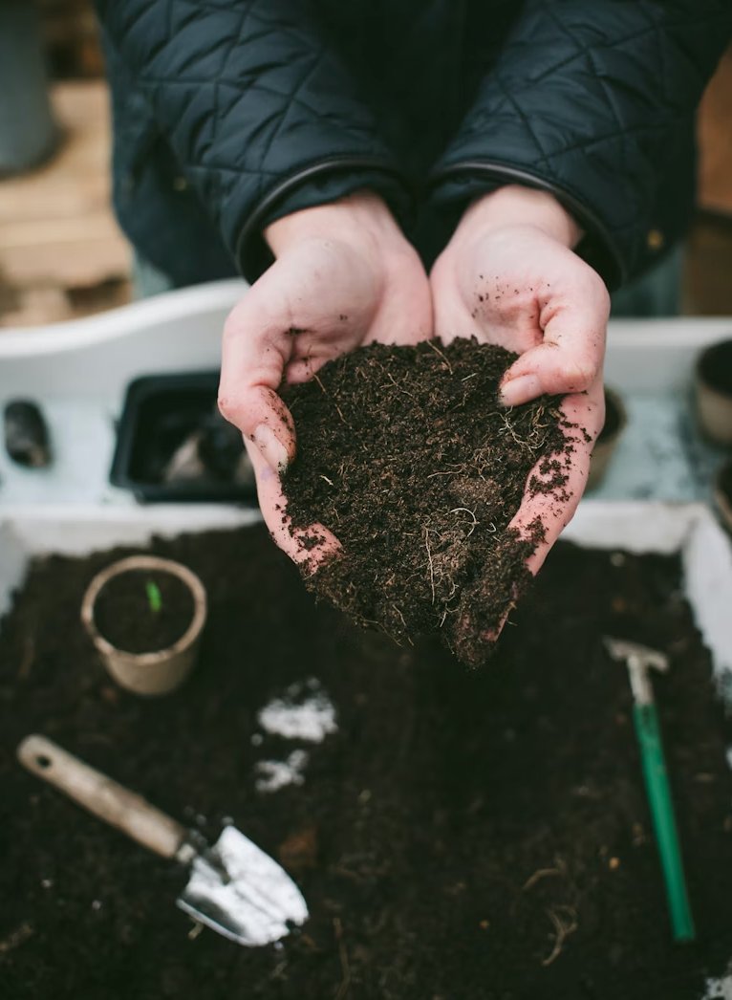
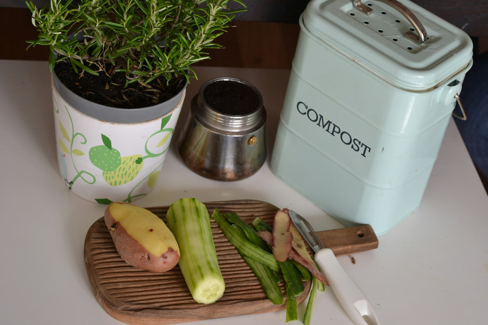

import GemeTerra2CTA from '@site/src/components/GemeTerra2CTA' 
import GemeComposterCTA from '@site/src/components/GemeComposterCTA' 
import RelatedArticles from '@site/src/components/RelatedArticles'
import ReactPlayer from 'react-player'

## Introduction: Welcome to the World of "Black Gold"

Let me guess: You've got a banana peel in one hand, a coffee filter in the other, and absolutely no idea what to do with them besides tossing them in the trash. You've heard that composting is good for the planet, but the whole process seems mysterious—maybe even a little intimidating.

Here's the truth: Composting is just fancy recycling for food. Nature's been doing it for millions of years. A leaf falls, it rots, it becomes dirt. That's it. You're just helping the process along.

And the payoff? Gardeners call compost "black gold" for a reason. It turns sad soil into plant paradise, reduces your trash by up to 30%, and fights climate change by keeping methane out of landfills .

Whether you've got a backyard, a balcony, or just a kitchen counter, this beginner's guide will teach you how to compost at home step by step. We'll cover traditional methods, troubleshoot common problems, and even explore the best composter technology for those who want to cheat the system.

Ready to get your hands dirty? Let's dig in.

<!-- truncate -->

## 1. Why Compost? 

Before we dive into the how, let's talk about the why. Because honestly, if you're going to keep a bucket of rotting food in your home, you should know why it matters.

### The Landfill Problem

When food waste goes to landfill, something terrible happens. Buried under tons of trash, deprived of oxygen, it decomposes anaerobically, and releases methane, a greenhouse gas 25 times more potent than carbon dioxide. In South Australia, around 40% of waste placed in landfill bins is food and other compostable items. The numbers are similar worldwide.

### The Compost Solution

When you compost the same scraps at home, the process is aerobic (with oxygen). No methane. Instead, you get:

 - **Nutrient-rich soil amendment for your garden**

 - **Better water retention**: compost helps soil hold moisture, making plants more drought-resistant 

 - **Reduced need for chemical fertilizers**

 - **Less trash**: your bin won't fill up as fast

As the WWF puts it, ["Without healthy soil we would be unable to grow plants and food, putting life at risk"](https://www.wwf.org.uk/challenges/feed-soil-feed-plants). Composting helps nurture the organisms from worms to bacteria that keep soil healthy.

### The Apartment Solution

Even if you have no garden, composting still matters. Many cities now offer curbside composting programs. [**In New York, it's actually mandatory (with fines starting at \$25)**](https://www.geme.bio/blog/best-indoor-composter-for-apartment-geme-vs-lomi). And if you choose the right indoor composter, you can turn scraps into soil for your houseplants.

So whether you're motivated by climate guilt, gardening obsession, or just really hate taking out the trash, composting delivers.

<GemeTerra2CTA 
 imgSrc="/img/geme-terra-2-composter.jpg"
 productTitle="GEME Terra II: Best Kitchen Composter"
 features={[
    "✅ Best Composter For Beginners",
    "✅ Quiet, Odour-Free, Real Compost",
    "✅ Zero Filter Costs, No Refills",
    "✅ Reduce Landfill Waste & Greenhouse Gases"
 ]}
buttonText="Get Your GEME Terra II"
  href="https://www.geme.bio/product/terra2?utm_medium=blog&utm_source=geme_website&utm_campaign=general_seo_content&utm_content=how-to-compost-at-home-beginners-guide"
/>

## 2. The Composting Basics: What Goes In, What Stays Out

Before we talk about bins and methods, let's cover the ingredients. Composting is a recipe, and getting the ingredients right is half the battle.

### The Magic Formula: Greens + Browns + Water + Air

| **Ingredient** | **What It Is**                | **Role in Compost**                         |
|------------|--------------------------|-----------------------------------------|
| **Greens**     | Nitrogen-rich materials  | Provide protein for microbes            |
| **Browns**     | Carbon-rich materials    | Provide energy for microbes             |
| **Water**      | Moisture                 | Keeps microbes happy                    |
| **Air**        | Oxygen                   | Prevents smells, speeds breakdown       |

### What Are Greens?

[**Greens are fresh, wet, or recently living materials. They include**](https://www.environment.sa.gov.au/goodliving/posts/2019/05/guide-to-composting):

 - Fruit and vegetable scraps

 - Coffee grounds and tea leaves

 - Fresh grass clippings

 - Garden prunings (green)

 - Eggshells (technically not "green" but treated as such)

### What Are Browns?

[**Browns are dry, dead materials. They include**](https://www.wwf.org.uk/challenges/feed-soil-feed-plants):

 - Dead leaves (autumn's gift to composters)

 - Shredded cardboard and paper

 - Wood chips and sawdust

 - Straw and hay

 - Paper towels and napkins (unsoiled with chemicals)

### The Golden Ratio

Here's the rule that separates success from stinky failure: [**Aim for roughly 2–3 parts browns to 1 part greens by volume**](https://apnews.com/article/compost-climate-emissions-landfills-greenhouse-gas-1ee0bffa41abdc9ed5b70adae92d3e42).

Too many greens = wet, smelly mush. Too many browns = pile that never breaks down. Get the ratio right, and your compost will smell like earthy forest floor, not rotten garbage.

### What NOT to Compost

[**Some things don't belong in a basic home compost system**](https://www.environment.sa.gov.au/goodliving/posts/2019/05/guide-to-composting):

| **Avoid These**        | **Why**                                      |
|------------------------|----------------------------------------------|
| Meat, fish, poultry    | Attract pests, smell terrible                |
| Dairy products         | Same problem as meat                         |
| Fats and oils          | Create rancid odors, slow to break down      |
| Diseased plants        | Can spread pathogens to your garden          |
| Weed seeds             | You'll just plant weeds later                |
| Pet waste              | Contains pathogens unsafe for food gardens   |
| Treated wood/sawdust   | Chemicals can harm plants                    |
| Glossy paper           | Coatings don't break down                    |
| Plastic stickers       | Not biodegradable                            |

**The Golden Rule of Throwing Stuff In**: [As one expert puts it, "Ask yourself: would I eat a vegetable that grew out of that? If not, don't put it in your compost bin"](https://www.environment.sa.gov.au/goodliving/posts/2019/05/guide-to-composting).

## 3. Method 1: Backyard Composting (For Homes with Yards)

If you've got outdoor space, this is the classic approach. It's cheap, effective, and satisfying.

### Choosing Your Bin

You don't need to spend much. Options include :

 - **DIY pile**: Just a heap in a corner, contained with wire mesh

 - **Plastic compost bin**: Heavy-duty cylinder with open bottom and lid (great for pest control)

 - **Compost tumbler**: Rotating barrel that makes turning easy (like Jora or Miracle-Gro models)

For beginners, a simple plastic bin that sits on the soil is ideal. It's cheap, pest-proof if set up correctly, and requires minimal assembly.

### Pest-Proofing Your Bin

Nobody wants rats in the garden. Here's how to keep critters out:

 - Clear a flat spot of earth

 - Lay down sturdy wire mesh with holes about 1cm wide (stops mice but lets worms in)

 - Place your bin on top

 - Wrap the mesh up around the edges for extra security

### Building Your First Pile: Step by Step

#### Step 1: Start with a base layer

Add twigs, wood chips, or straw to the bottom. This helps drainage and aeration.

#### Step 2: Add greens and browns in layers

Think lasagna. A layer of greens, a thicker layer of browns. Repeat.

#### Step 3: Add water

[The pile should feel like a wrung-out sponge, **moist but not dripping**](https://apnews.com/article/compost-climate-emissions-landfills-greenhouse-gas-1ee0bffa41abdc9ed5b70adae92d3e42). In hot weather, you may need to add water.

#### Step 4: Wait (and maybe turn)

Nature does most of the work. If you want faster compost, use a compost turner (a corkscrew-shaped tool) to mix and aerate once a week or so.

#### Step 5: Harvest your "black gold"

When the bin is full, let it rest for about three months. Then dig out the finished compost from the bottom. It should look like dark, crumbly soil. Don't worry if you still see eggshells or avocado pits, they'll continue breaking down in your garden.

### Timeline Expectations

 - **Active pile, regularly turned**: 3–5 months 

 - **Passive pile, left alone**: Up to a year 

 - **Hot compost pile (130-160°F)**: Even faster, but requires more management

### Common Problems and Fixes

| Problem                         | Likely Cause                           | Solution                                         |
|----------------------------------|----------------------------------------|--------------------------------------------------|
| Bad smell (rotten eggs)          | Too wet, not enough air                | Turn pile, add browns                            |
| Ammonia smell                    | Too many greens                        | Add browns immediately                           |
| Pile is dry and stopped working  | Not enough water                       | Hose it down                                     |
| Flies and pests                  | Exposed food scraps                    | Cover with browns layer, check pest-proofing      |
| Takes forever                    | Too many browns, not enough nitrogen   | Add greens, turn more often                      |

### The Squeeze Test

Not sure if your moisture is right? Try Nora Goldstein's "squeeze test" from Biocycle magazine:

Reach into the pile, grab a handful, and squeeze.

 - If it crumbles off your hand → **too dry**

 - If you get drips → **too wet**

 - If it holds together and leaves a coating on your hand → **perfect**

## 4. Method 2: Indoor Composting for Apartments

No yard? No problem. You've got options.

### Option A: Vermicomposting (Worm Bins)

Yes, worms. Red wigglers, specifically. They eat your scraps and poop out castings, one of the best plant fertilizers on earth.

**What you need**:

 - A worm bin (buy premade or make your own from plastic storage bins)

 - Bedding (shredded newspaper, cardboard)

 - Red wiggler worms (not earthworms, they won't work)

 - Food scraps (avoid citrus, garlic, onions)

**How it works**:

Worms eat the scraps. They produce castings. You harvest the castings every few months. It's quiet, nearly odorless, and fascinating to watch.

**Challenges**:

 - Worms are picky. If conditions aren't right, they'll try to leave (which is "a little freaky," as one expert puts it).

 - Takes 3–6 months for finished product .

 - Not all scraps are worm-friendly.

### Option B: Electric Composters (The "Cheater" Method)

This is where technology saves the day. Electric kitchen composter machines have exploded in popularity, but not all are created equal.

#### 1. Dehydrators (e.g., **Lomi**)

These machines grind and heat your food until it becomes dry dust. [**They're essentially high-tech food dehydrators**](https://www.geme.bio/blog/best-indoor-composter-for-apartment-geme-vs-lomi).

 - **Output**: Sterile, dried scraps ("Lomi Earth")

 - **Pros**: Fast (3–20 hours), reduces volume by 80-90%

 - **Cons**: Not real compost; can not handle meat or diary; **requires expensive filters and pods**; output can't be used directly on plants 

As Wired bluntly put it, Lomi is "a grinder-and-dryer". The New Yorker described its output as "dark-brown, crumbly dust"—not compost, exactly.

#### 2. Microbial Composters (e.g., [**GEME Terra 2**](https://www.geme.bio/product/terra2?utm_medium=blog&utm_source=geme_website&utm_campaign=general_seo_content&utm_content=how-to-compost-at-home-beginners-guide))

These use live microorganisms to actually digest your waste. The GEME Terra 2 is the world's first AI-powered kitchen composter, and it's in a class of its own.

 - **Output**: Living, nutrient-rich compost ready for plants

 - **Pros**: Real compost; handles meat, bones, dairy; zero ongoing filter costs; continuous feed (add scraps anytime)

 - **Cons**: A little higher upfront cost (\$549)

[**See how GEME Terra II works & why it matters** -->](https://www.geme.bio/how-it-works?utm_medium=blog&utm_source=geme_website&utm_campaign=general_seo_content&utm_content=how-to-compost-at-home-beginners-guide)

[**Learn more about GEME Kobold and the controlled microbial fermentation** -->](https://www.geme.bio/kobold-introduction?utm_medium=blog&utm_source=geme_website&utm_campaign=general_seo_content&utm_content=how-to-compost-at-home-beginners-guide)

### Table: Electric Composter Comparison

| **Feature**                  | **GEME Terra 2 (Microbial)**                  | **Lomi (Dehydrator)**             |
|--------------------------|-------------------------------------------|-------------------------------|
| Technology               | AI-controlled microbial fermentation      | Grinding + heat               |
| Output                   | Living compost                            | Sterile, dried dust           |
| Capacity                 | 14L (45+ days of waste)                   | 3L (1-4 days of waste)        |
| Operation                | Continuous feed (add anytime)             | Batch cycle (locked during run)|
| Handles meat/dairy?      | Yes                                       | No                       |
| Noise                    | 35–40 dB (whisper quiet)                  | 60+ dB (blender volume)       |
| Filter cost              | \$0 (permanent metal-ion)                  | \$20-30 every 3 months         |
| Annual consumables       | \$0                                        | \$100–\$200                     |
| 3-year total cost        | \$549                                      | ~\$1,099                       |

[**Calculate the hidden costs: Terra 2 Vs. Lomi** -->](https://www.geme.bio/cost-calculator/terra2-vs-lomi?utm_medium=blog&utm_source=geme_website&utm_campaign=general_seo_content&utm_content=how-to-compost-at-home-beginners-guide)

### Why "Real Compost" Matters

You might wonder: Who cares if it's real compost? I just want less trash.

Fair question. But if you ever want to use that output for plants, the difference matters. Sterile dust from dehydrators lacks the microbiome needed to unlock nutrients in soil. It can actually harm plants by robbing nitrogen as it continues to decompose.

GEME's living compost, by contrast, is ready to use immediately. Mix it 1:8 with soil, and your plants get an instant nutrient boost.

<GemeTerra2CTA 
 imgSrc="/img/geme-terra-2-composter.jpg"
 productTitle="GEME Terra II: Best Kitchen Composter"
 features={[
    "✅ Best Composter For Beginners",
    "✅ Quiet, Odour-Free, Real Compost",
    "✅ Zero Filter Costs, No Refills",
    "✅ Reduce Landfill Waste & Greenhouse Gases"
 ]}
buttonText="Get Your GEME Terra II"
  href="https://www.geme.bio/product/terra2?utm_medium=blog&utm_source=geme_website&utm_campaign=general_seo_content&utm_content=how-to-compost-at-home-beginners-guide"
/>

## 5. How to Choose the Best Composter for Your Situation

With so many options, how do you pick? Let's break it down by lifestyle.

### Table: Composting Methods Compared

| **Method**               | **Space Needed**    | **Time to Compost**             | **Cost**             | **Best For**                                   |
|----------------------|----------------|-----------------------------|------------------|---------------------------------------------|
| Backyard bin         | 4+ sq ft       | 3–12 months                 | \$50–\$150         | Homeowners with yards                       |
| Compost tumbler      | 4+ sq ft       | 4–8 weeks                   | \$100–\$400        | Gardeners wanting faster results            |
| Vermicomposting      | 2 sq ft        | 3–6 months                  | \$50–\$150         | Apartment dwellers who like worms           |
| Bokashi             | 1 sq ft        | 2–4 weeks (plus burial)     | \$50–\$100         | Apartments           |
| **Dehydrator (Lomi)**   | Counter space  | 3–20 hours                  | **\$500 + ongoing**   | **Not compost; Waste reduction only (no soil needed)**       |
| **Microbial (GEME)**    | Counter/corner | 6–8 hours                   | **$549 (no ongoing)**| **Real compost, apartments, zero waste**        |

### Quick Decision Guide

Choose a **backyard bin** if:

 - You have a yard

 - You're patient and want the cheapest option

 - You generate lots of yard waste (leaves, grass)

Choose a **tumbler** if:

 - You want compost faster

 - You don't want to turn piles by hand

 - You have space for a barrel

Choose **vermicomposting** if:

 - You live in an apartment

 - You're fascinated by worms

 - You want the highest-quality fertilizer

Choose [**GEME Terra 2**](https://www.geme.bio/product/terra2?utm_medium=blog&utm_source=geme_website&utm_campaign=general_seo_content&utm_content=how-to-compost-at-home-beginners-guide) if :

 - You live in an apartment or have limited space

 - You want real compost, not dried waste

 - You cook frequently and generate daily food scraps

 - You hate subscriptions and ongoing costs

 - You want to compost meat, bones, and dairy safely

 - You value quiet operation and minimal maintenance

Choose a **dehydrator** if:

 - You only care about volume reduction

 - You don't garden and won't use the output

 - You're okay with expensive ongoing filter purchases

<GemeTerra2CTA 
 imgSrc="/img/geme-terra-2-composter.jpg"
 productTitle="GEME Terra II: Best Kitchen Composter"
 features={[
    "✅ Best Composter For Beginners",
    "✅ Quiet, Odour-Free, Real Compost",
    "✅ Zero Filter Costs, No Refills",
    "✅ Reduce Landfill Waste & Greenhouse Gases"
 ]}
buttonText="Get Your GEME Terra II"
  href="https://www.geme.bio/product/terra2?utm_medium=blog&utm_source=geme_website&utm_campaign=general_seo_content&utm_content=how-to-compost-at-home-beginners-guide"
/>

## 6. Using Your Compost: The Grand Finale

After months of waiting (or hours with GEME), you finally have compost. Now what?

### How to Tell It's Ready

Finished compost looks like dark, crumbly soil. ["When you look at compost, what you should not be able to see is, oh, there's a leaf. There's that carrot top that I put in there 10 months ago. You shouldn't be able to discern what the material is," says composting expert Bob Shaffer](https://apnews.com/article/compost-climate-emissions-landfills-greenhouse-gas-1ee0bffa41abdc9ed5b70adae92d3e42).

A few eggshell fragments or avocado pits are fine, they'll continue breaking down in soil.

### How to Use It

| Use              | How Much                        | Tips                                       |
|------------------|---------------------------------|--------------------------------------------|
| Garden beds      | 1–2 inches mixed into topsoil   | Apply in spring or fall                    |
| Potted plants    | 1 part compost : 8 parts soil   | Don't use pure compost, it's too strong     |
| Lawn top-dressing| Thin layer raked in             | Feeds grass naturally                      |
| Mulch            | 2-inch layer around plants      | Suppresses weeds, retains moisture         |
| Compost tea      | Steep compost in water          | Makes liquid fertilizer                    |

### What If You Have No Plants?

Give it away! Community gardens, neighbors with gardens, and local urban farms will happily take your "black gold." Some cities even host compost giveback events.

<GemeTerra2CTA 
 imgSrc="/img/geme-terra-2-composter.jpg"
 productTitle="GEME Terra II: Best Kitchen Composter"
 features={[
    "✅ Best Composter For Beginners",
    "✅ Quiet, Odour-Free, Real Compost",
    "✅ Zero Filter Costs, No Refills",
    "✅ Reduce Landfill Waste & Greenhouse Gases"
 ]}
buttonText="Get Your GEME Terra II"
  href="https://www.geme.bio/product/terra2?utm_medium=blog&utm_source=geme_website&utm_campaign=general_seo_content&utm_content=how-to-compost-at-home-beginners-guide"
/>

## 7. Frequently Asked Questions

### Q: How to compost at home without smell?

> A: Smell almost always means too much moisture or not enough air. Add more browns (cardboard, leaves) and turn the pile. For indoor bins, freeze scraps first or use a microbial system with permanent odor control like GEME .

### Q: What is the best composter for beginners?

> A: For outdoor beginners, a simple plastic bin with a lid is perfect, cheap and forgiving. For indoor beginners who want real compost with minimal effort, the GEME Terra 2 is the top choice.

### Q: Can I compost in winter?

> A: Yes! Outdoor piles slow down but don't stop. Insulate with straw or leaves. Tumblers may freeze solid, move them to a sheltered spot. Indoor methods (worms, GEME) work year-round.

### Q: How long does composting take?

> A: It depends entirely on the method:
>
> Backyard passive: 6–12 months
>
> Active/turned pile: 3–5 months
>
> Hot composting: 2–4 weeks (requires careful management)
>
> Tumbler: 4–8 weeks
>
> **Electric microbial (GEME): 6–8 hours**
>
> Dehydrator: 3–20 hours (but output isn't compost)

### Q: Can I compost citrus peels?

> A: Yes, but in moderation. They're acidic and take longer to break down. Chop them small and balance with plenty of browns.

### Q: Do I need to add compost activators?

> A: Not usually. If your pile is balanced, microbes will show up naturally. If it's slow, a handful of garden soil or finished compost can introduce more microorganisms.

### Q: Is Lomi actually composting?

> A: No. Lomi dehydrates and grinds food. The output is dried scraps, not humus. It's excellent for volume reduction but doesn't create living soil.

### Q: Can I put meat in my compost?

> A: Not in basic backyard bins, it attracts pests. Only GEME can handle meat and dairy safely.

## 8. Troubleshooting Guide

### Table: Quick Fixes for Common Composting Problems

| Problem                            | Likely Cause                   | Solution                                   |
|-------------------------------------|-------------------------------|--------------------------------------------|
| Bad smell                          | Too wet, not enough air        | Turn pile, add browns                      |
| No smell but not breaking down      | Too dry                        | Add water until damp                       |
| Pile is attracting pests            | Food scraps exposed            | Cover with browns, check barriers          |
| Fruit flies in indoor bin           | Exposed fruit scraps           | Freeze scraps first, seal bin tightly      |
| Compost is slimy                    | Too many greens                | Add browns, turn to aerate                 |
| Takes forever                       | Too many browns, cold weather  | Add greens, wait for warmth                |
| Worms trying to escape (worm bin)   | Conditions wrong               | Check moisture, temperature, food          |

### The Golden Rule of Composting

**"When in doubt, add more browns."**

Browns (carbon) fix almost every problem: smell, moisture, pests, slow breakdown. Keep a bag of shredded cardboard or dead leaves next to your bin, and toss some in every time you add scraps.

## Conclusion: Start Small, Dream Big

Here's the thing about composting: You don't have to be perfect.

Maybe you start with a coffee can on the counter and a worm bin under the sink. Maybe you buy a GEME and never think about it again. Maybe you build a three-bin system in the backyard and become the neighborhood compost guru.

Whatever path you choose, you're doing something meaningful. You're keeping methane out of the atmosphere. You're creating soil instead of waste. You're participating in the most fundamental cycle on Earth: death feeds life, which feeds death, which feeds life again.

### For Your Wallet

If you're composting the old-fashioned way, your only cost is time. But if you want convenience, beware the "subscription trap." Many electric composters lock you into filter replacements costing \$100–\$200 annually.

The GEME Terra 2 costs \$549 upfront, **but zero dollars after that**. Over three years, that's **\$550 cheaper than a dehydrator like Lomi**. And you get real compost instead of sterile dust.

### For The Planet

[**The EPA estimates that food waste is the single most common material landfilled**](https://apnews.com/article/compost-climate-emissions-landfills-greenhouse-gas-1ee0bffa41abdc9ed5b70adae92d3e42). Every pound you compost is a pound not producing methane. When you use a system that creates living soil rather than dried waste, you're not just reducing trash, you're regenerating resources.

### The Final Word

You now know how to compost at home. You know the greens from the browns, the tumblers from the worms, the dehydrators from the microbial magic.

The only question left is: **When will you start?**

Choose your method. Get your bin. And join the composting revolution: one banana peel at a time.

<GemeTerra2CTA 
 imgSrc="/img/geme-terra-2-composter.jpg"
 productTitle="GEME Terra II: Best Kitchen Composter"
 features={[
    "✅ Best Composter For Beginners",
    "✅ Quiet, Odour-Free, Real Compost",
    "✅ Zero Filter Costs, No Refills",
    "✅ Reduce Landfill Waste & Greenhouse Gases"
 ]}
buttonText="Get Your GEME Terra II"
  href="https://www.geme.bio/product/terra2?utm_medium=blog&utm_source=geme_website&utm_campaign=general_seo_content&utm_content=how-to-compost-at-home-beginners-guide"
/>

## Sources Cited

1. [Department for Environment and Water (South Australia): A beginner's guide to composting](https://www.environment.sa.gov.au/goodliving/posts/2019/05/guide-to-composting)

2. [GEME Official Blog: Top 5 Kitchen Composters in 2026](https://www.geme.bio/blog/5-best-kitchen-composters-in-2026)

3. [GEME Official Blog: Best Indoor Composter for Apartments: GEME Terra 2 vs. Lomi](https://www.geme.bio/blog/best-indoor-composter-for-apartment-geme-vs-lomi) 

4. [AP News: Composting helps the planet. This is how to do it, no matter where you live](https://apnews.com/article/compost-climate-emissions-landfills-greenhouse-gas-1ee0bffa41abdc9ed5b70adae92d3e42) 

5. [Earthava: Top 10 Best Compost Bins For 2026: Review And Comparison](https://www.earthava.com/best-compost-bins/) 

6. [GEME Official Blog: Reencle vs. GEME: The Ultimate Microbial Composter Showdown](https://www.geme.bio/blog/does-reencle-composter-produce-real-compost) 

7. [WWF: Feed the soil, feed the plants](https://www.wwf.org.uk/challenges/feed-soil-feed-plants)

8. [GEME Official Blog: GEME Terra 2 vs Mill Composter: The 2026 Decision Guide](https://www.geme.bio/blog/geme-vs-mill-composter-2026) 

9. [GEME Official Blog: GEME vs Lomi: Electric Composter Comparison for Zero Waste Homes](https://www.geme.bio/blog/geme-vs-lomi) 

<RelatedArticles
  slugs={[
  "how-long-can-chicken-stay-in-the-fridge",
  "how-to-reduce-odor-indoor-composting-tips",
  "how-long-can-ground-beef-stay-in-the-fridge",
  "nyc-composting-fines-2026-geme-terra-2-best-electric-compost",
  "best-indoor-composter-for-apartment-geme-vs-lomi",
  "the-best-composter-for-kitchen",
  "how-to-reduce-food-waste-during-spring-festival",
  "does-reencle-composter-produce-real-compost",
  "does-mill-composter-really-compost",
  "how-to-reduce-food-waste-at-home-2026",
  "free-mcnugget-caviar-raises-food-waste-concerns",
  "composting-in-winter",
  "how-to-compost-at-home",
  "zero-waste-home-kitchen-composter",
  "does-lomi-composter-really-compost",
  "5-best-kitchen-composters-in-2026",
  "best-kitchen-composter-in-2026-geme-terra-2",
  "geme-vs-reencle-composter-2026",
  "geme-vs-mill-composter-2026",
  "best-kitchen-composter-2026",
  "advanced-geme-compost-application-guide",
  "electric-compost-bin-filters-costs-comparison",
  "geme-vs-lomi", 
  "geme-terra-2-debuts",
  "the-best-composter-to-reduce-food-waste",
  "compost-pile-vs-electric-composter",
  "how-to-make-bananas-last-longer",
  "how-long-do-apples-last-in-the-fridge",
  "can-i-compost-moldy-grapes",
  "can-you-compost-moldy-bread",
  ]}
/>

_Ready to transform your gardening game? Subscribe to our [newsletter](http://geme.bio/signup?utm_medium=blog&utm_source=geme_website&utm_campaign=general_seo_content&utm_content=how-to-compost-at-home-beginners-guide) for expert composting tips and sustainable gardening advice._

