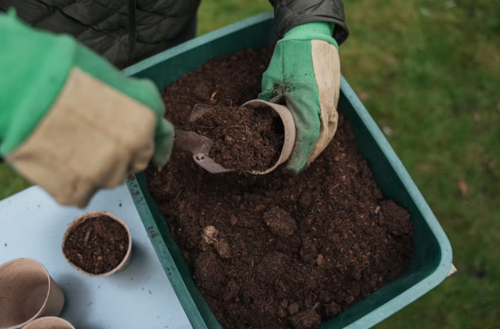

import GemeTerra2CTA from '@site/src/components/GemeTerra2CTA' 
import GemeComposterCTA from '@site/src/components/GemeComposterCTA' 
import RelatedArticles from '@site/src/components/RelatedArticles'
import ReactPlayer from 'react-player'

## Introduction: The Compost Speed Revolution

Let's cut to the chase.

You want a composter that transforms your kitchen scraps into real, usable compost, and you want it fast. Not in six months. Not in six weeks. In hours.

The market is flooded with machines claiming to be the best composter. But here's the uncomfortable truth most brands won't tell you: Most "composters" are actually dehydrators. They grind your food, bake it into sterile dust, and call it "compost." It's not. It's expensive garbage dust.

Real compost requires biology—living microorganisms that digest waste and create humus. And when it comes to speed and quality, one name dominates the 2026 landscape:

**GEME Terra II**.

In this guide, we're ranking the fastest best compost bins that produce genuine compost. We'll compare the popular compost bins and composters. By the end, you'll know exactly which machine turns your banana peels into black gold faster than anything else on earth.

When we talk about the best composter for fastest REAL compost, we're measuring two things simultaneously:

1. **How fast does the machine produce output**?

2. **Is that output actually compost**?

With that framework, let's meet the winner.

<!-- truncate -->

## 1. Best Composter Overall: GEME Terra II

### The World's First AI-Powered Kitchen Composter

If you want the absolute fastest path from kitchen scraps to garden-ready soil, GEME Terra II is in a league of its own .

### How It Works: Biology on Steroids

GEME Terra II doesn't dry or grind your food. Instead, [it uses a proprietary blend of **thermophilic microorganisms called "Kobold"** that literally eat your waste](https://www.geme.bio/kobold-introduction?utm_medium=blog&utm_source=geme_website&utm_campaign=general_seo_content&utm_content=best-composter-fastest-real-compost-geme-terra-2).

Here's what happens inside:

 - Add food waste, anything from vegetable peels to chicken bones to dairy

 - AI sensors continuously monitor temperature, moisture, oxygen, and pH

 - The system optimizes conditions for the Kobold microbes to thrive

 - Microbes digest organic matter at an accelerated rate

 - In as little as 6–8 hours, you have biologically active, ready-to-use compost 

[**See how GEME Terra II works & why it matters** -->](https://www.geme.bio/how-it-works?utm_medium=blog&utm_source=geme_website&utm_campaign=general_seo_content&utm_content=best-composter-fastest-real-compost-geme-terra-2)

### Why 6–8 Hours Is Revolutionary

Traditional composting takes 4–6 months. Even "fast" outdoor methods like HOTBIN take 30–90 days. GEME compresses that timeline into a single workday.

The science? For every 10°C rise in temperature, microbial activity doubles. GEME maintains the "Goldilocks Zone" where Kobold microbes operate at peak efficiency—combined with continuous aeration that mimics turning a compost pile hundreds of times.

<GemeTerra2CTA 
 imgSrc="/img/geme-terra-2-composter.jpg"
 productTitle="GEME Terra II: Best Kitchen Composter"
 features={[
    "✅ Best Composter For The Fastest Compost",
    "✅ Quiet, Odour-Free, Real Compost",
    "✅ Zero Filter Costs, No Refills",
    "✅ Reduce Landfill Waste & Greenhouse Gases"
 ]}
buttonText="Get Your GEME Terra II"
  href="https://www.geme.bio/product/terra2?utm_medium=blog&utm_source=geme_website&utm_campaign=general_seo_content&utm_content=best-composter-fastest-real-compost-geme-terra-2"
/>

### Table: GEME Terra II Performance Specifications

| **Specification** | **GEME Terra II** |
|---------------|---------------|
| **Composting Method** | AI-regulated thermophilic microbes (Kobold™) |
| **Time to Finished Compost** | 6–8 hours |
| **Daily Capacity** | ~2 kg (continuous feed) |
| **Output Type** | Ready-to-use, biologically active compost |
| **Noise Level** | 35–40 dB (whisper quiet) |
| **Odor Control** | Permanent metal-ion filter (no replacements) |
| **Filter Cost** | \$0 (lifetime) |
| **Can Handle Meat/Dairy/Bones?** | Yes (chicken bones, fish bones) |
| **Continuous Feed?** | Yes, add scraps anytime |
| **Weight** | ~12 kg (dense thermal insulation) |
| **Harvest Frequency** | Every 1–2 months |
| **Volume Reduction** | Up to 95% |

### The "No Hidden Costs" Advantage

Here's where GEME crushes the competition financially. Most electric composters or dehydrators require:

 - Carbon filter replacements ($20–30 every 3–6 months)

 - Microbe refills ($50+ annually)

 - Proprietary pods (ongoing revenue stream)

GEME Terra II costs \$0 in consumables. The metal-ion filter is permanent. The Kobold microbes are self-replicating—you only need to add them once. Over three years, that's \$300–\$600 saved compared to dehydrator-style competitors.

### Real-World Usability: Designed for Daily Life

#### The Continuous Feed Difference

With batch-cycle machines, once a cycle starts, the lid locks. If you cook dinner while it's running, those scraps sit on your counter overnight. GEME lets you lift the lid and toss them in anytime.

#### The Foot-Touch Lid

Pet owners, listen up. GEME uses a foot-touch switch that requires intentional activation, no accidental openings from curious noses.

#### The Quiet Factor

At 35–40 dB, GEME operates at the level of a modern refrigerator. You can run it in an open-concept apartment without annoying your roommate or waking the baby.

### Who Should Buy GEME Terra II?

 - ✅ Daily cooks who generate consistent food scraps

 - ✅ Apartment dwellers needing odor-free, compact solutions

 - ✅ Gardeners who want real compost for plants

 - ✅ Zero-waste advocates committed to true sustainability

 - ✅ Anyone tired of subscription and filter costs from other machines

**Verdict**: If you want the best composter for fastest compost, most biologically complete, zero recurring costs, GEME Terra II is the undisputed champion.

<GemeTerra2CTA 
 imgSrc="/img/geme-terra-2-composter.jpg"
 productTitle="GEME Terra II: Best Kitchen Composter"
 features={[
    "✅ Best Composter For The Fastest Compost",
    "✅ Quiet, Odour-Free, Real Compost",
    "✅ Zero Filter Costs, No Refills",
    "✅ Reduce Landfill Waste & Greenhouse Gases"
 ]}
buttonText="Get Your GEME Terra II"
  href="https://www.geme.bio/product/terra2?utm_medium=blog&utm_source=geme_website&utm_campaign=general_seo_content&utm_content=best-composter-fastest-real-compost-geme-terra-2"
/>

## 2. Best Composter for Large Households: GEME Pro

### When You Need Next-Level Capacity

If GEME Terra II is the sports car of composters, GEME Pro is the heavy-duty pickup truck. Designed for serious households, multi-family settings, or dedicated gardeners who generate massive amounts of organic waste.

### What Makes GEME Pro Different?

While both machines use the same core Kobold microbial technology, GEME Pro is engineered for heavier throughput.

### Table: GEME Terra II vs. GEME Pro

| **Feature** | **GEME Terra II** | **GEME Pro** |
|---------|---------------|----------|
| **Target User** | Standard households (1–3 people) | Large families, multi-family, heavy gardeners |
| **Daily Capacity** | ~2 kg | ~4–5 kg (estimated) |
| **Chamber Size** | 14L | 19L |
| **Microbial System** | Kobold™ thermophilic microbes | Kobold™ for higher loads |
| **Time to Compost** | 6–8 hours | 6-8 hours|
| **Continuous Feed** | Yes | Yes |
| **Odor Control** | Permanent metal-ion filter | Permanent filtration |
| **Filter Cost** | \$0 | \$0 |
| **Best For** | Apartments, standard kitchens | Large families, community gardens, small restaurants |

### The Pro Advantage

#### Uninterrupted Processing

With higher capacity, GEME Pro handles the waste from large cooking operations without breaking a sweat. Holiday feasts, weekly meal prep, garden cleanups, all processed continuously.

#### Same Zero-Consumable Philosophy

Like its smaller sibling, GEME Pro requires no filter replacements, no refills, no subscription. One purchase, lifetime operation.

#### Built for Longevity

Heavier construction, industrial-grade components, and the same microbial breakdowns that make GEME Pro so efficient—scaled up for demanding environments.

### Who Should Buy GEME Pro?

 - ✅ Households of 4+ people

 - ✅ Multi-generational families cooking daily

 - ✅ Community gardens sharing a composter

 - ✅ Small cafes or restaurants wanting on-site waste processing

 - ✅ Serious homesteaders with garden waste plus kitchen scraps

**Verdict**: For users who need maximum throughput without sacrificing compost quality or accumulating ongoing costs, GEME Pro is the ultimate weapon.

<GemeComposterCTA 
 imgSrc="/img/geme-bio-composter.jpg"
 productTitle="GEME Pro Composter"
 features={[
    "✅ Best Composter For Big Househoulds",
    "✅ Produce Soil-Ready Compost For Plant Growth",
    "✅ Quiet, Odor-Free, Quick(6-8 hours)",
    "✅ Large Capacity (19 L) For Daily Waste"
  ]}
buttonText="Get Your GEME Pro For Fastest Compost"
  href="https://www.geme.bio/product/geme?utm_medium=blog&utm_source=geme_website&utm_campaign=general_seo_content&utm_content=best-composter-fastest-real-compost-geme-terra-2"
/>

## 3. Best Outdoor Hot Composter: HOTBIN MK2

### When You Want Fast Without Electricity

Not everyone wants an electric countertop unit. If you have outdoor space and prefer a non-powered solution, the HOTBIN MK2 is the fastest traditional composter available.

### How It Works

HOTBIN uses insulation to trap heat generated naturally by bacteria as they digest waste. The result? Internal temperatures up to 140°F (60°C) and **compost in 30–90 days (6–12 months for cold composting)**.

### Table: HOTBIN MK2 Specifications

| Specification | HOTBIN MK2 |
|---------------|------------|
| **Method** | Insulated hot composting |
| **Time to Compost** | 30–90 days (6–12 months for cold composting) |
| **Capacity** | 52 gallons |
| **Power Source** | None (passive) |
| **Odor/Pest Issues** | Minimal due to high heat |
| **Can Handle Meat/Dairy?** | Yes (with proper management) |
| **Maintenance** | Occasional mixing |
| **Best For** | Households with gardens, 3–5 people |

### The Trade-Off

HOTBIN is 32 times faster than cold composting , but it's still **30–90 days versus GEME's 6–8 hours**. If you have outdoor space and patience, it's excellent. If you want instant results, go electric.

**Verdict**: The best composter for outdoor enthusiasts who want fast results without electricity.

## 4. Best Value Outdoor Bin: Maze Tumbler

### The Affordable Garden Workhorse

For gardeners on a budget who want faster results than open piles, the Maze geared twin tumbler offers excellent value.

| **Specification** | **Maze Geared Twin Tumbler** |
|---------------|--------------------------|
| **Method** | Tumbling compost |
| **Time to Compost** | 4–8 weeks (with regular turning) |
| **Capacity** | 180L (dual chamber) |
| **Price** | \$249 (often on sale) |
| **Key Feature** | Geared handle for easy turning |
| **Best For** | Gardeners wanting batch composting |

### The Trade-Off

Tumblers require regular turning (every few days) and don't handle meat/dairy well. But for pure garden waste and vegetable scraps, they're effective and affordable.

**Verdict**: The best compost bin for value-conscious gardeners with moderate space.

<GemeTerra2CTA 
 imgSrc="/img/geme-terra-2-composter.jpg"
 productTitle="GEME Terra II: Best Kitchen Composter"
 features={[
    "✅ Best Composter For The Fastest Compost",
    "✅ Quiet, Odour-Free, Real Compost",
    "✅ Zero Filter Costs, No Refills",
    "✅ Reduce Landfill Waste & Greenhouse Gases"
 ]}
buttonText="Get Your GEME Terra II"
  href="https://www.geme.bio/product/terra2?utm_medium=blog&utm_source=geme_website&utm_campaign=general_seo_content&utm_content=best-composter-fastest-real-compost-geme-terra-2"
/>

## 5. Best Worm Composting System: Hungry Bin

### Nature's Fastest Decomposers

If you're open to letting worms do the work, the Hungry Bin is a continuous-flow vermicomposting system that handles up to 4.4 lbs of waste per day.

### How It Works

Red wiggler worms eat your scraps and produce worm castings, arguably the highest-quality fertilizer available. The Hungry Bin's design allows continuous feeding and easy harvesting from the bottom.

| **Specification** | **Hungry Bin** |
|---------------|------------|
| **Method** | Vermicomposting (worms) |
| **Time to Compost** | 3–6 months |
| **Daily Capacity** | Up to 4.4 lbs |
| **Output** | Worm castings (premium fertilizer) |
| **Maintenance** | Regular feeding, moisture monitoring |
| **Can Handle Meat/Dairy?** | No |
| **Best For** | Dedicated gardeners wanting premium soil |

**Verdict**: For compost quality purists who enjoy tending a living system, worms are unbeatable, but they're slower and more hands-on than GEME.

## 6. The Speed Comparison: How Fast Is "Fast"?

Let's put all these options side by side so you can see the differences clearly.

### Table: Time to Finished Compost by Method

| Method | Time to Finished Compost | Notes |
|--------|--------------------------|-------|
| **GEME Terra II (Microbial)** | 6–8 hours | Ready-to-use, biologically active |
| **GEME Pro** | 6–8 hours | Same speed, larger capacity |
| **Dehydrator (Lomi, etc.)** | 3–20 hours | Output is sterile dust, not compost |
| **HOTBIN (Outdoor hot)** | 30–90 days | Fast for outdoor, but still weeks |
| **Tumbler (regular turning)** | 4–8 weeks | Depends on turning frequency |
| **Vermicomposting** | 3–6 months | Premium quality, patient process |
| **Cold pile/passive bin** | 6–12 months | Minimal effort, maximum patience |

The Takeaway: If speed matters, and you want real compost, not dehydrated scraps, GEME Terra II is in a category of one.

## 7. The Cost of Ownership: Don't Get Trapped

Here's where many buyers make a costly mistake. They look at upfront price tags without calculating long-term consumables.

### Table: 3-Year Total Cost Comparison

| **Composter** | **Upfront Price** | **Annual Consumables** | **3-Year Total** |
|-----------|---------------|-------------------|--------------|
| **GEME Terra II** | \$549 | \$0 | **\$549** |
| **GEME Pro** | \$899 | \$0 | **\$899** |
| **Lomi** | \$499 | \$100–\$200 | \$799–\$1,099 |
| **Reencle** | \$499 | \$35 + \$12 (carbon filter + mesh filter) | \$640–\$675 |
| **HOTBIN** | ~\$300 | \$0 | \$300 |
| **Maze Tumbler** | \$249 | \$0 | \$249 |

**The GEME Advantage**: With permanent metal-ion filter and self-replicating microbes, your GEME costs you nothing after purchase. Most competitors lock you into subscriptions that double your investment over time.

<GemeTerra2CTA 
 imgSrc="/img/geme-terra-2-composter.jpg"
 productTitle="GEME Terra II: Best Kitchen Composter"
 features={[
    "✅ Best Composter For The Fastest Compost",
    "✅ Quiet, Odour-Free, Real Compost",
    "✅ Zero Filter Costs, No Refills",
    "✅ Reduce Landfill Waste & Greenhouse Gases"
 ]}
buttonText="Get Your GEME Terra II"
  href="https://www.geme.bio/product/terra2?utm_medium=blog&utm_source=geme_website&utm_campaign=general_seo_content&utm_content=best-composter-fastest-real-compost-geme-terra-2"
/>

## How to Choose: A Decision Framework

Still unsure which best composter fits your life? Use this flowchart:

### Ask Yourself These Questions

1. Do you want REAL compost or just less trash?

**Real compost** → GEME Terra II, GEME Pro, HOTBIN, worms

**Just less trash** → Dehydrator (Lomi, etc.)

2. Do you have outdoor space?

**Yes** → Consider HOTBIN, tumbler, or worms

**No** → GEME Terra II (indoor, odor-free)

3. How fast do you need results?

**Hours** → GEME Terra II or GEME Pro

**Weeks** → HOTBIN or tumbler

**Months** → Worms or cold pile

4. How much waste do you generate?

Light (1–3 people) → **GEME Terra II**

Heavy (4+ people, cooking daily) → **GEME Pro**

Garden waste + kitchen scraps → **GEME Terra II**, **GEME Pro**, HOTBIN or tumbler

5. Do you hate ongoing costs?

**Yes** → GEME (zero consumables)

**Okay with expensive filters** → Reencle, Lomi

## 7. Frequently Asked Questions

### Q: What is the best composter for fastest real compost?

> A: GEME Terra II. It produces biologically active, ready-to-use compost in just 6–8 hours—faster than any other true composter on the market.

### Q: Is Lomi actually composting?

> A: No. Lomi is a dehydrator and grinder. Its output is sterile, dried scraps, not compost. It reduces volume but doesn't create living soil.

### Q: Can GEME Terra II handle meat and bones?

> A: Yes. The Kobold microbes digest chicken bones, fish bones, meat, and dairy effectively. Very large beef/pork bones or oyster shells should be avoided.

### Q: How often do I need to replace filters in GEME?

> A: Never. GEME uses a permanent metal-ion filter designed for the machine's lifetime. There are zero ongoing consumable costs.

### Q: What's the difference between GEME Terra II and GEME Pro?

> A: GEME Terra II is designed for standard households (1–3 people) with ~2kg daily capacity. GEME Pro is built for larger families or commercial use, with significantly higher throughput while maintaining the same 6–8 hour compost time.

### Q: Is GEME Terra II suitable for apartments?

> A: Absolutely. It's compact, quiet (35–40 dB), odor-free, and designed specifically for indoor use. The foot-touch lid and continuous feed make it perfect for small kitchens. You can [check this post -->](/blog/how-to-compost-at-home)

### Q: Do I need to buy microbes regularly?

> A: No. The Kobold microbes are self-replicating. You add them once, and they sustain themselves as long as conditions remain favorable. However, if you'd like to boost the decomposition, there are Kobold Packs available at GEME's official website.

### Q: How much electricity does GEME use?

> A: GEME uses dynamic cycling—minimal power to maintain temperatures, ramping up only when new waste is detected. It's approximately 114 kWh per day for GEME Terra II, comparable to running a laptop.

### Q: Can I use GEME compost immediately on plants?

> A: Yes. GEME output is ready-to-use, biologically active compost. Mix it 1:8 with soil for houseplants, or use as top dressing. No curing required.

<GemeTerra2CTA 
 imgSrc="/img/geme-terra-2-composter.jpg"
 productTitle="GEME Terra II: Best Kitchen Composter"
 features={[
    "✅ Best Composter For The Fastest Compost",
    "✅ Quiet, Odour-Free, Real Compost",
    "✅ Zero Filter Costs, No Refills",
    "✅ Reduce Landfill Waste & Greenhouse Gases"
 ]}
buttonText="Get Your GEME Terra II"
  href="https://www.geme.bio/product/terra2?utm_medium=blog&utm_source=geme_website&utm_campaign=general_seo_content&utm_content=best-composter-fastest-real-compost-geme-terra-2"
/>

## 8. Conclusion: The Verdict Is Clear

After comparing every major option on the market, one truth stands out:

 - If you want the fastest path from kitchen scraps to genuine, living compost, GEME Terra II is the only choice.

 - It's not just faster—it's fundamentally different. While competitors sell you expensive subscriptions to produce sterile dust, GEME gives you:

  1. Real compost in 6–8 hours

  2. Zero ongoing costs (save hundreds over time)

  3. Continuous feed for daily cooking

  4. Apartment-friendly silence and odor control

  5. Industrial-grade biology in a kitchen-friendly package

For large households, GEME Pro scales that same proven technology to handle anything you throw at it.

A dehydrator like Lomi costs $1,099 over three years after filters and pods. GEME Terra II costs $549 in total. That's $550 back in your pocket. Money you can spend on plants for all that beautiful compost you're making.

Every pound of food waste you compost instead of landfilling eliminates methane emissions 25 times more potent than CO₂. When you use a system that creates living soil rather than sterile dust, you're not just reducing waste, you're regenerating resources.

### The Final Word

Don't settle for a machine that dries your garbage. Demand one that brings it back to life. Choose real compost. Choose faster, smarter sustainability.

👉 [Order Your GEME Terra II Now](https://www.geme.bio/product/terra2?utm_medium=blog&utm_source=geme_website&utm_campaign=general_seo_content&utm_content=best-composter-fastest-real-compost-geme-terra-2)
👉 [Explore GEME Pro for Large Households](https://www.geme.bio/product/geme?utm_medium=blog&utm_source=geme_website&utm_campaign=general_seo_content&utm_content=best-composter-fastest-real-compost-geme-terra-2)

<GemeTerra2CTA 
 imgSrc="/img/geme-terra-2-composter.jpg"
 productTitle="GEME Terra II: Best Kitchen Composter"
 features={[
    "✅ Best Composter For The Fastest Compost",
    "✅ Quiet, Odour-Free, Real Compost",
    "✅ Zero Filter Costs, No Refills",
    "✅ Reduce Landfill Waste & Greenhouse Gases"
 ]}
buttonText="Get Your GEME Terra II"
  href="https://www.geme.bio/product/terra2?utm_medium=blog&utm_source=geme_website&utm_campaign=general_seo_content&utm_content=best-composter-fastest-real-compost-geme-terra-2"
/>

<GemeComposterCTA 
 imgSrc="/img/geme-bio-composter.jpg"
 productTitle="GEME Pro Composter"
 features={[
    "✅ Best Composter For Big Househoulds",
    "✅ Produce Soil-Ready Compost For Plant Growth",
    "✅ Quiet, Odor-Free, Quick(6-8 hours)",
    "✅ Large Capacity (19 L) For Daily Waste"
  ]}
buttonText="Get Your GEME Pro For Fastest Compost"
  href="https://www.geme.bio/product/geme?utm_medium=blog&utm_source=geme_website&utm_campaign=general_seo_content&utm_content=best-composter-fastest-real-compost-geme-terra-2"
/>

## Sources Cited

1. [Gardener's Supply: HOTBIN MK2 Composter, 52 Gallon](https://www.gardeners.com/products/hotbin-mk2-composter-52-gallon) 

2. [GEME Official Blog: Reencle vs. GEME: The Ultimate Microbial Composter Showdown](https://www.geme.bio/blog/does-reencle-composter-produce-real-compost) 

3. [GEME Official: How It Work](https://www.geme.bio/how-it-works?utm_medium=blog&utm_source=geme_website&utm_campaign=general_seo_content&utm_content=best-composter-fastest-real-compost-geme-terra-2)

4. [Better Homes & Gardens Australia: This is how to pick best compost bin based on your lifestyle](https://www.bhg.com.au/food/best-compost-bin/) 

5. [ShopSavvy: Best Food Waste Composters of 2025](https://www.shopsavvy.com/best-picks/best-food-waste-composter) 

6. [Epic Gardening: 7 Different Composting Methods for Home Gardeners](https://www.epicgardening.com/composting-methods/) 

7. [Robert Dyas: Vitax Compost Maker](https://www.robertdyas.co.uk/vitax-compost-maker) 

8. [GEME Official Blog: Best Kitchen Composters in 2026](https://www.geme.bio/blog/best-kitchen-composter-in-2026-geme-terra-2) 

<RelatedArticles
  slugs={[
  "how-to-compost-at-home-beginners-guide",
  "how-long-can-chicken-stay-in-the-fridge",
  "how-to-reduce-odor-indoor-composting-tips",
  "how-long-can-ground-beef-stay-in-the-fridge",
  "nyc-composting-fines-2026-geme-terra-2-best-electric-compost",
  "best-indoor-composter-for-apartment-geme-vs-lomi",
  "the-best-composter-for-kitchen",
  "how-to-reduce-food-waste-during-spring-festival",
  "does-reencle-composter-produce-real-compost",
  "does-mill-composter-really-compost",
  "how-to-reduce-food-waste-at-home-2026",
  "free-mcnugget-caviar-raises-food-waste-concerns",
  "composting-in-winter",
  "how-to-compost-at-home",
  "zero-waste-home-kitchen-composter",
  "does-lomi-composter-really-compost",
  "5-best-kitchen-composters-in-2026",
  "best-kitchen-composter-in-2026-geme-terra-2",
  "geme-vs-reencle-composter-2026",
  "geme-vs-mill-composter-2026",
  "best-kitchen-composter-2026",
  "advanced-geme-compost-application-guide",
  "electric-compost-bin-filters-costs-comparison",
  "geme-vs-lomi", 
  "geme-terra-2-debuts",
  "the-best-composter-to-reduce-food-waste",
  "compost-pile-vs-electric-composter",
  "how-to-make-bananas-last-longer",
  "how-long-do-apples-last-in-the-fridge",
  "can-i-compost-moldy-grapes",
  "can-you-compost-moldy-bread",
  ]}
/>

_Ready to transform your gardening game? Subscribe to our [newsletter](http://geme.bio/signup?utm_medium=blog&utm_source=geme_website&utm_campaign=general_seo_content&utm_content=how-to-compost-at-home-beginners-guide) for expert composting tips and sustainable gardening advice._

