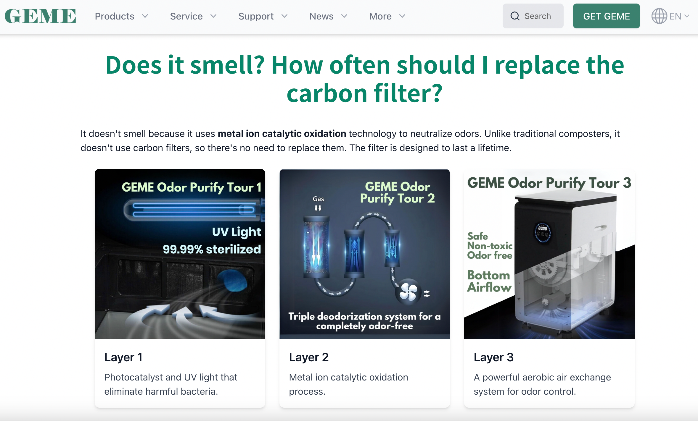

import GemeTerra2CTA from '@site/src/components/GemeTerra2CTA' 
import GemeComposterCTA from '@site/src/components/GemeComposterCTA' 
import RelatedArticles from '@site/src/components/RelatedArticles'
import ReactPlayer from 'react-player'

## Tired of constantly replacing carbon filters for your composter? 

If you’re like most eco-conscious individuals, you’ve likely made the noble decision to compost your kitchen scraps. It’s an excellent way to reduce waste, enrich your soil, and feel like you're part of the solution in this big, beautiful planet of ours. However, if you’ve ever used a traditional composter, you’re probably familiar with the all-too-familiar, wallet-draining necessity of constantly replacing carbon filters.

Imagine, if you will, a world where you no longer need to buy those pesky, pricey filters year after year. Enter the GEME Terra 2, a composter that allows you to compost without ever having to worry about replacing a carbon filter. It’s not just a dream, it’s the future of sustainable waste management, and it’s right at your fingertips.

### The Problem with Traditional Composters and Their Carbon Filters

Composting is a great way to manage your food scraps, right? You toss in your leftovers, and voilà, your waste turns into nutrient-rich soil for your garden. But then comes the maintenance part: replacing the carbon filters. If you’ve ever owned a composter, you know the drill. After a few months, the filter starts to lose its effectiveness, and you're stuck either buying another one or dealing with the stench.

Traditional composters often use carbon filters to mask the odors that come with the decomposition process. However, replacing them regularly is both a hassle and a recurring cost. The filters need to be replaced every few months, which means that your “eco-friendly” solution is costing you a lot of time, money, and unnecessary waste in the form of filter disposals.

**Meet GEME Terra 2**. This isn’t your typical composter. Say goodbye to the never-ending filter replacements and welcome a truly revolutionary waste management solution.

<!-- truncate -->

## 1. What Makes GEME Terra 2 Stand Out?

The GEME Terra 2 isn’t just any composter. It’s a continuous-feed aerobic composter, which means it works 24/7, and you can add your food scraps at any time. No more waiting for a batch to finish before adding your next batch. With GEME Terra 2, the process is seamless and ongoing.

One of the standout features is the Metal-Ion Oxidation Catalyst, a fancy name for a lifetime odor control system. Unlike traditional composters that require you to replace carbon filters regularly, GEME Terra 2’s filter lasts for the lifetime of the machine. That’s right; no more spending money on replacement filters. This is not only more cost-effective but also more eco-friendly.

But there’s more! The GEME Terra 2 doesn’t just mask odors. It completely neutralizes them through an industrial-grade process, ensuring your kitchen remains fresh and odor-free. So, whether you’re dealing with banana peels or broccoli stalks, you can rest easy knowing your composter won’t be sending out unpleasant aromas into your home.

<GemeTerra2CTA 
 imgSrc="/img/geme-terra-2-composter.jpg"
 productTitle="GEME Terra II: Best Kitchen Composter"
 features={[
    "✅ Revolutional Non-carbon-filter Composting",
    "✅ Quiet, Odour-Free, Real Compost",
    "✅ Zero Filter Costs, No Refills",
    "✅ Reduce Landfill Waste & Greenhouse Gases"
 ]}
buttonText="Get Your GEME Terra II"
  href="https://www.geme.bio/product/terra2?utm_medium=blog&utm_source=geme_website&utm_campaign=general_seo_content&utm_content=never-buy-carbon-filter-for-your-composter"
/>

## 2. Dehydrators vs. GEME Terra 2: Why the Difference Matters

Now, you may be wondering, “How does GEME Terra 2 compare to a dehydrator?” Well, let’s get this straight: **dehydrators and composters are not the same thing**.

Dehydrators are excellent at drying out food for storage. But guess what? They don’t actually turn your food scraps into compost. They remove the moisture, but they don’t break down the organic material. So, while you may be able to make jerky or dried fruits with a dehydrator, it’s not going to provide you with nutrient-rich compost for your garden.

On the other hand, **GEME Terra 2** is a real composter. It uses a continuous aerobic biological process that turns your food scraps into active compost base in as little as 6-8 hours. No dehydration here, just full-fledged composting. The result is rich, microbe-active compost that you can directly use in your garden. Unlike dehydrators, GEME Terra 2 gives back to your garden, not just to your snack stash.

In a nutshell, if you’re looking for a way to truly compost your food waste and improve your garden, [**GEME Terra 2 is the clear winner**](https://www.geme.bio/product/terra2?utm_medium=blog&utm_source=geme_website&utm_campaign=general_seo_content&utm_content=never-buy-carbon-filter-for-your-composter).

## 3. The Real Benefits of Not Replacing Carbon Filters

Imagine for a moment that you never had to worry about buying a carbon filter again. Sounds like a dream, right? Well, with the GEME Terra 2, that dream becomes a reality. Here’s why:

 - **Cost Savings**: Over the years, those replacement filters add up. With GEME Terra 2, there are no hidden costs ever. The system runs without the need for replacement filters, which means your savings pile up as time goes on.

 - **Convenience**: No more running to the store every few months to buy a new filter. GEME Terra 2’s lifetime odor control means that once you’ve made your purchase, you’re done.

 - **Environmental Impact**: Fewer filters being thrown away means less waste in landfills. GEME Terra 2’s eco-friendly design helps reduce plastic waste and saves you from contributing to the growing problem of disposable products.

<GemeTerra2CTA 
 imgSrc="/img/geme-terra-2-composter.jpg"
 productTitle="GEME Terra II: Best Kitchen Composter"
 features={[
    "✅ Revolutional Non-carbon-filter Composting",
    "✅ Quiet, Odour-Free, Real Compost",
    "✅ Zero Filter Costs, No Refills",
    "✅ Reduce Landfill Waste & Greenhouse Gases"
 ]}
buttonText="Get Your GEME Terra II"
  href="https://www.geme.bio/product/terra2?utm_medium=blog&utm_source=geme_website&utm_campaign=general_seo_content&utm_content=never-buy-carbon-filter-for-your-composter"
/>

## 4. GEME Terra 2’s Features: Everything You Need to Know

Let’s take a look at some of the features that make GEME Terra 2 the best composter on the market.

| **Feature**           | **GEME Terra 2**                     | **Traditional Dehydrators**                      |
| --------------------- | ------------------------------------ | ----------------------------------------------- |
| **Odor Control**      | Lifetime, permanent metal-ion filter | Requires regular carbon filter changes          |
| **Feeding System**    | Continuous feed (add at any time)    | Batch feed (must wait for a cycle to complete)  |
| **Maintenance**       | Low, only occasional cleaning        | Regular filter changes and maintenance          |
| **Power Consumption** | 60W average / 1.4 kWh daily          | High and Varies depending on model                       |
| **Output**            | Active compost (ready in 6-8 hours)  | Dried material requiring further processing |

As you can see, GEME Terra 2 outshines traditional composters in every category. It’s efficient, cost-effective, and eco-friendly, making it the best choice for anyone serious about composting.

### Real-World Examples: How GEME Terra 2 Makes Life Easier

Let’s say you’re a busy family of four, juggling work, kids, and daily chores. You love the idea of composting but can’t stand the thought of adding another task to your already packed schedule. With GEME Terra 2, composting becomes effortless. You simply toss your food scraps into the machine, and it handles the rest. No waiting for cycles to finish, no worrying about filters, it’s that easy.

Or, perhaps you’re a city dweller with limited space. You’ve always wanted to compost but don’t have a yard or the room for a traditional compost bin. GEME Terra 2’s compact, floor-standing design fits perfectly in a small kitchen, making it the perfect solution for urban living.

## 5. Frequently Asked Questions

### Q: Can you compost meat with GEME Terra 2?

> A: Yes. The Kobold microbes digest chicken bones, fish bones, meat, and dairy effectively. Very large beef/pork bones or oyster shells should be avoided. [**Check this post -->**](/blog/how-long-can-ground-beef-stay-in-the-fridge)

### Q: What’s the difference between a dehydrator and a composter?

> A: A dehydrator removes moisture from food, but it doesn’t compost it. A composter like GEME Terra 2 uses a biological process to break down food scraps into nutrient-rich compost that can be used in your garden. [**See the differences between Real Compost & Dehydrated Waste -->**](https://www.geme.bio/compare/real-compost-vs-dehydrated-scraps?utm_medium=blog&utm_source=geme_website&utm_campaign=general_seo_content&utm_content=never-buy-carbon-filter-for-your-composter)

### Q: How often do I need to replace filters in GEME?

> A: Never. GEME uses a permanent metal-ion filter designed for the machine's lifetime. There are zero ongoing consumable costs.

### Q: What's the difference between GEME Terra II and GEME Pro?

> A: GEME Terra II is designed for standard households (1–3 people) with ~2kg daily capacity. GEME Pro is built for larger families or commercial use, with significantly higher throughput while maintaining the same 6–8 hour compost time.

### Q: Is GEME Terra II suitable for apartments?

> A: Absolutely. It's compact, quiet (35–40 dB), odor-free, and designed specifically for indoor use. The foot-touch lid and continuous feed make it perfect for small kitchens. You can [check this post -->](/blog/how-to-compost-at-home)

### Q: Do I need to buy microbes regularly?

> A: No. The Kobold microbes are self-replicating. You add them once, and they sustain themselves as long as conditions remain favorable. However, if you'd like to boost and maximize the microbial decomposition, there are Kobold Packs available at [**GEME's official website**](https://www.geme.bio/geme-kobold?utm_medium=blog&utm_source=geme_website&utm_campaign=general_seo_content&utm_content=never-buy-carbon-filter-for-your-composter).

### Q: How much electricity does GEME use?

> A: GEME uses dynamic cycling, minimal power to maintain temperatures, ramping up only when new waste is detected. It's approximately 1.4 kWh per day for GEME Terra II, comparable to running a laptop.

<GemeTerra2CTA 
 imgSrc="/img/geme-terra-2-composter.jpg"
 productTitle="GEME Terra II: Best Kitchen Composter"
 features={[
    "✅ Revolutional Non-carbon-filter Composting",
    "✅ Quiet, Odour-Free, Real Compost",
    "✅ Zero Filter Costs, No Refills",
    "✅ Reduce Landfill Waste & Greenhouse Gases"
 ]}
buttonText="Get Your GEME Terra II"
  href="https://www.geme.bio/product/terra2?utm_medium=blog&utm_source=geme_website&utm_campaign=general_seo_content&utm_content=never-buy-carbon-filter-for-your-composter"
/>

## 6. Conclusion: The Last Carbon Filter You’ll Ever Need

If you’re tired of dealing with the hassle of replacing carbon filters and want a truly sustainable solution for your kitchen scraps, the GEME Terra 2 is your answer. It’s the last composter you’ll ever need to buy, no more filters, no more fuss, and no more waste.

Ready to make the switch? Say goodbye to the endless cycle of carbon filter replacements and hello to GEME Terra 2, the composter that works for you 24/7.

**Make the change today and transform your waste into rich, usable compost**!

👉 [Order Your GEME Terra II Now](https://www.geme.bio/product/terra2?utm_medium=blog&utm_source=geme_website&utm_campaign=general_seo_content&utm_content=never-buy-carbon-filter-for-your-composter)

👉 [Explore GEME Pro for Large Households](https://www.geme.bio/product/geme?utm_medium=blog&utm_source=geme_website&utm_campaign=general_seo_content&utm_content=never-buy-carbon-filter-for-your-composter)

<GemeTerra2CTA 
 imgSrc="/img/geme-terra-2-composter.jpg"
 productTitle="GEME Terra II: Best Kitchen Composter"
 features={[
    "✅ Revolutional Non-carbon-filter Composting",
    "✅ Quiet, Odour-Free, Real Compost",
    "✅ Zero Filter Costs, No Refills",
    "✅ Reduce Landfill Waste & Greenhouse Gases"
 ]}
buttonText="Get Your GEME Terra II"
  href="https://www.geme.bio/product/terra2?utm_medium=blog&utm_source=geme_website&utm_campaign=general_seo_content&utm_content=never-buy-carbon-filter-for-your-composter"
/>

<GemeComposterCTA 
 imgSrc="/img/geme-bio-composter.jpg"
 productTitle="GEME Pro Composter"
 features={[
    "✅ Revolutional Non-carbon-filter Composting",
    "✅ Produce Soil-Ready Compost For Plant Growth",
    "✅ Quiet, Odor-Free, Quick(6-8 hours)",
    "✅ Large Capacity (19 L) For Daily Waste"
  ]}
buttonText="Get Your GEME Pro For Fastest Compost"
  href="https://www.geme.bio/product/geme?utm_medium=blog&utm_source=geme_website&utm_campaign=general_seo_content&utm_content=never-buy-carbon-filter-for-your-composter"
/>

<RelatedArticles
  slugs={[
  "best-composter-fastest-real-compost-geme-terra-2",
  "how-to-compost-at-home-beginners-guide",
  "how-long-can-chicken-stay-in-the-fridge",
  "how-to-reduce-odor-indoor-composting-tips",
  "how-long-can-ground-beef-stay-in-the-fridge",
  "nyc-composting-fines-2026-geme-terra-2-best-electric-compost",
  "best-indoor-composter-for-apartment-geme-vs-lomi",
  "the-best-composter-for-kitchen",
  "how-to-reduce-food-waste-during-spring-festival",
  "does-reencle-composter-produce-real-compost",
  "does-mill-composter-really-compost",
  "how-to-reduce-food-waste-at-home-2026",
  "free-mcnugget-caviar-raises-food-waste-concerns",
  "composting-in-winter",
  "how-to-compost-at-home",
  "zero-waste-home-kitchen-composter",
  "does-lomi-composter-really-compost",
  "5-best-kitchen-composters-in-2026",
  "best-kitchen-composter-in-2026-geme-terra-2",
  "geme-vs-reencle-composter-2026",
  "geme-vs-mill-composter-2026",
  "best-kitchen-composter-2026",
  "advanced-geme-compost-application-guide",
  "electric-compost-bin-filters-costs-comparison",
  "geme-vs-lomi", 
  "geme-terra-2-debuts",
  "the-best-composter-to-reduce-food-waste",
  "compost-pile-vs-electric-composter",
  "how-to-make-bananas-last-longer",
  "how-long-do-apples-last-in-the-fridge",
  "can-i-compost-moldy-grapes",
  "can-you-compost-moldy-bread",
  ]}
/>

_Ready to transform your gardening game? Subscribe to our [newsletter](http://geme.bio/signup?utm_medium=blog&utm_source=geme_website&utm_campaign=general_seo_content&utm_content=how-to-compost-at-home-beginners-guide) for expert composting tips and sustainable gardening advice._

