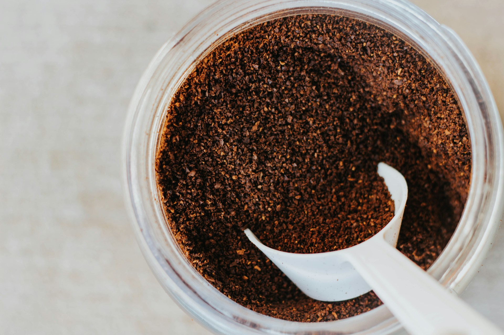
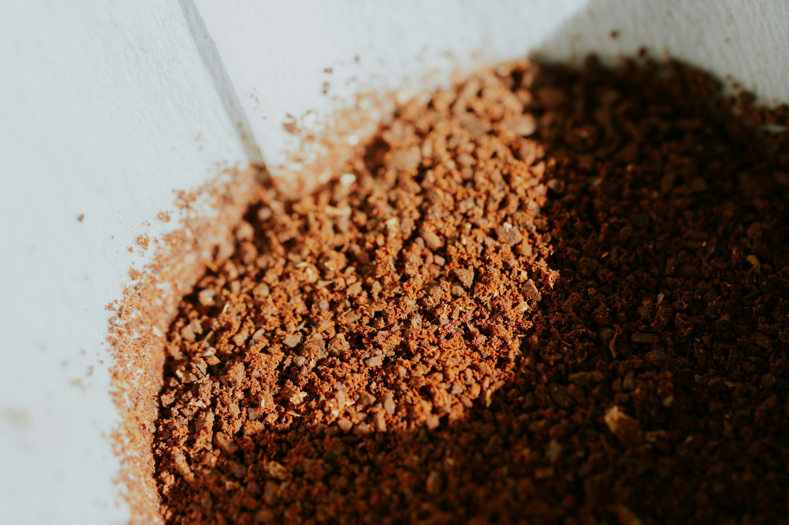

import GemeTerra2CTA from '@site/src/components/GemeTerra2CTA' 
import GemeComposterCTA from '@site/src/components/GemeComposterCTA' 
import RelatedArticles from '@site/src/components/RelatedArticles'
import ReactPlayer from 'react-player'

## Introduction: Don't Throw Away Your Coffee Grounds

You've just brewed your morning cup of coffee. The aroma fills your kitchen, caffeine hits your bloodstream, and you're ready to conquer the day. Then you do what millions of people do: **you scrape those used coffee grounds into the trash**.

Stop right there.

You're throwing away one of the most valuable resources for your garden. With an estimated two billion cups of coffee consumed daily worldwide, that's a staggering amount of organic material heading to landfills. And when coffee grounds end up in landfills, they decompose anaerobically and release methane, a greenhouse gas 25 times more potent than carbon dioxide.

But here's the good news: **learning how to compost coffee grounds is simple, rewarding, and transforms your morning habit into garden gold**. Those humble brown specks contain nitrogen, potassium, phosphorus, and a host of micronutrients that plants crave.

In this comprehensive guide, we'll answer the burning question "are coffee grounds good for plants?" and show you exactly how to use them. From composting techniques to which coffee grounds plants love them most, you'll become a coffee ground guru by the time you finish your next cup.

<!-- truncate -->

## 1. Are Coffee Grounds Good for Plants? The Science Speaks

Let's address the million-dollar question upfront: **are coffee grounds good for plants**?

The short answer is **yes, but with important caveats**.

### The Nutritional Profile of Coffee Grounds

Used coffee grounds (also called "spent grounds") contain a surprising array of plant-friendly nutrients:

| **Nutrient**        | **Percentage by Volume** | **Benefit to Plants**                                          |
|-----------------|---------------------|------------------------------------------------------------|
| **Nitrogen**        | 1-2%                | Promotes leafy growth and vibrant green color              |
| **Potassium**       | ~0.6%               | Supports overall plant health and disease resistance       |
| **Phosphorus**      | ~0.06%              | Encourages root development and flowering                  |
| **Micronutrients**  | Trace amounts       | Includes copper, calcium, iron, magnesium, and zinc        |

Coffee grounds also have a **carbon-to-nitrogen ratio of approximately 20-24:1**, which makes them an ideal "green" material for composting.

### The Fresh Grounds Warning: Read This Before You Sprinkle

Here's where many gardeners go wrong. **Fresh coffee grounds should never be applied directly to soil in thick layers**.

Dr. Linda Chalker-Scott from Washington State University, who has synthesized extensive coffee ground research, warns that **fresh grounds contain polyphenols, tannins, and caffeine that can harm plants and soil microorganisms**. In fact, one study showed fresh coffee grounds were quite effective at killing weeds, and desirable plants along with them.

When applied in quantity to the soil surface, the fine particles clump together and form **a barrier that prevents water and air from reaching plant roots**. This can suffocate your plants and create mold problems.

### The Verdict: Compost First, Apply Later

The safest and most effective approach is to **compost coffee grounds before using them in the garden**. Composting neutralizes the harmful compounds while preserving the nutritional benefits.

As SDSU Extension explains: "**Diluting the grounds with other organic matter (on a 1:1 basis) and then composting that mixture for at least several months in a pile that is turned periodically and kept moist greatly reduces the toxins**".

## 2. How to Compost Coffee Grounds Step by Step

Now that we understand the science, let's dive into the practical how to compost coffee grounds methods that work.

### The Green-Brown Balance: Where Coffee Fits

Composting is all about balancing two types of materials:

 - **Greens**: Nitrogen-rich, wet materials (coffee grounds, kitchen scraps, fresh grass)

 - **Browns**: Carbon-rich, dry materials (leaves, shredded paper, cardboard)

**Coffee grounds are considered a "green" composting material** because of their nitrogen content. This surprises many people since the grounds are brown in color, but in composting, color doesn't matter, chemistry does.

### The Golden Ratio for Coffee Grounds

When adding coffee grounds to your compost:

 1. **Mix used grounds with 2-3 times the amount of brown materials** by volume. This means for every bucket of coffee grounds, add 2-3 buckets of dried leaves, shredded paper, or cardboard.

 2. **Limit coffee grounds to no more than 20-35% of your total compost volume**. Research shows that exceeding 30% coffee grounds can be detrimental to the composting process.

 3. **Turn the pile regularly** to ensure proper aeration. The fine particles of coffee grounds can compact easily, so mixing is essential.

### What About the Paper Filter?

Good news: **paper coffee filters can be composted too**. They count as a "brown" material, adding carbon to balance the nitrogen-rich grounds. Tear them up a bit to help them break down faster.

### Composting Timeline

| **Method**                       | **Time to Finished Compost** | **Notes**                              |
|----------------------------------|-----------------------------|----------------------------------------|
| Hot compost pile (turned regularly) | 3-5 months                  | Faster breakdown, kills pathogens      |
| Cold compost pile (passive)         | 6-12 months                 | Slower, less maintenance               |
| Vermicomposting (worms)            | 3-6 months                  | Worms love coffee grounds!             |

The composted grounds can then be spread lightly over your garden or substituted for **up to 10% of your raised bed soil**.

<GemeTerra2CTA 
 imgSrc="/img/geme-terra-2-composter.jpg"
 productTitle="GEME Terra II: Best Kitchen Composter"
 features={[
    "✅ Best Tool To Compost Coffee Grounds",
    "✅ Quiet, Odour-Free, Real Compost",
    "✅ Zero Filter Costs, No Refills",
    "✅ Reduce Landfill Waste & Greenhouse Gases"
 ]}
buttonText="Get Your GEME Terra II"
  href="https://www.geme.bio/product/terra2?utm_medium=blog&utm_source=geme_website&utm_campaign=general_seo_content&utm_content=how-to-compost-coffee-grounds-guide"
/>

## 3. Coffee Grounds Plants: Who Loves Them and Who Doesn't

Not all plants respond the same way to coffee grounds. Here's your comprehensive guide to coffee grounds plants that thrive with this treatment.

### Plants That LOVE Coffee Grounds

| **Plant Category**        | **Specific Plants**                                                    | **Why They Love It**                                              |
|----------------------|--------------------------------------------------------------------|--------------------------------------------------------------|
| **Acid-Loving Plants**   | Azaleas, Rhododendrons, Camellias, Gardenias, Hydrangeas           | Slight acidity (pH 5.5-6.8) matches their preferences         |
| **Vegetables**           | Carrots, Eggplants, Potatoes, Peppers, Radishes                    | Nitrogen boost for leafy growth                               |
| **Fruiting Plants**      | Blueberries, Strawberries, Citrus trees                            | Potassium supports fruit production                           |
| **Indoor House Plants**  | African violets, Jade plants, Snake plants, Peace lilies           | Slow-release nitrogen for foliage                             |
| **Roses**                | All varieties                                                      | Nutrient-hungry plants benefit from coffee grounds            |

### Plants to Use Coffee Grounds With Caution

| **Plant**                         | **Reason for Caution**                                                   |
|-----------------------------------|--------------------------------------------------------------------------|
| **Tomatoes**                         | Caffeine may restrict growth; use only in composted form and moderation  |
| **Seedlings**                        | Caffeine can inhibit germination                                         |
| **Plants preferring alkaline soil**   | Lavender, rosemary, some perennials                                      |

### The Slug and Pest Repellent Debate

Coffee grounds are frequently mentioned as a natural pest deterrent. Here's the reality:

 - **Slugs and snails**: Some gardeners report success using coffee grounds around hostas and other slug-favorite plants, but results vary widely. The theory is that caffeine and gritty texture repel them.

 - **Ants, cats, and foxes**: Anecdotal reports exist, but no scientific consensus.

If you try coffee grounds as a pest repellent, remember: **frequent application is needed, especially after rain**.

## 4. 5 Best Methods to Use Coffee Grounds for Plants

Beyond composting, there are several effective ways to use coffee grounds in your garden. Here are the best methods:

### Method 1: Compost Them (The Gold Standard)

As we've covered, this is the safest and most effective approach. Add grounds to your compost bin with plenty of browns, wait several months, and enjoy nutrient-rich compost.

<GemeTerra2CTA 
 imgSrc="/img/geme-terra-2-composter.jpg"
 productTitle="GEME Terra II: Best Kitchen Composter"
 features={[
    "✅ Best Tool To Compost Coffee Grounds",
    "✅ Quiet, Odour-Free, Real Compost",
    "✅ Zero Filter Costs, No Refills",
    "✅ Reduce Landfill Waste & Greenhouse Gases"
 ]}
buttonText="Get Your GEME Terra II"
  href="https://www.geme.bio/product/terra2?utm_medium=blog&utm_source=geme_website&utm_campaign=general_seo_content&utm_content=how-to-compost-coffee-grounds-guide"
/>

### Method 2: Coffee Grounds "Tea" (Liquid Fertilizer)

Make a quick liquid fertilizer by:

 1. Fill a 5-gallon bucket with water

 2. Add **2 cups of used coffee grounds** 

 3. Let steep for a few hours or overnight

 4. Use the liquid to water your plants

Apply **once a week maximum** to give plants a nutrient boost.

### Method 3: Thin Mulch Layer (With Care)

If you want to use coffee grounds directly:

 - Apply **a thin layer no more than ½ inch deep** 

 - Cover with **4 inches of coarse organic mulch** like wood chips 

 - Avoid piling against plant stems

This prevents the grounds from forming a water-repellent crust while still providing benefits.

### Method 4: Worm Bin Treats

If you practice vermicomposting, **worms love coffee grounds**. The grounds provide grit that helps worms digest food. Just don't overdo it, moderation applies even with worms.

### Method 5: Soil Amendment for Acid-Loving Plants

Mix small amounts of composted coffee grounds into the soil around acid-loving plants like blueberries, azaleas, and hydrangeas. This provides slow-release nutrients and improves soil structure.

## 5. Common Mistakes and How to Avoid Them

Even experienced gardeners make errors with coffee grounds. Here's what to watch out for:

### Mistake 1: Applying Thick Layers of Fresh Grounds

**The problem**: Fresh grounds form a crust that repels water and air.

**The fix**: Always mix with other materials or compost first.

### Mistake 2: Using Too Much

**The problem**: Excessive coffee grounds (over 20-30% of compost volume) can inhibit decomposition and harm plants.

**The fix**: Moderation is key. Use grounds as a supplement, not the main ingredient.

### Mistake 3: Assuming They'll Acidify Soil

**The problem**: Contrary to popular belief, used coffee grounds are close to neutral (pH 5.5-6.8) and won't significantly change soil pH.

**The fix**: If you need acidic soil for blueberries or azaleas, use actual acidifying amendments.

### Mistake 4: Forgetting About Your Dog

**The problem**: Caffeine can be toxic to dogs.

**The fix**: If your dog tends to eat everything, don't spread grounds on the soil surface. Add them to the compost bin or bury them in the soil instead.

### Mistake 5: Throwing Away the Filters

**The problem**: Those paper filters are valuable carbon sources.

**The fix**: Tear them up and add to your compost along with the grounds.

## 6. Troubleshooting Guide for Coffee Ground Composting

| **Problem**                        | **Likely Cause**                                | **Solution**                                                      |
|---------------------------------|---------------------------------------------|---------------------------------------------------------------|
| **Compost pile smells like ammonia** | Too many coffee grounds (too much nitrogen) | Add more browns (leaves, shredded paper) and turn pile        |
| **Mold growing on grounds**         | Poor aeration, too wet                      | Mix pile thoroughly, add dry browns                           |
| **Pile isn't heating up**           | Imbalanced greens/browns                    | Add more greens (including coffee grounds) and turn           |
| **Water pools on soil surface**     | Grounds formed a crust                      | Break up crust, mix into soil, add coarse mulch on top        |
| **Worms avoiding the area**         | Too many fresh grounds                      | Use composted grounds instead, or mix with soil               |

### The Squeeze Test for Moisture

Your compost pile should feel like a wrung-out sponge. Grab a handful and squeeze:

 - If water drips out → **too wet** (add browns)

 - If it crumbles apart → **too dry** (add water)

 - If **it holds together but doesn't drip → perfect**

## 7. Other Genius Ways to Reuse Coffee Grounds

Before we wrap up, here are some creative coffee grounds plants-adjacent uses that reduce waste:

| Use                      | How To                                                      | Best For                   |
|--------------------------|-------------------------------------------------------------|----------------------------|
| Natural cleaning scrub   | Sprinkle on pots and pans, scrub with sponge                | Removing stuck-on food     |
| Hide furniture scratches | Mix with water to form paste, rub into scratches            | Dark wood furniture        |
| Deodorize fridge         | Dry grounds on baking sheet, place in bowl in fridge        | Neutralizing odors         |
| Natural fabric dye       | Simmer grounds with water, soak fabric                      | Creating light brown shades|
| Non-slip icy paths       | Sprinkle on sidewalks                                       | Traction in winter         |

## 8. The Tech Solution: Composting Coffee Grounds with GEME

For apartment dwellers or anyone who wants the benefits of composted coffee grounds without the outdoor space, technology offers a solution.

### Why Coffee Grounds Are Perfect for Electric Composters

Coffee grounds are:

 - Fine-textured and break down quickly

 - Nitrogen-rich to balance other kitchen scraps

 - Odor-absorbing (they help control smells)

### The GEME Terra II Advantage

The GEME Terra II is the first AI-powered kitchen composter, and it handles coffee grounds beautifully.

Here's why it's the perfect partner for your coffee habit:

| **Feature**                       | **How It Helps with Coffee Grounds**                                            |
|-----------------------------------|--------------------------------------------------------------------------------|
| **Microbial digestion (Kobold™)**     | Live microbes actually eat the grounds, creating real compost                   |
| **Continuous feed**                   | Add coffee grounds anytime—no waiting for cycles                                |
| **Permanent metal-ion filter**        | \$0 ongoing costs (unlike dehydrators requiring expensive filters)               |
| **Handles paper filters**             | Toss the whole filter in—paper counts as browns                                 |
| **Quiet operation** (35-40 dB)        | Run it anytime without disturbing your home                                     |

Unlike dehydrators that simply dry and grind coffee grounds into sterile dust, GEME's microbial system creates living, biologically active compost base ready to use on your plants.

### Table: GEME Terra II vs. Traditional Composting for Coffee Grounds

| Aspect                      | **Traditional Composting**                       | **GEME Terra II**                  |
|-----------------------------|---------------------------------------------|-------------------------------|
| **Time to produce compost**    | 3-12 months                                 | 6-8 hours                     |
| **Space required**              | Outdoor area needed                         | Counter or corner             |
| **Maintenance**                 | Turning, monitoring, balancing              | Minimal (add scraps, empty monthly) |
| **Can handle coffee filters**?  | Yes                                         | Yes                           |
| **Odor concerns**               | Possible if unbalanced                      | Permanent odor control        |
| **Year-round operation**        | Slows in winter                             | Works continuously            |

For coffee lovers who generate daily grounds and want to close the loop without the hassle, **GEME Terra II transforms your morning habit into instant garden gold**.

## 9. Frequently Asked Questions

### Q: How to compost coffee grounds at home?

> A: Add used grounds to your compost bin as a "green" material. Mix with 2-3 times the volume of "browns" (leaves, shredded paper). Limit to 20-30% of total compost volume. Turn regularly and keep moist.

>  However, if you use [**GEME Terra II**](https://www.geme.bio/product/terra2?utm_medium=blog&utm_source=geme_website&utm_campaign=general_seo_content&utm_content=how-to-compost-coffee-grounds-guide), all you need to do is add the coffee grounds into the machine, and let GEME finish all the rest for you. With [**GEME's Kobold**](https://www.geme.bio/kobold-introduction?utm_medium=blog&utm_source=geme_website&utm_campaign=general_seo_content&utm_content=how-to-compost-coffee-grounds-guide), coffee grounds can be broken down in 6-8 hours. 

### Q: Are coffee grounds good for plants?

> A: Yes, when composted first. They contain nitrogen, potassium, phosphorus, and micronutrients. Fresh grounds can harm plants due to caffeine and tannins.

### Q: Which plants like coffee grounds?

> A: Acid-loving plants (azaleas, rhododendrons, hydrangeas), many vegetables (carrots, peppers), fruiting plants (blueberries, citrus), and indoor plants like African violets.

### Q: Can I put coffee grounds directly on soil?

> A: No, only in thin layers (½ inch max) covered with coarse mulch. Thick layers create a water-repellent crust.

### Q: Do coffee grounds attract pests?

> A: Not typically. Some gardeners use them to repel slugs and ants, though results vary.

### Q: Can I compost coffee filters?

> A: Yes! Paper filters are excellent "brown" material.

### Q: How long do coffee grounds take to compost?

> A: In a well-managed pile, 3-5 months. In a passive pile, 6-12 months. With GEME Terra II, 6-8 hours.

### Q: Are coffee grounds acidic?

> A: Used grounds are close to neutral (pH 5.5-6.8). They won't significantly change soil pH.

### Q: Can I use coffee grounds on tomatoes?

> A: With caution. Use only composted grounds in moderation. Some studies suggest caffeine may inhibit tomato growth.

### Q: What's the best way to store coffee grounds before composting?

> A: Keep them in a sealed container in the fridge or freezer to prevent mold. Or add directly to your GEME composter immediately.

### Q: What's the best tool to compost coffee grounds?

> A: GEME Terra II. It breaks down coffee grounds in 6-8 hours using microbial Decomposition. 

<GemeTerra2CTA 
 imgSrc="/img/geme-terra-2-composter.jpg"
 productTitle="GEME Terra II: Best Kitchen Composter"
 features={[
    "✅ Best Tool To Compost Coffee Grounds",
    "✅ Quiet, Odour-Free, Real Compost",
    "✅ Zero Filter Costs, No Refills",
    "✅ Reduce Landfill Waste & Greenhouse Gases"
 ]}
buttonText="Get Your GEME Terra II"
  href="https://www.geme.bio/product/terra2?utm_medium=blog&utm_source=geme_website&utm_campaign=general_seo_content&utm_content=how-to-compost-coffee-grounds-guide"
/>

## 10. Conclusion: From Coffee Grounds to Garden Gold

ou'll never look at your morning coffee the same way again.

Those humble grounds—once destined for the landfill—are now a gateway to healthier plants, richer soil, and a more sustainable lifestyle. By learning how to compost coffee grounds, you're not just reducing waste; you're participating in one of nature's most elegant cycles.

Let's recap the essentials:

### The Golden Rules of Coffee Ground Composting

 1. Coffee grounds are "greens" (nitrogen-rich) in composting 

 2. Always balance with browns—2-3 parts browns to 1 part grounds 

 3. Limit to 20-30% of compost volume 

 4. Compost before using—don't apply fresh grounds directly 

 5. Coffee grounds plants love them include azaleas, blueberries, and roses 

### The Environmental Impact

When you compost coffee grounds instead of trashing them:

 1. You prevent methane emissions from landfills 

 2. You reduce fertilizer needs by creating nutrient-rich compost

 3. You improve soil structure and water retention

 4. You close the loop on a daily resource

If you're composting traditionally, coffee grounds cost you nothing but time. But if you want the benefits without the months of waiting, consider the math:

A dehydrator-style composter might seem convenient, but it locks you into \$100-200 in annual filter costs. The GEME Terra II costs \$549 upfront, but \$0 after that. Over three years, that's \$550+ saved compared to subscription-based machines.

Every day, billions of coffee drinkers send their grounds to landfills, where they generate methane 25 times more potent than CO₂. When you compost with a microbial system like GEME, you're not just reducing waste, you're actively regenerating soil and fighting climate change.

Whether you choose a backyard bin, a worm farm, or cutting-edge technology, the message is clear: **your coffee grounds are too valuable to throw away**.

So tomorrow morning, after you've savored that perfect brew, look at the grounds in your filter. That's not waste. That's potential. That's nitrogen. That's the future of your garden.

**Start composting your coffee grounds today, your plants will thank you with every leaf, bloom, and fruit**.

👉 [Learn More About GEME Terra II](https://www.geme.bio/product/terra2?utm_medium=blog&utm_source=geme_website&utm_campaign=general_seo_content&utm_content=how-to-compost-coffee-grounds-guide)

👉 [Explore GEME Pro for Big Households](https://www.geme.bio/product/geme?utm_medium=blog&utm_source=geme_website&utm_campaign=general_seo_content&utm_content=how-to-compost-coffee-grounds-guide)

<GemeTerra2CTA 
 imgSrc="/img/geme-terra-2-composter.jpg"
 productTitle="GEME Terra II: Best Kitchen Composter"
 features={[
    "✅ Best Tool To Compost Coffee Grounds",
    "✅ Quiet, Odour-Free, Real Compost",
    "✅ Zero Filter Costs, No Refills",
    "✅ Reduce Landfill Waste & Greenhouse Gases"
 ]}
buttonText="Get Your GEME Terra II"
  href="https://www.geme.bio/product/terra2?utm_medium=blog&utm_source=geme_website&utm_campaign=general_seo_content&utm_content=how-to-compost-coffee-grounds-guide"
/>

<GemeComposterCTA 
 imgSrc="/img/geme-bio-composter.jpg"
 productTitle="GEME Pro Composter"
 features={[
    "✅ Best Tool To Compost Coffee Grounds",
    "✅ Produce Soil-Ready Compost For Plant Growth",
    "✅ Quiet, Odor-Free, Quick(6-8 hours)",
    "✅ Large Capacity (19 L) For Daily Waste"
  ]}
buttonText="Get Your GEME Pro For Fastest Compost"
  href="https://www.geme.bio/product/geme?utm_medium=blog&utm_source=geme_website&utm_campaign=general_seo_content&utm_content=how-to-compost-coffee-grounds-guide"
/>

**Sources Cited**

1. [Better Homes & Gardens: 9 Genius Ways to Reuse Coffee Grounds After Your Morning Cup of Joe, November 2025](https://www.bhg.com/ways-to-reuse-coffee-grounds-11852091)

2. [South Coast Herald: The best 'green' guide to all-natural gardening, February 2016](https://www.citizen.co.za/south-coast-herald/news-headlines/2016/02/13/the-best-green-guide-to-all-natural-gardening)

3. [BBC Gardeners World Magazine: How to use coffee grounds for plants, October 2025](https://www.gardenersworld.com/how-to/maintain-the-garden/coffee-grounds-for-plants/)

4. [Ask Extension (Michigan State University): Unused coffee grounds, September 2024](https://ask2.extension.org/kb/faq.php?id=884459)

5. [Gardening Know How: Using Coffee Grounds On Tomato Plants](https://www.gardeningknowhow.com/edible/vegetables/tomato/coffee-grounds-on-tomato-plants.htm)

6. [U.S. Environmental Protection Agency: Organic recycling and reuse of waste products](https://archive.epa.gov/region9/organics/web/html/)

7. [GEME Composter: Best Indoor Composter for Apartments: GEME Terra 2 vs. Lomi, February 2026](https://www.geme.bio/blog/best-indoor-composter-for-apartment-geme-vs-lomi)

8. [SDSU Extension – Spent Coffee Grounds: Fertilizer or Not?, June 2025](https://extension.sdstate.edu/spent-coffee-grounds-fertilizer-or-not)

9. [Coffeeness: What Plants Like Coffee Grounds? Everything You Need to Know, August 2023](https://www.coffeeness.de/en/what-plants-like-coffee-grounds/)

10. [Ask Extension (Ohio State University): Coffee grounds, January 2024](https://ask2.extension.org/kb/faq.php?id=856828)

<RelatedArticles
  slugs={[
  "never-buy-carbon-filter-for-your-composter",
  "best-composter-fastest-real-compost-geme-terra-2",
  "how-to-compost-at-home-beginners-guide",
  "how-long-can-chicken-stay-in-the-fridge",
  "how-to-reduce-odor-indoor-composting-tips",
  "how-long-can-ground-beef-stay-in-the-fridge",
  "nyc-composting-fines-2026-geme-terra-2-best-electric-compost",
  "best-indoor-composter-for-apartment-geme-vs-lomi",
  "the-best-composter-for-kitchen",
  "how-to-reduce-food-waste-during-spring-festival",
  "does-reencle-composter-produce-real-compost",
  "does-mill-composter-really-compost",
  "how-to-reduce-food-waste-at-home-2026",
  "free-mcnugget-caviar-raises-food-waste-concerns",
  "composting-in-winter",
  "how-to-compost-at-home",
  "zero-waste-home-kitchen-composter",
  "does-lomi-composter-really-compost",
  "5-best-kitchen-composters-in-2026",
  "best-kitchen-composter-in-2026-geme-terra-2",
  "geme-vs-reencle-composter-2026",
  "geme-vs-mill-composter-2026",
  "best-kitchen-composter-2026",
  "advanced-geme-compost-application-guide",
  "electric-compost-bin-filters-costs-comparison",
  "geme-vs-lomi", 
  "geme-terra-2-debuts",
  "the-best-composter-to-reduce-food-waste",
  "compost-pile-vs-electric-composter",
  "how-to-make-bananas-last-longer",
  "how-long-do-apples-last-in-the-fridge",
  "can-i-compost-moldy-grapes",
  "can-you-compost-moldy-bread",
  ]}
/>

_Ready to transform your gardening game? Subscribe to our [newsletter](http://geme.bio/signup?utm_medium=blog&utm_source=geme_website&utm_campaign=general_seo_content&utm_content=how-to-compost-at-home-beginners-guide) for expert composting tips and sustainable gardening advice._

