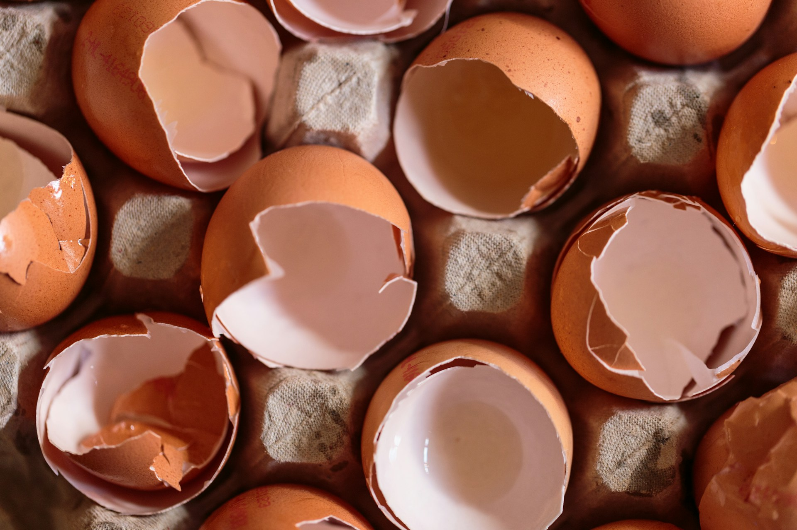
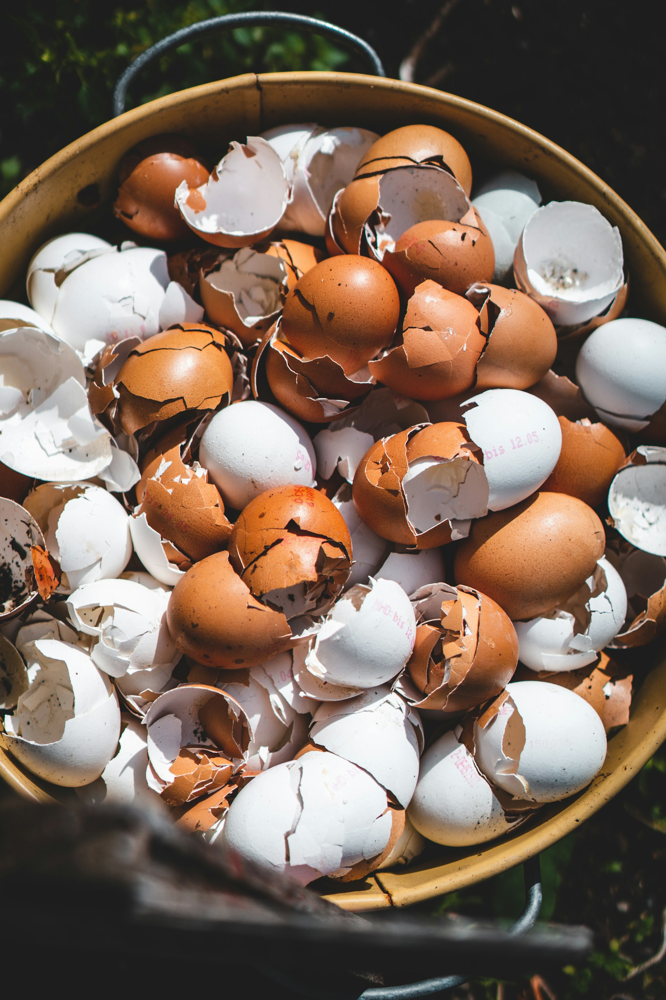
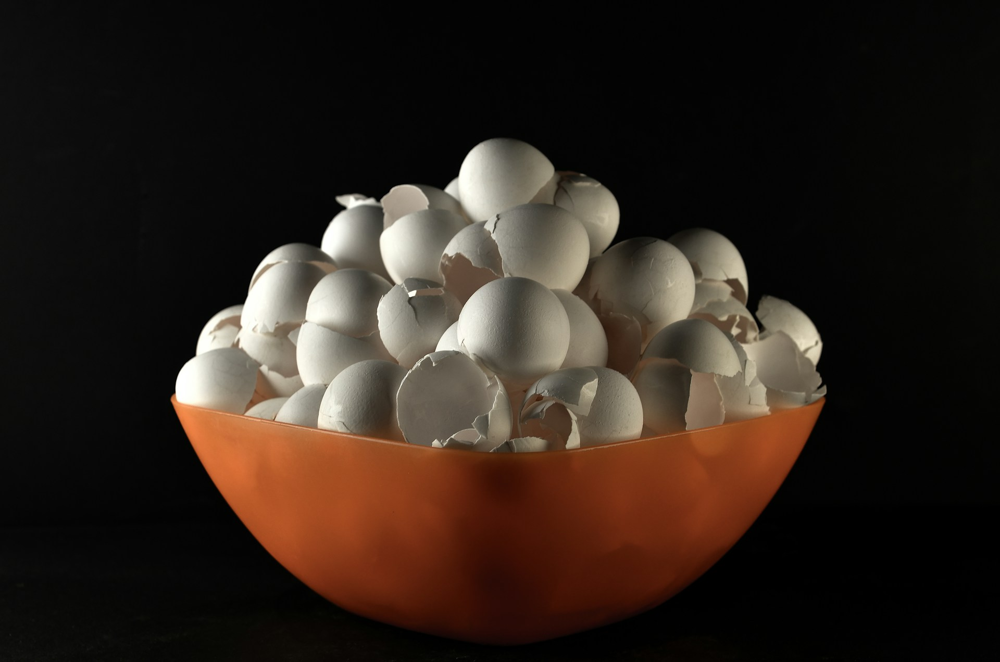
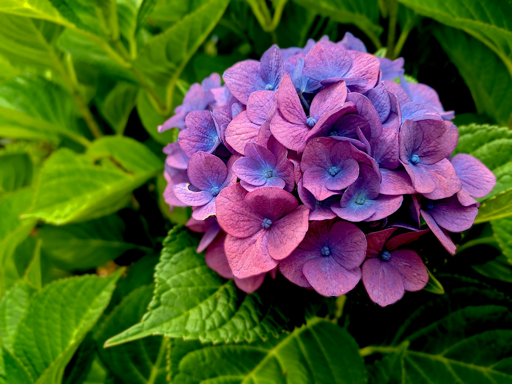

import GemeTerra2CTA from '@site/src/components/GemeTerra2CTA' 
import GemeComposterCTA from '@site/src/components/GemeComposterCTA' 
import RelatedArticles from '@site/src/components/RelatedArticles'
import ReactPlayer from 'react-player'

## Introduction: Save The Eggshells

You just made an omelet. The eggs are gone, but you're left with two empty halves staring at you from the cutting board. What do you do? If you're like most people, they go straight in the trash.

Stop right there.

Those fragile shells are actually **garden gold in disguise**. Packed with calcium and essential micronutrients, eggshells can transform your soil, boost your plants, and reduce kitchen waste. But here's the catch: **if you use them wrong, you're wasting your time**.

The question "**can you compost eggshells**?" has a simple answer: **absolutely yes**. But the how matters tremendously. Toss whole shells into your garden, and they'll sit there for years, mocking your efforts. Prepare them correctly, and you'll unlock one of the most sustainable, cost-effective soil amendments available.

And if you really want to accelerate the process? The **GEME Terra II**, the world's first AI-powered kitchen composter, can **turn your eggshells into living, biologically active compost base in just days**, not months.

In this comprehensive guide, we'll cover everything from proper preparation techniques to which plants thrive with eggshells, and critically, **what plants don't like eggshells**. By the time you finish your next dozen eggs, you'll be an eggshell expert ready to supercharge your garden.

<!-- truncate -->

## 1. Can You Compost Eggshells? The Short Answer

Yes. Full stop.

According to [the University of Florida's Institute of Food and Agricultural Sciences, **egg shells can absolutely be put into compost**, they're a great source of calcium for the soil](https://soils.ifas.ufl.edu/experiential-learning-laboratory/demonstration-areas/composting/composting-faqs/#content). The Arizona Department of Environmental Quality confirms this, listing crushed eggshells as "OK to Compost" for static composting and vermicomposting.

### Why Eggshells Belong in Compost

| **Benefit**            | **Why It Matters**                                             |
|------------------------|---------------------------------------------------------------|
| Calcium content        | [Eggshells are 93% calcium carbonate](https://alaskamastergardener.community.uaf.edu/2012/08/10/garbage-for-your-garden/)                           |
| Slow-release structure | Provides calcium steadily over time, not all at once           |
| Worm benefit           | [Worms need grit to digest food, eggshells provide it](https://www.idealhome.co.uk/garden/garden-advice/where-to-never-used-eggshells-in-the-garden)            |
| Waste reduction        | Keeps kitchen scraps out of methane-producing landfills         |
| GEME compatibility     | Perfect for microbial composting systems                        |

### The One Critical Rule

**Always wash your eggshells before composting**. Unwashed shells carry lingering odors that can attract rodents to your compost bin. A quick rinse removes egg residue that might otherwise invite unwanted visitors. **If you're using a GEME Terra II, then you don't have to worry about this**. You can just toss the eggshells in and let GEME do the rest for you.

## 2. How to Prepare Eggshells for Compost: The Right Way

Here's where most gardeners go wrong. Tossing whole eggshells into your compost or garden is like throwing a sealed bank vault into a fire and expecting cash to float out. The calcium is locked inside, and it's not going anywhere fast.

### The Science of Slow Breakdown

A study found that [**eggshells crushed by hand "were not much better than nothing at all"** when it came to releasing calcium into soil. Whole shells can take **more than a year to break down outdoors**](https://www.bhg.com/eggshells-for-plants-8780655). In compost piles, they're often ["the only raw ingredient left visible after the rest of the compost is finished"](https://www.gurneys.com/pages/ybyg-lots-of-plants-besides-tomatoes-love-eggshells-slugs-dont).

### The Grinding Solution

To make eggshells work for you, you need to grind them into a fine powder.

| **Method**           | **Effectiveness**                                 | **Effort**    | **Note**                       |
|------------------|-----------------------------------------------|-----------|------------------------------------------|
| Hand crushing    | Poor—shells remain too large                  | Minimal   | Shells may remain visible                |
| Pestle and mortar| Moderate, can achieve fine powder              | Moderate  | Good                                     |
| Coffee grinder   | Excellent, creates flour-like consistency      | Easy      | Excellent                                |
| Blender          | Excellent for bulk processing                 | Easy      | Excellent                                |
| GEME Terra II    | Complete microbial breakdown                  | Minimal   | Shells fully integrated into compost      |

[Paris Lalicata, plant expert at The Sill, explains: "Grinding the shells into a fine powder helps the calcium get into the soil and the plant faster". The study mentioned above confirmed that finely ground eggshells performed as well as pure calcium when it came to adding this nutrient to garden soil.](https://www.bhg.com/eggshells-for-plants-8780655)

### Step-by-Step Preparation Guide

1. Rinse thoroughly, remove all egg white residue

2. [Dry completely, spread on a baking sheet for 24-48 hours, or bake at 200°C for 20 minutes to make them more brittle](https://www.gartenzauber.com/en/blogs/praxis/diy-fluessigduenger-aus-eierschalen-selber-herstellen)

3. Grind to powder, use a coffee grinder, blender, or mortar and pestle

4. Store or use immediately, keep in a sealed jar until needed

5. For GEME users, add directly with other kitchen scraps; the microbes handle the rest

### The GEME Advantage: Skip the Grinding

Here's where GEME changes the game. While traditional composting demands meticulous grinding, the GEME Terra II's Kobold™ microbes are aggressive enough to break down even moderately crushed eggshells. The AI-controlled environment maintains optimal temperature, moisture, and oxygen levels, accelerating decomposition far beyond what nature can achieve alone.

Result: **You spend less time prepping and more time gardening**.

<GemeTerra2CTA 
 imgSrc="/img/geme-terra-2-composter.jpg"
 productTitle="GEME Terra II: Best Kitchen Composter"
 features={[
    "✅ Best Tool To Compost Eggshells",
    "✅ Quiet, Odour-Free, Real Compost",
    "✅ Zero Filter Costs, No Refills",
    "✅ Reduce Landfill Waste & Greenhouse Gases"
 ]}
buttonText="Get Your GEME Terra II"
  href="https://www.geme.bio/product/terra2?utm_medium=blog&utm_source=geme_website&utm_campaign=general_seo_content&utm_content=how-to-compost-eggshells-guide-geme"
/>

## 3. Eggshells for Plants: Who Loves Them

Now that you know how to compost eggshells properly, let's talk about which plants will love them.

### The Calcium-Loving All-Stars

| **Plant**                  | **Why Eggshells Help**                                        |
|----------------------------|--------------------------------------------------------------|
| Tomatoes                   | Prevents blossom end rot; enhances flavor development        |
| Peppers                    | Same blossom end rot prevention                              |
| Cucumbers                  | Makes fruits crisper—both fresh and pickled                  |
| Eggplant                   | Benefits from steady calcium supply                          |
| Roses                      | Heavy-flowering shrubs appreciate calcium                    |
| Hydrangeas (pink varieties)| Alkaline soil promotes pink blooms                           |
| Lilacs                     | Prefer alkaline soil conditions                              |
| Clematis                   | Thrives with supplemental calcium                            |
| Forsythia                  | Benefits from alkaline soil                                  |
| Boxwood                    | Suffers in acidic soil; loves wood ash and eggshells         |
| Crocus                     | Prefers alkaline conditions                                  |
| Butterfly Bush (Buddleia)  | Responds well to calcium                                     |

### The Tomato Connection

Tomatoes deserve special mention. Placing crushed eggshells in the planting hole provides two distinct benefits:

 1. **Prevents blossom end rot**: that dark, sunken spot on the bottom of tomatoes caused by calcium deficiency and uneven watering

 2. **Enhances flavor**: calcium helps develop the complex volatile oils that give heirlooms their distinctive taste

["Over the years, I've found crushed eggshells to be the perfect way to supply this calcium," notes one gardening expert. "The shells release their calcium slowly over the season, providing a nice steady supply of the nutrient".](https://www.gurneys.com/pages/ybyg-lots-of-plants-besides-tomatoes-love-eggshells-slugs-dont)

### How GEME-Processed Eggshells Supercharge Results

When eggshells go through the GEME Terra II, they emerge as part of a living, biologically active compost, not just isolated calcium. This means:

 1. Calcium is pre-digested and more plant-available

 2. Beneficial microbes accompany the calcium into your soil

 3. The compost improves soil structure, not just nutrition

## 4.What Plants Don't Like Eggshells: The Critical List

Here's where many gardeners unintentionally harm their plants. [**What plants don't like eggshells**? The answer is straightforward: **acid-loving plants (ericaceous plants)**](https://enviroliteracy.org/animals/what-plants-dont-like-eggshells/).

Eggshells are alkaline and raise soil pH. For plants that thrive in acidic conditions, this is disastrous.

### Plants That Absolutely Hate Eggshells

| **Plant**                   | **Why Eggshells Harm Them**                                          |
|-----------------------------|---------------------------------------------------------------------|
| Blueberries                 | Require acidic soil (pH 4.5-5.5); eggshells raise pH                |
| Azaleas                     | Classic ericaceous plant; needs acidic conditions                   |
| Rhododendrons               | Same family as azaleas; prefers acidic soil                         |
| Camellias                   | Beautiful flowering shrub that demands acidity                      |
| Pieris (Andromeda)          | Ericaceous plant that suffers in alkaline soil                      |
| Heathers                    | Need acidic soil to thrive                                          |
| Hydrangeas (blue varieties) | Alkaline soil turns blue blooms pink                                |
| Potatoes                    | May not respond well to increased calcium                           |
| Geraniums                   | Some sources suggest sensitivity to excess calcium                  |

### What Happens When Acid-Loving Plants Get Eggshells?

["Using eggshells around them can lead to yellowing leaves and poor growth because the plants won't be able to get the nutrients that they need from the soil," explains Julian Palphramand, head of plants at British Garden Centres](https://www.idealhome.co.uk/garden/garden-advice/where-to-never-used-eggshells-in-the-garden).

In acidic soil, essential nutrients like iron, manganese, and zinc are readily available. When pH rises due to eggshells, these nutrients become less soluble and harder for plants to access. The result is nutrient deficiency despite the nutrients being present in the soil.

### The Blue Hydrangea Warning

If you love those striking blue hydrangea blooms, never use eggshells around them. The color of bigleaf hydrangeas depends entirely on soil pH:

| **Soil pH**              | **Bloom Color** |
|--------------------------|-----------------|
| Below 6.0 (acidic)       | Blue            |
| Neutral (around 7.0)     | Purple          |
| Above 7.0 (alkaline)     | Pink            |

Adding eggshells raises pH, pushing blue hydrangeas toward pink. If you've already made this mistake, you can try to reverse it with acidifying amendments, but prevention is far easier.

## 5. Eggshells in Garden: Beyond Nutrition

Eggshells offer benefits beyond soil nutrition. Let's explore other uses for eggshells in garden settings.

### Slug and Snail Deterrent: Fact or Fiction?

The theory: Crushed eggshells create sharp edges that deter slugs and snails from crossing. Some gardeners swear by this method.

The reality: ["Studies have shown it has little to no effect," says Ashley Edwards, head gardener from Crocus](https://www.idealhome.co.uk/garden/garden-advice/where-to-never-used-eggshells-in-the-garden). Slugs are remarkably resilient creatures, and light scattering of shells won't stop determined mollusks.

If you want to try this method:

 - Use thoroughly cleaned shells (no smell)

 - Crush into small but still sharp pieces

 - Create a thick, wide ring around susceptible plants

 - Reapply after rain

 - Combine with other methods like beer traps or nematodes

### Seed Starting Pots

Eggshell halves can serve as biodegradable seed starters for small plants. However, avoid using them for fast-growing or deep-rooted vegetables like:

 - Lettuce

 - Radishes

 - Carrots

 - Beets

These plants need more root space and will become crowded quickly.

## 6. Eggshell Compost: Methods and Best Practices

Now let's dive deep into eggshell compost techniques for different composting systems, and how GEME Terra II outperforms them all.

### Traditional Outdoor Composting

| **Step**       | **Recommendation**                                         |
|----------------|-----------------------------------------------------------|
| Preparation    | [Crush or grind shells before adding](https://ask.extension.org/kb/faq.php?id=899895)                        |
| Washing        | Rinse to remove residue and prevent pests                  |
| Quantity       | No strict limit, eggshells are safe in any reasonable amount|
| Placement      | Mix into pile, don't leave on surface                      |
| Timeline       | Even crushed, expect several months for full breakdown     |

### Vermicomposting (Worm Bins)

Worms love eggshells! Here's why:

 - Shells provide grit that helps worms digest food

 - Calcium benefits the worms' health

 - Ground shells mix well into castings

[The Arizona DEQ confirms eggshells (crushed) are perfectly acceptable for vermicomposting](https://azdeq.gov/compost-guide-can-and-cant-compost). Just ensure they're ground reasonably fine.

### The GEME Terra II Advantage: Fastest Eggshell Composting

Now let's talk about the game-changer. The GEME Terra II is the world's first AI-powered kitchen composter, and it handles eggshells differently from any other method.

#### Why GEME is Superior for Eggshells

| **Feature**                        | **How It Helps with Eggshells**                                                    |
|-------------------------------------|------------------------------------------------------------------------------------|
| Microbial digestion (Kobold™)       | Live thermophilic microbes actively break down shells                              |
| AI-controlled environment           | Maintains optimal 50-60°C temperature for maximum microbial activity               |
| Continuous feed                     | Add eggshells anytime, no waiting for batch cycles                                  |
| Permanent metal-ion filter          | \$0 ongoing costs (unlike dehydrators requiring expensive filters)                  |
| Complete breakdown                  | Eggshells emerge as part of finished compost, not recognizable fragments           |
| Time to compost                     | Days, not months                                                                   |

<GemeTerra2CTA 
 imgSrc="/img/geme-terra-2-composter.jpg"
 productTitle="GEME Terra II: Best Kitchen Composter"
 features={[
    "✅ Best Tool To Compost Eggshells",
    "✅ Quiet, Odour-Free, Real Compost",
    "✅ Zero Filter Costs, No Refills",
    "✅ Reduce Landfill Waste & Greenhouse Gases"
 ]}
buttonText="Get Your GEME Terra II"
  href="https://www.geme.bio/product/terra2?utm_medium=blog&utm_source=geme_website&utm_campaign=general_seo_content&utm_content=how-to-compost-eggshells-guide-geme"
/>

#### Table: Eggshell Breakdown: Traditional vs. GEME

| **Aspect**               | **Traditional Composting**                  | **Vermicomposting**             | [**GEME Terra II**](https://www.geme.bio/product/terra2?utm_medium=blog&utm_source=geme_website&utm_campaign=general_seo_content&utm_content=how-to-compost-eggshells-guide-geme)                        |
|--------------------------|---------------------------------------------|----------------------------------|-------------------------------------------|
| **Time to breakdown**    | 6-12 months                                | 3-6 months                       | Days                                      |
| **Preparation needed**   | Fine grinding essential                     | Moderate grinding                | Minimal crushing                          |
| **Space required**       | Outdoor area needed                         | Indoor/outdoor                   | Counter or corner                         |
| **Year-round operation** | Slows in winter                             | Slows in cold                    | Works continuously                        |
| **Odor control**         | Variable                                    | Minimal                          | Permanent filter                          |
| **Output**               | Compost with visible fragments              | Castings + fragments             | Fully integrated living compost           |

Unlike dehydrators that simply dry and grind eggshells into sterile dust, [GEME's microbial system creates **living, biologically active compost**](https://www.geme.bio/kobold-introduction?utm_medium=blog&utm_source=geme_website&utm_campaign=general_seo_content&utm_content=how-to-compost-eggshells-guide-geme) where [eggshell calcium is fully integrated and plant-available](https://www.bhg.com/eggshells-for-plants-8780655).

## 7. Troubleshooting Eggshells in Compost

| **Problem**                                   | **Likely Cause**                     | **Solution**                                                            |
|--------------------------------------------|----------------------------------|---------------------------------------------------------------------|
| Whole shells visible after pile finishes   | Added without crushing           | Remove visible shells, crush, and return to new pile, or use GEME next time |
| Rodents attracted to pile                  | Unwashed shells with residue     | Always rinse before adding                                           |
| Shells not breaking down in GEME           | Pieces too large                 | Crush slightly before adding                                         |
| Mold on shells                             | Normal part of decomposition     | No action needed, mold is fine                                        |
| Slow breakdown in cold weather             | Low temperatures                 | Move pile or use indoor system like GEME                             |

## 8. Common Myths About Eggshells

### Myth 1: Eggshells Prevent Blossom End Rot in All Cases

Partially true. Eggshells provide calcium, but blossom end rot is often caused by inconsistent watering, not soil calcium deficiency. Even with abundant soil calcium, plants can't transport it to fruits if watering is erratic. Prioritize even moisture, then use eggshells as backup.

### Myth 2: Eggshells Make Soil Significantly More Acidic

False. Used eggshells are close to neutral (pH 5.5-6.8) and won't dramatically change soil pH. They're slightly alkaline, but the effect is gradual and mild.

### Myth 3: All Plants Benefit from Eggshells

False. As we've covered extensively, acid-loving plants suffer from eggshell addition. Know your plants before amending.

### Myth 4: You Can't Compost Eggshells at All

False. [Multiple authoritative sources confirm eggshells are excellent compost additions](https://soils.ifas.ufl.edu/experiential-learning-laboratory/demonstration-areas/composting/composting-faqs/#content). The key is proper preparation.

### Myth 5: Electric Composters All Handle Eggshells Equally

False. Dehydrators (like Lomi) simply dry and grind shells into dust—sterile, biologically dead material. GEME Terra II's microbial system creates living compost with fully integrated calcium.

## 9. Comparison Table—Eggshell Methods at a Glance

| **Method**                  | **Best For**                  | **Prep Needed**         | **Time to Effectiveness** | **Output Quality**                |
|-----------------------------|-------------------------------|-------------------------|---------------------------|-----------------------------------|
| Compost (traditional)       | General soil improvement      | Crush/grind             | Months                    | Variable                         |
| Direct soil incorporation   | Targeted plant feeding        | Fine powder             | Weeks to months           | Good                              |
| Vermicomposting             | Premium castings              | Moderate grind          | 3-6 months                | Excellent                         |
| Eggshell tea                | Quick liquid feeding          | Steep crushed shells    | Days                      | Moderate                          |
| Vinegar extraction          | Concentrated calcium          | 2-week fermentation     | Immediate                 | High                              |
| Dehydrator (Lomi, etc.)     | Volume reduction              | Minimal                 | Hours                     | Sterile dust                      |
| GEME Terra II               | Living compost                | Minimal crush           | Days                      | Living, biologically active       |

<GemeTerra2CTA 
 imgSrc="/img/geme-terra-2-composter.jpg"
 productTitle="GEME Terra II: Best Kitchen Composter"
 features={[
    "✅ Best Tool To Compost Eggshells",
    "✅ Quiet, Odour-Free, Real Compost",
    "✅ Zero Filter Costs, No Refills",
    "✅ Reduce Landfill Waste & Greenhouse Gases"
 ]}
buttonText="Get Your GEME Terra II"
  href="https://www.geme.bio/product/terra2?utm_medium=blog&utm_source=geme_website&utm_campaign=general_seo_content&utm_content=how-to-compost-eggshells-guide-geme"
/>

## 10. Frequently Asked Questions

### Q: Can you compost eggshells?

> A: Yes, absolutely. Eggshells are an excellent source of calcium for compost and soil. Just crush or grind them first for faster breakdown.

### Q: What plants don't like eggshells?

> A: Acid-loving plants (ericaceous plants) including blueberries, azaleas, rhododendrons, camellias, and plants grown for blue hydrangea blooms. Eggshells raise soil pH, which these plants cannot tolerate.

### Q: How long do eggshells take to break down in compost?

> A: Whole shells can take over a year. Finely ground shells break down much faster, typically within several months in an active compost pile. With [**GEME Terra II**](https://www.geme.bio/product/terra2?utm_medium=blog&utm_source=geme_website&utm_campaign=general_seo_content&utm_content=how-to-compost-eggshells-guide-geme), expect days.

### Q: Do I need to wash eggshells before composting?

> A: Partially yes. Unwashed shells can attract rodents and pests due to lingering egg residue. However, with GEME Terra II, you don't have to wash eggshells before putting them in. 

### Q: Can I put eggshells in my worm bin?

> A: Yes! Worms need grit to digest food, and ground eggshells provide this perfectly . They're listed as acceptable for vermicomposting.

### Q: Are coffee grounds and eggshells good together?

> A: They can complement each other. Coffee grounds add nitrogen and slight acidity; eggshells add calcium and slight alkalinity. The combination provides balanced nutrients for many plants. In GEME, they break down together beautifully.

### Q: Can eggshells change hydrangea color?

> A: Yes. Eggshells raise soil pH, which can turn blue hydrangeas pink. Use them deliberately if you want pink blooms.

### Q: How finely should I grind eggshells?

> A: Aim for a powdery consistency if possible. A coffee grinder or high-speed blender works best. The finer the grind, the faster the calcium becomes available. With GEME, moderate crushing suffices.

### Q: Can I use eggshells on houseplants?

> A: Proceed with caution. Most houseplants don't need extra calcium, they get enough from potting mix. If you do use them, ensure shells are finely ground and plants aren't acid-lovers.

### Q: Do eggshells deter slugs?

> A: Evidence is mixed. Some gardeners report success; studies show "little to no effect". Use as part of an integrated pest management approach, not a standalone solution.

### Q: Is GEME Terra II worth it for eggshell composting?

> A: If you compost regularly and want real, living compost without the months of waiting or the expense of ongoing filter replacements, **absolutely**. GEME turns your eggshells (and all kitchen scraps) into garden-ready compost in days, with **zero consumable costs**.

## 11. Conclusion: From Kitchen Scrap to Garden Gold with GEME

You'll never look at an eggshell the same way again.

Those fragile fragments, once destined for the landfill, are now a gateway to healthier plants, richer soil, and a more sustainable lifestyle. By mastering how to compost eggshells, and leveraging the power of GEME Terra II, you're not just reducing waste; you're participating in one of nature's most elegant cycles.

### The Golden Rules of Eggshell Composting

1. **Yes, you can compost eggshells**, and you absolutely should

2. **Grind them finely** for traditional methods; for GEME, light crushing works

3. **Wash them first** for traditional methods: prevents pest problems

4. **Know your plants**: acid-lovers (blueberries, azaleas) hate eggshells; fruiting plants (tomatoes, peppers) love them

5. **Use GEME for speed**: turn months into days

### The Environmental Impact

When you compost eggshells instead of trashing them:

 - You reduce landfill waste. Food scraps are the single most common material landfilled

 - You avoid methane emissions from anaerobic decomposition

 - You create nutrient-rich soil amendment instead of pollution

 - You close the nutrient loop: **calcium from your kitchen returns to your garden**

A dehydrator-style composter might seem convenient, but it locks you into \$100-200 in annual filter costs and produces sterile dust, not living compost. The [GEME Terra II costs \$549 upfront, but \$0 after that. Over three years, that's \$550+ saved compared to subscription-based machines](https://www.geme.bio/product/terra2?utm_medium=blog&utm_source=geme_website&utm_campaign=general_seo_content&utm_content=how-to-compost-eggshells-guide-geme). And you get real compost, not dried garbage.

Every day, millions of households send eggshells to landfills, where they contribute to methane emissions 25 times more potent than CO₂. When you compost with a microbial system like GEME, you're not just reducing waste, you're actively regenerating soil and fighting climate change.

Whether you choose a backyard bin, a worm farm, or the cutting-edge GEME Terra II, the message is clear: **your eggshells are too valuable to throw away**.

So tomorrow morning, after you've made that omelet, look at the shells in your hand. That's not waste. That's calcium. That's garden gold. That's the future of your tomatoes, your cucumbers, your roses.

Start composting your eggshells today, your plants will thank you with every bloom, every fruit, every harvest.

👉 [Learn More About GEME Terra II](https://www.geme.bio/product/terra2?utm_medium=blog&utm_source=geme_website&utm_campaign=general_seo_content&utm_content=how-to-compost-eggshells-guide-geme)

👉 [Explore GEME Pro for Big Households](https://www.geme.bio/product/geme?utm_medium=blog&utm_source=geme_website&utm_campaign=general_seo_content&utm_content=how-to-compost-eggshells-guide-geme)

<GemeTerra2CTA 
 imgSrc="/img/geme-terra-2-composter.jpg"
 productTitle="GEME Terra II: Best Kitchen Composter"
 features={[
    "✅ Best Tool To Compost Eggshells",
    "✅ Quiet, Odour-Free, Real Compost",
    "✅ Zero Filter Costs, No Refills",
    "✅ Reduce Landfill Waste & Greenhouse Gases"
 ]}
buttonText="Get Your GEME Terra II"
  href="https://www.geme.bio/product/terra2?utm_medium=blog&utm_source=geme_website&utm_campaign=general_seo_content&utm_content=how-to-compost-eggshells-guide-geme"
/>

<GemeComposterCTA 
 imgSrc="/img/geme-bio-composter.jpg"
 productTitle="GEME Pro Composter"
 features={[
    "✅ Best Tool To Compost Eggshells",
    "✅ Produce Soil-Ready Compost For Plant Growth",
    "✅ Quiet, Odor-Free, Quick(6-8 hours)",
    "✅ Large Capacity (19 L) For Daily Waste"
  ]}
buttonText="Get Your GEME Pro For Fastest Compost"
  href="https://www.geme.bio/product/geme?utm_medium=blog&utm_source=geme_website&utm_campaign=general_seo_content&utm_content=how-to-compost-eggshells-guide-geme"
/>

**Sources Cited**

1. [Better Homes & Gardens: Are Eggshells Good for Plants? An Expert Says Yes, If You Do One Thing First, February 2025](https://www.bhg.com/eggshells-for-plants-8780655)

2. [Ideal Home: 6 places in the garden to never use eggshells, it could cause more harm than good, August 2025](https://www.idealhome.co.uk/garden/garden-advice/where-to-never-used-eggshells-in-the-garden)

3. [University of Alaska Fairbanks: Garbage for Your Garden, August 2012](https://alaskamastergardener.community.uaf.edu/2012/08/10/garbage-for-your-garden/)

4. [Cooperative Extension Foundation: adding eggshells to compost pile, May 2025](https://ask.extension.org/kb/faq.php?id=899895)

5. [Arizona Department of Environmental Quality: Compost Guide | Can and Can't Compost, October 2025](https://azdeq.gov/compost-guide-can-and-cant-compost)

6. [Gurney's Seed & Nursery Co.: Lots of Plants Besides Tomatoes Love Eggshells. Slugs Don't.](https://www.gurneys.com/pages/ybyg-lots-of-plants-besides-tomatoes-love-eggshells-slugs-dont)

7. [The Environmental Literacy Council: What plants don't like eggshells? A Gardener's Guide to Calcium's Limits, April 2025](https://enviroliteracy.org/animals/what-plants-dont-like-eggshells/)

8. [Food & Home Magazine: How to use eggshells for plant growth](https://www.foodandhome.co.za/how-to/in-the-garden/how-to-use-eggshells-for-plant-growth)

9. [Gartenzauber: DIY liquid fertilizer from eggshells, April 2025](https://www.gartenzauber.com/en/blogs/praxis/diy-fluessigduenger-aus-eierschalen-selber-herstellen)

10. [University of Florida IFAS: Composting FAQs, January 2026](https://soils.ifas.ufl.edu/experiential-learning-laboratory/demonstration-areas/composting/composting-faqs/)

11. [GEME Official Blog: Best Indoor Composter for Apartments: GEME Terra 2 vs. Lomi, February 2026](https://www.geme.bio/blog/best-indoor-composter-for-apartment-geme-vs-lomi)

12. [GEME Official: How It Work](https://www.geme.bio/how-it-works?utm_medium=blog&utm_source=geme_website&utm_campaign=general_seo_content&utm_content=how-to-compost-eggshells-guide-geme)

<RelatedArticles
  slugs={[
  "how-to-compost-coffee-grounds-guide",
  "never-buy-carbon-filter-for-your-composter",
  "best-composter-fastest-real-compost-geme-terra-2",
  "how-to-compost-at-home-beginners-guide",
  "how-long-can-chicken-stay-in-the-fridge",
  "how-to-reduce-odor-indoor-composting-tips",
  "how-long-can-ground-beef-stay-in-the-fridge",
  "nyc-composting-fines-2026-geme-terra-2-best-electric-compost",
  "best-indoor-composter-for-apartment-geme-vs-lomi",
  "the-best-composter-for-kitchen",
  "how-to-reduce-food-waste-during-spring-festival",
  "does-reencle-composter-produce-real-compost",
  "does-mill-composter-really-compost",
  "how-to-reduce-food-waste-at-home-2026",
  "free-mcnugget-caviar-raises-food-waste-concerns",
  "composting-in-winter",
  "how-to-compost-at-home",
  "zero-waste-home-kitchen-composter",
  "does-lomi-composter-really-compost",
  "5-best-kitchen-composters-in-2026",
  "best-kitchen-composter-in-2026-geme-terra-2",
  "geme-vs-reencle-composter-2026",
  "geme-vs-mill-composter-2026",
  "best-kitchen-composter-2026",
  "advanced-geme-compost-application-guide",
  "electric-compost-bin-filters-costs-comparison",
  "geme-vs-lomi", 
  "geme-terra-2-debuts",
  "the-best-composter-to-reduce-food-waste",
  "compost-pile-vs-electric-composter",
  "how-to-make-bananas-last-longer",
  "how-long-do-apples-last-in-the-fridge",
  "can-i-compost-moldy-grapes",
  "can-you-compost-moldy-bread",
  ]}
/>

_Ready to transform your gardening game? Subscribe to our [newsletter](http://geme.bio/signup?utm_medium=blog&utm_source=geme_website&utm_campaign=general_seo_content&utm_content=how-to-compost-at-home-beginners-guide) for expert composting tips and sustainable gardening advice._

