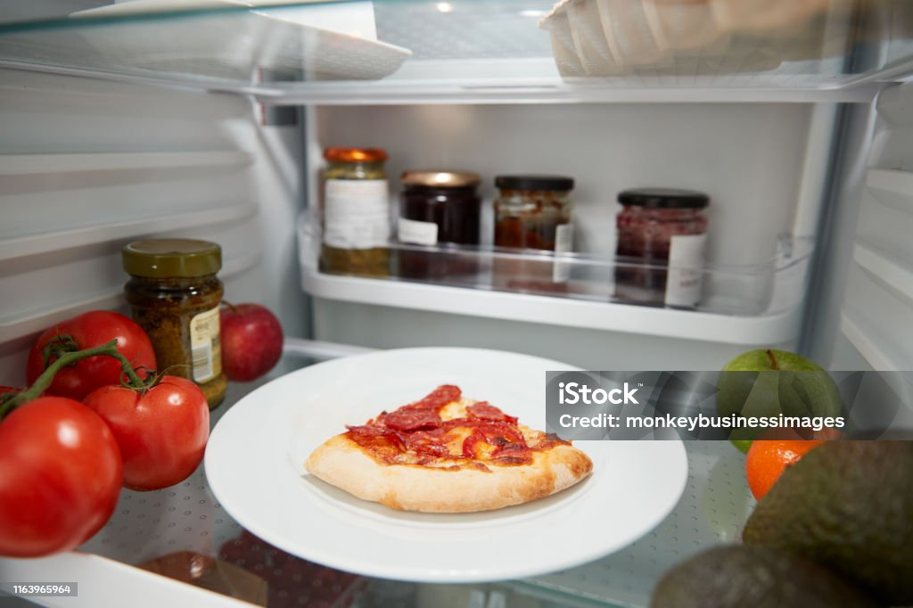
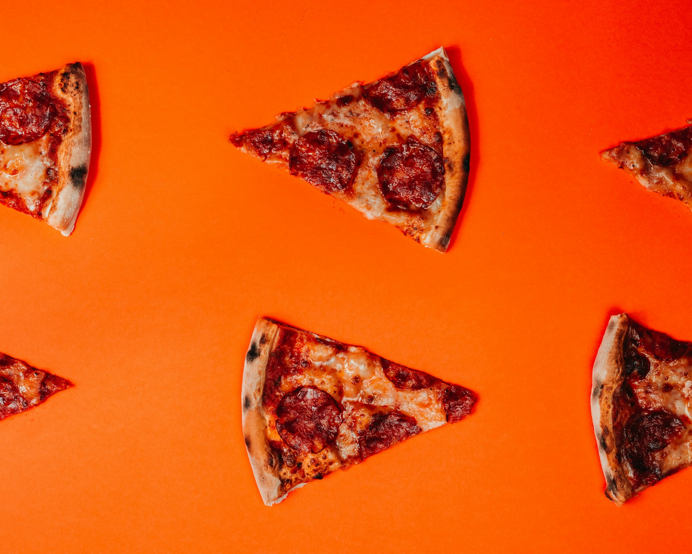

import GemeTerra2CTA from '@site/src/components/GemeTerra2CTA' 
import GemeComposterCTA from '@site/src/components/GemeComposterCTA' 
import RelatedArticles from '@site/src/components/RelatedArticles'
import ReactPlayer from 'react-player'

## Introduction: The Midnight Pizza

It's 2 a.m. You stumble to the fridge, pull open the door, and there it is—a cardboard box from three nights ago holding two glorious slices of pepperoni perfection. Your stomach growls. Your brain hesitates.

*Is this still safe? How long has this been here? Was that Tuesday or Wednesday?*

You're not alone. According to food safety experts, this scenario plays out in millions of kitchens daily. Pizza is America's most beloved leftover, but it's also one of the most confusing when it comes to storage timelines. One wrong guess, and you're either wasting perfectly good food or risking a date with food poisoning.

Here's the cold, hard truth: [**leftover pizza lasts 3 to 4 days in the refrigerator when stored properly**](https://safeorexpired.com/dishes/how-long-does-pizza-last-in-the-fridge/). But that's just the beginning of the story. The type of toppings, how quickly it was refrigerated, and your storage method all affect that countdown clock.

### Pizza Storage at a Glance: Quick Reference Table

Question	Answer
| **Question**                             | **Answer**                                 |
|------------------------------------------|--------------------------------------------|
| How long is pizza good for in the fridge?| 3–4 days                                   |
| How long can pizza sit out?              | Max 2 hours (1 hour if above 90°F)         |
| Best storage method?                     | Airtight container in back of fridge       |
| Can I store pizza in the box?            | No, cardboard traps moisture and odors      |
| Signs of spoilage?                       | Mold, slime, sour smell, discoloration     |
| Best reheating method?                   | Oven at 375°F for 8–10 minutes             |
| Can I freeze pizza?                      | Yes, up to 2 months                        |
| **What to do with spoiled pizza**?           | [**Compost it with GEME Terra 2**](https://www.geme.bio/product/terra2?utm_medium=blog&utm_source=geme_website&utm_campaign=general_seo_content&utm_content=how-long-does-pizza-last-in-fridge-guide)               |

In this comprehensive guide, we'll answer every variation of "how long is pizza good for in the fridge" you can think of. We'll cover storage hacks, spoilage signs, and the best reheating methods. And for those inevitable times when you forget about that box until day 7? We'll introduce you to the GEME Terra 2, the world's first AI-powered kitchen composter that turns your wasted slices into living compost for your plants.

Let's settle the leftover pizza debate once and for all.

<!-- truncate -->

## 1. How Long Is Pizza Good For In The Fridge? The Definitive Answer

Let's cut straight to the answer everyone's looking for.

### The 3-to-4-Day Rule

According to the USDA and multiple food safety experts, [**leftover pizza is safe to eat for 3 to 4 days when stored in the refrigerator at 40°F (4°C) or below**](https://www.eatingwell.com/article/8067852/is-it-safe-to-eat-pizza-thats-been-left-out-overnight/).

This applies to:

 - Delivery pizza from any chain

 - Homemade pizza

 - Leftover frozen pizza that's been cooked

 - All crust types and topping combinations

The clock starts ticking the moment the pizza finishes cooking, not when you put it in the fridge. [If your pizza sat on the counter for hours while you finished that movie marathon, that time counts against its shelf life](https://foodwander.com/how-long-does-pizza-last-in-the-fridge/).

### The Two-Hour Window That Changes Everything

Here's the rule that separates safe pizza from risky pizza: [**Perishable foods must be refrigerated within 2 hours of cooking or receiving**](https://www.foodfanatic.com/cooking/faqs/how-long-is-pizza-good-for-in-the-fridge/).

If the temperature is above 90°F (like a hot summer day or a stuffy apartment), that window shrinks to just 1 hour.

Why? Because [between 40°F and 140°F lies what food safety experts call the "**Danger Zone**", temperatures where bacteria multiply rapidly, doubling in as little as 20 minutes](https://www.eatingwell.com/article/8067852/is-it-safe-to-eat-pizza-thats-been-left-out-overnight/).

| **Scenario**                      | **Safe Window** | **What Happens After**                     |
|-------------------------------|-------------|----------------------------------------|
| Room temperature (below 90°F) | 2 hours     | Bacteria begin exponential growth      |
| Hot day (above 90°F)          | 1 hour      | Spoilage accelerates dramatically      |
| Left out overnight            | 0 hours     | Toss it immediately, unsafe             |

### The "But I've Done It Before" Defense

I know what you're thinking. "*I've eaten pizza left out overnight and I'm fine*."

You probably got lucky. As the experts at EatingWell explain, "While many individuals may choose to indulge in pizza that's been sitting out overnight and not get sick, it does not mean it's not there and can put you at risk for foodborne illnesses". [**Some pathogens don't change the smell or appearance of food, so you can't rely on your senses alone**](https://safeorexpired.com/dishes/how-long-does-pizza-last-in-the-fridge/).

The bottom line: **if it sat out overnight, toss it**. Your stomach will thank you.

## 2. How Long Do Pizzas Last In The Fridge By Type and Toppings?

Not all pizzas are created equal when it comes to refrigerator longevity. Here's your topping-by-topping breakdown.

### Table: Pizza Shelf Life by Type

| **Pizza Type**                      | **Safe Fridge Life** | **Why It Matters**                                  |
|-------------------------------------|---------------------|-----------------------------------------------------|
| Plain Cheese                        | 3–4 days            | Lower moisture, fewer variables                     |
| Pepperoni/Sausage                   | 1–2 days            | Processed meats spoil faster once cooked            |
| Chicken                             | 1–2 days            | Poultry is sensitive to Salmonella                  |
| Vegetable (mushrooms, onions, peppers)| 2–3 days          | High moisture can speed spoilage                    |
| Seafood (shrimp, anchovies)         | 1 day               | Extremely perishable, eat within 24 hours           |
| Vegan/Dairy-Free                    | Up to 5 days        | No animal products = less spoilage risk             |

### Why Toppings Change the Timeline

The toppings you choose don't just affect flavor, they directly impact how long your pizza stays safe. Meat toppings are high in protein and fat, which bacteria love. As one expert explains, "Meat toppings spoil faster due to their high fat and protein content".

Vegetable pizzas might last slightly longer, but they come with their own challenges. "Toppings like raw mushrooms or fresh spinach may cause pizza to spoil faster than it would with just cheese," notes a food safety guide. "They release water, promoting mold and bacterial growth".

Even cheese itself has limits. ["**Cheese is very susceptible to bacterial growth because of its moisture content and protein**," warns The Takeout](https://www.thetakeout.com/1782052/how-long-leftover-pizza-good-for/). So even your basic cheese slice follows the 3-to-4-day rule.

### The Crust Factor

While crust type doesn't significantly affect safety, it does impact quality:

 - **Thin crust**: Dries out faster, may become stale by day 3

 - **Thick/pan crust**: Retains moisture longer but can become soggy

<GemeTerra2CTA 
 imgSrc="/img/geme-terra-2-composter.jpg"
 productTitle="GEME Terra II: Best Kitchen Composter"
 features={[
    "✅ Best Tool To Compost Leftover Pizzas",
    "✅ Quiet, Odour-Free, Real Compost",
    "✅ Zero Filter Costs, No Refills",
    "✅ Reduce Landfill Waste & Greenhouse Gases"
 ]}
buttonText="Get Your GEME Terra II"
  href="https://www.geme.bio/product/terra2?utm_medium=blog&utm_source=geme_website&utm_campaign=general_seo_content&utm_content=how-long-does-pizza-last-in-fridge-guide"
/>

## 3. How Long Is Leftover Pizza Good For? The Day-by-Day Breakdown

Let's walk through what happens to your pizza over time in the fridge.

### Table: Leftover Pizza Quality Timeline

| **Day**     | **Safety Status**    | **Quality Notes**                                |
|-------------|---------------------|--------------------------------------------------|
| Day 1–2     | Perfectly safe      | Tastes almost as good as fresh                   |
| Day 3       | Still safe          | Crust may harden slightly; toppings lose flavor  |
| Day 4       | Last safe day       | Quality declining but still edible if stored properly |
| Day 5       | Not recommended     | Bacteria risk increases significantly            |
| Day 6+      | Unsafe              | Toss immediately, even if it looks fine          |

### The Fifth-Day Gamble

"Can I eat 5-day-old pizza?" is one of the most Googled food safety questions. Here's the straight answer from the experts:

**Eating pizza after 5 days in the fridge is generally not recommended**. Even if it looks okay and smells okay, bacteria like Listeria monocytogenes and Staphylococcus aureus can thrive in cooked food that's been stored too long—and they don't always come with obvious warning signs.

The USDA is clear: [**perishable leftovers should be discarded after 3 to 4 days, regardless of appearance**](https://safeorexpired.com/dishes/how-long-does-pizza-last-in-the-fridge/).

## 4. How to Store Pizza in the Fridge (Without Ruining It)

Proper storage can mean the difference between a delicious day-4 slice and a sad, soggy disappointment.

### The Golden Rules of Pizza Storage

#### Rule 1: Ditch the Cardboard Box

The pizza box belongs in recycling, not your refrigerator. Cardboard doesn't seal, lets air and moisture in, and turns your crust into a cold, chewy sponge while perfuming your fridge with oregano for days.

#### Rule 2: Cool First, Then Refrigerate

**Let pizza cool for 15–30 minutes before refrigerating**. Hot pizza will trap moisture, making the crust mushy.

#### Rule 3: Airtight Is Non-Negotiable

| **Storage Method**         | **Fridge Life** | **Crust Quality** | **Protection Level**                      |
|---------------------------|-----------------|-------------------|-------------------------------------------|
| Airtight container        | 3–4 days        | Excellent         | High                                      |
| Plastic wrap + foil       | 2–3 days        | Good              | Moderate                                  |
| Left in cardboard box     | 1–2 days        | Poor              | Low—absorbs moisture and odors            |

#### Rule 4: Stack Smart

**Layer slices between sheets of parchment paper to prevent sticking**. This also makes it easy to grab just what you need.

#### Rule 5: Store in the Back

**Keep pizza on a middle or bottom shelf, not the door**. The back of the fridge is more temperature-stable.

## 5. How to Tell When Pizza Has Gone Bad

Your senses are powerful tools for detecting spoiled pizza. Here's what to look for.

### Table: Signs Your Pizza Is No Longer Safe

| **Sign**                    | **What It Means**                                 | **Safe?**  |
|-----------------------------|---------------------------------------------------|------------|
| Sour or "off" smell         | Bacterial growth or rancid oils                   | ❌ No      |
| Slimy or sticky toppings    | Moisture from spoilage, bacteria likely present   | ❌ No      |
| Mold (white, green, black)  | Spore contamination, spreads quickly              | ❌ No      |
| Discoloration of cheese     | Oxidation or fat breakdown                        | ❌ No      |
| Hard-as-rock crust          | Dehydration only, safe but stale                  | ✅ Yes     |

### The Mold Rule

**If even one slice has visible mold, toss the whole batch**. Mold can spread invisibly between slices. It's not worth the risk.

### The Smell Test

["Fresh pizza should smell like a blend of cheese, herbs, and toppings," notes one storage guide. "**If these normal smells change, sour, rancid, fermented, or putrid, your pizza is most likely spoiled**"](https://glowenoven.com/blogs/news/how-long-can-a-pizza-last-in-the-fridge).

## 6. Can You Save That Slice? Reheating Safety and Techniques

If your pizza passed the safety check, proper reheating brings it back to life.

### The Safety Threshold

USDA guidelines require reheating leftovers to an internal temperature of 165°F to kill any lurking bacteria.

### Table: Best Reheating Methods Compared

| **Method**         | **Temperature** | **Time**      | **Result**                      | **Pros/Cons**                         |
|--------------------|-----------------|--------------|----------------------------------|---------------------------------------|
| Oven               | 375°F           | 8–10 mins    | Crispy crust, evenly heated      | Takes longer but worth it             |
| Skillet (covered)  | Medium heat     | 6–8 mins     | Great texture, good cheese melt  | One slice at a time                   |
| Air Fryer          | 350°F           | 3–5 mins     | Crispy + fast                    | Watch closely to avoid burning        |
| Microwave          | High            | 40–60 secs   | Fast and easy                    | Soggy crust, uneven heat              |

### Microwave Hack

If you must use the microwave, place a small cup of water next to the pizza while reheating. This helps prevent the crust from becoming rubbery.

## 7. The Environmental Truth: What Happens to Wasted Pizza

Now let's talk about what happens when you miss the window. When that forgotten pizza box emerges from the fridge on day 7, covered in mold and smelling like regret, where does it go?

### The Landfill Problem

If you toss that spoiled pizza in the trash, it ends up in a landfill. There, buried under tons of other waste and deprived of oxygen, it decomposes anaerobically, and releases methane, a greenhouse gas 25 times more potent than carbon dioxide.

Food waste is the single most common material landfilled in the United States, representing 24% of landfilled municipal solid waste. That cold slice you forgot about? It's actively contributing to climate change.

### The Compost Solution

When you compost food waste instead, the process is aerobic (with oxygen). No methane. Instead, you get nutrient-rich soil amendment that can grow more food, closing the loop completely.

This is where the GEME Terra 2 enters the picture.

<GemeTerra2CTA 
 imgSrc="/img/geme-terra-2-composter.jpg"
 productTitle="GEME Terra II: Best Kitchen Composter"
 features={[
    "✅ Best Tool To Compost Leftover Pizzas",
    "✅ Quiet, Odour-Free, Real Compost",
    "✅ Zero Filter Costs, No Refills",
    "✅ Reduce Landfill Waste & Greenhouse Gases"
 ]}
buttonText="Get Your GEME Terra II"
  href="https://www.geme.bio/product/terra2?utm_medium=blog&utm_source=geme_website&utm_campaign=general_seo_content&utm_content=how-long-does-pizza-last-in-fridge-guide"
/>

## 8. GEME Terra 2: Turning Pizza Waste Into Garden Gold

Meet the GEME Terra 2, the world's first AI-powered kitchen composter and the perfect solution for those inevitable times when pizza outlasts your appetite.

### How It Works

Unlike dehydrators that simply dry and grind food into sterile dust, [**GEME uses a proprietary blend of microorganisms ("Kobold") that actually eat your food waste**](https://www.geme.bio/how-it-works?utm_medium=blog&utm_source=geme_website&utm_campaign=general_seo_content&utm_content=how-long-does-pizza-last-in-fridge-guide).

| **Feature**                  | **How It Handles Your Spoiled Pizza**                                        |
|------------------------------|------------------------------------------------------------------------------|
| [**Microbial digestion**](https://www.geme.bio/kobold-introduction?utm_medium=blog&utm_source=geme_website&utm_campaign=general_seo_content&utm_content=how-long-does-pizza-last-in-fridge-guide)          | Live microbes break down cheese, crust, and meat toppings                    |
| **AI-controlled environment**    | Maintains optimal 45–55°C temperature for maximum microbial activity         |
| **Continuous feed**              | Add moldy slices anytime, no waiting for batch cycles                         |
| **Permanent metal-ion filter**   | \$0 ongoing costs—no expensive replacements                                   |
| Time to compost              | [**6–8 hours from scraps to living soil**](https://wtop.com/tech/2025/01/geme-zero-waste-smart-composter-reduces-compost-production-time-from-months-to-hours/)                                         |

### Why GEME Beats Dehydrators

Most "composters" on the market (like Lomi) are actually high-speed dehydrators. They grind and bake your food into sterile dust. As Wired bluntly put it, Lomi is "a grinder-and-dryer". The output isn't compost; it's dried garbage.

GEME produces real, living compost base that's ready to use on your plants. Mix it 1:8 with soil, and your plants get an immediate nutrient boost.

### Table: GEME Terra 2 vs. Traditional Disposal

| **Method**          | **Time to Process** | **Environmental Impact** | **End Result**         |
|---------------------|--------------------|-------------------------|------------------------|
| Trash (landfill)    | Instant            | Methane emissions       | Pollution              |
| Backyard compost    | 6–12 months        | Neutral                 | Compost (if done right)|
| Dehydrator (Lomi)   | 3–20 hours         | Lower emissions         | Sterile dust           |
| GEME Terra 2        | 6–8 hours          | Zero methane            | Living compost         |

### The Cost of Ownership Reality

Here's where GEME saves you money while saving the planet.

| **Cost Category**              | **Lomi (3-Year)** | **GEME Terra 2 (3-Year)** |
|-------------------------------|-------------------|---------------------------|
| Machine Cost                  | \$499              | \$549                      |
| Consumables (Filters/Pods)    | ~\$600             | \$0                        |
| Total 3-Year Investment       | \$1,099            | \$549                      |

You pay \$50 more upfront for GEME, but you save \$550 over three years, and you get real compost instead of sterile dust.

## 9. The Five-Day Pizza Problem: A GEME Success Story

Let's walk through a real scenario.

It's Friday. You open your fridge and find a pizza box from last Sunday. That's day 5. The cheese looks a little dry, there's a suspicious spot on one pepperoni, and honestly, you don't trust it.

 - **Option A**: Toss it in the trash. It goes to landfill, generates methane, and you've wasted money and food.

 - **Option B** : Toss it in your GEME Terra 2.

Here's what happens:

 1. You open the lid and drop in the moldy slices: crust, cheese, pepperoni, and all

 2. The Kobold microbes get to work immediately

 3. GEME's AI sensors maintain perfect conditions for digestion

 4. In 6–8 hours, that pizza is transformed into rich, earthy compost base

 5. A few weeks later, you harvest the compost and feed it to your tomato plants

That pizza you forgot? It just helped grow new food. That's a circular economy .

<GemeTerra2CTA 
 imgSrc="/img/geme-terra-2-composter.jpg"
 productTitle="GEME Terra II: Best Kitchen Composter"
 features={[
    "✅ Best Tool To Compost Leftover Pizzas",
    "✅ Quiet, Odour-Free, Real Compost",
    "✅ Zero Filter Costs, No Refills",
    "✅ Reduce Landfill Waste & Greenhouse Gases"
 ]}
buttonText="Get Your GEME Terra II"
  href="https://www.geme.bio/product/terra2?utm_medium=blog&utm_source=geme_website&utm_campaign=general_seo_content&utm_content=how-long-does-pizza-last-in-fridge-guide"
/>

## 10. Frequently Asked Questions

### Q: How long is pizza good for in the fridge?

> A: 3 to 4 days maximum when stored properly in an airtight container at 40°F or below.

### Q: How long do pizzas last in the fridge with meat toppings?

> A: Meat-topped pizzas should be eaten within 1 to 2 days for best quality and safety.

### Q: Can I eat pizza that's been in the fridge for 5 days?

> A: **Not recommended**. Even if it looks fine, bacteria may have grown. The USDA advises discarding leftovers after 3–4 days.

### Q: How long is leftover pizza good for if it was left out overnight?

> A: Zero days. If pizza sat out for more than 2 hours, toss it immediately. 

### Q: Is it safe to eat cold pizza from the fridge?

> A: Yes, within the 3–4 day window. Cold pizza is safe and delicious as long as it was properly stored.

### Q: How can I tell if pizza has gone bad?

> A: Look for mold, slimy toppings, sour smell, or discoloration. [**If in doubt, throw it in your GEME Terra II and compost it**](https://www.geme.bio/product/terra2?utm_medium=blog&utm_source=geme_website&utm_campaign=general_seo_content&utm_content=how-long-does-pizza-last-in-fridge-guide).

### Q: Can I freeze leftover pizza instead?

> A: Absolutely. Frozen pizza lasts 1–2 months. Wrap slices individually in plastic wrap and foil, then place in freezer bags.

### Q: What's the best way to reheat pizza?

> A: Oven at 375°F for 8–10 minutes or skillet on medium heat for 6–8 minutes. Both give you crispy crust and melted cheese.

### Q: Can GEME Terra 2 handle pizza with meat and cheese?

> A: Yes. GEME's Kobold microbes digest meat, dairy, and small bones effectively.

### Q: Does GEME require expensive filters?

> A: No. GEME uses a permanent metal-ion filter that lasts the machine's lifetime. Zero ongoing filter costs.

## 11. Conclusion: Know Your Limits, Love Your Leftovers, Save the Planet

Let's recap the essential takeaways.

### The Golden Rules of Pizza Storage

 1. Refrigerate within 2 hours of cooking or delivery 

 2. Store in airtight containers, not cardboard boxes 

 3. Eat within 3–4 days for safety 

 4. Check for spoilage before eating: mold, smell, slime 

 5. Freeze if you can't eat in time, good for 1–2 months 

### When Pizza Goes Bad, Don't Let It Go to Waste

Even with the best intentions, pizza sometimes outlasts our appetites. When that happens, you have a choice.

You can send it to a landfill, where it generates methane and contributes to climate change.

Or you can feed it to a [**GEME Terra 2** and **turn it into living compost that grows more food**](https://www.geme.bio/product/terra2?utm_medium=blog&utm_source=geme_website&utm_campaign=general_seo_content&utm_content=how-long-does-pizza-last-in-fridge-guide).

A dehydrator-style composter might seem convenient, but it locks you into \$100–200 in annual filter costs and produces sterile dust, not real compost. The GEME Terra 2 costs \$549 upfront, but \$0 after that. Over three years, that's \$550+ saved compared to subscription-based machines.

Every pound of food waste you compost instead of landfilling eliminates methane emissions 25 times more potent than CO₂. When you use a microbial system like GEME, you're not just reducing waste, you're actively regenerating soil and fighting climate change.

Now you know exactly how long pizza lasts in the fridge. You know the signs of spoilage, the best storage methods, and the safest reheating techniques.

But most importantly, you know what to do when that pizza inevitably outlasts its welcome.

**Don't trash it. Don't feel guilty. Compost it with GEME and grow something beautiful**.

👉 [Learn More About GEME Terra II](https://www.geme.bio/product/terra2?utm_medium=blog&utm_source=geme_website&utm_campaign=general_seo_content&utm_content=how-long-does-pizza-last-in-fridge-guide)

👉 [Explore GEME Pro for Big Households](https://www.geme.bio/product/geme?utm_medium=blog&utm_source=geme_website&utm_campaign=general_seo_content&utm_content=how-long-does-pizza-last-in-fridge-guide)

<GemeTerra2CTA 
 imgSrc="/img/geme-terra-2-composter.jpg"
 productTitle="GEME Terra II: Best Kitchen Composter"
 features={[
    "✅ Best Tool To Compost Spoiled Pizzas",
    "✅ Quiet, Odour-Free, Real Compost",
    "✅ Zero Filter Costs, No Refills",
    "✅ Reduce Landfill Waste & Greenhouse Gases"
 ]}
buttonText="Get Your GEME Terra II"
  href="https://www.geme.bio/product/terra2?utm_medium=blog&utm_source=geme_website&utm_campaign=general_seo_content&utm_content=how-long-does-pizza-last-in-fridge-guide"
/>

<GemeComposterCTA 
 imgSrc="/img/geme-bio-composter.jpg"
 productTitle="GEME Pro Composter"
 features={[
    "✅ Best Tool To Compost Spoiled Pizzas",
    "✅ Produce Soil-Ready Compost For Plant Growth",
    "✅ Quiet, Odor-Free, Quick(6-8 hours)",
    "✅ Large Capacity (19 L) For Daily Waste"
  ]}
buttonText="Get Your GEME Pro For Fastest Compost"
  href="https://www.geme.bio/product/geme?utm_medium=blog&utm_source=geme_website&utm_campaign=general_seo_content&utm_content=how-long-does-pizza-last-in-fridge-guide"
/>

**Sources Cited**

1. [Food Fanatic: How Long is Pizza Good for In the Fridge?, July 2020](https://www.foodfanatic.com/cooking/faqs/how-long-is-pizza-good-for-in-the-fridge/)

2. [Safeorexpired: How Long Does Pizza Last In The Fridge? (By Type & Toppings), December 2025](https://safeorexpired.com/dishes/how-long-does-pizza-last-in-the-fridge/)

3. [The Takeout: How Long Is Leftover Pizza Really Good For?](https://www.thetakeout.com/1782052/how-long-leftover-pizza-good-for/)

4. [GEME Official Blog: Best Indoor Composter for Apartments: GEME Terra 2 vs. Lomi, February 2026](https://www.geme.bio/blog/best-indoor-composter-for-apartment-geme-vs-lomi)

5. [Food Wander: How Long Does Pizza Last in the Fridge?](https://foodwander.com/how-long-does-pizza-last-in-the-fridge/)

6. [EatingWell: Is It Safe to Eat Pizza That's Been Left Out Overnight?](https://www.eatingwell.com/article/8067852/is-it-safe-to-eat-pizza-thats-been-left-out-overnight/)

7. [WTOP News: GEME Zero Waste Smart Composter reduces compost production time from months to hours, January 2025](https://wtop.com/tech/2025/01/geme-zero-waste-smart-composter-reduces-compost-production-time-from-months-to-hours/)

8. [Glowen: How Long Can a Pizza Last in the Fridge?](https://glowenoven.com/blogs/news/how-long-can-a-pizza-last-in-the-fridge)

9. [Quorixhub: How Long Does Pizza Last In The Fridge?, September 2025](https://quorixhub.com/pizza-guides/how-long-does-pizza-last-in-the-fridge/)

10. [GEME Official Blog: GEME Terra 2 vs Mill Composter: The 2026 Decision Guide, January 2026](https://www.geme.bio/blog/geme-vs-mill-composter-2026/)

<RelatedArticles
  slugs={[
  "how-to-compost-eggshells-guide-geme",
  "how-to-compost-coffee-grounds-guide",
  "never-buy-carbon-filter-for-your-composter",
  "best-composter-fastest-real-compost-geme-terra-2",
  "how-to-compost-at-home-beginners-guide",
  "how-long-can-chicken-stay-in-the-fridge",
  "how-to-reduce-odor-indoor-composting-tips",
  "how-long-can-ground-beef-stay-in-the-fridge",
  "nyc-composting-fines-2026-geme-terra-2-best-electric-compost",
  "best-indoor-composter-for-apartment-geme-vs-lomi",
  "the-best-composter-for-kitchen",
  "how-to-reduce-food-waste-during-spring-festival",
  "does-reencle-composter-produce-real-compost",
  "does-mill-composter-really-compost",
  "how-to-reduce-food-waste-at-home-2026",
  "free-mcnugget-caviar-raises-food-waste-concerns",
  "composting-in-winter",
  "how-to-compost-at-home",
  "zero-waste-home-kitchen-composter",
  "does-lomi-composter-really-compost",
  "5-best-kitchen-composters-in-2026",
  "best-kitchen-composter-in-2026-geme-terra-2",
  "geme-vs-reencle-composter-2026",
  "geme-vs-mill-composter-2026",
  "best-kitchen-composter-2026",
  "advanced-geme-compost-application-guide",
  "electric-compost-bin-filters-costs-comparison",
  "geme-vs-lomi", 
  "geme-terra-2-debuts",
  "the-best-composter-to-reduce-food-waste",
  "compost-pile-vs-electric-composter",
  "how-to-make-bananas-last-longer",
  "how-long-do-apples-last-in-the-fridge",
  "can-i-compost-moldy-grapes",
  "can-you-compost-moldy-bread",
  ]}
/>

_Ready to transform your gardening game? Subscribe to our [newsletter](http://geme.bio/signup?utm_medium=blog&utm_source=geme_website&utm_campaign=general_seo_content&utm_content=how-to-compost-at-home-beginners-guide) for expert composting tips and sustainable gardening advice._

