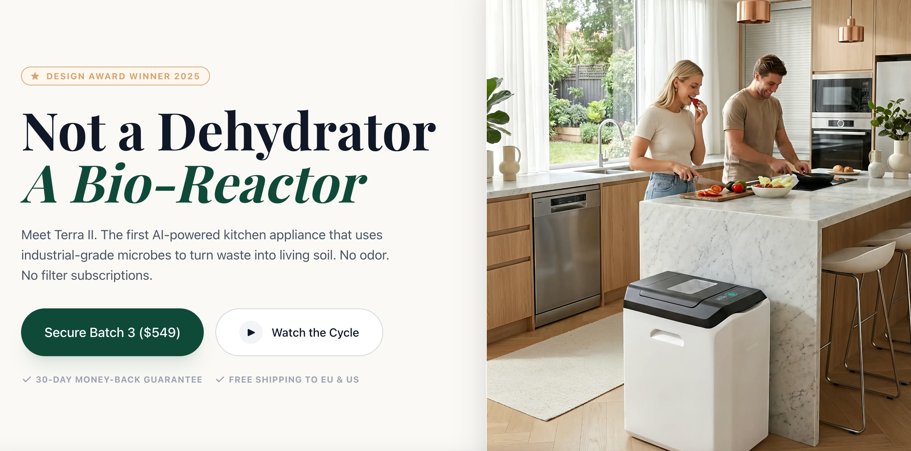
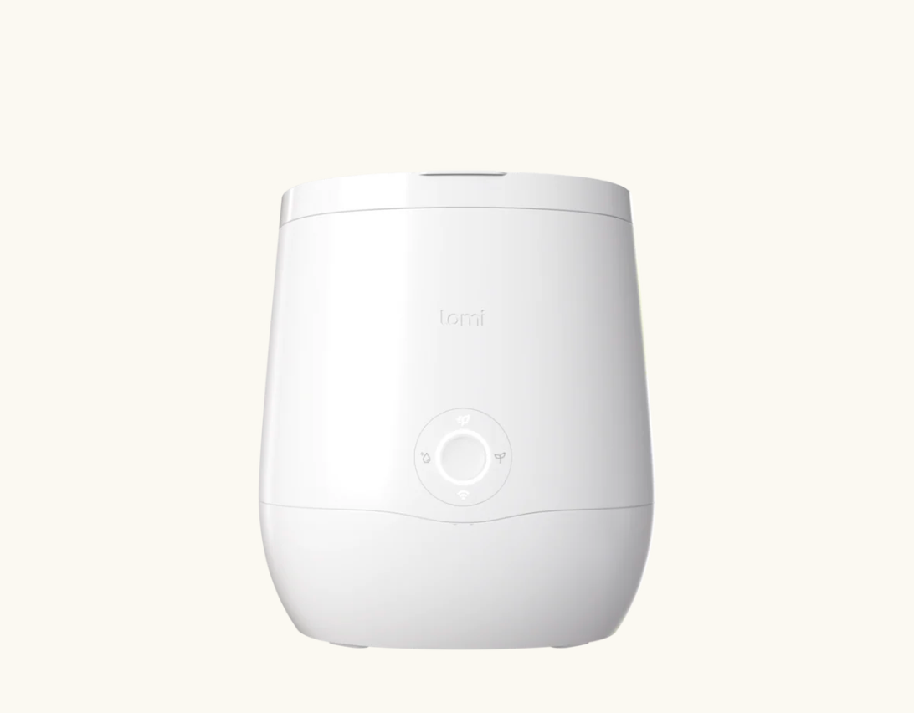
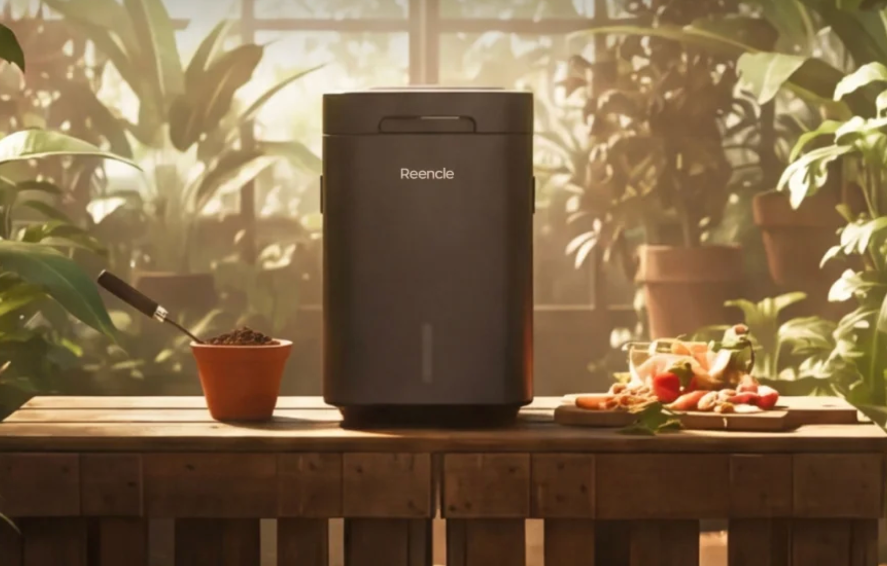
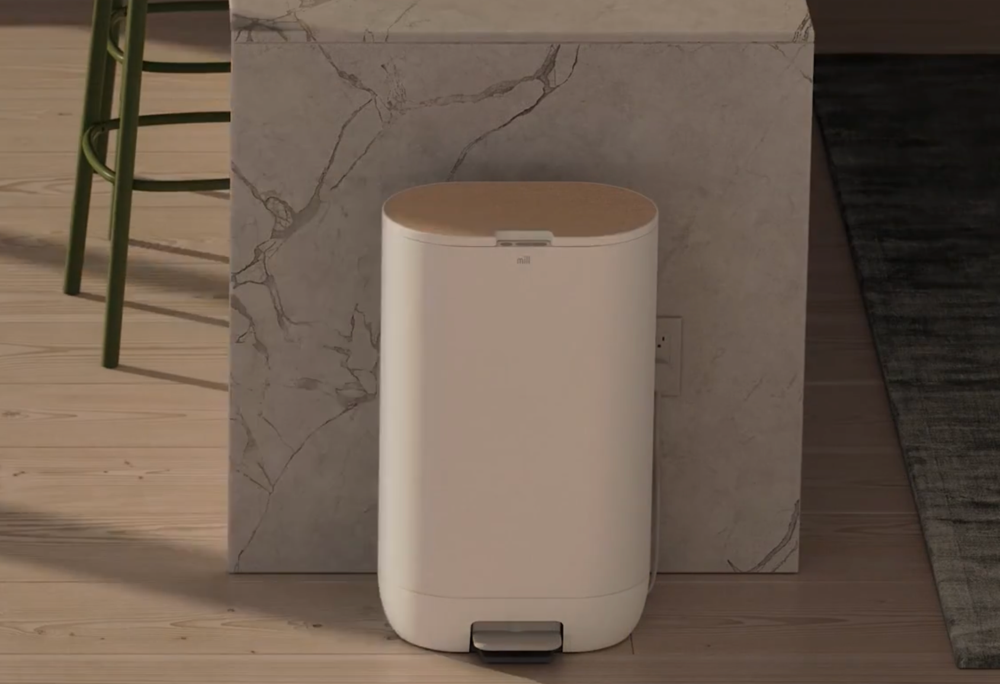

import GemeTerra2CTA from '@site/src/components/GemeTerra2CTA' 
import GemeComposterCTA from '@site/src/components/GemeComposterCTA' 
import RelatedArticles from '@site/src/components/RelatedArticles'
import ReactPlayer from 'react-player'

## Introduction: The Morning After Four Kitchens, Four Experiences

Picture this: It's 8 a.m. on a Tuesday.

Kitchen A: A **Lomi** owner wakes up to a countertop machine that finished its 5-hour cycle overnight. They open the lid to find fine, dry granules what Lomi calls "Lomi Earth." It looks like dirt, but they know it's not quite compost. They'll store it in a container until they can drop it off at a community garden.

Kitchen B: A **Mill** owner hears the soft whir of their floor-standing unit doing its morning grind. Last night's chicken bones, stale bread, and veggie peels have been transformed into dry "Food Grounds." They scoop some into a jar for the backyard compost pile; the rest will be bagged for Mill's mail-back service (**\$192/year**).

Kitchen C: A **Reencle** user waves a hand to open the lid and adds coffee grounds to the warm, earthy-smelling medium inside. The microbes are already at work, and they know that in 24 hours, most of what they added will be broken down into something resembling real soil. They make a mental note: **the carbon filter and mesh filter will need replacing in about 9–12 months, at a cost of roughly \$47 combined**.

Kitchen D: A [**GEME Terra 2**](https://www.geme.bio/product/terra2?utm_medium=blog&utm_source=geme_website&utm_campaign=general_seo_content&utm_content=best-composter-daily-operation-comparison-lomi-mill-reencle-geme) owner does exactly what they did yesterday: they kick the bottom-front panel to open the lid, toss in this morning's scraps, and close it. No measuring, no bagging, no storing. The machine runs continuously, quietly digesting waste. They haven't thought about filters or subscriptions in months, because there aren't any. They'll harvest rich, living compost from their 14L chamber in another few weeks.

<!-- truncate -->

Four different machines. Four different daily realities. Four very different definitions of what a "composter" actually does.

If you're searching for the best compost bins or the best kitchen composter, you've likely encountered these names. But understanding their specs is one thing; living with them is another.

In this guide, we're pulling back the curtain on daily operation. We'll compare Lomi, Mill, Reencle, and GEME Terra 2 based on what it's actually like to use them day after day, meal after meal. Because **the best composter isn't just about marketing claims; it's about what fits your life, your kitchen, and your definition of "compost"**.

## 1. The Four Contenders: A Quick Introduction

Before we dive into daily life, let's meet the players.

### Lomi (by Pela)

Lomi is arguably the most recognizable name in countertop composting. It's a sleek, modern appliance that grinds and dehydrates food waste into a dry, soil-like material. It offers multiple modes, Wi-Fi connectivity, and even the ability to break down certain bioplastics with proprietary additives.

But here's the critical truth: **Lomi produces dehydrated scraps, not compost**. As [Serious Eats](https://www.seriouseats.com/lomi-composter-review-11889800) put it after six months of testing, "The Lomi 3 Food Recycler is more of a scraps dehydrator than a countertop composter". Wired bluntly called it "a grinder-and-dryer".

### Mill

Mill takes a different approach. It's a floor-standing unit that looks more like a high-tech trash can. It dries and grinds scraps into "Food Grounds," which can be used in various ways, including [Mill's mail-back program](https://www.goodhousekeeping.com/appliances/a65782961/mill-food-recycler-review/) that turns them into chicken feed (**\$192/year**). Mill's own support documentation is refreshingly honest: "**Food Grounds aren't compost**".

### Reencle

Reencle stands apart from the dehydrator crowd. It uses actual microorganisms, [Bacillus strains](https://techspymagazine.com/2026/02/22/reencle-food-waste-composter-review/), to break down waste aerobically. You add a starter culture, and the microbes do the work, sustained by a carefully controlled environment of heat, oxygen, and moisture. This is genuine biological processing, not just drying.

However, Reencle requires ongoing maintenance costs: **a carbon filter (\$35) and a mesh filter (\$12) every 9–12 months**. Over three years, that adds \$141–\$188 in consumables beyond the initial purchase.

### GEME Terra 2

GEME Terra 2 is the world's first AI-powered kitchen composter, and it represents the pinnacle of microbial composting technology. Like Reencle, it uses live microorganisms, a proprietary blend called [**Kobold™**](https://www.geme.bio/kobold-introduction?utm_medium=blog&utm_source=geme_website&utm_campaign=general_seo_content&utm_content=best-composter-daily-operation-comparison-lomi-mill-reencle-geme), to digest waste. But GEME's engineering sets it apart in critical ways.

According to [GEME's official specifications](https://www.geme.bio/gk?utm_medium=blog&utm_source=geme_website&utm_campaign=general_seo_content&utm_content=best-composter-daily-operation-comparison-lomi-mill-reencle-geme), it's properly defined as a [**Continuous Aerobic Bio-processor**](https://www.geme.bio/how-it-works?utm_medium=blog&utm_source=geme_website&utm_campaign=general_seo_content&utm_content=best-composter-daily-operation-comparison-lomi-mill-reencle-geme), not a dehydrator. It operates continuously, allowing you to add scraps anytime, and its **permanent metal-ion filter means zero ongoing consumable costs**. The 14L chamber provides ample capacity for daily use, processing up to 2kg of waste per day .

### Table: Quick Overview: The Four Composters

| **Feature**         | **Lomi**                        | **Mill**                     | **Reencle**                       | **GEME Terra 2**           |
|---------------------|---------------------------------|------------------------------|------------------------------------|-----------------------------|
| **Form Factor**     | Countertop                      | Floor-standing               | Countertop                         | Floor-standing              |
| **Process**         | Grinding + Heat                 | Grinding + Heat              | Microbial                          | Microbial (**Kobold™**)         |
| **Chamber Size**    | 3L                              | 6.5L                         | 14L                                | 14L                         |
| **Output**          | "Lomi Earth" (dried scraps)     | "Food Grounds" (dried)       | Compost-like material              | **Active compost base**          |
| **Is it real compost?** | ❌ No                       | ❌ No                        | ⚠️ Partial, need curing                         | ✅ Yes                      |
| **Continuous Feed?**| ❌ Batch cycles                 | ❌ Batch cycles              | Yes                                | Yes                         |
| **Filter Cost**     | \$20-30 every 3 months           | \$89 per replacement          | \$35 (carbon) + \$12 (mesh) every 9-12 months | \$0 (lifetime)             |
| **Price Range**     | \$499                            | \$999+                        | ~\$500                              | \$549                        |

<GemeTerra2CTA 
 imgSrc="/img/geme-terra-2-composter.jpg"
 productTitle="GEME Terra II: Best Kitchen Composter"
 features={[
    "✅ Best Tool To Compost at Home",
    "✅ Quiet, Odour-Free, Real Compost",
    "✅ Zero Filter Costs, No Refills",
    "✅ Reduce Landfill Waste & Greenhouse Gases"
 ]}
buttonText="Get Your GEME Terra II"
  href="https://www.geme.bio/product/terra2?utm_medium=blog&utm_source=geme_website&utm_campaign=general_seo_content&utm_content=best-composter-daily-operation-comparison-lomi-mill-reencle-geme"
/>

## 2. Daily Operation: What It's Really Like

Let's walk through a typical day with each machine.

### Morning Coffee, Scrambled Eggs

#### Lomi User:

You finish breakfast. The coffee grounds and eggshells go into Lomi's 3L bucket. You make a mental note: **The bucket's getting full, need to run a cycle today**. You choose between Eco mode (3-5 hours), Express mode (1 hour), or Grow mode (11-17 hours). Once you start the cycle, the lid locks. **If you generate more scraps while it's running, they'll sit on your counter until morning**.

#### Mill User:

You add coffee grounds and eggshells to Mill's 6.5L bucket, using the foot pedal to open the lid. The machine senses the new waste and may run a cycle based on moisture levels. Mill's two stainless-steel augers will eventually grind and dry everything into "**Food Grounds**." You **check the app to see when it will run**.

#### Reencle User:

You wave your hand, the motion sensor opens the lid. You put the coffee grounds and eggshells into the 14L chamber. The rotating paddle mixes them into the existing composting medium. The microbes immediately get to work. You close the lid and move on with your day. **The system runs continuously**, so there's no "cycle" to schedule.

#### [GEME Terra 2 User](https://www.geme.bio/product/terra2?utm_medium=blog&utm_source=geme_website&utm_campaign=general_seo_content&utm_content=best-composter-daily-operation-comparison-lomi-mill-reencle-geme):

You slightly kick the foot-touch sensor, the lid opens. No motion sensor, no buttons, you toss your scraps into the 14L chamber. The **Kobold microbes are always active, continuously digesting whatever you add**. The system maintains **optimal conditions (temperature, moisture, oxygen, pH) automatically**. You never think about cycles or schedules.

### Table: Daily Operation Comparison

| **Aspect**                         | **Lomi**                               | **Mill**                                    | **Reencle**                   | [**GEME Terra 2**](https://www.geme.bio/product/terra2?utm_medium=blog&utm_source=geme_website&utm_campaign=general_seo_content&utm_content=best-composter-daily-operation-comparison-lomi-mill-reencle-geme)         |
|------------------------------------|----------------------------------------|---------------------------------------------|-------------------------------|--------------------------|
| **Adding Scraps**                  | Fill bucket, then run cycle            | Fill bucket, machine decides when to run    | Wave sensor, add anytime      | Open lid, add anytime    |
| **Cycle Management**               | Must schedule cycles; lid locks during operation | App-controlled scheduling; cannot add during cycle | No cycles, continuous feeding    | No cycle managements, continuous feeding    |
| **Daily Capacity**                 | 1.5 kg per batch                       | 6.5L bucket (fills over weeks)              | ~1 kg/day recommended         | Up to 2 kg/day           |
| **What Happens If You Add More Mid-Cycle?** | Can't, lid locked               | Can't, system running                        | Just add, it mixes in          | Just add, it mixes in     |
| **Morning Routine Time**           | 2 min + cycle planning                 | 2 min + app check                           | 30 seconds                    | 30 seconds               |

<GemeTerra2CTA 
 imgSrc="/img/geme-terra-2-composter.jpg"
 productTitle="GEME Terra II: Best Kitchen Composter"
 features={[
    "✅ Best Tool To Compost at Home",
    "✅ Quiet, Odour-Free, Real Compost",
    "✅ Zero Filter Costs, No Refills",
    "✅ Reduce Landfill Waste & Greenhouse Gases"
 ]}
buttonText="Get Your GEME Terra II"
  href="https://www.geme.bio/product/terra2?utm_medium=blog&utm_source=geme_website&utm_campaign=general_seo_content&utm_content=best-composter-daily-operation-comparison-lomi-mill-reencle-geme"
/>

## 3. The Output: What You Actually Get

This is where the machines diverge most dramatically, and where marketing meets reality.

### Lomi's Output: "Lomi Earth"

After 3-17 hours, Lomi produces a dry, granulated material they call "Lomi Earth." It looks like fine soil, but appearances deceive.

The critical reality: **Lomi Earth is not compost**. As [Serious Eats](https://www.seriouseats.com/lomi-composter-review-11889800) explains, "The Lomi simply doesn't produce compost. Rather, it's a combination dehydrator and grinder that breaks food down into a dried and granulated, soil-looking mixture... that will resume its march toward rot the moment it gets wet again".

**What can you do with it?**

 - Add to a backyard compost pile

 - Feed to worms in a vermicomposting bin

 - Store until you can compost it properly

 - Mix with soil (with caution, as it can **cause odor, mold, and pests**)

Lomi sells "Nutrient Activator" pods to introduce bacteria, but even these don't solve the fundamental problem: [**without sufficient "browns" (carbon-rich materials), Lomi Earth can disrupt soil health**](https://www.seriouseats.com/lomi-composter-review-11889800).

### Mill's Output: "Food Grounds"

Mill produces dried, ground "Food Grounds." The company is transparent: "**Food Grounds aren't compost**".

**What can you do with them?**

 - Add to a home compost pile

 - Mix into curbside organics bins (where accepted)

 - Feed to backyard chickens

 - Ship back to Mill through their pickup program (**$192/year**)

Mill's pickup program is genuinely innovative for urban dwellers without composting options. **You bag the grounds, schedule a pickup, and Mill turns them into chicken feed**. It's a service model, **not a self-contained solution**.

### Reencle's Output

Reencle's microbial process produces something much closer to real compost. The output is dark, crumbly, and biologically active, not dried powder. Users report producing enough to supplement houseplants, balcony gardens, or shared green spaces.

[Independent testing](https://techspymagazine.com/2026/02/22/reencle-food-waste-composter-review/) shows high organic matter and nitrogen content, good germination rates, and low sodium, all indicators of usable compost. However, **unlike any compost, it requires resting or curing for some time before use**.

### GEME Terra 2's Output: Active Compost Base

[GEME Terra 2](https://www.geme.bio/product/terra2?utm_medium=blog&utm_source=geme_website&utm_campaign=general_seo_content&utm_content=best-composter-daily-operation-comparison-lomi-mill-reencle-geme) produces "active compost base", a moist, microbe-active material ready for soil amendment. According to GEME's official specifications:

 - **Volume reduction**: 95% of mass is biologically mineralized to CO₂ and water vapor

 - 5% remains as **nutrient-dense active compost base**

 - **Output characteristics**: Moist, soil-like, can form a clump when squeezed

 - **Usage ratio**: Mix 1:8 or 1:10 with soil (adjust based on plant sensitivity)

 - **The critical distinction**: GEME's output is living. It contains the active microorganisms that define true compost. It's not sterile dust; [**it's a biologically active soil amendment ready to nourish your plants**](https://www.geme.bio/gk?utm_medium=blog&utm_source=geme_website&utm_campaign=general_seo_content&utm_content=best-composter-daily-operation-comparison-lomi-mill-reencle-geme).

Because the system is continuous, you harvest only every 1-2 months from the 14L chamber, far less frequently than batch-based alternatives. Any large particles can be screened out and returned to the system, where they'll continue breaking down.

### Table: Output Comparison

| **Aspect**               | **Lomi**             | **Mill**            | **Reencle**              | **GEME Terra 2**           |
|-------------------------|----------------------|---------------------|--------------------------|----------------------------|
| **Output Name**         | "Lomi Earth"         | "Food Grounds"      | Compost-like material    | Active compost base        |
| **Is It Living?**       | ❌ No, sterile        | ❌ No, sterile       | ✅ Yes, microbes active    | ✅ Yes, microbes active     |
| **Texture**             | Dry, fine granules   | Dry, ground         | Moist, crumbly           | Moist, soil-like           |
| **Can It Be Used Directly?** | ❌ No   | ❌ No | ⚠️ Needs further processing   | ✅ Mix 1:8 with soil        |
| **Harvest Frequency**   | Every few days       | Monthly             | Monthly                   | Every 1-2 months           |
| **Volume Reduction**    | Up to 80-90%         | ~80%                | 90%+                     | Up to 95%                  |

<GemeTerra2CTA 
 imgSrc="/img/geme-terra-2-composter.jpg"
 productTitle="GEME Terra II: Best Kitchen Composter"
 features={[
    "✅ Best Tool To Compost at Home",
    "✅ Quiet, Odour-Free, Real Compost",
    "✅ Zero Filter Costs, No Refills",
    "✅ Reduce Landfill Waste & Greenhouse Gases"
 ]}
buttonText="Get Your GEME Terra II"
  href="https://www.geme.bio/product/terra2?utm_medium=blog&utm_source=geme_website&utm_campaign=general_seo_content&utm_content=best-composter-daily-operation-comparison-lomi-mill-reencle-geme"
/>

## 4. The Cost of Ownership: What You Don't See in the Price Tag

Upfront cost is just the beginning. Let's look at the full picture.

### Lomi's Ongoing Costs

Lomi requires:

 - **Carbon filter replacements**: \$20-30 every 3-6 months

 - **LomiPods (optional but recommended for certain materials)**: \$50 for 45 cycles

Over three years, a Lomi owner could **spend \$300-600 in consumables** beyond the initial \$499 purchase.

### Mill's Ongoing Costs

Mill's pricing model is complex:

 - **Purchase option**: \$999+ upfront

 - **Rental option**: ~\$35/month (\$420/year)

 - **Filter replacements**: \$89 each

 - **Pickup service (optional)**: ~\$192/year

Even if you buy outright, **filters and optional pickups add recurring costs**.

### Reencle's Ongoing Costs

Reencle requires:

 - **Carbon filter**: \$35 every 9-12 months

 - **Mesh filter**: \$12 every 9-12 months

 - **Total annual cost**: \$47–\$63 depending on replacement frequency

Over three years, **Reencle owners spend \$141–\$188 on consumables**.

### GEME Terra 2's Ongoing Costs: Zero

Here's where GEME fundamentally changes the equation. According to official specifications:

 - **Filter cost**: \$0 (lifetime permanent metal-ion oxidation catalyst)

 - **No required subscriptions**

 - **No mandatory recurring fees**

The metal-ion filter is engineered for the machine's lifetime. Unlike charcoal filters that require regular replacement, **GEME's system provides industrial-grade odor control with no consumable costs**.

### Table: 3-Year Total Cost of Ownership

| **Cost Category**      | **Lomi**         | **Mill**                       | **Reencle**     | [**GEME Terra 2**](https://www.geme.bio/product/terra2?utm_medium=blog&utm_source=geme_website&utm_campaign=general_seo_content&utm_content=best-composter-daily-operation-comparison-lomi-mill-reencle-geme) |
|------------------------|------------------|-------------------------------|-----------------|------------------|
| **Upfront Cost**           | \$499             | \$999+                         | ~\$500           | \$549             |
| **Annual Consumables**     | \$100–200         | \$89 (filters) + optional pickup| \$47–\$63         | \$0               |
| **3-Year Total**           | \$799–\$1,099      | \$1,266+ (purchase + filters)  | \$641–\$689       | \$549             |

The math is compelling: [GEME Terra II](https://www.geme.bio/product/terra2?utm_medium=blog&utm_source=geme_website&utm_campaign=general_seo_content&utm_content=best-composter-daily-operation-comparison-lomi-mill-reencle-geme) costs \$50 more upfront than Lomi or Reencle but **saves \$250–550 over three years compared to Lomi, \$100–140 compared to Reencle, and even more compared to Mill**.

## 5. The "Is It Compost?" Question: Why It Matters

You might wonder: **Does it really matter if the output is "real" compost**?

**Yes, for several reasons**.

### Biological Activity Matters

Real compost contains living microorganisms that:

 - Help plants access nutrients

 - Improve soil structure

 - Suppress soil-borne diseases

 - Create a self-sustaining soil ecosystem

**Sterile, dehydrated material lacks these benefits**. As Dr. Rebecca Thompson, soil scientist at Cornell Waste Management Institute, explains: "Technically speaking, what these machines (dehydrators) produce is pre‑compost or processed organic matter, not finished compost".

### Plant Safety

Applying uncomposted material directly to soil can cause problems:

 - **Nitrogen "robbery"** as material continues decomposing

 - **Odor and mold issues**

 - **Pest attraction**

 - **Potential harm to seedlings**

### The Bottom Line

If your goal is simply reducing landfill waste, dehydrators can help, especially if you have access to municipal composting or Mill's pickup service. But if your goal is creating soil you can actually use to grow plants, **microbial systems like GEME are the only true solution**.

As one GEME user noted: ["**The output is biologically active and ready to mix with soil. I'm not storing bags of dust; I'm feeding my garden**"](/blog/geme-vs-mill-composter-2026).

<GemeTerra2CTA 
 imgSrc="/img/geme-terra-2-composter.jpg"
 productTitle="GEME Terra II: Best Kitchen Composter"
 features={[
    "✅ Best Tool To Compost at Home",
    "✅ Quiet, Odour-Free, Real Compost",
    "✅ Zero Filter Costs, No Refills",
    "✅ Reduce Landfill Waste & Greenhouse Gases"
 ]}
buttonText="Get Your GEME Terra II"
  href="https://www.geme.bio/product/terra2?utm_medium=blog&utm_source=geme_website&utm_campaign=general_seo_content&utm_content=best-composter-daily-operation-comparison-lomi-mill-reencle-geme"
/>

## 6. By the Numbers: Specs Comparison

### Table: Full Technical Specifications

| **Specification**            | **Lomi**                         | **Mill**                        | **Reencle**                          | **GEME Terra 2**              |
|------------------------------|----------------------------------|----------------------------------|---------------------------------------|-------------------------------|
| **Dimensions (H×W×D)**       | 14.4" × 11.2" × 12.6"            | ~24" tall, floor-standing        | 18.4" × 13" × 12"                     | 26.2" × 12.6" × 18"           |
| **Chamber Size**             | 3L                               | 6.5L                             | 14L                                   | 14L                           |
| **Daily Capacity**           | 1.5 kg per batch                 | 6.5L bucket fills over weeks     | 1–2.2 kg/day                          | Up to 2 kg/day                |
| **Cycle Time**               | 3–20 hours                       | [3-8 hours (Can be longer)](https://support.mill.com/hc/en-us/articles/13965823544347-Dry-Grind-cycle-and-scheduling-tips)                           | Continuous feeding                           | 6–8 hours automatic cycle with **continuous feeding**                    |
| **Power (Average)**          | [0.6 to 1.0 kWh per cycle](https://lomi.com/blogs/news/how-much-energy-does-lomi-use)                          | [0.7 kWh daily](https://support.mill.com/hc/en-us/articles/12044194683035-How-much-energy-does-the-Mill-use)                          | ~1.25 kWh/day                         | 60W avg / ~1.4 kWh daily      |
| **Noise Level**              | Moderate                         | Moderate (runs at night recommended) | Quiet                                | Minimal, 35–40 dB (whisper quiet)      |
| **Odor Control**             | Carbon filters                   | Carbon filters                   | Charcoal in medium + replaceable filters | Permanent metal-ion catalyst  |
| **Continuous Feed?**         | ❌                                | ❌                                | ✅                                    | ✅                            |
| **Accepts Meat/Dairy?**      | No                          | No                              | Limited                                   | Yes                           |

## 7. Daily Maintenance: What's Really Required

### Lomi Maintenance

 1. Clean bucket regularly

 2. Replace carbon filter every 3-6 months

 3. Purchase LomiPods as needed

 4. Deal with potential clumping issues (especially with fibrous foods)

### Mill Maintenance

 1. Empty grounds periodically

 2. Replace filter when indicated (~\$89)

 3. Manage app notifications

 4. Schedule pickups if using that service

### Reencle Maintenance

 1. Replace carbon filter (\$35) every 9-12 months

 2. Replace mesh filter (\$12) every 9-12 months

 3. Monitor moisture balance

 4. Add carbon sources occasionally

 5. Manage any vinegar odors (may require adding coffee grounds or bread)

### GEME Terra 2 Maintenance

 1. Deep clean recommended every 3-6 months (depending on usage)

 2. No filter replacements ever

 3. Leave some material as "starter bed" when harvesting to maintain biological continuity

 4. **Pro model maintenance interval**: 6-12 months

The principle: **GEME is designed for minimal intervention**. The microbes sustain themselves; you just add scraps and harvest periodically from the 14L chamber .

<GemeTerra2CTA 
 imgSrc="/img/geme-terra-2-composter.jpg"
 productTitle="GEME Terra II: Best Kitchen Composter"
 features={[
    "✅ Best Tool To Compost at Home",
    "✅ Quiet, Odour-Free, Real Compost",
    "✅ Zero Filter Costs, No Refills",
    "✅ Reduce Landfill Waste & Greenhouse Gases"
 ]}
buttonText="Get Your GEME Terra II"
  href="https://www.geme.bio/product/terra2?utm_medium=blog&utm_source=geme_website&utm_campaign=general_seo_content&utm_content=best-composter-daily-operation-comparison-lomi-mill-reencle-geme"
/>

## 8. What Can You Put In? Input Boundaries

### Table: Input Comparison

| **Material**              | **Lomi**                 | **Mill**                    | **Reencle**               | **GEME Terra 2**              |
|--------------------------|--------------------------|-----------------------------|---------------------------|-------------------------------|
| Fruit/Vegetable Scraps   | ✅                       | ✅                          | ✅                        | ✅                            |
| Coffee Grounds           | ✅                       | ✅                          | ✅                        | ✅                            |
| Eggshells                | ✅                       | ✅                          | ✅                        | ✅                            |
| Meat/Poultry             | Limited                  | ✅                          | ✅                        | ✅               |
| Fish Bones               | ❌                       | ✅                          | ✅                        | ✅                            |
| Large Bones (beef/pork)  | ❌                       | ❌          | ❌                        | ❌                            |
| Dairy                    | Limited                  | ✅ (strain liquid)           | ✅                        | ✅                            |
| Oils/Fats                | ❌                       | ❌                          | ❌                        | ✅ (Moderate)                            |
| Pet Waste                | ❌                       | ❌                          | ❌                        | ✅                            |

**GEME's input philosophy**: **Accept kitchen organics and food scraps, including small bones and plant-based pet waste**. Avoid large bones, shells, and non-organics. This balanced approach maximizes usability while maintaining biological efficiency.

## 9. The GEME Terra 2 Advantage: Why It's Different

Let's dive deeper into what makes GEME Terra 2 the best composter for discerning users.

### Continuous Aerobic Bio-processor, Not a Dehydrator

GEME's official category is crucial: **Continuous Aerobic Bio-processor**. This isn't marketing jargon; it's an engineering distinction. **The machine maintains optimal conditions for live microorganisms 24/7, creating a true composting environment**.

[**See how GEME Terra II Works** -->](https://www.geme.bio/how-it-works?utm_medium=blog&utm_source=geme_website&utm_campaign=general_seo_content&utm_content=best-composter-daily-operation-comparison-lomi-mill-reencle-geme)

### The Kobold™ Microbial System

At the heart of GEME is Kobold™, a proprietary blend of thermophilic microorganisms that actively digest organic waste. Unlike additives you must purchase repeatedly, **Kobold microbes are self-sustaining**. Once established, they replicate as long as conditions remain favorable.

[**Learn More About GEME Kobold™** -->](https://www.geme.bio/kobold-introduction?utm_medium=blog&utm_source=geme_website&utm_campaign=general_seo_content&utm_content=best-composter-daily-operation-comparison-lomi-mill-reencle-geme)

### Permanent Odor Control

Most composters rely on replaceable charcoal filters, which means ongoing costs and the hassle of remembering to replace them. **GEME uses a Metal-Ion Oxidation Catalyst that**:

 - Provides industrial-grade odor destruction

 - Lasts the machine's lifetime

 - Requires zero replacements

### 95% Volume Reduction

GEME achieves up to 95% volume reduction through biological mineralization. **Most mass converts to CO₂ and water vapor; the remaining 5% is nutrient-dense active compost base**. 

[**See the Evidence** -->](https://www.geme.bio/gk?utm_medium=blog&utm_source=geme_website&utm_campaign=general_seo_content&utm_content=best-composter-daily-operation-comparison-lomi-mill-reencle-geme)

### The "Sift and Return" Principle

Large particles that haven't fully broken down can be screened out and returned to the system, this is normal operation, not a failure. The continuous nature means they'll break down in subsequent cycles.

### Designed for Real Kitchens

GEME is floor-standing, sized to fit where a kitchen trash can would go. It's quiet (35-40 dB), energy-efficient (60W average), and built for daily use.

<GemeTerra2CTA 
 imgSrc="/img/geme-terra-2-composter.jpg"
 productTitle="GEME Terra II: Best Kitchen Composter"
 features={[
    "✅ Best Tool To Compost at Home",
    "✅ Quiet, Odour-Free, Real Compost",
    "✅ Zero Filter Costs, No Refills",
    "✅ Reduce Landfill Waste & Greenhouse Gases"
 ]}
buttonText="Get Your GEME Terra II"
  href="https://www.geme.bio/product/terra2?utm_medium=blog&utm_source=geme_website&utm_campaign=general_seo_content&utm_content=best-composter-daily-operation-comparison-lomi-mill-reencle-geme"
/>

## 10. Decision Guide: Which Composter Fits Your Life?

### Choose Lomi If:

 - You have counter space and want a sleek appliance

 - You're willing to manage batch cycles

 - You don't mind ongoing filter costs

 - You might use the output for something other than direct soil amendment

 - You're interested in processing certain bioplastics

### Choose Mill If:

 - You want a floor-standing unit with foot-pedal operation

 - You're comfortable with a service-based model (filters + optional pickups)

 - You like tracking your impact through an app

 - You're willing to pay premium prices for convenience

 - You don't need actual compost, **Food Grounds** are acceptable

### Choose Reencle If:

 - You want a microbial system with hand-wave operation

 - You're willing to manage moisture and occasionally add carbon sources

 - You want real compost but don't mind some time for further curing

 - You're okay with replacing filters at \$47/year

 - You have counter space for an 18" tall unit

### Choose GEME Terra 2 If:

 - You want **real, living compost**, not dehydrated scraps

 - You cook daily and generate consistent food waste

 - You hate subscriptions and want **zero ongoing costs**

 - You value **continuous feeding anytime**, no locked lids

 - You want **permanent odor control with no filter replacements**

 - You appreciate engineering designed for **long-term ownership**

 - You want a 14L chamber that handles up to 2kg/day

### Table: Quick Decision Matrix

| **Your Priority**                | **Best Choice**  |
|----------------------------------|------------------|
| Lowest long-term cost            | GEME Terra 2     |
| Real compost output              | GEME Terra 2     |
| No filter subscriptions          | GEME Terra 2     |
| Continuous feed operation        | GEME Terra 2     |
| Mail-back service option         | Mill             |
| Smallest counter footprint       | Lomi             |
| Highest daily capacity           | GEME Terra 2     |

## 11. Frequently Asked Questions

### Q: What is the best kitchen composter for apartments?

> A: For apartments, GEME Terra 2 is ideal because it's floor-standing, quiet (35-40 dB), odor-free (permanent filter), and produces real compost you can use for houseplants. Its continuous feed means no batch planning, and you only harvest every 1-2 months. Check [**this post**](/blog/how-to-compost-at-home) for more "Apartment Composting" information. 

<GemeTerra2CTA 
 imgSrc="/img/geme-terra-2-composter.jpg"
 productTitle="GEME Terra II: Best Kitchen Composter"
 features={[
    "✅ Best Tool To Compost at Home",
    "✅ Quiet, Odour-Free, Real Compost",
    "✅ Zero Filter Costs, No Refills",
    "✅ Reduce Landfill Waste & Greenhouse Gases"
 ]}
buttonText="Get Your GEME Terra II"
  href="https://www.geme.bio/product/terra2?utm_medium=blog&utm_source=geme_website&utm_campaign=general_seo_content&utm_content=best-composter-daily-operation-comparison-lomi-mill-reencle-geme"
/>

### Q: Is Lomi actually composting?

> A: No. Lomi is a dehydrator and grinder. Its output ("Lomi Earth") is dried, sterile scraps, not compost. It reduces volume but doesn't create living soil.

### Q: Does Mill Food Recycler produce compost?

> A: No. Mill explicitly states that its "Food Grounds" are not compost. They're dried, ground food waste intended for further processing or their pickup service (\$192/year).

### Q: Does Reencle require ongoing filter costs?

> A: Yes. Reencle requires **a carbon filter (\$35)** and **mesh filter (\$12) every 9-12 months**, totaling \$47–\$63 annually.

### Q: How often do I need to replace filters in GEME?

> A: Never. GEME uses a permanent metal-ion oxidation catalyst designed for the machine's lifetime. There are zero filter replacement costs.

### Q: What is GEME Terra 2's chamber size?

> A: GEME Terra 2 features a 14L chamber, identical to Reencle's capacity and significantly larger than Lomi's 3L.

### Q: Can GEME handle meat and bones?

> A: Yes. Small bones (chicken, fish) are fine. Large beef or pork bones should be avoided as they take too long to break down biologically.

### Q: How much electricity does GEME use?

> A: GEME averages 60W, consuming approximately 1.4 kWh per day. This varies with input mix and ambient conditions.

### Q: What's the difference between batch and continuous feed?

> A: Batch machines (Lomi, Mill) lock during cycles, you can't add scraps until they finish. Continuous feed systems (GEME, Reencle) let you add anytime, which matches real cooking patterns.

### Q: How long until I can use GEME's compost?

> A: Harvested material is an "active compost base" ready to mix with soil at a 1:8 or 1:10 ratio. For sensitive plants, you can let it rest additional time, but it's biologically active and usable immediately.

### Q: Do I need to buy microbes for GEME?

> A: You purchase Kobold starter culture once. The microbes are self-replicating under proper conditions, so you never have to buy more. But, you could purchase more Kobold depending on your personal needs. 

## 11. Conclusion: The Best Composter Depends on Your Definition of "Compost"

After comparing these four machines on daily operation, output quality, and long-term costs, one truth emerges:

**If you want real compost—living, biologically active material that actually improves soil, you need a microbial system**. Dehydrators like Lomi and Mill can reduce waste volume, but they don't complete the composting cycle.

Among microbial composters, GEME Terra 2 stands alone in combining:

 - ✅ True biological composting with self-sustaining Kobold microbes

 - ✅ Continuous feed operation that matches daily cooking

 - ✅ Permanent odor control with zero filter costs

 - ✅ 95% volume reduction and 1-2 month harvest intervals

 - ✅ 2kg/day capacity from a 14L chamber for real households

 - ✅ Active compost base ready for soil amendment

 - ✅ Zero ongoing subscriptions, you own it, it's yours

A dehydrator might seem cheaper upfront, but over three years, Lomi costs \$799–\$1,099 after filters and pods. Reencle costs \$641–\$689 with its required filter replacements. Mill costs even more with its service model. **GEME Terra 2 costs \$549 total**. **That's \$92–\$550 saved while getting actual compost instead of sterile dust**.

Every pound of food waste you compost instead of **landfilling eliminates methane emissions 25 times more potent than CO₂**. When you use a microbial system like GEME, you're not just reducing waste, you're creating living soil that can grow more food. You're participating in a circular economy, not just a waste reduction scheme.

The best kitchen composter isn't the one with the most marketing dollars or the sleekest app. It's the one that actually completes the composting process, turning your daily scraps into something that can nourish new life.

**Lomi and Mill offer convenience with compromises**. **Reencle offers biology with ongoing filter costs**.

**GEME Terra 2 offers the complete package**: real compost, zero ongoing costs, and daily operation that's genuinely effortless.

Choose the composter that matches your definition of success. If "compost" means something more than dried garbage, the choice is clear.

👉 [Learn More About GEME Terra II](https://www.geme.bio/product/terra2?utm_medium=blog&utm_source=geme_website&utm_campaign=general_seo_content&utm_content=best-composter-daily-operation-comparison-lomi-mill-reencle-geme)

👉 [Explore GEME Pro for Big Households](https://www.geme.bio/product/geme?utm_medium=blog&utm_source=geme_website&utm_campaign=general_seo_content&utm_content=?utm_medium=blog&utm_source=geme_website&utm_campaign=general_seo_content&utm_content=best-composter-daily-operation-comparison-lomi-mill-reencle-geme)

<GemeTerra2CTA 
 imgSrc="/img/geme-terra-2-composter.jpg"
 productTitle="GEME Terra II: Best Kitchen Composter"
 features={[
    "✅ Best Tool To Compost at Home",
    "✅ Quiet, Odour-Free, Real Compost",
    "✅ Zero Filter Costs, No Refills",
    "✅ Reduce Landfill Waste & Greenhouse Gases"
 ]}
buttonText="Get Your GEME Terra II"
  href="https://www.geme.bio/product/terra2?utm_medium=blog&utm_source=geme_website&utm_campaign=general_seo_content&utm_content=best-composter-daily-operation-comparison-lomi-mill-reencle-geme"
/>

<GemeComposterCTA 
 imgSrc="/img/geme-bio-composter.jpg"
 productTitle="GEME Pro Composter"
 features={[
    "✅ Best Tool To Compost at Home",
    "✅ Produce Soil-Ready Compost For Plant Growth",
    "✅ Quiet, Odor-Free, Quick(6-8 hours)",
    "✅ Large Capacity (19 L) For Daily Waste"
  ]}
buttonText="Get Your GEME Pro For Fastest Compost"
  href="https://www.geme.bio/product/geme?utm_medium=blog&utm_source=geme_website&utm_campaign=general_seo_content&utm_content=?utm_medium=blog&utm_source=geme_website&utm_campaign=general_seo_content&utm_content=best-composter-daily-operation-comparison-lomi-mill-reencle-geme"
/>

**Sources Cited**

1. [GEME Official Blog: GEME Terra 2 vs Mill Composter: The 2026 Decision Guide, January 2026](https://www.geme.bio/blog/geme-vs-mill-composter-2026/)

2. [Bob Vila: The Best Electric Composters for Recycling Food Waste, Tested, December 2025](https://www.bobvila.com/reviews/best-electric-composters-2025/)

3. [Alibaba Product Insights: Lomi Vs Vitamix Composter: Is The Electric Composter Just A Dehydrator?, November 2025](https://www.alibaba.com/product-insights/lomi-vs-vitamix-composter-is-the-electric-composter-just-a-dehydrator.html)

4. [Serious Eats: I Used the Lomi Food Recycler for 6 Months—Here's Who Should Get One (and Who Shouldn't), January 2026](https://www.seriouseats.com/lomi-composter-review-11889800)

5. [Good Housekeeping: Is the Mill Food Recycler Worth the Investment?, August 2025](https://www.goodhousekeeping.com/appliances/a65782961/mill-food-recycler-review/)

6. [Tech Spy Magazine: Reencle Food Waste Composter Review: When Sustainability Finally Feels Like Good Tech, February 2026](https://techspymagazine.com/2026/02/22/reencle-food-waste-composter-review/)

7. [GEME Official: How It Work](https://www.geme.bio/how-it-works?utm_medium=blog&utm_source=geme_website&utm_campaign=general_seo_content&utm_content=best-composter-daily-operation-comparison-lomi-mill-reencle-geme)

8. [GEME Official Blog: Best Indoor Composter for Apartments: GEME Terra 2 vs. Lomi, February 2026](https://www.geme.bio/blog/best-indoor-composter-for-apartment-geme-vs-lomi)

9. [Reencle Official Support: Product specifications and filter replacement information (sourced from manufacturer documentation)](https://help.reencle.co/en-US)

<RelatedArticles
  slugs={[
  "how-long-does-pizza-last-in-fridge-guide",
  "how-to-compost-eggshells-guide-geme",
  "how-to-compost-coffee-grounds-guide",
  "never-buy-carbon-filter-for-your-composter",
  "best-composter-fastest-real-compost-geme-terra-2",
  "how-to-compost-at-home-beginners-guide",
  "how-long-can-chicken-stay-in-the-fridge",
  "how-to-reduce-odor-indoor-composting-tips",
  "how-long-can-ground-beef-stay-in-the-fridge",
  "nyc-composting-fines-2026-geme-terra-2-best-electric-compost",
  "best-indoor-composter-for-apartment-geme-vs-lomi",
  "the-best-composter-for-kitchen",
  "how-to-reduce-food-waste-during-spring-festival",
  "does-reencle-composter-produce-real-compost",
  "does-mill-composter-really-compost",
  "how-to-reduce-food-waste-at-home-2026",
  "free-mcnugget-caviar-raises-food-waste-concerns",
  "composting-in-winter",
  "how-to-compost-at-home",
  "zero-waste-home-kitchen-composter",
  "does-lomi-composter-really-compost",
  "5-best-kitchen-composters-in-2026",
  "best-kitchen-composter-in-2026-geme-terra-2",
  "geme-vs-reencle-composter-2026",
  "geme-vs-mill-composter-2026",
  "best-kitchen-composter-2026",
  "advanced-geme-compost-application-guide",
  "electric-compost-bin-filters-costs-comparison",
  "geme-vs-lomi", 
  "geme-terra-2-debuts",
  "the-best-composter-to-reduce-food-waste",
  "compost-pile-vs-electric-composter",
  "how-to-make-bananas-last-longer",
  "how-long-do-apples-last-in-the-fridge",
  "can-i-compost-moldy-grapes",
  "can-you-compost-moldy-bread",
  ]}
/>

_Ready to transform your gardening game? Subscribe to our [newsletter](http://geme.bio/signup?utm_medium=blog&utm_source=geme_website&utm_campaign=general_seo_content&utm_content=how-to-compost-at-home-beginners-guide) for expert composting tips and sustainable gardening advice._

