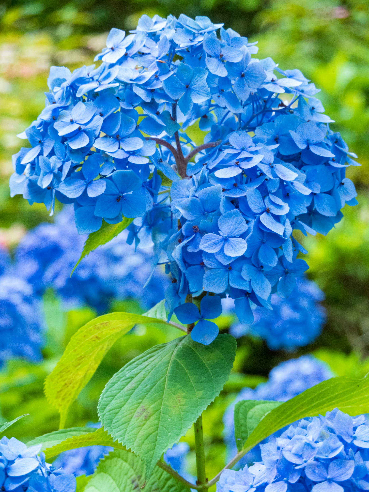
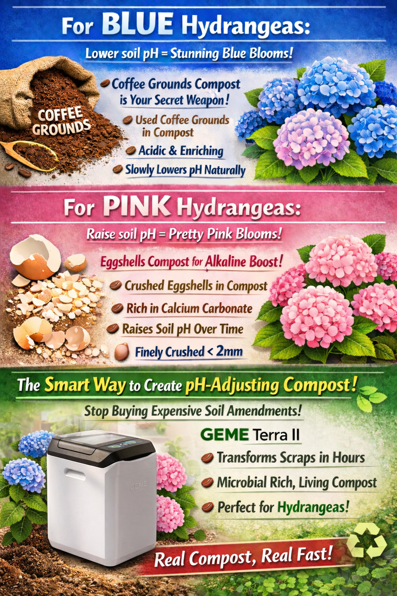
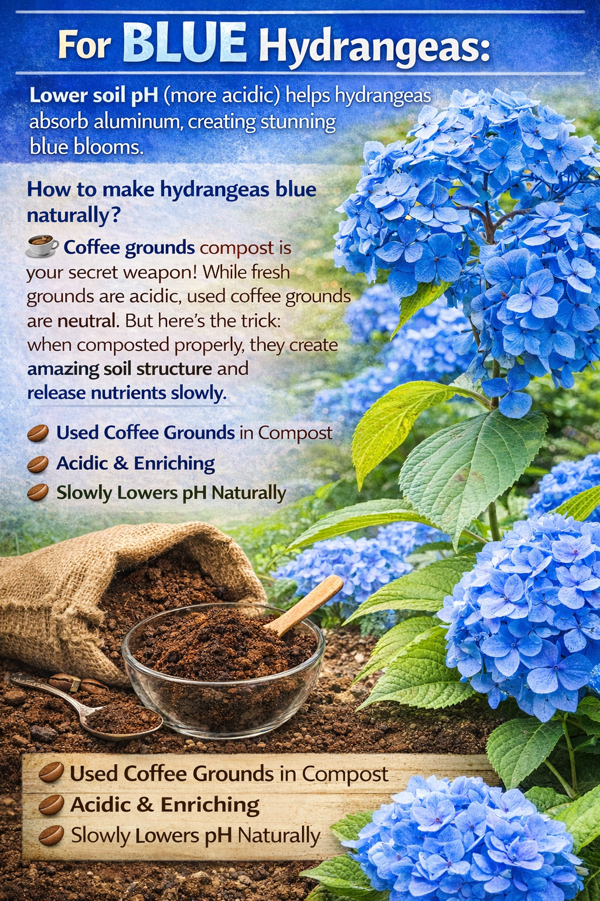
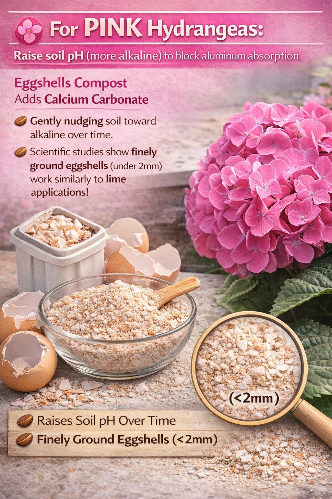
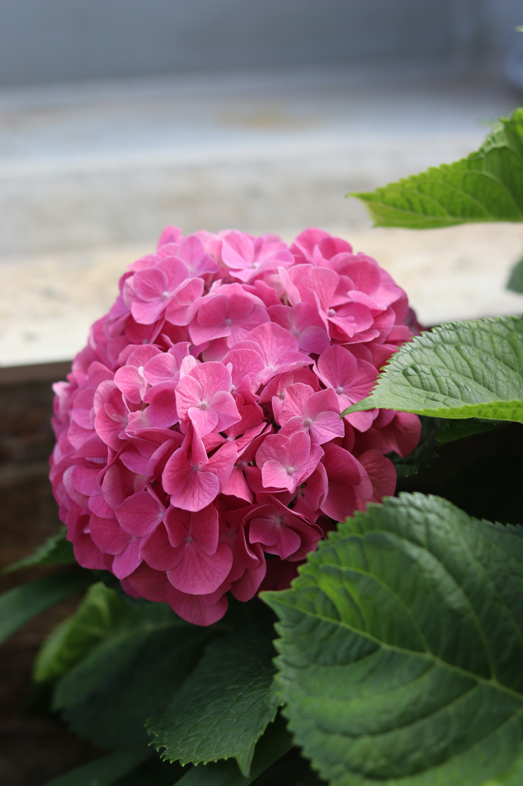

import GemeTerra2CTA from '@site/src/components/GemeTerra2CTA' 
import GemeComposterCTA from '@site/src/components/GemeComposterCTA' 
import RelatedArticles from '@site/src/components/RelatedArticles'
import ReactPlayer from 'react-player'

## Introduction: The Magic of Hydrangeas

Have you ever walked past a stunning garden and noticed hydrangeas blooming in brilliant blues, soft pinks, and deep purples, sometimes all on the same plant? It looks like magic, but it's actually science.

Hydrangeas are nature's pH meter. These remarkable shrubs can change their flower colors based on the chemistry of your soil. For gardeners, this means you have the power to paint your garden in the colors you desire, simply by understanding and adjusting your soil's acidity.

But here's the catch: not all hydrangeas can change color. And even among those that can, the process requires patience, knowledge, and the right soil amendments.

In this comprehensive guide, we'll cover everything you need to know about how to care for hydrangeas and unlock their color-changing potential. You'll learn:

1. Which hydrangea varieties can change color—and which cannot

2. The science behind blue hydrangea flowers and pink hydrangeas

3. How to create purple hydrangea blooms (the perfect middle ground)

4. Natural methods using coffee grounds and eggshells to adjust soil pH

5. How GEME Terra 2 transforms your kitchen scraps into powerful, soil-enhancing compost

Whether you're a seasoned gardener or just starting your hydrangea journey, this guide will give you the confidence to care for these magnificent plants and unlock their full color potential.

<!-- truncate -->

## 1. Hydrangea Care 101: The Foundation for Beautiful Blooms

Before we dive into color-changing magic, let's establish the fundamentals. Healthy hydrangeas are the canvas for your color experiments.

### Basic Growing Requirements

All hydrangeas share similar growing preferences, regardless of their color-changing abilities.

| **Requirement**     | **Ideal Condition**                                                      |
|-----------------|---------------------------------------------------------------------|
| Light           | Light shade is ideal; tolerates sun if soil isn't too dry            |
| Soil            | Moist but well-drained; rich in organic matter                       |
| pH Preference   | Varies by desired color (more on this later!)                        |
| Watering        | Regular during first growing season; keep soil moist but not waterlogged |
| Planting Time   | Spring or autumn for best establishment                              |
| Spacing         | 90cm–2.4m (3–8ft) depending on variety                               |

### Soil Preparation: The Key to Success

The [RHS](https://www.rhs.org.uk/plants/hydrangea/shrubby/growing-guide) emphasizes that hydrangeas thrive in evenly moist soil enriched with organic matter. Before planting:

 1. **Dig in organic soil improver** such as garden compost or manure-based conditioner

 2. **Apply a bucketful per square metre** for best results

 3. **Mulch after planting with organic matter**, leaving a 10-15cm gap around the base

### Watering Wisdom

 - **Newly planted hydrangeas**: Water regularly during the first growing season if there's no significant rain for 7-10 days

 - **Mature plants**: Benefit from watering during hot, dry spells

 - **Container plants**: Check moisture levels regularly—never let them dry out completely

 - **Blue-flowered cultivars**: Preferably water with rainwater to maintain color; use tap water only if necessary to prevent drought stress 

### Feeding: Less Is More

Here's a surprising truth: **regular feeding of established hydrangeas is not generally needed**. Too much fertilizer encourages excessive soft, leafy growth, reducing flower bud development and increasing frost risk.

If your plants are struggling in lighter, sandy soils, a spring application of general fertilizer (like Vitax Q4 or fish, blood, and bone) can help. But often, mulching is more beneficial than feeding.

### Pruning at a Glance

Different hydrangea types need different pruning approaches:

| **Hydrangea Type**                                    | **When to Prune**  | **How to Prune**                                                                                 |
|-------------------------------------------------------|--------------------|--------------------------------------------------------------------------------------------------|
| Mophead & Lacecap (H. macrophylla, H. serrata)        | Mid-spring         | Cut back to first or second strong bud; remove 1-2 oldest stems at base                          |
| Panicle & Smooth (H. paniculata, H. arborescens)      | Early spring       | Prune last year's growth to lowest healthy buds (25cm or 60cm for more height)                   |
| Oakleaf & Others (H. quercifolia, H. aspera)          | Spring             | Minimal pruning, just remove dead and over-long stems                                             |

## 2. Which Hydrangeas Can Change Color? (And Which Cannot)

This is where most confusion begins. The ability to change flower color based on soil pH is not universal among hydrangeas.

### Hydrangeas That CAN Change Color

According to the Royal Horticultural Society, the color-changing magic works for:

 - Hydrangea macrophylla (Bigleaf Hydrangea): both mophead and lacecap cultivars

 - Hydrangea serrata (Mountain Hydrangea)

 - Hydrangea involucrata

These species have flowers containing a pigment that responds to aluminum availability in the soil. Think of them as litmus paper, except in reverse: [**acidic soil = blue**, **alkaline soil = pink**](https://florafinder.org/Species/Hydrangea_macrophylla.php).

### Hydrangeas That CANNOT Change Color

The following hydrangeas produce flowers in shades of white, cream, green, or pink that deepen with age, but their color is not influenced by soil pH:

| Hydrangea Type                                   | Flower Characteristics                                           |
|--------------------------------------------------|------------------------------------------------------------------|
| Panicle Hydrangeas (H. paniculata)               | White to pink/red as they age; color not pH-dependent           |
| Smooth Hydrangeas (H. arborescens)               | White to greenish; 'Annabelle' is classic example               |
| Oakleaf Hydrangeas (H. quercifolia)              | White fading to pink; stunning fall foliage                     |
| Climbing Hydrangeas (H. anomala petiolaris)      | White lacecap flowers                                           |

The [New York Botanical Garden](https://libanswers.nybg.org/faq/222707) confirms: "Hydrangeas that naturally have white or cream flowers cannot be persuaded to provide blue flowers".

### What About Purple Hydrangeas?

Purple hydrangea blooms are actually the "in-between" color. When soil conditions are neither strongly acidic nor strongly alkaline, you get mauve to purple shades. Think of purple as the bridge between blue and pink, and it can be just as stunning!

## 3. The Science Behind Hydrangea Colors

Understanding the science makes the magic feel even more wonderful.

### The Aluminum Connection

The color change in hydrangeas depends on two factors :

 - Aluminum in the soil (must be present)

 - Soil pH (determines whether aluminum is available to the plant)

Here's how it works:

| Soil Condition                 | Aluminum Availability             | Flower Color    |
|--------------------------------|----------------------------------|----------------|
| **Acidic (pH below 5.5)**          | Aluminum is soluble and available | Blue           |
| **Neutral to Alkaline (pH 6.5+)**  | Aluminum is bound and unavailable | Pink           |
| **Slightly Acidic (pH 5.5–6.5)**   | Mixed availability                | Purple/Mauve   |

As [Britannica](https://www.britannica.com/plant/hydrangea) explains: "The flower colour is variable, depending on the acidity of the growing medium: rose-pink under neutral to low soil acidity and blue under conditions of stronger acidity" .

### The Pigment Factor

The actual pigment in hydrangea flowers is a type of anthocyanin. When aluminum is absorbed by the plant, it binds with this pigment and creates the blue color. Without aluminum, the same pigment produces pink flowers.

This is why white hydrangeas stay white: **they lack the pigment entirely**.

<GemeTerra2CTA 
 imgSrc="/img/geme-terra-2-composter.jpg"
 productTitle="GEME Terra II: Best Kitchen Composter"
 features={[
    "✅ Best Tool To Make Compost For Hydrangeas",
    "✅ Quiet, Odour-Free, Real Compost",
    "✅ Zero Filter Costs, No Refills",
    "✅ Reduce Landfill Waste & Greenhouse Gases"
 ]}
buttonText="Get Your GEME Terra II"
  href="https://www.geme.bio/product/terra2?utm_medium=blog&utm_source=geme_website&utm_campaign=general_seo_content&utm_content=how-to-care-for-hydrangeas-and-change-colors"
/>

## 4. How to Make Hydrangeas Blue (Lower Soil pH)

If you're dreaming of blue hydrangea flowers, your mission is to create acidic soil conditions (pH below 5.5) with available aluminum.

### The Classic Method: Aluminum Sulfate

For plants at least 2-3 years old, the [New York Botanical Garden](https://libanswers.nybg.org/faq/222707) recommends:

 1. Add 1/2 oz. of aluminum sulfate per gallon of water throughout the growing season

 2. This adds necessary aluminum and lowers pH somewhat

 3. Choose a fertilizer low in phosphorus and high in potassium (25/5/30 is ideal)

 4. Avoid superphosphates and bone meal, they interfere with blue color

### Natural Method: Coffee Grounds Compost

For gardeners who prefer organic approaches, coffee grounds are an excellent tool for creating blue hydrangeas.

According to the New York Botanical Garden, you can "add organic matter such as coffee grounds, fruit and vegetable peels, and grass clippings to the soil" to further lower pH.

[Better Homes & Gardens](https://www.bhg.com.au/garden/gardening/how-to-make-your-hydrangeas-change-colour) confirms: "Coffee grounds can help make the soil more acidic. Combining coffee grounds with fertiliser and citrus peels can enhance the soil's acidity, contributing to the transformation of hydrangeas into lovely blue hues" .

### Why Coffee Grounds Work

 - Used coffee grounds have an NPK ratio of approximately 2.3:0.1:0.7 

 - They add organic matter that improves soil structure

 - As they decompose, they gradually release compounds that acidify soil

 - They're a free resource from your morning brew!

### Application Tips for Coffee Grounds

 1. [**Compost them first**](https://www.instagram.com/p/DVp7gc8mn_1/), fresh grounds can be too strong and may contain caffeine residues

 2. Mix with soil rather than leaving on surface to prevent mold

 3. Apply around the root zone in spring and throughout growing season

 4. Recommended rate: about 2kg per 10sqm 

### The Container Alternative

If your garden soil is stubbornly alkaline, consider growing hydrangeas in containers. The RHS notes: "If you are gardening on alkaline soils and want to retain blue flowers, grow your hydrangeas in containers using ericaceous compost". This gives you complete control over soil conditions.

## 5. How to Make Hydrangeas Pink (Raise Soil pH)

For those who adore pink hydrangeas, your goal is to raise soil pH above 6.5 and reduce aluminum availability.

### The Classic Method: Garden Lime

To enhance pink or red flowers, the RHS recommends:

 1. Apply a dressing of ground limestone or chalk at 75-100g per sqm (2-3oz sq yd) in winter

 2. Use a high-phosphorus fertilizer: phosphorus binds with aluminum, making it unavailable to plants

### Natural Method: Eggshells Compost

For a gentle, organic approach to pink hydrangeas, eggshells are your secret weapon.

#### [Why Eggshells Work](https://pin.it/6jfegvBdr)

 - Eggshells are approximately 95% calcium carbonate, the same active ingredient in agricultural lime 

 - They slowly release calcium into the soil, gently raising pH over time

 - They're completely natural and cost-free

 - They also add valuable calcium to prevent blossom-end rot in vegetables

 - The calcium carbonate in eggshells neutralizes soil acidity, gradually shifting conditions toward the alkaline side that produces pink blooms.

### Important Preparation Tips

Whole eggshells take years to break down, they must be processed correctly to be effective.

| Preparation Method | Effectiveness                   |
|--------------------|---------------------------------|
| Whole shells       | Poor: years to decompose         |
| Hand-crushed       | Moderate: still slow             |
| Fine powder        | Excellent: fast-acting           |

#### Application Tips for Eggshells

 1. Rinse shells thoroughly to remove egg residue (prevents odors and pests)

 2. Dry completely, spread on baking sheet for 24-48 hours

 3. Grind to fine powder using coffee grinder or blender

 4. Sprinkle around root zone in winter or early spring

 5. Water in well to help incorporation

## 6. The GEME Terra 2 Advantage: Turning Kitchen Scraps Into Garden Gold

Now here's where modern technology meets traditional gardening wisdom. [**The GEME Terra 2 is the world's first AI-powered kitchen composter, and it's the perfect tool for creating the soil amendments your hydrangeas need**](https://wtop.com/tech/2025/01/geme-zero-waste-smart-composter-reduces-compost-production-time-from-months-to-hours/).

### What Is GEME Terra 2?

According to GEME's official specifications, the GEME Terra 2 is a Continuous Aerobic Bio-processor, not a dehydrator or dryer. It uses live microorganisms (a proprietary blend called Kobold™) to actively digest organic waste, creating a microbe-active compost base ready for soil amendment.

### Why GEME Is Perfect for Hydrangea Lovers

| **Feature**                    | **How It Helps Your Hydrangeas**                                               |
|--------------------------------|--------------------------------------------------------------------------------|
| **Processes coffee grounds**       | Creates acidic compost for blue hydrangeas                                      |
| **Processes eggshells**            | Creates calcium-rich compost for pink hydrangeas                                |
| **Continuous feed operation**      | Add scraps anytime, no batch cycles to wait for                                  |
| **14L capacity**                   | Handles weeks of kitchen waste                                                  |
| **Permanent metal-ion filter**     | \$0 ongoing costs, no filter subscriptions                                        |
| **Produces active compost base**   | Living, biologically active material ready to mix with soil                     |

<GemeTerra2CTA 
 imgSrc="/img/geme-terra-2-composter.jpg"
 productTitle="GEME Terra II: Best Kitchen Composter"
 features={[
    "✅ Best Tool To Make Compost For Hydrangeas",
    "✅ Quiet, Odour-Free, Real Compost",
    "✅ Zero Filter Costs, No Refills",
    "✅ Reduce Landfill Waste & Greenhouse Gases"
 ]}
buttonText="Get Your GEME Terra II"
  href="https://www.geme.bio/product/terra2?utm_medium=blog&utm_source=geme_website&utm_campaign=general_seo_content&utm_content=how-to-care-for-hydrangeas-and-change-colors"
/>

### The GEME Output: What You Get

GEME produces "active compost base", a moist, soil-like material containing active microorganisms. Key specifications :

 - Volume reduction: 95% of mass is biologically mineralized to CO₂ and water vapor

 - 5% remains as nutrient-dense active compost base

 - Output characteristics: Moist, soil-like, can form a clump when squeezed

 - Usage ratio: Mix 1:8 or 1:10 with soil (adjust based on plant sensitivity)

This is not sterile dehydrated dust. It's living compost that will feed your hydrangeas and improve soil structure over time.

### Making Blue Hydrangea Compost with GEME

 1. Collect coffee grounds from your morning brew

 2. Add to GEME along with other kitchen scraps

 3. Let Kobold microbes work, they break down grounds in hours

 4. Harvest active compost base in 1-2 months

 5. Mix around hydrangeas at 1:8 ratio with soil

### Making Pink Hydrangea Compost with GEME

 1. Rinse and dry eggshells (let GEME's microbes do the fine grinding!)

 2. Add to GEME with other organic materials

 3. The microbial process breaks shells down into available calcium

 4. Harvest calcium-rich compost and apply around pink hydrangeas

### Table: GEME vs. Traditional Composting for Soil Amendments

| **Aspect**                  | **Traditional Composting**                  | **GEME Terra 2**         |
|-----------------------------|---------------------------------------------|--------------------------|
| Time to finished compost    | 6-12 months                                | Days to weeks            |
| Coffee grounds processing   | Months                                     | Hours                    |
| Eggshell breakdown          | Years (whole) to months (ground)           | Days to weeks            |
| Space required              | Outdoor area                               | Counter or corner        |
| Year-round operation        | Slows in winter                            | Works continuously       |
| Ongoing filter costs        | Varies                                     | \$0                      |

## 7. Changing Your Hydrangea Colors

Ready to transform your garden? Follow this systematic approach.

### Step 1: Identify Your Hydrangea

First, confirm you have a color-changing variety. Look for:

 - Bigleaf hydrangeas (Hydrangea macrophylla): mophead or lacecap

 - Mountain hydrangeas (Hydrangea serrata)

If you have white hydrangeas or cone-shaped flowers, they won't change color.

### Step 2: Test Your Soil pH

You can't manage what you don't measure. Purchase a soil testing kit from a garden center or send a sample to your local extension service.

| **Current pH** | **Target for Blue**            | **Target for Pink**                |
|----------------|-------------------------------|------------------------------------|
| Below 5.5      | You're already there!          | Raise pH                           |
| 5.5–6.5        | Slightly acidic, good for purple| Slightly acidic, good for purple    |
| Above 6.5      | Lower pH                       | You're already there!              |

### Step 3: Choose Your Amendment

| **Desired Color** | **Amendment Options**                          | **When to Apply**                               |
|-------------------|------------------------------------------------|-------------------------------------------------|
| Blue              | Aluminum sulfate, coffee grounds compost, sulfur| Early spring; repeat through growing season      |
| Pink              | Ground limestone, eggshells compost, wood ash   | Winter or early spring                          |
| Purple            | Balanced approach, watch and adjust              | As needed                                       |

### Step 4: Apply and Monitor

 1. Apply amendments around the drip line of the plant

 2. Water thoroughly after application

 3. Wait and observe: color changes may take weeks to appear

 4. Retest soil pH every few months

### Step 5: Be Patient

The Better Homes & Gardens team reminds us: "Patience is key in witnessing the gradual and beautiful transition of your hydrangeas". Color changes won't happen overnight, but the wait is worth it.

### Table: Quick Reference: Color Change Methods

| **Method**      | **For Blue**                     | **For Pink**                        | **Time to Effect**         |
|-----------------|----------------------------------|-------------------------------------|----------------------------|
| Chemical        | Aluminum sulfate                 | Ground limestone                    | Weeks                      |
| Natural         | Coffee grounds compost           | Eggshells compost                   | Months                     |
| GEME-Enhanced   | GEME-processed coffee grounds    | GEME-processed eggshells            | Weeks        |

## 8. Common Mistakes and How to Avoid Them

### Mistake 1: Expecting Instant Results

**The problem**: Color changes take time, sometimes a full growing season.

**The fix**: Be patient and consistent with your amendments.

### Mistake 2: Over-Amending

**The problem**: Adding too much too fast can harm plants.

**The fix**: Start with small amounts and monitor plant response.

### Mistake 3: Ignoring Water Quality

**The problem**: Tap water in some areas is alkaline and can counteract your efforts.

**The fix**: Use rainwater for blue hydrangeas whenever possible.

### Mistake 4: Using Fresh Coffee Grounds Directly

**The problem**: Fresh grounds can be too acidic and may contain caffeine residues that inhibit plant growth.

**The fix**: Always compost coffee grounds first, GEME makes this easy!

### Mistake 5: Adding Whole Eggshells

**The problem**: Whole shells take years to break down and provide no immediate benefit.

**The fix**: Grind to powder or let GEME's microbes do the work for you.

### Mistake 6: Forgetting About Maintenance

**The problem**: Soil pH drifts back over time.

**The fix**: Monitor annually and reapply amendments as needed.

## 9. Troubleshooting Guide

### Table: Common Hydrangea Problems and Solutions

| Problem                      | Likely Cause                                          | Solution                                                                                     |
|------------------------------|------------------------------------------------------|----------------------------------------------------------------------------------------------|
| No flowers                   | Pruned at wrong time; frost damage; too much nitrogen| Prune in mid-spring for macrophylla; protect from late frosts; reduce fertilizer             |
| Wilting leaves               | Not enough water; too much sun                        | Water deeply; mulch to retain moisture; consider moving to shadier spot                      |
| Brown edges on leaves        | Under-watering; too much fertilizer                   | Water consistently; reduce feeding                                                           |
| Blue hydrangeas turning pink | Soil pH rising; aluminum unavailable                  | Add coffee grounds compost; use rainwater; apply aluminum sulfate if needed                  |
| Pink hydrangeas turning blue | Soil becoming acidic                                  | Add eggshells compost; apply ground limestone                                                |
| Weak, leggy growth           | Too much shade; too much nitrogen                     | Prune to encourage bushier growth; move to brighter location                                 |

<GemeTerra2CTA 
 imgSrc="/img/geme-terra-2-composter.jpg"
 productTitle="GEME Terra II: Best Kitchen Composter"
 features={[
    "✅ Best Tool To Make Compost For Hydrangeas",
    "✅ Quiet, Odour-Free, Real Compost",
    "✅ Zero Filter Costs, No Refills",
    "✅ Reduce Landfill Waste & Greenhouse Gases"
 ]}
buttonText="Get Your GEME Terra II"
  href="https://www.geme.bio/product/terra2?utm_medium=blog&utm_source=geme_website&utm_campaign=general_seo_content&utm_content=how-to-care-for-hydrangeas-and-change-colors"
/>

## 10. Frequently Asked Questions

### Q: How to care for hydrangeas in pots?

> A: Use a pot with drainage holes, water regularly (don't let them dry out), and use ericaceous compost if you want blue flowers. Move to a shadier spot in summer to reduce drying out. 

### Q: How long does it take to change hydrangea color?

> A: After altering soil pH, it should only take a couple of weeks before flowers begin to show color change. However, full transformation may take a full growing season.

### Q: Can I have blue and pink flowers on the same plant?

> A: Yes! This happens when soil conditions are uneven, parts of the root zone may be more acidic than others. It's perfectly normal and quite beautiful.

### Q: Are coffee grounds acidic?

> A: Used coffee grounds are close to neutral (pH 6.5-6.8), but as they decompose, they contribute to soil acidification through microbial activity. Composted coffee grounds are an excellent soil conditioner. Check this post to learn [**how to compost coffee grounds**](/blog/how-to-compost-coffee-grounds-guide). 

### Q: How finely should I grind eggshells for pink hydrangeas?

> A: Aim for a fine powder, coffee grinder consistency is ideal. The finer the grind, the faster the calcium becomes available. Check this post to learn [**how to compost eggshells fast**](/blog/how-to-compost-eggshells-guide-geme).

### Q: What causes purple hydrangea flowers?

> A: Purple hydrangea blooms occur when soil pH is in the intermediate range (around 5.5-6.5). It's the perfect middle ground between blue and pink conditions.

### Q: Can I use GEME compost immediately on hydrangeas?

> A: Yes! GEME produces an active compost base ready to mix with soil at a 1:8 or 1:10 ratio . It's biologically active and safe for immediate use.

### Q: How often should I replace GEME's filter?

> A: Never. GEME uses a permanent metal-ion oxidation catalyst designed for the machine's lifetime. There are zero filter replacement costs.

### Q: Will my white hydrangeas ever turn blue?

> A: No. White hydrangeas lack the pigment necessary for color change. Enjoy them for their elegant, pure blooms.

### Q: Can I use both coffee grounds and eggshells together?

> A: They'll partially neutralize each other. Use coffee grounds if you want blue; use eggshells if you want pink. For purple, a balanced approach works.

### Q: Do I need to buy microbes for GEME?

> A: You purchase Kobold starter culture once. The microbes are self-replicating under proper conditions, so you never have to buy more. But, you could purchase more Kobold depending on your personal needs. 

## 11. Conclusion: Master the Art of Hydrangea Color

Growing hydrangeas and changing their colors is one of gardening's most rewarding experiences. It's part science, part art, and entirely magical.

Let's recap the essentials:

### The Golden Rules of Hydrangea Color

 1. **Not all hydrangeas can change color**, only bigleaf (H. macrophylla) and mountain (H. serrata) varieties

 2. **Blue flowers need acidic soil (pH below 5.5)** and available aluminum 

 3. **Pink flowers need alkaline soil** (pH above 6.5) 

 4. **Purple flowers happen in the middle**

 5. **Coffee grounds compost helps create acidic soil for blue blooms** 

 6. **Eggshells compost gently raises pH for pink blooms** 

 7. **Patience is essential**, color changes take time 

Store-bought soil amendments add up quickly. Aluminum sulfate, garden lime, and commercial compost all cost money, and you need to buy them year after year.

The GEME Terra 2 costs \$549 upfront, but \$0 after that. No filter subscriptions. No ongoing consumables. Your coffee grounds and eggshells become free, unlimited soil amendments for life.

Every pound of coffee grounds and eggshells you compost instead of landfilling eliminates methane emissions 25 times more potent than CO₂. When you use a microbial system like GEME, you're not just making beautiful hydrangeas, you're actively fighting climate change.

Whether you're cultivating a row of electric blue mopheads, a romantic hedge of soft pink lacecaps, or a whimsical mix of purple shades, you now have the knowledge to succeed.

And with GEME Terra 2 by your side, you have the power to turn your daily kitchen scraps into the very soil that feeds your garden's most spectacular display.

Start your hydrangea color journey today. Your garden will make every breathtaking bloom for you.

👉 [Learn More About GEME Terra 2]
👉 [Download Our Free Hydrangea Color Guide]

👉 [Learn More About GEME Terra II](https://www.geme.bio/product/terra2?utm_medium=blog&utm_source=geme_website&utm_campaign=general_seo_content&utm_content=how-to-care-for-hydrangeas-and-change-colors)

👉 [Explore GEME Pro for Flower Shops](https://www.geme.bio/product/geme?utm_medium=blog&utm_source=geme_website&utm_campaign=general_seo_content&utm_content=?utm_medium=blog&utm_source=geme_website&utm_campaign=general_seo_content&utm_content=how-to-care-for-hydrangeas-and-change-colors)

<GemeTerra2CTA 
 imgSrc="/img/geme-terra-2-composter.jpg"
 productTitle="GEME Terra II: Best Kitchen Composter"
 features={[
    "✅ Best Tool To Make Compost For Hydrangeas",
    "✅ Quiet, Odour-Free, Real Compost",
    "✅ Zero Filter Costs, No Refills",
    "✅ Reduce Landfill Waste & Greenhouse Gases"
 ]}
buttonText="Get Your GEME Terra II"
  href="https://www.geme.bio/product/terra2?utm_medium=blog&utm_source=geme_website&utm_campaign=general_seo_content&utm_content=how-to-care-for-hydrangeas-and-change-colors"
/>

<GemeComposterCTA 
 imgSrc="/img/geme-bio-composter.jpg"
 productTitle="GEME Pro Composter"
 features={[
    "✅ Best Tool To Make Compost For Hydrangeas",
    "✅ Produce Soil-Ready Compost For Plant Growth",
    "✅ Quiet, Odor-Free, Quick(6-8 hours)",
    "✅ Large Capacity (19 L) For Daily Waste"
  ]}
buttonText="Get Your GEME Pro"
  href="https://www.geme.bio/product/geme?utm_medium=blog&utm_source=geme_website&utm_campaign=general_seo_content&utm_content=?utm_medium=blog&utm_source=geme_website&utm_campaign=general_seo_content&utm_content=how-to-care-for-hydrangeas-and-change-colors"
/>

**Sources Cited**

1. [Royal Horticultural Society: How to grow shrubby hydrangeas](https://www.rhs.org.uk/plants/hydrangea/shrubby/growing-guide)

2. [FloraFinder: Hydrangea macrophylla (Blue hydrangea), February 2025](https://florafinder.org/Species/Hydrangea_macrophylla.php)

3. [Britannica: Hydrangea | Shrub, Flowering, Perennial](https://www.britannica.com/plant/hydrangea)

4. [Norwich Gardener: How to Grow Purple Hydrangeas, 2024](https://www.norwichgardener.com/post/how-grow-purple-hydrangeas-plant-care-tips/)

5. [Plant Addicts: Pink Hydrangeas](https://plantaddicts.com/bushes/hydrangeas/pink-hydrangeas/)

6. [New York Botanical Garden: How do I get my hydrangea flowers to turn blue?, May 2022](https://libanswers.nybg.org/faq/222707)

7. [Better Homes & Gardens Australia: Simple trick to make your hydrangeas change colour, August 2025](https://www.bhg.com.au/garden/gardening/how-to-make-your-hydrangeas-change-colour/)

8. [WTOP News: GEME Zero Waste Smart Composter reduces compost production time from months to hours, January 2025](https://wtop.com/tech/2025/01/geme-zero-waste-smart-composter-reduces-compost-production-time-from-months-to-hours/)

9. [Kadoorie Farm and Botanic Garden: Grounds to Green - Supporting Local Growth, March 2026](https://kfbg.org/en/events/grounds-to-green-supporting-local-growth)

10. [MAWEB: Can Eggshells Be Recycled Easily?, October 2025](https://maweb.org/can-eggshells-be-recycled/)

<RelatedArticles
  slugs={[
  "best-composter-daily-operation-comparison-lomi-mill-reencle-geme",
  "how-long-does-pizza-last-in-fridge-guide",
  "how-to-compost-eggshells-guide-geme",
  "how-to-compost-coffee-grounds-guide",
  "never-buy-carbon-filter-for-your-composter",
  "best-composter-fastest-real-compost-geme-terra-2",
  "how-to-compost-at-home-beginners-guide",
  "how-long-can-chicken-stay-in-the-fridge",
  "how-to-reduce-odor-indoor-composting-tips",
  "how-long-can-ground-beef-stay-in-the-fridge",
  "nyc-composting-fines-2026-geme-terra-2-best-electric-compost",
  "best-indoor-composter-for-apartment-geme-vs-lomi",
  "the-best-composter-for-kitchen",
  "how-to-reduce-food-waste-during-spring-festival",
  "does-reencle-composter-produce-real-compost",
  "does-mill-composter-really-compost",
  "how-to-reduce-food-waste-at-home-2026",
  "free-mcnugget-caviar-raises-food-waste-concerns",
  "composting-in-winter",
  "how-to-compost-at-home",
  "zero-waste-home-kitchen-composter",
  "does-lomi-composter-really-compost",
  "5-best-kitchen-composters-in-2026",
  "best-kitchen-composter-in-2026-geme-terra-2",
  "geme-vs-reencle-composter-2026",
  "geme-vs-mill-composter-2026",
  "best-kitchen-composter-2026",
  "advanced-geme-compost-application-guide",
  "electric-compost-bin-filters-costs-comparison",
  "geme-vs-lomi", 
  "geme-terra-2-debuts",
  "the-best-composter-to-reduce-food-waste",
  "compost-pile-vs-electric-composter",
  "how-to-make-bananas-last-longer",
  "how-long-do-apples-last-in-the-fridge",
  "can-i-compost-moldy-grapes",
  "can-you-compost-moldy-bread",
  ]}
/>

_Ready to transform your gardening game? Subscribe to our [newsletter](http://geme.bio/signup?utm_medium=blog&utm_source=geme_website&utm_campaign=general_seo_content&utm_content=how-to-compost-at-home-beginners-guide) for expert composting tips and sustainable gardening advice._

