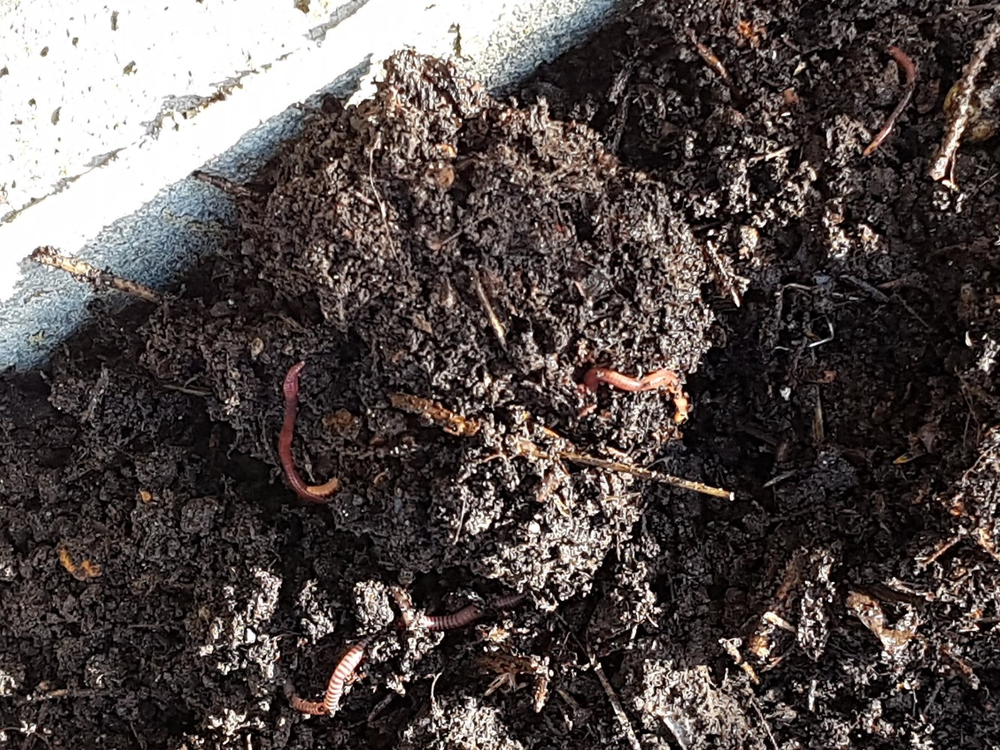
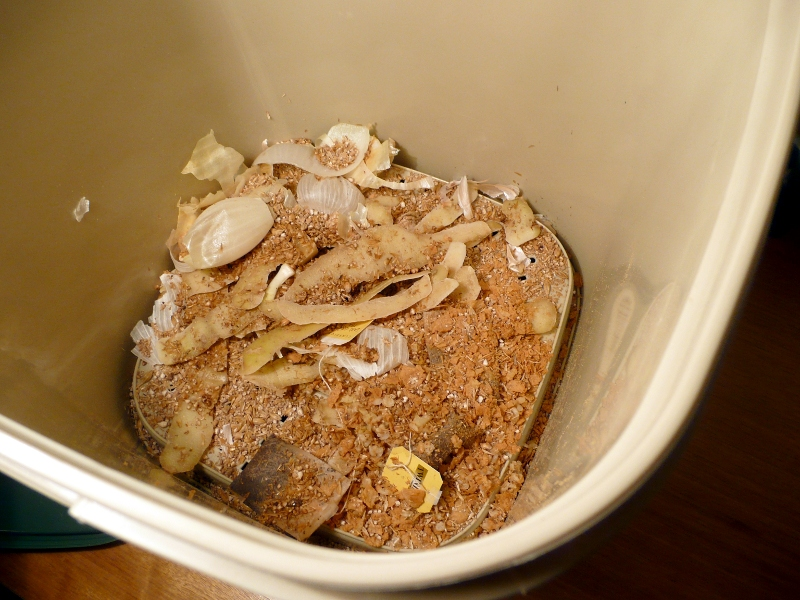
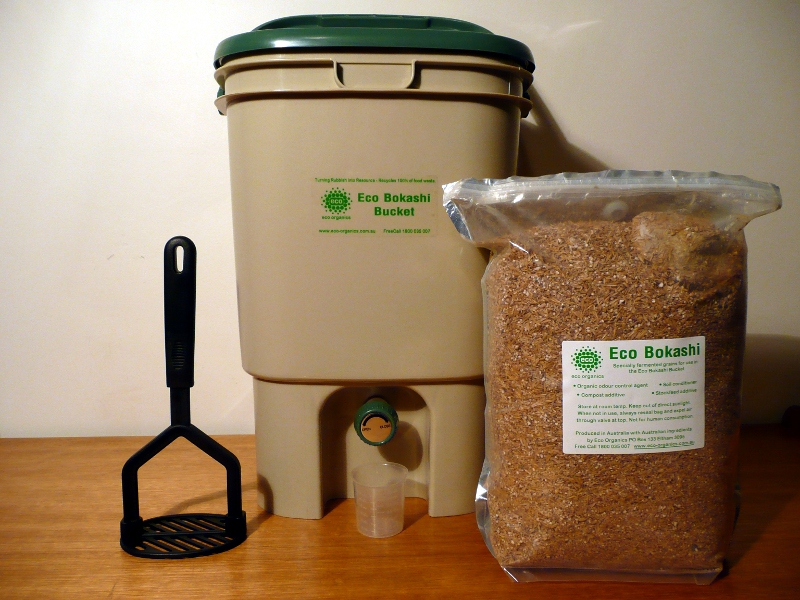

import GemeTerra2CTA from '@site/src/components/GemeTerra2CTA' 
import GemeComposterCTA from '@site/src/components/GemeComposterCTA' 
import RelatedArticles from '@site/src/components/RelatedArticles'
import ReactPlayer from 'react-player'

## Introduction

**Bokashi composting** is often presented as a fast and convenient way to process kitchen scraps, especially in homes where space is limited or where conventional outdoor composting is impractical. Yet the question “How long does **bokashi** take to compost?” does not have a single simple answer unless the process is defined carefully.

In common usage, people often say that bokashi takes about **two weeks**. That statement refers only to the sealed fermentation stage after the bokashi bucket has been filled. In a fuller and more accurate sense, however, the fermented material usually needs another **two to four weeks** in soil, a trench, a soil factory, or an active compost system before it becomes fully integrated into the surrounding organic matrix. This means the complete **Bokashi Composting Timeline** is usually better described as a **multi-stage process of roughly four to six weeks after the bucket is full**, not merely a 14-day treatment.

This distinction matters because **bokashi compost** is often misunderstood. The material removed from a bokashi bin typically does not look like finished, crumbly, dark aerobic compost. It often still resembles the original scraps. That does not mean the process has failed. Rather, it reflects the fact that **bokashi composting** is based on fermentation in a low-oxygen environment, not on the same biological pathway as conventional hot composting.

A neutral explanation therefore needs to clarify three things at once: what bokashi is, what stage people are timing when they discuss bokashi, and why fermented bokashi material is not always identical to mature compost in the ordinary backyard sense. This article addresses all three points and explains the full **Bokashi Composting Timeline** in a reference-style format.

<!-- truncate -->

## What Is Bokashi Composting?

### Bokashi as a Fermentation-Based Food Waste Treatment Method

**Bokashi composting** is a method of processing organic kitchen waste by fermenting it in a sealed or nearly airtight container with the help of beneficial microorganisms. These microbes are often introduced through inoculated bran or another carrier material. Rather than depending primarily on oxygen-rich decomposition, bokashi relies on microbial fermentation under acidic, low-oxygen conditions.

This is why bokashi is often described as different from standard backyard composting. In traditional aerobic composting, oxygen, carbon balance, moisture control, particle size, and aeration all play central roles in generating decomposition and, in some systems, heat. By contrast, **bokashi** treats food waste in a closed environment before it is buried or otherwise transferred to a secondary breakdown stage.

The [University of Maryland Extension](https://extension.umd.edu/sites/extension.umd.edu/files/2021-03/The%20Vine%20Winter%202021.pdf) describes bokashi as an anaerobic fermentation process that produces a material capable of being rapidly digested by soil organisms afterward. This is a useful definition because it captures a key point: bokashi does not typically create fully finished compost inside the bucket itself.

### Why Bokashi Is Often Used in Homes and Small Spaces

One reason **bokashi composting** is widely discussed is that it can fit well into indoor or small-space living. Since the process takes place in a sealed container, it is often promoted as a lower-odor and lower-pest alternative to open food-scrap composting systems. It is also notable for being able to accept a wider range of kitchen scraps than many ordinary home compost piles.

According to [NC State Extension](https://beaufort.ces.ncsu.edu/news/bokashi-composting-a-faster-easier-way-to-turn-kitchen-scraps-into-garden-gold/), bokashi can generally handle cooked foods and, in many cases, even meat and dairy, provided the system is used correctly. That broader feedstock range is one of the main reasons **bokashi compost** has become popular among households looking for a more flexible food-waste solution.

## Bokashi Composting Timeline

### Stage 1: Filling the Bucket

#### A Variable Stage That Depends on Household Food Waste Volume

The first part of the **Bokashi Composting Timeline** is the filling stage. During this stage, food scraps are placed into the bokashi bucket in layers. Bokashi bran or another inoculated input is added between layers, and the contents are usually pressed down to reduce trapped air. The lid is then resealed.

The length of this stage varies significantly. A household that produces a large volume of food scraps may fill a container quickly, while a smaller household may need one or more weeks. Because of this variability, some guides do not include bucket filling when they state how long bokashi takes. Instead, they start the clock only once the bucket is full and the uninterrupted fermentation stage begins.

From a strictly practical standpoint, however, the filling stage is still part of the real-life process. Note that timing claims about bokashi may exclude or include this stage depending on context.

#### Why Timing Can Seem Inconsistent Across Different Guides

When people compare bokashi timelines online, one source may say “two weeks,” another may say “one month,” and another may say “about six weeks.” These answers are often based on different process boundaries. If a source is timing only the sealed fermentation stage, the estimate will be shorter. If it includes post-burial decomposition, the estimate will be longer. If it includes the filling stage as well, the timeline becomes longer still.

This is why understanding the structure of the process is essential to understanding **bokashi composting** itself.

### Stage 2: Sealed Fermentation

#### Typical Fermentation Period: 10 to 14 Days

Once the bucket is full, it is generally sealed and left undisturbed for approximately **10 to 14 days**. This is the stage most people refer to when they say that **bokashi** takes around two weeks.

During this period, beneficial microorganisms ferment the organic matter under acidic, oxygen-limited conditions. The goal is not to turn scraps into humus inside the bucket. Rather, the goal is to transform them into a fermented intermediate that will later break down rapidly when introduced to soil biology.

The [Illinois Food Scrap & Composting Coalition](https://illinoiscomposts.org/composting-at-home/) notes that once a bokashi container is full, it is typically set aside for **two to three weeks** to ferment. That slightly wider range is helpful because it reflects real-world variability. Warmer temperatures, smaller particles, and good inoculation may support faster fermentation, while cooler conditions or denser material may make users keep the container closed somewhat longer.

#### What Fermented Bokashi Compost Looks Like

A common misunderstanding arises at the end of this stage because the material often still looks like food scraps. Peels, grains, and vegetable pieces may remain visible. For people accustomed to conventional compost, this can appear unfinished.

However, visible scraps do not automatically indicate failure. Educational materials such as the [University of Maryland Extension](https://extension.umd.edu/sites/extension.umd.edu/files/2021-03/The%20Vine%20Winter%202021.pdf) and practical home composting guides explain that successful bokashi often looks “pickled” rather than fully decomposed. The food waste has been fermented, not fully mineralized or humified.

The smell is also an important clue. A sour, acidic, or pickle-like smell is often considered consistent with successful bokashi fermentation. By contrast, a putrid, rotten odor may indicate process imbalance, excess oxygen, excessive moisture, or poor inoculation.

#### Why the Bucket Stage Does Not Usually Produce Finished Compost

It is important to be precise here. Although people often use the phrase **bokashi compost**, the product leaving the bucket is usually not finished compost in the conventional aerobic sense. It is more accurate to describe it as a fermented pre-compost or fermented organic intermediate.

That distinction is not merely semantic. It explains why the bucket contents need a second stage. The fermentation stage alters the material, acidifies it, and prepares it for rapid biological assimilation later. But it usually does not produce a stable, ready-to-use humus-like material on its own.

### Stage 3: Soil Incorporation or Secondary Breakdown

#### Typical Finishing Period: 2 to 4 Weeks

After fermentation, the bokashi-treated waste is usually buried in soil, placed in a trench, mixed into a soil factory, or incorporated into an active compost pile. This is the stage where the material completes its breakdown.

According to [NC State Extension](https://beaufort.ces.ncsu.edu/news/bokashi-composting-a-faster-easier-way-to-turn-kitchen-scraps-into-garden-gold/), bokashi material commonly breaks down in soil within **two to four weeks**, though the exact timing depends on environmental conditions. This stage is essential to any accurate account of the **Bokashi Composting Timeline**.

At this point, a wider community of soil organisms begins acting on the fermented waste. The acidic intermediate gradually loses its distinct character and becomes integrated into the surrounding soil ecosystem. This is the stage that more closely resembles what people mean by “compost completion.”

#### Why This Stage Is Often Overlooked

Many short explanations of **bokashi composting** emphasize only the bucket stage because it is the most distinctive part of the method. But this can create the false impression that bokashi is complete the moment fermentation ends.

A more neutral and scientifically careful explanation makes clear that bokashi is normally a **two-stage system**:

1. **anaerobic fermentation in a sealed container**, and  

2. **secondary biological breakdown in soil or compost**.

Without the second stage, the material remains only partially processed relative to what is usually meant by mature compost.

## How Long Does Bokashi Take in Total?

### The Most Practical Answer

If all stages are considered together, the complete household timeline usually looks like this:

- **Bucket filling:** variable, often several days to several weeks  

- **Sealed fermentation:** about **10 to 14 days**, sometimes up to **2 to 3 weeks**  

- **Soil finishing or secondary decomposition:** about **2 to 4 weeks**

Taken together, this means **bokashi composting** usually takes around **4 to 6 weeks after the bucket is full**, or somewhat longer if the filling stage is included in the total process time.

This fuller description aligns with public educational materials such as [NC State Extension](https://beaufort.ces.ncsu.edu/news/bokashi-composting-a-faster-easier-way-to-turn-kitchen-scraps-into-garden-gold/) and the [Cook County indoor composting guide](https://www.cookcountyil.gov/sites/g/files/ywwepo161/files/documents/2022-06/Cook%20County%20DES%20Indoor%20Composting%20Flyer-2021.pdf), which notes that bokashi-style treatment can take roughly **one to one and a half months** overall.

### Why “Two Weeks” Is Both Right and Incomplete

The common claim that bokashi takes two weeks is not necessarily wrong. It is simply incomplete. It accurately describes the fermentation stage for many systems. What it leaves out is that fermentation alone does not usually equal finished compost.

For that reason, a neutral article should avoid presenting the two-week figure as the whole story. The more accurate answer is that bokashi takes about **two weeks to ferment**, followed by another **two to four weeks to finish decomposing in soil or another biologically active system like [GEME Terra II](https://www.geme.bio/product/terra2?utm_medium=blog&utm_source=geme_website&utm_campaign=general_seo_content&utm_content=how-long-does-bokashi-take-to-compost)**.

## Factors That Affect the Bokashi Composting Timeline

### Temperature: Warmer Conditions Usually Accelerate Both Stages

Temperature influences microbial activity at every stage. Although many bokashi buckets are kept indoors, room temperature still affects fermentation. The post-burial stage is even more sensitive to environmental warmth. In warm, active soil, fermented bokashi may disappear relatively quickly. In cool or winter soil, the same material may persist longer before becoming fully integrated.

### Moisture and Drainage: Excess Moisture Can Slow or Destabilize the Process

Bokashi works best when scraps are moist but not saturated. Too much free liquid can contribute to odors and may disrupt a stable fermentation balance. This is one reason many bokashi bins are designed to allow liquid to be drained. Managing moisture helps keep the microbial environment more favorable and the timeline more predictable.

### Particle Size: Smaller Pieces Tend to Process Faster

Chopping scraps before they are added can help both fermentation and later decomposition by increasing surface area. Large intact pieces often take longer, especially in the post-burial stage.

### Feedstock Type: Some Materials Naturally Persist Longer

Soft fruits, cooked grains, and leafy vegetables often break down relatively fast once buried. Tough peels, fibrous materials, and bones may remain visible longer. Bokashi can often accept these items, but acceptance does not mean all materials finish at the same rate.

### Inoculation Quality and Air Exclusion: Process Control Matters

A consistent supply of inoculated bran and effective exclusion of air are important to successful bokashi fermentation. If the material is poorly inoculated, repeatedly exposed to too much air, or not compacted sufficiently, fermentation can become uneven and may produce inferior results.

## Why Bokashi Is Often Considered Faster Than Conventional Composting

### Faster Transformation, Not Instant Finished Compost

Bokashi is often called fast because it moves food scraps into a biologically transformed state quickly and under controlled conditions. Compared with conventional backyard composting, which may depend on careful carbon-to-nitrogen balance, aeration, turning, and longer decomposition windows, bokashi can convert kitchen waste into a soil-ready intermediate more quickly.

The [NC State Extension](https://beaufort.ces.ncsu.edu/news/bokashi-composting-a-faster-easier-way-to-turn-kitchen-scraps-into-garden-gold/) article explicitly frames bokashi as a faster and easier route for turning kitchen scraps into a useful garden input. That characterization is broadly fair, provided “fast” is understood correctly. Bokashi is fast because it accelerates the transition from raw food waste to a ferment-stabilized intermediate, not because it always produces fully mature compost directly in the bucket.

### Comparison With Conventional Composting

General composting resources such as [Cornell’s compost methods guide](https://blogs.cornell.edu/soilnow/compost/compost-methods-a-quick-how-to-guide/) explain that conventional systems depend heavily on oxygen, structure, and feedstock balance. Those systems can produce excellent compost, but the timeline may be longer and the acceptable inputs may be narrower. In that sense, **bokashi composting** is often especially attractive for food scraps that are harder to manage in ordinary open piles.

<GemeTerra2CTA 
 imgSrc="/img/geme-terra-2-composter.jpg"
 productTitle="GEME Terra II: Best Kitchen Composter"
 features={[
    "✅ Best Tool For Bokashi Secondary Breakdown",
    "✅ Biologically Active Composting System",
    "✅ Quiet, Odour-Free, Real Compost",
    "✅ Zero Filter Costs, No Refills",
    "✅ Reduces Composting Time to Days"
 ]}
buttonText="Get Your GEME Terra II"
  href="https://www.geme.bio/product/terra2?utm_medium=blog&utm_source=geme_website&utm_campaign=general_seo_content&utm_content=how-long-does-bokashi-take-to-compost"
/>

## Common Misunderstanding: Bokashi Compost Is Not Always Finished Compost

### A More Neutral Definition of Bokashi Compost

It is better not to define **bokashi compost** too loosely. If the term is used to mean the material removed directly from the bokashi bucket, that material is generally fermented rather than fully composted in the conventional sense. If the term is used more broadly to describe the final result after soil incorporation, then it may indeed refer to a compost-like soil amendment.

A clearer formulation is often:

- **fermented bokashi material** for the bucket-stage output, and  

- **finished bokashi-derived soil amendment** for the material after secondary breakdown.

## Conclusion

The question “How long does **bokashi** take to compost?” is best answered in stages rather than with a single number.

In most home systems, the process includes:

1. a variable period of filling the bucket,  

2. about **10 to 14 days** of sealed fermentation, and  

3. about **2 to 4 weeks** of secondary breakdown in soil or compost.

As a result, the full **Bokashi Composting Timeline** is usually around **4 to 6 weeks after the bucket is full**, with additional variation depending on temperature, moisture, particle size, feedstock type, and soil activity.

A neutral explanation should also make clear that **bokashi composting** is not identical to standard hot composting and that **bokashi compost** is often an intermediate fermented product before final soil integration. 

<RelatedArticles
  slugs={[
  "how-to-care-for-hydrangeas-and-change-colors",
  "best-composter-daily-operation-comparison-lomi-mill-reencle-geme",
  "how-long-does-pizza-last-in-fridge-guide",
  "how-to-compost-eggshells-guide-geme",
  "how-to-compost-coffee-grounds-guide",
  "never-buy-carbon-filter-for-your-composter",
  "best-composter-fastest-real-compost-geme-terra-2",
  "how-to-compost-at-home-beginners-guide",
  "how-long-can-chicken-stay-in-the-fridge",
  "how-to-reduce-odor-indoor-composting-tips",
  "how-long-can-ground-beef-stay-in-the-fridge",
  "nyc-composting-fines-2026-geme-terra-2-best-electric-compost",
  "best-indoor-composter-for-apartment-geme-vs-lomi",
  "the-best-composter-for-kitchen",
  "how-to-reduce-food-waste-during-spring-festival",
  "does-reencle-composter-produce-real-compost",
  "does-mill-composter-really-compost",
  "how-to-reduce-food-waste-at-home-2026",
  "free-mcnugget-caviar-raises-food-waste-concerns",
  "composting-in-winter",
  "how-to-compost-at-home",
  "zero-waste-home-kitchen-composter",
  "does-lomi-composter-really-compost",
  "5-best-kitchen-composters-in-2026",
  "best-kitchen-composter-in-2026-geme-terra-2",
  "geme-vs-reencle-composter-2026",
  "geme-vs-mill-composter-2026",
  "best-kitchen-composter-2026",
  "advanced-geme-compost-application-guide",
  "electric-compost-bin-filters-costs-comparison",
  "geme-vs-lomi", 
  "geme-terra-2-debuts",
  "the-best-composter-to-reduce-food-waste",
  "compost-pile-vs-electric-composter",
  "how-to-make-bananas-last-longer",
  "how-long-do-apples-last-in-the-fridge",
  "can-i-compost-moldy-grapes",
  "can-you-compost-moldy-bread",
  ]}
/>

_Ready to transform your gardening game? Subscribe to our [newsletter](http://geme.bio/signup?utm_medium=blog&utm_source=geme_website&utm_campaign=general_seo_content&utm_content=how-to-compost-at-home-beginners-guide) for expert composting tips and sustainable gardening advice._

