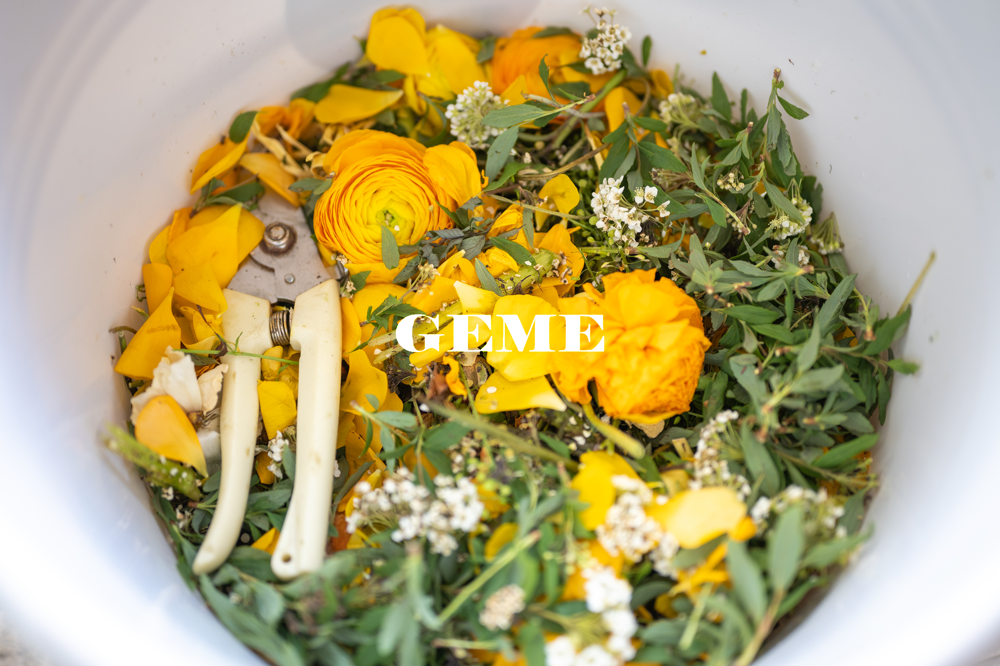
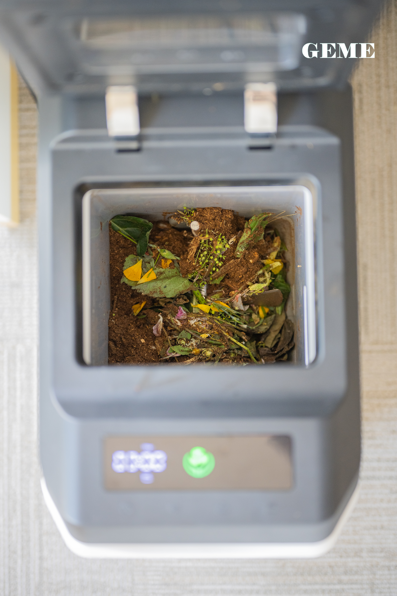
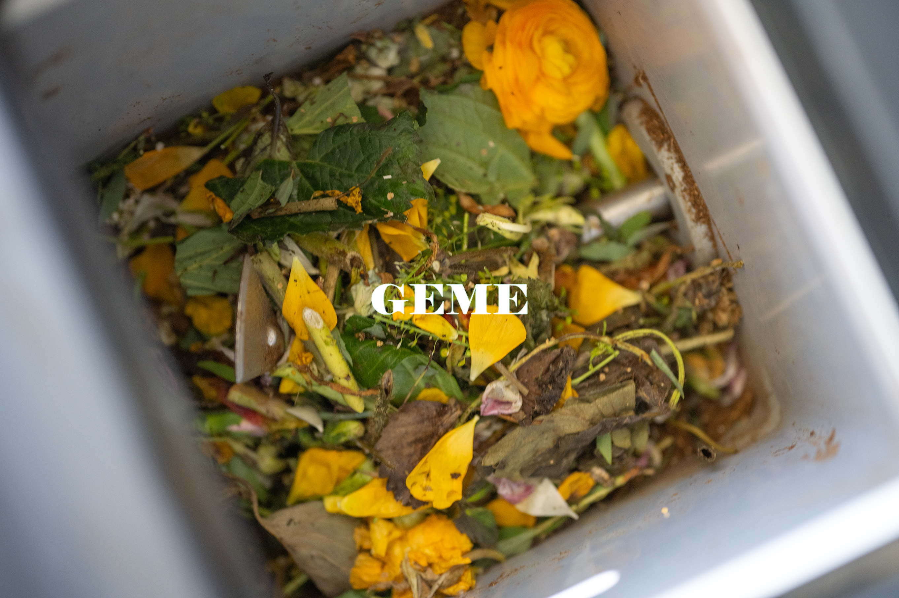
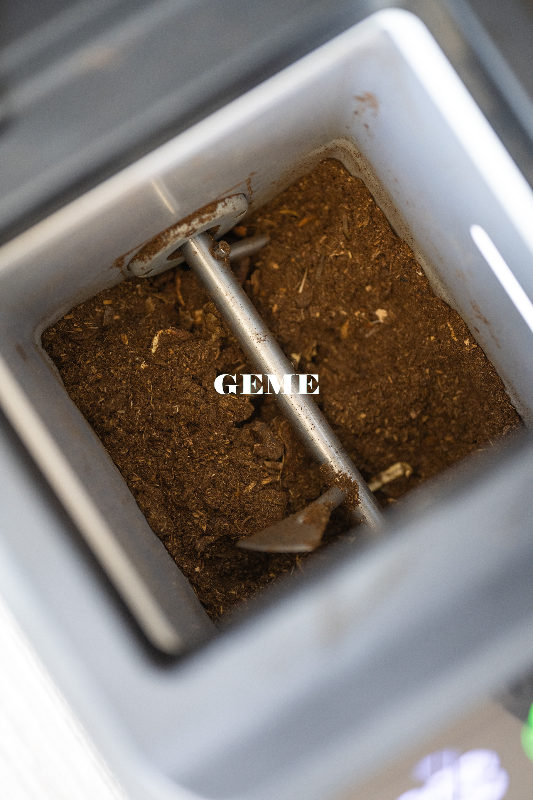

import GemeTerra2CTA from '@site/src/components/GemeTerra2CTA' 
import GemeComposterCTA from '@site/src/components/GemeComposterCTA' 
import RelatedArticles from '@site/src/components/RelatedArticles'
import ReactPlayer from 'react-player'

## Introduction: That Bouquet You've Been Ignoring

We've all been there. That gorgeous bunch of flowers someone gave you two weeks ago? They're now drooping over the side of the vase, looking sad and sorry. The water's murky. Petals are scattered on the table. And you keep walking past thinking, "I really need to deal with that."

When you finally muster the courage, your first instinct is probably just to dump the whole mess in the trash. It's easy. It's quick. But here's the thing: **those sad flowers aren't garbage**. They're actually some of **the best compost materials** you'll ever get your hands on.

The question "Can cut flowers be composted?" has a really simple answer. Yes, absolutely yes. Those petals, stems, and leaves are all organic matter that wants to return to the earth. The University of Florida IFAS Extension actually lists flowers right there on their "what you can compost" list. The same goes for the City of Edmonton and a bunch of local councils across the UK and Australia.

But here's where it gets tricky. If you've ever tried tossing flowers into a backyard compost bin, you probably learned a hard lesson. That bin starts to smell like a swamp. Flies show up like it's a party. And weeks later, you open it up, and those same stems are still sitting there mocking you.

That's the part nobody talks about. Traditional compost bins turn fresh flowers into stinky fly magnets. The moisture from the stems, the sweetness from the petals... It's basically an invitation for every bug in the neighborhood to move in.
But there's a better way. And honestly, it's so much easier, you'll wonder why you ever dealt with the stink in the first place.

In this guide, I'll walk you through everything you need to know about composting cut flowers. The right way to prep them, how long different methods take, why backyard bins fail, and how the GEME Terra II turns your wilted bouquet into usable compost in hours instead of months.

<!-- truncate -->

## 1. Can Cut Flowers Actually Go In Compost

Yes. Absolutely.

Cut flowers are 100% compostable. Every part of them. The petals, the leaves, the stems, even those spiky thorns on roses. It's all organic material that breaks down given enough time and the right conditions.

Flowers actually make really good compost material because they add nitrogen to the pile. In composting speak, that makes them "greens", which is what microbes need to thrive and multiply. They also bring moisture, which helps keep the decomposition process moving.

But here's what nobody warns you about. When you toss flowers into a regular compost bin, things get ugly fast.

### Why Backyard Bins Hate Fresh Flowers

Think about what's in that bouquet. Soft wet petals. Juicy stems. Maybe some leftover water is clinging to everything. Now imagine sealing all that moisture inside a dark plastic bin with limited airflow.

You're basically creating a swamp.

**The problems start almost immediately**:

| Problem         | What Happens                                                                                     |
|-----------------|-------------------------------------------------------------------------------------------------|
| Fruit flies     | They smell that sweetness from miles away and move in fast                                       |
| Rancid smell    | Without enough oxygen, things rot instead of compost. It smells like garbage, not soil           |
| Mold explosion  | All that moisture with no airflow equals fuzzy science experiments                               |
| Slow breakdown  | Even with the smell, those thick stems take forever to actually disappear                        |

I've talked to so many people who tried composting once, ended up with a fly-infested stink bomb, and gave up forever. Can't blame them, honestly. Nobody wants that mess near their kitchen.

### The Good News

Flowers themselves aren't the problem. It's the method. When you give flowers the right conditions with enough oxygen and the right biology, they break down beautifully without smell and without bugs.

That's where the GEME Terra II comes in, but we'll get to that in a bit.
First, let's talk about what you need to remove before composting anything.

## 2. What to Strip Off Before Composting

Before you toss that bouquet anywhere, take five minutes to deconstruct it. Store-bought flowers come with a bunch of stuff that does NOT belong in compost.

| **Toss This in Trash**             | **Why**                                                        |
|-------------------------------|------------------------------------------------------------|
| Plastic wrapping              | It's plastic. It will never break down                     |
| Ribbons and fabric ties       | Same story: synthetic stuff stays forever                  |
| Floral foam (that green spongy stuff) | This is toxic. It has microplastics and chemicals. Never compost it |
| Wire stems                    | Metal doesn't decompose and can be dangerous later         |
| Rubber bands                  | They just sit there                                        |
| Stickers or tags              | Usually coated in plastic or glue                          |

I know it's tempting to just dump the whole thing and walk away. But taking those extra few minutes means your compost will be pure organic material without any nasty surprises later.

Once everything non-organic is removed, you're left with the good stuff: petals, leaves, and stems. Now comes the important part.

## 3. How to Prep Flowers So They Actually Break Down

This is the step everyone skips, and it's why most people end up frustrated.
If you throw a whole rose stem into your compost, it's going to sit there for a year looking the same. Maybe longer. Those thick stems are tough and fibrous. They resist breaking down.

The trick is surface area. Microbes can only eat the outside of things. So the more outside you give them, the faster they eat.

Think of it like this. A whole log takes years to rot. But run that same log through a wood chipper, and you get mulch that breaks down in months. Same material. Different size.

Here's how to prep different parts of your bouquet:

| **Flower Part**         | **What To Do**                                                                        |
|-------------------------|---------------------------------------------------------------------------------------|
| Petals                  | Leave them whole—they disappear fast anyway                                           |
| Leaves                  | Tear them up or chop them a bit                                                      |
| Soft stems (like tulips)| Cut into 2 to 3 inch pieces                                                          |
| Woody stems (like roses)| Chop into 1 to 2 inch pieces. Smaller is better                                      |
| Thorns                  | Snip them off if you can, or chop stems fine enough that thorns are tiny             |

This whole process takes maybe five or ten minutes. Put on some music or a podcast and just snip away. In the future, you will be grateful.

### The One Rule You Can't Ignore

If you're using a GEME Terra II (which I'll talk about more later), this step isn't optional. It's essential.

Long, stringy stems can wrap around the mixing mechanism inside the machine. That can cause things to stop working properly. So for GEME users, especially, keep those stem pieces to 2 to 3 inches max. Shorter is safer and faster.

<GemeTerra2CTA 
 imgSrc="/img/geme-terra-2-composter.jpg"
 productTitle="GEME Terra II: Best Kitchen Composter"
 features={[
    "✅ Best Composter For Cut Flowers Compost",
    "✅ Biologically Active Composting System",
    "✅ Quiet, Odour-Free, Real Compost",
    "✅ Zero Filter Costs, No Refills",
    "✅ Reduces Composting Time to Days"
 ]}
buttonText="Get Your GEME Terra II"
  href="https://www.geme.bio/product/terra2?utm_medium=blog&utm_source=geme_website&utm_campaign=general_seo_content&utm_content=how-to-compost-cut-flowers-guide"
/>

## 4. What Happens to Flowers in a Regular Compost Bin

Let's be real about what traditional composting looks like.

### Hot Composting

If you have a proper hot compost pile that you manage actively, turning it, keeping it moist, balancing greens and browns, flowers will break down in about **3 to 6 months**.

That means:
- Petals disappear in a couple of weeks
- Leaves take a month or so
- Stems hang around for months, especially woody ones

The problem is that most people don't have a hot compost pile. They have a bin in the corner that they ignore until it smells bad.

### Cold Composting

Cold composting is what most backyard composters actually do. You toss stuff in, maybe stir it once in a while, and hope for the best.

With this method, flowers take **6 to 12 months** to fully break down. That whole time, they're sitting there slowly rotting, potentially smelling, and definitely attracting whatever bugs are in the neighborhood.

And here's the kicker, even after a year, you'll probably still find those thick stems when you go to use your compost. You'll be picking them out by hand.

### The Smell and Fly Problem

Here's the truth about flowers in backyard bins. They're wet. They're sweet. And they rot before they compost. That wetness creates anaerobic pockets, places without oxygen. And without oxygen, you get the bad kind of decomposition. The kind that smells like rotten eggs and rotting vegetables.

Then the flies show up. Fruit flies, house flies, whatever else is in the area. They lay eggs. Now you've got maggots. That's the whole situation.

This is exactly why so many people give up on composting. They try it once, end up with a stinky bug magnet, and decide it's not worth it. I don't blame them. It's not worth it if that's your only option.

But it's not your only option anymore.

## 5. How GEME Terra II Fixes Everything

The GEME Terra II is basically a cheat code for composting. It's the world's first AI-powered kitchen composter, and it handles flowers completely differently than anything else out there.

### What Is GEME

GEME is a Continuous Aerobic Bio processor. It uses live microorganisms to eat your food waste 24/7. It's not a dehydrator. It doesn't just dry things out and call it compost. It actually digests stuff using a proprietary blend of microbes called Kobold. These little guys are hungry, and they work fast.

### How Fast Are We Talking

This is where things get wild.

| Flower Part   | In Your Backyard Bin   | **In GEME Terra II**           |
|--------------|-----------------------|----------------------------|
| Petals       | Weeks                 | 6 to 8 hours               |
| Leaves       | Weeks to months       | 6 to 8 hours               |
| Soft stems   | Months                | A few days                 |
| Woody stems  | 6 to 12 months        | Several days to a week     |

Did you catch that? Petals and leaves disappear in hours. Not weeks. Hours. You could put this morning's sad bouquet into GEME, go about your day, and by dinner time, those petals and leaves are already part of the compost base accumulating in the machine.

### What About Stems

Okay, let's be honest. Stems take longer, even in GEME. They're fibrous and tough. The woody ones especially need more time.

But here's the thing. GEME is a continuous flow. That means you add stuff whenever you have it, and material at different stages of decomposition coexist in the chamber. So those stems can hang out for a few extra days while you're adding coffee grounds and veggie scraps. No big deal.

### The No Smell No Flies Magic

Remember how I said backyard bins turn flowers into stinky fly hotels? GEME solves that completely.

First, the machine is sealed. Flies can't get in. They can't lay eggs. They can't even smell what's inside.

Second, GEME uses something called a Metal Ion Oxidation Catalyst for odor control. It's permanent. It lasts the lifetime of the machine. And it actually destroys odors instead of just covering them up.

So you can have flowers breaking down right in your kitchen and never smell a thing. No rotting odors. No fruit flies circling. Nothing.

### The Sift and Return Trick

Here's something the agronomists at GEME teach. When you harvest your compost after a month or two, you'll probably find some larger pieces that didn't fully break down. Maybe a chunk of stem. Maybe some other fibrous bit.

Don't toss these out. Don't get frustrated. Sift them out and throw them right back into the machine.

Why? Because those partially decomposed pieces are loaded with the most active heat-loving microbes in your whole system. Returning them is like adding a super booster pack to your next batch. It speeds everything up.

## 6. Step-by-Step Composting Your Bouquet With GEME

Let me walk you through exactly what this looks like in real life.

### Step 1: Strip It Down

Grab that wilted bouquet and remove everything that isn't plant material. Wrappers off. Ribbons are gone. Wire stems in the trash. Floral foam absolutely goes in the trash, not the compost. This takes maybe three minutes.

### Step 2: Chop It Up

Get some scissors or garden shears and go to town.

- Petals can stay whole

- Leaves tear them up a bit

- Stems cut into 2-to-3-inch pieces max

- Woody stems go even smaller, 1 to 2 inches

- Rose thorns, if you're ambitious, snip them off

This is the most important step. Long stems can wrap around the mixing mechanism. Keep everything short.

### Step 3: Feed the Machine

Open your GEME. Dump in the chopped-up flowers. Close the lid. That's it. Seriously.
Because GEME runs continuously, you don't have to wait for a cycle to finish. You don't have to schedule anything. Just add whenever.

### Step 4: Let Microbes Work

Now you wait. But not long.

- In 6 to 8 hours, those petals and leaves are history

- In a few days, soft stems are gone

- In about a week, woody stems are well on their way

### Step: 5 Harvest When Full

After a month or two, your GEME chamber will be full. Time to harvest.

Open it up and take out most of the contents. But leave about 10 to 20 percent in there as a starter bed. This keeps the microbial colony going strong.

Sift through what you took out. If you find any big chunks, toss them back into the machine. They're full of good bacteria.

### Step 6: Use Your Compost

What you've got now is an active compost base. It's moist and soil-like and full of living microbes. Mix it with soil at about 1 part compost to 8 or 10 parts soil. Don't use it straight; it's too strong for plants.

Spread it around your garden. Watch things grow.

## 7. The Numbers If You Like That Sort of Thing

Some people want hard specs. Here they are straight from GEME's official documentation:

| Spec                | GEME Terra II                                             |
|---------------------|----------------------------------------------------------|
| What it is          | Continuous Aerobic Bio processor (not a dehydrator)      |
| Daily capacity      | Up to 2 kg per day                                       |
| Chamber size        | 14 liters                                                |
| Power average       | 60 watts                                                 |
| Peak power          | 360 watts                                                |
| Daily energy use    | About 1.4 kWh                                            |
| Odor control        | Permanent metal ion catalyst, no replacements            |
| Filter cost         | Zero for life                                            |
| Maintenance         | 1-year Warranty; Depending on use                     |

And here's the thing that matters most for flower lovers. The output is moist and soil-like. It's meant to be mixed with soil at that 1 to 8 ratio. It's not dry dust that needs more processing.

<GemeTerra2CTA 
 imgSrc="/img/geme-terra-2-composter.jpg"
 productTitle="GEME Terra II: Best Kitchen Composter"
 features={[
    "✅ Best Tool For Cut Flowers Compost",
    "✅ Biologically Active Composting System",
    "✅ Quiet, Odour-Free, Real Compost",
    "✅ Zero Filter Costs, No Refills",
    "✅ Reduces Composting Time to Days"
 ]}
buttonText="Get Your GEME Terra II"
  href="https://www.geme.bio/product/terra2?utm_medium=blog&utm_source=geme_website&utm_campaign=general_seo_content&utm_content=how-to-compost-cut-flowers-guide"
/>

## 8. What About the Compost You Make

Okay, so you've got this bag of compost base from all your wilted bouquets. Now, use it to grow more flowers, obviously.

### The Science Says It Works

There was actually a study published in Cleaner Waste Systems about composting roses. They tested over 7500 rose plants for 18 months in Kenya.

The results were pretty clear. Adding compost increased the number of harvestable rose stems by about 3 to 5 percent. Soil organic matter went up by 30 percent. And the roses lasted just as long in vases with no difference in stem length or flower size.

Flowers grown from flower compost. Full circle.

### How to Apply It

For new flower beds, mix your GEME compost base with soil at a ratio of 1 to 8 and put it in the bottom of planting holes. Cover with a few inches of plain soil, then plant on top. This keeps roots from burning while letting them grow down into the good stuff later.

For existing plants, dig a shallow ring around the base a few inches away from the stem. Fill with your 1 to 8 mix and cover with soil. Water well.

For potted plants, just mix it into your potting soil at the same ratio. Never use it straight.

## 9. Flowers That Need Extra Caution

Most cut flowers are totally fine to compost. But a few things deserve special mention.

### Roses and Thorns

Roses compost fine. The petals disappear fast. The stems take longer, but they'll break down eventually.

Thorns are the only real issue. They stay sharp even in compost. If you don't remove them first, you'll be picking pointy bits out of your garden soil later. Either snip them off or chop stems fine enough that thorns are tiny.

### Dyed Flowers

Some flowers are artificially dyed. Think of those bright blue carnations or green roses.

The dye chemicals might persist in compost. If you're growing vegetables with your compost, maybe skip the dyed flowers or keep that compost for ornamentals only.

### Treated Flowers

Commercially grown flowers sometimes have pesticide residues. If this worries you, the same advice applies. Use that compost on flower beds, not food crops.

### Diseased Flowers

If your flowers look diseased with spots or mold, it's safer to trash them. Some plant diseases can survive composting and spread to your garden later. Not worth the risk.

## 10. FAQ (Answered)

### Q: Can cut flowers be composted if they're in floral foam?

> A: No. Floral foam is toxic. It has microplastics and chemicals that never break down. Throw it in the trash every time.

### Q: How can I compost cut flowers without attracting flies?

> A: With a backyard bin, it's almost impossible. That's why GEME exists. Sealed machine plus permanent odor control equals no flies. None.

### Q: Can cut flowers go in compost with those little flower food packets?

> A: The flower food is usually just sugar and citric acid. Fine to compost. The packet itself is paper. Also fine. But toss that little plastic stick in the trash.

### Q: How long does GEME's filter last?

> A: Forever. It's a permanent metal ion catalyst. You never replace it. No subscription costs. 

### Q: Do I need to add browns like cardboard to GEME?

> A: Not really. GEME's microbes are designed for food scraps. If things seem too wet, tossing in some shredded paper can help. But it's not required like it is for outdoor bins.

### Q: Can I compost flowers with those little wire stems still attached?

> A: No. Remove all wires. Metal doesn't compost, and pieces can be dangerous in garden soil later.

### Q: What about dried flowers from arrangements?

> A: Yes. Dried flowers compost great. They'll rehydrate in the machine and break down like fresh ones.

### Q: Will GEME handle a whole big bouquet at once?

> A: Better to spread it out over a few days if it's huge. But a normal bouquet? Toss it in. The microbes can handle it.

### Q: Do I need to buy microbes for GEME?

> A: You purchase Kobold starter culture once. The microbes are self-replicating under proper conditions, so you never have to buy more. But, you could purchase more Kobold depending on your personal needs. 

<GemeTerra2CTA 
 imgSrc="/img/geme-terra-2-composter.jpg"
 productTitle="GEME Terra II: Best Kitchen Composter"
 features={[
    "✅ Best Tool For Cut Flowers Compost",
    "✅ Biologically Active Composting System",
    "✅ Quiet, Odour-Free, Real Compost",
    "✅ Zero Filter Costs, No Refills",
    "✅ Reduces Composting Time to Days"
 ]}
buttonText="Get Your GEME Terra II"
  href="https://www.geme.bio/product/terra2?utm_medium=blog&utm_source=geme_website&utm_campaign=general_seo_content&utm_content=how-to-compost-cut-flowers-guide"
/>

## Conclusion: From Wilted to Wonderful

Let's be real for a second. Nobody likes dealing with dead flowers. They're sad. They're messy. And for years, the only options were trash or a stinky backyard bin that attracted flies and smelled like rotting vegetables.

But that's not your only choice anymore.

You can take those same wilted petals, those woody stems, those scattered leaves, and turn them into something that actually helps your garden grow. Without smell. Without flies. Without waiting a year.

Here's what you need to remember.

### The Short Version

Yes, you can compost cut flowers. They're great compost material. Prep them right. Strip off the plastic and wire. Cut stems into short pieces. Smaller is faster.
Backyard bins cause problems. Too much moisture. Not enough air. Flies and smells are guaranteed.

GEME Terra II fixes everything. Sealed system. Permanent odor control. Continuous operation.

The timeline difference is wild. Petals for hours instead of weeks. Stems in days instead of months.

And when you're done, you've got real compost base to feed your garden. Flowers grown from flowers. Full circle.

Look, I know GEME costs money upfront. It's an investment. But here's the thing. Store-bought soil amendments cost money, too. Compost bags. Fertilizer. Soil conditioners. It adds up year after year.

GEME costs \$549 and then zero. No filters to buy. No subscriptions. Just free compost from your kitchen scraps and wilted flowers forever. Every bouquet you trash goes to a landfill. In a landfill, buried under other trash with no oxygen, it makes methane. Methane is 25 times worse for climate change than carbon dioxide.
When you compost instead, there's no methane. Just soil. Just a new life. Just flowers helping more flowers grow.

### One Last Thing

Next time that beautiful bouquet starts to fade, don't sigh and toss it. Look at it and see what it really is. Not garbage. Not a problem. Just raw material for the next beautiful thing.

With a little prep and the right machine, yesterday's centerpiece becomes tomorrow's garden gold.

Start composting your cut flowers today. 

<GemeTerra2CTA 
 imgSrc="/img/geme-terra-2-composter.jpg"
 productTitle="GEME Terra II: Best Kitchen Composter"
 features={[
    "✅ Best Tool To Compost Cut Flowers",
    "✅ Quiet, Odour-Free, Real Compost",
    "✅ Zero Filter Costs, No Refills",
    "✅ Reduce Landfill Waste & Greenhouse Gases"
 ]}
buttonText="Get Your GEME Terra II"
  href="https://www.geme.bio/product/terra2?utm_medium=blog&utm_source=geme_website&utm_campaign=general_seo_content&utm_content=how-to-compost-cut-flowers-guide"
/>

<GemeComposterCTA 
 imgSrc="/img/geme-bio-composter.jpg"
 productTitle="GEME Pro Composter"
 features={[
    "✅ Best Tool To To Compost Cut Flowers",
    "✅ Produce Soil-Ready Compost For Plant Growth",
    "✅ Quiet, Odor-Free, Quick(6-8 hours)",
    "✅ Large Capacity (19 L) For Daily Waste"
  ]}
buttonText="Get Your GEME Pro"
  href="https://www.geme.bio/product/geme?utm_medium=blog&utm_source=geme_website&utm_campaign=general_seo_content&utm_content=?utm_medium=blog&utm_source=geme_website&utm_campaign=general_seo_content&utm_content=how-to-compost-cut-flowers-guide"
/>

👉 [Learn More About GEME Terra II](https://www.geme.bio/product/terra2?utm_medium=blog&utm_source=geme_website&utm_campaign=general_seo_content&utm_content=how-to-compost-cut-flowers-guide)

👉 [Explore GEME Pro for Flower Shops](https://www.geme.bio/product/geme?utm_medium=blog&utm_source=geme_website&utm_campaign=general_seo_content&utm_content=?utm_medium=blog&utm_source=geme_website&utm_campaign=general_seo_content&utm_content=how-to-compost-cut-flowers-guide)

<RelatedArticles
  slugs={[
  "how-long-does-bokashi-take-to-compost",
  "how-to-care-for-hydrangeas-and-change-colors",
  "best-composter-daily-operation-comparison-lomi-mill-reencle-geme",
  "how-long-does-pizza-last-in-fridge-guide",
  "how-to-compost-eggshells-guide-geme",
  "how-to-compost-coffee-grounds-guide",
  "never-buy-carbon-filter-for-your-composter",
  "best-composter-fastest-real-compost-geme-terra-2",
  "how-to-compost-at-home-beginners-guide",
  "how-long-can-chicken-stay-in-the-fridge",
  "how-to-reduce-odor-indoor-composting-tips",
  "how-long-can-ground-beef-stay-in-the-fridge",
  "nyc-composting-fines-2026-geme-terra-2-best-electric-compost",
  "best-indoor-composter-for-apartment-geme-vs-lomi",
  "the-best-composter-for-kitchen",
  "how-to-reduce-food-waste-during-spring-festival",
  "does-reencle-composter-produce-real-compost",
  "does-mill-composter-really-compost",
  "how-to-reduce-food-waste-at-home-2026",
  "free-mcnugget-caviar-raises-food-waste-concerns",
  "composting-in-winter",
  "how-to-compost-at-home",
  "zero-waste-home-kitchen-composter",
  "does-lomi-composter-really-compost",
  "5-best-kitchen-composters-in-2026",
  "best-kitchen-composter-in-2026-geme-terra-2",
  "geme-vs-reencle-composter-2026",
  "geme-vs-mill-composter-2026",
  "best-kitchen-composter-2026",
  "advanced-geme-compost-application-guide",
  "electric-compost-bin-filters-costs-comparison",
  "geme-vs-lomi", 
  "geme-terra-2-debuts",
  "the-best-composter-to-reduce-food-waste",
  "compost-pile-vs-electric-composter",
  "how-to-make-bananas-last-longer",
  "how-long-do-apples-last-in-the-fridge",
  "can-i-compost-moldy-grapes",
  "can-you-compost-moldy-bread",
  ]}
/>

_Ready to transform your gardening game? Subscribe to our [newsletter](http://geme.bio/signup?utm_medium=blog&utm_source=geme_website&utm_campaign=general_seo_content&utm_content=how-to-compost-at-home-beginners-guide) for expert composting tips and sustainable gardening advice._

