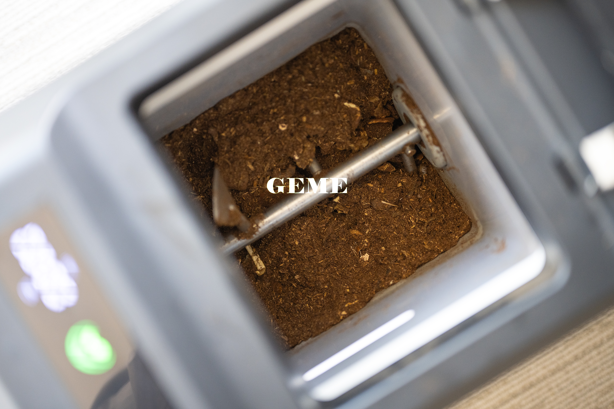

import GemeTerra2CTA from '@site/src/components/GemeTerra2CTA' 
import GemeComposterCTA from '@site/src/components/GemeComposterCTA' 
import RelatedArticles from '@site/src/components/RelatedArticles'
import ReactPlayer from 'react-player'

## Introduction: The \$500 Machine That Keeps Asking for Money

Here's the quick answer: **[The GEME Terra 2](ttps://www.geme.bio/product/terra2?utm_medium=blog&utm_source=geme_website&utm_campaign=general_seo_content&utm_content=best-composter-avoid-recurring-fees-geme-terra-2) is the only kitchen composter on the market with zero recurring fees**. Lomi costs you about \$150–\$200 per year in filters, Mill runs around \$89 annually plus optional pickup fees, and Reencle adds about \$47 per year for replacements. Over three years, that's hundreds of dollars you didn't plan on spending.

Most people buy a kitchen composter based on the upfront price tag. They see \$499 for a Lomi or \$549 for a GEME and make a decision right there. What they don't realize is that some of these machines come with a hidden subscription baked into the design.

I've spent weeks digging through official support pages, maintenance guides, and filter replacement schedules. What I found might surprise you. The cheapest machine upfront often ends up costing the most over time.

This guide breaks down exactly what each major brand charges you after you bring the machine home. No marketing fluff. Just the numbers.

<!-- truncate -->

## 1. GEME Terra 2: The One You Buy Once and Forget

Now let's talk about [**GEME Terra 2**](ttps://www.geme.bio/product/terra2?utm_medium=blog&utm_source=geme_website&utm_campaign=general_seo_content&utm_content=best-composter-avoid-recurring-fees-geme-terra-2). This is the machine that made me write this article.

GEME is a Continuous Aerobic Bio-processor, which uses live microorganisms (Kobold) to digest waste 24/7 . It's not a dehydrator. It doesn't just dry things out. It actually breaks them down biologically.

But here's the part that matters for your wallet. GEME uses a permanent metal-ion oxidation catalyst for odor control. Not a charcoal filter. Not something that saturates and needs replacing.

| Cost Category         | **GEME Terra 2** |
|----------------------|--------------|
| Upfront Price        | \$549         |
| Filter Replacement   | Never        |
| Annual Filter Cost   | \$0           |
| 3-Year Filter Total  | \$0           |

The filter is designed to last the lifetime of the machine. You never buy another one. There are no pods to order, no subscriptions to cancel, no "auto-ship" deals to forget about.

GEME also publishes a daily capacity of up to 2kg per day, which is higher than Reencle's recommended 0.7kg . The 14L chamber means you harvest compost every one to two months.

<GemeTerra2CTA 
 imgSrc="/img/geme-terra-2-composter.jpg"
 productTitle="GEME Terra II: Best Kitchen Composter"
 features={[
    "✅ Best Composter With No Hidden Costs",
    "✅ Biologically Active Composting System",
    "✅ Quiet, Odour-Free, Real Compost",
    "✅ Zero Filter Costs, No Refills",
    "✅ Reduces Composting Time to Days"
 ]}
buttonText="Get Your GEME Terra II"
  href="https://www.geme.bio/product/terra2?utm_medium=blog&utm_source=geme_website&utm_campaign=general_seo_content&utm_content=best-composter-avoid-recurring-fees-geme-terra-2"
/>

## 2. Lomi Composter: The Popular Choice With a Filter Habit

Lomi is probably the name you've heard most. It's a countertop machine that grinds and dehydrates food waste into a dry material they call "Lomi Earth." The machine itself costs around \$499.

But Lomi requires new charcoal filters every three to four months . A two-pack of official filters runs about \$54. Do the math on that.

| Cost Category         | **Lomi**         |
|----------------------|------------------|
| Upfront Price        | \$499             |
| Filter Replacement   | Every 3–4 months |
| Annual Filter Cost   | \$150-\$200        |
| 3-Year Filter Total  | \$450–\$600        |

That means after three years, you've spent somewhere between \$949 and \$1,099 on a machine that cost \$499 upfront. And that's not counting the optional LomiPods they sell for another \$50 per pack.

Lomi's own support documentation notes that the charcoal breaks down faster with heavy use. So if you actually use the thing daily, you're buying filters even more often.

## 3. Mill Composter: The Service Model With Ongoing Fees

Mill takes a different approach. It's a floor-standing unit that dries and grinds scraps into "Food Grounds." Mill is honest about this: their own support site explicitly states that Food Grounds aren't compost.

The pricing model is where things get interesting. You can buy Mill outright for \$999+, or you can rent it for about \$35 per month (\$420/year).

Even if you buy it, you're looking at an \$89 carbon filter replacement about once a year. And if you want <a href="https://www.mill.com/lp/compostcrew-offer" rel="nofollow">the pickup service</a> where they haul your grounds away and turn them into chicken feed, that's another \$192 per year.

| Cost Category        | **Mill**                |
|---------------------|-------------------------|
| Upfront Price       | \$999+                   |
| Filter Cost         | \$89 per year            |
| Optional Pickup     | \$192 per year           |
| 3-Year Filter Total | \$267 (plus pickup if opted) |

Mill is a beautifully designed machine. But it's built around a service ecosystem, not a one-time purchase.

## 4. Reencle Composter: Microbial Tech With Replaceable Parts

Reencle is different from Lomi and Mill. It uses actual microorganisms to break down waste, similar to GEME. That's a good thing. But [Reencle still relies on replaceable filters](https://www.techlicious.com/review/reencle-prime-kitchen-composter-review/).

According to Reencle's official accessory shop, you need to replace the carbon filter (\$35) and the mesh filter (\$12) every 9 to 12 months. That adds up to about \$47 per year.

| Cost Category         | **Reencle**       |
|----------------------|-------------------|
| Upfront Price        | \$499              |
| Carbon Filter        | \$35 per year      |
| Mesh Filter          | \$12 per year      |
| Annual Filter Total  | ~\$47              |
| 3-Year Filter Total  | ~\$141             |

Reencle also recommends an optimal daily input of about 0.7kg, with a maximum of 1kg per day. If your household generates more waste than that, you might find yourself limited.

## 5. What You Actually Pay Over Time

Let's put all these numbers next to each other so you can see the difference clearly.

| **Brand**       | **Upfront** | **Annual Filters** | **3-Year Filter Total** | **Total Cost After 3 Years** |
|-----------------|------------|--------------------|-------------------------|------------------------------|
| Lomi            | \$499       | \$150–\$200          | \$450–\$600               | \$949–\$1,099                  |
| Mill            | \$999+      | \$89                | \$267                    | \$1,266+                      |
| Reencle         | \$499       | ~\$47               | ~\$141                   | ~\$640                        |
| [GEME Terra 2](ttps://www.geme.bio/product/terra2?utm_medium=blog&utm_source=geme_website&utm_campaign=general_seo_content&utm_content=best-composter-avoid-recurring-fees-geme-terra-2)    | \$549       | \$0                 | \$0                      | \$549                         |

That's the whole story right there. GEME costs a little more upfront than Lomi or Reencle, but after three years, you're hundreds of dollars ahead.

If you buy a <a href="https://reencle.co/blogs/news/reencle-vs-lomi-which-food-composter-should-you-buy" rel="nofollow">Lomi</a>, you're essentially pre-paying for three years of filters at the time of purchase. You just don't realize it yet.

## 6. The Permanent Filter Technology: How GEME Does It

You might be wondering how GEME gets away with no filter replacements when everyone else needs them.

Most composters use activated charcoal filters. Charcoal is great at trapping odors, but it has a limited capacity. Those microscopic pores fill up, and once they're full, the filter stops working. You throw it away and buy a new one.

GEME uses a different approach entirely. The [**metal-ion oxidation catalyst**](https://www.geme.bio/how-it-works?utm_medium=blog&utm_source=geme_website&utm_campaign=general_seo_content&utm_content=best-composter-avoid-recurring-fees-geme-terra-2) doesn't trap odors. It destroys them at a molecular level. It's the same kind of technology used in industrial air purification systems, scaled down for your kitchen.

Because nothing gets "filled up," there's nothing to replace. It just keeps working year after year.

[The microbes in GEME (**Kobold**) are also **self-replicating**](https://www.geme.bio/kobold-introduction?utm_medium=blog&utm_source=geme_website&utm_campaign=general_seo_content&utm_content=best-composter-avoid-recurring-fees-geme-terra-2). You buy the starter pack once, and as long as you leave a little compost in the machine when you harvest, the microbes keep living and multiplying. You only need to replace the entire microbe pack **if and when you observe that waste is breaking down much more slowly than usual**.

<GemeTerra2CTA 
 imgSrc="/img/geme-terra-2-composter.jpg"
 productTitle="GEME Terra II: Best Kitchen Composter"
 features={[
    "✅ Best Composter With No Hidden Costs",
    "✅ Biologically Active Composting System",
    "✅ Quiet, Odour-Free, Real Compost",
    "✅ Zero Filter Costs, No Refills",
    "✅ Reduces Composting Time to Days"
 ]}
buttonText="Get Your GEME Terra II"
  href="https://www.geme.bio/product/terra2?utm_medium=blog&utm_source=geme_website&utm_campaign=general_seo_content&utm_content=best-composter-avoid-recurring-fees-geme-terra-2"
/>

## 7. The Output Question: What Are You Actually Getting?

This matters because if you're going to own a composter, you should know what it produces.

Lomi and Mill output dehydrated scraps. Mill is upfront about this: "Food Grounds aren't compost". Lomi's material looks like soil but doesn't have the biological activity that defines real compost.

Reencle and GEME both use microbial processes that produce actual compost. But the difference is in the details.

| **Brand** | **Output Type**                | **Filter Cost** | **Harvest Frequency**  |
|-----------|-------------------------------|-----------------|-----------------------|
| Lomi      | Dehydrated scraps             | \$150+/year      | Every few days        |
| Mill      | Food Grounds (not compost)    | \$89/year        | When bucket fills     |
| Reencle   | Microbial compost             | ~\$47/year       | 3-4 weeks              |
| GEME      | Microbial compost             | \$0              | 1-2 months           |

GEME achieves up to 95% volume reduction, which is why you only harvest every month or two. Less fiddling with the machine, more time actually using the compost.

### The Math on Subscription Fatigue

Here's something I want you to think about. It's not just about the money, though that's important. It's about the mental load.

Every time a filter replacement email lands in your inbox, you have to stop what you're doing, click a link, enter payment info, and wait for shipping. If you forget, the machine starts to smell. If you let it go too long, the odor gets worse and you wonder if something's broken.

That's a subscription. It's just hiding inside a product instead of a monthly bill.

GEME eliminates that entire category of mental overhead. You set it up, you use it, and you never think about ordering parts. The filter is just... there. Working.

## 8. Which One Should You Buy?

I can't tell you what to do with your money. But I can lay out the trade-offs.

**Choose Lomi if**: You want a countertop machine, you're okay with buying filters every few months, and you don't need the output to be real compost.

**Choose Mill if**: You like the idea of a service ecosystem, you want someone else to handle the final processing, and you're comfortable with ongoing fees.

**Choose Reencle if**: You want microbial composting, you're okay with replacing filters once a year, and you don't mind the lower daily capacity.

**Choose GEME Terra 2 if**: You want real compost, you cook daily and generate consistent waste, and you never want to think about buying filters again.

<GemeTerra2CTA 
 imgSrc="/img/geme-terra-2-composter.jpg"
 productTitle="GEME Terra II: Best Kitchen Composter"
 features={[
    "✅ Best Composter With No Hidden Costs",
    "✅ Biologically Active Composting System",
    "✅ Quiet, Odour-Free, Real Compost",
    "✅ Zero Filter Costs, No Refills",
    "✅ Reduces Composting Time to Days"
 ]}
buttonText="Get Your GEME Terra II"
  href="https://www.geme.bio/product/terra2?utm_medium=blog&utm_source=geme_website&utm_campaign=general_seo_content&utm_content=best-composter-avoid-recurring-fees-geme-terra-2"
/>

## 9. FAQ (Answered)

### Q: oes GEME really have zero filter costs?

> A: Yes. The metal-ion oxidation catalyst is permanent. You never replace it.

### Q: How much does Lomi cost per year in filters?

> A: About \$150 to \$200, depending how often you run it.

### Q: Does Mill produce compost or just dried waste?

> A: Mill only produces dried waste. Mill explicitly states that Food Grounds are not compost.

### Q: Does Reencle require filter replacements?

> A: Yes. Carbon filter (\$35) and mesh filter (\$12) every 9–12 months.

### Q: How often do you empty GEME?

> A: About every one to two months, depending on usage.

### Q: Can GEME handle bones?

> A: Small bones like chicken or fish are fine. Large beef or pork bones should be avoided.

### Q: Does Reencle use microbes or dehydration?

> A: Reencle uses microbes, similar to GEME. But it still requires filter replacements.

### Q: Do I need to buy microbes for GEME?

> A: You purchase Kobold starter culture once. The microbes are self-replicating under proper conditions. You only need to replace the entire microbe pack if and when you observe that waste is breaking down much slower than usual. But, you could purchase more Kobold for constant high-speed decomposition depending on your personal needs. 

## Conclusion: The Best Kitchen Composter Without Recurring Fees

Here's the bottom line. Every composter on the market will reduce your food waste. They all do that job. But only one of them does it without asking you for money again later.

**GEME Terra 2 costs \$549**. That's it. No filters next year. No filters the year after. No "auto-ship" subscriptions you forgot to cancel. Just compost, month after month, from a machine that keeps working.

**Lomi costs \$499 plus \$450 over three years. Mill costs \$999 plus ongoing filter and pickup fees. Reencle costs \$499 plus \$141 over three years**.

Do the math for your own situation. Look at how much you'd spend over three, five, or ten years. For me, the choice was clear. I'd rather pay once and be done with it.

If you feel the same way, GEME Terra 2 is the best composter for avoiding recurring fees. Full stop.

<GemeTerra2CTA 
 imgSrc="/img/geme-terra-2-composter.jpg"
 productTitle="GEME Terra II: Best Kitchen Composter"
 features={[
    "✅ Best Composter With No Hidden Costs",
    "✅ Biologically Active Composting System",
    "✅ Quiet, Odour-Free, Real Compost",
    "✅ Zero Filter Costs, No Refills",
    "✅ Reduces Composting Time to Days"
 ]}
buttonText="Get Your GEME Terra II"
  href="https://www.geme.bio/product/terra2?utm_medium=blog&utm_source=geme_website&utm_campaign=general_seo_content&utm_content=best-composter-avoid-recurring-fees-geme-terra-2"
/>

<GemeComposterCTA 
 imgSrc="/img/geme-bio-composter.jpg"
 productTitle="GEME Pro Composter"
 features={[
    "✅ Best Composter With No Hidden Costs",
    "✅ Produce Soil-Ready Compost For Plant Growth",
    "✅ Quiet, Odor-Free, Quick(6-8 hours)",
    "✅ Large Capacity (19 L) For Daily Waste"
  ]}
buttonText="Get Your GEME Pro"
  href="https://www.geme.bio/product/geme?utm_medium=blog&utm_source=geme_website&utm_campaign=general_seo_content&utm_content=?utm_medium=blog&utm_source=geme_website&utm_campaign=general_seo_content&utm_content=best-composter-avoid-recurring-fees-geme-terra-2"
/>

👉 [Learn More About GEME Terra II](https://www.geme.bio/product/terra2?utm_medium=blog&utm_source=geme_website&utm_campaign=general_seo_content&utm_content=best-composter-avoid-recurring-fees-geme-terra-2)

👉 [Explore GEME Pro for Flower Shops](https://www.geme.bio/product/geme?utm_medium=blog&utm_source=geme_website&utm_campaign=general_seo_content&utm_content=?utm_medium=blog&utm_source=geme_website&utm_campaign=general_seo_content&utm_content=best-composter-avoid-recurring-fees-geme-terra-2)

<RelatedArticles
  slugs={[
  "how-to-compost-cut-flowers-guide",
  "how-long-does-bokashi-take-to-compost",
  "how-to-care-for-hydrangeas-and-change-colors",
  "best-composter-daily-operation-comparison-lomi-mill-reencle-geme",
  "how-long-does-pizza-last-in-fridge-guide",
  "how-to-compost-eggshells-guide-geme",
  "how-to-compost-coffee-grounds-guide",
  "never-buy-carbon-filter-for-your-composter",
  "best-composter-fastest-real-compost-geme-terra-2",
  "how-to-compost-at-home-beginners-guide",
  "how-long-can-chicken-stay-in-the-fridge",
  "how-to-reduce-odor-indoor-composting-tips",
  "how-long-can-ground-beef-stay-in-the-fridge",
  "nyc-composting-fines-2026-geme-terra-2-best-electric-compost",
  "best-indoor-composter-for-apartment-geme-vs-lomi",
  "the-best-composter-for-kitchen",
  "how-to-reduce-food-waste-during-spring-festival",
  "does-reencle-composter-produce-real-compost",
  "does-mill-composter-really-compost",
  "how-to-reduce-food-waste-at-home-2026",
  "free-mcnugget-caviar-raises-food-waste-concerns",
  "composting-in-winter",
  "how-to-compost-at-home",
  "zero-waste-home-kitchen-composter",
  "does-lomi-composter-really-compost",
  "5-best-kitchen-composters-in-2026",
  "best-kitchen-composter-in-2026-geme-terra-2",
  "geme-vs-reencle-composter-2026",
  "geme-vs-mill-composter-2026",
  "best-kitchen-composter-2026",
  "advanced-geme-compost-application-guide",
  "electric-compost-bin-filters-costs-comparison",
  "geme-vs-lomi", 
  "geme-terra-2-debuts",
  "the-best-composter-to-reduce-food-waste",
  "compost-pile-vs-electric-composter",
  "how-to-make-bananas-last-longer",
  "how-long-do-apples-last-in-the-fridge",
  "can-i-compost-moldy-grapes",
  "can-you-compost-moldy-bread",
  ]}
/>

_Ready to transform your gardening game? Subscribe to our [newsletter](http://geme.bio/signup?utm_medium=blog&utm_source=geme_website&utm_campaign=general_seo_content&utm_content=how-to-compost-at-home-beginners-guide) for expert composting tips and sustainable gardening advice._

