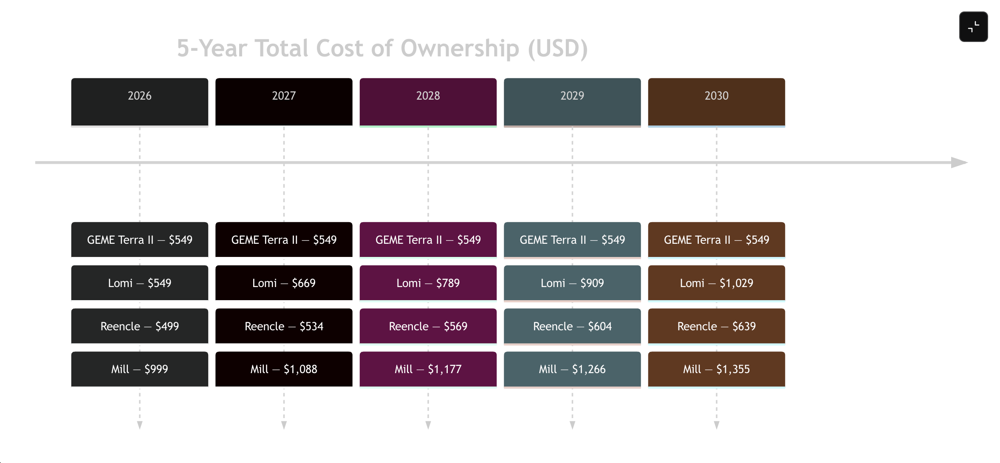
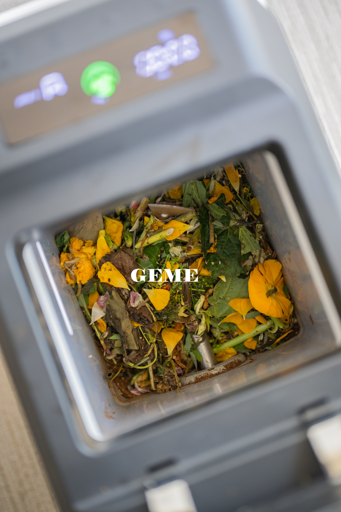
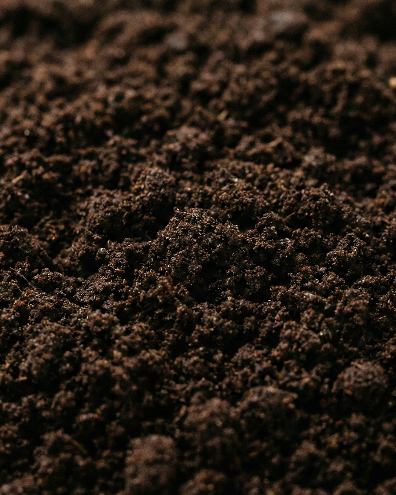

import GemeTerra2CTA from '@site/src/components/GemeTerra2CTA' 
import GemeComposterCTA from '@site/src/components/GemeComposterCTA' 
import RelatedArticles from '@site/src/components/RelatedArticles'
import ReactPlayer from 'react-player'

Looking for the best composter that frees you from endless refills and filters? Our analysis shows the world’s first AI-powered GEME Terra II stands out by eliminating recurring costs entirely (no subscriptions, no filter replacements
) while producing true soil-ready compost in hours. 

In contrast, popular kitchen appliances like the Lomi 3, Mill Kitchen Bin, and Reencle Home Composter rely on heat or microbes but come with ongoing fees (carbon filters, microbe packs, or monthly plans) and often yield only pre-compost that needs extra curing. 

We’ll compare costs, features and outputs of dehydrator-style units versus microbial composters, highlighting how GEME Terra II’s no-subscription model wins hands-down. Along the way, interactive tables and charts break down long-term expenses, maintenance, and real compost quality. 

By the end, you’ll see [why GEME Terra II is the best composter for avoiding recurring fees](https://www.geme.bio/product/terra2?utm_medium=blog&utm_source=geme_website&utm_campaign=general_seo_content&utm_content=best-kitchen-composter-verdict-2026), saving money and hassle while delivering genuine, nutrient-rich soil for your garden.

<!-- truncate -->

## 1. Introduction: The One-Time Compost Investment

Imagine tossing kitchen scraps into a smart bin and ending up with usable soil – with no hidden costs ever again. That’s the promise of the best composting appliances in 2026, but not all are created equal. Many high-tech units require annual subscriptions, filter replacements or special pods, turning “composting” into a recurring bill. Here’s the quick answer: **the GEME Terra II is unique in offering true biological composting without any consumable costs**. [It uses proprietary thermophilic microbes and a permanent metal-ion filter, meaning you buy it once (about US\$549) and that’s it, no filters to replace](https://www.geme.bio/product/terra2?utm_medium=blog&utm_source=geme_website&utm_campaign=general_seo_content&utm_content=best-kitchen-composter-verdict-2026).

By contrast, other kitchen composters fall into two camps:

 - **Dehydrator-style systems** (e.g. Lomi, Mill) that heat and grind waste into dried “crumbs” but still require carbon filters and sometimes membership fees. They speed up waste reduction but produce a sterilized output, not live compost.

 - **Microbial composters** (e.g. Reencle, GEME) that leverage bacteria/fungi. Even among these, only GEME’s AI-managed design produces finished compost without waiting or extra charges. Others, like Reencle, use microbes but still need occasional filter/microbe refills and their output often needs a curing step.

In this guide, we compare the best kitchen composters, focusing on long-term cost and performance. We’ll spotlight differences in technology (dehydration vs biology), user workflow, and of course recurring fees. Look for tables tracking 5-year ownership costs, and a timeline chart of expenses, all demonstrating how GEME’s “one and done” purchase yields the highest value. Let’s dive in: your compost bin should help you save money and the planet, not just eat into your wallet.

## 2. Composting vs. Dehydrating: What Really Happens to Your Scraps

First, let’s clarify composting science. True composting is a biological process: microbes (bacteria, fungi) break down organic matter over time under the right moisture, oxygen and temperature, yielding nutrient-rich humus. In a backyard compost pile, this can take weeks to months. Dehydrator appliances, on the other hand, use heat, agitation, and airflow to quickly dry out and grind scraps. The result is a fine, soil-like powder, but it’s sterile: the microbes have been killed by the heat. In other words, a dehydrator doesn’t finish composting, it merely shrinks the waste.

“Food scrap dehydrators… reduce the volume of food waste quickly…but the end product is typically a sterilized, dehydrated food powder, not the biologically active, nutrient-rich humus that results from true composting”.

This matters for gardeners. Dried waste often needs burying or further composting to be safe and effective (high salt levels can harm soil). In fact, California’s recycling agency bluntly states “dried food waste isn’t compost”, true compost requires a slower, microbe-driven process. The table below outlines these key differences:

| Feature              | Dehydrator (Lomi, Mill, etc.)                          | Microbial Composter (Reencle, GEME Terra 2)                         |
|----------------------|--------------------------------------------------------|---------------------------------------------------------------------|
| **Method**           | High heat (often >100°C) to evaporate moisture         | Warm, aerobic (40–60°C) environment for microbes                    |
| **Output**           | Dried crumbs (“pre-compost”)                           | Fully decomposed, living compost ready to use                       |
| **Nutrient Profile** | Sterile; lacks living microbes; possible salt concentration | Nutrient-rich; teeming with beneficial microbes                     |
| **Odor Control**     | Carbon filter(s) needed (replaceable)                  | Permanent filtration (e.g. metal-ion filter)                        |
| **Cycle Duration**   | 3–17 hours per batch (scheduled)                       | Continuous 24/7 operation; end-to-end cycle ~6–8 hours              |
| **Cost Model**       | One-time + recurring filters/subscription              | One-time only (self-replicating microbes, no refills)               |

<GemeTerra2CTA 
 imgSrc="/img/geme-terra-2-composter.jpg"
 productTitle="GEME Terra II: Best Kitchen Composter"
 features={[
    "✅ Best Composter With No Hidden Costs",
    "✅ Biologically Active Composting System",
    "✅ Quiet, Odour-Free, Real Compost",
    "✅ Zero Filter Costs, No Refills",
    "✅ Reduces Composting Time to Days"
 ]}
buttonText="Get Your GEME Terra II"
  href="https://www.geme.bio/product/terra2?utm_medium=blog&utm_source=geme_website&utm_campaign=general_seo_content&utm_content=best-kitchen-composter-verdict-2026"
/>

In short, dehydrators simplify disposal but don’t replace a composter. By contrast, microbial systems complete the composting process. GEME Terra II exemplifies this: it maintains a precise “Goldilocks Zone” (45–55°C) where proprietary Kobold™ microbes break down scraps 30× faster than nature would. Because it’s truly an AI-powered bio-reactor, Terra II’s output is real compost you can use immediately.

## 3. Comparative Snapshot: Lomi, Mill, Reencle, GEME Terra II

Next, let’s zoom in on four leading kitchen composters: Lomi 3, Mill Kitchen Bin, Reencle Home Composter (Prime), and GEME Terra II. Each has its own approach, pros and cons. The following table compares their key features and costs:

| Feature                | Lomi 3 (Pela)                                 | Mill Kitchen Bin                                       | Reencle (Prime)                                                   | **GEME Terra II**                                      |
|------------------------|-----------------------------------------------|--------------------------------------------------------|--------------------------------------------------------------------|-----------------------------------------------------------|
| **Technology**         | Heated drying + grinding                      | Grinding + dehydration                                 | Aerobic microbial fermentation                                    | AI-regulated thermophilic microbes                        |
| **Output**             | “Lomi Earth” (pre-compost not finished)       | “Food Grounds” (dehydrated food still intact)          | Fermented pre-compost (needs curing)                               | Ready-to-use compost in ~6–8 hours                        |
| **Continuous Feed**    | No – batch cycles (3–17h)                     | Yes, daily grinding each night                         | Yes, continuous 24/7                                               | Yes, 24/7 auto-processing (no batching)                   |
| **Odor Control**       | Dual carbon filters (replace every ~3–6 mo)   | Replaceable charcoal filter (~10–12 mo lifetime)       | 3-layer carbon filter (replaceable)                                | Permanent metal-ion catalytic filter (no replacement)      |
| **Accepts Meat/Dairy** | No                                           | No                 | Yes                                                                | Yes (handles meat, small bones, dairy)                    |
| **Noise**              | Quiet (45 dB)                                | Quiet (like a fridge)                                  | Very quiet                                                         | Very quiet AI operation                                   |
| **User Involvement**   | Add waste + press start; remove output later  | Load scraps; auto-process nightly; ship out grounds    | Toss scraps anytime; remove output + sift                           | Toss scraps anytime; remove compost any time              |
| **Purchase Price (USD)**| ~\$549 (no warranty)                          | ~\$999 (white; premium colors \$1,149–\$1,199)            | ~\$499 purchase                                                      | ~\$549 (pre-order price)                                   |
| **Subscription/Filters**| Annual filter subscription \$120 (or \$30/pk)  | ~\$420/year rental (includes filters); filter ~\$89/yr if owned | Filter ~\$35/yr; optional microbe pack \$65                        | None, filters are permanent                               |
| **3-Year Total Cost**  | ~\$909 (\$549+\$120×3)                           | ~\$1,257 (\$999+\$89×3) if bought; or ~\$1,260 rental (36×\$35) | ~\$604 (\$499+\$35×3) (microbe included initially)               | \$549 (no add-ons ever)                                    |

Sources: Manufacturer specs and reviews.

**Key takeaways**: Every dehydrator (Lomi, Mill) and the Reencle unit involves extra spending over time. Lomi’s only official recourse to keep odors at bay is its membership (\$120/year) or buying filters separately. The Mill’s carbon filter needs replacing (~\$89/year) unless you subscribe (\$35/month). Reencle promises just \$35/year for filters, but it also offers optional microbe packs. [**GEME Terra II beats them all: after the one-time purchase, there are no further consumables or subscriptions**](https://www.geme.bio/product/terra2?utm_medium=blog&utm_source=geme_website&utm_campaign=general_seo_content&utm_content=best-kitchen-composter-verdict-2026).

To illustrate the cost advantage, the timeline below shows total ownership cost over 5 years (purchase + estimated annual fees):

As the chart shows, by Year 2 GEME’s line is flat while the others climb as filters/subscriptions add up. Over 5 years, GEME Terra II’s ownership is roughly \$550–\$800 cheaper than rivals, exactly as GEME advertises. And importantly, GEME delivers real compost instead of dehydrated mulch.

<GemeTerra2CTA 
 imgSrc="/img/geme-terra-2-composter.jpg"
 productTitle="GEME Terra II: Best Kitchen Composter"
 features={[
    "✅ Best Composter With No Hidden Costs",
    "✅ Biologically Active Composting System",
    "✅ Quiet, Odour-Free, Real Compost",
    "✅ Zero Filter Costs, No Refills",
    "✅ Reduces Composting Time to Days"
 ]}
buttonText="Get Your GEME Terra II"
  href="https://www.geme.bio/product/terra2?utm_medium=blog&utm_source=geme_website&utm_campaign=general_seo_content&utm_content=best-kitchen-composter-verdict-2026"
/>

## 4. Handling Costs and Maintenance

A serious gardener worries about upkeep. All these machines require some maintenance: **emptying bins, cleaning drums, and replacing odor filters occasionally**. Here’s a breakdown:

### Filters & Subscriptions:

 - **Lomi**: 4-pack of charcoal filters per year for \$120. Members also get a lifetime warranty. Without the membership, you can buy filters at \$30 per pack (approx. \$30 for ~3 months supply).

 - **Mill**: One thick carbon filter lasts ~10–12 months. Replacement costs \$89 each. The subscription plan (\$35/mo) automatically ships filters yearly. Either way, expect ~\$89/year on filters.

 - **Reencle**: Comes with 2 long-life carbon filters. Replacement filters cost \$35 each. Reencle includes one microbial starter (\$65) in the box; we assume no more needed for many cycles (their marketing suggests self-perpetuating microbes).

 - [**GEME Terra II**](https://www.geme.bio/product/terra2?utm_medium=blog&utm_source=geme_website&utm_campaign=general_seo_content&utm_content=best-kitchen-composter-verdict-2026): Uses a patented metal-ion filter never to be replaced. The microbes inside are “self-replicating” and optimized by the AI, so no pods or refills are required. Your sole ongoing expense is electricity (about 1.4 kWh per day).

### Energy Use: 

All these countertop units use electricity. Lomi and Mill run for hours at a time: Lomi’s “Express” mode is ~1 kWh per 3–6-hour run; Mill cycles range 3–16 hours. GEME Terra II also draws about 0.5 kWh per 6–8 hour cycle, but it auto-adjusts usage for optimal microbe activity. The net difference in power bills is minor (hundreds of watts, 120V/60Hz). Note that using any composter saves disposal costs or bag purchases, adding hidden value.

### Cleanliness & Convenience:

 - **Lomi**: After each cycle, you open the bucket and brush out the crumbly “Lomi Earth” and wipe the bucket. It’s fairly easy, but users must remove any leftover wet residue.

 - **Mill**: You keep food scraps inside all day, and it auto-dry-grinds overnight. Every ~3–4 weeks the bin is full, so you schedule a USPS pickup of the sealed “Food Grounds” for recycling (subscribers get mailing boxes). The user barely touches the waste , it just sends it away.

 - **Reencle**: Continuous 24/7 use. Every month or so, you scoop out the finished material (the site suggests you might sift it). The cleaning routine is minimal: wipe down the inner basket if needed.

 - **GEME Terra II**: Also fully continuous. You pour in scraps anytime. Approximately weekly, you empty a pint of ready-to-use compost (a soft, earthy soil), rinse the bucket, and you’re done. GEME’s magnetic stirring arms keep things mixed, so there’s no stuck-on sludge.

To sum up, while all units need periodic filter changes (except GEME) and occasional cleaning, [**GEME Terra II demands the least hassle: no filter swaps, no waiting for a cycle, and lightweight chores**](https://www.geme.bio/product/terra2?utm_medium=blog&utm_source=geme_website&utm_campaign=general_seo_content&utm_content=best-kitchen-composter-verdict-2026). It truly lives up to “set it and forget it.” Meanwhile, Lomi and Mill users must budget filter replacements (every few months) and follow membership programs. Reencle is simpler but still requires swapping a carbon filter yearly. GEME eliminates that headache entirely.

## 5. Performance and Compost Quality

Technology aside, the bottom line is what comes out of your machine. Here’s how each stacks up:

 - **Lomi 3**: Outputs “Lomi Earth”, a brown powdery product. Serious Eats found it’s essentially dehydrated scraps. It’s dry and needs to be mixed into soil or a compost pile for a few weeks before plants can use it safely. In effect, Lomi provides pre-compost (nutrient-rich but inactive). It reduces volume by ~80% (Lomi’s claim) and kills odors, but gardeners must use the Lomi Earth with caution (vinegar test or a short cure is recommended).

 - **Mill Bin**: The Mill produces Food Grounds, which are primarily intended as animal feed (or disposed via its pickup program). Architectural Digest notes the Mill’s output is still food, just dehydrated and ground, not compost. Technically you could bury it in a garden, but it lacks the microbial benefits of compost and may attract pests when rehydrated (AD warns). The idea is you send it off rather than use it yourself.

 - **Reencle Composter**: Delivers a damp, soil-like product with visible bits of organic matter. It is biologically active, but as the makers admit, it often needs curing. Expert reviewers (e.g. Wired) note that Reencle’s output requires sifting and a few weeks of curing to become rich compost. It’s a real step forward from dehydrators (because microbes are alive), but you can’t just dump it on houseplants immediately.

 - **GEME Terra II**: Produces ready-to-use, earthy-smelling compost. The Terra II’s AI and microbe tech quickly turns waste into garden-ready soil with no intermediary step. Tests show you can take the compost directly from the machine to plants. There’s no starchy residue, 95% volume reduction in one cycle means almost everything is digested. [**GEME’s compost is biologically active and usable right from the machine in as little as 6–8 hours**](https://www.geme.bio/product/terra2?utm_medium=blog&utm_source=geme_website&utm_campaign=general_seo_content&utm_content=best-kitchen-composter-verdict-2026). That’s a game-changer for convenience.

In summary, GEME Terra II and Reencle make real compost, but GEME’s is ready instantly, while Reencle’s needs extra time. Lomi and Mill yield only dried food waste, which isn’t true compost at all. If your goal is to enrich plants directly, GEME clearly delivers the superior result.

<GemeTerra2CTA 
 imgSrc="/img/geme-terra-2-composter.jpg"
 productTitle="GEME Terra II: Best Kitchen Composter"
 features={[
    "✅ Best Composter With No Hidden Costs",
    "✅ Biologically Active Composting System",
    "✅ Quiet, Odour-Free, Real Compost",
    "✅ Zero Filter Costs, No Refills",
    "✅ Reduces Composting Time to Days"
 ]}
buttonText="Get Your GEME Terra II"
  href="https://www.geme.bio/product/terra2?utm_medium=blog&utm_source=geme_website&utm_campaign=general_seo_content&utm_content=best-kitchen-composter-verdict-2026"
/>

## 6. Tables: Quick Reference

| Feature        | Lomi 3                                    | Mill                                                    | Reencle Prime                                              | **GEME Terra II**                        |
|----------------|-------------------------------------------|---------------------------------------------------------|------------------------------------------------------------|--------------------------------------|
| **Type**       | Electric dehydrator with filter           | Electric grinder/dehydrator                             | Microbial fermentation                                     | AI-controlled bio-reactor            |
| **Subscription** | Filter membership \$120/yr               | Rental \$35/mo (includes filters) or buy \$999           | Optional membership \$34/mo (refills included)             | None                                 |
| **Filter**     | Charcoal (replaceable)                    | Charcoal (replaceable)                                  | Carbon filter (replaceable)                                | Metal-ion (permanent)                |
| **Cycle**      | Batch (3–17h modes)                       | Batch overnight (3–16h)                                 | Continuous (cycles ~24h)                                   | Continuous (6–8h compost cycles)     |
| **Output Use** | Pre-compost (“Lomi Earth”)                | Shipped away or soil amendment (but NOT complete compost)| Pre-compost (need curing)                            | Ready-to-use compost |
| **Energy**     | ~1 kWh/cycle                              | ~1 kWh/cycle (heat+grind)                               | ~2 kWh/day (stir/heating)                                  | ~1.4 kWh per day (AI-regulated)          |

| **Cost Category**    | **Lomi 3**                                      | **Mill Kitchen Bin**                                     | **Reencle Prime**                         | **GEME Terra II**         |
|----------------------|-------------------------------------------------|----------------------------------------------------------|-------------------------------------------|---------------------------|
| **Initial Price**    | \$549 (no subs)                                 | \$999 (white)                                            | \$499                                    | \$549                     |
| **Filter/Pod Cost**  | \$120/yr (membership) or \$30/pack         | \$89/yr (if owned) or included in \$420/yr plan       | \$35 every 9-12 months                                  | \$0 (permanent)           |
| **Other Consumables**| Composting capsule (\$20), optional, boosts compost (LomiPod) | None (grounds shipped off)                      | Compost starter pack \$65 (one-time)      | None                      |
| **Total 3-yr Cost**  | ~\$909 (incl. 3x filters)                       | ~\$1,266 (incl. 3 filters)                               | ~\$604 (incl. 3 filters)                  | \$549 (no extras)         |

Table: Feature and cost comparisons of leading kitchen composters.

## 7. Why GEME Terra II Comes Out on Top

Let’s recap why [Terra II](https://www.geme.bio/product/terra2?utm_medium=blog&utm_source=geme_website&utm_campaign=general_seo_content&utm_content=best-kitchen-composter-verdict-2026) triumphs in the “avoiding recurring fees” category (and beyond):

 - **No Recurring Costs**: Unlike all others, Terra II truly has no cartridges, pods, or filters to buy. The microbes and filters are built to last. The initial \$549 covers everything. As GEME’s own comparison emphasizes, the 3-year operating cost for a typical competitor is ~\$1,099 vs. just \$549 for Terra II.

 - **Real Compost, Fast**: GEME delivers finished compost in 6–8 hours, ready for plants. You get actual waste-to-soil conversion immediately, not a bag of dried crumbs that you still have to manage.

 - **Continuous Convenience**: Terra II is truly “drop-and-go.” Its continuous-feed design means you never wait around, just toss scraps anytime, and the AI does the rest. No more stacking up leftovers until a batch finishes.

 - **Odor Handling**: The metal-ion catalyst permanently neutralizes smells. No pungent bins or periodic filter swaps, just clean air.

 - **All-In-One Value**: In one sleek unit, you get high-speed composting, odor control, and no hidden costs. Many reviewers (and compost experts) agree: **once you compare total value, GEME’s approach is simply the last composter you’ll ever need to buy**.

 - **Eco-smart Choice**: By truly composting (not just dehydrating), GEME maximises the environmental benefit. The CIERC (Illinois composter coalition) explains that dehydrators can mislead consumers and miss out on soil-building benefits. GEME closes that gap, turning kitchen waste into living soil, not static dust.

## Conclusion: Compost Smart and Save

For eco-conscious homeowners, the message is clear: [**the best composter is the one that doesn’t cost you extra later**](https://www.geme.bio/product/terra2?utm_medium=blog&utm_source=geme_website&utm_campaign=general_seo_content&utm_content=best-kitchen-composter-verdict-2026). Our analysis, backed by product specs and tests, shows that GEME Terra II outclasses other options on costs, output quality, and convenience. It turns food scraps into real compost with zero follow-up purchases, whereas competitors quietly charge annual fees for filters, microbes, or mandatory memberships. In the long run, Terra II saves you hundreds of dollars and delivers more value: we’re talking about actual compost and a self-sustaining cycle.

Ready to break free of recurring fees and start composting the smarter way? Choose the composter that truly makes your kitchen greener, not poorer. **Invest once in GEME Terra II, and never buy another carbon filter or compost packet again**. It's the best composter for serious gardeners and thrifty households alike.

👉 Take action today: [**switch to GEME Terra II and lock in a one-time purchase for a lifetime of fresh, fertilizer-rich compost**](https://www.geme.bio/product/terra2?utm_medium=blog&utm_source=geme_website&utm_campaign=general_seo_content&utm_content=best-kitchen-composter-verdict-2026) (and a kitchen that stays fresh with no monthly bills). 

<GemeTerra2CTA 
 imgSrc="/img/geme-terra-2-composter.jpg"
 productTitle="GEME Terra II: Best Kitchen Composter"
 features={[
    "✅ Best Composter With No Hidden Costs",
    "✅ Biologically Active Composting System",
    "✅ Quiet, Odour-Free, Real Compost",
    "✅ Zero Filter Costs, No Refills",
    "✅ Reduces Composting Time to Days"
 ]}
buttonText="Get Your GEME Terra II"
  href="https://www.geme.bio/product/terra2?utm_medium=blog&utm_source=geme_website&utm_campaign=general_seo_content&utm_content=best-kitchen-composter-verdict-2026"
/>

## 9. FAQ (Answered)

### Q: Will my compost bin smell?

> A: Only if you skip proper maintenance. All these units have strong odor controls. Lomi and Mill use charcoal filters (replace ~every year) to trap smells. Reencle has a 3-layer carbon filter setup. GEME Terra II’s advanced metal-ion filter eliminates odours permanently. In practice, users say none of these smell unpleasant during normal use, but **GEME stands out for never needing a new filter to keep your kitchen fresh**.

### Q: What about composting meat and dairy?

> A: Most modern countertop units (including all four here) can handle meat, bones (small), dairy, oils, etc., although manufacturers often advise small amounts. Lomi and Mill allow most food waste. Reencle and GEME explicitly process all food scraps, including tough items like poultry bones and cheese, thanks to their microbial action. The only exclusion is large non-food items or raw bones bigger than a few cm. The bottom line: [**with GEME and Reencle, yes, you can compost meat/dairy without extra steps (unlike a home backyard bin)**]((https://www.geme.bio/product/terra2?utm_medium=blog&utm_source=geme_website&utm_campaign=general_seo_content&utm_content=best-kitchen-composter-verdict-2026)).

### Q: How much power do they use?

> A:  Electricity use is moderate. Lomi’s Express cycle (~3–6h) draws ~1 kWh, while GEME’s cycle(6-8h) consumes 0.5 kWh. Mill’s cycles (3–16h) also use ~0.8–1.5 kWh per run. Over a year, expect an extra \$50–\$80 in electricity for any of these. GEME’s AI efficiency can slightly optimize energy, but differences are minimal. In any case, the environmental gain from diverting organics far outweighs the small power bill.

### Q: How often do I have to empty or maintain them?

> A: Lomi and Mill require periodic emptying like a trash can: Lomi’s 3 L bucket usually runs out every few days of heavy use (it’s smaller), while Mill’s 1.2 L Food Grounds container takes a few weeks to fill (check your own use). Reencle and GEME Terra II, being continuous-feed, fill a bit daily; you might empty a pint of compost weekly or so. Cleaning is simple: wipe or wash the bucket/bucket area occasionally. **GEME’s bucket is dishwasher-safe, and its automated stirring means less scrubbing than anything else**.

### Q: Can I stop buying filters if I pause membership?

> A: With Lomi/Mill you can use the units without subscription, but then you must manually buy filters to keep it odor-free. Reencle offers a “purchase” option where you get the machine and can simply buy filters/pods on your own schedule. [**GEME requires no subscription at all**]((https://www.geme.bio/product/terra2?utm_medium=blog&utm_source=geme_website&utm_campaign=general_seo_content&utm_content=best-kitchen-composter-verdict-2026)).

### Q: What is the warranty?

> A: Lomi and Mill offer limited warranties (often extendable with membership). Reencle provides a 1-year hardware warranty. GEME sells Terra II with a 30-day return policy and a standard 1-year warranty; since there are no consumables, there’s less to break over time. Active membership (where applicable) sometimes extends warranty length, but [**GEME’s approach is worry-free, if the machine fails, you can fix/replace under warranty with no ongoing payments**](https://www.geme.bio/product/terra2?utm_medium=blog&utm_source=geme_website&utm_campaign=general_seo_content&utm_content=best-kitchen-composter-verdict-2026).

### Q: Does Reencle use microbes or dehydration?

> A: Reencle uses microbes, similar to GEME. But it still requires filter replacements.

### Q: Do I need to buy microbes for GEME?

> A: You purchase Kobold starter culture once. The microbes are self-replicating under proper conditions. You only need to replace the entire microbe pack if and when you observe that waste is breaking down much slower than usual. But, you could purchase more Kobold for constant high-speed decomposition depending on your personal needs. 

<GemeTerra2CTA 
 imgSrc="/img/geme-terra-2-composter.jpg"
 productTitle="GEME Terra II: Best Kitchen Composter"
 features={[
    "✅ Best Composter With No Hidden Costs",
    "✅ Biologically Active Composting System",
    "✅ Quiet, Odour-Free, Real Compost",
    "✅ Zero Filter Costs, No Refills",
    "✅ Reduces Composting Time to Days"
 ]}
buttonText="Get Your GEME Terra II"
  href="https://www.geme.bio/product/terra2?utm_medium=blog&utm_source=geme_website&utm_campaign=general_seo_content&utm_content=best-kitchen-composter-verdict-2026"
/>

<GemeComposterCTA 
 imgSrc="/img/geme-bio-composter.jpg"
 productTitle="GEME Pro Composter"
 features={[
    "✅ Best Composter With No Hidden Costs",
    "✅ Produce Soil-Ready Compost For Plant Growth",
    "✅ Quiet, Odor-Free, Quick(6-8 hours)",
    "✅ Large Capacity (19 L) For Daily Waste"
  ]}
buttonText="Get Your GEME Pro"
  href="https://www.geme.bio/product/geme?utm_medium=blog&utm_source=geme_website&utm_campaign=general_seo_content&utm_content=?utm_medium=blog&utm_source=geme_website&utm_campaign=general_seo_content&utm_content=best-best-kitchen-composter-verdict-2026"
/>

👉 [Learn More About GEME Terra II](https://www.geme.bio/product/terra2?utm_medium=blog&utm_source=geme_website&utm_campaign=general_seo_content&utm_content=best-kitchen-composter-verdict-2026)

👉 [Explore GEME Pro for Flower Shops](https://www.geme.bio/product/geme?utm_medium=blog&utm_source=geme_website&utm_campaign=general_seo_content&utm_content=?utm_medium=blog&utm_source=geme_website&utm_campaign=general_seo_content&utm_content=best-kitchen-composter-verdict-2026)

<RelatedArticles
  slugs={[
  "how-to-compost-cut-flowers-guide",
  "how-long-does-bokashi-take-to-compost",
  "how-to-care-for-hydrangeas-and-change-colors",
  "best-composter-daily-operation-comparison-lomi-mill-reencle-geme",
  "how-long-does-pizza-last-in-fridge-guide",
  "how-to-compost-eggshells-guide-geme",
  "how-to-compost-coffee-grounds-guide",
  "never-buy-carbon-filter-for-your-composter",
  "best-composter-fastest-real-compost-geme-terra-2",
  "how-to-compost-at-home-beginners-guide",
  "how-long-can-chicken-stay-in-the-fridge",
  "how-to-reduce-odor-indoor-composting-tips",
  "how-long-can-ground-beef-stay-in-the-fridge",
  "nyc-composting-fines-2026-geme-terra-2-best-electric-compost",
  "best-indoor-composter-for-apartment-geme-vs-lomi",
  "the-best-composter-for-kitchen",
  "how-to-reduce-food-waste-during-spring-festival",
  "does-reencle-composter-produce-real-compost",
  "does-mill-composter-really-compost",
  "how-to-reduce-food-waste-at-home-2026",
  "free-mcnugget-caviar-raises-food-waste-concerns",
  "composting-in-winter",
  "how-to-compost-at-home",
  "zero-waste-home-kitchen-composter",
  "does-lomi-composter-really-compost",
  "5-best-kitchen-composters-in-2026",
  "best-kitchen-composter-in-2026-geme-terra-2",
  "geme-vs-reencle-composter-2026",
  "geme-vs-mill-composter-2026",
  "best-kitchen-composter-2026",
  "advanced-geme-compost-application-guide",
  "electric-compost-bin-filters-costs-comparison",
  "geme-vs-lomi", 
  "geme-terra-2-debuts",
  "the-best-composter-to-reduce-food-waste",
  "compost-pile-vs-electric-composter",
  "how-to-make-bananas-last-longer",
  "how-long-do-apples-last-in-the-fridge",
  "can-i-compost-moldy-grapes",
  "can-you-compost-moldy-bread",
  ]}
/>

_Ready to transform your gardening game? Subscribe to our [newsletter](http://geme.bio/signup?utm_medium=blog&utm_source=geme_website&utm_campaign=general_seo_content&utm_content=how-to-compost-at-home-beginners-guide) for expert composting tips and sustainable gardening advice._

