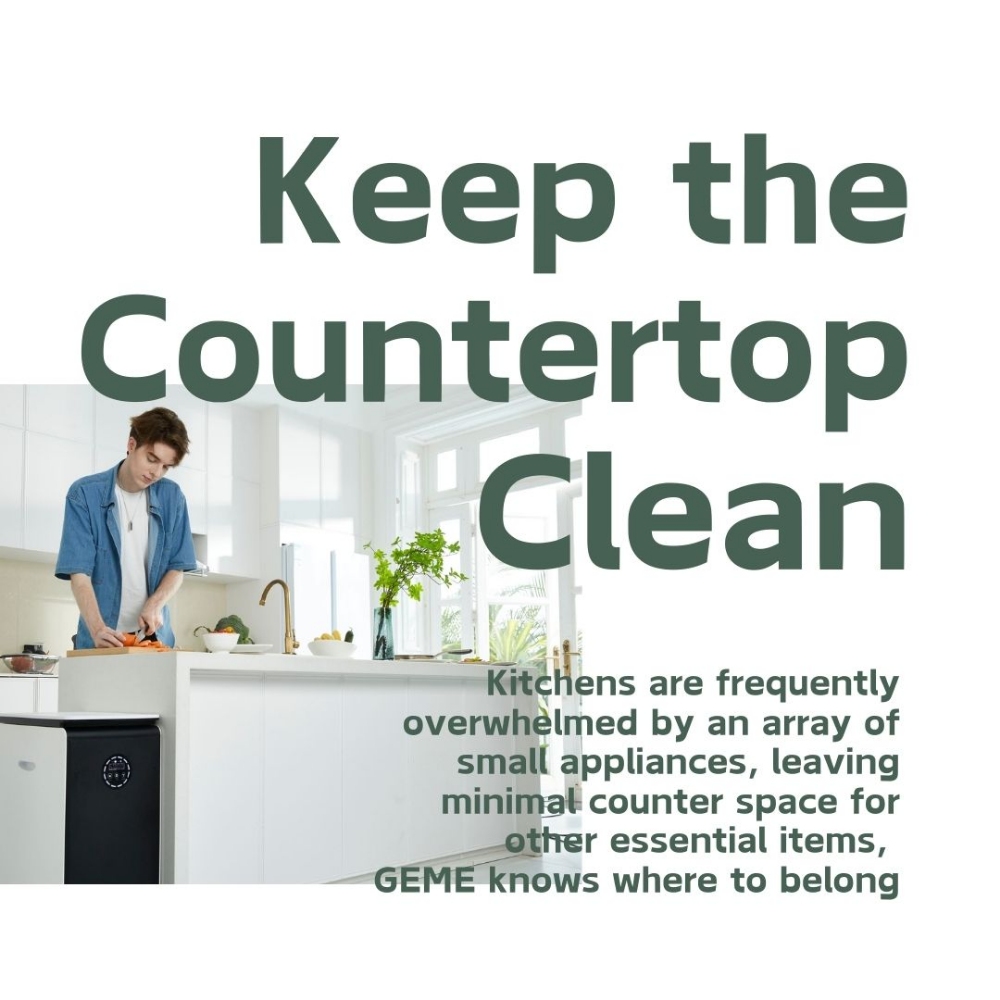
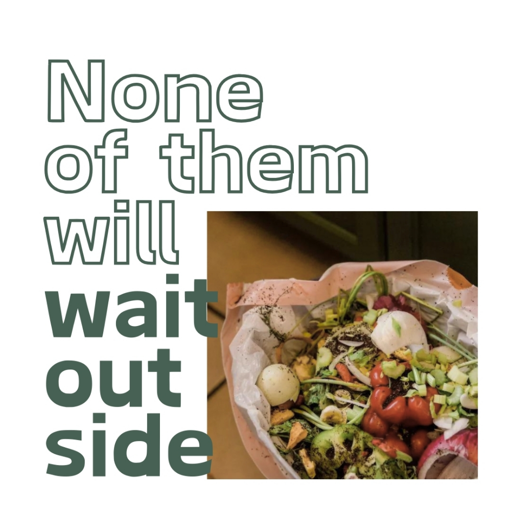
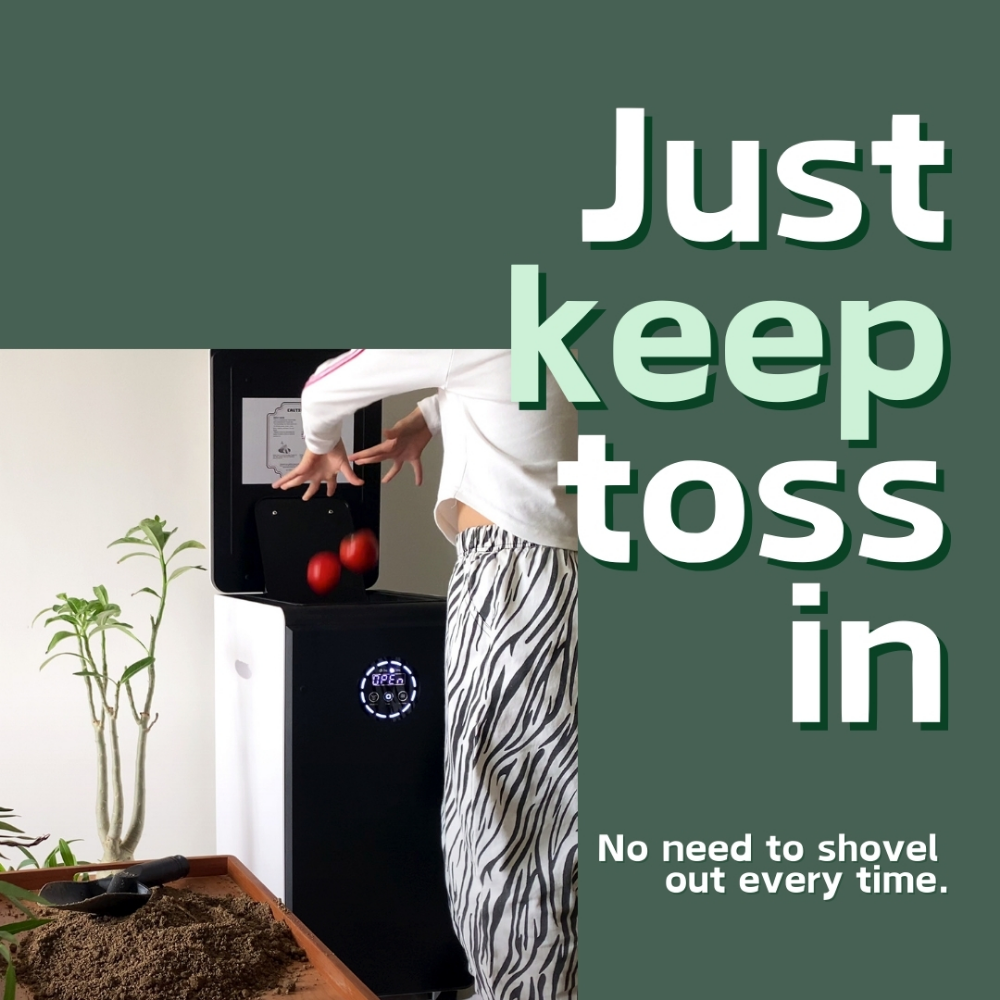

import GemeTerra2CTA from '@site/src/components/GemeTerra2CTA' 
import GemeComposterCTA from '@site/src/components/GemeComposterCTA' 
import RelatedArticles from '@site/src/components/RelatedArticles'
import ReactPlayer from 'react-player'

If you want a kitchen composter that actually produces real compost, handles a broad range of food waste, and eliminates recurring filter costs, a microbial machine like the GEME Electric Kitchen Composter is among the best options available today. Unlike dehydrators (e.g., Lomi), [**GEME Composter creates real compost instead of dried grindings**](https://www.thecompostculture.com/geme-electric-kitchen-composter-review/).

Home composting has never been more popular. Many city dwellers and eco‑conscious homeowners want to reduce landfill waste and use their kitchen scraps to enrich soil, but traditional composting methods take time, space, and effort. Electric composters have risen to meet that demand, but not all are created equal. Here’s where GEME stands apart.

<!-- truncate -->

## 1. GEME Composter vs. Other Kitchen Composters

Electric composters on the market generally fall into two categories:

**Dehydrators / Grinders** (e.g., Lomi, FoodCycler)

 - Heat and grind waste into dry, pulverized residue

 - Often require recurring charcoal or carbon filter replacements

 - Do not produce compost; they produce reduced waste

 - Must be emptied frequently and are more about convenience than soil building

**Microbial Composters** (e.g., GEME)

 - Use beneficial microbes (like GEME’s proprietary system)

 - Support aerobic decomposition, not just grinding or drying

 - Create active compost base suitable for soil enrichment

 - Require no carbon filter replacements

In simple terms: Lomi and similar machines produce leftover bits; **GEME produces soil amendment**.

<GemeComposterCTA 
 imgSrc="/img/geme-bio-composter.jpg"
 productTitle="GEME Pro Composter"
 features={[
    "✅ Best Composter With No Hidden Costs",
    "✅ Produce Soil-Ready Compost For Plant Growth",
    "✅ Quiet, Odor-Free, Quick(6-8 hours)",
    "✅ Large Capacity (19 L) For Daily Waste"
  ]}
buttonText="Get Your GEME Pro"
  href="https://www.geme.bio/product/geme?utm_medium=blog&utm_source=geme_website&utm_campaign=general_seo_content&utm_content=?utm_medium=blog&utm_source=geme_website&utm_campaign=general_seo_content&utm_content=geme-composter-review-2026"
/>

## 2. How GEME Composter Works: Natural Science Meets High Tech

Unlike dehydrators that rely on heat and mechanical shredding, the GEME Electric Kitchen Composter accelerates natural aerobic decomposition with a microbial system that thrives in the compost chamber.

Here’s the process simplified:

 - Start with GEME‑Kobold microbes: they’re added once.

 - Add kitchen waste anytime: fruit peels, veggie scraps, coffee grounds, and more.

 - Continuous composting: microbes break down waste naturally with oxygen.

 - Collect finished compost: typically ready within 24–48 hours.

 - No filters to buy: odor neutralization is handled internally without replacements.

This means the machine just works day after day without the recurring costs that bog down similar devices.

## 3. Top Benefits of the GEME Kitchen Composter

### True Compost, Not Just Reduced Waste

Electric “composters” like Lomi are really dehydrators; the output helps reduce landfill waste, but isn’t the same as finished compost. GEME, by contrast, produces compost that can be used directly in soil or plant beds.

### No Recurring Filter Costs

GEME uses advanced odor management technology that doesn’t rely on carbon filters that require replacement every few months, saving you money over time.

### High Daily Capacity

With roughly 19 L internal volume and the ability to manage up to ~5 kg of waste per day, GEME is suitable for most households.

### Odor‑Free Indoor Composting

Thanks to industrial metal‑ion catalytic odor neutralization, you don’t have to worry about kitchen smells, even in small apartments.

### Quiet Operation

Running at approximately 35–45 dB, this machine hums along quietly, comparable to a quiet conversation.

<GemeComposterCTA 
 imgSrc="/img/geme-bio-composter.jpg"
 productTitle="GEME Pro Composter"
 features={[
    "✅ Best Composter With No Hidden Costs",
    "✅ Produce Soil-Ready Compost For Plant Growth",
    "✅ Quiet, Odor-Free, Quick(6-8 hours)",
    "✅ Large Capacity (19 L) For Daily Waste"
  ]}
buttonText="Get Your GEME Pro"
  href="https://www.geme.bio/product/geme?utm_medium=blog&utm_source=geme_website&utm_campaign=general_seo_content&utm_content=?utm_medium=blog&utm_source=geme_website&utm_campaign=general_seo_content&utm_content=geme-composter-review-2026"
/>

## 4. Real‑World Use: What Reviewers Are Saying

Professional and user reviews highlight several strengths:

 - **Odor control works**: even with scraps that typically smell strongly, users notice minimal scent.

 - **Compost looks like soil**: [reviewers](https://www.beauty-zone.co.uk/03/09/2025/kitchen/my-honest-review-of-the-geme-composter-why-im-so-impressed/) report rich, dark compost rather than dried chips.

 - **Ease of use**: simply add waste; no turning or layering needed.

## 5. GEME Composter Feature Breakdown: Quick Comparison

| Feature                 | GEME Pro Composter |
| ----------------------- | ------------------------------- |
| Compost Type            | Real, nutrient‑rich compost     |
| Odor Control            | No filter replacements needed   |
| Daily Capacity          | ~5 kg                           |
| Noise                   | ~35–45 dB                       |
| Waste Added Anytime     | Yes                              |
| Installation Complexity | Plug‑and‑play                   |
| Maintenance             | Low                             |
| Suitable for Meat/Dairy | Yes                       |
| Energy Consumption      | Daily avg ~1.85 kWh   |

This contrasts with popular dehydrator‑style machines that often lack true compost output and cost more over time due to filters and limited capacity.

### Competitor Comparison Table

| Feature / Model                | [**GEME Composter**](https://www.geme.bio/product/geme?utm_medium=blog&utm_source=geme_website&utm_campaign=general_seo_content&utm_content=?utm_medium=blog&utm_source=geme_website&utm_campaign=general_seo_content&utm_content=geme-composter-review-2026)  | Lomi Composter    | Reencle Composter | Mill Composter    |
| ------------------------------ | ----------------------- | ----------------- | ----------------- | ----------------- |
| True Compost Output            | ✅ Yes                   | ❌ No              | ❌ No              | ✅ Yes              |
| Odor Control                   | ✅ Permanent, no filters | ✅ Requires filter | ✅ Requires filter | ✅ Requires filter |
| Daily Waste Capacity           | ~5 kg                   | ~3 kg             | ~3 kg             | ~4 kg             |
| Continuous Feed                | ✅ Yes                   | ❌ Batch only      | ❌ Batch only      | ✅ Yes           |
| Maintenance                    | Low            | Moderate          | Moderate          | Moderate          |
| Noise Level                    | 35–40 dB                | 60+ dB             | 45 dB             | 60 dB             |
| Suitable for Meat & Dairy      | Yes               | Limited           | Limited           | Limited           |

<GemeComposterCTA 
 imgSrc="/img/geme-bio-composter.jpg"
 productTitle="GEME Pro Composter"
 features={[
    "✅ Best Composter With No Hidden Costs",
    "✅ Produce Soil-Ready Compost For Plant Growth",
    "✅ Quiet, Odor-Free, Quick(6-8 hours)",
    "✅ Large Capacity (19 L) For Daily Waste"
  ]}
buttonText="Get Your GEME Pro"
  href="https://www.geme.bio/product/geme?utm_medium=blog&utm_source=geme_website&utm_campaign=general_seo_content&utm_content=?utm_medium=blog&utm_source=geme_website&utm_campaign=general_seo_content&utm_content=geme-composter-review-2026"
/>

### Pros & Cons At‑A‑Glance

✔️ Produces real compost suitable for gardens

✔️ No filter replacements = lower ongoing cost

✔️ Large capacity and quiet operation

✔️ Easy to use even for beginners

❌ Requires occasional cleaning and maintenance

❌ A little more expensive up‑front (but saves later)

## 6. Who Should Consider the GEME Composter?

### For Eco‑Conscious Gardeners

If you want to close the loop on kitchen waste and put usable compost into plant beds, GEME’s real compost output sets it apart.

### For Families with Moderate Waste

Up to ~5 kg daily capacity means typical family kitchens can keep up without frequent emptying.

### For Apartment Dwellers

Odor control and compact size make this a great option for city living.

## 7. Conclusion: Is GEME Composter Worth It?

If your goal is genuine compost, not just shredded or dried kitchen remnants, then the GEME Electric Kitchen Composter earns its place among the best composters available today. It strikes a rare balance: [**real compost output, low ongoing cost, and effortless indoor use**](https://www.thecompostculture.com/geme-electric-kitchen-composter-review/).

In a world where many “electric composters” simply recycle your scraps into something less smelly but not less wasteful, GEME genuinely transforms your kitchen waste into nutrient‑rich compost you can use. That makes it a compelling pick for sustainable households and home gardeners alike.

📌 Bottom line: If you want a kitchen composter that actually delivers soil‑ready compost without hidden filter fees, this is one of the best options out there.

## 8. FAQ (Answered)

### Q: What makes GEME Kitchen Composter different from Lomi or Reencle?

> A: [GEME Composter](https://www.geme.bio/product/geme?utm_medium=blog&utm_source=geme_website&utm_campaign=general_seo_content&utm_content=?utm_medium=blog&utm_source=geme_website&utm_campaign=general_seo_content&utm_content=geme-composter-review-2026) produces true compost, while Lomi and Reencle mainly dry or grind scraps. GEME requires no filter replacements, handles continuous feed, and works quietly indoors.

### Q: Can GEME Composter handle meat and dairy?

> A: Yes. Unlike most dehydrator-style composters, GEME can manage small quantities of meat, fish, and dairy safely, producing nutrient-rich compost.

### Q: How much maintenance does GEME Composter require?

> A:  Minimal. Users occasionally clean the compost chamber and the microbe system but do not replace filters or perform complex upkeep.

### Q: Is GEME cost-effective compared to competitors?

> A: Absolutely. While upfront cost may be higher than some dehydrators, no recurring filter fees and high-quality compost output make it the most cost-effective option over time.

### Q: How fast is the composting process?

> A: GEME Composter typically breaks down food waste in 6-8 hours and produces usable compost in 24–48 hours, depending on waste type and volume. Continuous feed allows you to add scraps at any time.

### Q: What is the warranty?

> A: Lomi and Mill offer limited warranties (often extendable with membership). Reencle provides a 1-year hardware warranty. GEME sells Terra II with a 30-day return policy and a standard 1-year warranty; since there are no consumables, there’s less to break over time. Active membership (where applicable) sometimes extends warranty length, but [**GEME’s approach is worry-free, if the machine fails, you can fix/replace under warranty with no ongoing payments**](https://www.geme.bio/product/geme?utm_medium=blog&utm_source=geme_website&utm_campaign=general_seo_content&utm_content=?utm_medium=blog&utm_source=geme_website&utm_campaign=general_seo_content&utm_content=geme-composter-review-2026).

### Q: Does Reencle use microbes or dehydration?

> A: Reencle uses microbes, similar to GEME. But it still requires filter replacements.

### Q: Do I need to buy microbes for GEME?

> A: You purchase Kobold starter culture once. The microbes are self-replicating under proper conditions. You only need to replace the entire microbe pack if and when you observe that waste is breaking down much slower than usual. But, you could purchase more Kobold for constant high-speed decomposition (depending on your personal needs). 

<GemeComposterCTA 
 imgSrc="/img/geme-bio-composter.jpg"
 productTitle="GEME Pro Composter"
 features={[
    "✅ Best Composter With No Hidden Costs",
    "✅ Produce Soil-Ready Compost For Plant Growth",
    "✅ Quiet, Odor-Free, Quick(6-8 hours)",
    "✅ Large Capacity (19 L) For Daily Waste"
  ]}
buttonText="Get Your GEME Pro"
  href="https://www.geme.bio/product/geme?utm_medium=blog&utm_source=geme_website&utm_campaign=general_seo_content&utm_content=?utm_medium=blog&utm_source=geme_website&utm_campaign=general_seo_content&utm_content=geme-composter-review-2026"
/>

👉 [Learn More About GEME Terra II](https://www.geme.bio/product/terra2?utm_medium=blog&utm_source=geme_website&utm_campaign=general_seo_content&utm_content=geme-composter-review-2026)

👉 [Explore GEME Pro for Big Households/Plant Shops/Restaurants](https://www.geme.bio/product/geme?utm_medium=blog&utm_source=geme_website&utm_campaign=general_seo_content&utm_content=?utm_medium=blog&utm_source=geme_website&utm_campaign=general_seo_content&utm_content=geme-composter-review-2026)

<RelatedArticles
  slugs={[
  "best-kitchen-composter-verdict-2026",
  "best-composter-avoid-recurring-fees-geme-terra-2",
  "how-to-compost-cut-flowers-guide",
  "how-long-does-bokashi-take-to-compost",
  "how-to-care-for-hydrangeas-and-change-colors",
  "best-composter-daily-operation-comparison-lomi-mill-reencle-geme",
  "how-long-does-pizza-last-in-fridge-guide",
  "how-to-compost-eggshells-guide-geme",
  "how-to-compost-coffee-grounds-guide",
  "never-buy-carbon-filter-for-your-composter",
  "best-composter-fastest-real-compost-geme-terra-2",
  "how-to-compost-at-home-beginners-guide",
  "how-long-can-chicken-stay-in-the-fridge",
  "how-to-reduce-odor-indoor-composting-tips",
  "how-long-can-ground-beef-stay-in-the-fridge",
  "nyc-composting-fines-2026-geme-terra-2-best-electric-compost",
  "best-indoor-composter-for-apartment-geme-vs-lomi",
  "the-best-composter-for-kitchen",
  "how-to-reduce-food-waste-during-spring-festival",
  "does-reencle-composter-produce-real-compost",
  "does-mill-composter-really-compost",
  "how-to-reduce-food-waste-at-home-2026",
  "free-mcnugget-caviar-raises-food-waste-concerns",
  "composting-in-winter",
  "how-to-compost-at-home",
  "zero-waste-home-kitchen-composter",
  "does-lomi-composter-really-compost",
  "5-best-kitchen-composters-in-2026",
  "best-kitchen-composter-in-2026-geme-terra-2",
  "geme-vs-reencle-composter-2026",
  "geme-vs-mill-composter-2026",
  "best-kitchen-composter-2026",
  "advanced-geme-compost-application-guide",
  "electric-compost-bin-filters-costs-comparison",
  "geme-vs-lomi", 
  "geme-terra-2-debuts",
  "the-best-composter-to-reduce-food-waste",
  "compost-pile-vs-electric-composter",
  "how-to-make-bananas-last-longer",
  "how-long-do-apples-last-in-the-fridge",
  "can-i-compost-moldy-grapes",
  "can-you-compost-moldy-bread",
  ]}
/>

_Ready to transform your gardening game? Subscribe to our [newsletter](http://geme.bio/signup?utm_medium=blog&utm_source=geme_website&utm_campaign=general_seo_content&utm_content=how-to-compost-at-home-beginners-guide) for expert composting tips and sustainable gardening advice._

