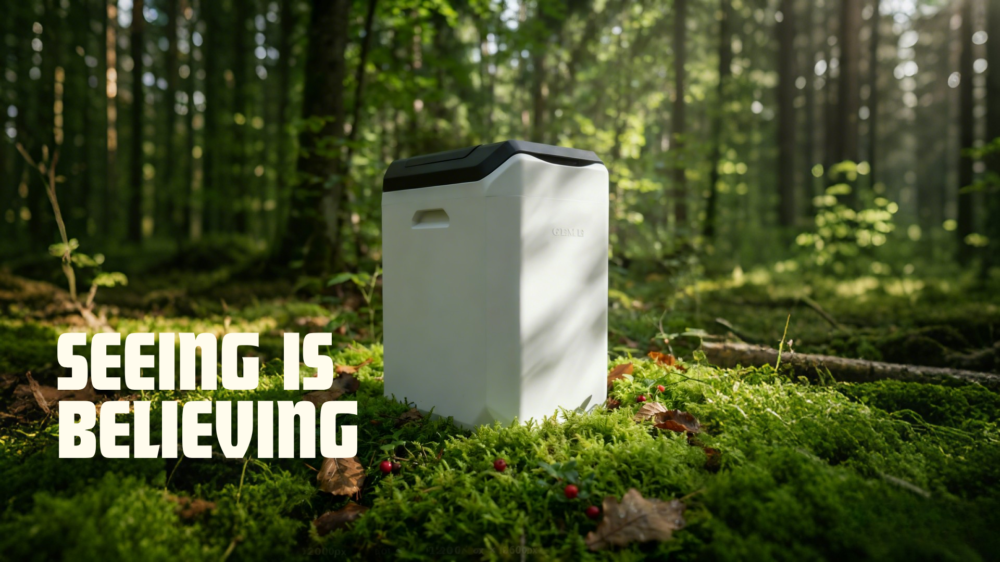
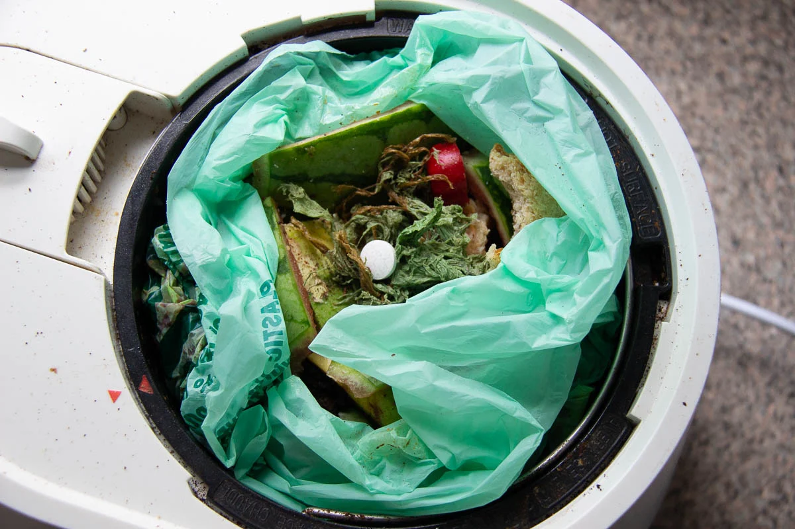
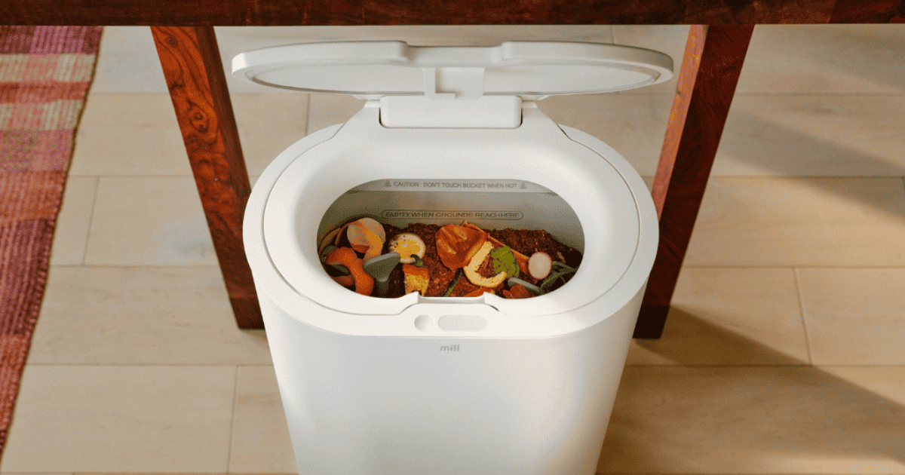
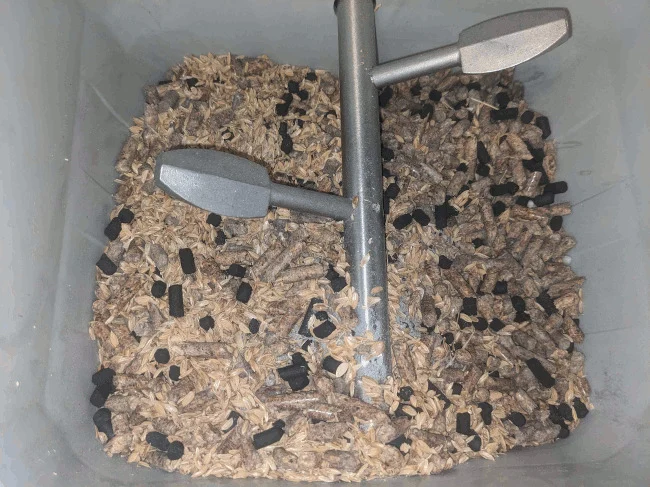
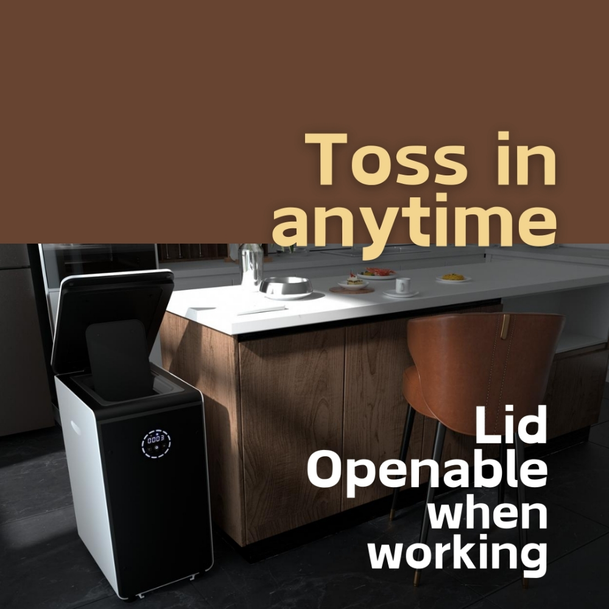

import GemeTerra2CTA from '@site/src/components/GemeTerra2CTA' 
import GemeComposterCTA from '@site/src/components/GemeComposterCTA' 
import RelatedArticles from '@site/src/components/RelatedArticles'
import ReactPlayer from 'react-player'

## Introduction

Here's the thing about kitchen composters. Most of them don't actually make compost.

When you dig into the science, a lot of these machines are just fancy dehydrators. They grind your food, bake it until it's dry, and spit out something that looks like dirt but acts like dust.

I spent the last few weeks digging through reviews, spec sheets, and actual user experiences to figure out which machines are worth your money and which ones will leave you wondering why your plants look sad.

In this guide, I'm breaking down the top five kitchen composters on the market: GEME Terra 2, GEME Pro, Lomi, Mill, and Reencle. We'll look at what each one actually does, what it costs to own, and whether the output is something you'd actually want to put on your garden.

Spoiler alert: **Only two of these produce real compost. The rest? They're really good at drying garbage**.

<!-- truncate -->

### Quick Comparison: At a Glance

Before we dive deep, here's how the five stack up against each other.

| Feature                | GEME Terra 2    | GEME Pro          | Lomi               | Mill                | Reencle        |
|------------------------|-----------------|-------------------|--------------------|---------------------|---------------|
| **Technology**         | Microbial + AI  | Microbial         | Grind + Heat       | Grind + Dry         | Microbial      |
| **Produces Real Compost?** | Yes         | Yes               | No                 | No                  | No，pre-compost            |
| **Handles Meat & Dairy?**  | Yes         | Yes               | Limited            | Limited             | Limited       |
| **Continuous Feed?**   | Yes             | Yes               | No (batch)         | No (batch)          | Yes           |
| **Noise Level**        | 35–40 dB        | 35–40 dB          | 60+ dB             | Up to 60 dB         | 45 dB         |
| **Filter Cost**        | $0              | $0                | $150–200/year      | $89/year            | ~$47/year     |
| **Upfront Price**      | \$549            | \$899            | \$499               | \$999+               | ~\$500         |
| **Best For**           | Real compost    | Large households  | Waste reduction    | Service ecosystem   | Quiet operation|

### Understanding the Categories: Dehydrator vs. Microbial Composter

Before we get into specific models, you need to know the difference between these two types of machines. It's the difference between owning a food dehydrator and owning a living ecosystem. [See the difference between Dehydrator and Composter -->](https://www.geme.bio/compare/real-compost-vs-dehydrated-scraps)

#### Dehydrator-Style Composters (Lomi, Mill)

**These machines use heat and grinding blades to dry out your food scraps**. Think of them as high-tech food dehydrators. They remove moisture, shrink volume, and produce a dry, shelf-stable material.

The problem? The output is sterile. No living microbes. No active biology. It's essentially dehydrated, pulverized garbage that still needs to be composted somewhere else.

As one soil scientist put it, "Devices like these are excellent for waste reduction, but calling their output 'compost' is misleading. It's a soil amendment precursor".

#### Microbial Composters (GEME Composter, GEME Terra II)

**These machines use live microorganisms to actually digest your food waste**. They maintain optimal temperature and oxygen levels so the microbes can do what they do best: eat.

The output is real compost. It's dark, crumbly, smells like earth, and contains living bacteria that help your plants grow. Just mix with soil and go into your garden.

<GemeTerra2CTA 
 imgSrc="/img/geme-terra-2-composter.jpg"
 productTitle="GEME Terra II: Best Kitchen Composter"
 features={[
    "✅ Best Composter With No Hidden Costs",
    "✅ Biologically Active Composting System",
    "✅ Quiet, Odour-Free, Real Compost",
    "✅ Zero Filter Costs, No Refills",
    "✅ Reduces Composting Time to Days"
 ]}
buttonText="Get Your GEME Terra II"
  href="https://www.geme.bio/product/terra2?utm_medium=blog&utm_source=geme_website&utm_campaign=general_seo_content&utm_content=top-5-kitchen-composters-pros-and-cons"
/>

## 1. GEME Terra 2: The First AI-Powered Kitchen Composter

GEME Terra II is the world's first AI-powered kitchen composter. It uses a proprietary blend of microorganisms called Kobold that literally eat your food waste.

### How It Works

You add scraps anytime. The machine uses AI sensors to monitor temperature, oxygen, and moisture, keeping conditions perfect for the microbes. In 6 to 8 hours, petals and leaves are gone. Stems and larger pieces take a few days. The whole system runs continuously, so there's no waiting for cycles to finish.

### What You Get

The output is an "active compost base", moist, soil-like, and full of living microbes. You mix it with soil at a 1:8 ratio and your plants get an immediate nutrient boost.

| Spec           | Value                       |
|----------------|----------------------------|
| Daily Capacity | Up to 2 kg                 |
| Chamber Size   | 14 liters                  |
| Noise Level    | 35–40 dB (whisper quiet)   |
| Filter Cost    | $0 (permanent)             |
| Energy Use     | ~1.4 kWh/day               |

### Pros of GEME Terra II

1. **Zero ongoing costs**: The metal-ion filter lasts forever. No pods, no cartridges, no subscriptions.

2. **Real compost**: Not dried garbage. Actual biologically active soil amendment.

3. **Continuous feed**: Add scraps whenever. No locked lids, no waiting for cycles.

4. **Handles everything**: Meat, dairy, small bones, coffee grounds, eggshells. All of it.

5. **Quiet**: 35–40 dB means you can run it in an open kitchen without annoying anyone.

6. **Harvest every 1–2 months**: Because it reduces volume by 95%, you're not emptying it every few days.

<GemeTerra2CTA 
 imgSrc="/img/geme-terra-2-composter.jpg"
 productTitle="GEME Terra II: Best Kitchen Composter"
 features={[
    "✅ Best Composter With No Hidden Costs",
    "✅ Biologically Active Composting System",
    "✅ Quiet, Odour-Free, Real Compost",
    "✅ Zero Filter Costs, No Refills",
    "✅ Reduces Composting Time to Days"
 ]}
buttonText="Get Your GEME Terra II"
  href="https://www.geme.bio/product/terra2?utm_medium=blog&utm_source=geme_website&utm_campaign=general_seo_content&utm_content=top-5-kitchen-composters-pros-and-cons"
/>

### Cons of GEME Terra II

1. **Upfront cost**: The price at \$549 can be a bit higher, though it pays for itself in filter savings.

2. **Floor-standing**: It's not a countertop unit. You need floor space, like where a kitchen trash can would go.

### Who It's For

People who want actual compost. Gardeners. Apartment dwellers who cook daily. Anyone who hates subscriptions and recurring fees. If you want to close the loop from kitchen to garden, this is the one.

## 2. GEME Pro: For Large Households and Serious Gardeners

The GEME Pro is the bigger sibling to the Terra 2. Same microbial technology, same real compost output, just scaled up for more waste. [See the GEME Pro Kitchen Composter Review By The Compost Culture -->](https://www.thecompostculture.com/geme-electric-kitchen-composter-review/)

### How It Works

Same as Terra 2, but with a larger chamber (19 L) and higher throughput. It uses the same Kobold microbes and the same permanent filter system.

| Spec           | Value               |
|----------------|---------------------|
| Daily Capacity | Up to 5 kg          |
| Chamber Size   | 19 liters         |
| Noise Level    | 35–40 dB            |
| Filter Cost    | $0 (permanent)      |
| Energy Use     | ~1.85 kWh/day       |

### Pros of GEME Composter

1. **Massive capacity**: 5 kg per day means it can handle a big family, dinner parties, or even small-scale food prep waste.

2. **Same zero consumables**: No filter replacements. Ever.

3. **Real compost**: Like the GEME Terra 2, it produces biologically active soil amendment.

3. **Continuous feed**: Add scraps whenever. No locked lids, no waiting for cycles.

4. **Handles everything**: Meat, dairy, small bones, coffee grounds, eggshells. All of it.

5. **Quiet**: 35–40 dB means you can run it in an open kitchen without annoying anyone.

6. **Harvest every 1–2 months**: Because it reduces volume by 95%, you're not emptying it every few days.

### Cons of GEME Composter

1. **Bigger**: About 26 inches tall, so it needs dedicated floor space.

2. **Higher upfront cost**: More than the Terra 2, though the long-term math still works out.

### Who It's For

Large families (4+ people). People who cook every meal at home. Small restaurants or cafes. Community gardens. Anyone who generates serious food waste and wants real compost from it.

<GemeComposterCTA 
 imgSrc="/img/geme-bio-composter.jpg"
 productTitle="GEME Pro Composter"
 features={[
    "✅ Best Composter With No Hidden Costs",
    "✅ Produce Soil-Ready Compost For Plant Growth",
    "✅ Quiet, Odor-Free, Quick(6-8 hours)",
    "✅ Large Capacity (19 L) For Daily Waste"
  ]}
buttonText="Get Your GEME Pro"
  href="https://www.geme.bio/product/geme?utm_medium=blog&utm_source=geme_website&utm_campaign=general_seo_content&utm_content=?utm_medium=blog&utm_source=geme_website&utm_campaign=general_seo_content&utm_content=top-5-kitchen-composters-pros-and-cons"
/>

## 3. Lomi: The Popular Composter That Doesn't Actually Compost

Lomi is the name everyone's heard. It's a countertop machine from Pela that grinds and dehydrates food scraps. It looks great. It's easy to use. But is it composting? Not really. [See "**Does Lomi Composter Really Compost**?" -->](/blog/does-lomi-composter-really-compost)

### How It Works

You fill the 3-liter bucket, choose a mode, and the machine grinds and heats your scraps for anywhere from 3 to 20 hours. The output is dry, crumbly, and shelf-stable. Lomi calls it "Lomi Earth", which is actually dried dust.

### What You Get

According to soil scientists, Lomi Earth is organic matter, not soil. It lacks the living biology that defines real compost. If you sprinkle it directly on plants, it can actually harm them by robbing nitrogen as it continues to decompose.

[**Epic Gardening**](https://www.epicgardening.com/lomi-compost/) tested it and found that the output is "not actually dirt" by soil science standards. It's better descibed as "organic matter", while it looks like dirt.

| Spec           | Value                         |
| -------------- | ---------------------------- |
| Chamber Size   | 3 liters                     |
| Cycle Time     | 3–20 hours                   |
| Noise Level    | 60+ dB (like a blender)      |
| Filter Cost    | $150–200/year                |
| Energy Use     | 0.6–1 kWh per cycle          |

### Pros of Lomi Composter

1. **Countertop footprint**: Fits on your counter like a toaster oven.

2. **Familiar brand**: Lomi is everywhere, so it's easy to find and buy.

3. **Looks nice**: It's a sleek, modern design.

4. **Reduces volume**: Your scraps get smaller and less smelly.

### Cons of Lomi Composter

1. **Not real compost**: It's dehydrated, sterilized scraps. No microbial life.

2. **Expensive filters**: You're spending \$150–200 per year on charcoal filters and LomiPods.

3. **Batch cycles**: Once you start a cycle, the lid locks. Add more scraps? Can't. They sit on your counter.

4. **No meat or dairy**: Lomi struggles with these. They can cause grease issues and odors.

5. **Loud**: 60+ dB is comparable to a blender. Not great for open-concept apartments.

6. **Locked lid**: If you have a dinner party and start a cycle early, those evening scraps go in the sink or the trash.

### Who It's For

People who live alone or generate very little waste. Anyone who just wants less trash and doesn't care about having real compost. If you have no plants and no garden, Lomi is an expensive trash compactor.

[See GEME Terra II Vs. Lomi Composter -->](/blog/geme-vs-lomi)

<a href="https://www.tiltedmap.com/lomi-review-kitchen-composter/" rel="nofollow">*Image: Ketti Wilhelm*</a>

## 4. Mill: The Service-Based Food Recycler

Mill takes a different approach. It's a floor-standing unit that dries and grinds scraps into "Food Grounds." The company is refreshingly honest about what it does. 

### How It Works

You toss scraps into the bin. The machine dries and grinds them into a fine powder. You can use the grounds in your garden, give them to chickens, or ship them back to Mill to be turned into chicken feed. 
[See "**Does Mill Really Compost**?" -->](/blog/does-mill-composter-really-compost)

### What You Get

According to Mill's own support documentation: "Food Grounds aren't compost." They're dehydrated biomass intended for storage, pickup, or secondary use.

| Spec         | Value                        |
| ------------ | --------------------------- |
| Bucket Size  | 6.5 liters                  |
| Fills Over   | Up to 4 weeks               |
| Noise Level  | Up to 60 dB                 |
| Filter Cost  | \$89 per year                |
| Pricing      | \$999+ purchase or \$35/month rental |

### Pros of Mill Food ReCycler

1. **Big capacity**: It takes weeks to fill, so you're not emptying constantly.

2. **Pickup option**: If you don't have a garden, Mill will ship you a box and haul your grounds away.

3. **Odor control**: Food & Wine tested it for six months and confirmed it's genuinely odorless .

4. **App integration**: You can schedule cycles, monitor fill levels, and even name your Mill.

### Cons of Mill Food ReCycler

1. **Not compost**: The output is Food Grounds, not compost.

2. **Recurring costs**: Even if you buy outright, you're looking at \$89/year for filters and potentially \$192/year for pickup service .

3. **Rental model**: If you go the subscription route, you're paying \$420/year forever.

4. **No continuous feed**: It's batch-based. You fill the bucket, then it processes.

5. **Loud-ish**: Up to 60 dB, which is noticeable.

[See GEME Terra II Vs. Mill Composter -->](/blog/geme-vs-mill-composter-2026)

### Who It's For

People who like service-based models. Anyone who wants waste reduction without dealing with the output. Urban dwellers who don't garden and want someone else to handle the grounds. If you're okay with recurring costs, Mill is a solid option.

## 5. Reencle: The Quiet Microbial Composter with Filter Costs

Reencle uses microorganisms to break down waste, similar to GEME. But there are some key differences. [See How Reencle Composter Works -->](https://www.geme.bio/compare/geme-vs-reencle)

### How It Works

You add scraps using a motion sensor lid. The machine uses a three-layer filter system (carbon, mesh, and microbes) to control odors. The output is nutrient-rich fertilizer that can be used on plants.

[See GEME Terra II Vs. Reencle Composter -->](/blog/does-reencle-composter-produce-real-compost)

### What You Get

Reencle produces compost-like material. It's not sterile like Lomi or Mill. But it's not quite the same as GEME's output either. It needs further curing before applying to your garden plants, according to the Wired Review. 

| Spec            | Value                                  |
|-----------------|----------------------------------------|
| Daily Capacity  | Up to 0.68 kg (optimum), 1 kg (max)    |
| Noise Level     | 45 dB           |
| Filter Cost     | ~\$47/year (carbon + mesh)               |
| Motion Sensor   | Yes (foot or hand wave)                 |

### Pros of Reencle Composter

1. **Quiet**: 45 dB is at a low noise level. 

2. **Motion sensor**: Wave your hand or foot to open the lid. Nice touch.

3. **Microbial process**: It's actually breaking down waste, not just drying it.

4. **Continuous feed** Add waste anytime. No waiting for cycles.

### Cons of Reencle Composter

1. **Filter costs**: About \$47 per year for replacements.

2. **Lower capacity**: 0.68 kg optimum per day means it's for smaller households.

3. **Not finished compost**: While it uses microbes, the output isn't considered finished compost by industry standards.

4. **Limited on some foods**: Not all scraps can go in.

### Who It's For

People who want a quiet microbial composter and don't mind the filter costs. Singles or couples who don't generate massive amounts of waste. Anyone who loves the motion sensor feature.

## Comparison Table

| Feature / Model                | [**GEME Composter**](https://www.geme.bio/product/geme?utm_medium=blog&utm_source=geme_website&utm_campaign=general_seo_content&utm_content=?utm_medium=blog&utm_source=geme_website&utm_campaign=general_seo_content&utm_content=top-5-kitchen-composters-pros-and-cons)  | Lomi Composter    | Reencle Composter | Mill Composter    |
| ------------------------------ | ----------------------- | ----------------- | ----------------- | ----------------- |
| True Compost Output            | ✅ Yes                   | ❌ No              | ❌ No, pre-compost              | ❌ No              |
| Odor Control                   | ✅ Permanent, no filters | ✅ Requires filter | ✅ Requires filter | ✅ Requires filter |
| Daily Waste Capacity           | ~5 kg                   | ~3 kg             | ~3 kg             | ~4 kg             |
| Continuous Feed                | ✅ Yes                   | ❌ Batch only      | ✅ Yes      | ❌ Batch only           |
| Maintenance                    | Low            | Moderate          | Moderate          | Moderate          |
| Noise Level                    | 35–40 dB                | 60+ dB             | 45 dB             | 60 dB             |
| Suitable for Meat & Dairy      | Yes               | Limited           | Limited           | Limited           |

<GemeTerra2CTA 
 imgSrc="/img/geme-terra-2-composter.jpg"
 productTitle="GEME Terra II: Best Kitchen Composter"
 features={[
    "✅ Best Composter With No Hidden Costs",
    "✅ Biologically Active Composting System",
    "✅ Quiet, Odour-Free, Real Compost",
    "✅ Zero Filter Costs, No Refills",
    "✅ Reduces Composting Time to Days"
 ]}
buttonText="Get Your GEME Terra II"
  href="https://www.geme.bio/product/terra2?utm_medium=blog&utm_source=geme_website&utm_campaign=general_seo_content&utm_content=top-5-kitchen-composters-pros-and-cons"
/>

### Cost Comparison 

Upfront price is only half the story. Here's what these machines cost to own over time.

| Brand            | Upfront  | Annual Filters        | 3-Year Total      |
|------------------|----------|----------------------|-------------------|
| **GEME Terra 2**     | \$549     | \$0                   | \$549              |
| **GEME Pro**         | \$899   | \$0                   | \$899            |
| **Lomi**             | \$499     | \$150–200             | \$949–\$1,099       |
| **Mill** (purchase)  | \$999+    | \$89 + optional pickup| \$1,266+           |
| **Reencle**          | ~\$500    | ~\$47                 | ~\$641             |

GEME costs a little more upfront than Lomi or Reencle. But after three years, you're ahead by hundreds of dollars. That's the math of zero consumables.

<GemeComposterCTA 
 imgSrc="/img/geme-bio-composter.jpg"
 productTitle="GEME Pro Composter"
 features={[
    "✅ Best Composter With No Hidden Costs",
    "✅ Produce Soil-Ready Compost For Plant Growth",
    "✅ Quiet, Odor-Free, Quick(6-8 hours)",
    "✅ Large Capacity (19 L) For Daily Waste"
  ]}
buttonText="Get Your GEME Pro"
  href="https://www.geme.bio/product/geme?utm_medium=blog&utm_source=geme_website&utm_campaign=general_seo_content&utm_content=?utm_medium=blog&utm_source=geme_website&utm_campaign=general_seo_content&utm_content=top-5-kitchen-composters-pros-and-cons"
/>

## 7. Conclusion

Here's the truth. If you just want to make your trash smaller, Lomi and Mill will do that. They're good at drying and grinding. They reduce volume. They look nice on your counter or in your kitchen.

But if you want to actually make compost? The kind of stuff that feeds your plants, improves your soil, and closes the loop from your kitchen to your garden? You need a machine that uses living microbes. That means GEME.

The GEME Terra 2 costs a little more upfront. But you never buy filters. You never buy pods. You never subscribe to anything. And at the end of every month, you pull out real, living compost that smells like earth and feeds your plants.

That's the difference between owning a dehydrator and owning a composter.

## 8. FAQ (Answered)

### Q: Do any of these actually make real compost?

> A: Yes. [**GEME Terra 2**](https://www.geme.bio/product/geme?utm_medium=blog&utm_source=geme_website&utm_campaign=general_seo_content&utm_content=?utm_medium=blog&utm_source=geme_website&utm_campaign=general_seo_content&utm_content=top-5-kitchen-composters-pros-and-cons) and **GEME Pro** produce real, biologically active compost. The others produce dehydrated scraps or partially processed material that needs further composting.

### Q: What's the difference between GEME and Lomi?

> A: GEME uses **live microbes** to digest waste. It produces **real compost** and has **zero filter costs**. Lomi grinds and dehydrates. It produces sterile dust and requires expensive filters.

### Q: Does Mill make compost?

> A:  No. Mill explicitly states that its Food Grounds are not compost.

### Q: How much do filters cost for these machines?

> A: Lomi: \$150–200 per year. Mill: \$89 per year. Reencle: ~\$47 per year. GEME: \$0.

### Q: Can I put meat and dairy in these?

> A: GEME products can handle meat and dairy. Lomi and Mill have limitations. Reencle is also limited.

### Q: Which one is the quietest?

> A: GEME Terra 2 is the quietest at 35–40 dB. Reencle at 45 dB. Lomi and Mill are louder at 60+ dB 

### Q: How often do I need to empty GEME?

> A: About once every 3-6 months for GEME Terra 2; 6-12 months for GEME Pro, thanks to the 95% volume reduction.

### Q: Do I need to buy microbes for GEME?

> A: You purchase Kobold starter culture once. The microbes are self-replicating under proper conditions. You only need to replace the entire microbe pack if and when you observe that waste is breaking down much slower than usual. But, you could purchase more Kobold for constant high-speed decomposition (depending on your personal needs). 

<GemeTerra2CTA 
 imgSrc="/img/geme-terra-2-composter.jpg"
 productTitle="GEME Terra II: Best Kitchen Composter"
 features={[
    "✅ Best Composter With No Hidden Costs",
    "✅ Biologically Active Composting System",
    "✅ Quiet, Odour-Free, Real Compost",
    "✅ Zero Filter Costs, No Refills",
    "✅ Reduces Composting Time to Days"
 ]}
buttonText="Get Your GEME Terra II"
  href="https://www.geme.bio/product/terra2?utm_medium=blog&utm_source=geme_website&utm_campaign=general_seo_content&utm_content=top-5-kitchen-composters-pros-and-cons"
/>

<GemeComposterCTA 
 imgSrc="/img/geme-bio-composter.jpg"
 productTitle="GEME Pro Composter"
 features={[
    "✅ Best Composter With No Hidden Costs",
    "✅ Produce Soil-Ready Compost For Plant Growth",
    "✅ Quiet, Odor-Free, Quick(6-8 hours)",
    "✅ Large Capacity (19 L) For Daily Waste"
  ]}
buttonText="Get Your GEME Pro"
  href="https://www.geme.bio/product/geme?utm_medium=blog&utm_source=geme_website&utm_campaign=general_seo_content&utm_content=?utm_medium=blog&utm_source=geme_website&utm_campaign=general_seo_content&utm_content=top-5-kitchen-composters-pros-and-cons"
/>

👉 [Learn More About GEME Terra II](https://www.geme.bio/product/terra2?utm_medium=blog&utm_source=geme_website&utm_campaign=general_seo_content&utm_content=geme-composter-review-2026)

👉 [Explore GEME Pro for Big Households/Plant Shops/Restaurants](https://www.geme.bio/product/geme?utm_medium=blog&utm_source=geme_website&utm_campaign=general_seo_content&utm_content=?utm_medium=blog&utm_source=geme_website&utm_campaign=general_seo_content&utm_content=geme-composter-review-2026)

## Sources

1. [WTOP News: GEME Zero Waste Smart Composter review](https://wtop.com/tech/2025/01/geme-zero-waste-smart-composter-reduces-compost-production-time-from-months-to-hours/) 

2. [Epic Gardening: Lomi Composter review](https://www.epicgardening.com/lomi-compost/)

3. [Food & Wine: Mill Food Recycler review](https://www.foodandwine.com/mill-food-recycler-review-8662952) 

<RelatedArticles
  slugs={[
  "geme-composter-review-2026",
  "best-kitchen-composter-verdict-2026",
  "best-composter-avoid-recurring-fees-geme-terra-2",
  "how-to-compost-cut-flowers-guide",
  "how-long-does-bokashi-take-to-compost",
  "how-to-care-for-hydrangeas-and-change-colors",
  "best-composter-daily-operation-comparison-lomi-mill-reencle-geme",
  "how-long-does-pizza-last-in-fridge-guide",
  "how-to-compost-eggshells-guide-geme",
  "how-to-compost-coffee-grounds-guide",
  "never-buy-carbon-filter-for-your-composter",
  "best-composter-fastest-real-compost-geme-terra-2",
  "how-to-compost-at-home-beginners-guide",
  "how-long-can-chicken-stay-in-the-fridge",
  "how-to-reduce-odor-indoor-composting-tips",
  "how-long-can-ground-beef-stay-in-the-fridge",
  "nyc-composting-fines-2026-geme-terra-2-best-electric-compost",
  "best-indoor-composter-for-apartment-geme-vs-lomi",
  "the-best-composter-for-kitchen",
  "how-to-reduce-food-waste-during-spring-festival",
  "does-reencle-composter-produce-real-compost",
  "does-mill-composter-really-compost",
  "how-to-reduce-food-waste-at-home-2026",
  "free-mcnugget-caviar-raises-food-waste-concerns",
  "composting-in-winter",
  "how-to-compost-at-home",
  "zero-waste-home-kitchen-composter",
  "does-lomi-composter-really-compost",
  "5-best-kitchen-composters-in-2026",
  "best-kitchen-composter-in-2026-geme-terra-2",
  "geme-vs-reencle-composter-2026",
  "geme-vs-mill-composter-2026",
  "best-kitchen-composter-2026",
  "advanced-geme-compost-application-guide",
  "electric-compost-bin-filters-costs-comparison",
  "geme-vs-lomi", 
  "geme-terra-2-debuts",
  "the-best-composter-to-reduce-food-waste",
  "compost-pile-vs-electric-composter",
  "how-to-make-bananas-last-longer",
  "how-long-do-apples-last-in-the-fridge",
  "can-i-compost-moldy-grapes",
  "can-you-compost-moldy-bread",
  ]}
/>

_Ready to transform your gardening game? Subscribe to our [newsletter](http://geme.bio/signup?utm_medium=blog&utm_source=geme_website&utm_campaign=general_seo_content&utm_content=how-to-compost-at-home-beginners-guide) for expert composting tips and sustainable gardening advice._

