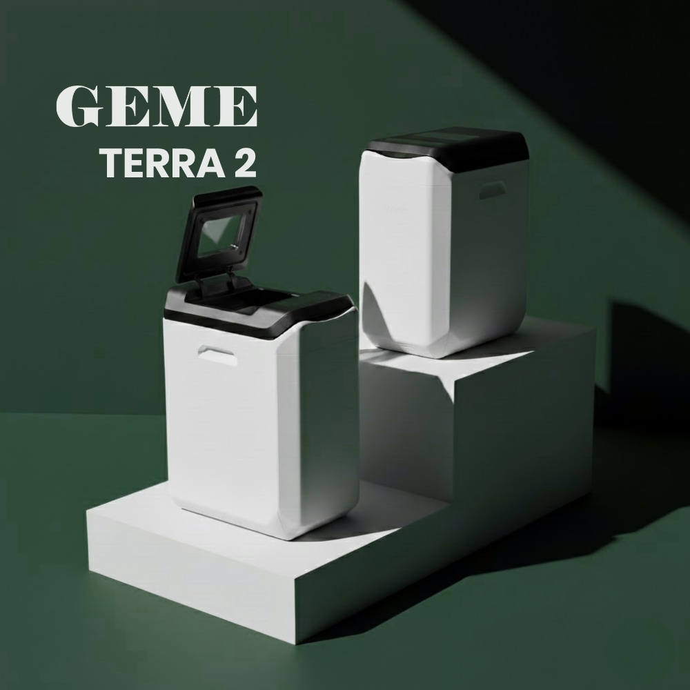

import GemeTerra2CTA from '@site/src/components/GemeTerra2CTA' 
import GemeComposterCTA from '@site/src/components/GemeComposterCTA' 
import RelatedArticles from '@site/src/components/RelatedArticles'
import ReactPlayer from 'react-player'

## Introduction: What You Actually Get With GEME Terra II

Let me start with something that might surprise you. Most kitchen composters aren't actually composters. They're dehydrators dressed up in fancy marketing. They grind your food, bake it dry, and hand you back a pile of sterile dust that sort of looks like dirt.

The GEME Terra 2 is different. It uses **live microorganisms actually to digest your food waste**. Think of it less like a food processor and more like a tiny, hungry ecosystem living on your kitchen floor.

| Spec           | Value                       |
|----------------|----------------------------|
| Daily Capacity | Up to 2 kg                 |
| Chamber Size   | 14 liters                  |
| Noise Level    | 35–40 dB (whisper quiet)   |
| Filter Cost    | $0 (permanent)             |
| Energy Use     | ~1.4 kWh/day               |

I've spent a lot of time digging through what this machine does well and where it might not fit your life. Because no product is perfect for everyone, and pretending otherwise wastes your money and my time.

So here it is. The honest breakdown of the GEME composter, no fluff, just what you need to know.

<!-- truncate -->

## 1. The Pros of GEME Terra 2

### Pro 1: The GEME Terra 2 Produces Real Compost

Here's the thing about the GEME composter that sets it apart from half the market. It actually makes compost. Not dried garbage. Not "pre-compost" that needs to sit in a pile for another six months. [It's an actual, biologically active soil amendment](https://www.geme.bio/gk).

The machine uses a proprietary blend of microorganisms called Kobold that eat your food scraps. These little guys are thermophilic, which means they love heat. The machine keeps them at the perfect temperature, gives them oxygen, and lets them do what they do best: break down food waste.

What comes out is moist, crumbly, and smells like a forest floor. You mix it with soil at about one part compost to eight parts soil, and your plants get an immediate nutrient boost.

Most other machines can't say that. Lomi gives you dry dust. Mill gives you "food grounds." They look like compost, but they don't act like it. If you want real compost for your garden, the GEME composter is one of the only options that delivers.

### Pro 2: This GEME Terra 2 Has Zero Recurring Filter Costs

I can't tell you how many people buy a kitchen composter based on the sticker price and then get blindsided by the hidden subscription. Lomi owners spend about \$150 to \$200 every year on filters and pods. Mill owners pay \$89 for filters plus optional pickup fees at \$192/year. Reencle owners drop about \$47 per year on carbon and mesh replacements.

The GEME Terra 2? Zero. Nothing. 

It uses a permanent metal ion oxidation catalyst for odor control. It doesn't trap smells like charcoal does. It destroys them at a molecular level. Because nothing gets "full," there's nothing to replace, ever.

I've had people tell me this sounds too good to be true. I get it. We're used to everything having a subscription these days. But the filter is engineered for the lifetime of the machine. You buy it once, and that's it.

<GemeTerra2CTA 
 imgSrc="/img/geme-terra-2-composter.jpg"
 productTitle="GEME Terra II: Best Kitchen Composter"
 features={[
    "✅ Best Composter With No Hidden Costs",
    "✅ Biologically Active Composting System",
    "✅ Quiet, Odour-Free, Real Compost",
    "✅ Zero Filter Costs, No Refills",
    "✅ Reduces Composting Time to Days"
 ]}
buttonText="Get Your GEME Terra II"
  href="https://www.geme.bio/product/terra2?utm_medium=blog&utm_source=geme_website&utm_campaign=general_seo_content&utm_content=geme-terra-2-pros-and-cons"
/>

### Pro 3: The GEME Composter Uses Continuous Feed, So No Waiting Around

Batch machines drive me crazy. You fill a bucket, press a button, and the lid locks for the next 5 to 20 hours. Meanwhile, you're cooking dinner and generating more scraps that now have to sit on your counter or go in the trash.

The GEME composter doesn't work that way. It's a continuous feed. You open the lid, toss in your scraps, close the lid, and walk away. The microbes are always working. There's no "cycle" to start or finish.

This small difference changes everything. If you cook daily, you don't have to plan your composting around your cooking. You just... compost when you have scraps. 

### Pro 4: You Can Put Almost Anything in This GEME Terra 2

Meat. Chicken bones. Dairy. Coffee grounds. Eggshells. Vegetables. Fruits. Leftovers that went fuzzy in the back of the fridge. All of it goes in the GEME composter. If you can eat it, GEME loves it.

Most other machines have a long list of things you can't put in. Lomi struggles with meat and dairy. Mill says to strain liquids and avoid oils. Reencle has its own restrictions.

The GEME Terra 2 just eats it. The [**Kobold microbes**](https://www.geme.bio/kobold-introduction) are aggressive and hungry. The only things you should avoid are large beef or pork bones, shells, and anything that isn't organic, like plastic or metal.

This matters if you actually cook. Because when you roast a chicken, you're left with bones. When you make pasta, you've got cheese scraps. With other machines, those go in the trash. With GEME, they go in the composter.

### Pro 5: This Is [the Best Composter](/blog/top-5-kitchen-composters-pros-and-cons) for People Who Hate Subscriptions

I'm going to say something that might sound dramatic, but I mean it. The GEME Terra 2 is the best composter for anyone tired of being nickel-and-dimed.

We're used to the idea that every appliance comes with a subscription. Printer ink. Coffee pods. Water filters. And apparently, now, kitchen composters.

GEME breaks that model. No app asks you to pay for premium features. No "auto ship" filter replacement program you'll forget to cancel. No monthly fee for the privilege of using something you already bought.

You pay \$549 once, and that's the end of the transaction. Not the beginning of a long financial relationship.

<GemeTerra2CTA 
 imgSrc="/img/geme-terra-2-composter.jpg"
 productTitle="GEME Terra II: Best Kitchen Composter"
 features={[
    "✅ Best Composter With No Hidden Costs",
    "✅ Biologically Active Composting System",
    "✅ Quiet, Odour-Free, Real Compost",
    "✅ Zero Filter Costs, No Refills",
    "✅ Reduces Composting Time to Days"
 ]}
buttonText="Get Your GEME Terra II"
  href="https://www.geme.bio/product/terra2?utm_medium=blog&utm_source=geme_website&utm_campaign=general_seo_content&utm_content=geme-terra-2-pros-and-cons"
/>

## 2. The Cons of GEME Terra 2

### Con 1: The GEME Composter Is Floor-Standing, Not Countertop

Okay, let's talk about where this thing lives. The GEME Terra 2 is about 26 inches tall. It's designed to sit on the floor, not your counter. The idea is that it goes where your kitchen trash can goes.

For some people, this is great. You're not giving up precious counter space. For others, it's a problem. If your kitchen is too tiny and every square foot of floor is already spoken for, finding a spot for a floor-standing machine can be tricky.
Measure your space before you buy. It's a beautiful machine, but it needs a corner at home.

### Con 2: The Upfront Cost Is Higher Than Some Competitors

There's no way around this. The GEME Terra 2 costs \$549. That's more than Lomi and Reencle, which sit around \$499. It's less than Mill, which is \$999 if you buy outright, but it's not the cheapest option at the register.

Here's the thing, though. Low upfront doesn't mean low costs to own. A Lomi buyer spends \$949 to \$1,099 over three years after filters. A Reencle buyer spends about \$640. A GEME buyer spends \$549 total.

So yes, you pay a little more today. But you pay nothing tomorrow, and the day after that. 

If you're shopping at a pure upfront price, GEME isn't the winner. If you're shopping at the total cost of ownership, GEME wins.

### Con 3: You Need to Prep Stems and Fibrous Stuff Before Adding

Here's a quirk that some people don't expect. Long, stringy things can cause problems. Rose stems, celery stalks, corn husks, things with fibers that wrap around. If you toss them in whole, they will tangle around the mixing mechanism.

The fix is simple. Cut long stems into pieces two or three inches long. Tear up fibrous leaves. This takes about 30 seconds.

Is it annoying? A little. But it's also a good habit for any composting method. Smaller pieces break down faster. And once you get in the rhythm, it becomes automatic.

<GemeTerra2CTA 
 imgSrc="/img/geme-terra-2-composter.jpg"
 productTitle="GEME Terra II: Best Kitchen Composter"
 features={[
    "✅ Best Composter With No Hidden Costs",
    "✅ Biologically Active Composting System",
    "✅ Quiet, Odour-Free, Real Compost",
    "✅ Zero Filter Costs, No Refills",
    "✅ Reduces Composting Time to Days"
 ]}
buttonText="Get Your GEME Terra II"
  href="https://www.geme.bio/product/terra2?utm_medium=blog&utm_source=geme_website&utm_campaign=general_seo_content&utm_content=geme-terra-2-pros-and-cons"
/>

### Con 4: This Isn't a Quick Compost Machine for Stems

Here's something the marketing sometimes glosses over. While petals and leaves break down in 6 to 8 hours, woody stems take longer. A few days, sometimes a week, depending on the plant.

This is normal. It's not a bug. It's biology. Wood and fiber take time, even for aggressive microbes.

Because the machine runs continuously, it's not a big deal. Those stems just hang out in the chamber while you add other scraps. They eventually break down. But if you were expecting everything to vanish in a few hours, that's not how it works.

### Con 5: It Takes a Few Weeks For Compost To Finish

When you first start using a GEME composter, you're not going to have compost in a day. You need to build up the microbial colony and fill the chamber. The first harvest usually happens after four to six weeks.

After that, you're harvesting every one to two months, depending on how much waste you generate.

This is a different rhythm than a batch machine, where you empty a bucket every few days. Some people love it. Some people want more immediate results. Know yourself before you buy.

## 3. Who Is GEME Terra 2 Actually For

Let me help you figure out if the GEME composter fits your life.

### Buy this if:

1. **You want real compost**. Not dried scraps. Not "food grounds." Actual soil you can put in your garden. The GEME composter is one of the only machines that delivers that.

2. **You cook daily**. If you're generating food waste every day, continuous feed is a game-changer. No locked lids. No planning around cycles.

3. **You hate subscriptions**. The GEME Terra 2 costs \$549 once. No filters. No pods. No monthly fees, ever.

4. **You have space for a floor-standing unit**. It's about the size of a kitchen trash can. If that works for your kitchen, you're golden.

5. **You want to compost almost everything**. Meat, dairy, small bones, leftovers, whatever. This machine takes it all.

<GemeTerra2CTA 
 imgSrc="/img/geme-terra-2-composter.jpg"
 productTitle="GEME Terra II: Best Kitchen Composter"
 features={[
    "✅ Best Composter With No Hidden Costs",
    "✅ Biologically Active Composting System",
    "✅ Quiet, Odour-Free, Real Compost",
    "✅ Zero Filter Costs, No Refills",
    "✅ Reduces Composting Time to Days"
 ]}
buttonText="Get Your GEME Terra II"
  href="https://www.geme.bio/product/terra2?utm_medium=blog&utm_source=geme_website&utm_campaign=general_seo_content&utm_content=geme-terra-2-pros-and-cons"
/>

### Skip this if:

1. **You only have counter space**. The GEME composter needs floor space. If your kitchen is too tiny, look elsewhere.

2. **You want the cheapest upfront option**. Lomi and Reencle have lower sticker prices. Just know they'll cost you more in the long run.

3. **You want the compost finished overnight**. The first harvest takes a few weeks. After that, you harvest every month or two. However, there's no finished compost overnight. All composting methods take at least a few weeks to finish. 

## 4. Comparison: GEME Terra 2 vs. Other Options

| Feature             | **GEME Terra 2** | **Lomi**           | **Mill**         | **Reencle**      |
|---------------------|:------------:|:--------------:|:------------:|:------------:|
| Makes Real Compost  | Yes          | No             | No           | Yes           |
| Filter Cost         | \$0           | \$150–200/year  | \$89/year     | ~\$47/year    |
| 3-Year Total        | \$549         | \$949–\$1,099    | \$1,266+      | ~\$641        |
| Continuous Feed     | Yes          | No             | No           | Yes          |
| Handles Meat/Dairy  | Yes          | Limited        | Limited      | Limited      |
| Noise Level         | 35–40 dB     | 60+ dB         | Up to 60 dB  | 45 dB        |

The GEME composter costs more upfront than Lomi and Reencle. But after three years, it's hundreds of dollars saved because you're not buying filters.

## 5. FAQ (Answered)

### Q: Does the GEME Terra 2 actually make compost or just dry food?

> A: It makes real compost. The Kobold microbes digest waste biologically. What comes out is living soil amendment, not dehydrated scraps.

### Q: How often do I need to replace filters?

> A: Never. The metal ion oxidation catalyst is permanent. You buy it once, and that's it.

### Q: Can I put meat and bones in the GEME composter?

> A:  Yes. Small bones like chicken or fish are fine. Large beef or pork bones should be avoided.

### Q: How loud is it?

> A: About 35 to 40 decibels. That's quieter than a refrigerator. You can run it in an open kitchen without annoying anyone.

### Q: How often do I empty it?

> A: About once every one to two months, depending on how much waste you generate. The machine reduces volume by 95%, so you're not constantly emptying it.

### Q: Is it easy to clean?

> A: Yes. The inner bucket is removable. GEME recommends a deep clean every three to six months, depending on use.

### Q: What's the daily capacity?

> A: Up to 2 kilograms per day, which is plenty for a household of 1 to 3 people.

### Q: Do I need to buy microbes every month for GEME Terra II?

> A: No. You get the starter pack once. The microbes are self-replicating under proper conditions. You only need to replace the entire microbe pack **only if and when you observe that waste is breaking down much slower** than usual. But, you could purchase more Kobold for constant high-speed decomposition (depending on your personal needs). 

<GemeTerra2CTA 
 imgSrc="/img/geme-terra-2-composter.jpg"
 productTitle="GEME Terra II: Best Kitchen Composter"
 features={[
    "✅ Best Composter With No Hidden Costs",
    "✅ Biologically Active Composting System",
    "✅ Quiet, Odour-Free, Real Compost",
    "✅ Zero Filter Costs, No Refills",
    "✅ Reduces Composting Time to Days"
 ]}
buttonText="Get Your GEME Terra II"
  href="https://www.geme.bio/product/terra2?utm_medium=blog&utm_source=geme_website&utm_campaign=general_seo_content&utm_content=geme-terra-2-pros-and-cons"
/>

## Conclusion 

Here's my honest take: 

If you want a machine that dries your garbage and makes it smaller, there are cheap options. Lomi does that. Mill does that. They're fine at what they do, which is volume reduction.

But if you want to actually make compost? The kind of stuff that feeds your plants and improves your soil? The GEME composter is in a different category.

It costs a little more today. But you never buy filters. You never buy pods. You never sign up for a subscription. And at the end of every month, you pull out real, living compost that smells like earth and grows things.

For gardeners, for people who cook daily, for anyone tired of being nickel-and-dimed, this is the best composter on the market. Not because it's perfect, but because it does what it says, it does without asking for more money later.

<GemeTerra2CTA 
 imgSrc="/img/geme-terra-2-composter.jpg"
 productTitle="GEME Terra II: Best Kitchen Composter"
 features={[
    "✅ Best Composter With No Hidden Costs",
    "✅ Biologically Active Composting System",
    "✅ Quiet, Odour-Free, Real Compost",
    "✅ Zero Filter Costs, No Refills",
    "✅ Reduces Composting Time to Days"
 ]}
buttonText="Get Your GEME Terra II"
  href="https://www.geme.bio/product/terra2?utm_medium=blog&utm_source=geme_website&utm_campaign=general_seo_content&utm_content=geme-terra-2-pros-and-cons"
/>

<GemeComposterCTA 
 imgSrc="/img/geme-bio-composter.jpg"
 productTitle="GEME Pro Composter"
 features={[
    "✅ Best Composter With No Hidden Costs",
    "✅ Produce Soil-Ready Compost For Plant Growth",
    "✅ Quiet, Odor-Free, Quick(6-8 hours)",
    "✅ Large Capacity (19 L) For Daily Waste"
  ]}
buttonText="Get Your GEME Pro"
  href="https://www.geme.bio/product/geme?utm_medium=blog&utm_source=geme_website&utm_campaign=general_seo_content&utm_content=?utm_medium=blog&utm_source=geme_website&utm_campaign=general_seo_content&utm_content=geme-terra-2-pros-and-cons"
/>

👉 [Learn More About GEME Terra II](https://www.geme.bio/product/terra2?utm_medium=blog&utm_source=geme_website&utm_campaign=general_seo_content&utm_content=geme-terra-2-pros-and-cons)

👉 [Explore GEME Pro for Big Households/Plant Shops/Restaurants](https://www.geme.bio/product/geme?utm_medium=blog&utm_source=geme_website&utm_campaign=general_seo_content&utm_content=?utm_medium=blog&utm_source=geme_website&utm_campaign=general_seo_content&utm_content=geme-terra-2-pros-and-cons)

## Sources

1. [WTOP News: GEME Zero Waste Smart Composter review](https://wtop.com/tech/2025/01/geme-zero-waste-smart-composter-reduces-compost-production-time-from-months-to-hours/) 

2. [Epic Gardening: Lomi Composter review](https://www.epicgardening.com/lomi-compost/)

3. [Food & Wine: Mill Food Recycler review](https://www.foodandwine.com/mill-food-recycler-review-8662952) 

<RelatedArticles
  slugs={[
  "geme-composter-review-2026",
  "best-kitchen-composter-verdict-2026",
  "best-composter-avoid-recurring-fees-geme-terra-2",
  "how-to-compost-cut-flowers-guide",
  "how-long-does-bokashi-take-to-compost",
  "how-to-care-for-hydrangeas-and-change-colors",
  "best-composter-daily-operation-comparison-lomi-mill-reencle-geme",
  "how-long-does-pizza-last-in-fridge-guide",
  "how-to-compost-eggshells-guide-geme",
  "how-to-compost-coffee-grounds-guide",
  "never-buy-carbon-filter-for-your-composter",
  "best-composter-fastest-real-compost-geme-terra-2",
  "how-to-compost-at-home-beginners-guide",
  "how-long-can-chicken-stay-in-the-fridge",
  "how-to-reduce-odor-indoor-composting-tips",
  "how-long-can-ground-beef-stay-in-the-fridge",
  "nyc-composting-fines-2026-geme-terra-2-best-electric-compost",
  "best-indoor-composter-for-apartment-geme-vs-lomi",
  "the-best-composter-for-kitchen",
  "how-to-reduce-food-waste-during-spring-festival",
  "does-reencle-composter-produce-real-compost",
  "does-mill-composter-really-compost",
  "how-to-reduce-food-waste-at-home-2026",
  "free-mcnugget-caviar-raises-food-waste-concerns",
  "composting-in-winter",
  "how-to-compost-at-home",
  "zero-waste-home-kitchen-composter",
  "does-lomi-composter-really-compost",
  "5-best-kitchen-composters-in-2026",
  "best-kitchen-composter-in-2026-geme-terra-2",
  "geme-vs-reencle-composter-2026",
  "geme-vs-mill-composter-2026",
  "best-kitchen-composter-2026",
  "advanced-geme-compost-application-guide",
  "electric-compost-bin-filters-costs-comparison",
  "geme-vs-lomi", 
  "geme-terra-2-debuts",
  "the-best-composter-to-reduce-food-waste",
  "compost-pile-vs-electric-composter",
  "how-to-make-bananas-last-longer",
  "how-long-do-apples-last-in-the-fridge",
  "can-i-compost-moldy-grapes",
  "can-you-compost-moldy-bread",
  ]}
/>

_Ready to transform your gardening game? Subscribe to our [newsletter](http://geme.bio/signup?utm_medium=blog&utm_source=geme_website&utm_campaign=general_seo_content&utm_content=how-to-compost-at-home-beginners-guide) for expert composting tips and sustainable gardening advice._

