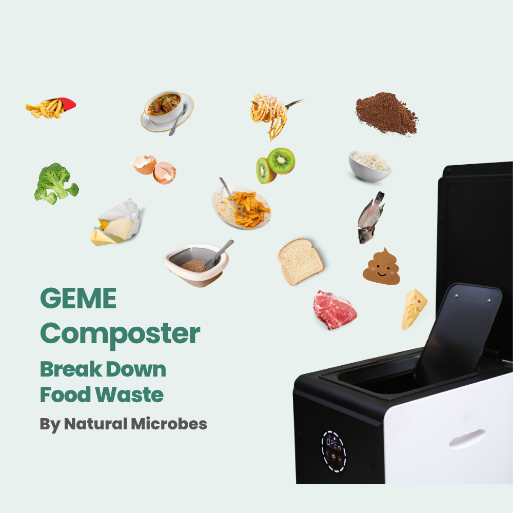
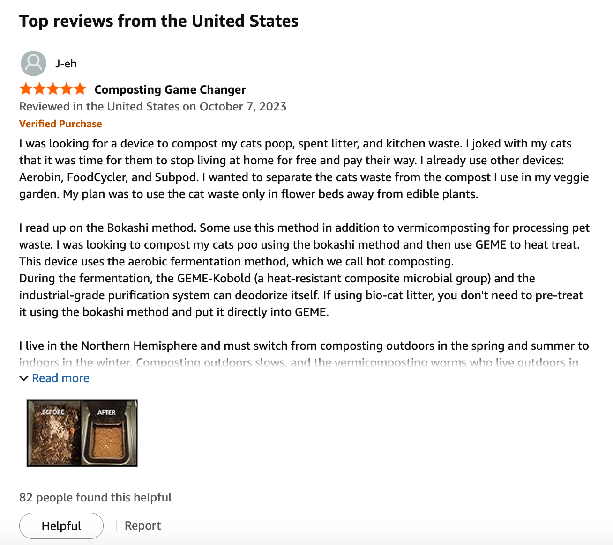
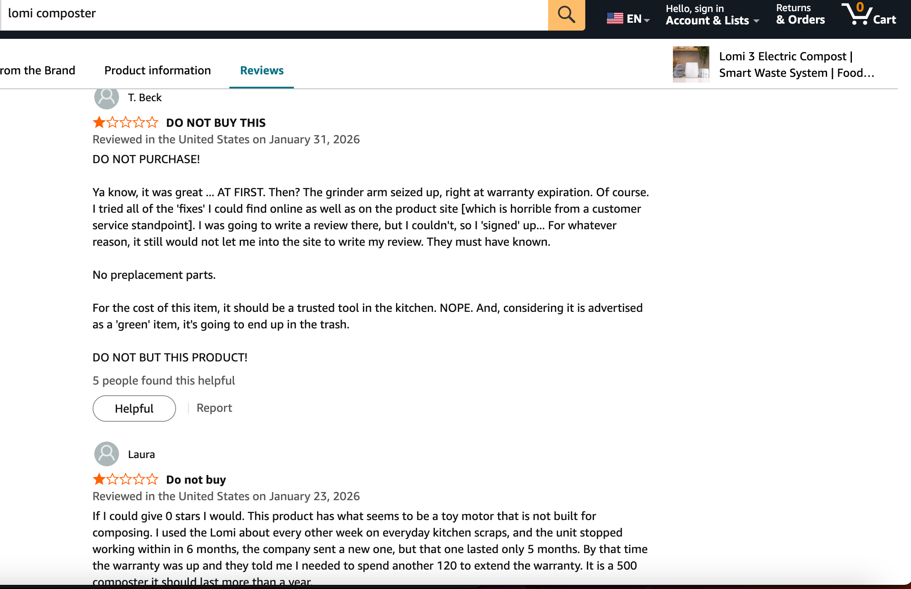
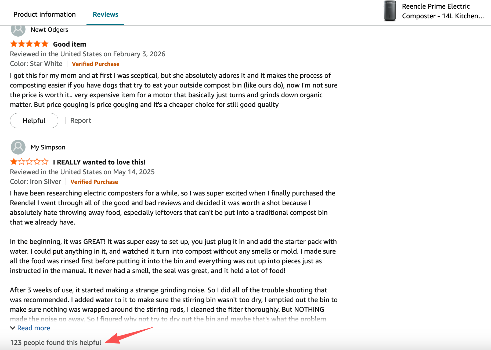
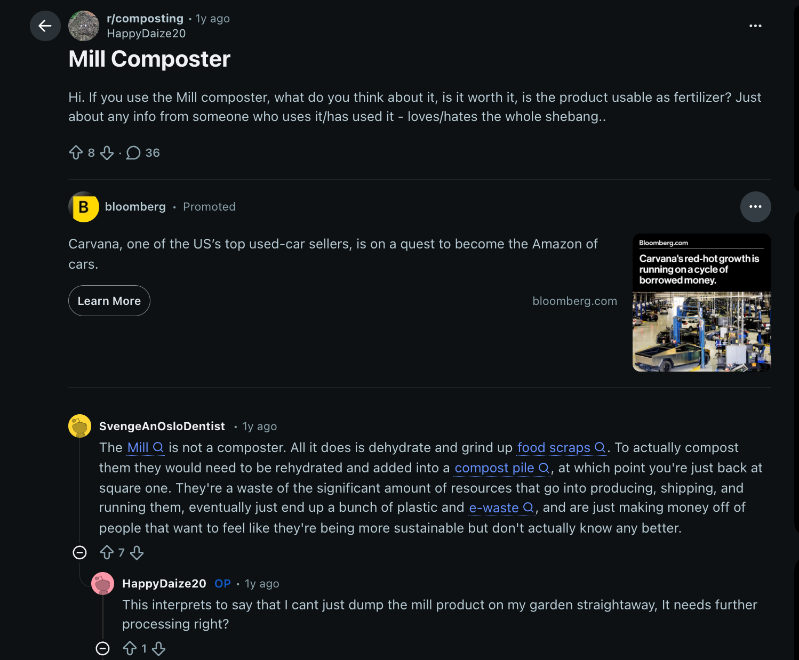
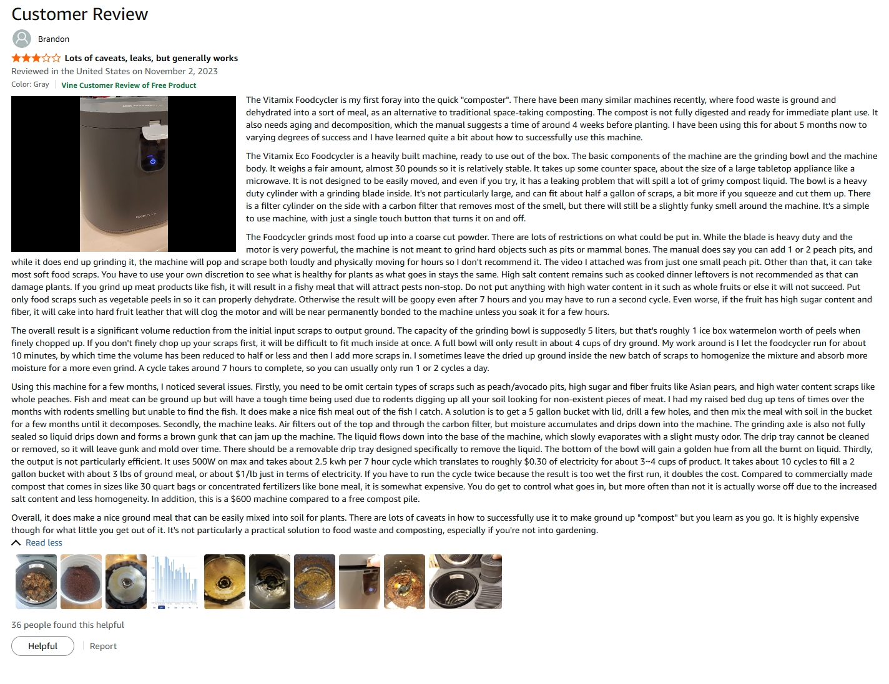
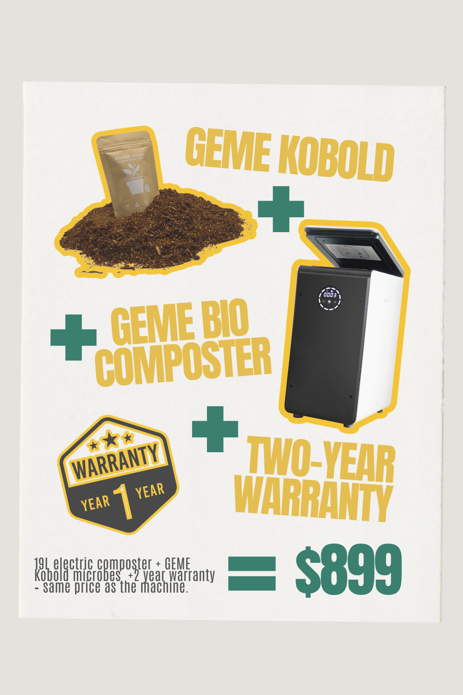

import GemeTerra2CTA from '@site/src/components/GemeTerra2CTA' 
import GemeComposterCTA from '@site/src/components/GemeComposterCTA' 
import RelatedArticles from '@site/src/components/RelatedArticles'
import ReactPlayer from 'react-player'

## Introduction: The Real Cost of a Kitchen Composter

Here’s something Amazon listings won’t tell you. That \$500 machine you’re eyeing might end up costing you another \$500 in filters before you’ve owned it for three years.

I’ve spent weeks digging through specs, user reviews, and official support pages to figure out which electric composters actually deliver on their promises. Not just the marketing promises about “saving the planet,” but the practical promises about saving you money and producing something useful for your garden.

The short answer? **The GEME Pro is the best electric composter on Amazon if you want real compost, zero recurring filter costs, and enough capacity to handle a busy household**.

Let’s break down the top five contenders so you can make a choice that doesn’t come with buyer’s remorse three months later.

<!-- truncate -->

## 1. GEME Pro: The Best Electric Composter for Real Compost and Zero Recurring Fees

**Rating**: 4.3 stars 
[**Price**: \$799.99](https://www.amazon.com/GEME-Composter-Real-Composting-Electric/dp/B0BV31KTCN?maas=maas_adg_DE9092514960BF966A5D7E4A3FAD83E9_afap_abs&ref_=aa_maas&tag=maas)
**Best for**: Large households, daily cooks, gardeners, and anyone who hates subscriptions

If you want an electric composter that actually produces real compost instead of dried garbage, the GEME Pro is the one. This machine uses a proprietary blend of microorganisms called Kobold to digest your food waste biologically. It’s not a dehydrator. It doesn’t just grind and dry your scraps. It actually eats them.

### What Makes the GEME Composter Different

The GEME Pro is what engineers call a Continuous Aerobic Bio-processor. It keeps live microbes happy 24/7 so they can break down whatever you throw in. You add scraps anytime. The machine runs continuously. No waiting for cycles to finish, no locked lids, no planning your cooking around a machine’s schedule.

The output is an active compost base: moist, soil-like, and full of living microorganisms. You mix it with soil at about one part compost to eight parts soil, and your plants get an immediate nutrient boost.

[**See How GEME Composter Works** -->](https://www.geme.bio/how-it-works)

### The Spec Sheet of GEME Pro

| Specification         | **GEME Pro**                                      |
|----------------------|-----------------------------------------------|
| Capacity             | 19 liters                                     |
| Daily Throughput     | Up to 5 kg/day                                |
| Processing Time      | 6–8 hours for soft waste; stems and bones take a bit longer |
| Noise Level          | 35–45 dB (quieter than a refrigerator)        |
| Filter Cost          | $0 (permanent metal-ion catalyst)             |
| Harvest Frequency    | Every 1–2 months                              |

### The Zero Recurring Cost Advantage

Here’s where the GEME composter beats every other electric composter on Amazon. The machine uses a permanent metal-ion oxidation catalyst for odor control. It doesn’t trap smells like charcoal filters do. It destroys them at a molecular level. Because nothing gets “full,” there’s nothing to replace, ever.

Lomi owners spend \$150 to \$200 per year on filters. Mill owners spend about \$89 per year and optional pick-up service at \$192/year. Reencle owners spend roughly $47 per year. **GEME Pro owners spend zero**.

### What Users Love About the GEME Composter

People who buy the GEME Pro consistently mention three things. First, they love that it actually makes real compost, not dried dust. Second, they appreciate that they can put almost anything in it: meat, dairy, small bones, leftovers, all of it. Third, they never think about buying filters again.

### What to Consider

The GEME Pro is floor-standing, not countertop. It’s about 26 inches tall, designed to sit where your kitchen trash can goes. If you have a tiny kitchen with zero floor space, this might not work for you. Also, the upfront price is higher than Lomi and Reencle, though you’ll save that difference in filter costs within a couple of years. 

### The Verdict

If you want real compost, zero ongoing costs, and a machine that just works without asking for more money later, the GEME Pro is the best electric composter on the market. Period.

👉 [**Check availability on Amazon**](https://www.amazon.com/GEME-Composter-Real-Composting-Electric/dp/B0BV31KTCN?maas=maas_adg_DE9092514960BF966A5D7E4A3FAD83E9_afap_abs&ref_=aa_maas&tag=maas)

<GemeComposterCTA 
 imgSrc="/img/geme-bio-composter.jpg"
 productTitle="GEME Pro Composter"
 features={[
    "✅ Best Composter With No Hidden Costs",
    "✅ Produce Soil-Ready Compost For Plants",
    "✅ Quiet, Odor-Free, Quick(6-8 hours)",
    "✅ Large Capacity (19 L) For Daily Waste"
  ]}
buttonText="Get Your GEME Pro"
  href="https://www.amazon.com/GEME-Composter-Real-Composting-Electric/dp/B0BV31KTCN?maas=maas_adg_DE9092514960BF966A5D7E4A3FAD83E9_afap_abs&ref_=aa_maas&tag=maas"
/>

## Lomi Composter: The Dehydrator That Will Cost You Year After Year

**Rating**: 4.0 stars (model dependent)
**Price**: $499
**Best for**: Singles or couples who generate light waste and don’t need real compost

Lomi is the name everyone’s heard. It’s the countertop machine that started the electric composter craze. It looks sleek, it’s easy to use, and it definitely makes your trash smaller. But there’s a catch you need to know before buying.

### How the Lomi Kitchen Composter Works

Lomi uses grinding blades and high heat to dry out your food scraps. You fill the 3-liter bucket, choose a mode (Eco, Express, or Grow), and the machine runs for **3 to 20 hours** depending on what you select. The output is a dry, granulated material they call “Lomi Earth”.

### The Problem No One Talks About

**Lomi Earth isn’t compost**. Soil scientists confirm it’s dehydrated, sterilized organic matter that still needs further composting before it can be used in a garden. If you sprinkle it directly on plants, it can actually harm them by robbing nitrogen as it continues to decompose.

Also, the filters. Lomi requires new charcoal filters every three to four months. A two-pack runs about \$54, which works out to \$150 to \$200 per year. Over three years, you’re spending \$450 to \$600 just on filters.

### What Users Love

Lomi is compact and looks good on a countertop. It’s easy to use. And if your only goal is making your trash smaller and less smelly, it does that well.

### What to Consider

**The lid locks during cycles**. If you cook dinner and start a cycle in the morning, those evening scraps sit on your counter. You can’t add them until the cycle finishes. Also, **Lomi struggles with meat and dairy**. Greasy foods can cause problems.

### The Verdict

If you live alone, generate very little waste, don’t have a garden, and just want a countertop appliance that makes your trash smaller, Lomi works. But **be prepared for the ongoing filter costs and understand that you’re not actually making compost**.

## 3. Reencle Prime: The Electric Composter with High Capacity

**Rating**: 4.4 stars
**Price**: Approximately \$500
**Best for**: Families who want microbial composting and whisper-quiet operation

Reencle uses a similar approach to GEME—live microbes breaking down waste biologically. But there are some key differences worth knowing.

### How the Reencle Kitchen Composter Works

Reencle’s patented microbe technology processes up to 2.2 pounds of daily food waste within 24 hours. It uses a 3-layer filter system to control odors and operates at a remarkable 45 decibels. The 14-liter capacity is generous and fits a family’s daily waste.

### What Users Love

The silence is the standout feature. At 45 dB, you won’t hear it running. The motion sensor lid (hand or foot wave) is a nice touch. And the microbial process means it produces something closer to real compost than Lomi or Mill.

### What to Consider

**Reencle requires filter replacements**. The carbon filter costs about \$35 and the mesh filter about \$12, and both need replacing every 9 to 12 months. That’s roughly **\$47 per year**. Over three years, you’re spending about **\$141 on consumables**.

Also, **Reencle’s output is not fully finished compost**. It requires additional curing or resting before it can be used directly on plants. 

### The Verdict

Reencle is an excellent choice if you want a quiet, microbial electric composter and you’re okay with the annual filter costs. It’s a solid option, but it doesn’t quite match GEME’s true compost output or zero consumables.

👉 [**Check on Amazon**](https://www.amazon.com/GEME-Composter-Real-Composting-Electric/dp/B0BV31KTCN?maas=maas_adg_DE9092514960BF966A5D7E4A3FAD83E9_afap_abs&ref_=aa_maas&tag=maas)

## 4. Mill Food Recycler: The Service-Based Electric Composter

**Rating**: Not widely available on Amazon (sold direct)
**Price**: \$999+ purchase or \$35/month rental
**Best for**: People who want a service ecosystem with mail-back options

Mill takes a different approach. It’s a floor-standing unit that dries and grinds scraps into “Food Grounds.” The company is honest about what it produces: **“Food Grounds aren’t compost”** according to their own support documentation.

### How the Mill Kitchen Composter Works

You fill the 6.5-liter bucket over a few weeks. The machine runs cycles when needed, drying and grinding everything. You can use the grounds in your garden, give them to chickens, or ship them back to Mill to be turned into chicken feed through their optional pickup service.

### What Users Love

The pickup service is genuinely innovative for urban dwellers who don’t garden. You bag the grounds, schedule a pickup, and someone else handles the rest. The app integration is solid, and the machine itself looks like a modern appliance.

### What to Consider

**The costs add up fast**. Even if you buy outright (\$999+), you’re looking at an \$89 carbon filter every year. If you use the pickup service, that’s another \$192 per year. If you rent, you’re paying \$420 per year forever.

Also, **the output isn’t compost**. It’s dehydrated biomass that needs further processing or pickup.

### The Verdict

If you love service models and don’t mind recurring costs, Mill is a solid choice. But if you want real compost and zero ongoing fees, it’s not the best electric composter for your situation.

<GemeComposterCTA 
 imgSrc="/img/geme-bio-composter.jpg"
 productTitle="GEME Pro Composter"
 features={[
    "✅ Best Composter With No Hidden Costs",
    "✅ Produce Soil-Ready Compost For Plants",
    "✅ Quiet, Odor-Free, Quick(6-8 hours)",
    "✅ Large Capacity (19 L) For Daily Waste"
  ]}
buttonText="Get Your GEME Pro"
  href="https://www.geme.bio/product/geme?utm_medium=blog&utm_source=geme_website&utm_campaign=general_seo_content&utm_content=?utm_medium=blog&utm_source=geme_website&utm_campaign=general_seo_content&utm_content=top-5-electric-composters-on-amazon-2026"
/>

## 5. Food Cycler Eco 5: The Compact Electric Composter for Small Spaces

**Rating**: 4.6 stars
**Price**: \$509
**Best for**: Small kitchens and households with limited counter space

The Food Cycler Eco 5 is a compact electric composter with a 5-liter capacity and a patented Vortech grinding system. It reduces waste by up to 90% in a matter of hours and uses a refillable carbon filter for odor control。

### How the Food Cycler Works

You fill the 5-liter bucket, press a button, and the machine grinds and dries your scraps. The Vortech system handles pits, peels, bones, and leftovers. A refillable carbon filter keeps odors contained. The output is dry, ground material similar to other dehydrator-style machines.

### What Users Love

The compact size and award-winning design make it a favorite for small kitchens. Users praise its reliability and consistent performance. At 4.6 stars, it has some of the highest user satisfaction ratings in the category.

### What to Consider

**Like Lomi, the Food Cycler produces dried scraps, not real compost**. The output needs further processing before it can be used in a garden. And **you’ll need to replace the carbon filter periodically, adding to your long-term costs**.

### The Verdict

If counter space is your biggest constraint and you’re okay with a dehydrator-style machine, the Food Cycler is a solid choice. Just understand what you’re getting.

👉 Check on Amazon

## 6. Comparison Table: Top 5 Electric Composters at a Glance

| Feature                 | GEME Pro     | Lomi           | Reencle      | Mill           | Food Cycler    |
|-------------------------|--------------|----------------|--------------|----------------|----------------|
| Capacity                | 19L          | 3L             | 14L          | 6.5L bucket    | 5L             |
| Daily Throughput        | Up to 5 kg   | 1.5 kg/batch   | Up to 1 kg   | Fills over weeks | Not specified |
| Processing Type         | Microbial (Kobold) | Grind + Heat   | Microbial     | Grind + Dry    | Grind + Heat   |
| Produces Real Compost?  | Yes          | No             | Yes          | No             | No             |
| Continuous Feed?        | Yes          | No             | Yes          | No             | No             |
| Noise Level             | 35–40 dB     | 60+ dB         | 45 dB        | Up to 60 dB    | N/A            |
| Filter Cost (Annual)    | \$0           | \$150–200       | ~\$47         | \$89            | N/A       |
| 3-Year Filter Total     | \$0           | \$450–600       | ~\$141        | \$267+          | N/A       |
| Upfront Price           | ~\$799        | \$499           | ~\$500        | \$999+          | ~\$509          |

### The Cost of Ownership: What You Actually Pay

Upfront price is only half the story. Here’s what these machines cost to own over three years.

| Brand       | Upfront   | Annual Filters | 3-Year Filter Total | Total After 3 Years |
|-------------|-----------|---------------|---------------------|---------------------|
| GEME Pro    | ~\$799     | \$0            | \$0                  | ~\$799               |
| Reencle     | ~\$500     | ~\$47          | ~\$141               | ~\$641               |
| Lomi        | \$499      | \$150–200      | \$450–600            | \$949–\$1,099         |
| Food Cycler | ~\$509     | N/A           | N/A                 | N/A                 |
| Mill        | \$999+     | \$89           | \$267                | \$1,266+             |

The math is clear. GEME Pro costs more upfront than Lomi or Reencle, but you get real compost instead of dried dust, and you never buy filters. Over time, that upfront investment pays for itself in both savings and soil quality. 

<GemeComposterCTA 
 imgSrc="/img/geme-bio-composter.jpg"
 productTitle="GEME Pro Composter"
 features={[
    "✅ Best Composter With No Hidden Costs",
    "✅ Produce Soil-Ready Compost For Plants",
    "✅ Quiet, Odor-Free, Quick(6-8 hours)",
    "✅ Large Capacity (19 L) For Daily Waste"
  ]}
buttonText="Get Your GEME Pro"
  href="https://www.geme.bio/product/geme?utm_medium=blog&utm_source=geme_website&utm_campaign=general_seo_content&utm_content=?utm_medium=blog&utm_source=geme_website&utm_campaign=general_seo_content&utm_content=top-5-electric-composters-on-amazon-2026"
/>

### Long-Term Costs: What Amazon Reviews Won’t Tell You

Here’s something that rarely shows up in Amazon reviews. People buy these machines based on the sticker price, then get surprised when they need to buy \$50 filters every few months.

### Why Filters Matter

Most electric composters rely on activated charcoal filters to control odor. Charcoal works by trapping odor molecules in microscopic pores. But those pores fill up. Once they’re full, the filter stops working. You throw it away and buy a new one.

**GEME Pro uses a completely different approach**. The metal-ion oxidation catalyst doesn’t trap odors. It destroys them chemically. Nothing gets full. Nothing needs replacing. **It’s designed to last the lifetime of the machine**.

### What the Numbers Mean for You

If you buy a Lomi, you’re effectively pre-paying for three years of filters when you buy the machine. You just don’t realize it until the emails start arriving. 

If you buy a GEME Pro, you pay once and you’re done. No filter emails. No subscription reminders. No wondering if you should order the two-pack or the four-pack to save shipping. 

## 7. What Users Are Saying About the GEME Composter

Professional and user reviews highlight several strengths of the GEME composter: 

 - **Odor control works**. Even with scraps that typically smell strongly, users notice minimal scent. The permanent metal-ion catalyst actually destroys odors rather than just trapping them.

 - **Compost looks like soil**. Reviewers report rich, dark compost rather than dried chips or dust. You can see and feel the difference.

 - **Ease of use**. Simply add waste. No turning. No layering. No measuring. The machine handles everything.

 - **Handles the tough stuff**. Meat, dairy, bones, leftovers, all of it goes in without worrying about breaking the machine.

One reviewer summed it up: “Yesterday I put mozzarella balls and shredded carrots and eggshells. Today they’re gone like magic”. 

## 5. FAQ (Answered)

### Q: What is the best electric composter on Amazon? 

> A: The GEME Pro is the best electric composter if you want real compost, large capacity, and zero recurring filter costs. It produces biologically active compost and has a permanent filter that never needs replacing.

### Q: Does Lomi actually make compost?

> A: No. See this Post: [**Does the Lomi Composter Really Compost?**](https://www.geme.bio/blog/does-lomi-composter-really-compost) Lomi produces dehydrated, ground scraps. Soil scientists confirm it’s organic matter, not finished compost. The output needs further processing before it can be used in a garden.

### Q: How much do electric composter filters cost?

> A: Lomi filters cost about \$150–200 per year. Mill filters cost about \$89 per year. Reencle filters cost about \$47 per year. **GEME Pro cost \$0 on filters**. [**Check the Eletric Composter Filter Costs Comparison here**](https://www.geme.bio/blog/electric-compost-bin-filters-costs-comparison). 

### Q: Can I put meat and bones in an electric composter?

> A: GEME Pro can handle small bones like chicken and fish, plus meat and dairy. Lomi and other dehydrators struggle with meat and dairy. Always check your machine’s specifications first.

### Q: How often do I need to empty a GEME Pro?

> A: About once every six to twelve months. The machine reduces waste volume by up to 95%, so you’re not emptying it constantly.

### Q: Which electric composter has the largest capacity?

> A: The GEME Pro has a 19-liter chamber with up to 5 kg daily throughput, the largest capacity among the top five. Reencle follows with 14 liters.

### Q: Do I need to buy microbes every month for GEME Terra II?

> A: No. You get the starter pack once. The microbes are self-replicating under proper conditions. You only need to replace the entire microbe pack **if and when you observe that waste is breaking down much slower** than usual. But, you could purchase more Kobold for constant high-speed decomposition (depending on your personal needs). 
> 
> [**Learn More About GEME Kobold Microbes** -->](https://www.geme.bio/kobold-introduction)

<GemeComposterCTA 
 imgSrc="/img/geme-bio-composter.jpg"
 productTitle="GEME Pro Composter"
 features={[
    "✅ Best Composter With No Hidden Costs",
    "✅ Produce Soil-Ready Compost For Plants",
    "✅ Quiet, Odor-Free, Quick(6-8 hours)",
    "✅ Large Capacity (19 L) For Daily Waste"
  ]}
buttonText="Get Your GEME Pro"
  href="https://www.geme.bio/product/geme?utm_medium=blog&utm_source=geme_website&utm_campaign=general_seo_content&utm_content=?utm_medium=blog&utm_source=geme_website&utm_campaign=general_seo_content&utm_content=top-5-electric-composters-on-amazon-2026"
/>

## Conclusion: Which Electric Composter Should You Buy?

After digging through all the specs, reviews, and hidden costs, here’s my honest take.

 - **Buy the GEME Pro if**: You want real compost, you cook daily for a household of 3 or more, you hate subscriptions, and you want to pay once and never think about filters again. It’s the best electric composter for gardeners, large families, and anyone who wants to actually use their compost.

 - **Buy Reencle if**: You want a microbial composter, you’re okay with \$47 in annual filter costs, and you need something as quiet as GEME Pro.

 - **Buy Lomi if**: You live alone, generate very little waste, don’t garden, and just want a countertop machine that makes your trash smaller .

 - **Buy Mill if**: You love service models, you’re okay with recurring costs, and you want someone else to handle your grounds through pickup.

 - **Buy Food Cycler if**: Counter space is your only consideration and you’re okay with a dehydrator-style machine.

For me, the choice is clear. The GEME Pro costs more today but delivers real compost, handles anything you throw at it, and never asks for another dollar. That’s what a composter should do.

👉 [**Check the GEME Pro on Amazon**](https://www.amazon.com/GEME-Composter-Real-Composting-Electric/dp/B0BV31KTCN?maas=maas_adg_DE9092514960BF966A5D7E4A3FAD83E9_afap_abs&ref_=aa_maas&tag=maas)

<GemeComposterCTA 
 imgSrc="/img/geme-bio-composter.jpg"
 productTitle="GEME Pro Composter"
 features={[
    "✅ Best Composter With No Hidden Costs",
    "✅ Produce Soil-Ready Compost For Plant Growth",
    "✅ Quiet, Odor-Free, Quick(6-8 hours)",
    "✅ Large Capacity (19 L) For Daily Waste"
  ]}
buttonText="Get Your GEME Pro"
  href="https://www.geme.bio/product/geme?utm_medium=blog&utm_source=geme_website&utm_campaign=general_seo_content&utm_content=?utm_medium=blog&utm_source=geme_website&utm_campaign=general_seo_content&utm_content=geme-terra-2-pros-and-cons"
/>

👉 [Explore GEME Pro for Big Households/Plant Shops/Restaurants](https://www.geme.bio/product/geme?utm_medium=blog&utm_source=geme_website&utm_campaign=general_seo_content&utm_content=?utm_medium=blog&utm_source=geme_website&utm_campaign=general_seo_content&utm_content=top-5-electric-composters-on-amazon-2026)

## Sources

1. <a href="https://plantpurify.com/best-fast-cycle-electric-composters/#4L_Electric_Countertop_Compost_Bin_Kitchen_Composter" rel="nofollow">15 Best Fast-Cycle Electric Composters for 2026</a> 

2. [GEME 19L Electric Kitchen Composter Product Page](https://www.amazon.com/GEME-Composter-Real-Composting-Electric/dp/B0BV31KTCN?maas=maas_adg_DE9092514960BF966A5D7E4A3FAD83E9_afap_abs&ref_=aa_maas&tag=maas)

3. <a href="https://www.foodandwine.com/mill-food-recycler-review-8662952" rel="nofollow">Food & Wine: Mill Food Recycler review</a> 

<RelatedArticles
  slugs={[
  "geme-terra-2-pros-and-cons",
  "top-5-kitchen-composters-pros-and-cons",
  "geme-composter-review-2026",
  "best-kitchen-composter-verdict-2026",
  "best-composter-avoid-recurring-fees-geme-terra-2",
  "how-to-compost-cut-flowers-guide",
  "how-long-does-bokashi-take-to-compost",
  "how-to-care-for-hydrangeas-and-change-colors",
  "best-composter-daily-operation-comparison-lomi-mill-reencle-geme",
  "how-long-does-pizza-last-in-fridge-guide",
  "how-to-compost-eggshells-guide-geme",
  "how-to-compost-coffee-grounds-guide",
  "never-buy-carbon-filter-for-your-composter",
  "best-composter-fastest-real-compost-geme-terra-2",
  "how-to-compost-at-home-beginners-guide",
  "how-long-can-chicken-stay-in-the-fridge",
  "how-to-reduce-odor-indoor-composting-tips",
  "how-long-can-ground-beef-stay-in-the-fridge",
  "nyc-composting-fines-2026-geme-terra-2-best-electric-compost",
  "best-indoor-composter-for-apartment-geme-vs-lomi",
  "the-best-composter-for-kitchen",
  "how-to-reduce-food-waste-during-spring-festival",
  "does-reencle-composter-produce-real-compost",
  "does-mill-composter-really-compost",
  "how-to-reduce-food-waste-at-home-2026",
  "free-mcnugget-caviar-raises-food-waste-concerns",
  "composting-in-winter",
  "how-to-compost-at-home",
  "zero-waste-home-kitchen-composter",
  "does-lomi-composter-really-compost",
  "5-best-kitchen-composters-in-2026",
  "best-kitchen-composter-in-2026-geme-terra-2",
  "geme-vs-reencle-composter-2026",
  "geme-vs-mill-composter-2026",
  "best-kitchen-composter-2026",
  "advanced-geme-compost-application-guide",
  "electric-compost-bin-filters-costs-comparison",
  "geme-vs-lomi", 
  "geme-terra-2-debuts",
  "the-best-composter-to-reduce-food-waste",
  "compost-pile-vs-electric-composter",
  "how-to-make-bananas-last-longer",
  "how-long-do-apples-last-in-the-fridge",
  "can-i-compost-moldy-grapes",
  "can-you-compost-moldy-bread",
  ]}
/>

_Ready to transform your gardening game? Subscribe to our [newsletter](http://geme.bio/signup?utm_medium=blog&utm_source=geme_website&utm_campaign=general_seo_content&utm_content=how-to-compost-at-home-beginners-guide) for expert composting tips and sustainable gardening advice._

