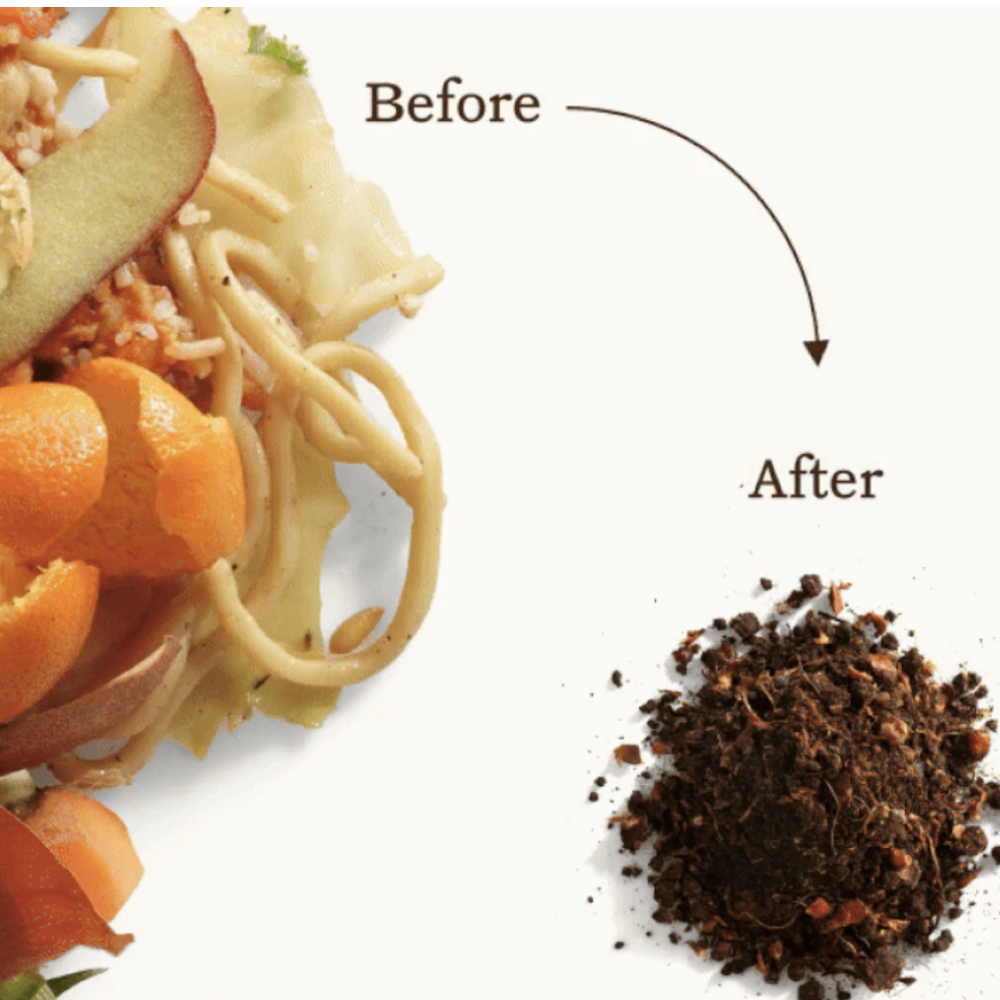

import GemeTerra2CTA from '@site/src/components/GemeTerra2CTA' 
import GemeComposterCTA from '@site/src/components/GemeComposterCTA' 
import RelatedArticles from '@site/src/components/RelatedArticles'
import ReactPlayer from 'react-player'

## Introduction: Embracing the "Continuous" Ecosystem

As an agronomist with over three decades of experience in soil health, I often see home gardeners treating all compost the same. However, the GEME Bio-Composter operates differently from standard batch dehydrators. It uses a Continuous Flow Workflow ("Add & Forget").

This means that at any given moment, the machine contains material in various stages of decomposition: 90% finished microbial humus and 10% partially broken-down matter.

This is not a flaw; it is a biological characteristic.

To use this output safely and effectively, we must move beyond simply "dumping it in a pot." We need to apply standard agricultural practices: Screening (Inoculation) and Soil Capping (Buffering). This guide will teach you how to protect your plants while maximizing the biological power of your GEME.

<!-- truncate -->

## 1. The Harvest & Screening (The Inoculation Loop)

Because you can add waste to GEME at any time, you will inevitably find larger, undecomposed chunks (bones, pits, fibrous stalks) when you harvest.

The Agronomist’s Rule: **Do not force them into the soil**.

- **The Action**: Sift your harvest. You can use a simple garden sieve or just pick out the large pieces with a trowel.

- **The "Recycle" Strategy**: Return these large pieces immediately back into the GEME unit.

- **The Science**: These pieces are not just "trash." They are carriers of the most active, heat-tolerant microbes in your system. Returning them provides a massive "Microbial Inoculation," jumpstarting the decomposition of the next batch of food waste. It keeps your system efficient.

[**See How GEME Composter Works** -->](https://www.geme.bio/how-it-works)

## 2. The Safety Ratio (Avoiding "The Burn")

GEME compost base is a concentrated nutrient source. In agronomy, placing roots directly into high-nutrient concentrate can cause osmotic shock (commonly known as "root burn").

To mitigate this, we use the 1:8 Dilution Rule.

- **The Mix**: Combine **1 part GEME Compost Base with 8 parts Plain Garden Soil**.

  - Note: Use untreated soil or coconut coir. Do not mix with pre-fertilized potting mixes, as this may result in nutrient excess.

<GemeTerra2CTA 
 imgSrc="/img/geme-terra-2-composter.jpg"
 productTitle="GEME Terra II: Best Kitchen Composter"
 features={[
    "✅ Best Composter With No Hidden Costs",
    "✅ Biologically Active Composting System",
    "✅ Quiet, Odour-Free, Real Compost",
    "✅ Zero Filter Costs, No Refills",
    "✅ Reduces Composting Time to Days"
 ]}
buttonText="Get Your GEME Terra II"
  href="https://www.geme.bio/product/terra2?utm_medium=blog&utm_source=geme_website&utm_campaign=general_seo_content&utm_content=advanced-geme-compost-application-guide"
/>

## 3. The Application (The "Soil Capping" Technique)

Because the output is biologically active and may contain small, unfinished particles, we never leave it exposed on the surface. We use a technique called Soil Capping—using a layer of plain soil as a physical barrier.

### Scenario A: For New Plants (The "Sandwich" Base)

Best for: Repotting, transplanting, or new garden beds.

1. **Mix**: Create your 1:8 mixture (GEME base + Soil).

2. **Base Layer**: Place this mixture at the bottom of your pot or planting hole.

3. **The Cap (Crucial)**: Cover this base layer with at least 5cm (2 inches) of plain, unmixed soil.

4. **Plant**: Place your plant into this plain soil layer.

**Why this works**: The 5cm buffer prevents immediate root burn. As you water, nutrients slowly leach downwards, while the roots are encouraged to grow deep to find the "food," resulting in a stronger root system.

### Scenario B: For Existing Plants (The "Donut" Ring)

Best for: Established trees, shrubs, or large potted plants.

Do not pile compost against the stem, as this can cause stem rot.

1. **Dig**: Dig a shallow trench in a ring shape, **5–10cm** away from the main stem (or at the drip line).

2. **Fill**: Fill the trench with your **1:8 mixture**.

3. **Cover**: Cover the ring completely with plain garden soil.

4. **Water**: Water thoroughly to activate the microbes.

**Why this works**: This targets the feeder roots (which are at the periphery) while the soil cover locks in moisture, blocks odors, and prevents pests like fungus gnats from reaching the organic matte, and protecting the microbes from UV radiation.

## 4. The "Wait & Watch" (Storage)

If you have harvested more than you can use, proper storage is critical to keeping the "Bio" part of your Bio-Compost alive.

- **Oxygen is Key**: GEME microbes are aerobic (oxygen-loving).

- **The Container**: Use a woven sack, a paper bag, or a bucket with air holes. **Never** use a sealed Ziploc bag or airtight glass jar.

- **The Result**: If sealed too tight, the mix will go anaerobic and smell like rot. If allowed to breathe, it will continue to cure (mature) in the bag, becoming even better over time.

## 5. Summary: The "Add & Forget" Philosophy Applied to Soil

The beauty of the GEME system is the "Add & Forget" convenience in the kitchen. By using the Screen-Mix-Cap method, you extend this ease to your garden.

You are not just disposing of waste; you are managing a living biological cycle. Treat the output with the respect due to a potent fertilizer, and your garden will thrive.

<GemeTerra2CTA 
 imgSrc="/img/geme-terra-2-composter.jpg"
 productTitle="GEME Terra II: Best Kitchen Composter"
 features={[
    "✅ Best Composter With No Hidden Costs",
    "✅ Biologically Active Composting System",
    "✅ Quiet, Odour-Free, Real Compost",
    "✅ Zero Filter Costs, No Refills",
    "✅ Reduces Composting Time to Days"
 ]}
buttonText="Get Your GEME Terra II"
  href="https://www.geme.bio/product/terra2?utm_medium=blog&utm_source=geme_website&utm_campaign=general_seo_content&utm_content=advanced-geme-compost-application-guide"
/>

## FAQ

### Q: Why does GEME output look different from bag soil?

> A: GEME output is a "continuous flow" product, meaning it contains mixed stages of breakdown. Unlike bagged soil which is chemically uniform, GEME compost is biologically diverse. This is why screening large chunks and returning them to the unit is recommended.

### Q: Can I plant directly into GEME compost?

> A: No. It is too nutrient-dense and may cause root burn. Always mix it at a 1:8 ratio with garden soil and use a 5cm soil cap (layer of plain soil) on top to protect roots and prevent pests.

### Q: What do I do with the bones that didn't break down?

> A: Put them back in the GEME. They act as microbial carriers, helping to break down new food waste faster in the next cycle.

<RelatedArticles
  slugs={[
  "countertop-composter-misnomer-floor-standing-electric-composter",
  "top-5-electric-composters-on-amazon-2026",
  "geme-terra-2-pros-and-cons",
  "top-5-kitchen-composters-pros-and-cons",
  "geme-composter-review-2026",
  "best-kitchen-composter-verdict-2026",
  "best-composter-avoid-recurring-fees-geme-terra-2",
  "how-to-compost-cut-flowers-guide",
  "how-long-does-bokashi-take-to-compost",
  "how-to-care-for-hydrangeas-and-change-colors",
  "best-composter-daily-operation-comparison-lomi-mill-reencle-geme",
  "how-long-does-pizza-last-in-fridge-guide",
  "how-to-compost-eggshells-guide-geme",
  "how-to-compost-coffee-grounds-guide",
  "never-buy-carbon-filter-for-your-composter",
  "best-composter-fastest-real-compost-geme-terra-2",
  "how-to-compost-at-home-beginners-guide",
  "how-long-can-chicken-stay-in-the-fridge",
  "how-to-reduce-odor-indoor-composting-tips",
  "how-long-can-ground-beef-stay-in-the-fridge",
  "nyc-composting-fines-2026-geme-terra-2-best-electric-compost",
  "best-indoor-composter-for-apartment-geme-vs-lomi",
  "the-best-composter-for-kitchen",
  "how-to-reduce-food-waste-during-spring-festival",
  "does-reencle-composter-produce-real-compost",
  "does-mill-composter-really-compost",
  "how-to-reduce-food-waste-at-home-2026",
  "free-mcnugget-caviar-raises-food-waste-concerns",
  "composting-in-winter",
  "how-to-compost-at-home",
  "zero-waste-home-kitchen-composter",
  "does-lomi-composter-really-compost",
  "5-best-kitchen-composters-in-2026",
  "best-kitchen-composter-in-2026-geme-terra-2",
  "geme-vs-reencle-composter-2026",
  "geme-vs-mill-composter-2026",
  "best-kitchen-composter-2026",
  "advanced-geme-compost-application-guide",
  "electric-compost-bin-filters-costs-comparison",
  "geme-vs-lomi", 
  "geme-terra-2-debuts",
  "the-best-composter-to-reduce-food-waste",
  "compost-pile-vs-electric-composter",
  "how-to-make-bananas-last-longer",
  "how-long-do-apples-last-in-the-fridge",
  "can-i-compost-moldy-grapes",
  "can-you-compost-moldy-bread",
  ]}
/>

_Ready to transform your gardening game? Subscribe to our [newsletter](http://geme.bio/signup?utm_medium=blog&utm_source=geme_website&utm_campaign=general_seo_content&utm_content=how-to-compost-at-home-beginners-guide) for expert composting tips and sustainable gardening advice._

