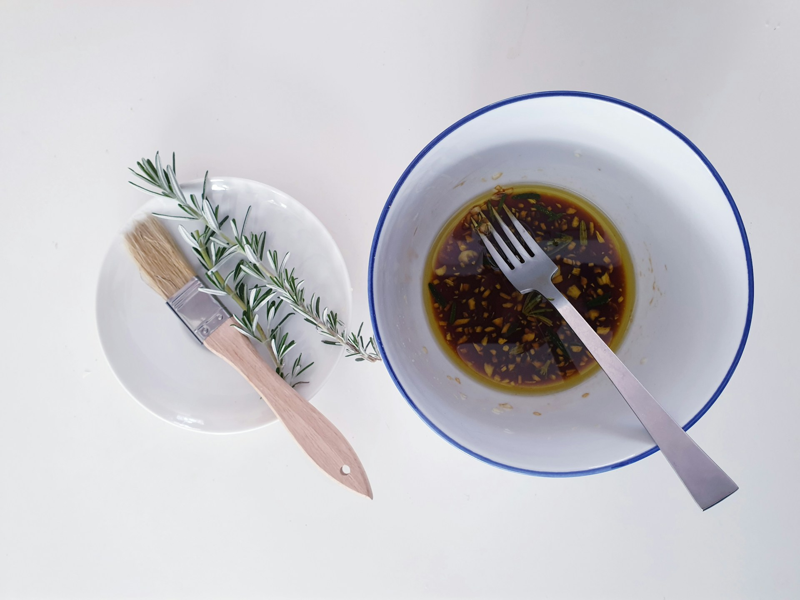

import GemeTerra2CTA from '@site/src/components/GemeTerra2CTA' 
import GemeComposterCTA from '@site/src/components/GemeComposterCTA' 
import RelatedArticles from '@site/src/components/RelatedArticles'
import ReactPlayer from 'react-player'

## Evidence Header

### One-sentence takeaway

Salt and oil don’t “kill composting.” They narrow the aerobic window—so the winning strategy is simple: protect oxygen flow, manage moisture, drain free liquids, and don’t dump brine or fryer oil.

### Why it matters in the kitchen

This is the #1 trust question. If a brand dodges salt/oil, it’s not honest. If a brand claims “everything works,” it’s not engineering. Clear boundaries reduce smell, reduce user error, and protect output quality.

### What we tested (high-level, no secrets)

We evaluated performance across realistic leftover patterns (lightly seasoned → sauce-heavy → oily/salty) and tracked behavioral outcomes: odor risk signals, cycle stability, and whether the mass stayed aerobically active under normal household use.

### What we didn’t test / not claiming

We do not claim unlimited brine/grease tolerance. We do not claim identical results across every household diet. We also don’t publish proprietary control parameters, microbial composition, or internal thresholds.

### Methods & boundaries

Methods & boundaries → [**Open GK Verification**](https://www.geme.bio/gk)

<!-- truncate -->

## 1. Problem: “Salt and oil will ruin composting” is a myth—but “salt and oil don’t matter” is also a lie

Kitchen waste is not garden waste. It’s real food: cooked meals, sauces, fats, seasoning, and sometimes soups.

That’s why “salt & oil” becomes a flashpoint:

- Some brands avoid the topic (users feel misled).

- Others overpromise (“throw anything in”) and users pay for it in smell and poor output.

The truth is more practical: **salt and oil change conditions, and composting is a controlled biological process that depends on those conditions staying in range**.

So the right question isn’t “Will salt/oil kill composting?” It’s: **Where is the boundary, and how do I stay on the safe side**?

[**See How GEME Composter Works** -->](https://www.geme.bio/how-it-works)

## 2. Decision: We design for real leftovers—but we publish boundaries to keep it aerobic

We made two deliberate decisions:

### Decision A: We build for “human food,” not just peels

If you want real adoption, the system has to tolerate messy leftovers—because that’s what people actually have.

That includes some salt and some oil as part of normal meals.

### Decision B: We treat “free liquids + high salt/oil” as the real risk

Salt and oil on their own aren’t the core enemy. The main failure mode is usually:

**Oxygen collapse** (too wet / too compact / coated particles)

→ which shifts decomposition away from stable aerobic behavior

→ which increases odor and slows stabilization.

So we publish a boundary rule that users can actually follow without measuring tools.

## 3. Evidence: What changes when salt/oil go up—and how to keep the system in the safe window

### What salt does (in plain language)

Salt increases stress on microbial activity by changing water availability and shifting which microbes dominate. In practice:

- composting still happens,

- but the “easy zone” shrinks,

- recovery takes longer when combined with wetness/compaction.

### What oil does (in plain language)

Oil/fat can:

- coat particles (reduces air/water exchange),

- encourage compaction (reduces pore space),

- create “slick zones” that are harder to aerate.

Again: **composting can still happen if oxygen pathways are protected**.

## 4. The boundary: what we recommend (clear, honest, kitchen-executable)

### ✅ Commonly works well (normal life)

- Plate leftovers (including normal cooking oil and seasoning)

- Sauces in normal quantities (not puddles)

- Mixed scraps (a variety is healthier than extremes)

Rule of thumb: **if it’s on your plate, it usually works unless it pours**.

### ⚠️ Boundary zone (needs pacing + structure)

- Very oily meals (heavy dressing, fried-food residue)

- Very salty meals (brined foods, pickles, cured items)

- Soup-like leftovers (wet + salty is a double pressure)

In the boundary zone, the “fix” isn’t adding magic. It’s behavioral:

- don’t load extreme meals back-to-back,

- drain free liquids,

- keep structure (avoid pasty compaction).

### ❌ Not recommended (do not do this)

- dumping fryer oil

- dumping brine/pickle juice

- pouring bowls of soup/liquid waste into the system

**If it pours, drain it first**.

That one sentence prevents most “it smells / it stalled” incidents.

## 5. So what: A 60-second checklist to keep it aerobic

When you’re dealing with salty/oily leftovers, do this:

1. Drain free liquids

If it pours, drain it. (Brine and fryer oil belong in disposal, not composting.)

2. Avoid “pasty loads”

If the mix looks like a heavy paste, it’s starving oxygen. Break it up, reduce wetness, avoid compaction.

3. Don’t stack extremes

Two very oily/salty loads in a row is where people get into trouble. Rotate back to normal scraps for a cycle.

4. Use the system like a bin, not a lab

Drop in, close, move on. Boundaries are there so you don’t have to babysit it.

## Trust Stack

- Start with the 3-minute truth → [**Real compost vs dehydrator**](https://www.geme.bio/compare/real-compost-vs-dehydrated-scraps)

- Browse comparisons → [**Choose what to compare**](https://www.geme.bio/compare)

- Methods & boundaries → [**Open GK Verification**](https://www.geme.bio/gk)

- Ready for the kitchen workflow? → [**Shop Terra 2**](https://www.geme.bio/product/terra2?utm_medium=blog&utm_source=geme_website&utm_campaign=general_seo_content&utm_content=electric-composter-salt-oil-boundaries)

<GemeTerra2CTA 
 imgSrc="/img/geme-terra-2-composter.jpg"
 productTitle="GEME Terra II: Best Kitchen Composter"
 features={[
    "✅ Best Composter With No Hidden Costs",
    "✅ Biologically Active Composting System",
    "✅ Quiet, Odour-Free, Real Compost",
    "✅ Zero Filter Costs, No Refills",
    "✅ Reduces Composting Time to Days"
 ]}
buttonText="Get Your GEME Terra II"
  href="https://www.geme.bio/product/terra2?utm_medium=blog&utm_source=geme_website&utm_campaign=general_seo_content&utm_content=electric-composter-salt-oil-boundaries"
/>

<RelatedArticles
  slugs={[
  "advanced-geme-compost-application-guide",
  "countertop-composter-misnomer-floor-standing-electric-composter",
  "top-5-electric-composters-on-amazon-2026",
  "geme-terra-2-pros-and-cons",
  "top-5-kitchen-composters-pros-and-cons",
  "geme-composter-review-2026",
  "best-kitchen-composter-verdict-2026",
  "best-composter-avoid-recurring-fees-geme-terra-2",
  "how-to-compost-cut-flowers-guide",
  "how-long-does-bokashi-take-to-compost",
  "how-to-care-for-hydrangeas-and-change-colors",
  "best-composter-daily-operation-comparison-lomi-mill-reencle-geme",
  "how-long-does-pizza-last-in-fridge-guide",
  "how-to-compost-eggshells-guide-geme",
  "how-to-compost-coffee-grounds-guide",
  "never-buy-carbon-filter-for-your-composter",
  "best-composter-fastest-real-compost-geme-terra-2",
  "how-to-compost-at-home-beginners-guide",
  "how-long-can-chicken-stay-in-the-fridge",
  "how-to-reduce-odor-indoor-composting-tips",
  "how-long-can-ground-beef-stay-in-the-fridge",
  "nyc-composting-fines-2026-geme-terra-2-best-electric-compost",
  "best-indoor-composter-for-apartment-geme-vs-lomi",
  "the-best-composter-for-kitchen",
  "how-to-reduce-food-waste-during-spring-festival",
  "does-reencle-composter-produce-real-compost",
  "does-mill-composter-really-compost",
  "how-to-reduce-food-waste-at-home-2026",
  "free-mcnugget-caviar-raises-food-waste-concerns",
  "composting-in-winter",
  "how-to-compost-at-home",
  "zero-waste-home-kitchen-composter",
  "does-lomi-composter-really-compost",
  "5-best-kitchen-composters-in-2026",
  "best-kitchen-composter-in-2026-geme-terra-2",
  "geme-vs-reencle-composter-2026",
  "geme-vs-mill-composter-2026",
  "best-kitchen-composter-2026",
  "advanced-geme-compost-application-guide",
  "electric-compost-bin-filters-costs-comparison",
  "geme-vs-lomi", 
  "geme-terra-2-debuts",
  "the-best-composter-to-reduce-food-waste",
  "compost-pile-vs-electric-composter",
  "how-to-make-bananas-last-longer",
  "how-long-do-apples-last-in-the-fridge",
  "can-i-compost-moldy-grapes",
  "can-you-compost-moldy-bread",
  ]}
/>

_Ready to transform your gardening game? Subscribe to our [newsletter](http://geme.bio/signup?utm_medium=blog&utm_source=geme_website&utm_campaign=general_seo_content&utm_content=how-to-compost-at-home-beginners-guide) for expert composting tips and sustainable gardening advice._

