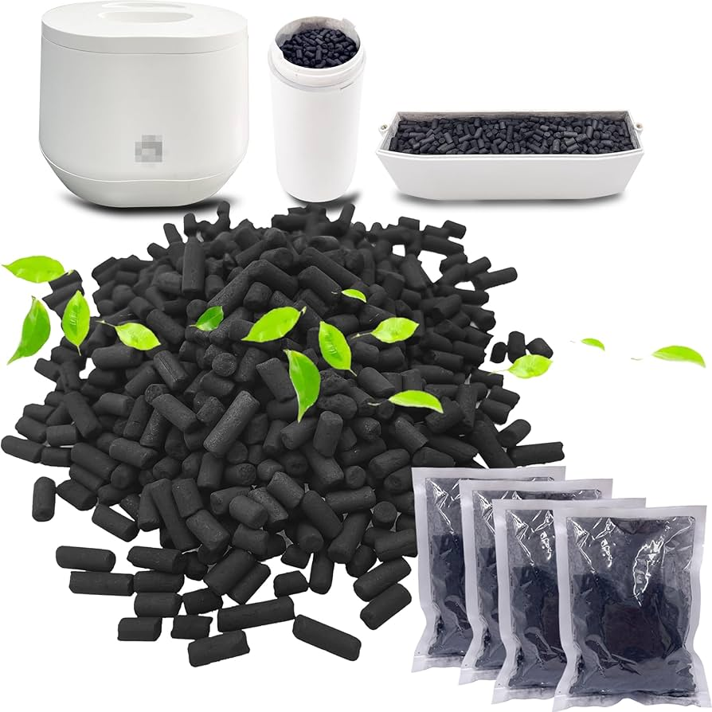
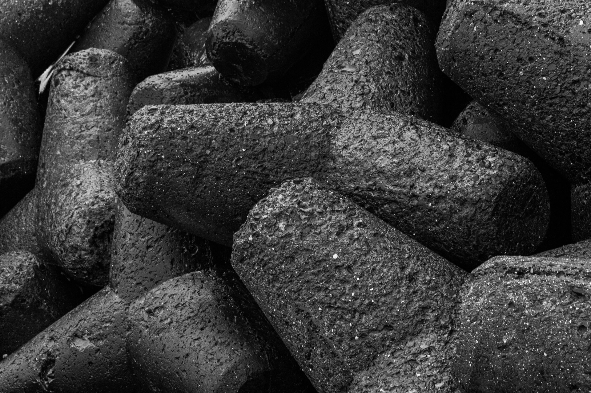

import GemeTerra2CTA from '@site/src/components/GemeTerra2CTA' 
import GemeComposterCTA from '@site/src/components/GemeComposterCTA' 
import RelatedArticles from '@site/src/components/RelatedArticles'
import ReactPlayer from 'react-player'

## Introduction: The "Sour Smell" of Reality

You invested in a premium electric composter like Reencle™ or Lomi™. For the first few weeks, it was magic—your food scraps vanished into “compost”. But around the 8-week mark, a distinct, sharp acidity (reminiscent of vinegar or pickling brine) began to permeate your kitchen.

Consulting the manual, you see a recommended filter replacement cycle of **9-12 months** (Reencle) or **3-6 months** (Lomi). This leaves many users wondering: Is my unit defective? Am I using it wrong?

The answer, based on adsorption kinetics and environmental engineering, is likely **no**.

This article explores why the **physical limitations of activated carbon** in high-humidity environments make a 2–4 month lifespan not just common, but scientifically inevitable.

<!-- truncate -->

## 1. Data Alignment: The Gap Between Lab and Kitchen

To understand the issue, we must first standardize our data. Most residential composters utilize a similar filtration approach:

- **Filter Media**: Standard non-impregnated activated carbon pellets.

- **Fill Weight**: Approximately 440g – 500g (0.97 – 1.1 lbs).

- **The Claim**: 6 to 12 months of usage.

- **The Reality**: User reports from Reddit and consumer forums consistently indicate breakthrough odors occurring between 8 to 12 weeks of daily use.

Why the discrepancy? Manufacturers test filters under "Standard Conditions" (often dry air, specific airflow, controlled VOCs). Your kitchen, however, presents a "Worst-Case Scenario" for carbon.

[**See How GEME Composter Works** -->](https://www.geme.bio/how-it-works)

## 2. The Science: Three Forces That "Kill" Your Filter

From a materials science perspective, three specific mechanisms degrade the filter's performance far faster than the theoretical maximum.

### A. Humidity Quenching (The "Water Trap")

This is the primary failure mode for biological composters (e.g., Reencle).
Activated carbon works via micropores—tiny parking spots for odor molecules. However, water molecules compete for these spots.

- **The Science**: According to research by Werner & Winters, activated carbon exhibits a strong affinity for water vapor once Relative Humidity (RH) exceeds 50-60%.

- **The Reality**: Inside a composter, RH frequently exceeds 85%. At this level, Capillary Condensation occurs, effectively flooding the micropores with liquid water.

- **The Result**: The carbon isn't "full" of odor; it is "flooded" with water, reducing its organic adsorption capacity by up to 80%.

### B. Polar Breakthrough (The "Acid" Problem)

The specific smell you notice, often described as "sour" or "vomit-like", is caused by Volatile Fatty Acids (VFAs), primarily Acetic Acid and Butyric Acid.

- **The Science**: Standard activated carbon is non-polar (hydrophobic). It is excellent at trapping non-polar fumes like benzene (exhaust) or toluene (paint). However, studies on VFA adsorption kinetics show that polar molecules (like acids) are poorly retained by standard carbon, especially when water is present.

- **The Reality**: Because the carbon has a weak "grip" on these acidic molecules, they travel through the filter bed and escape (a phenomenon known as early breakthrough) long before the carbon is chemically saturated.

### C. Thermal Desorption (The Lomi Paradox)

This factor specifically affects high-heat dehydrators (e.g., Lomi, Vitamix FoodCycler).

- **The Science**: Physical adsorption is an exothermic process. By the laws of thermodynamics (Van der Waals forces), adsorption capacity decreases as temperature increases.

- **The Reality**: These machines operate at temperatures exceeding 70°C (158°F). While heat kills bacteria, it also energizes trapped odor molecules, potentially causing them to desorb (release) back into the air stream during the drying cycle.

<GemeTerra2CTA 
 imgSrc="/img/geme-terra-2-composter.jpg"
 productTitle="GEME Terra II: Best Kitchen Composter"
 features={[
    "✅ Best Composter With Permanent Filter",
    "✅ Biologically Active Composting System",
    "✅ Quiet, Odour-Free, Real Compost",
    "✅ Zero Filter Costs, No Refills",
    "✅ Reduces Composting Time to Days"
 ]}
buttonText="Get Your GEME Terra II"
  href="https://www.geme.bio/product/terra2?utm_medium=blog&utm_source=geme_website&utm_campaign=general_seo_content&utm_content=why-composter-filters-only-last-3-months"
/>

## 3. Comparative Analysis: Biological vs. Dehydrators

Not all filters fail the same way. It is crucial to distinguish between the two main types of machines.

| Feature          | Reencle (Biological)                   | Lomi (Dehydrator)                     |
|------------------|----------------------------------------|----------------------------------------|
| **Environment**  | Constant High Humidity (>85%)          | High Heat + Steam Bursts               |
| **Odor Profile** | Fermentation Acids (Sour)              | Cooking Odors / Maillard Reaction      |
| **Failure Mode** | Saturation by Water                    | Thermal Desorption                     |
| **Effective Life** | 2–3 Months (limited by moisture)      | 3–4 Months (limited by cycle count)    |
| **Mitigation**   | Requires active dehumidification        | Requires cooling periods               |

## 4. Feasibility & Economic Solutions

Understanding that a 3-month lifespan is a physical limitation rather than a product defect allows us to adopt more cost-effective maintenance strategies.

### Step 1: The "Dry" Protocol (For Reencle Users)

Since water is the enemy, moisture management is key.

- **Action**: Use the "Dry" or "Purify" mode every 48 hours, or immediately upon noticing condensation on the lid.

- **Additive**: Add dry coffee grounds or sawdust regularly. This acts as a desiccant, reducing the moisture load on the carbon filter.

### Step 2: The "Refill Hack" (For All Users)

Replacing the plastic cartridge every 90 days is expensive and environmentally wasteful. Most cartridges can be opened (some require a screwdriver, others twist off).

- **Material**: Purchase bulk Pelletized Activated Carbon.

- **Specification**: Look for "Coal-based" carbon with an Iodine Number > 1000 mg/g (a standard measure of adsorption surface area).

- **Cost Efficiency**: Bulk carbon costs approximately 10% of the price of pre-filled OEM cartridges. This makes a 3-month replacement cycle economically viable.

## 5. Conclusion

While the "1-year lifespan" claim may hold under controlled, low-humidity testing conditions, it is rarely achievable in the heavy, wet environment of active composting.

By accepting that **activated carbon is a high-frequency consumable** in this specific application and switching to bulk refills, users can maintain an odor-free kitchen without breaking the bank.

## References

[1] Werner, D., & Winters, H. (1986). Effect of Relative Humidity on the Adsorption of Selected VOCs on Activated Carbon. ASHRAE Transactions. (Demonstrates the significant loss of capacity at RH >60%).

[2] Dąbrowski, A., et al. (2005). Adsorption of Volatile Fatty Acids (VFAs) on Activated Carbon: Kinetic and Thermodynamic Studies. (Highlights the rapid breakthrough of polar acidic molecules).

[3] Komilis, D. P., & Ham, R. K. (2004). Life-Cycle Inventory of Municipal Solid Waste Composting. (Analyzes the moisture and VOC generation rates in composting substrates).

**Disclaimer**: *This article is for educational purposes only. It provides an analysis based on general material science principles and is not a critique of any specific manufacturer's warranty or quality assurance. Actual filter life varies based on individual usage patterns.*

<GemeTerra2CTA 
 imgSrc="/img/geme-terra-2-composter.jpg"
 productTitle="GEME Terra II: Best Kitchen Composter"
 features={[
    "✅ Best Composter With Permanent Filter",
    "✅ Biologically Active Composting System",
    "✅ Quiet, Odour-Free, Real Compost",
    "✅ Zero Filter Costs, No Refills",
    "✅ Reduces Composting Time to Days"
 ]}
buttonText="Get Your GEME Terra II"
  href="https://www.geme.bio/product/terra2?utm_medium=blog&utm_source=geme_website&utm_campaign=general_seo_content&utm_content=why-composter-filters-only-last-3-months"
/>

<RelatedArticles
  slugs={[
  "electric-composter-salt-oil-boundaries",
  "advanced-geme-compost-application-guide",
  "countertop-composter-misnomer-floor-standing-electric-composter",
  "top-5-electric-composters-on-amazon-2026",
  "geme-terra-2-pros-and-cons",
  "top-5-kitchen-composters-pros-and-cons",
  "geme-composter-review-2026",
  "best-kitchen-composter-verdict-2026",
  "best-composter-avoid-recurring-fees-geme-terra-2",
  "how-to-compost-cut-flowers-guide",
  "how-long-does-bokashi-take-to-compost",
  "how-to-care-for-hydrangeas-and-change-colors",
  "best-composter-daily-operation-comparison-lomi-mill-reencle-geme",
  "how-long-does-pizza-last-in-fridge-guide",
  "how-to-compost-eggshells-guide-geme",
  "how-to-compost-coffee-grounds-guide",
  "never-buy-carbon-filter-for-your-composter",
  "best-composter-fastest-real-compost-geme-terra-2",
  "how-to-compost-at-home-beginners-guide",
  "how-long-can-chicken-stay-in-the-fridge",
  "how-to-reduce-odor-indoor-composting-tips",
  "how-long-can-ground-beef-stay-in-the-fridge",
  "nyc-composting-fines-2026-geme-terra-2-best-electric-compost",
  "best-indoor-composter-for-apartment-geme-vs-lomi",
  "the-best-composter-for-kitchen",
  "how-to-reduce-food-waste-during-spring-festival",
  "does-reencle-composter-produce-real-compost",
  "does-mill-composter-really-compost",
  "how-to-reduce-food-waste-at-home-2026",
  "free-mcnugget-caviar-raises-food-waste-concerns",
  "composting-in-winter",
  "how-to-compost-at-home",
  "zero-waste-home-kitchen-composter",
  "does-lomi-composter-really-compost",
  "5-best-kitchen-composters-in-2026",
  "best-kitchen-composter-in-2026-geme-terra-2",
  "geme-vs-reencle-composter-2026",
  "geme-vs-mill-composter-2026",
  "best-kitchen-composter-2026",
  "advanced-geme-compost-application-guide",
  "electric-compost-bin-filters-costs-comparison",
  "geme-vs-lomi", 
  "geme-terra-2-debuts",
  "the-best-composter-to-reduce-food-waste",
  "compost-pile-vs-electric-composter",
  "how-to-make-bananas-last-longer",
  "how-long-do-apples-last-in-the-fridge",
  "can-i-compost-moldy-grapes",
  "can-you-compost-moldy-bread",
  ]}
/>

_Ready to transform your gardening game? Subscribe to our [newsletter](http://geme.bio/signup?utm_medium=blog&utm_source=geme_website&utm_campaign=general_seo_content&utm_content=how-to-compost-at-home-beginners-guide) for expert composting tips and sustainable gardening advice._

