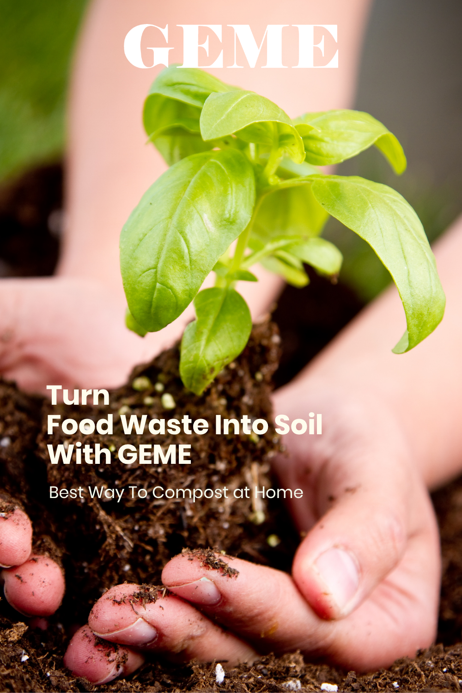
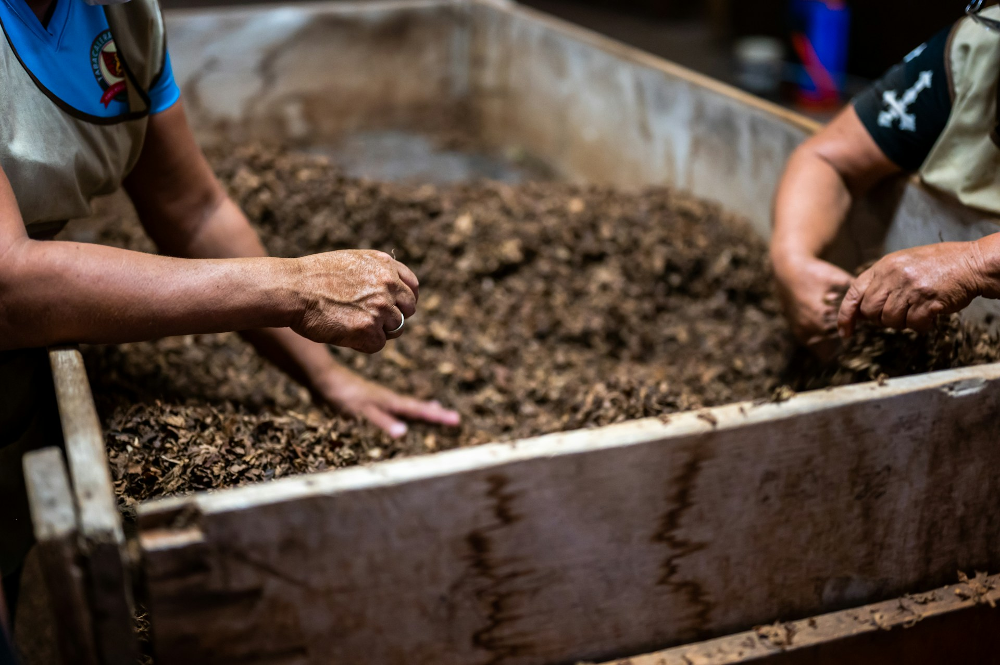
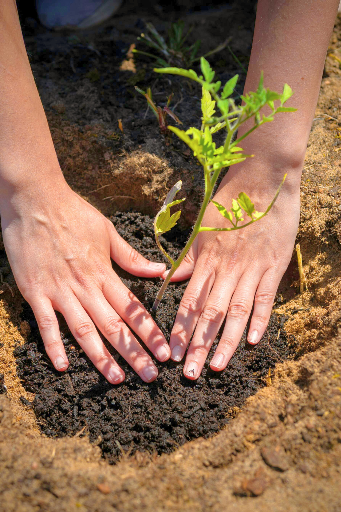
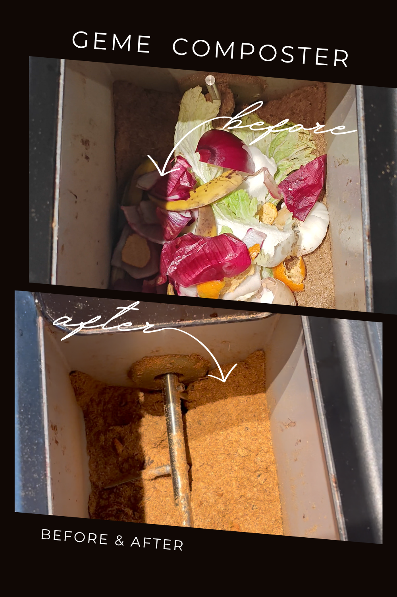

import GemeTerra2CTA from '@site/src/components/GemeTerra2CTA' 
import GemeComposterCTA from '@site/src/components/GemeComposterCTA' 
import RelatedArticles from '@site/src/components/RelatedArticles'
import ReactPlayer from 'react-player'

## Introduction

Let's be real. Most of us feel a little guilty every time we scrape leftover spaghetti into the trash. All those food scraps, banana peels, coffee grounds, sad lettuce leaves, just sitting in a landfill, doing nothing useful except producing methane.

But here's the good news. Composting at home is actually much easier than you think. You don't need a backyard. You don't need a degree in soil science. You just need the right information and the right system for your situation.

In this guide, I'll walk you through everything you need to know about composting at home. We'll cover the basics, look at traditional methods, and then dive into a modern solution that solves most of the headaches that keep people from composting in the first place.

By the end, you'll know exactly which composting approach works for your life.

<!-- truncate -->

## Table Of Content 

1. [**What Is Composting**](#1-what-is-composting)

 - [How Composting Actually Works](#how-composting-actually-works)
 - [Why Bother Composting](#why-bother-composting)

2. [**What Can You Compost**](#2-what-can-you-compost)

 - [The Greens (Nitrogen-Rich Materials)](#the-greens-nitrogen-rich-materials)
 - [The Browns (Carbon-Rich Materials)](#the-browns-carbon-rich-materials)
 - [The Golden Rule of Composting](#the-golden-rule-of-composting)
 - [What NOT to Put in a Basic Compost Pile](#what-not-to-put-in-a-basic-compost-pile)

3. [**How to Start Composting**](#3-how-to-start-composting)

 - [Method 1: Traditional Backyard Composting](#method-1-traditional-backyard-composting)
 - [Method 2: Composting with GEME (The Modern Solution)](#method-2-composting-with-geme-the-modern-solution)

4. [**Which Composting Method Is Right for You**](#4-which-composting-method-is-right-for-you)

## 1. What Is Composting

Before we get into the how, let's talk about the what.

Composting is the natural process of recycling organic waste into nutrient-rich soil. At its core, it's simply nature's way of breaking down dead plants and food scraps and turning them back into something living plants can use again .

When you think about it, composting isn't anything new. It's been happening in forests and fields for millions of years. A leaf falls, it rots, it becomes dirt. That's composting. We're just taking that natural process and giving it a little help.

### How Composting Actually Works

Composting relies on billions of tiny workers that you can't see with your naked eye. Bacteria, fungi, and other microorganisms eat your food scraps and yard waste. As they eat, they break everything down into a dark, crumbly material that smells like a forest after rain.

These decomposers need three main things to do their job well:

| **What Microbes Need** | **Why It Matters**                                                                                           |
|--------------------|---------------------------------------------------------------------------------------------------------|
| Food               | A mix of nitrogen-rich "greens" (food scraps) and carbon-rich "browns" (leaves, paper) gives them energy and protein |
| Water              | The pile should be moist like a wrung-out sponge, not soaking wet                                        |
| Air                | Oxygen keeps the process aerobic and prevents bad smells                                                 |

Think of your compost pile as a slow-cooking meal for microbes. Give them the right ingredients, and they'll do the work for you.

### Why Bother Composting

The benefits go way beyond just feeling good about not wasting food.

First, composting keeps food waste out of landfills. When food scraps end up in a landfill, they get buried under piles of other trash with no oxygen. In that environment, they break down anaerobically and produce methane, a greenhouse gas that's about 25 times more potent than carbon dioxide when it comes to trapping heat. [**Learn How to Reduce Food Waste at Home** -->](https://www.geme.bio/blog/how-to-reduce-food-waste-at-home-2026)

Second, compost is incredible for your garden. It improves soil structure, helps soil hold onto water, and feeds plants with slow-release nutrients. Gardeners who use compost report stronger root systems and higher yields from their vegetables.

Third, it saves you money. Instead of buying bags of fertilizer and soil amendments from the garden center, you can make your own for free from your kitchen scraps . Over time, that adds up to real savings.

And honestly, there's something satisfying about closing the loop. You grow food, you eat it, you compost the scraps, and that compost helps you grow more food. It just feels right.

[**See How GEME Composter Works** -->](https://www.geme.bio/how-it-works)

<GemeTerra2CTA 
 imgSrc="/img/geme-terra-2-composter.jpg"
 productTitle="GEME Terra II: Best Kitchen Composter"
 features={[
    "✅ Best Tool to Make Compost at Home",
    "✅ Biologically Active Composting System",
    "✅ Quiet, Odour-Free, Real Compost",
    "✅ Zero Filter Costs, No Refills",
    "✅ Reduces Composting Time to Days"
 ]}
buttonText="Get Your GEME Terra II"
  href="https://www.geme.bio/product/terra2?utm_medium=blog&utm_source=geme_website&utm_campaign=general_seo_content&utm_content=how-to-compost-at-home"
/>

## 2. What Can You Compost

Knowing what to put in your compost is half the battle. Let me break it down simply.

### The Greens (Nitrogen-Rich Materials)

Greens are your wet, fresh materials. They provide the protein that microbes need to multiply and do their job.

| **Green Material**              | **Notes**                                    |
|-----------------------------|------------------------------------------|
| Fruit and vegetable scraps  | All of them, peels, cores, everything    |
| Coffee grounds and filters  | Excellent addition                       |
| Tea leaves and tea bags     | Remove staples if present                |
| Fresh grass clippings       | Mix with browns to prevent clumping      |
| Plant trimmings             | From houseplants or garden               |
| Eggshells                   | Crush them first for faster breakdown    |

### The Browns (Carbon-Rich Materials)

Browns are your dry, fibrous materials. They provide energy for the microbes and help keep the pile from getting too wet and smelly.

| **Brown Material**           | **Notes**                              |
|-----------------------------|----------------------------------------|
| Dry leaves                  | Nature's perfect brown material        |
| Shredded cardboard          | Break down boxes into small pieces     |
| Shredded newspaper          | Black and white ink only               |
| Paper towels and napkins    | Unused or used with food only          |
| Sawdust and wood chips      | From untreated wood only               |
| Straw or hay                | Available at garden centers            |

### The Golden Rule of Composting

Aim for roughly two to three parts browns to one part greens by volume . This ratio is the sweet spot that keeps your compost working efficiently.

If your pile smells bad or looks slimy, you have too many greens. Add more browns. If nothing seems to be happening, your pile is too dry or has too many browns. Add more greens and a little water.

### What NOT to Put in a Basic Compost Pile

For a traditional backyard bin, avoid these items :

| **Avoid**              | **Why**                                      |
|------------------------|----------------------------------------------|
| Meat and fish          | Attracts pests and smells bad                |
| Dairy products         | Same problem as meat                         |
| Oils and fatty foods   | Slow to break down, attract animals          |
| Pet waste              | Can contain pathogens                        |
| Diseased plants        | May spread disease to your garden            |
| Weed seeds             | You'll just plant weeds later                |
| Plastic or glass       | Won't break down                             |

Important note: **If you're using an advanced electric composter like GEME, many of these restrictions don't apply**. More on that later.

<GemeTerra2CTA 
 imgSrc="/img/geme-terra-2-composter.jpg"
 productTitle="GEME Terra II: Best Kitchen Composter"
 features={[
    "✅ Best Tool to Make Compost at Home",
    "✅ Biologically Active Composting System",
    "✅ Quiet, Odour-Free, Real Compost",
    "✅ Zero Filter Costs, No Refills",
    "✅ Reduces Composting Time to Days"
 ]}
buttonText="Get Your GEME Terra II"
  href="https://www.geme.bio/product/terra2?utm_medium=blog&utm_source=geme_website&utm_campaign=general_seo_content&utm_content=how-to-compost-at-home"
/>

## 3. How to Start Composting

Now for the practical part. There are two main paths you can take when composting at home. One is the traditional, low-tech, outdoor method. The other is a modern, countertop solution that works for almost any living situation.

Let me walk you through both, and you can decide which one fits your life better.

### Method 1: Traditional Backyard Composting

This is the method your grandparents probably used. It's simple, cheap, and works great if you have outdoor space and a little patience.

#### What You'll Need

A compost bin (or you can build your own from wire mesh or wood pallets)

A pitchfork or shovel for turning the pile

A kitchen collection container for scraps

#### Step-by-Step Instructions

1. **Choose a location**

> Pick a spot in your yard that's well-drained and gets some shade. The shade helps prevent the pile from drying out too quickly in summer. A 3-foot by 3-foot by 3-foot pile is the minimum size needed to generate enough heat for efficient breakdown.

2. **Start with a brown base**

> Lay down a 4 to 6 inch layer of browns like dry leaves or shredded cardboard at the bottom. This helps with drainage and airflow.

3. **Add layers**

> Add your greens (food scraps, grass clippings) in 3 to 4 inch layers, then cover with another layer of browns. Always finish with a brown layer on top to help control odors and discourage flies.

4. **Keep it moist**

> Water the pile as you build it. The material should feel like a damp sponge, not dripping wet. If it's too dry, the microbes slow down. If it's too wet, it gets smelly.

5. **Turn the pile**

> Every week or two, use your pitchfork to mix everything up. Turning brings oxygen into the center of the pile, which speeds up decomposition and prevents bad smells. Move material from the outside of the pile to the inside.

6. **Wait and harvest**

> In 4 to 6 months (or longer if you don't turn it often), your compost will be ready. Finished compost looks dark and crumbly, smells earthy, and you shouldn't be able to recognize what you originally put in.

#### The Pros and Cons of Traditional Composting

Let me be honest with you about what traditional composting really involves.

##### Pros

| Pro               | Details                                                                 |
|-------------------|-------------------------------------------------------------------------|
| Low cost          | You can start with almost nothing. A bin costs \$30 to \$100, but you can make your own for free |
| Large capacity    | A backyard pile can handle all your yard waste plus kitchen scraps       |
| Good for gardens  | If you already have a vegetable garden, the pile is right there          |
| Satisfying        | There's something primal and rewarding about making your own soil         |

##### Cons

| **Con**                  | **Details**                                                                                   |
|--------------------------|----------------------------------------------------------------------------------------------|
| Requires outdoor space   | Not an option for apartment dwellers or people without yards                                 |
| Slow process             | Expect to wait 4 to 12 months for finished compost                                           |
| Needs regular attention  | You have to turn the pile, monitor moisture, and balance greens and browns                   |
| Can attract pests        | Rats, raccoons, and flies love improperly managed compost piles                              |
| Can smell bad            | If your ratio is off or you don't turn enough, the pile can get stinky                       |
| Weather dependent        | Cold winters slow down or stop the process entirely                                          |
| Restricted ingredients   | No meat, dairy, or oily foods allowed                                                        |
| Physical work            | Turning a pile by hand is actual labor                                                       |

Here's the truth that many composting guides won't tell you. Traditional composting works great for some people. But if you're busy, live in an apartment, or just don't want to spend your weekends turning a pile of rotting vegetables, it might not be the right fit.

I've talked to so many people who tried traditional composting, got overwhelmed or frustrated, and gave up. The guilt of throwing away food scraps came right back. That's where a better solution comes in.

### Method 2: Composting with GEME (The Modern Solution)

GEME is a completely different approach to home composting. Instead of relying on you to manually manage a pile outside, GEME uses technology and biology to do the work for you.

#### What Is GEME

GEME is a Continuous Aerobic Bio-processor. That's a fancy way of saying it's a kitchen appliance that uses live microorganisms to digest your food waste. It's not a dehydrator. It doesn't just dry and grind your scraps. It actually breaks them down biologically, just like nature does, but way faster.

The heart of the system is something called GEME Kobold. It's a proprietary blend of 46 different heat-tolerant, aerobic bacteria strains that work together to decompose organic waste. These microbes are naturally occurring, not artificially engineered, and they've been evolved over decades to be incredibly efficient at breaking down food scraps.

When you add food waste to the GEME, the machine automatically controls the temperature, moisture, and oxygen levels to create the perfect environment for the Kobold microbes to thrive. Within 6 to 8 hours, most of your waste has been converted into an active, biologically rich compost base.

#### How It Works (Step by Step)

##### Step 1: Add your scraps

Open the lid and toss in your food waste. Coffee grounds, eggshells, vegetable peels, leftovers, even meat and small bones. All of it goes in.

##### Step 2: Let the machine do its job

The GEME runs continuously. There's no "cycle" to start or wait for. The machine senses what's inside and adjusts temperature, moisture, and airflow automatically.

##### Step 3: Harvest your compost

After a month or two, your chamber will be full. You open it up, scoop out most of the contents, and leave about 10 to 20 percent inside as a starter bed for the next round. The compost you harvest is moist, soil-like, and full of living microorganisms.

##### Step 4: Use it in your garden

Mix the compost with soil at a ratio of about 1 part compost to 8 parts soil. Your plants will love it.

<GemeTerra2CTA 
 imgSrc="/img/geme-terra-2-composter.jpg"
 productTitle="GEME Terra II: Best Kitchen Composter"
 features={[
    "✅ Best Tool to Make Compost at Home",
    "✅ Biologically Active Composting System",
    "✅ Quiet, Odour-Free, Real Compost",
    "✅ Zero Filter Costs, No Refills",
    "✅ Reduces Composting Time to Days"
 ]}
buttonText="Get Your GEME Terra II"
  href="https://www.geme.bio/product/terra2?utm_medium=blog&utm_source=geme_website&utm_campaign=general_seo_content&utm_content=how-to-compost-at-home"
/>

#### Why GEME Is Different from Other Electric Composters

Before I go further, I need to clear something up. Not all electric composters are the same.

Many popular electric composters on the market, like Lomi, are actually dehydrators. They use heat and grinding blades to dry out your food scraps into a powder. The result looks kind of like dirt, but it's not compost. It's dried, sterilized organic matter that still needs further processing before it can be used in a garden.

Independent reviews confirm this. One reviewer noted that Lomi's process is "drying and grinding up whatever you put inside it," and warned that the end product isn't as nutrient-rich as traditional composting.

GEME is fundamentally different. It uses living microbes to actually break down waste biologically, just like a traditional compost pile does. The difference is speed and convenience. What takes nature months, GEME does in hours.

#### The GEME Advantage

Here's what makes GEME the best choice for most modern households.

| **Feature**                 | **Traditional Compost**                        | **GEME Composter**                        |
|-----------------------------|-----------------------------------------------|-------------------------------------------|
| **Time to usable compost**      | 4–12 months                                  | 1 month (first harvest), then ongoing  |
| **Space required**              | Backyard or outdoor area                      | Kitchen floor               |
| **Handles meat and dairy**?     | No                                            | Yes                                       |
| **Requires turning**?           | Yes, weekly                                   | No, machine does it automatically         |
| **Works in winter**?            | No (slows/stops)                              | Yes, year-round                           |
| **Pests and odors**             | Highly-potential problem if not managed              | Sealed system, permanent odor control     |
| **Daily attention needed**      | Yes (monitoring, turning)                     | No (just add scraps)                      |
| **Filter costs**                | None                                          | \$0 (permanent metal-ion catalyst)         |

Check the pros & cons of GEME composter: [**GEME Terra II Pros & Cons](https://www.geme.bio/blog/geme-terra-2-pros-and-cons)

#### No Hidden Costs

One of the things I appreciate most about GEME is that there are no recurring fees. Many electric composters require you to buy charcoal filters every few months. Those costs add up.

GEME uses a permanent metal-ion oxidation catalyst for odor control. It's not a filter that saturates and needs replacement. It's designed to last the lifetime of the machine.

#### The 6 to 8 Hour Reality

When we talk about a 6 to 8 hour GEME breakdown cycle, it needs to be more specific. Here's what that actually means in practice. Soft materials like fruit peels and vegetable scraps break down very quickly within that timeframe. More fibrous materials like woody stems or corn cobs take longer, which is normal and expected.

The machine runs continuously, so you add new waste whenever you have it. When you harvest after a month or two, you'll have a mix of fully broken down compost and a few larger pieces. Those larger pieces can simply be returned to the machine to continue breaking down. This is called the "sift and return" principle, and it's a normal part of how the system works.

👉 [Learn More About GEME Terra II](https://www.geme.bio/product/terra2?utm_medium=blog&utm_source=geme_website&utm_campaign=general_seo_content&utm_content=how-to-compost-at-home)

👉 [Explore GEME Pro for Big Households/Plant Shops/Restaurants](https://www.geme.bio/product/geme?utm_medium=blog&utm_source=geme_website&utm_campaign=general_seo_content&utm_content=?utm_medium=blog&utm_source=geme_website&utm_campaign=general_seo_content&utm_content=how-to-compost-at-home)

#### Who Is GEME For

GEME is perfect for:

 - Apartment dwellers with no outdoor space

 - Busy people who don't have time to manage a compost pile

 - Anyone who wants to compost meat, dairy, and bones

 - Gardeners who want high-quality compost without waiting months

 - People who live in cold climates where outdoor composting stops in winter

 - Anyone who wants real compost, not dried food dust

<GemeTerra2CTA 
 imgSrc="/img/geme-terra-2-composter.jpg"
 productTitle="GEME Terra II: Best Kitchen Composter"
 features={[
    "✅ Best Tool to Make Compost at Home",
    "✅ Biologically Active Composting System",
    "✅ Quiet, Odour-Free, Real Compost",
    "✅ Zero Filter Costs, No Refills",
    "✅ Reduces Composting Time to Days"
 ]}
buttonText="Get Your GEME Terra II"
  href="https://www.geme.bio/product/terra2?utm_medium=blog&utm_source=geme_website&utm_campaign=general_seo_content&utm_content=how-to-compost-at-home"
/>

##### The Only Downside

GEME costs more upfront than a plastic compost bin. You're paying for technology and convenience. But when you factor in the time you save, the year-round operation, and the fact that you never buy filters, many people find it's well worth the investment.

## 4. Which Composting Method Is Right for You

Let me help you decide.

**Choose traditional backyard composting if**:

 - You have a yard with space for a pile or bin

 - You don't mind waiting 4 to 12 months for compost

 - You're willing to turn the pile and monitor moisture regularly

 - You don't generate much meat or dairy waste

 - You want the cheapest possible option

**Choose GEME composter if**:

 - You live in an apartment or have no outdoor space

 - You want compost in weeks, not months

 - You don't want to deal with turning piles or balancing ratios

 - You cook daily and generate consistent food waste

 - You want to compost everything including meat, dairy, and small bones

 - You live in a cold climate or want to compost year-round

 - You hate the idea of buying filter replacements

See the comparison of top 5 composters: [Top 5 Electric Composters on Amazon](https://www.geme.bio/blog/top-5-electric-composters-on-amazon-2026)

## Conclusion: Start Composting Today

Whether you choose a simple backyard bin or a high-tech GEME system, the most important step is just to start. Every banana peel you compost instead of trashing is one less piece of waste producing methane in a landfill.

Traditional composting is cheap and effective if you have outdoor space and patience. It works. Millions of people do it successfully.

But **if you want real compost without the waiting, without the turning, and without the restrictions on what you can put in, GEME is the answer**. It takes the biological process that nature invented and speeds it up, miniaturizes it, and puts it on your kitchen floor.

No more guilt about throwing away food. No more smelly bins or fruit flies. Just rich, dark compost that helps your plants thrive.

The choice is yours. But either way, start composting today.

### Trust Stack

- Start with the 3-minute truth → [**Real compost vs dehydrator**](https://www.geme.bio/compare/real-compost-vs-dehydrated-scraps)

- Browse comparisons → [**Choose what to compare**](https://www.geme.bio/compare)

- Methods & boundaries → [**Open GK Verification**](https://www.geme.bio/gk)

- Ready for the kitchen workflow? → [**Shop Terra 2**](https://www.geme.bio/product/terra2?utm_medium=blog&utm_source=geme_website&utm_campaign=general_seo_content&utm_content=how-to-compost-at-home)

👉 [Learn More About GEME Terra II](https://www.geme.bio/product/terra2?utm_medium=blog&utm_source=geme_website&utm_campaign=general_seo_content&utm_content=how-to-compost-at-home)

👉 [Explore GEME Pro for Big Households/Plant Shops/Restaurants](https://www.geme.bio/product/geme?utm_medium=blog&utm_source=geme_website&utm_campaign=general_seo_content&utm_content=?utm_medium=blog&utm_source=geme_website&utm_campaign=general_seo_content&utm_content=how-to-compost-at-home)

<GemeTerra2CTA 
 imgSrc="/img/geme-terra-2-composter.jpg"
 productTitle="GEME Terra II: Best Kitchen Composter"
 features={[
    "✅ Best Tool to Make Compost at Home",
    "✅ Biologically Active Composting System",
    "✅ Quiet, Odour-Free, Real Compost",
    "✅ Zero Filter Costs, No Refills",
    "✅ Reduces Composting Time to Days"
 ]}
buttonText="Get Your GEME Terra II"
  href="https://www.geme.bio/product/terra2?utm_medium=blog&utm_source=geme_website&utm_campaign=general_seo_content&utm_content=how-to-compost-at-home"
/>

<GemeComposterCTA 
 imgSrc="/img/geme-bio-composter.jpg"
 productTitle="GEME Pro Composter"
 features={[
    "✅ Best Composter With No Hidden Costs",
    "✅ Produce Soil-Ready Compost For Plant Growth",
    "✅ Quiet, Odor-Free, Quick(6-8 hours)",
    "✅ Large Capacity (19 L) For Daily Waste"
  ]}
buttonText="Get Your GEME Pro"
  href="https://www.geme.bio/product/geme?utm_medium=blog&utm_source=geme_website&utm_campaign=general_seo_content&utm_content=?utm_medium=blog&utm_source=geme_website&utm_campaign=general_seo_content&utm_content=how-to-compost-at-home"
/>

## Sources & References

Here is the complete list of sources referenced throughout the blog post. All links are active and point to the official sources.

### GEME Official Sources

1. [GEME: How It Works](https://www.geme.bio/how-it-works)	46+ heat-tolerant Kobold strains; continuous aerobic bio-processor definition; 6-8 hour breakdown window; 30-40 dB noise level; permanent metal-ion filter; moisture output standard; maintenance guidelines; input boundaries (no large bones or shells);

2. [GEME Kobold: Revolutionary Compost Starter](https://www.geme.bio/kobold-introduction)	46 complex, heat-tolerant aerobic bacillus bacteria; activates at 80°C to kill pathogens; 6-8 hours to decompose bio-wastes; produces high-activity organic fertilizer; activates soil microorganisms;

3. [Best Kitchen Composters in 2026](https://www.geme.bio/blog/best-kitchen-composter-in-2026-geme-terra-2)	True composting requires active microorganisms; dehydrators produce sterilized food residue; GEME uses microbial process for real compost;

4. [Best Indoor Composter for Apartments](https://www.geme.bio/blog/best-indoor-composter-for-apartment-geme-vs-lomi)	Lomi vs GEME comparison; Kobold microbes digest waste; temperature range 45-55°C; genuine living compost output;

5. [GEME Help Center](https://gemecomposter.tawk.help)	Kobold is self-replicating; only refill if cycle crashes; no daily dosing required

### Environmental & Government Sources

1. [EPA Recycle City](https://www3.epa.gov/recyclecity/compost.htm)	Composting requires browns, greens, and water; pile should have equal browns to greens; outdoor composting timeline 2 months to 2 years; indoor bins available for small spaces;

2. [Arizona DEQ Compost Guide](https://azdeq.gov/compostguide)	Composting definition; adds nutrients to soil; improves water retention; increases plant yield; US food waste statistics;

3. [ScienceDirect: Methane Study](https://www.sciencedirect.com/science/article/abs/pii/S0095069625000580)	Food waste accounts for 8% of global greenhouse emissions; landfilled food emits methane within months; landfills produce ~17.4% of US methane emissions;

4. [Michigan EGLE: Methane Statistics](https://www.michigan.gov/egle/newsroom/mi-environment/2025/07/08/food-waste)	Methane 28x more potent than CO2 over 100 years; 84x more potent over 20 years; landfills third-largest source of US methane emissions; landfilled food waste causes 58% of landfill methane; 61% escapes before capture;

### General Composting Resources

1. [Mitre 10: Composting Guide](https://www.mitre10.com.au/diy/composting-what-is-how-to)	Traditional compost heap requires regular turning; may attract pests; takes longer to break down; benefits include reduced household waste, enhanced soil fertility, improved water retention, reduced chemical fertilizer reliance.

**Disclaimer**: *All third-party sources (EPA, Arizona DEQ, Michigan EGLE, ScienceDirect, Mitre 10) are cited for reference only. GEME does not claim any official endorsement from these organizations. For the most current product information, please refer to the official GEME website at https://www.geme.bio.*

<RelatedArticles
  slugs={[
  "what-can-you-put-in-electric-composter-meat-dairy-bones",
  "why-composter-filters-only-last-3-months",
  "electric-composter-salt-oil-boundaries",
  "advanced-geme-compost-application-guide",
  "countertop-composter-misnomer-floor-standing-electric-composter",
  "top-5-electric-composters-on-amazon-2026",
  "geme-terra-2-pros-and-cons",
  "top-5-kitchen-composters-pros-and-cons",
  "geme-composter-review-2026",
  "best-kitchen-composter-verdict-2026",
  "best-composter-avoid-recurring-fees-geme-terra-2",
  "how-to-compost-cut-flowers-guide",
  "how-long-does-bokashi-take-to-compost",
  "how-to-care-for-hydrangeas-and-change-colors",
  "best-composter-daily-operation-comparison-lomi-mill-reencle-geme",
  "how-long-does-pizza-last-in-fridge-guide",
  "how-to-compost-eggshells-guide-geme",
  "how-to-compost-coffee-grounds-guide",
  "never-buy-carbon-filter-for-your-composter",
  "best-composter-fastest-real-compost-geme-terra-2",
  "how-to-compost-at-home-beginners-guide",
  "how-long-can-chicken-stay-in-the-fridge",
  "how-to-reduce-odor-indoor-composting-tips",
  "how-long-can-ground-beef-stay-in-the-fridge",
  "nyc-composting-fines-2026-geme-terra-2-best-electric-compost",
  "best-indoor-composter-for-apartment-geme-vs-lomi",
  "the-best-composter-for-kitchen",
  "how-to-reduce-food-waste-during-spring-festival",
  "does-reencle-composter-produce-real-compost",
  "does-mill-composter-really-compost",
  "how-to-reduce-food-waste-at-home-2026",
  "free-mcnugget-caviar-raises-food-waste-concerns",
  "composting-in-winter",
  "how-to-compost-at-home",
  "zero-waste-home-kitchen-composter",
  "does-lomi-composter-really-compost",
  "5-best-kitchen-composters-in-2026",
  "best-kitchen-composter-in-2026-geme-terra-2",
  "geme-vs-reencle-composter-2026",
  "geme-vs-mill-composter-2026",
  "best-kitchen-composter-2026",
  "advanced-geme-compost-application-guide",
  "electric-compost-bin-filters-costs-comparison",
  "geme-vs-lomi", 
  "geme-terra-2-debuts",
  "the-best-composter-to-reduce-food-waste",
  "compost-pile-vs-electric-composter",
  "how-to-make-bananas-last-longer",
  "how-long-do-apples-last-in-the-fridge",
  "can-i-compost-moldy-grapes",
  "can-you-compost-moldy-bread",
  ]}
/>

_Ready to transform your gardening game? Subscribe to our [newsletter](http://geme.bio/signup?utm_medium=blog&utm_source=geme_website&utm_campaign=general_seo_content&utm_content=how-to-compost-at-home-beginners-guide) for expert composting tips and sustainable gardening advice._

