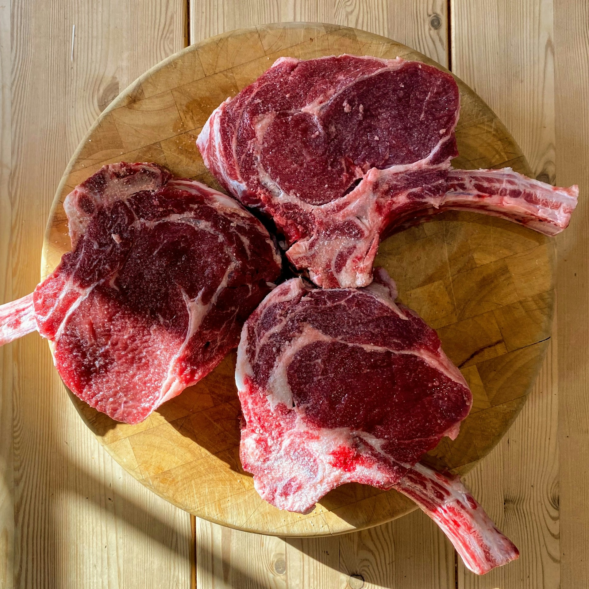

import GemeTerra2CTA from '@site/src/components/GemeTerra2CTA' 
import GemeComposterCTA from '@site/src/components/GemeComposterCTA' 
import RelatedArticles from '@site/src/components/RelatedArticles'
import ReactPlayer from 'react-player'

## Evidence Header

### One-sentence takeaway

Most people don’t need a fantasy list—they need a decision system: meat/dairy can be OK in normal leftovers when the process stays aerobic, but large dense bones and shells are hard limits, and “wet + greasy + dense” loads raise odor risk.

### Why it matters in the kitchen

This question decides adoption. If users can’t load real leftovers, they won’t keep the habit. If they load “hard-no” items, they blame the machine. Clear rules protect both user experience and output quality.

### What we tested (high-level, no secrets)

We assessed typical leftover categories (cooked meals including meat/dairy) for workflow stability and odor-risk behavior under normal loading, plus failure cases tied to density, hardness, and excess liquids.

### What we didn’t test / not claiming

We are not claiming every meat/dairy scenario works equally. We are not publishing microbial composition or control thresholds.

### Methods & boundaries

Methods & boundaries → [**Open GK Verification**](https://www.geme.bio/gk)

<!-- truncate -->

## 1. Problem: “Meat and dairy are forbidden” is outdated—but “everything goes” creates failure

Traditional backyard composting advice often says: avoid meat and dairy because they can attract pests and create odors when composting conditions aren’t controlled.

But a kitchen electric composter is not an open pile:

- it’s enclosed,

- it’s managed,

- and the goal is a stable process.

So the real question becomes:

**Which categories are compatible with controlled aerobic digestion, and which are fundamentally not**?

[**See How GEME Composter Works** -->](https://www.geme.bio/how-it-works)

## 2. Decision: We separate inputs by physics, not by fear

We classify inputs by what actually determines outcomes:

### Axis 1: Can it break down biologically in a reasonable time?

Most food can eventually.

### Axis 2: Will it break the process before it breaks down?

This is where reality hits:

- Excess liquids break oxygen flow quickly.

- Greasy + dense loads compact.

- Hard mineral/hard collagen structures don’t break down reliably in kitchen timelines.

So we don’t publish a “pretty list.”

We publish **rules that prevent the common failure modes**.

## 3. Evidence: The “OK / Conditional / Hard No” rule set (kitchen-executable)

### ✅ OK (commonly works well)

These match real leftovers and fit the daily habit:

- Cooked meals (including meat in normal portions)

- Dairy as part of mixed leftovers (cheese on food, small amounts mixed in)

- Bread, rice, pasta, vegetables, fruit

- Sauces in normal amounts (not liquid dumps)

**Why it works**: normal leftovers are mixed, not extreme, and the process can remain aerobic when oxygen pathways are protected.

### ⚠️ Conditional (works if you respect boundaries)

- Very fatty trimmings (large blobs of fat)

- Very wet leftovers (soups, stews)

- Large chunks that create dense, wet pockets

- Very salty / oily meals loaded repeatedly

#### How to make “conditional” work? 

- Drain what pours.

- Avoid “all fat, all wet, all dense” loads.

- Pace extremes (don’t do back-to-back).

This is not about moral purity, it’s about staying in the aerobic window.

### ❌ Hard No (physics says no)

- Large dense bones (too dense to break down reliably)

- Oyster/clam shells (mineral hardness)

- Large volumes of free liquids (breaks oxygen transfer)

- Dumping brine / fryer oil

These aren’t “preferences.” They’re hard limits tied to material hardness, density, and oxygen collapse.

## 4. So what: The 20-second decision rule (what users actually need)

When you’re holding something and asking “Can this go in?”

Ask three questions:

1. **Is it food you’d eat**?

> If yes, it’s often OK—unless it’s mostly liquid, mostly fat, or extremely dense.

2. **Is it hard like mineral or thick bone**?

> If yes → hard no.

3. **Does it pour or pool as liquid**?

> If yes → drain first (or do not add).

That’s it. You don’t need a 60-line list, you just need three checks.

## Trust Stack

- Start with the 3-minute truth → [**Real compost vs dehydrator**](https://www.geme.bio/compare/real-compost-vs-dehydrated-scraps)

- Browse comparisons → [**Choose what to compare**](https://www.geme.bio/compare)

- Methods & boundaries → [**Open GK Verification**](https://www.geme.bio/gk)

- Ready for the kitchen workflow? → [**Shop Terra 2**](https://www.geme.bio/product/terra2?utm_medium=blog&utm_source=geme_website&utm_campaign=general_seo_content&utm_content=what-can-you-put-in-electric-composter-meat-dairy-bones)

<GemeTerra2CTA 
 imgSrc="/img/geme-terra-2-composter.jpg"
 productTitle="GEME Terra II: Best Kitchen Composter"
 features={[
    "✅ Best Composter With Permanent Filter",
    "✅ Biologically Active Composting System",
    "✅ Quiet, Odour-Free, Real Compost",
    "✅ Zero Filter Costs, No Refills",
    "✅ Reduces Composting Time to Days"
 ]}
buttonText="Get Your GEME Terra II"
  href="https://www.geme.bio/product/terra2?utm_medium=blog&utm_source=geme_website&utm_campaign=general_seo_content&utm_content=what-can-you-put-in-electric-composter-meat-dairy-bones"
/>

<RelatedArticles
  slugs={[
  "why-composter-filters-only-last-3-months",
  "electric-composter-salt-oil-boundaries",
  "advanced-geme-compost-application-guide",
  "countertop-composter-misnomer-floor-standing-electric-composter",
  "top-5-electric-composters-on-amazon-2026",
  "geme-terra-2-pros-and-cons",
  "top-5-kitchen-composters-pros-and-cons",
  "geme-composter-review-2026",
  "best-kitchen-composter-verdict-2026",
  "best-composter-avoid-recurring-fees-geme-terra-2",
  "how-to-compost-cut-flowers-guide",
  "how-long-does-bokashi-take-to-compost",
  "how-to-care-for-hydrangeas-and-change-colors",
  "best-composter-daily-operation-comparison-lomi-mill-reencle-geme",
  "how-long-does-pizza-last-in-fridge-guide",
  "how-to-compost-eggshells-guide-geme",
  "how-to-compost-coffee-grounds-guide",
  "never-buy-carbon-filter-for-your-composter",
  "best-composter-fastest-real-compost-geme-terra-2",
  "how-to-compost-at-home-beginners-guide",
  "how-long-can-chicken-stay-in-the-fridge",
  "how-to-reduce-odor-indoor-composting-tips",
  "how-long-can-ground-beef-stay-in-the-fridge",
  "nyc-composting-fines-2026-geme-terra-2-best-electric-compost",
  "best-indoor-composter-for-apartment-geme-vs-lomi",
  "the-best-composter-for-kitchen",
  "how-to-reduce-food-waste-during-spring-festival",
  "does-reencle-composter-produce-real-compost",
  "does-mill-composter-really-compost",
  "how-to-reduce-food-waste-at-home-2026",
  "free-mcnugget-caviar-raises-food-waste-concerns",
  "composting-in-winter",
  "how-to-compost-at-home",
  "zero-waste-home-kitchen-composter",
  "does-lomi-composter-really-compost",
  "5-best-kitchen-composters-in-2026",
  "best-kitchen-composter-in-2026-geme-terra-2",
  "geme-vs-reencle-composter-2026",
  "geme-vs-mill-composter-2026",
  "best-kitchen-composter-2026",
  "advanced-geme-compost-application-guide",
  "electric-compost-bin-filters-costs-comparison",
  "geme-vs-lomi", 
  "geme-terra-2-debuts",
  "the-best-composter-to-reduce-food-waste",
  "compost-pile-vs-electric-composter",
  "how-to-make-bananas-last-longer",
  "how-long-do-apples-last-in-the-fridge",
  "can-i-compost-moldy-grapes",
  "can-you-compost-moldy-bread",
  ]}
/>

_Ready to transform your gardening game? Subscribe to our [newsletter](http://geme.bio/signup?utm_medium=blog&utm_source=geme_website&utm_campaign=general_seo_content&utm_content=how-to-compost-at-home-beginners-guide) for expert composting tips and sustainable gardening advice._

