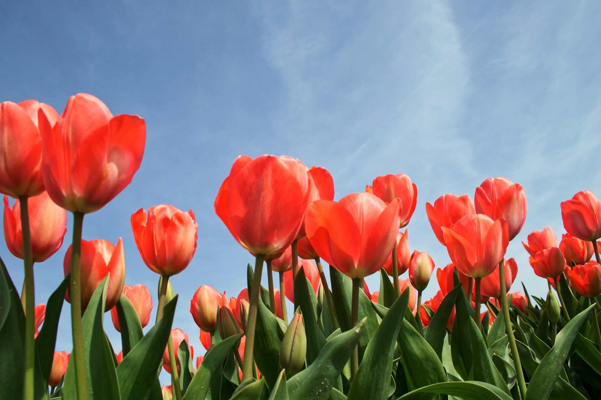
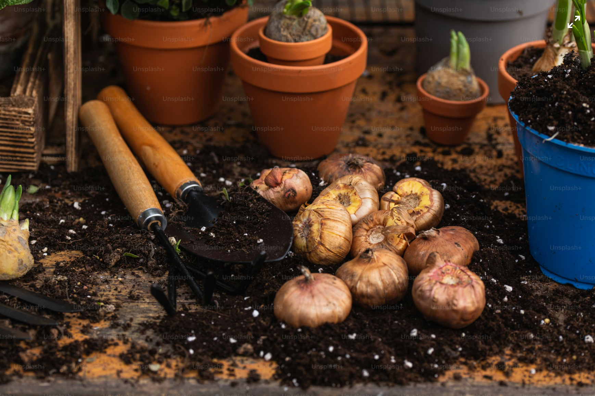
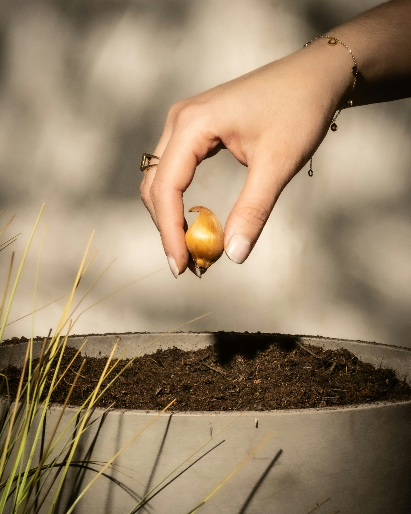

import GemeTerra2CTA from '@site/src/components/GemeTerra2CTA' 
import GemeComposterCTA from '@site/src/components/GemeComposterCTA' 
import RelatedArticles from '@site/src/components/RelatedArticles'
import ReactPlayer from 'react-player'

Spring has arrived, and if you're looking at a bag of tulip bulbs wondering if it's too late to get them in the ground, you're not alone. The good news is that while autumn is the traditional planting season for tulips, you do have options for planting in spring.

This guide covers everything from the classic fall planting method to creative spring solutions, so you can enjoy those beautiful blooms no matter when you start.

<!-- truncate -->

## Table Of Content

1. [**When to Plant Tulip Bulbs for Best Results**](#1-when-to-plant-tulip-bulbs-for-best-results)

2. [**Choosing the Right Tulip Bulbs**](#2-choosing-the-right-tulip-bulbs)

3. [**How to Plant Tulip Bulbs Step by Step**](#3-how-to-plant-tulip-bulbs-step-by-step)

  - [Selecting the Location](#1-selecting-the-location)
  - [Determining Depth and Spacing](#2-determining-depth-and-spacing)
  - [The Planting Process](#3-the-planting-process)

4. [**Bulbs to Plant in Spring**](#4-bulbs-to-plant-in-spring)

5. [**Caring for Tulips After They Bloom**](#5-caring-for-tulips-after-they-bloom)

6. [**What to Do with Wilting Tulip Stems and Leaves**](#6-what-to-do-with-wilting-tulip-stems-and-leaves)

7. [**Frequently Asked Questions (Answered)**](#7-faq-answered)

## 1. When to Plant Tulip Bulbs for Best Results

The ideal planting window for tulips varies by climate. In general, northern gardeners plant in September and October, while those in the South plant in November and December. The key is to wait until nighttime temperatures consistently stay in the [40s Fahrenheit (around 4-10°C)](https://www.rhs.org.uk/plants/types/bulbs/planting) before planting. This timing allows bulbs to establish roots before the ground freezes without pushing up tender shoots that winter frost could damage.

If you miss this fall window, don't worry. You can still plant tulip bulbs in spring as soon as the ground thaws and is workable. While they likely won't bloom the same spring, they will develop foliage and store energy to produce flowers the following year.

## 2. Choosing the Right Tulip Bulbs

Healthy bulbs are the foundation of a successful display. Before planting, inspect your bulbs carefully. They should be [firm to the touch](https://www.missouribotanicalgarden.org/gardens-gardening/your-garden/help-for-the-home-gardener/advice-tips-resources/gardening-help-faqs/question/1552/how-do-i-care-for-potted-tulips-and-daffodils), not soft or mushy, and not dried out and crispy. The larger the bulb, the bigger and more impressive the flower will be in its first season. If you live in a warmer climate, purchase pre-chilled bulbs or chill them yourself in a refrigerator for 8-10 weeks before planting to simulate the cold period tulips need to bloom properly.

## 3. How to Plant Tulip Bulbs Step by Step

### 1. Selecting the Location

Tulips thrive in full sun, which helps the plants produce strong, sturdy stems and vibrant colors. They also need well-drained soil to [prevent bulb rot](https://www.johnson.k-state.edu/programs/lawn-garden/agent-articles-fact-sheets-and-more/agent-articles/annual-and-perennial-flowers/how-to-plant-tulips.html) during rainy periods or winter thaws. If your soil is heavy clay, amend it with compost, sand, or other organic matter to improve drainage before planting.

### 2. Determining Depth and Spacing

A good rule of thumb is to plant bulbs two to three times as deep as the bulb is wide. For standard tulip bulbs, this translates to a depth of about [6 inches (15 cm)](https://www.rhs.org.uk/education-learning/children-young-people/family-activities/grow-it/tulip) from the soil surface to the bottom of the bulb. Some gardeners plant as deep as 8 inches (20 cm) in very sandy soils to provide extra insulation and stability.

For spacing, large bulbs like tulips and daffodils should be placed about [4 to 6 inches apart](https://hvp.osu.edu/pocketgardener/sourcetext/description/tulipa.html). A three-inch spacing is adequate for smaller bulbs like crocuses and grape hyacinths. If you're planting in clusters for a natural look, you can space them slightly closer together.

### 3. The Planting Process

1. Loosen the soil in your planting area to a depth of about 12 inches.

2. Dig individual holes or a single trench to the appropriate depth.

3. Place the bulbs in the holes with the pointed end facing up.

4. Cover the bulbs with soil and water them thoroughly to settle the soil and eliminate air pockets.

5. Apply a [2-inch layer of mulch](https://www.epicgardening.com/tulip-daffodil-post-bloom/) over the planting area to help regulate soil temperature and retain moisture.

If you're planting a large number of bulbs, a faster method is to till the soil about 2 inches deep, place the bulbs on top of the soil, and then cover them with a 2 to 4 inch layer of mulch. This "top planting" method can save significant time and effort.

## 4. Bulbs to Plant in Spring

While tulips are the stars of this guide, spring is also the time to plant a variety of summer-blooming bulbs and tubers. Unlike fall-planted bulbs that sleep through winter, these are planted in spring after the last frost for same-season blooms.

Here are some great options to consider alongside your tulips:

| **Bulb Type** | **Bloom Time**                    | **Planting Depth** | **Spacing**        |
|-----------|-------------------------------|----------------|---------------|
| **Gladiolus** | 60-90 days                    | 4 inches       | 4-6 inches    |
| **Dahlia**    | 8-10 weeks                    | 4-6 inches     | 12-24 inches  |
| **Lily**      | Mid to late summer            | 6-8 inches     | 8-12 inches   |
| **Allium**    | Late spring to early summer   | 6-8 inches     | 6-8 inches    |
| **Begonia**   | 10-12 weeks                   | 2-3 inches     | 8-12 inches   |

For truly unique spring plantings, consider [camassia, scilla, starflower, winter aconite, cyclamen, chionodoxa, and fritillaria](https://yardandgarden.extension.iastate.edu/how-to/selecting-and-planting-spring-blooming-bulbs), which add beautiful color and height to your garden. Ornamental alliums also provide dramatic spherical blooms that contrast beautifully with tulips.

<GemeTerra2CTA 
 imgSrc="/img/geme-terra-2-composter.jpg"
 productTitle="GEME Terra II: Best Kitchen Composter"
 features={[
    "✅ The First AI-Powered Kitchen Composter",
    "✅ Biologically Active Composting System",
    "✅ Quiet, Odour-Free, Real Compost",
    "✅ Zero Filter Costs, No Refills",
    "✅ Reduces Composting Time to Days"
 ]}
buttonText="Get Your GEME Terra II"
  href="https://www.geme.bio/product/terra2?utm_medium=blog&utm_source=geme_website&utm_campaign=general_seo_content&utm_content=how-to-plant-tulip-bulbs-in-spring-guide"
/>

## 5. Caring for Tulips After They Bloom

To help your tulips return year after year, proper post-bloom care is essential. Start by deadheading the spent flowers as soon as they fade to prevent the plant from putting energy into seed production. Leave the foliage in place until it turns yellow and withers naturally, as the leaves are photosynthesizing to store energy in the bulb for next year's display.

Once the foliage has completely died back, you have two options. You can leave the bulbs in the ground to naturalize, or you can dig them up, allow them to dry for a week, and store them in a [cool, dry location](https://www.workshop.bunnings.com.au/discussion/comment/44009#Comment_44009) in a mesh bag or paper sack until fall planting time. Before storing, discard any bulbs that show signs of damage or rot.

Applying a balanced, slow-release bulb fertilizer right after flowering can also help boost bulb strength, especially for perennial varieties like [Darwin hybrids](https://www.bhg.com/what-to-do-with-tulip-bulbs-after-flowering-11707333).

## 6. What to Do with Wilting Tulip Stems and Leaves

After your tulips have finished blooming and the foliage has yellowed, you'll be left with a pile of organic waste. Rather than sending these spent stems and leaves to a landfill where they would decompose anaerobically and produce methane, consider composting them to create nutrient-rich soil for your garden.

This is where the [**GEME Terra II**](https://www.geme.bio/product/terra2?utm_medium=blog&utm_source=geme_website&utm_campaign=general_seo_content&utm_content=how-to-plant-tulip-bulbs-in-spring-guide) comes in. Traditional composting can take months and often requires outdoor space, but GEME uses [live microorganisms called **Kobold**](https://www.geme.bio/kobold-introduction) to break down organic waste in a fraction of the time. The machine is a Continuous Aerobic Bio-processor, meaning it maintains ideal conditions for beneficial microbes 24/7. In just 6 to 8 hours, soft materials like tulip petals and leaves are completely broken down. More fibrous stems take a bit longer, but the continuous feed design means you can keep adding waste without waiting for cycles to finish.

[**See How GEME Terra II Works** -->](https://www.geme.bio/how-it-works)

<GemeTerra2CTA 
 imgSrc="/img/geme-terra-2-composter.jpg"
 productTitle="GEME Terra II: Best Kitchen Composter"
 features={[
    "✅ The First AI-Powered Kitchen Composter",
    "✅ Biologically Active Composting System",
    "✅ Quiet, Odour-Free, Real Compost",
    "✅ Zero Filter Costs, No Refills",
    "✅ Reduces Composting Time to Days"
 ]}
buttonText="Get Your GEME Terra II"
  href="https://www.geme.bio/product/terra2?utm_medium=blog&utm_source=geme_website&utm_campaign=general_seo_content&utm_content=how-to-plant-tulip-bulbs-in-spring-guide"
/>

The output is an active compost base, a moist, soil-like material full of living microorganisms. When mixed with soil at a ratio of about 1 part compost to 8 parts soil, it provides a powerful nutrient boost for your garden. [**Learn how to use compost created by GEME Composter Terra 2** -->](https://www.geme.bio/blog/advanced-geme-compost-application-guide)

And unlike many electric composters that require expensive charcoal filters, GEME uses a [**permanent** metal-ion oxidation catalyst](https://www.geme.bio/blog/never-buy-carbon-filter-for-your-composter) that never needs replacing, saving you money and hassle over the long term.

If you're [an apartment dweller](https://www.geme.bio/blog/best-indoor-composter-for-apartment-geme-vs-lomi) or someone without outdoor composting space, GEME offers a practical way to close the loop from your spring tulips to your summer garden. No more throwing away perfectly good organic material, no more guilt about food and yard waste.

## 7. FAQ (Answered)

### Q: Can you plant tulips in the spring and still get flowers?

> A: Yes, with the right approach. Tulips planted in spring after the ground thaws may not bloom the same season, but they will produce foliage and store energy to flower beautifully the following year. For same-year blooms, choose pre-chilled bulbs and plant them as early as possible, or force them indoors.

### Q: How long do tulip bulbs last if not planted?

> A: If stored properly in a cool, dry place, tulip bulbs can remain viable for up to 12 months. However, they lose vigor over time, so it's best to plant them as soon as possible.

### Q: Do tulips come back every year?

> A: Some tulip varieties, particularly species tulips and Darwin hybrids, are more likely to perennialize and return for several years. Many modern hybrids are treated as annuals and produce their best display in the first year.

### Q: What's the best way to store tulip bulbs until planting?

> A: Store bulbs in a mesh bag or paper sack in a cool, dry location with good air circulation. A dark basement or garage with temperatures between 60-65°F (15-18°C) is ideal. Avoid storing bulbs in plastic bags, which can trap moisture and promote rot.

### Q: How deep should I plant tulip bulbs in heavy clay soil?

> A: In heavy clay soil, plant tulip bulbs slightly shallower, about 4-5 inches deep, to reduce the risk of rot. You can also amend the soil with compost, sand, or other organic matter to improve drainage before planting.

## Conclusion: Bringing It All Together

Planting tulips is one of gardening's most rewarding experiences. Whether you're following the traditional fall schedule or getting creative with spring plantings, a little knowledge goes a long way toward a spectacular display.

Remember to choose healthy bulbs, plant them at the right depth in well-drained soil, and give them the care they need after blooming. And when those stems and leaves are spent, consider composting them with a system like GEME to complete the cycle and nourish your garden for seasons to come. See this post: [**Can I Compost Flowers**](https://www.geme.bio/blog/how-to-compost-cut-flowers-guide)

Now get out there and plant those bulbs. Your future self will be surrounded by a sea of spring color.

<GemeTerra2CTA 
 imgSrc="/img/geme-terra-2-composter.jpg"
 productTitle="GEME Terra II: Best Kitchen Composter"
 features={[
    "✅ The First AI-Powered Kitchen Composter",
    "✅ Biologically Active Composting System",
    "✅ Quiet, Odour-Free, Real Compost",
    "✅ Zero Filter Costs, No Refills",
    "✅ Reduces Composting Time to Days"
 ]}
buttonText="Get Your GEME Terra II"
  href="https://www.geme.bio/product/terra2?utm_medium=blog&utm_source=geme_website&utm_campaign=general_seo_content&utm_content=how-to-plant-tulip-bulbs-in-spring-guide"
/>

## Sources

1. [**K-State Research and Extension: How to Plant Tulips**](https://www.johnson.k-state.edu)

2. [**K-State Research and Extension: Planting Spring Flowering Bulbs**](https://www.butler.k-state.edu)

3. [**Better Homes & Gardens: Can You Plant Tulip Bulbs in Spring and Still Get Flowers?**](https://www.bhg.com)

4. [**Gardens Illustrated: Is it too late to plant bulbs?**](https://www.gardensillustrated.com)

5. [**LSU AgCenter: It's Time to Plant Spring Flowering Bulbs**](https://www.lsuagcenter.com)

6. [**Iowa State University Extension: How deep should I plant tulips?**](https://yardandgarden.extension.iastate.edu)

7. [**Iowa State University Extension: How do you force tulip bulbs indoors?**](https://yardandgarden.extension.iastate.edu)

8. [**Iowa State University Extension: Is it possible to save tulip bulbs that have been forced indoors?**](https://yardandgarden.extension.iastate.edu)

9. [**Iowa State University Extension – Care of Spring-Flowering Bulbs after Bloom**](https://yardandgarden.extension.iastate.edu)

10. [**NC State Extension: Bulbs, Corms and Tubers That Can Be Planted in Spring**](https://henderson.ces.ncsu.edu)

11. [**UC Agriculture and Natural Resources: Spring Tasks: Planting Summer-Flowering Bulbs**](https://ucanr.edu)

12. [**University of Maryland Extension: Maryland Grows**](https://marylandgrows.umd.edu)

13. [**University of Illinois Extension: Bringing spring indoors: How to force bulbs to bloom in winter**](https://extension.illinois.edu)

14. [**Chicago Botanic Garden: Forcing Tulips**](https://www.chicagobotanic.org)

15. [**Cornell University: Dig no more: Just till 2 inches for tulip bulbs, study finds**](https://news.cornell.edu)

16. [**Epic Gardening: A Guide to Tulip and Daffodil Post-Bloom Care**](https://www.epicgardening.com)

17. [**House Digest: 10 Perennial Bulbs To Plant In The Spring For Beautiful Summer Blooms**](https://www.housedigest.com)

18. [**DIY Garden: 10 Quick-Flowering Bulbs to Plant in Spring**](https://diygarden.co.uk)

19. [**Missouri Botanical Garden: Gardening Help FAQs**](https://www.missouribotanicalgarden.org)

20. [**GEME Official Website: How It Works**](https://www.geme.bio/how-it-works)

<RelatedArticles
  slugs={[
  "how-to-compost-at-home",
  "what-can-you-put-in-electric-composter-meat-dairy-bones",
  "why-composter-filters-only-last-3-months",
  "electric-composter-salt-oil-boundaries",
  "advanced-geme-compost-application-guide",
  "countertop-composter-misnomer-floor-standing-electric-composter",
  "top-5-electric-composters-on-amazon-2026",
  "geme-terra-2-pros-and-cons",
  "top-5-kitchen-composters-pros-and-cons",
  "geme-composter-review-2026",
  "best-kitchen-composter-verdict-2026",
  "best-composter-avoid-recurring-fees-geme-terra-2",
  "how-to-compost-cut-flowers-guide",
  "how-long-does-bokashi-take-to-compost",
  "how-to-care-for-hydrangeas-and-change-colors",
  "best-composter-daily-operation-comparison-lomi-mill-reencle-geme",
  "how-long-does-pizza-last-in-fridge-guide",
  "how-to-compost-eggshells-guide-geme",
  "how-to-compost-coffee-grounds-guide",
  "never-buy-carbon-filter-for-your-composter",
  "best-composter-fastest-real-compost-geme-terra-2",
  "how-to-compost-at-home-beginners-guide",
  "how-long-can-chicken-stay-in-the-fridge",
  "how-to-reduce-odor-indoor-composting-tips",
  "how-long-can-ground-beef-stay-in-the-fridge",
  "nyc-composting-fines-2026-geme-terra-2-best-electric-compost",
  "best-indoor-composter-for-apartment-geme-vs-lomi",
  "the-best-composter-for-kitchen",
  "how-to-reduce-food-waste-during-spring-festival",
  "does-reencle-composter-produce-real-compost",
  "does-mill-composter-really-compost",
  "how-to-reduce-food-waste-at-home-2026",
  "free-mcnugget-caviar-raises-food-waste-concerns",
  "composting-in-winter",
  "how-to-compost-at-home",
  "zero-waste-home-kitchen-composter",
  "does-lomi-composter-really-compost",
  "5-best-kitchen-composters-in-2026",
  "best-kitchen-composter-in-2026-geme-terra-2",
  "geme-vs-reencle-composter-2026",
  "geme-vs-mill-composter-2026",
  "best-kitchen-composter-2026",
  "advanced-geme-compost-application-guide",
  "electric-compost-bin-filters-costs-comparison",
  "geme-vs-lomi", 
  "geme-terra-2-debuts",
  "the-best-composter-to-reduce-food-waste",
  "compost-pile-vs-electric-composter",
  "how-to-make-bananas-last-longer",
  "how-long-do-apples-last-in-the-fridge",
  "can-i-compost-moldy-grapes",
  "can-you-compost-moldy-bread",
  ]}
/>

_Ready to transform your gardening game? Subscribe to our [newsletter](http://geme.bio/signup?utm_medium=blog&utm_source=geme_website&utm_campaign=general_seo_content&utm_content=how-to-compost-at-home-beginners-guide) for expert composting tips and sustainable gardening advice._

