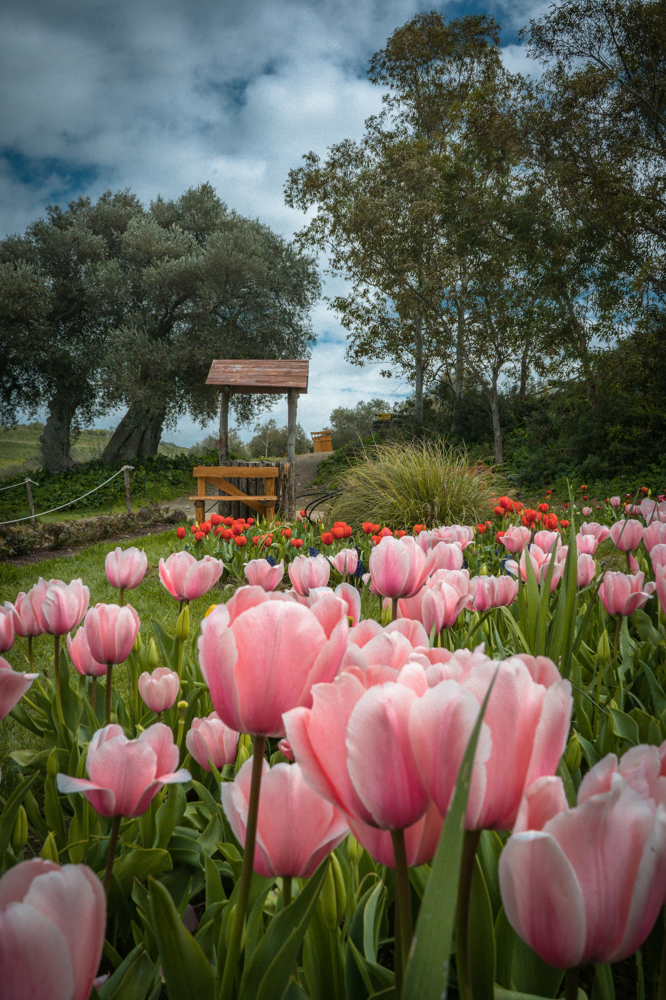
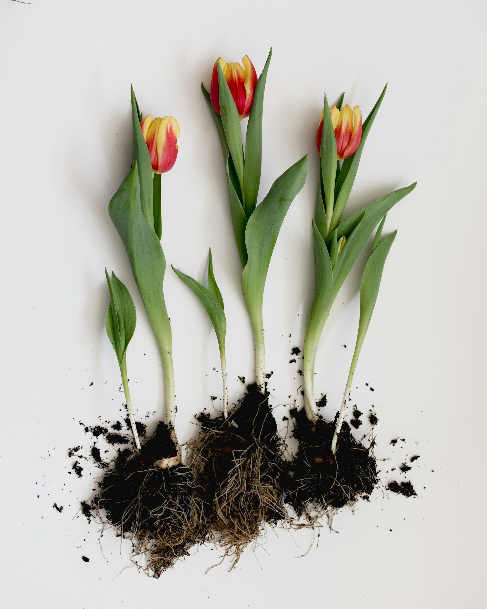
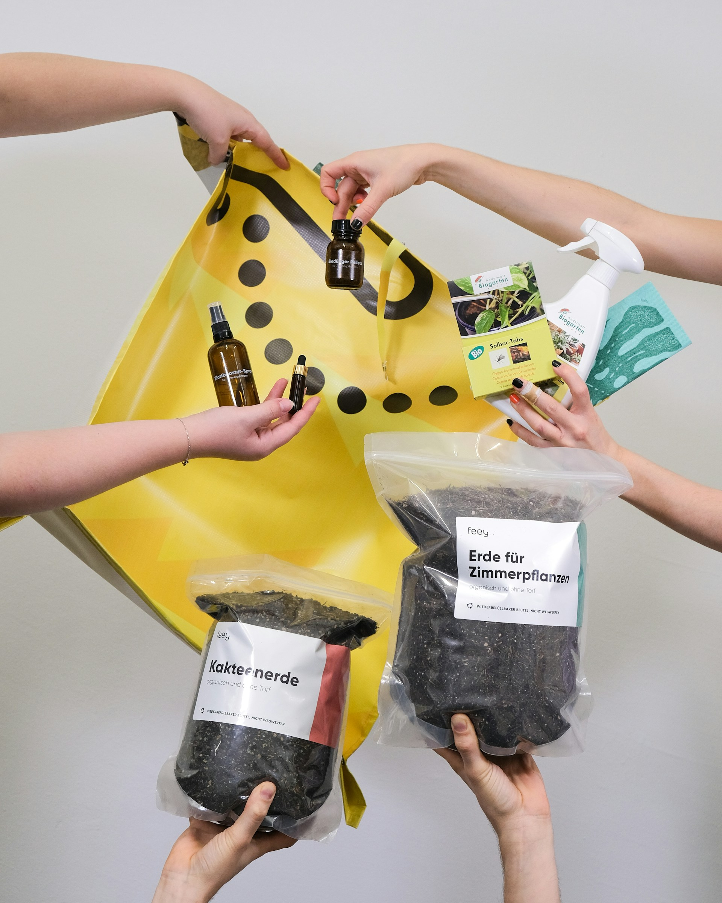
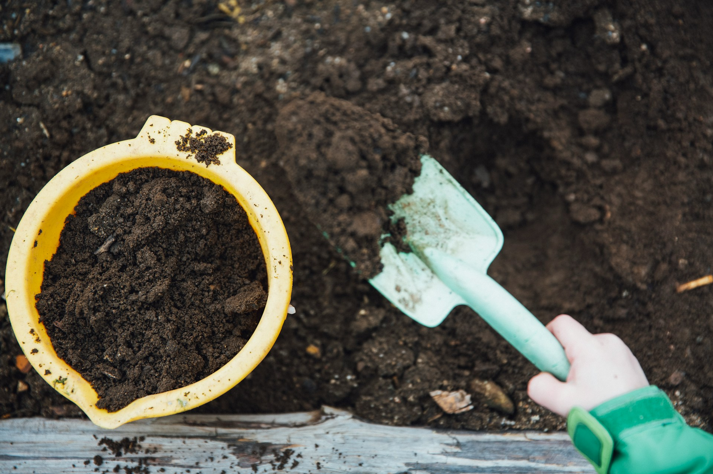
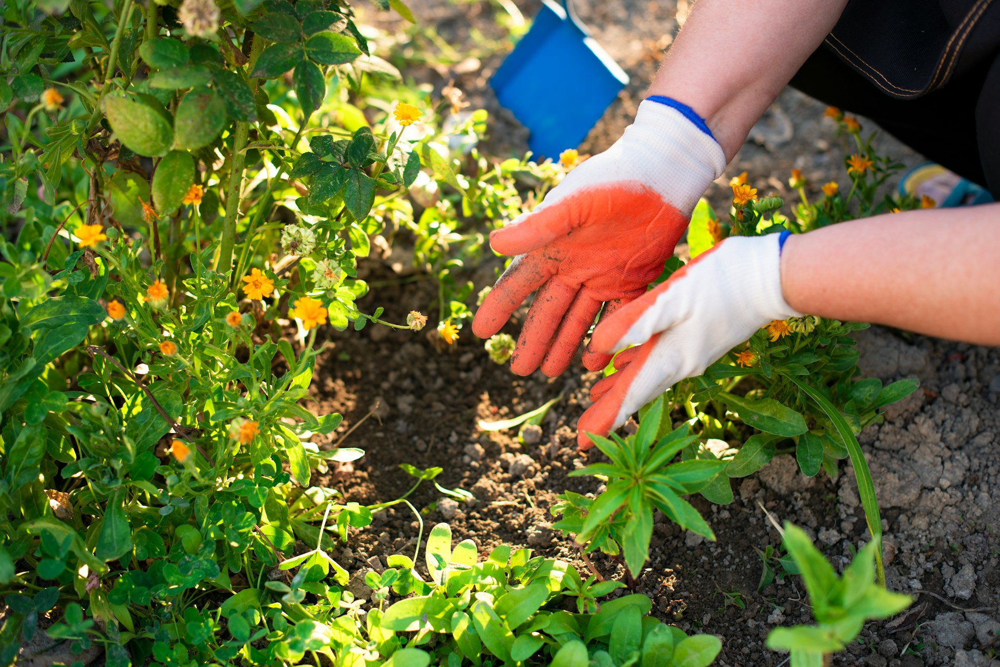

import GemeTerra2CTA from '@site/src/components/GemeTerra2CTA' 
import GemeComposterCTA from '@site/src/components/GemeComposterCTA' 
import RelatedArticles from '@site/src/components/RelatedArticles'
import ReactPlayer from 'react-player'

## Introduction: Why Spring Fertility Matters

After a long winter, your garden is waking up. The soil has been sitting cold and dormant for months. Beneficial microorganisms are stirring back to life. And your plants are hungry.

Spring fertility is arguably the most important thing you can focus on for a successful growing season. Why? Because this is when plants are doing their most intense work. They're pushing out new leaves, stretching their roots, and getting ready to produce flowers and fruit. All of that takes energy and nutrients.

Think of spring fertilizing like breakfast for your garden. You wouldn't send your kids to school without breakfast, and you shouldn't send your plants into the growing season without proper nutrition.

In this guide, I'll walk you through everything you need to know about spring garden fertilizer. We'll cover NPK ratios, organic vs synthetic options, how to prepare your soil, and most importantly, how to use compost effectively—including GEME compost for raised bed gardens.

<!-- truncate -->

## Table Of Content

1. [**Understanding Spring Fertility: What Your Soil Needs Right Now**](#1-understanding-spring-fertility-what-your-soil-needs-right-now)

  - [The Three Macronutrients Every Spring Garden Needs](#the-three-macronutrients-every-spring-garden-needs)
  - [The Spring Growth Cycle](#the-spring-growth-cycle)

2. [**What Is the Best Fertilizer for Spring Vegetables and Flowers?**](#2-what-is-the-best-fertilizer-for-spring-vegetables-and-flowers)

  - [For Vegetable Gardens](#for-vegetable-gardens)
  - [For Flower Gardens](#for-flower-gardens)
  - [For Shrubs and Trees](#for-shrubs-and-trees)
  - [Table: Best Fertilizer for Spring by Plant Type](#table-best-fertilizer-for-spring-by-plant-type)

3. [**Organic vs Synthetic Fertilizers: What's the Difference for Spring Fertility?**](#3-organic-vs-synthetic-fertilizers-whats-the-difference-for-spring-fertility)

  - [Organic Fertilizers](#organic-fertilizers)
  - [Synthetic (Inorganic) Fertilizers](#synthetic-inorganic-fertilizers)
  - [The Environmental Impact](#the-environmental-impact)

4. [**Why Compost for Garden Is the Foundation of Spring Fertility?**](#4-why-compost-for-garden-is-the-foundation-of-spring-fertility)

  - [What Compost Does for Your Garden](#what-compost-does-for-your-garden)
  - [The Science Behind Compost Benefits](#the-science-behind-compost-benefits)
  - [How Much Compost to Apply](#how-much-compost-to-apply)

5. [**How to Use GEME Compost for Raised Bed Gardens and Containers**](#5-how-to-use-geme-compost-for-raised-bed-gardens-and-containers)

  - [What Is GEME Compost Base?](#what-is-geme-compost-base)
  - [The Golden Ratio: How to Mix GEME Compost for Garden Use](#the-golden-ratio-how-to-mix-geme-compost-for-garden-use)
  - [Quick Reference Table: GEME Compost Mixing Ratios](#quick-reference-table-geme-compost-mixing-ratios)
  - [Application Methods for GEME Compost](#application-methods-for-geme-compost)
  - [Important: Avoid Root Burn](#important-avoid-root-burn)
  - [Why GEME Compost Is Perfect for Raised Bed Gardens](#why-geme-compost-is-perfect-for-raised-bed-gardens)
  - [Harvesting and Using Your GEME Compost](#harvesting-and-using-your-geme-compost)

6. [**WStep-by-Step Spring Garden Fertility Plan**](#6-step-by-step-spring-garden-fertility-plan)

  - [Week 1-2: Soil Testing and Preparation](#week-1-2-soil-testing-and-preparation)
  - [Week 2-3: Add Compost](#week-2-3-add-compost)
  - [Week 3-4: Apply Spring Fertilizer](#week-3-4-apply-spring-fertilizer)
  - [Week 4-5: Plant Your Spring Crops](#week-4-5-plant-your-spring-crops)
  - [Ongoing: Side-Dress and Top Up](#ongoing-side-dress-and-top-up)
  - [Fall: Prepare for Next Spring](#fall-prepare-for-next-spring)

7. [**Compost for Garden: Traditional vs GEME**](#7-compost-for-garden-traditional-vs-geme)

  - [Traditional Backyard Composting](#traditional-backyard-composting)
  - [GEME Composting](#geme-composting)

8. [**Frequently Asked Questions (Answered)**](#8-frequently-asked-questions-answered)

## 1. Understanding Spring Fertility: What Your Soil Needs Right Now

Spring fertility isn't just about dumping fertilizer on your plants and hoping for the best. It's about understanding what's actually happening in your soil during this critical transition period.

### The Three Macronutrients Every Spring Garden Needs

When you look at a bag of fertilizer, you'll see three numbers separated by dashes, like 10-10-10 or 24-8-16. These represent the percentage of nitrogen (N), phosphorus (P), and potassium (K) in the mix. Each one plays a different role in plant health.

| **Nutrient**     | **Symbol** | **What It Does in Spring**                                                                                   |
|--------------|--------|---------------------------------------------------------------------------------------------------------|
| **Nitrogen**     | N      | Promotes lush, green leafy growth; essential for spring when plants are pushing out new foliage         |
| **Phosphorus**   | P      | Supports strong root development and flowering; crucial for newly planted seedlings                      |
| **Potassium**    | K      | Aids overall plant health, disease resistance, and stress tolerance                                     |

For early spring, a 24-8-16 NPK ratio is a classic choice because it provides a balanced hit of nitrogen for green growth, phosphorus for root support, and potassium for overall health. That's exactly what most plants crave as they emerge from dormancy.

For flowering plants, a 4-6-8 plant fertilizer works especially well because it encourages blooms while strengthening roots. Apply this at planting time to encourage root development, then add humic acid or another soil amendment to improve soil structure and nutrient efficiency.

### The Spring Growth Cycle

Spring is when your plants come out of dormancy. Deciduous plants leaf out, flowering plant buds begin to burst, stems and branches elongate, and new roots are formed. Nutrients will aid in all of this growth. This is why applying a slow-release fertilizer in late March or early April gives your plants a steady supply of energy for the growing season.

The best time to fertilize is in the spring. If you fertilize in the fall, you run the risk of shocking the plant into becoming metabolically active right when cold weather hits. An application of fertilizer in the spring gives an additional boost to new growth.

## 2. What Is the Best Fertilizer for Spring Vegetables and Flowers?

Choosing the right fertilizer depends on what you're growing. Let's break it down by plant type.

### For Vegetable Gardens

Spring vegetables need different nutrients at different stages. For spring vegetable beds, mix worm castings into your soil at a 10–20% ratio before you plant. Then side-dress heavy feeders like tomatoes and peppers every 4–6 weeks through the season.

If you're growing leafy greens like lettuce, spinach, and kale, prioritize nitrogen. A 27-3-3 or 25-5-5 fertilizer works well. Use 3 to 4 pounds per 1,000 square feet. Only use a balanced 13-13-13 if a soil test indicates the need for phosphorus and potassium.

For tomatoes specifically, research has shown that compost application increases the number of harvested stems and improves soil organic matter. With the experiment, researchers showed that it is possible to grow high quality and high yield vegetables with strictly biological soil amendments.

### For Flower Gardens

Perennial flowers benefit from a slow-release fertilizer applied in early spring. Look for organic options like Plant Tone, Medina Growin Green, or Rose Glo. Apply once a month for great results. Don't sprinkle your granular fertilizer right up against the trunk of the plant. Instead, spread it around the drip line.

For flowering plants, a 4-6-8 fertilizer encourages blooms while strengthening roots. Apply at planting to encourage root development, then once plants begin flowering, switch to a bloom booster with higher phosphorus.

### For Shrubs and Trees

Spring is also an ideal time to fertilize your shrubs. Apply a slow-release fertilizer in late March or early April. Be careful not to over fertilize. Your plants don't need excessive growth, and too much nitrogen can actually reduce flowering in some species.

### Table: Best Fertilizer for Spring by Plant Type

| **Plant Type**       | **Recommended NPK**         | **Application Timing**                       | **Notes**                                  |
|----------------------|-----------------------------|----------------------------------------------|--------------------------------------------|
| **Leafy greens**         | 27-3-3 or 25-5-5            | At planting                                 | Prioritizes leafy growth                   |
| **Tomatoes/peppers**     | 24-8-16                     | At planting + side-dress every 4-6 weeks    | Balanced for growth and fruiting           |
| **Flowering plants**     | 4-6-8                       | At planting + when flowering begins         | Higher phosphorus for blooms               |
| **Perennial flowers**    | Slow-release organic        | Early spring                                | Apply around drip line, not at base        |
| **Shrubs**               | Slow-release                | Late March/early April                      | Don't over-fertilize                       |
| **Lawns**                | High nitrogen               | Spring after last frost                     | Follow with consistent watering            |

## 3. Organic vs Synthetic Fertilizers: What's the Difference for Spring Fertility?

This is one of the most debated topics in gardening. Let me give you the straight facts.

### Organic Fertilizers

Organic fertilizers come from plant, animal, or mined sources. They include compost, worm castings, manure, bone meal, blood meal, and seaweed extracts. They're natural, not manufactured, and contain multiple plant nutrients. Many organic options can be farm-produced, like manures and cover crops.

Where extra fertility is needed, use organic fertilisers such as dried poultry manure, fish, blood and bone, and seaweed.

**Pros of Organic Fertilizers**:
 - Improve soil structure over time
 - Feed beneficial soil microorganisms
 - Release nutrients slowly, reducing the risk of burning plants
 - Environmentally sustainable
 - Promote regenerative agriculture practices

**Cons of Organic Fertilizers**:
 - Slower to show results
 - Nutrient ratios are less precise
 - Can be more expensive
 - May require larger quantities

### Synthetic (Inorganic) Fertilizers

Synthetic fertilizers are manufactured chemically. They provide precise NPK ratios and fast results.

**Pros of Synthetic Fertilizers**:
 - Fast-acting
 - Precise nutrient control
 - Generally cheaper per pound of nutrient
 - Easy to apply

**Cons of Synthetic Fertilizers**:
 - Can cause root burn if over-applied
 - Do not improve soil structure
 - May reduce beneficial soil organisms, especially earthworms
 - Can cause wide fluctuations in pH and ion concentrations of the soil solution
 - Chemical impacts tend to enhance nutrient losses from the soil

### The Environmental Impact

The environmental effects of inorganic fertilizers are concerning. They may not preserve soil structure, can cause wide fluctuations in the pH and ion concentrations of the soil solution, and can substantially reduce some soil faunal populations, especially earthworms. Chemical impacts of inorganic fertilisation tend to enhance nutrient losses from the soil, whereas organic manuring generally promotes a more efficient cycling.

The choice between organic and inorganic fertilizers can impact soil health, plant vigor, environmental sustainability, and overall farm profitability.

For most home gardeners, a hybrid approach works best. Use organic amendments like compost as your base soil builder, then supplement with targeted synthetic fertilizers only when soil tests show specific deficiencies.

## 4. Why Compost for Garden Is the Foundation of Spring Fertility?

Here's the thing about synthetic fertilizers. They feed your plants, but they don't feed your soil. **Compost does both**.

### What Compost Does for Your Garden

When you add compost to your garden, you're not just adding nutrients. You're adding billions of beneficial microorganisms that help your plants access those nutrients. You're improving soil structure so roots can grow deeper. You're increasing water retention so you don't have to water as often. And you're building long-term soil health that pays dividends for years.

Compost applications result in significant improvements to soil quality (physical, chemical and biological) compared to conventional farming practices.

### The Science Behind Compost Benefits

Research has shown that compost increases the pH of the soil from the first year onward. Thus, organic fertilization impedes acidification in light sandy soils. Soil fertility benefits from compost by an increase in K-, Ca-, and Mg- content in the soil from the second year on.

One study found that first year effect of compost increased barley yield by 40-50%, first year residual effect resulted in increase of potato yield by 19-30%, and second year residual effect to wheat yield was in range from 8 to 17%.

Another study demonstrated that a 125 dry t/ha compost application rejuvenated soil quality and maintained many soil quality benefits over five crops, despite the high tillage associated with rotary hoe use in vegetable production.

### How Much Compost to Apply

For new garden beds: Apply a 3- to 4-inch layer of compost to the soil surface. Add other amendments such as lime and N-P-K fertilizer as needed (check individual plant requirements).

For existing beds: Add a quarter-inch to 1-inch layer to the bed surface each year.
For best results, add a layer of compost to your garden beds in the fall or early spring, and mix it in with a garden fork or tiller. You can also use it as a top dressing by spreading a thin layer over your lawn, garden beds, or established plantings.

Early spring is the best time to add compost to sandy soil so that fewer nutrients leach out, and late fall is best for other soil types. Avoid adding compost during a heatwave or the hardening-off period.

<GemeTerra2CTA 
 imgSrc="/img/geme-terra-2-composter.jpg"
 productTitle="GEME Terra II: Best Kitchen Composter"
 features={[
    "✅ The First AI-Powered Kitchen Composter",
    "✅ Biologically Active Composting System",
    "✅ Quiet, Odour-Free, Real Compost",
    "✅ Zero Filter Costs, No Refills",
    "✅ Reduces Composting Time to Days"
 ]}
buttonText="Get Your GEME Terra II"
  href="https://www.geme.bio/product/terra2?utm_medium=blog&utm_source=geme_website&utm_campaign=general_seo_content&utm_content=how-to-fertilise-your-plants-in-spring"
/>

## 5. How to Use GEME Compost for Raised Bed Gardens and Containers

Now let's talk about the best source of compost you can get: your own kitchen scraps, transformed by the GEME composter.

### What Is GEME Compost Base?

GEME uses a proprietary blend of 46 different heat-tolerant, aerobic bacteria strains called Kobold to digest organic waste. These microbes are naturally occurring, not artificially engineered, and they've evolved to be incredibly efficient at breaking down food scraps. When you add food waste to GEME, the machine automatically controls temperature, moisture, and oxygen levels to create the perfect environment for the Kobold microbes to thrive.

GEME compost base is a concentrated nutrient source. It contains living microorganisms that continue to benefit your soil long after application. The machine reduces food waste by 95% and produces 5% organic compost, making it perfect for most kitchens.

### The Golden Ratio: How to Mix GEME Compost for Garden Use

Because GEME compost base is concentrated, you should never use it straight. Here are the official mixing ratios.

#### For Standard Garden Beds and Raised Beds

Combine 1 part GEME Compost Base with 8 parts plain garden soil. Use untreated soil or coconut coir. Do not mix with pre-fertilized potting mixes, as this may result in nutrient excess.

#### For Heavy Feeders (Tomatoes, Peppers, Squash)

For plants that need extra nutrition, use a stronger mix:
 - 60% Base potting soil
 - 30-35% GEME compost
 - 5-10% Perlite or pumice (optional)

#### For Houseplants

Apply a 1/2 inch (1.3 cm) layer around the plant. Keep compost away from stems. Gently work it into the top layer of soil. Water thoroughly after application.

<GemeTerra2CTA 
 imgSrc="/img/geme-terra-2-composter.jpg"
 productTitle="GEME Terra II: Best Kitchen Composter"
 features={[
    "✅ The First AI-Powered Kitchen Composter",
    "✅ Biologically Active Composting System",
    "✅ Quiet, Odour-Free, Real Compost",
    "✅ Zero Filter Costs, No Refills",
    "✅ Reduces Composting Time to Days"
 ]}
buttonText="Get Your GEME Terra II"
  href="https://www.geme.bio/product/terra2?utm_medium=blog&utm_source=geme_website&utm_campaign=general_seo_content&utm_content=how-to-fertilise-your-plants-in-spring"
/>

### Quick Reference Table: GEME Compost Mixing Ratios

| **Garden Type**                        | **Soil/GEME Ratio**        | **Notes**                                           |
|------------------------------------|------------------------|-------------------------------------------------|
| **Standard raised bed**                | 8:1 (soil:compost)     | 1 part GEME to 8 parts plain soil                |
| **Heavy feeders** (tomatoes, peppers)  | 3:2 (soil:compost)     | 60% soil, 30-35% compost, 5-10% perlite         |
| **Houseplants**                        | Top-dressing only      | 1/2 inch layer, keep away from stems             |
| **Potted plants**                   | 8:1 (soil:compost)     | Use untreated potting mix                        |

### Application Methods for GEME Compost

#### Method 1: Soil Incorporation (Best for new beds)

Mix your GEME compost base with soil at a 1:8 ratio. Cover the mixture with a 2 to 3 cm layer of soil and water it a little.

#### Method 2: Top Dressing (Best for established plants)

Spread a 1/4-inch to 1-inch layer of the 1:8 mixture around the base of your plants. Avoid piling against plant stems or trunks. Water well after application.

#### Method 3: Direct Use (For established plants only)

If you want to use GEME compost directly without mixing, leave a gap of about 15 cm (6 inches) between the compost and the plant roots. This prevents root burn while still providing benefits.

### Important: Avoid Root Burn

GEME compost base is a concentrated nutrient source. In agronomy, placing roots directly into high-nutrient concentrate can cause osmotic shock (commonly known as "root burn"). Always mix with soil at the recommended ratios before applying to your plants.

### Why GEME Compost Is Perfect for Raised Bed Gardens

Raised bed gardens are a special case. Because they're contained, the soil in raised beds can become depleted faster than in-ground gardens. Regular compost additions are essential.

GEME compost is ideal for raised beds for several reasons:
 - It's biologically active, which means it continues to improve soil structure over time
 - It's free of weed seeds and pathogens (the high-temperature process kills them)
 - You can produce it continuously from your own kitchen scraps
 - It reduces the need for synthetic fertilizers

One reviewer noted that GEME is your little helper for easy home composting. No more smelly, leaking garbage, puffing fruit flies, yard full of mice, maggots in the yard waste bin or throwing away food scraps to rot in the landfill. With GEME, you will be able to turn your waste into nutrient-rich organic compost.

### Harvesting and Using Your GEME Compost

GEME works differently from traditional compost bins. It's a continuous-flow system, meaning you add scraps anytime and harvest when the chamber is full. The machine uses microbial degradation technology that can break down food waste in just 6-8 hours, transforming it into nutrient-rich compost for your garden or houseplants.

When you're ready to harvest, take out the organic fertilizer and leave it for 2 weeks, then spread it directly in your garden or on the grass. Thanks to GEME's innovative microbial ecosystem (GEME Kobold), organic waste is efficiently transformed into nutrient-rich compost. Think of these microbes as the gut-friendly bacteria of composting—quietly working while you sleep to reduce waste volume by up to 95%.

## 6. Step-by-Step Spring Garden Fertility Plan

Here's a simple plan you can follow this spring.

### Week 1-2: Soil Testing and Preparation

Before you add anything, test your soil. You can buy a simple home test kit or send a sample to your local extension office. You're looking for pH level (6.0-7.0 is ideal for most vegetables) and NPK levels.

Once you know what your soil needs, clear out winter debris, pull any early weeds, and loosen the top few inches of soil with a garden fork or tiller.

### Week 2-3: Add Compost

For new beds, apply a 3- to 4-inch layer of compost and mix it into the top 6-8 inches of soil. For existing beds, top-dress with a 1/4- to 1-inch layer.

If you're using GEME compost, remember the 1:8 mixing ratio. Combine 1 part GEME compost base with 8 parts plain garden soil before applying.

### Week 3-4: Apply Spring Fertilizer

Based on your soil test results, choose an appropriate fertilizer. For most vegetable gardens, a balanced 10-10-10 or 24-8-16 works well. Apply according to package directions.

### Week 4-5: Plant Your Spring Crops

Now your soil is ready. Plant cool-season crops like lettuce, spinach, peas, and radishes. For tomatoes and peppers, wait until the danger of frost has passed.

### Ongoing: Side-Dress and Top Up

Every 4-6 weeks during the growing season, side-dress heavy feeders with additional fertilizer or compost. For tomatoes, this is especially important. Research shows that compost application increases both yield and quality.

### Fall: Prepare for Next Spring

Add another layer of compost to your beds in the fall. This gives it time to settle and start enriching itself over the winter months. Early spring is the best time to add compost to sandy soil (so that fewer nutrients will leach out), and late fall for other soil types.

## 7. Compost for Garden: Traditional vs GEME

If you're trying to decide between traditional composting and using a GEME composter, here's what you need to know.

### Traditional Backyard Composting

An actively maintained compost pile can reach 130–160°F during decomposition. You need to aim for a 1:2 or 1:3 ratio of greens to browns by volume. For example, cover your fruit and veggie scraps with a 2–3 inch layer of dry leaves or straw.

**Pros**:

 - Low cost (just a bin and some time)
 - Handles large volumes of yard waste
 - Great for gardeners with outdoor space

**Cons**:

 - Takes 4-12 months for finished compost
 - Requires regular turning and monitoring
 - Can attract pests if not managed properly
 - Slows down or stops in cold weather
 - Cannot compost meat, dairy, or bones

### GEME Composting

GEME takes a completely different approach. It uses live microorganisms (Kobold) to digest waste in a controlled indoor environment.

**Pros**:

 - Produces compost in 6-8 hours for soft materials
 - Works year-round, regardless of weather
 - Handles meat, dairy, and small bones
 - No turning, no monitoring, no smell
 - Fits in a kitchen or apartment
 - Zero filter replacement costs (permanent metal-ion catalyst)
 - Reduces food waste by 95%

**Cons**:

 - Higher upfront cost than a compost bin
 - Requires electricity
 - Smaller capacity than a large outdoor pile

For most home gardeners, a combination works best. Use GEME for your daily kitchen scraps and produce compost year-round. Supplement with a traditional outdoor pile for yard waste and larger volumes in the growing season.

<GemeTerra2CTA 
 imgSrc="/img/geme-terra-2-composter.jpg"
 productTitle="GEME Terra II: Best Kitchen Composter"
 features={[
    "✅ The First AI-Powered Kitchen Composter",
    "✅ Biologically Active Composting System",
    "✅ Quiet, Odour-Free, Real Compost",
    "✅ Zero Filter Costs, No Refills",
    "✅ Reduces Composting Time to Days"
 ]}
buttonText="Get Your GEME Terra II"
  href="https://www.geme.bio/product/terra2?utm_medium=blog&utm_source=geme_website&utm_campaign=general_seo_content&utm_content=how-to-fertilise-your-plants-in-spring"
/>

## 8. Frequently Asked Questions (Answered)

### Q: When should I start fertilizing in spring?

> A: The best time to start fertilizing is when plants come out of dormancy. In most climates, this is late March to early April. Apply a slow-release fertilizer at this time to give your plants a steady supply of energy for the growing season.

### Q: What is the best fertilizer for spring vegetables?

> A: For leafy greens, choose a high-nitrogen fertilizer like 27-3-3. For tomatoes and peppers, a balanced 24-8-16 works well. Always base your choice on a soil test.

### Q: Can I use more compost in my garden?

> A: Yes. While compost is generally safe, too much can lead to nutrient imbalances and phosphorus buildup. Stick to recommended application rates: 3-4 inches for new beds, 1/4 to 1 inch annually for existing beds.

### Q: How do I use GEME compost in a raised bed?

> A: Combine 1 part GEME compost base with 8 parts plain garden soil. Mix thoroughly and use it as your growing medium. For heavy feeders like tomatoes, you can increase the compost ratio to 30-35%.

### Q: Is compost better than fertilizer?

> A: They serve different purposes. Compost builds long-term soil health, improves structure, and feeds beneficial microorganisms. Fertilizer provides specific nutrients in precise ratios. For best results, use both: compost as your soil foundation, and fertilizer to address specific deficiencies.

### Q: How often should I add compost to my garden?

> A: Add compost annually in the spring or fall. For new beds, incorporate 3-4 inches before planting. For established beds, top-dress with 1/4 to 1 inch each year.

### Q: Can I use GEME compost directly on plants?

> A: Yes, but with caution. GEME compost base is concentrated. Either mix it with soil at a 1:8 ratio, or if applying directly, keep it at least 6 inches away from plant stems and roots.

### Q: Does GEME require filter replacements?

> A: No. GEME uses a permanent metal-ion oxidation catalyst for odor control. It doesn't trap smells like charcoal filters do. It destroys them at a molecular level. Nothing gets "full," so nothing needs replacing. Ever.

## Conclusion: Feed Your Soil, Feed Your Plants

Here's the thing about spring fertility that many gardeners miss. You're not really feeding your plants. You're feeding your soil.

When you add compost to your garden, you're adding billions of microorganisms that will work for you all season long. They'll break down organic matter into plant-available nutrients. They'll improve soil structure so roots can grow deeper. They'll help your plants resist disease and drought.

Synthetic fertilizers can give you quick results, but they don't build soil health. Over time, they can actually harm the beneficial organisms that make your soil alive. **Compost builds soil**. And the best compost is the compost you make yourself from your own kitchen scraps.

**With a GEME composter, you can turn your daily food waste into high-quality compost in days or weeks instead of months**. You can feed your garden with nutrients that came from your own kitchen. And you can do it all without smell, without pests, and without the hassle of traditional composting.

This spring, give your garden the best start possible. Test your soil, add compost, choose the right fertilizer for your plants, and watch them thrive.

👉 [Learn More About GEME Terra II](https://www.geme.bio/product/terra2?utm_medium=blog&utm_source=geme_website&utm_campaign=general_seo_content&utm_content=how-to-fertilise-your-plants-in-spring)

<GemeTerra2CTA 
 imgSrc="/img/geme-terra-2-composter.jpg"
 productTitle="GEME Terra II: Best Kitchen Composter"
 features={[
    "✅ The First AI-Powered Kitchen Composter",
    "✅ Biologically Active Composting System",
    "✅ Quiet, Odour-Free, Real Compost",
    "✅ Zero Filter Costs, No Refills",
    "✅ Reduces Composting Time to Days"
 ]}
buttonText="Get Your GEME Terra II"
  href="https://www.geme.bio/product/terra2?utm_medium=blog&utm_source=geme_website&utm_campaign=general_seo_content&utm_content=how-to-fertilise-your-plants-in-spring"
/>

👉 [Explore GEME Pro for Big Households/Plant Shops/Restaurants](https://www.geme.bio/product/geme?utm_medium=blog&utm_source=geme_website&utm_campaign=general_seo_content&utm_content=?utm_medium=blog&utm_source=geme_website&utm_campaign=general_seo_content&utm_content=how-to-fertilise-your-plants-in-spring)

<GemeComposterCTA 
 imgSrc="/img/geme-bio-composter.jpg"
 productTitle="GEME Pro Composter"
 features={[
    "✅ Best Composter With No Hidden Costs",
    "✅ Produce Soil-Ready Compost For Plant Growth",
    "✅ Quiet, Odor-Free, Quick(6-8 hours)",
    "✅ Large Capacity (19 L) For Daily Waste"
  ]}
buttonText="Get Your GEME Pro"
  href="https://www.geme.bio/product/geme?utm_medium=blog&utm_source=geme_website&utm_campaign=general_seo_content&utm_content=?utm_medium=blog&utm_source=geme_website&utm_campaign=general_seo_content&utm_content=how-to-fertilise-your-plants-in-spring"
/>

## Sources

### Academic & Research Sources

1. [**FUSILLI Project: Bioactive Compost yields larger and sweeter carrots**](https://fusilli-project.eu/bioactive-compost-yields-larger-and-sweeter-carrots/)

2. [**Nature: ISME Communications: An agroecological structure model of compost—soil—plant interactions**](https://www.nature.com/ismecommun/compost-soil-plant-model)

3. [**FAO AGRIS: Understanding Fertilizers and Soil Amendments**](https://agris.fao.org/understanding-fertilizers-and-soil-amendments)

4. [**McGill University: The Environmental Effects of Conventional and Organic/Biological Farming systems**](https://eap.mcgill.ca/Environmental-Effects-Conventional-Organic-Farming)

### Government & University Extension Sources

1. [**Johnson County K-State Extension: March Garden Calendar**](https://www.johnson.k-state.edu/lawn-garden/march-calendar.html)

2. [**LSU AgCenter: Timing is everything with fertilizer**](https://www.lsuagcenter.com/timing-is-everything-with-fertilizer)

3. [**OSU Extension: Adding compost improves soil‘s texture and adds nutrients**](https://extension.oregonstate.edu/adding-compost-improves-soils-texture-adds-nutrients)

4. [**UC ANR: Preparing for Your First Spring Garden**](https://ucanr.edu/preparing-for-your-first-spring-garden)

### Media & News

1. [**Berry Patch Farms: Best Fertilizer for Early Spring 2026 Reviews**](https://www.berrypatchfarms.net/best-fertilizer-for-early-spring-2026-reviews/)

2. [**Elm Dirt: Best Organic Fertilizer for Spring Vegetables: A Beginner‘s Guide**](https://www.elmdirt.com/best-organic-fertilizer-for-spring-vegetables-a-beginners-guide/)

3. [**Gill Nursery: Top 7 Gardening Must Do’s for March 2026**](https://gillnursery.com/top-7-gardening-must-dos-for-march-2026/)

4. [**inews: An expert’s guide to feeding garden plants this spring**](https://inews.co.uk/an-experts-guide-to-feeding-garden-plants-this-spring-2588473)

5. [**WTOP News: GEME Zero Waste Smart Composter reduces compost production time from months to hours**](https://wtop.com/tech/2025/01/geme-zero-waste-smart-composter-reduces-compost-production-time-from-months-to-hours/)

### General Gardening & Home Sources

1. <a href="https://simplelawnsolutions.com/best-garden-fertilizer-solutions-for-spring/" rel="nofollow"><strong>Simple Lawn Solutions: Best Garden Fertilizer Solutions for Spring</strong></a>

2. <a href="https://gardenerbible.com/what-fertilizer-to-use-in-spring-for-vegetable-garden/" rel="nofollow"><strong>GardenerBible: What Fertilizer To Use In Spring For Vegetable Garden</strong></a>

3. <a href="https://www.cultifort.com/organic-and-inorganic-fertilizers-pros-and-cons/" rel="nofollow"><strong>Cultifort: Organic and inorganic fertilizers? Pros and cons</strong></a>

4. <a href="https://www.epicgardening.com/when-to-start-fertilizing-plants-spring/" rel="nofollow"><strong>Epic Gardening: When to Start Fertilizing Plants for Spring Growth</strong></a>

### GEME Official Sources

1. [**GEME: From Bin to Bloom: A Guide to Preparing and Using Your Compost**](https://www.geme.bio/blog/from-bin-to-bloom-a-guide-to-preparing-and-using-your-compost)

2. [**GEME: Mastering the GEME Cycle: An Agronomist’s Guide to Continuous-Flow Compost Application**](https://www.geme.bio/blog/advanced-geme-compost-application-guide)

3. [**GEME Official Website: How It Works**](https://www.geme.bio/how-it-works)

4. [**GEME Official Website: GEME Kobold**](https://www.geme.bio/kobold-introduction)

5. [**GEME: GEME Kobold Knowledge (Tawk Help Center)**](https://gemecomposter.tawk.help)

### Trust Stack

- Start with the 3-minute truth → [**Real compost vs dehydrator**](https://www.geme.bio/compare/real-compost-vs-dehydrated-scraps)

- Browse comparisons → [**Choose what to compare**](https://www.geme.bio/compare)

- Methods & boundaries → [**Open GK Verification**](https://www.geme.bio/gk)

- Ready for the kitchen workflow? → [**Shop Terra 2**](https://www.geme.bio/product/terra2?utm_medium=blog&utm_source=geme_website&utm_campaign=general_seo_content&utm_content=how-to-fertilise-your-plants-in-spring)

<RelatedArticles
  slugs={[
  "how-to-plant-tulip-bulbs-in-spring-guide",
  "how-to-compost-at-home",
  "what-can-you-put-in-electric-composter-meat-dairy-bones",
  "why-composter-filters-only-last-3-months",
  "electric-composter-salt-oil-boundaries",
  "advanced-geme-compost-application-guide",
  "countertop-composter-misnomer-floor-standing-electric-composter",
  "top-5-electric-composters-on-amazon-2026",
  "geme-terra-2-pros-and-cons",
  "top-5-kitchen-composters-pros-and-cons",
  "geme-composter-review-2026",
  "best-kitchen-composter-verdict-2026",
  "best-composter-avoid-recurring-fees-geme-terra-2",
  "how-to-compost-cut-flowers-guide",
  "how-long-does-bokashi-take-to-compost",
  "how-to-care-for-hydrangeas-and-change-colors",
  "best-composter-daily-operation-comparison-lomi-mill-reencle-geme",
  "how-long-does-pizza-last-in-fridge-guide",
  "how-to-compost-eggshells-guide-geme",
  "how-to-compost-coffee-grounds-guide",
  "never-buy-carbon-filter-for-your-composter",
  "best-composter-fastest-real-compost-geme-terra-2",
  "how-to-compost-at-home-beginners-guide",
  "how-long-can-chicken-stay-in-the-fridge",
  "how-to-reduce-odor-indoor-composting-tips",
  "how-long-can-ground-beef-stay-in-the-fridge",
  "nyc-composting-fines-2026-geme-terra-2-best-electric-compost",
  "best-indoor-composter-for-apartment-geme-vs-lomi",
  "the-best-composter-for-kitchen",
  "how-to-reduce-food-waste-during-spring-festival",
  "does-reencle-composter-produce-real-compost",
  "does-mill-composter-really-compost",
  "how-to-reduce-food-waste-at-home-2026",
  "free-mcnugget-caviar-raises-food-waste-concerns",
  "composting-in-winter",
  "how-to-compost-at-home",
  "zero-waste-home-kitchen-composter",
  "does-lomi-composter-really-compost",
  "5-best-kitchen-composters-in-2026",
  "best-kitchen-composter-in-2026-geme-terra-2",
  "geme-vs-reencle-composter-2026",
  "geme-vs-mill-composter-2026",
  "best-kitchen-composter-2026",
  "advanced-geme-compost-application-guide",
  "electric-compost-bin-filters-costs-comparison",
  "geme-vs-lomi", 
  "geme-terra-2-debuts",
  "the-best-composter-to-reduce-food-waste",
  "compost-pile-vs-electric-composter",
  "how-to-make-bananas-last-longer",
  "how-long-do-apples-last-in-the-fridge",
  "can-i-compost-moldy-grapes",
  "can-you-compost-moldy-bread",
  ]}
/>

_Ready to transform your gardening game? Subscribe to our [newsletter](http://geme.bio/signup?utm_medium=blog&utm_source=geme_website&utm_campaign=general_seo_content&utm_content=how-to-compost-at-home-beginners-guide) for expert composting tips and sustainable gardening advice._

