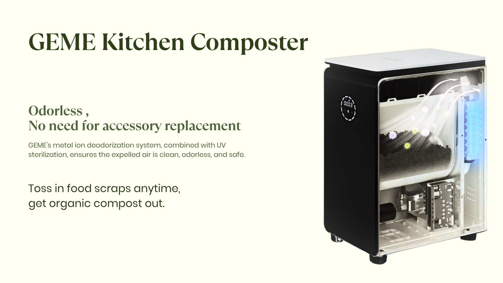
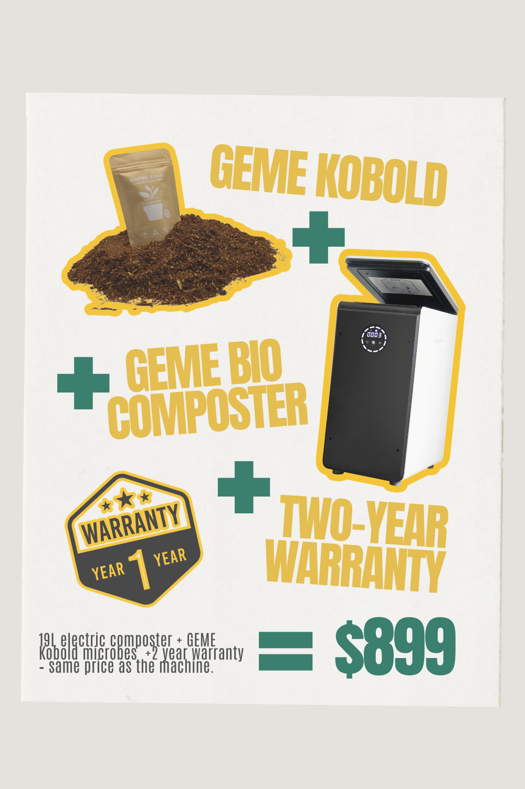
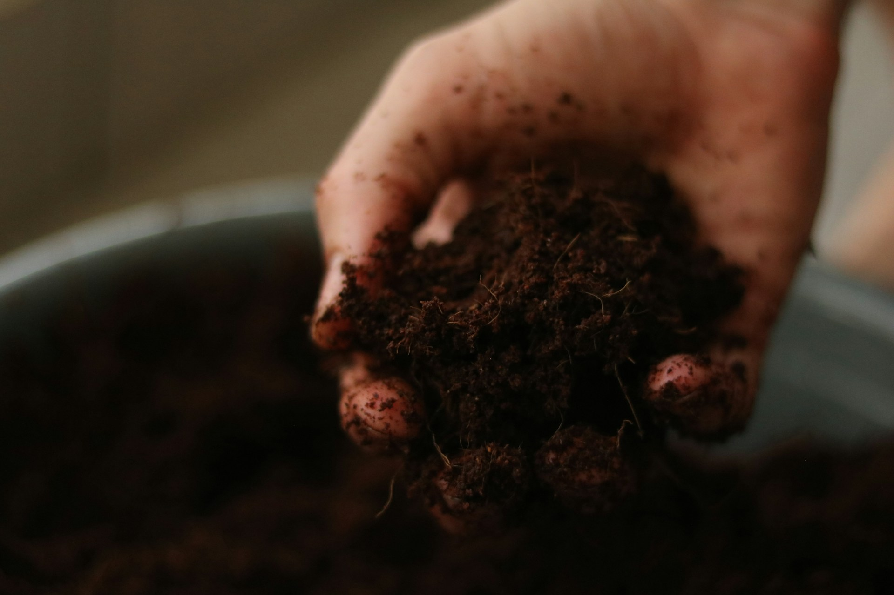

import GemeTerra2CTA from '@site/src/components/GemeTerra2CTA' 
import GemeComposterCTA from '@site/src/components/GemeComposterCTA' 
import RelatedArticles from '@site/src/components/RelatedArticles'
import ReactPlayer from 'react-player'

After testing the GEME World First Bio Smart 19L Electric Composter for a month, here's how it performs for my daily kitchen waste management. Spoiler: the smell is the first thing you'll notice, or rather, the lack of it.

We've all been there. You open the kitchen bin to toss in some scraps, and that wave of stale, rotting smell hits you. You hold your breath, dump the waste, and shut the lid quickly. It's not exactly a pleasant routine, but it's one we've accepted as normal. The GEME Electric Composter aims to change that.

This isn't just another kitchen gadget. It's a genuine biological processing unit that lives in your kitchen and quietly turns your food scraps into actual, usable compost. I've spent a month using this machine, digging through the science, and comparing it to the competition. Here's my honest review.

<!-- truncate -->

## Table Of Content

1. [**GEME Composter Review From Backyard Farmer**](#1-geme-composter-review-from-backyard-farmer)

  - [Real User Experiences](#real-user-experiences-from-the-backyard-farmer-review)

2. [**What Is the GEME Electric Composter?**](#2-what-is-the-geme-electric-composter)

  - [Key Specifications at a Glance](#key-specifications-at-a-glance)

3. [**How Does the GEME Electric Composter Work?**](#3-how-does-the-geme-electric-composter-work)

  - [Here's what happens inside](#heres-what-happens-inside)

4. [**Key Features That Set the GEME Apart**](#4-key-features-that-set-the-geme-apart)

5. [**Real-World User Experience of the GEME Composter**](#5-real-world-user-experience-of-the-geme-composter)

6. [**The Pros & Cons of GEME Composter**](#6-the-pros--cons-of-geme-composter)

7. [**Traditional Compost Pile vs GEME Composter**](#7-traditional-compost-pile-vs-geme-composter)

  - [Traditional Backyard Composting](#traditional-backyard-composting)
  - [GEME Composting](#geme-composting)

8. [**Frequently Asked Questions (Answered)**](#8-frequently-asked-questions-answered)

## 1. GEME Composter Review From Backyard Farmer

One reviewer from Backyard Farmer put it this way: “The GEME produces genuine fertilizer through biological decomposition. Most other machines produce what can only be described as dried, pulverized food waste.”

### Real User Experiences (From the Backyard Farmer Review)

The Backyard Farmer review of the GEME electric composter highlighted a few things that match what other users say.

1. **The smell is the first thing you notice, or rather, the lack of it**. “When you open a traditional kitchen bin, you brace yourself. With GEME, there’s nothing to brace for.”

2. **It’s quiet**. “At 35–40 dB, the GEME is genuinely quiet. You can hear it if you’re standing right next to it, but it’s not disruptive.”

3. **The compost is real**. “The material was dark, crumbly, and smelled earthy. It wasn’t dried, dusty, or sterile. It was real, biologically active compost ready to be mixed into my garden soil.”

4. **Continuous feed is a game changer**. “I can’t overstate how convenient this is. With batch machines, you have to fill the bucket and then wait hours for a cycle to finish. With GEME, you just lift the lid and toss them in. Anytime.”

5. **No recurring costs**. “This is huge. Lomi owners spend an average of \$150–\$200 per year on filters. GEME costs \$0.” The output is genuine compost with active microorganisms that plants can use immediately.

<GemeComposterCTA 
 imgSrc="/img/geme-bio-composter.jpg"
 productTitle="GEME Pro Composter"
 features={[
    "✅ Best Composter With No Hidden Costs",
    "✅ Produce Soil-Ready Compost For Plant Growth",
    "✅ Quiet, Odor-Free, Quick(6-8 hours)",
    "✅ Large Capacity (19 L) For Daily Waste"
  ]}
buttonText="Get Your GEME Pro"
  href="https://www.geme.bio/product/geme?utm_medium=blog&utm_source=geme_website&utm_campaign=general_seo_content&utm_content=?utm_medium=blog&utm_source=geme_website&utm_campaign=general_seo_content&utm_content=geme-composter-review-2026-geme-pro"
/>

## 2. What Is the GEME Electric Composter?

The GEME is a floor-standing, 19-liter electric kitchen composter that uses live microorganisms to break down food waste. Unlike popular brands that essentially dehydrate and grind your scraps, GEME is a Continuous Aerobic Bio-processor. It provides a controlled environment where specially selected bacteria eat your food waste, turning it into nutrient-rich compost.

Made from durable materials, the GEME boasts a 19-liter capacity, making it ideal for families of up to three. It works quietly, fits neatly into a corner of your kitchen, and requires very little hands-on effort. It's designed to be a permanent solution, not a temporary appliance.

### Key Specifications at a Glance

| **Specification**        | **GEME Composter**                                  |
|-------------------------|-----------------------------------------------------|
| Capacity                | 19 liters                                           |
| Technology              | Microbial degradation (real compost, not dehydration)|
| Processing Time         | 6–8 hours                                 |
| Daily Waste Capacity    | Up to 5 kilograms                                   |
| Reduction Rate          | Reduces waste volume by 95%                         |
| Dimensions              | 18 x 12.6 x 26.2 inches                            |
| Weight                  | Approximately 43 pounds                             |
| Odor Control            | Advanced filtration—no filter replacements needed   |
| Warranty                | 1-year warranty                                     |

## 3. How Does the GEME Electric Composter Work?

This is where GEME really separates itself from the competition. Most electric “composters” use high heat and grinding blades to dry out your scraps. **GEME uses biology**.

The heart of the system is the **GEME Kobold**, a proprietary blend of naturally occurring, heat-tolerant aerobic bacteria. These microorganisms are the “workers” inside the machine. They act like the worms in traditional composting, but they work faster and more efficiently.

### Here's what happens inside

1. **Optimal Environment**: The machine automatically controls temperature, moisture, and oxygen levels to keep the Kobold microbes happy and active.

2. **Digestion, Not Dehydration**: Instead of baking your scraps, the microbes actually eat them. This is biological decomposition, not mechanical drying.

3. **Continuous Feed**: You can add food waste at any time. There's no “cycle” to start or wait for. The microbes are always working.

4. **Sift and Return**: When you're ready to harvest your compost, you simply remove the finished material. Any large pieces that haven't fully broken down can be put back in. This isn't a flaw; it's a feature that helps maintain a robust microbial colony.

The result is real, biologically active compost, not dried, sterile food dust. Most of the mass is converted into CO₂ and water vapor, with about 5% remaining as nutrient-dense organic compost. You can see and feel the difference. It's moist, dark, and smells like a healthy forest floor, not a trash can.

## 4. Key Features That Set the GEME Apart

### 1. Real Compost Output

Unlike dehydrators that simply dry and grind scraps into a dry, soil-like mixture, the GEME composter uses advanced microbial degradation technology to create genuine, nutrient-rich compost in just 6-8 hours. It's perfect for gardening and sustainable waste recycling.

### 2. No Filter Replacements Ever

This is a huge win. Many electric composters rely on charcoal filters that need to be replaced every few months. GEME uses advanced filtration technology that requires no filter replacements, saving you money and hassle over time. GEME's built-in deodorization system ensures your kitchen stays fresh even with food waste inside.

### 3. Whisper-Quiet Operation

At 35-40 dB, the GEME is whisper-quiet, making it perfect for indoor use. You can run it in an open-plan kitchen, watch TV in the same room, or even sleep nearby without being bothered.

### 4. Large Capacity

With a 19-liter chamber, the GEME can handle up to 5 kilograms (about 11 pounds) of food waste daily. That's enough for a busy family of 3+ people who cook most of their meals at home.

### 5. 95% Volume Reduction

The machine reduces waste volume by up to 95%, meaning you only need to harvest the compost every 1-2 months, depending on how much waste you generate. This is a massive time-saver compared to daily emptying.

### 6. Continuous Feed Operation

You can add food scraps at any time. No locking lid, no waiting for a cycle to finish. This matches how real kitchens operate and makes the composting process truly effortless.

<GemeComposterCTA 
 imgSrc="/img/geme-bio-composter.jpg"
 productTitle="GEME Pro Composter"
 features={[
    "✅ Best Composter With No Hidden Costs",
    "✅ Produce Soil-Ready Compost For Plant Growth",
    "✅ Quiet, Odor-Free, Quick(6-8 hours)",
    "✅ Large Capacity (19 L) For Daily Waste"
  ]}
buttonText="Get Your GEME Pro"
  href="https://www.geme.bio/product/geme?utm_medium=blog&utm_source=geme_website&utm_campaign=general_seo_content&utm_content=?utm_medium=blog&utm_source=geme_website&utm_campaign=general_seo_content&utm_content=geme-composter-review-2026-geme-pro"
/>

## 5. Real-World User Experience of the GEME Composter

### 1. The Odor Test

The first thing you'll notice when you open the GEME is the lack of smell. I'm serious. When you open a traditional kitchen bin, you brace yourself. With GEME, there's nothing to brace for. The combination of aerobic microbes and the advanced filtration system means odors are destroyed at the molecular level.

### 2. The Compost Quality Test

When I opened the machine after a few weeks to harvest the compost, I was genuinely impressed. The material was dark, crumbly, and smelled earthy. It wasn't dried, dusty, or sterile. It was real, biologically active compost ready to be mixed into my garden soil.

### 3. The Noise Test

At 35-40 dB, the GEME is genuinely quiet. You can hear it if you're standing right next to it, but it's not disruptive. It runs in the background without you really noticing.

### 4. The Ease of Use Test

There's no need to push any buttons to start the cycle. Simply open the lid and add your kitchen waste. The machine takes care of the rest. This hands-off approach makes it perfect for all users, from beginners to those experienced in composting.

## 6. The Pros & Cons of GEME Composter

### Pros

| **Pros**                  | **Details**                                                                              |
|---------------------------|------------------------------------------------------------------------------------------|
| **Real compost output**       | Produces moist, crumbly, biologically active compost, not dried dust                     |
| **No filter replacements**    | Advanced filtration means no ongoing costs for filters                                   |
| **Large capacity**           | 19-liter chamber handles up to 5 kg of waste daily                                       |
| **Continuous feed**           | Add scraps anytime, no locked lids or waiting for cycles                                 |
| **Whisper quiet**             | 35-40 dB operation, quieter than a refrigerator                                          |
| **Odorless**                  | Built-in deodorization keeps your kitchen fresh                                          |
| **95% volume reduction**      | Harvest only every 1-2 months                                                            |
| **Handles all food waste**    | Meat, dairy, bones, coffee grounds, eggshells, leftovers, all of it                     |

### Cons

| **Cons**                | **Details**                                                                              |
|-------------------------|------------------------------------------------------------------------------------------|
| Higher upfront cost     | More expensive than basic dehydrators, but the value justifies the investment             |
| Floor-standing design   | Needs dedicated kitchen floor space; may not fit on a countertop                         |

### How GEME Composter Compares to Other Electric Composters

| **Feature**              | **GEME**             | **Lomi**              | **Reencle**     |
|--------------------------|----------------------|-----------------------|-----------------|
| Produces Real Compost?   | Yes                  | No (dehydrates)       | Yes              |
| Technology               | Microbial degradation| Grinding + heat       | Microbial       |
| Filter Cost              | \$0 (permanent)       | \$150–200/year         | ~\$47/year       |
| Continuous Feed?         | Yes                  | No                    | Yes             |
| Noise Level              | 35–40 dB             | 60+ dB                | ~45 dB          |
| Daily Capacity           | 5 kg                 | 1.5 kg per batch      | ~1 kg           |

<GemeComposterCTA 
 imgSrc="/img/geme-bio-composter.jpg"
 productTitle="GEME Pro Composter"
 features={[
    "✅ Best Composter With No Hidden Costs",
    "✅ Produce Soil-Ready Compost For Plant Growth",
    "✅ Quiet, Odor-Free, Quick(6-8 hours)",
    "✅ Large Capacity (19 L) For Daily Waste"
  ]}
buttonText="Get Your GEME Pro"
  href="https://www.geme.bio/product/geme?utm_medium=blog&utm_source=geme_website&utm_campaign=general_seo_content&utm_content=?utm_medium=blog&utm_source=geme_website&utm_campaign=general_seo_content&utm_content=geme-composter-review-2026-geme-pro"
/>

## 7. Traditional Compost Pile vs GEME Composter

If you're trying to decide between traditional composting and using a GEME composter, here's what you need to know.

### Traditional Backyard Composting

An actively maintained compost pile can reach 130–160°F during decomposition. You need to aim for a 1:2 or 1:3 ratio of greens to browns by volume. For example, cover your fruit and veggie scraps with a 2–3 inch layer of dry leaves or straw.

**Pros**:

 - Low cost (just a bin and some time)
 - Handles large volumes of yard waste
 - Great for gardeners with outdoor space

**Cons**:

 - Takes 4-12 months for finished compost
 - Requires regular turning and monitoring
 - Can attract pests if not managed properly
 - Slows down or stops in cold weather
 - Cannot compost meat, dairy, or bones

### GEME Composting

GEME takes a completely different approach. It uses live microorganisms (Kobold) to digest waste in a controlled indoor environment.

**Pros**:

 - Produces compost in 6-8 hours for soft materials
 - Works year-round, regardless of weather
 - Handles meat, dairy, and small bones
 - No turning, no monitoring, no smell
 - Fits in a kitchen or apartment
 - Zero filter replacement costs (permanent metal-ion catalyst)
 - Reduces food waste by 95%

**Cons**:

 - Higher upfront cost than a compost bin
 - Requires electricity
 - Smaller capacity than a large outdoor pile

For most home gardeners, a combination works best. Use GEME for your daily kitchen scraps and produce compost year-round. Supplement with a traditional outdoor pile for yard waste and larger volumes in the growing season.

## 8. Frequently Asked Questions (Answered)

### Q: Does the GEME actually make compost or just dry food?

> A: It makes real compost. The Kobold microbes digest the waste biologically. What comes out is living soil amendment, not dehydrated scraps.

### Q: How often do I need to replace the filter?

> A: Never. The advanced filtration system requires no filter replacements. You buy the whole composter machine once, and that's it.

### Q: Can I put meat and bones in it?

> A: Yes. Small bones (chicken, fish) and all meat are fine. Large beef or pork bones should be avoided, as they take too long to break down.

### Q: How loud is it?

> A: About 35 to 40 decibels. That's quieter than a refrigerator. You can run it in an open kitchen without annoying anyone.

### Q: How often do I empty it?

> A: Harvest compost about once every one to two months, empty the compost base every six to twelve months, depending on how much waste you generate. The machine reduces waste volume by up to 95%, so you're not emptying it constantly.

### Q: Does it require any special starter microbes?

> A: Yes, you need to use the GEME Kobold starter culture. The initial bag of GEME Kobold that comes with the machine is enough to run for one year, and a 2kg refill bag is available on the GEME official website if needed. These microbes are self-replicating under proper conditions.

### Q: Does it work in cold weather?

> A: Yes. Because it's an indoor appliance, it works year-round regardless of outside temperature.

### Q: Can I use the compost immediately?

> A: Yes, but you should mix it with soil at a ratio of about 1 part compost to 8 parts soil. The output is an active compost base that's ready to use, but it's concentrated and shouldn't be applied directly to plant roots.

## Final Verdict: Is the GEME Electric Composter Worth It?

After testing the GEME Electric Composter for a month, here's my honest take.

If you just want to make your trash smaller, there are cheaper options. Lomi does that. But they don't produce real compost.

If you want to actually make compost, the kind that feeds your plants and improves your soil, the GEME is in a different category. It uses living biology to break down waste, not just heat and grinding blades. The result is real, nutrient-rich compost that your garden will love.

The GEME costs more upfront than some competitors. But with zero filter replacements, the total cost of ownership over three years is actually lower. And you get real compost instead of sterile dust.

For daily cooks, apartment dwellers, gardeners, and anyone who wants to close the loop from kitchen to garden, the GEME Electric Composter is a solid investment.

It's not perfect. It's floor-standing, so you need space. It costs more upfront than some competitors. But in terms of performance, output quality, and long-term value, it's a standout choice in the electric composter market.

<GemeComposterCTA 
 imgSrc="/img/geme-bio-composter.jpg"
 productTitle="GEME Pro Composter"
 features={[
    "✅ Best Composter With No Hidden Costs",
    "✅ Produce Soil-Ready Compost For Plant Growth",
    "✅ Quiet, Odor-Free, Quick(6-8 hours)",
    "✅ Large Capacity (19 L) For Daily Waste"
  ]}
buttonText="Get Your GEME Pro"
  href="https://www.geme.bio/product/geme?utm_medium=blog&utm_source=geme_website&utm_campaign=general_seo_content&utm_content=?utm_medium=blog&utm_source=geme_website&utm_campaign=general_seo_content&utm_content=geme-composter-review-2026-geme-pro"
/>

| **Rating**     | **Pros**                                                         | **Cons**                                    | **Best For**                                              |
|----------------|------------------------------------------------------------------|---------------------------------------------|-----------------------------------------------------------|
| 4.5 / 5        | Real compost, zero filter costs, large capacity, continuous feed, quiet | Floor-standing, higher upfront cost, needs electricity | Daily cooks, gardeners, apartment dwellers, anyone who wants real compost |

The GEME electric composter is a genuine breakthrough in home composting. It takes the biological process that nature invented and speeds it up, miniaturizes it, and puts it in your kitchen.

No more guilt about throwing away food. No more smelly bins or fruit flies. Just rich, dark compost that helps your plants thrive.

If that sounds good to you, the GEME is worth every penny.

👉 [Learn More About GEME Terra II](https://www.geme.bio/product/terra2?utm_medium=blog&utm_source=geme_website&utm_campaign=general_seo_content&utm_content=geme-composter-review-2026-geme-pro)

<GemeTerra2CTA 
 imgSrc="/img/geme-terra-2-composter.jpg"
 productTitle="GEME Terra II: Best Kitchen Composter"
 features={[
    "✅ The First AI-Powered Kitchen Composter",
    "✅ Biologically Active Composting System",
    "✅ Quiet, Odour-Free, Real Compost",
    "✅ Zero Filter Costs, No Refills",
    "✅ Reduces Composting Time to Days"
 ]}
buttonText="Get Your GEME Terra II"
  href="https://www.geme.bio/product/terra2?utm_medium=blog&utm_source=geme_website&utm_campaign=general_seo_content&utm_content=geme-composter-review-2026-geme-pro"
/>

👉 [Explore GEME Pro for Big Households/Plant Shops/Restaurants](https://www.geme.bio/product/geme?utm_medium=blog&utm_source=geme_website&utm_campaign=general_seo_content&utm_content=?utm_medium=blog&utm_source=geme_website&utm_campaign=general_seo_content&utm_content=geme-composter-review-2026-geme-pro)

<GemeComposterCTA 
 imgSrc="/img/geme-bio-composter.jpg"
 productTitle="GEME Pro Composter"
 features={[
    "✅ Best Composter With No Hidden Costs",
    "✅ Produce Soil-Ready Compost For Plant Growth",
    "✅ Quiet, Odor-Free, Quick(6-8 hours)",
    "✅ Large Capacity (19 L) For Daily Waste"
  ]}
buttonText="Get Your GEME Pro"
  href="https://www.geme.bio/product/geme?utm_medium=blog&utm_source=geme_website&utm_campaign=general_seo_content&utm_content=?utm_medium=blog&utm_source=geme_website&utm_campaign=general_seo_content&utm_content=geme-composter-review-2026-geme-pro"
/>

## Sources

1. [**Backyard Farmer** – GEME Electric Compost Bin Review (Updated: 18 February 2026)](https://backyard-farmer.com/geme-electric-compost-bin-review/)

2. <a href="https://crazyjuicer.com/top-5-kitchen-composters-that-will-change-how-you-waste-less/" rel="nofollow"><strong>Crazy Juicer</strong> - Top 5 Kitchen Composters That Will Change How You Waste Less (Published: 5 September 2025)</a>

3. <a href="https://crazyjuicer.com/kitchen-composter-pros-and-cons/" rel="nofollow"><strong>Crazy Juicer</strong> - Kitchen Composter Pros and Cons: What You Didn't Expect to Learn (Published: 6 September 2025)</a>

4. <a href="https://www.happiestkitchen.com/geme-g601n-2k-analysis/" rel="nofollow"><strong>Happiest Kitchen</strong> - An objective, engineering-grade analysis of the GEME G601N-2K (Published: 5 December 2025)</a>

5. <a href="https://ecocomposters.com/geme-bio-smart-19l-electric-composter-review/" rel="nofollow"><strong>EcoComposters</strong> - GEME Bio Smart 19L Electric Composter Review: The Future of Kitchen Composting (Published: 7 December 2024)</a>

6. [**GEME Official Blog** – Top 5 Electric Composters on Amazon: 2026 Buyer's Guide (Published: 1 April 2026)](https://www.geme.bio/blog/top-5-electric-composters-on-amazon-2026-buyers-guide/)

7. [**GEME Official Blog** – GEME Composter Review: Best Indoor Composter 2026 (Published: 20 March 2026)](https://www.geme.bio/blog/geme-composter-review-best-indoor-composter-2026/)

8. [**Amazon Product Listing** – GEME Smart 19L Electric Composter (Amazon Canada)](https://www.amazon.ca/GEME-Electric-Composter-Kitchen-Dehydration/dp/B0D8YBM3ZT)

9. [**Amazon Product Listing** – GEME Smart 19L Electric Composter (Amazon Australia)](https://www.amazon.com.au/GEME-Electric-Composter-Organic-Dehydration-G601N-2K/dp/B0D8YBM3ZT)

<RelatedArticles
  slugs={[
  "how-to-fertilize-your-plants-in-spring",
  "how-to-plant-tulip-bulbs-in-spring-guide",
  "how-to-compost-at-home",
  "what-can-you-put-in-electric-composter-meat-dairy-bones",
  "why-composter-filters-only-last-3-months",
  "electric-composter-salt-oil-boundaries",
  "advanced-geme-compost-application-guide",
  "countertop-composter-misnomer-floor-standing-electric-composter",
  "top-5-electric-composters-on-amazon-2026",
  "geme-terra-2-pros-and-cons",
  "top-5-kitchen-composters-pros-and-cons",
  "geme-composter-review-2026",
  "best-kitchen-composter-verdict-2026",
  "best-composter-avoid-recurring-fees-geme-terra-2",
  "how-to-compost-cut-flowers-guide",
  "how-long-does-bokashi-take-to-compost",
  "how-to-care-for-hydrangeas-and-change-colors",
  "best-composter-daily-operation-comparison-lomi-mill-reencle-geme",
  "how-long-does-pizza-last-in-fridge-guide",
  "how-to-compost-eggshells-guide-geme",
  "how-to-compost-coffee-grounds-guide",
  "never-buy-carbon-filter-for-your-composter",
  "best-composter-fastest-real-compost-geme-terra-2",
  "how-to-compost-at-home-beginners-guide",
  "how-long-can-chicken-stay-in-the-fridge",
  "how-to-reduce-odor-indoor-composting-tips",
  "how-long-can-ground-beef-stay-in-the-fridge",
  "nyc-composting-fines-2026-geme-terra-2-best-electric-compost",
  "best-indoor-composter-for-apartment-geme-vs-lomi",
  "the-best-composter-for-kitchen",
  "how-to-reduce-food-waste-during-spring-festival",
  "does-reencle-composter-produce-real-compost",
  "does-mill-composter-really-compost",
  "how-to-reduce-food-waste-at-home-2026",
  "free-mcnugget-caviar-raises-food-waste-concerns",
  "composting-in-winter",
  "how-to-compost-at-home",
  "zero-waste-home-kitchen-composter",
  "does-lomi-composter-really-compost",
  "5-best-kitchen-composters-in-2026",
  "best-kitchen-composter-in-2026-geme-terra-2",
  "geme-vs-reencle-composter-2026",
  "geme-vs-mill-composter-2026",
  "best-kitchen-composter-2026",
  "advanced-geme-compost-application-guide",
  "electric-compost-bin-filters-costs-comparison",
  "geme-vs-lomi", 
  "geme-terra-2-debuts",
  "the-best-composter-to-reduce-food-waste",
  "compost-pile-vs-electric-composter",
  "how-to-make-bananas-last-longer",
  "how-long-do-apples-last-in-the-fridge",
  "can-i-compost-moldy-grapes",
  "can-you-compost-moldy-bread",
  ]}
/>

_Ready to transform your gardening game? Subscribe to our [newsletter](http://geme.bio/signup?utm_medium=blog&utm_source=geme_website&utm_campaign=general_seo_content&utm_content=how-to-compost-at-home-beginners-guide) for expert composting tips and sustainable gardening advice._

