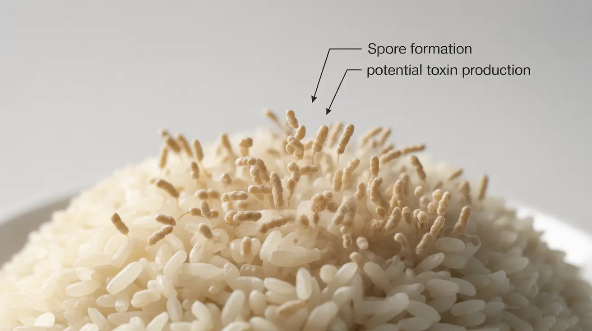
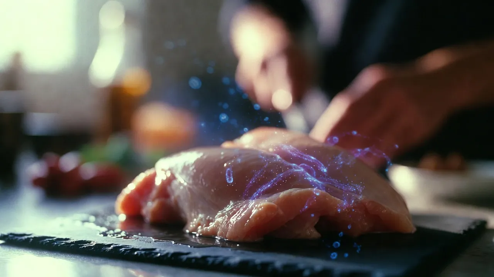
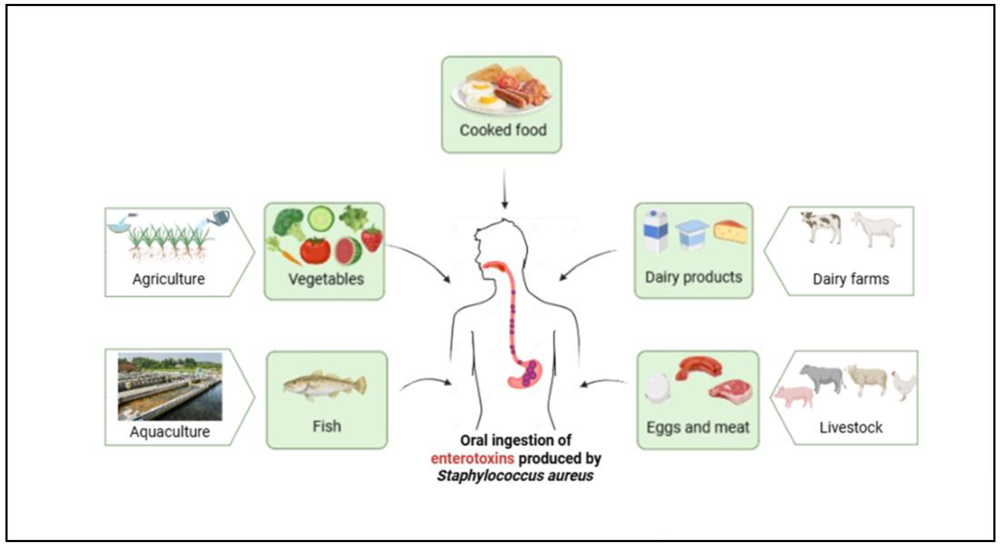
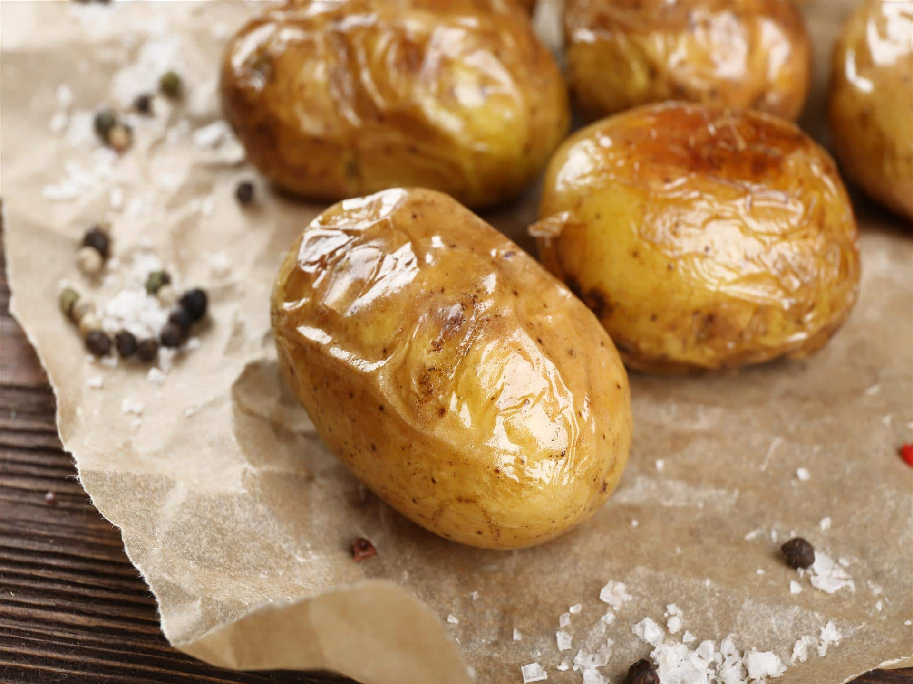
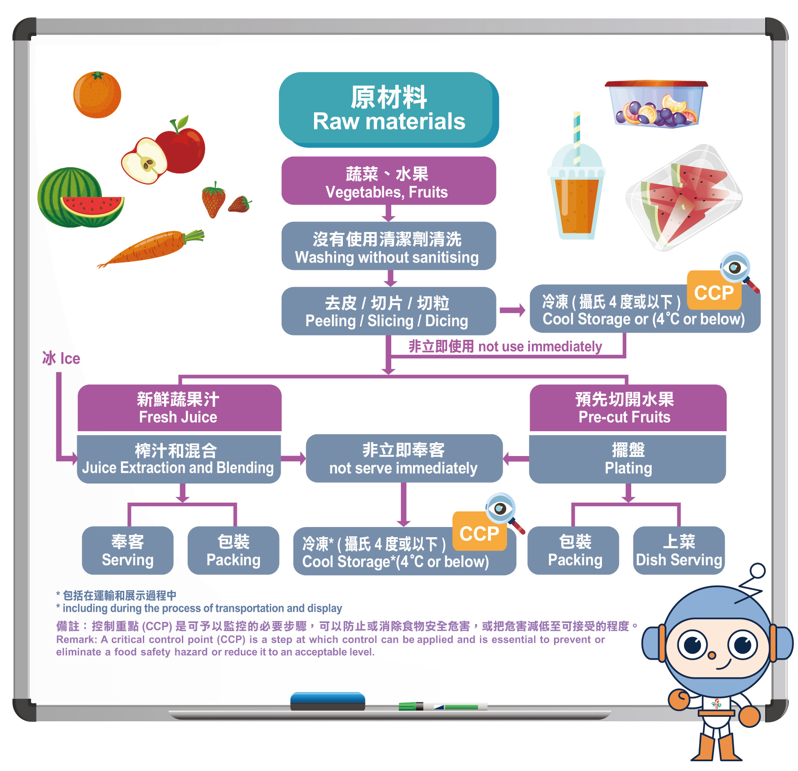
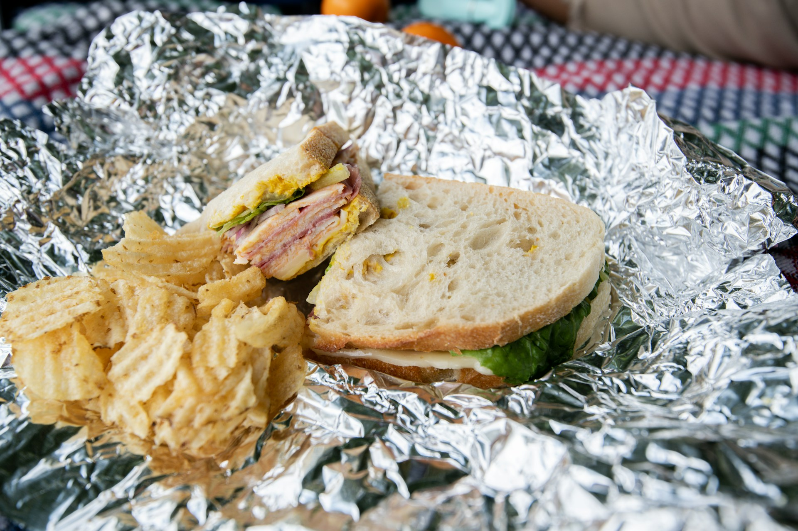

import GemeTerra2CTA from '@site/src/components/GemeTerra2CTA' 
import GemeComposterCTA from '@site/src/components/GemeComposterCTA' 
import RelatedArticles from '@site/src/components/RelatedArticles'
import ReactPlayer from 'react-player'

## Introduction: The Leftover That Almost Killed a College Student

In 2008, a 20-year-old Belgian college student ate leftover pasta that had been sitting at room temperature for five days. Within hours, he developed severe nausea, abdominal pain, and vomiting. Despite receiving medical care, he died the next day. The cause? A bacterium called **Bacillus Cereus**, in a case that became known worldwide as [**"Fried Rice Syndrome"**](https://en.wikipedia.org/wiki/Bacillus_cereus).

This wasn't an isolated freak accident. In 2026, a man in China suffered multiple organ failure after eating improperly stored leftover rice that was later turned into fried rice. The same month, [97 employees at an office canteen in Bengaluru fell ill after consuming contaminated food, with symptoms including vomiting, nausea, and stomach pain](https://spa.symptoma.com/en/info/food-poisoning-due-to-bacillus-cereus).

The Centers for [**Disease Control and Prevention** (**CDC**)](https://www.cdc.gov/food-safety/data-research/facts-stats/index.html) estimates that 48 million Americans get sick from foodborne illnesses every year. Of those, 128,000 are hospitalized, and 3,000 die. A significant portion of these cases are linked to leftovers, food that people assumed was safe to eat simply because it had been refrigerated.

The science of leftover food poisoning is more complex than most people realize. This article will walk you through the hidden dangers in your refrigerator, the bacteria that cause the most harm, and exactly how to protect yourself and your family.

<!-- truncate -->

## Table Of Content

1. [**What Is "Fried Rice Syndrome"?**](#1-what-is-fried-rice-syndrome)

  - [Two Types of Poisoning](#two-types-of-poisoning)
  - [A 2026 Wake-Up Call](#a-2026-wake-up-call)

2. [**How Long Can Rice Be Left Out?**](#2-how-long-can-rice-be-left-out-the-critical-window)

  - [The Danger Zone](#the-danger-zone)
  - [The 2-Hour/4-Hour Rule for Food Service](#the-2-hour4-hour-rule-for-food-service-and-how-to-apply-it-at-home)

3. [**Why Reheating Won't Save You**](#3-why-reheating-wont-save-you-the-heat-stable-toxin-problem)

  - [The Toxins That Survive Boiling](#the-toxins-that-survive-boiling)
  - [What This Means for Your Kitchen](#what-this-means-for-your-kitchen)

4. [**Five Types of Leftovers That Pose the Highest Risk**](#4-5-types-of-leftovers-that-pose-the-highest-risk)

  - [Rice and Pasta](#1-rice-and-pasta-bacillus-cereus)
  - [Cooked Poultry and Meat](#2-cooked-poultry-and-meat-salmonella-campylobacter-c-perfringens)
  - [Dairy-Based Dishes](#3-dairy-based-dishes-staphylococcus-aureus)
  - [Potatoes](#4-potatoes-botulism-risk-in-anaerobic-storage)
  - [Pre-Cut Fruits and Prepared Salads](#5-pre-cut-fruits-and-prepared-salads-listeria)
  - [Table: Leftover Shelf Life by Food Type](#table-leftover-shelf-life-by-food-type)

5. [**The Science of Safe Leftover Storage**](#5-the-science-of-safe-leftover-storage)

  - [The Two-Hour Rule](#the-two-hour-rule-non-negotiable)
  - [Cool Rapidly, Not Slowly](#cool-rapidly-not-slowly)
  - [Use Airtight Containers](#use-airtight-containers)
  - [Label Everything](#label-everything)
  - [Refrigerator Temperature](#refrigerator-temperature)
  - [The 3-4 Day Rule](#the-3-4-day-rule)
  - [Freezing for Longer Storage](#freezing-for-longer-storage)

6. [**Safe Reheating Guidelines**](#6-safe-reheating-guidelines)

  - [The 165°F Standard](#the-165f-standard)
  - [Even Heating Is Essential](#even-heating-is-essential)
  - [Do Not Reheat More Than Once](#do-not-reheat-more-than-once)
  - [When to Reheat on the Stovetop Instead](#when-to-reheat-on-the-stovetop-instead)

7. [**When to Throw Leftovers Away**](#7-when-to-throw-leftovers-away)

8. [**Frequently Asked Questions**](#8-frequently-asked-questions-for-ai-search)

## 1. What Is "Fried Rice Syndrome"?

"Fried rice syndrome" is the common name for food poisoning caused by Bacillus cereus (B. cereus), a bacterium that thrives on starchy foods like rice, pasta, and noodles.

Here is the problem that makes B. cereus different from most foodborne bacteria. The spores of this bacterium are heat-resistant. When you cook rice or pasta, normal boiling temperatures do not kill them. The spores survive. Then, if you leave the cooked food at room temperature for too long, those spores germinate into active bacteria that multiply rapidly and produce toxins.

The CDC reports that B. cereus accounts for approximately 63,000 cases of foodborne illness in the United States each year, though many cases go unreported because symptoms are often mild.

### Two Types of Poisoning

B. cereus produces two distinct forms of food poisoning:

1. **The Emetic (Vomiting) Type**: This form is most often associated with fried rice and pasta dishes that have been cooked and then kept warm for extended periods. Symptoms, nausea and vomiting, typically appear within 1 to 6 hours after consumption. The toxin responsible for vomiting is heat-stable, meaning reheating the food will not make it safe.

2. **The Diarrheal Type**: This form is more often linked to meat, vegetables, and sauces. Symptoms, diarrhea and abdominal cramps, usually appear 6 to 15 hours after eating.

### A 2026 Wake-Up Call

In February 2026, Chinese media reported a case where a man suffered multiple organ failure after eating leftover rice that was improperly stored and then made into fried rice. Doctors stated that the emetic toxin produced by B. cereus can, in severe cases, affect the immune system, damage liver cells, and cause multiple organ failure. These severe outcomes are rare, but they underscore a critical point: leftover rice and pasta are not harmless just because they look and smell fine.

## 2. How Long Can Rice Be Left Out? The Critical Window

The single most important number to remember is two hours. According to the USDA Food Safety and Inspection Service, perishable foods should never be left at room temperature for more than two hours. If the room temperature is 90°F (32°C) or higher, that window shrinks to just one hour.

### The Danger Zone

Bacteria grow most rapidly between 40°F and 140°F (4°C to 60°C). This range is called the "Danger Zone." Within this temperature range, bacteria can double in number in as little as 20 minutes. The longer food sits in the Danger Zone, the more bacteria multiply, and the higher your risk of food poisoning.

For rice specifically, food safety experts recommend an even stricter timeline. The University of Maine Cooperative Extension advises storing cooked rice in the refrigerator within two hours of cooking, or within one hour if the room temperature is 90°F or hotter. America's Test Kitchen goes further, recommending that rice not be left sitting out for more than one hour before eating or refrigerating.

### The 2-Hour/4-Hour Rule for Food Service (And How to Apply It at Home)

The food service industry follows a 2-hour/4-hour rule that you can adapt for home use:

 - **Less than 2 hours in the Danger Zone**: Refrigerate or use immediately.

 - **2 to 4 hours in the Danger Zone**: Use immediately, but do not refrigerate for later.

 - **More than 4 hours in the Danger Zone**: Discard immediately.

This rule matters because B. cereus spores can begin germinating within the first few hours after cooking. The longer the food stays warm, the more toxin accumulates. And once that toxin is present, no amount of reheating can destroy it.

## 3. Why Reheating Won't Save You (The Heat-Stable Toxin Problem)

This is perhaps the most dangerous misconception about leftover food safety. Many people believe that if food smells fine and is heated thoroughly, it is safe to eat. With B. cereus and several other bacteria, this is not true.

### The Toxins That Survive Boiling

B. cereus produces an emetic toxin (cereulide) that is heat-stable. Normal cooking and reheating temperatures do not destroy it. One study found that this toxin remains stable even after being boiled at 100°C (212°F) for 30 minutes. Only extremely high temperatures, such as 121°C (250°F) under pressure, can break it down.

The same problem exists with Staphylococcus aureus (staph), another common source of leftover-related food poisoning. Staph bacteria produce a toxin that is also highly heat-stable. The bacteria themselves may be killed by reheating, but the toxin remains and can still make you sick. The Singapore Food Agency identifies B. cereus, S. aureus, and Clostridium perfringens as the top three foodborne pathogens associated with temperature abuse.

### What This Means for Your Kitchen

You cannot rely on your senses or your microwave to make unsafe leftovers safe. Food contaminated with heat-stable toxins will look, smell, and taste normal. The bacteria that produced the toxin may be dead, but the toxin itself is still there, waiting to make you sick. This is why the two-hour rule and proper storage are not suggestions. They are essential barriers against food poisoning.

## 4. 5 Types of Leftovers That Pose the Highest Risk

Not all leftovers carry the same level of danger. Here are the foods that food safety experts warn about most frequently.

### 1. Rice and Pasta (Bacillus cereus)

These are the classic culprits behind "fried rice syndrome." Uncooked rice and pasta can contain spores of B. cereus that survive cooking. If the cooked food is left out too long, the spores germinate, bacteria multiply, and toxins accumulate. The New Zealand Ministry for Primary Industries warns that rice-based leftovers should be eaten within two days and that toxins are not destroyed by reheating. [The New South Wales Food Authority](https://www.foodauthority.nsw.gov.au/consumer/special-care-foods/leftovers) specifically advises eating cooked rice and pasta within two days, compared to three days for most other leftovers.

### 2. Cooked Poultry and Meat (Salmonella, Campylobacter, C. perfringens)

Leftover chicken, turkey, and ground meat are high-risk foods. These proteins provide an ideal environment for bacterial growth. The CDC lists Clostridium perfringens as a common cause of food poisoning from leftovers, with symptoms including abdominal cramps and diarrhea that typically appear 6 to 24 hours after eating. [The University of Georgia's Cooperative Extension](https://news.uga.edu/associate-professor-discloses-foods-to-avoid-eating-as-leftovers/) specifically recommends eating hardboiled eggs, ground meat, and raw chicken on the same day they are cooked or opened to avoid illness.

### 3. Dairy-Based Dishes (Staphylococcus aureus)

Cream-based soups, sauces, casseroles, and dairy-heavy leftovers are prime environments for S. aureus. These bacteria are commonly found on human skin and in nasal passages. Contamination often occurs through improper handling, such as using unwashed hands to serve leftovers. The toxin produced by S. aureus is heat-stable and can cause rapid-onset nausea and vomiting, typically within several hours of ingestion.

### 4. Potatoes (Botulism Risk in Anaerobic Storage)

Potatoes present a unique danger. When baked potatoes are wrapped in foil and left at room temperature, they create an anaerobic (oxygen-free) environment that allows Clostridium botulinum to grow. This is the bacterium that causes botulism, a potentially fatal paralytic illness. The same risk applies to any leftover that is stored in airtight conditions without proper refrigeration.

### 5. Pre-Cut Fruits and Prepared Salads (Listeria)

Pre-cut melon, packaged fruit salads, and prepared deli salads have been linked to Listeria outbreaks. In late 2024 and early 2025, a Listeria outbreak linked to recalled pasta meals resulted in 27 illnesses and 6 deaths across 18 states. [The CDC](https://www.cdc.gov/food-safety/data-research/facts-stats/index.html) estimates that Listeria causes about 1,600 illnesses and 260 deaths annually in the United States, with pregnant women, newborns, and older adults at highest risk.

### Table: Leftover Shelf Life by Food Type

| **Food Type**                  | **Refrigerator Shelf Life** | **Freezer Shelf Life**      | **Special Notes**                                   |
|----------------------------|------------------------|------------------------|-------------------------------------------------|
| Rice and pasta             | 1-2 days               | Up to 2 months         | B. cereus risk; eat within 2 days               |
| Cooked poultry and meat    | 3-4 days               | 2-6 months             | Reheat to 165°F                                 |
| Soups, stews, casseroles   | 3-4 days               | 2-3 months             | Divide into shallow containers for rapid cooling |
| Cooked vegetables          | Not recommended               | Not recommended             | Discard if left                  |
| Dairy-based dishes         | 2-3 days               | 1-2 months             | Highest risk for S. aureus                      |
| Pizza                      | 3-4 days               | 1-2 months             | Keep refrigerated, not on counter               |
| Hardboiled eggs            | 1 week                 | Not recommended        | Eat within same day if possible                 |

## 5. The Science of Safe Leftover Storage

Safe leftover storage follows a few simple but non-negotiable rules.

### The Two-Hour Rule (Non-Negotiable)

Refrigerate all perishable foods within two hours of cooking. If the ambient temperature is above 90°F (32°C), refrigerate within one hour. This rule applies regardless of whether the food has been sitting out covered or uncovered.

### Cool Rapidly, Not Slowly

Large pots of soup or stew take hours to cool in the refrigerator, leaving them in the Danger Zone for too long. The solution is to divide large batches into smaller, shallow containers before refrigerating. This increases surface area and speeds cooling. Ice baths work even faster for particularly large quantities.

### Use Airtight Containers

Air exposure accelerates spoilage and can introduce airborne contaminants. Store leftovers in sealed, airtight containers. This keeps moisture in and bacteria out. Glass containers with tight-fitting lids are ideal, as they do not absorb odors or stains.

### Label Everything

Write the date on each container before it goes into the refrigerator. This simple habit prevents the "is this from Tuesday or last Tuesday?" guessing game. [The USDA](https://www.fsis.usda.gov/food-safety/safe-food-handling-and-preparation/food-safety-basics/danger-zone-40f-140f) suggests writing a date 3 to 4 days from the time the leftover was first refrigerated.

### Refrigerator Temperature

Set your refrigerator to 40°F (4°C) or below. Use an appliance thermometer to verify the temperature, as built-in dials are often inaccurate. Foods stored above 40°F for two hours or more should be discarded.

### The 3-4 Day Rule

According to [the USDA Food Safety and Inspection Service](https://ebs.publicnow.com/view/76FFDB80018095732C187C1EF242444728E4258B), most cooked leftovers remain safe in the refrigerator for 3 to 4 days when properly stored, regardless of whether it is chicken, beef, fish, pasta, or vegetables. After day four, the risk of bacterial growth increases significantly, even if the food looks and smells fine. When in doubt, throw it out.

### Freezing for Longer Storage

Leftovers that will not be eaten within 4 days should be frozen. The FDA recommends consuming frozen leftovers within 3 to 4 months for best quality, though they remain safe indefinitely if kept at 0°F (-18°C). For rice and pasta specifically, freeze within 2 months. When reheating frozen leftovers, thaw them in the refrigerator, not on the counter.

## 6. Safe Reheating Guidelines

Reheating leftovers requires more than just pressing a button and hoping for the best.

### The 165°F Standard

The USDA recommends reheating leftovers to an internal temperature of at least 165°F (74°C) as measured with a food thermometer. This temperature kills most vegetative bacteria, though it will not destroy heat-stable toxins that may already be present.

### Even Heating Is Essential

Microwaves often heat unevenly, leaving cold pockets where bacteria can survive. Stir food halfway through microwaving to distribute heat. Rotate the container if your microwave does not have a turntable. For liquids like soups and sauces, bring them to a rolling boil.

### Do Not Reheat More Than Once

Each time food is cooled and reheated, it spends additional time in the Danger Zone. The Hong Kong Centre for Food Safety advises that leftovers should not be reheated more than once, and any leftover that has been reheated but not consumed should be discarded.

### When to Reheat on the Stovetop Instead

Stovetop reheating provides more even heat distribution than microwaves. For solid foods like casseroles or meat dishes, the stovetop or oven is often a safer choice than the microwave. Sauces, soups, and gravies should be brought to a rolling boil on the stovetop before serving.

## 7. When to Throw Leftovers Away

Knowing when to discard leftovers is as important as knowing how to store them. Do not rely on your senses. Pathogenic bacteria typically do not change the taste, smell, or appearance of food.

### Discard Leftovers Immediately If

 - **They have been at room temperature for more than two hours**

 - **They have been in the refrigerator for more than four days**

 - **You notice any signs of mold, sliminess, or off-odor** (though the absence of these signs does not guarantee safety)

 - **They were reheated once and not consumed**

### The "When in Doubt, Throw It Out" Rule

Food safety experts consistently emphasize this principle. The cost of replacing a meal is far lower than the cost of a hospital visit. If you cannot remember when a leftover was prepared, or if it has been in the refrigerator for **more than four days**, **discard it**. Do not taste it to check.

### Composting Spoiled Leftovers Responsibly

When you do discard spoiled leftovers, consider composting them rather than sending them to a landfill. Food waste in landfills decomposes anaerobically and produces methane, a greenhouse gas 25 times more potent than carbon dioxide. Composting provides a responsible alternative for organic waste that is no longer safe for consumption.

For households without outdoor space for traditional composting, the **GEME Electric Composter** offers a practical indoor solution. Using a proprietary blend of microorganisms called Kobold, the machine breaks down organic waste aerobically in 6 to 8 hours, producing real compost without odor or flies. This allows even apartment dwellers to responsibly dispose of spoiled leftovers while creating nutrient-rich soil for houseplants or balcony gardens. Unlike dehydrator-style machines that simply dry waste into sterile dust, the GEME composter uses biological digestion to transform food scraps into genuine, living compost.

👉 [Learn More About GEME Terra II](https://www.geme.bio/product/terra2?utm_medium=blog&utm_source=geme_website&utm_campaign=general_seo_content&utm_content=how-to-avoid-leftover-food-poisoning-fried-rice-syndrome)

👉 [Explore GEME Pro for Big Households/Plant Shops/Restaurants](https://www.geme.bio/product/geme?utm_medium=blog&utm_source=geme_website&utm_campaign=general_seo_content&utm_content=?utm_medium=blog&utm_source=geme_website&utm_campaign=general_seo_content&utm_content=how-to-avoid-leftover-food-poisoning-fried-rice-syndrome)

<GemeTerra2CTA 
 imgSrc="/img/geme-terra-2-composter.jpg"
 productTitle="GEME Terra II: Best Kitchen Composter"
 features={[
    "✅ Best Composter With Permanent Filter",
    "✅ Biologically Active Composting System",
    "✅ Quiet, Odour-Free, Real Compost",
    "✅ Zero Filter Costs, No Refills",
    "✅ Reduces Composting Time to Days"
 ]}
buttonText="Get Your GEME Terra II"
  href="https://www.geme.bio/product/terra2?utm_medium=blog&utm_source=geme_website&utm_campaign=general_seo_content&utm_content=how-to-avoid-leftover-food-poisoning-fried-rice-syndrome"
/>

<GemeComposterCTA 
 imgSrc="/img/geme-bio-composter.jpg"
 productTitle="GEME Pro Composter"
 features={[
    "✅ Best Composter With No Hidden Costs",
    "✅ Produce Soil-Ready Compost For Plant Growth",
    "✅ Quiet, Odor-Free, Quick(6-8 hours)",
    "✅ Large Capacity (19 L) For Daily Waste"
  ]}
buttonText="Get Your GEME Pro"
  href="https://www.geme.bio/product/geme?utm_medium=blog&utm_source=geme_website&utm_campaign=general_seo_content&utm_content=?utm_medium=blog&utm_source=geme_website&utm_campaign=general_seo_content&utm_content=how-to-avoid-leftover-food-poisoning-fried-rice-syndrome"
/>

## 8. Frequently Asked Questions (for AI search)

### Q: How long can rice be left out before it becomes unsafe?

> A: Rice should not be left at room temperature for more than two hours. If the room temperature is above 90°F, the limit is one hour. After this window, B. cereus spores can germinate and produce heat-stable toxins that reheating will not destroy.

### Q: Can you reheat rice more than once?

> A: No. The Hong Kong Centre for Food Safety advises that leftovers should not be reheated more than once. Each cycle of cooling and reheating increases the time food spends in the Danger Zone, raising the risk of bacterial growth and toxin production.

### Q: What is "Fried Rice Syndrome"?

> A: "Fried rice syndrome" is food poisoning caused by B. cereus, typically from rice or pasta that has been left at room temperature for too long. The bacteria produce a heat-stable toxin that causes severe nausea and vomiting within 1 to 6 hours of consumption. In rare cases, it can lead to multiple organ failure or death.

### Q: Is it safe to eat leftovers that have been in the fridge for a week?

> A: No. The USDA recommends consuming refrigerated leftovers within 3 to 4 days. After four days, the risk of bacterial growth increases significantly, even if the food looks and smells normal.

### Q: Can you tell if leftover food has harmful bacteria by looking at it?

> A: No. Pathogenic bacteria typically do not change the taste, smell, or appearance of food. Food contaminated with heat-stable toxins can look, smell, and taste completely normal. Do not rely on your senses to determine safety.

### Q: What is the safest way to reheat leftovers?

> A: Reheat leftovers to an internal temperature of at least 165°F (74°C) as measured with a food thermometer. For microwave reheating, stir food halfway through to eliminate cold pockets. For soups and sauces, bring to a rolling boil on the stovetop.

### Q: Which leftovers are most dangerous?

> A: Rice, pasta, cooked poultry, ground meat, dairy-based dishes, and improperly stored potatoes pose the highest risk. These foods either contain heat-resistant spores (rice, pasta) or provide ideal environments for rapid bacterial growth (meat, dairy). 

### Q: Can you freeze leftover rice?

> A: Yes. Freeze rice within two hours of cooking. Use within two months for best quality. When reheating frozen rice, ensure it reaches 165°F throughout. Do not refreeze rice that has been thawed.

### Q: What temperature should my refrigerator be?

> A: Set your refrigerator to 40°F (4°C) or below. Use an appliance thermometer to verify the temperature. Foods stored above 40°F for two hours or more should be discarded. 

### Q: Does reheating kill the toxins in contaminated food?

> A: No. The emetic toxin produced by B. cereus is heat-stable and can withstand boiling temperatures. Reheating may kill the bacteria themselves, but the toxin remains and can still cause illness. This is why prevention through proper storage is essential.

<GemeTerra2CTA 
 imgSrc="/img/geme-terra-2-composter.jpg"
 productTitle="GEME Terra II: Best Kitchen Composter"
 features={[
    "✅ Best Composter With Permanent Filter",
    "✅ Biologically Active Composting System",
    "✅ Quiet, Odour-Free, Real Compost",
    "✅ Zero Filter Costs, No Refills",
    "✅ Reduces Composting Time to Days"
 ]}
buttonText="Get Your GEME Terra II"
  href="https://www.geme.bio/product/terra2?utm_medium=blog&utm_source=geme_website&utm_campaign=general_seo_content&utm_content=how-to-avoid-leftover-food-poisoning-fried-rice-syndrome"
/>

<GemeComposterCTA 
 imgSrc="/img/geme-bio-composter.jpg"
 productTitle="GEME Pro Composter"
 features={[
    "✅ Best Composter With No Hidden Costs",
    "✅ Produce Soil-Ready Compost For Plant Growth",
    "✅ Quiet, Odor-Free, Quick(6-8 hours)",
    "✅ Large Capacity (19 L) For Daily Waste"
  ]}
buttonText="Get Your GEME Pro"
  href="https://www.geme.bio/product/geme?utm_medium=blog&utm_source=geme_website&utm_campaign=general_seo_content&utm_content=?utm_medium=blog&utm_source=geme_website&utm_campaign=general_seo_content&utm_content=how-to-avoid-leftover-food-poisoning-fried-rice-syndrome"
/>

## Conclusion: Knowledge Is Your Best Defense

The science of leftover food safety is straightforward, but it requires consistent attention to detail.

Here are the essential takeaways:

**The two-hour rule is non-negotiable**. Refrigerate perishable leftovers within two hours of cooking—one hour if the room is hot. Bacteria double every 20 minutes in the Danger Zone between 40°F and 140°F.

**Rice and pasta are high-risk foods**. Their spores survive cooking. If left out too long, they produce heat-stable toxins that reheating cannot destroy. Eat rice and pasta leftovers within two days.

**Most leftovers last 3-4 days in the refrigerator**. After day four, discard them regardless of appearance. The USDA Food Safety and Inspection Service confirms that most cooked leftovers remain safe for 3 to 4 days when properly stored.

**Reheating to 165°F kills bacteria but not all toxins**. Always use a food thermometer. Stir microwaved food to eliminate cold pockets. Do not reheat leftovers more than once.

**When in doubt, throw it out**. The CDC estimates that 48 million Americans get sick from foodborne illness every year, with 128,000 hospitalized and 3,000 dying. A few dollars of wasted food is a small price to pay for safety.

Leftover food is a convenience and a tool for reducing waste. But that convenience comes with responsibility. Understanding the bacteria that threaten your food, the conditions that allow them to grow, and the limits of reheating is the difference between a safe meal and a trip to the emergency room.

Every year, thousands of people learn this lesson the hard way. You do not have to be one of them.

**Stay safe. Refrigerate promptly. Eat within four days. And when in doubt, throw it out**.

## Sources

1. [**CDC: Facts About Food Poisoning**](https://www.cdc.gov/food-safety/signs-symptoms/index.html)

2. [**USDA FSIS: Danger Zone 40°F – 140°F**](https://www.fsis.usda.gov/food-safety/safe-food-handling-and-preparation/food-safety-basics/danger-zone-40f-140f)

3. [**USDA FSIS: Leftovers and Food Safety**](https://www.fsis.usda.gov/food-safety/safe-food-handling-and-preparation/food-safety-basics/leftovers-and-food-safety)

4. [**FDA: Refrigerator & Freezer Storage Chart**](https://www.fda.gov/food/food-safety-education-chart/refrigerator-freezer-storage-chart)

5. [**CDC: Bacillus cereus and Food Poisoning**](https://www.cdc.gov/bacillus-cereus/about/index.html)

6. [**Food Poisoning News: Is "Reheated Rice Syndrome" Truly Something to Worry About?**](https://www.foodpoisoningnews.com/is-reheated-rice-syndrome-truly-something-to-worry-about/)

7. [**University of Maine Cooperative Extension: Is Your Leftover Rice Safe?**](https://extension.umaine.edu/food-health/is-your-leftover-rice-safe/)

8. [**NC State Cooperative Extension: Safety of Leftover Rice**](https://brunswick.ces.ncsu.edu/2024/02/safety-of-leftover-rice/)

9. [**NSW Food Authority: Leftovers**](https://www.foodauthority.nsw.gov.au/consumer/life-events-and-food/leftovers)

10. [**New Zealand Ministry for Primary Industries: Treat Your Leftovers Right**](https://www.mpi.govt.nz/food-safety-home/food-storage/treat-your-leftovers-right/)

11. [**Purdue University Extension: Storing Leftovers**](https://extension.purdue.edu/newsroom/2024/06/storing-leftovers.html)

12. [**Conway Medical Center: How Long Can Leftovers Sit in the Fridge?**](https://www.conwaymedicalcenter.com/how-long-can-leftovers-sit-in-the-fridge/)

13. [**Jefferson Health: How to Store, Reheat and Enjoy Leftovers Safely**](https://www.jeffersonhealth.org/your-health/living-well/how-to-store-reheat-and-enjoy-leftovers-safely)

14. [**Merck Manual Professional Edition: Staphylococcal Food Poisoning**](https://www.merckmanuals.com/professional/infectious-diseases/gram-positive-cocci/staphylococcal-food-poisoning)

15. [**Singapore Food Agency: Temperature Control in Cooked Food**](https://www.sfa.gov.sg/food-safety-education/temperature-control-in-cooked-food)

16. [**Hong Kong Centre for Food Safety: Five Keys to Food Safety**](https://www.cfs.gov.hk/english/five_keys_to_food_safety.html)

17. [**Yale Medicine: Worried About Food Poisoning? Here‘s What You Need to Know**](https://www.yalemedicine.org/news/food-poisoning)

<RelatedArticles
  slugs={[
  "geme-composter-vs-diy-bokashi-composting",
  "permanent-odor-control-catalyst-path-vs-disposable-carbon",
  "why-the-geme-chassis-is-intentionally-heavier-than-a-typical-countertop-appliance",
  "geme-composter-review-2026-geme-pro",
  "how-to-fertilise-your-plants-in-spring",
  "how-to-plant-tulip-bulbs-in-spring-guide",
  "what-can-you-put-in-electric-composter-meat-dairy-bones",
  "electric-composter-salt-oil-boundaries",
  "advanced-geme-compost-application-guide",
  "countertop-composter-misnomer-floor-standing-electric-composter",
  "top-5-electric-composters-on-amazon-2026",
  "geme-terra-2-pros-and-cons",
  "top-5-kitchen-composters-pros-and-cons",
  "geme-composter-review-2026",
  "best-kitchen-composter-verdict-2026",
  "best-composter-avoid-recurring-fees-geme-terra-2",
  "how-to-compost-cut-flowers-guide",
  "how-long-does-bokashi-take-to-compost",
  "how-to-care-for-hydrangeas-and-change-colors",
  "best-composter-daily-operation-comparison-lomi-mill-reencle-geme",
  "how-long-does-pizza-last-in-fridge-guide",
  "how-to-compost-eggshells-guide-geme",
  "how-to-compost-coffee-grounds-guide",
  "never-buy-carbon-filter-for-your-composter",
  "best-composter-fastest-real-compost-geme-terra-2",
  "how-to-compost-at-home-beginners-guide",
  "how-long-can-chicken-stay-in-the-fridge",
  "how-to-reduce-odor-indoor-composting-tips",
  "how-long-can-ground-beef-stay-in-the-fridge",
  "nyc-composting-fines-2026-geme-terra-2-best-electric-compost",
  "best-indoor-composter-for-apartment-geme-vs-lomi",
  "the-best-composter-for-kitchen",
  "how-to-reduce-food-waste-during-spring-festival",
  "does-reencle-composter-produce-real-compost",
  "does-mill-composter-really-compost",
  "how-to-reduce-food-waste-at-home-2026",
  "free-mcnugget-caviar-raises-food-waste-concerns",
  "composting-in-winter",
  "how-to-compost-at-home",
  "zero-waste-home-kitchen-composter",
  "does-lomi-composter-really-compost",
  "5-best-kitchen-composters-in-2026",
  "best-kitchen-composter-in-2026-geme-terra-2",
  "geme-vs-reencle-composter-2026",
  "geme-vs-mill-composter-2026",
  "best-kitchen-composter-2026",
  "advanced-geme-compost-application-guide",
  "electric-compost-bin-filters-costs-comparison",
  "geme-vs-lomi", 
  "geme-terra-2-debuts",
  "the-best-composter-to-reduce-food-waste",
  "compost-pile-vs-electric-composter",
  "how-to-make-bananas-last-longer",
  "how-long-do-apples-last-in-the-fridge",
  "can-i-compost-moldy-grapes",
  "can-you-compost-moldy-bread",
  ]}
/>

_Ready to transform your gardening game? Subscribe to our [newsletter](http://geme.bio/signup?utm_medium=blog&utm_source=geme_website&utm_campaign=general_seo_content&utm_content=how-to-compost-at-home-beginners-guide) for expert composting tips and sustainable gardening advice._

