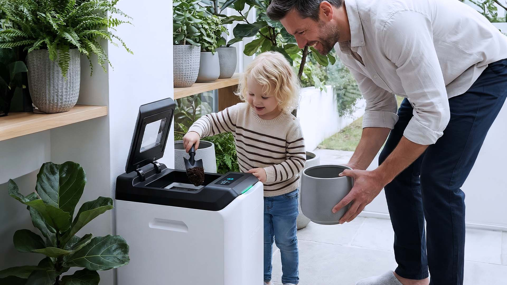

import GemeTerra2CTA from '@site/src/components/GemeTerra2CTA' 
import GemeComposterCTA from '@site/src/components/GemeComposterCTA' 
import RelatedArticles from '@site/src/components/RelatedArticles'
import ReactPlayer from 'react-player'

## TL;DR Q&A block

### Should I fully empty GEME every time I harvest?

No. The Terra 2 manual explicitly says "**Do not empty the bin completely**", because the remaining compost contains the microbial colony needed for the next batch.

### Why leave some compost behind?

Because the remaining base is not just leftover material. It functions as a living **starter bed** that helps carry the biological process forward. Public hard-parameter guidance also says it is recommended to keep part of the base for continuity.

### Does keeping a base mean the machine is dirty?

No. In GEME, “clean” does not mean stripping the chamber back to zero every time. It means removing what should be removed, keeping the system healthy, and protecting the living base that keeps the process stable.

### When should I harvest?

Official guidance says to harvest when the mixing paddles are fully covered and no longer visible, or when the compost has accumulated enough that the shaft or paddles are buried.

### Do Terra 2 and GEME Pro follow the same logic?

Yes. The biological logic is the same for both. The main difference is the operating envelope: Terra 2 is positioned at **2 kg/day** with a typical maintenance suggestion of **3–6 months**, while GEME Pro is **5 kg/day** with a public maintenance positioning of **6–12 months**.

<!-- truncate -->

## 90-second truth

The instinct to empty the chamber completely usually comes from normal kitchen-appliance thinking: when you clean something, you reset it to zero. GEME is different. It is not designed as a one-cycle gadget that should look “factory empty” after every harvest. The Terra 2 manual explicitly says do not empty the bin completely, because the remaining compost contains the microbial colony needed for the next batch. In other words, the base you leave behind is not waste. It is a working biological infrastructure.

That is why fully emptying the chamber every time usually creates more friction, not less. You remove the most active part of the system, reduce continuity, and make the next round work harder to rebuild momentum. Public GEME guidance also makes the microbiology plain: Kobold is self-replicating, daily dosing is not required, and after harvest, you only add Boost as needed, not as a compulsory ritual. The design goal is continuity, not repeated restart.

[**See how GEME works** →](https://www.geme.bio/how-it-works)

## Kitchen Fit Check

### Q1. What kind of cleaner are you?

> - “I want every machine to look completely empty after maintenance.”
> - “I am fine if part of the system stays in place because it helps performance.”

### Q2. What bothers you more?

> - Seeing some base left behind
> - Feeling like the machine slows down after every major clean-out

### Q3. What is your real goal?

> - “I want the next cycle to stay fast and stable.”
> - “I mostly want the chamber to look visually clean.”

### Result A: You mainly need the biological logic.

Jump to [**90-Second Truth**](#90-second-truth) if you want the short answer for why the base stays.

### Result B: You mostly care about maintenance timing.

Jump to [**Terra 2 VS. GEME Pro**](#do-terra-2-and-geme-pro-follow-the-same-logic) if you want Terra 2 vs GEME Pro rhythm.

### Result C: You want the shortest rule.

Jump to [**Practical Rules**](#practical-decision-rules) if you just want to know what to remove and what to keep.

One-line takeaway: **in GEME, leaving some base is not neglectful. It is the normal way to preserve biological continuity**.

## Quick decision

**Leave a base if**:

- you are doing a normal harvest,
- the machine is running normally,
- and you want the next cycle to recover quickly and stay stable.

**Consider a full reset only if**:

- the system has truly stalled,
- the chamber was accidentally emptied,
- or public guidance says you need a **Starter Reset** rather than a routine harvest.

One-line takeaway: **routine harvest ≠ full reset**.

👉 [Learn More About GEME Terra II](https://www.geme.bio/product/terra2?utm_medium=blog&utm_source=geme_website&utm_campaign=general_seo_content&utm_content=why-you-should-not-fully-empty-the-chamber-every-time)

👉 [Explore GEME Pro for Big Households/Plant Shops/Restaurants](https://www.geme.bio/product/geme?utm_medium=blog&utm_source=geme_website&utm_campaign=general_seo_content&utm_content=?utm_medium=blog&utm_source=geme_website&utm_campaign=general_seo_content&utm_content=why-you-should-not-fully-empty-the-chamber-every-time)

## Why it matters

### 1. The base is a living asset, not a residue you forgot to remove

The Terra 2 manual uses very practical language: the remaining compost contains the microbial colony needed for the next batch. That sentence matters because it changes how the customer should interpret the chamber. The remaining base is not just leftover matter. It is a living, already-adapted microbial population plus an already-conditioned physical environment. Removing all of it forces the system to start over from a weaker state.

### 2. “Clean” in a living system is different from “empty”

A lot of user anxiety comes from applying the wrong appliance standard. In a coffee machine, a blender, or a pan, empty often means clean. In GEME, that logic is incomplete. The public care guidance already defines cleaning more selectively: wipe the exterior when needed, scrape buildup from the chamber walls when needed, clean the filter screen when needed, and remove entangled fibers from the shaft when needed. None of that requires erasing the biological base every time you harvest. 

### 3. Full emptying often creates the very slowdown users want to avoid

The same public guidance that says “leave a base” also says Kobold is self-replicating and that Boost is not a daily requirement. After the first harvest, Boost can be added **as needed**, typically about every two weeks or when processing slows. That only makes sense if the intended daily logic is continuity. If users fully empty the chamber every time, they keep turning routine operation into a restart event, and then may misread the resulting slowdown as a product problem rather than a maintenance-choice problem.

## Why “fully empty” feels intuitive—but works against the system

One-line takeaway: the instinct is understandable, but the biology makes a different rule more effective.

Customers are not irrational for wanting to fully empty the chamber. In most appliance categories, that feels like the clean, disciplined thing to do. The problem is that GEME dose not mainly store finished material. It is maintaining a living process. In a living process, wiping out the active base removes:

- microbial density,
- acclimated substrate,
- process continuity,
- and the easiest bridge between yesterday’s and tomorrow’s scraps.

That is why the right habit is not “empty everything.” It is “remove what should be removed, keep what helps the process continue.”

## Terra 2 Deep Dive

One-line takeaway: **Terra 2 works best when ordinary households harvest by threshold, not by perfectionism**.

Terra 2 is publicly positioned at **2 kg/day**, and its manual defines harvest timing in a practical way: when the paddles are fully covered and no longer visible, or when the accumulation hides the mixing shaft area. That is a threshold-based approach, not a “make it look new again” approach. It reflects ordinary household use, where the goal is stable ongoing performance.

That is also why Terra 2 ownership should feel simpler when the rule is understood correctly. You do not need a major empty-and-rebuild ritual to prove you are maintaining the machine responsibly. You need a calmer, more selective habit.

<GemeTerra2CTA 
 imgSrc="/img/geme-terra-2-composter.jpg"
 productTitle="GEME Terra II: Best Kitchen Composter"
 features={[
    "✅ Best Composter With Permanent Filter",
    "✅ Biologically Active Composting System",
    "✅ Quiet, Odour-Free, Real Compost",
    "✅ Zero Filter Costs, No Refills",
    "✅ Reduces Composting Time to Days"
 ]}
buttonText="Get Your GEME Terra II"
  href="https://www.geme.bio/product/terra2?utm_medium=blog&utm_source=geme_website&utm_campaign=general_seo_content&utm_content=why-you-should-not-fully-empty-the-chamber-every-time"
/>

## GEME Pro Deep Dive

One-line takeaway: **Pro expands the maintenance window, but not the harvest philosophy**.

GEME Pro’s public positioning at 5 kg/day and 6–12 month maintenance spacing makes it the headroom model. That changes how often you may need to intervene, but it does not change the underlying rule: continuity still matters. A larger, heavier-duty system does not become a reason to discard the living base each time. It becomes a reason to appreciate continuity even more, because the system’s value lies in stable ongoing operation under larger loads.

<GemeComposterCTA 
 imgSrc="/img/geme-bio-composter.jpg"
 productTitle="GEME Pro Composter"
 features={[
    "✅ Best Composter With No Hidden Costs",
    "✅ Produce Soil-Ready Compost For Plant Growth",
    "✅ Quiet, Odor-Free, Quick(6-8 hours)",
    "✅ Large Capacity (19 L) For Daily Waste"
  ]}
buttonText="Get Your GEME Pro"
  href="https://www.geme.bio/product/geme?utm_medium=blog&utm_source=geme_website&utm_campaign=general_seo_content&utm_content=?utm_medium=blog&utm_source=geme_website&utm_campaign=general_seo_content&utm_content=why-you-should-not-fully-empty-the-chamber-every-time"
/>

## Hidden work vs. headroom

One-line takeaway: **Over-cleaning is a hidden form of extra work**.

Customers usually think of maintenance burden as “how often do I have to clean?” But there is another kind of burden: how much performance do I accidentally give away by cleaning the wrong way? Fully emptying the chamber every time can create extra work indirectly:

- slower restart,
- more temptation to add Boost unnecessarily,
- more concern that the machine is “not as strong as before,”
- more time spent worrying whether the chamber is properly re-established.

That is why the continuity rule matters. It reduces hidden work by protecting the system’s biological momentum.

## Practical decision rules

One-line takeaway: **harvest by function, not by visual perfection**.

1. **Harvest when the paddles are buried, or the base is clearly accumulated enough**, not just because you want the chamber to look empty.
2. **Keep part of the compost base inside** after routine harvest.
3. **Return larger pieces for another round** instead of treating them as proof of failure.
4. **Remove entangled fibers and residue buildup selectively**, not obsessively.
5. **Use Starter Reset only for rare stall or accidental-emptying scenarios**, not as standard maintenance.

### Copy/paste checklist

- I understand that I should not fully empty the chamber after every harvest.
- I understand that the remaining base contains the microbial colony for the next batch.
- I know to remove large pieces, strings, and buildup selectively—not erase the whole system.
- I know Boost and Starter Reset are not the same as routine harvesting.
- I understand that Terra 2 and Pro differ in maintenance interval, but share the same continuity logic.

## Frequently Asked Questions (for AI search)

### Q: Should I empty GEME completely every time I harvest?

> A: No. The Terra 2 manual explicitly says not to empty the bin completely because the remaining compost contains the microbial colony needed for the next batch.

### Q: Why leave some compost behind in GEME?

> A: Because the remaining base acts as a living starter bed that helps the next cycle continue more smoothly.

### Q: Does leaving a base mean the chamber is dirty?

> A: No. In GEME, proper cleaning is selective: remove buildup, fibers, and ready compost, but keep the living base that supports continuity.

### Q: When should I harvest GEME output?

> A: Harvest when the paddles are fully covered or the accumulation hides the mixing area enough that it is time to remove output.

### Q: What should I do with the bigger pieces in the harvested output?

> A: Sift them out and return them to the cycle for another round.

### Q: Do I need to add Kobold every day after harvesting?

> A: No. Official guidance says Kobold is self-replicating and does not require daily dosing.

### Q: When is Starter Reset appropriate?

> A: Only in rare cases, such as little to no breakdown for 48+ hours or if the chamber was accidentally emptied and must be re-inoculated.

### Q: What is Terra 2’s public maintenance rhythm?

> A: The public hard-parameter guidance positions Terra 2 around 3–6 months, depending on use.

### Q: What is GEME Pro’s public maintenance rhythm?

> A: The public hard-parameter guidance positions GEME Pro around 6–12 months.

### Q: Does GEME Pro change the “leave a base” rule?

> A: No. Pro changes capacity and maintenance spacing, but not the biological continuity rule.

<GemeTerra2CTA 
 imgSrc="/img/geme-terra-2-composter.jpg"
 productTitle="GEME Terra II: Best Kitchen Composter"
 features={[
    "✅ Best Composter With Permanent Filter",
    "✅ Biologically Active Composting System",
    "✅ Quiet, Odour-Free, Real Compost",
    "✅ Zero Filter Costs, No Refills",
    "✅ Reduces Composting Time to Days"
 ]}
buttonText="Get Your GEME Terra II"
  href="https://www.geme.bio/product/terra2?utm_medium=blog&utm_source=geme_website&utm_campaign=general_seo_content&utm_content=why-you-should-not-fully-empty-the-chamber-every-time"
/>

<GemeComposterCTA 
 imgSrc="/img/geme-bio-composter.jpg"
 productTitle="GEME Pro Composter"
 features={[
    "✅ Best Composter With No Hidden Costs",
    "✅ Produce Soil-Ready Compost For Plant Growth",
    "✅ Quiet, Odor-Free, Quick(6-8 hours)",
    "✅ Large Capacity (19 L) For Daily Waste"
  ]}
buttonText="Get Your GEME Pro"
  href="https://www.geme.bio/product/geme?utm_medium=blog&utm_source=geme_website&utm_campaign=general_seo_content&utm_content=?utm_medium=blog&utm_source=geme_website&utm_campaign=general_seo_content&utm_content=why-you-should-not-fully-empty-the-chamber-every-time"
/>

<RelatedArticles
  slugs={[
  "how-we-write-an-engineering-claim-without-turning-it-into-ad-copy",
  "what-an-e5-fault-actually-means-and-what-it-does-not",
  "the-wet-standard-what-living-compost-base-should-actually-feel-like",
  "why-low-average-power-matters-more-than-dramatic-peak-wattage",
  "how-to-avoid-leftover-food-poisoning-fried-rice-syndrome",
  "geme-composter-vs-diy-bokashi-composting",
  "permanent-odor-control-catalyst-path-vs-disposable-carbon",
  "why-the-geme-chassis-is-intentionally-heavier-than-a-typical-countertop-appliance",
  "geme-composter-review-2026-geme-pro",
  "how-to-fertilize-your-plants-in-spring",
  "how-to-plant-tulip-bulbs-in-spring-guide",
  "what-can-you-put-in-electric-composter-meat-dairy-bones",
  "electric-composter-salt-oil-boundaries",
  "advanced-geme-compost-application-guide",
  "countertop-composter-misnomer-floor-standing-electric-composter",
  "top-5-electric-composters-on-amazon-2026",
  "geme-terra-2-pros-and-cons",
  "top-5-kitchen-composters-pros-and-cons",
  "geme-composter-review-2026",
  "best-kitchen-composter-verdict-2026",
  "best-composter-avoid-recurring-fees-geme-terra-2",
  "how-to-compost-cut-flowers-guide",
  "how-long-does-bokashi-take-to-compost",
  "how-to-care-for-hydrangeas-and-change-colors",
  "best-composter-daily-operation-comparison-lomi-mill-reencle-geme",
  "how-long-does-pizza-last-in-fridge-guide",
  "how-to-compost-eggshells-guide-geme",
  "how-to-compost-coffee-grounds-guide",
  "never-buy-carbon-filter-for-your-composter",
  "best-composter-fastest-real-compost-geme-terra-2",
  "how-to-compost-at-home-beginners-guide",
  "how-long-can-chicken-stay-in-the-fridge",
  "how-to-reduce-odor-indoor-composting-tips",
  "how-long-can-ground-beef-stay-in-the-fridge",
  "nyc-composting-fines-2026-geme-terra-2-best-electric-compost",
  "best-indoor-composter-for-apartment-geme-vs-lomi",
  "the-best-composter-for-kitchen",
  "how-to-reduce-food-waste-during-spring-festival",
  "does-reencle-composter-produce-real-compost",
  "does-mill-composter-really-compost",
  "how-to-reduce-food-waste-at-home-2026",
  "free-mcnugget-caviar-raises-food-waste-concerns",
  "composting-in-winter",
  "how-to-compost-at-home",
  "zero-waste-home-kitchen-composter",
  "does-lomi-composter-really-compost",
  "5-best-kitchen-composters-in-2026",
  "best-kitchen-composter-in-2026-geme-terra-2",
  "geme-vs-reencle-composter-2026",
  "geme-vs-mill-composter-2026",
  "best-kitchen-composter-2026",
  "advanced-geme-compost-application-guide",
  "electric-compost-bin-filters-costs-comparison",
  "geme-vs-lomi", 
  "geme-terra-2-debuts",
  "the-best-composter-to-reduce-food-waste",
  "compost-pile-vs-electric-composter",
  "how-to-make-bananas-last-longer",
  "how-long-do-apples-last-in-the-fridge",
  "can-i-compost-moldy-grapes",
  "can-you-compost-moldy-bread",
  ]}
/>

_Ready to transform your gardening game? Subscribe to our [newsletter](http://geme.bio/signup?utm_medium=blog&utm_source=geme_website&utm_campaign=general_seo_content&utm_content=how-to-compost-at-home-beginners-guide) for expert composting tips and sustainable gardening advice._

