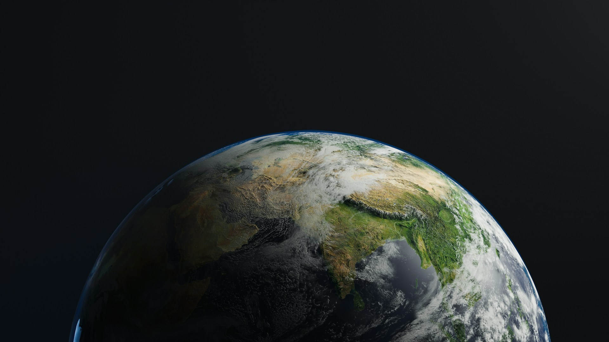
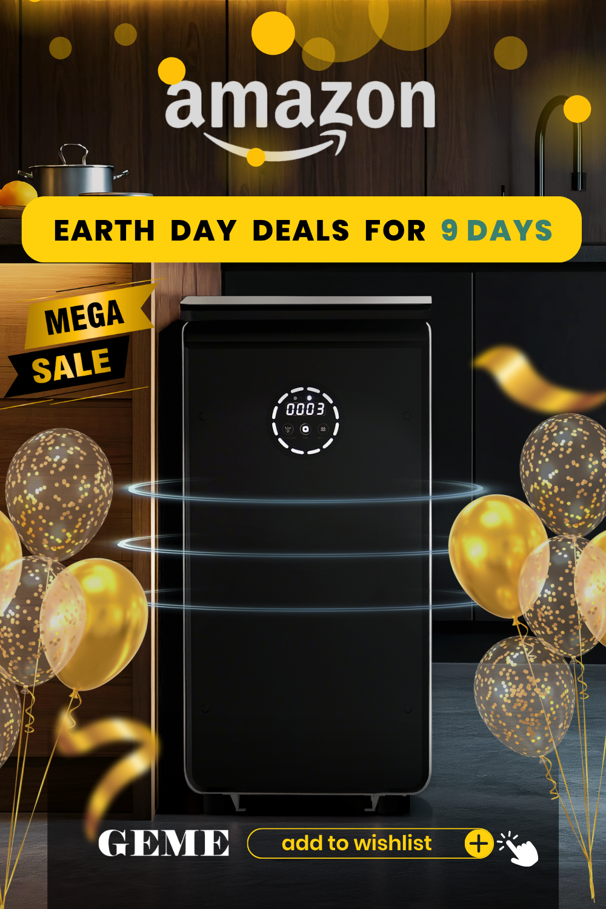

import GemeTerra2CTA from '@site/src/components/GemeTerra2CTA' 
import GemeComposterCTA from '@site/src/components/GemeComposterCTA' 
import RelatedArticles from '@site/src/components/RelatedArticles'
import ReactPlayer from 'react-player'

## The Best Earth Day Deal You’ve Been Waiting For

| Country                  | Discount                      | How to Get It                                      |
|-------------------------|-------------------------------|----------------------------------------------------|
| The U.S. | 10% off (approx. \$100)          | Use code **7AXL4NIV** at [**Amazon checkout**](https://www.amazon.com/GEME-Composter-Real-Composting-Electric/dp/B0BV31KTCN?maas=maas_adg_95133E1DFCABAF6F40B83EDC1AF7526F_afap_abs&ref_=aa_maas&tag=maas)           |
| Germany                 | 10% off (approx. €100)    | Use code **9TSKG45F** at [**Amazon checkout**](https://www.amazon.de/GEME-Elektrischer-Dauerhafter-Kompostierung-Kompostbeh%C3%A4lter/dp/B0CJY4K9J3?maas=maas_adg_4716B0377F71DC5424D044BF54D420AC_afap_abs&ref_=aa_maas&tag=maas)           |

Happy Earth Day 2026! This April 22, communities in more than 190 countries are celebrating under the theme “Our Power, Our Planet”. What better way to use your power than by turning your kitchen waste into garden gold?

The GEME Composter is on sale right now on Amazon. And with these exclusive discount codes, you can save around 10% in the U.S or in Germany, that‘s roughly \$100 or €100 off, depending on your local pricing. **These discount codes are available from April 22 to April 30, 2026**.

Here’s everything you need to know before you grab yours.

<!-- truncate -->

## Table Of Content

1. [**Why GEME? Because Most “Composters” Are Lying to You**](#1-why-geme-because-most-composters-are-lying-to-you)

2. [**What Makes GEME the Best Composter for Your Home**](#2-what-makes-geme-the-best-composter-for-your-home)

3. [**Earth Day 2026: Your Discount Details**](#3-earth-day-2026-your-discount-details)

4. [**How to Use Your GEME Composter**](#4-how-to-use-your-geme-composter-its-easier-than-you-think)

5. [**Why This Earth Day Deal Won’t Last**](#5-why-this-earth-day-deal-wont-last)

6. [**Frequently Asked Questions**](#6-frequently-asked-questions)

## 1. Why GEME? Because Most “Composters” Are Lying to You

Here’s something most brands won‘t tell you. Many electric “composters” don’t actually make compost. They’re dehydrators. They grind up your food, bake it dry, and hand you back a pile of sterile dust that looks like dirt but does nothing for your plants.

GEME is different.

The GEME Composter uses a proprietary blend of heat-loving microorganisms called Kobold to digest your food waste. Think of it as a tiny, hungry ecosystem living in your kitchen. You add scraps anytime. The microbes eat them. What comes out is real, biologically active compost—moist, dark, and ready to mix into your garden soil.

And here’s the best part for Earth Day shoppers: you never buy filters. Ever. GEME uses a permanent metal-ion oxidation catalyst that lasts the lifetime of the machine. No \$50 charcoal filters every few months. No subscriptions. No surprises.

## 2. What Makes GEME the Best Composter for Your Home

The GEME Composter is packed with features that make daily composting effortless:

1. **Real Compost, Not Dehydrated Dust**. Unlike competitors that simply dry and grind scraps, GEME’s microbial technology actually breaks down food waste into genuine, nutrient-rich compost.

2. **Zero Filter Costs Forever**. The permanent metal-ion catalyst means you never buy another filter. Most other brands charge \$50–\$200 per year for replacements.

3. **Continuous Feed, No Locked Lids**. You can add food waste any time of day. There’s no “cycle” to start or wait for. Just open, add, close.

4. **19L Capacity, Up to 5kg Daily**. Perfect for households of 1 to 5 people. The large chamber means you only harvest compost every 1 to 2 months.

5. **Whisper Quiet at 35–40 dB**. You can run it in an open kitchen without even noticing it.

6. **Handles Almost Everything**. Meat, dairy, small bones, coffee grounds, eggshells, leftovers—all of it goes in.

GEME is uniquely positioned as the only microbe-based electric kitchen composter that truly closes the loop from kitchen to garden. Using GEME can help households reduce CO₂ emissions by 100kg to 300kg just by composting food waste instead of sending it to a landfill.

## 3. Earth Day 2026: Your Discount Details

Here’s how to claim your Earth Day savings on Amazon:

### The U.S.

Apply discount code **7AXL4NIV** at checkout on Amazon. Your total discount can reach approximately \$100.

[**Go to Amazon Checkout** -->](https://www.amazon.com/GEME-Composter-Real-Composting-Electric/dp/B0BV31KTCN?maas=maas_adg_95133E1DFCABAF6F40B83EDC1AF7526F_afap_abs&ref_=aa_maas&tag=maas)

<GemeComposterCTA 
 imgSrc="/img/geme-bio-composter.jpg"
 productTitle="GEME Pro Composter"
 features={[
    "✅ Best Composter With No Hidden Costs",
    "✅ Produce Soil-Ready Compost For Plant Growth",
    "✅ Quiet, Odor-Free, Quick(6-8 hours)",
    "✅ Large Capacity (19 L) For Daily Waste"
  ]}
buttonText="Get $100 Off on Amazon US"
  href="https://www.amazon.com/GEME-Composter-Real-Composting-Electric/dp/B0BV31KTCN?maas=maas_adg_95133E1DFCABAF6F40B83EDC1AF7526F_afap_abs&ref_=aa_maas&tag=maas"
/>

### Germany

Apply discount code **9TSKG45F** at checkout on Amazon Germany. This code offers 10% off the GEME Composter, which works out to roughly €100 in savings depending on your local pricing.

[**Go to Amazon Checkout** -->](https://www.amazon.de/GEME-Elektrischer-Dauerhafter-Kompostierung-Kompostbeh%C3%A4lter/dp/B0CJY4K9J3?maas=maas_adg_4716B0377F71DC5424D044BF54D420AC_afap_abs&ref_=aa_maas&tag=maas)

<GemeComposterCTA 
 imgSrc="/img/geme-bio-composter.jpg"
 productTitle="GEME Pro Composter"
 features={[
    "✅ Best Composter With No Hidden Costs",
    "✅ Produce Soil-Ready Compost For Plant Growth",
    "✅ Quiet, Odor-Free, Quick(6-8 hours)",
    "✅ Large Capacity (19 L) For Daily Waste"
  ]}
buttonText="Get €100 Off on Amazon DE"
  href="https://www.amazon.de/GEME-Elektrischer-Dauerhafter-Kompostierung-Kompostbeh%C3%A4lter/dp/B0CJY4K9J3?maas=maas_adg_4716B0377F71DC5424D044BF54D420AC_afap_abs&ref_=aa_maas&tag=maas"
/>

### Amazon Product Links

| Region            | Direct Amazon Link                                                |
|-------------------|------------------------------------------------------------------|
| United States     | [**GEME Composter on Amazon US**](https://www.amazon.com/GEME-Composter-Real-Composting-Electric/dp/B0BV31KTCN?maas=maas_adg_95133E1DFCABAF6F40B83EDC1AF7526F_afap_abs&ref_=aa_maas&tag=maas)   |
| Germany | [**GEME Composter on Amazon DE**](https://www.amazon.de/GEME-Elektrischer-Dauerhafter-Kompostierung-Kompostbeh%C3%A4lter/dp/B0CJY4K9J3?maas=maas_adg_4716B0377F71DC5424D044BF54D420AC_afap_abs&ref_=aa_maas&tag=maas)   |

## 4. How to Use Your GEME Composter (It’s Easier Than You Think)

- **Setup (5 minutes)**: Add the Kobold starter microbes, fill with water, and let activate for 6–8 hours.

- **Daily Use (30 seconds)**: Open the lid. Toss in food scraps. Close the lid. That‘s it.

- **Harvest (Every 1–2 months)**: Remove finished compost. Leave some in the chamber as a “starter bed” for the next batch.

- **Maintenance (Every 6-12 months)**: Deep clean the inner bucket. No filter changes. Ever.

## 5. Why This Earth Day Deal Won’t Last

Earth Day only comes once a year. And this is the biggest discount GEME has offered on Amazon in 2026.

**The U.S.**: \$100 off with code **7AXL4NIV** (April 22 – April 30, 2026)

**Germany**: \€100 off with code **9TSKG45F** (April 22 – April 30, 2026)

These codes won‘t be around forever. If you’ve been waiting for a sign to finally start composting, this is it.

## 6. Frequently Asked Questions

### Does GEME really make compost or just dry food?

It makes real compost. GEME uses live Kobold microbes to digest food waste biologically. The output is moist, dark, and full of active microorganisms—ready to mix with soil at a 1:8 ratio.

### How often do I need to replace filters?

Never. The metal-ion oxidation catalyst is permanent. You never buy another filter.

### Can I put meat and bones in it?

Yes. Small bones (chicken, fish) and all meat are fine. Large beef or pork bones should be avoided.

### How loud is it?

35–40 decibels, which is quieter than a refrigerator. You won‘t notice it running.

### How much food waste can it process daily?

Up to 5 kilograms (about 11 pounds) per day, with a 19-liter chamber. That’s enough for a family of 1 to 5 people.

### Do I need to buy more microbes later?

No. The Kobold microbes are self-replicating. As long as you leave some compost in the machine when you harvest, the colony sustains itself.

### How long does it take to make compost?

Soft materials break down in 6–8 hours. Fibrous stems take a few days. You‘ll harvest finished compost every 1 to 2 months.

## Final Words: Celebrate Earth Day by Closing the Loop

Every year, millions of tons of food waste end up in landfills. There, buried under piles of trash with no oxygen, they decompose and release methane, a greenhouse gas 25 times more potent than carbon dioxide.

Composting at home eliminates that methane entirely. Your food scraps become soil. Your soil grows more food. That‘s the circle of life, right in your kitchen.

This Earth Day, take your power back. Stop throwing away banana peels and coffee grounds. Start turning them into something beautiful.

Grab your GEME Composter on Amazon today. Use the code above. And give your garden the gift of real, living compost.

👉 Shop GEME Composter on [**Amazon US**](https://www.amazon.com/GEME-Composter-Real-Composting-Electric/dp/B0BV31KTCN?maas=maas_adg_95133E1DFCABAF6F40B83EDC1AF7526F_afap_abs&ref_=aa_maas&tag=maas) | [**Amazon DE**](https://www.amazon.de/GEME-Elektrischer-Dauerhafter-Kompostierung-Kompostbeh%C3%A4lter/dp/B0CJY4K9J3?maas=maas_adg_4716B0377F71DC5424D044BF54D420AC_afap_abs&ref_=aa_maas&tag=maas)

<RelatedArticles
  slugs={[
  "how-to-avoid-leftover-food-poisoning-fried-rice-syndrome",
  "geme-composter-vs-diy-bokashi-composting",
  "permanent-odor-control-catalyst-path-vs-disposable-carbon",
  "why-the-geme-chassis-is-intentionally-heavier-than-a-typical-countertop-appliance",
  "geme-composter-review-2026-geme-pro",
  "how-to-fertilize-your-plants-in-spring",
  "how-to-plant-tulip-bulbs-in-spring-guide",
  "what-can-you-put-in-electric-composter-meat-dairy-bones",
  "electric-composter-salt-oil-boundaries",
  "advanced-geme-compost-application-guide",
  "countertop-composter-misnomer-floor-standing-electric-composter",
  "top-5-electric-composters-on-amazon-2026",
  "geme-terra-2-pros-and-cons",
  "top-5-kitchen-composters-pros-and-cons",
  "geme-composter-review-2026",
  "best-kitchen-composter-verdict-2026",
  "best-composter-avoid-recurring-fees-geme-terra-2",
  "how-to-compost-cut-flowers-guide",
  "how-long-does-bokashi-take-to-compost",
  "how-to-care-for-hydrangeas-and-change-colors",
  "best-composter-daily-operation-comparison-lomi-mill-reencle-geme",
  "how-long-does-pizza-last-in-fridge-guide",
  "how-to-compost-eggshells-guide-geme",
  "how-to-compost-coffee-grounds-guide",
  "never-buy-carbon-filter-for-your-composter",
  "best-composter-fastest-real-compost-geme-terra-2",
  "how-to-compost-at-home-beginners-guide",
  "how-long-can-chicken-stay-in-the-fridge",
  "how-to-reduce-odor-indoor-composting-tips",
  "how-long-can-ground-beef-stay-in-the-fridge",
  "nyc-composting-fines-2026-geme-terra-2-best-electric-compost",
  "best-indoor-composter-for-apartment-geme-vs-lomi",
  "the-best-composter-for-kitchen",
  "how-to-reduce-food-waste-during-spring-festival",
  "does-reencle-composter-produce-real-compost",
  "does-mill-composter-really-compost",
  "how-to-reduce-food-waste-at-home-2026",
  "free-mcnugget-caviar-raises-food-waste-concerns",
  "composting-in-winter",
  "how-to-compost-at-home",
  "zero-waste-home-kitchen-composter",
  "does-lomi-composter-really-compost",
  "5-best-kitchen-composters-in-2026",
  "best-kitchen-composter-in-2026-geme-terra-2",
  "geme-vs-reencle-composter-2026",
  "geme-vs-mill-composter-2026",
  "best-kitchen-composter-2026",
  "advanced-geme-compost-application-guide",
  "electric-compost-bin-filters-costs-comparison",
  "geme-vs-lomi", 
  "geme-terra-2-debuts",
  "the-best-composter-to-reduce-food-waste",
  "compost-pile-vs-electric-composter",
  "how-to-make-bananas-last-longer",
  "how-long-do-apples-last-in-the-fridge",
  "can-i-compost-moldy-grapes",
  "can-you-compost-moldy-bread",
  ]}
/>

_Ready to transform your gardening game? Subscribe to our [newsletter](http://geme.bio/signup?utm_medium=blog&utm_source=geme_website&utm_campaign=general_seo_content&utm_content=how-to-compost-at-home-beginners-guide) for expert composting tips and sustainable gardening advice._

