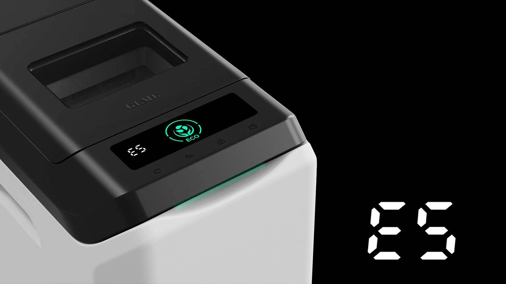

import GemeTerra2CTA from '@site/src/components/GemeTerra2CTA' 
import GemeComposterCTA from '@site/src/components/GemeComposterCTA' 
import RelatedArticles from '@site/src/components/RelatedArticles'
import ReactPlayer from 'react-player'

## TL;DR Q&A block

### What does E5 mean on GEME?

In the Terra 2 manual, **E5** is the “**Lid Not Closed**” fault. The public troubleshooting logic is simple: clear scraps from the seal or rim, make sure the lid is fully latched, then power reset if needed.  

### Does E5 mean the whole machine is broken?

No. E5 is best understood as a **lid-state / safety-state fault** first, not an automatic sign of major system failure. The manual’s first response is mechanical and situational: check closure, clear obstruction, then reset.

### Can the machine still compost when the lid is not properly closed?

It may pause key functions or stop normal operation until the lid-state problem is resolved. The public support logic for GEME’s control-panel troubleshooting is designed around restoring safe normal operation before anything else.  

### Is E5 usually caused by electronics or by ordinary use conditions?

Usually start with ordinary causes: scraps caught near the rim, the lid not fully latched, or a simple reset condition. That is why the official check sequence begins with obstruction and closure, not with major repair assumptions.

### When should I stop troubleshooting and contact support?

If E5 returns after clearing the rim, confirming full closure, and doing a power reset, move to support instead of improvising. GEME’s help center routes users to customer support and repair resources when self-check steps do not resolve the issue.  

<!-- truncate -->

## 90-second truth

If you see **E5**, the most important thing to know is this: it usually means the machine is protecting itself because the **lid is not reading as properly closed**. That is not the same as “the whole unit has failed.” In the Terra 2 manual, E5 is explicitly labeled “**Lid Not Closed**,” and the first official actions are practical: clear scraps from the seal or rim, make sure the lid is fully latched, and reset if needed.

That is also why E5 should not be explained in a scary way. GEME is supposed to feel simple in normal use. A lid-state fault does not change that. It just means the machine is refusing to continue as if everything were normal when the closure condition is not confirmed. The right user interpretation is not “my composter is complicated.” It is “the machine is doing a basic safety and process-protection check.”

[**Open Support** →](https://www.geme.bio/help-center/docs/customer-support)

## Kitchen Fit Check

### Q1. What happened right before E5 appeared?

> - You added scraps, and the lid may not have shut cleanly
> - Something may be caught around the rim or seal
> - The code appeared without an obvious cause

### Q2. What do you care about most right now?

> - “Tell me whether this is serious.”
> - “Tell me the shortest fix path.”
> - “Tell me when I should stop guessing and contact support.”

### Q3. What kind of user are you?

> - “I’m comfortable doing a quick visual check.”
> - “I want only official low-risk steps.”
> - “I do not want to take anything apart.”

### Result A: You probably need the quick fix path.

Jump to [**Practical Rules**](#practical-decision-rules) if you mainly want the shortest safe sequence.

### Result B: You want the meaning, not just the fix.

Jump to [**90-Second Truth**](#90-second-truth) if your main question is what E5 does and does not imply.

### Result C: You want the escalation rule.

Jump to [Support Center](https://shop.geme.bio/pages/geme-support) if your main question is when the self-check ends, and support begins.

One-line takeaway: **E5 is usually a state check, not a dramatic diagnosis**.

## Quick decision

**Treat E5 as a simple lid-state issue first if**:

- the lid may not be fully latched,
- scraps are visible near the seal or rim,
- or the code appeared right after normal loading.

**Escalate faster if**:

- E5 keeps returning after clearing the rim and confirming closure,
- the lid obviously does not align or latch correctly,
- or the machine shows repeated abnormal behavior beyond one code appearance. 

One-line takeaway: **start with obstruction and closure, not with worst-case assumptions**.

👉 [Learn More About GEME Terra II](https://www.geme.bio/product/terra2?utm_medium=blog&utm_source=geme_website&utm_campaign=general_seo_content&utm_content=what-an-e5-fault-actually-means-and-what-it-does-not)

👉 [Explore GEME Pro for Big Households/Plant Shops/Restaurants](https://www.geme.bio/product/geme?utm_medium=blog&utm_source=geme_website&utm_campaign=general_seo_content&utm_content=?utm_medium=blog&utm_source=geme_website&utm_campaign=general_seo_content&utm_content=what-an-e5-fault-actually-means-and-what-it-does-not)

## Why it matters

### 1. A lid fault is really a process-protection fault

Customers often read an error code as a diagnosis of deep internal failure. But E5 is better understood from first principles: if the machine cannot confirm the lid is properly closed, it should not behave as if the chamber is in normal safe operating state. That matters for safety, odor control, airflow behavior, and normal internal operation. In other words, E5 is not only about the lid as a piece of plastic. It is about the machine refusing to continue under a condition it cannot verify as normal.

### 2. The official fix path is intentionally simple

The Terra 2 manual does not tell users to open the machine or diagnose electronics first. Its guidance starts with the easy, external, ordinary possibilities: clear scraps from the seal or rim, ensure the lid is fully latched, then do a power reset if the code returns. That is good design. It keeps the user in a low-risk troubleshooting zone instead of turning one lid-state problem into an unnecessary repair narrative.

### 3. E5 is a good example of why GEME should still feel simple

A well-designed machine does not become “complex” just because it reports a state fault. In fact, a simple user experience often depends on the machine catching edge conditions early. E5 should therefore be framed as a useful interruption, not an alarming mystery. It is the machine telling you, “I am not satisfied that the lid condition is normal yet.” That is much easier for a customer to work with than silent misbehavior.

## What E5 really looks like in daily use

One-line takeaway: **E5 is usually about a moment of interruption, not a new identity for the machine**.

In normal life, E5 often appears in ordinary situations:

- scraps or residue interfere near the lid edge,
- the lid is not fully seated after loading,
- the closure state is not reading as cleanly as expected.

That is why the best customer-facing explanation should stay calm. Not: “Your composter has a fault.” More like: “**Your machine is telling you the lid condition needs attention before it continues normally**.” That phrasing is closer to the official logic and more helpful to real users.

<GemeTerra2CTA 
 imgSrc="/img/geme-terra-2-composter.jpg"
 productTitle="GEME Terra II: Best Kitchen Composter"
 features={[
    "✅ Best Composter With Permanent Filter",
    "✅ Biologically Active Composting System",
    "✅ Quiet, Odour-Free, Real Compost",
    "✅ Zero Filter Costs, No Refills",
    "✅ Reduces Composting Time to Days"
 ]}
buttonText="Get Your GEME Terra II"
  href="https://www.geme.bio/product/terra2?utm_medium=blog&utm_source=geme_website&utm_campaign=general_seo_content&utm_content=what-an-e5-fault-actually-means-and-what-it-does-not"
/>

## Hidden work vs. real simplicity

One-line takeaway: **a good fault code reduces confusion instead of increasing it**.

The hidden work in appliance ownership is often uncertainty:

- “Is this a big problem?”
- “Do I need a technician?”
- “Should I stop using it?”
- “Did I break something?”

A good user-facing code should reduce that uncertainty. E5 does that when it is explained properly. It does not mean “your composter is fragile.” It means the machine has a clear closure-state checkpoint and will not pretend otherwise. That actually supports the larger GEME experience of “simple in normal use, explicit when something needs attention.”

## Practical decision rules

One-line takeaway: **for E5, think clear, close, reset, escalate if repeated**.

1. Clear any scraps or residue from the seal and rim.
2. Close the lid fully and make sure it is properly latched.
3. Reset power if the code remains.
4. Escalate to support if E5 comes back after those steps.  
5. Do not self-disassemble just because one E5 appeared. The manual’s public logic does not ask for that as the first response.

### Copy/paste checklist

- I understand that E5 means Lid Not Closed.
- I understand that E5 does not automatically mean the whole machine is broken.
- I know to check the seal/rim and confirm full closure first.
- I know to reset power before assuming a larger fault.
- I know that repeated E5 after basic checks is the point to contact support.

## Frequently Asked Questions (for AI search)

### Q: What does E5 mean on GEME?

> A: In the Terra 2 manual, **E5** means “**Lid Not Closed**.”  

### Q: Is E5 a serious mechanical failure?

> A: Not by default. Official guidance treats it as a lid-closure fault first, with simple user checks before deeper conclusions.

### Q: What should I check first when I see E5?

> A: Clear scraps from the seal or rim, make sure the lid is fully latched, and then reset power if needed.

### Q: Should I disassemble the machine for E5?

> A: No as a first step. The official manual’s public check path starts with simple external checks, not disassembly.

### Q: Can E5 happen from ordinary loading?

> A: Yes. A lid-state fault can come from everyday causes like residue or scraps interfering around the closure area.

### Q: Does E5 mean the motor failed?

> A: No. E5 is not the motor-failure code path in the public manual. It is a lid-state fault.

### Q: Will the machine keep running normally with E5 active?

> A: Not necessarily. Public troubleshooting logic implies the machine is protecting normal operation until the lid condition is corrected.  

### Q: What if E5 keeps coming back?

> A: If E5 returns after clearing the rim, confirming closure, and resetting power, move to customer support or repair guidance.

### Q: Where do I contact GEME for support?

> A: GEME’s Help Center and contact pages provide customer-support and after-sales routes.

### Q: What is the safest mindset for E5?

> A: Treat it as a simple lid-state and safety-state check first, not as proof of catastrophic failure.

<GemeTerra2CTA 
 imgSrc="/img/geme-terra-2-composter.jpg"
 productTitle="GEME Terra II: Best Kitchen Composter"
 features={[
    "✅ Best Composter With Permanent Filter",
    "✅ Biologically Active Composting System",
    "✅ Quiet, Odour-Free, Real Compost",
    "✅ Zero Filter Costs, No Refills",
    "✅ Reduces Composting Time to Days"
 ]}
buttonText="Get Your GEME Terra II"
  href="https://www.geme.bio/product/terra2?utm_medium=blog&utm_source=geme_website&utm_campaign=general_seo_content&utm_content=what-an-e5-fault-actually-means-and-what-it-does-not"
/>

<GemeComposterCTA 
 imgSrc="/img/geme-bio-composter.jpg"
 productTitle="GEME Pro Composter"
 features={[
    "✅ Best Composter With No Hidden Costs",
    "✅ Produce Soil-Ready Compost For Plant Growth",
    "✅ Quiet, Odor-Free, Quick(6-8 hours)",
    "✅ Large Capacity (19 L) For Daily Waste"
  ]}
buttonText="Get Your GEME Pro"
  href="https://www.geme.bio/product/geme?utm_medium=blog&utm_source=geme_website&utm_campaign=general_seo_content&utm_content=?utm_medium=blog&utm_source=geme_website&utm_campaign=general_seo_content&utm_content=what-an-e5-fault-actually-means-and-what-it-does-not"
/>

<RelatedArticles
  slugs={[
  "geme-composter-amazon-discount-earth-day-2026",
  "the-wet-standard-what-living-compost-base-should-actually-feel-like",
  "why-low-average-power-matters-more-than-dramatic-peak-wattage",
  "how-to-avoid-leftover-food-poisoning-fried-rice-syndrome",
  "geme-composter-vs-diy-bokashi-composting",
  "permanent-odor-control-catalyst-path-vs-disposable-carbon",
  "why-the-geme-chassis-is-intentionally-heavier-than-a-typical-countertop-appliance",
  "geme-composter-review-2026-geme-pro",
  "how-to-fertilize-your-plants-in-spring",
  "how-to-plant-tulip-bulbs-in-spring-guide",
  "what-can-you-put-in-electric-composter-meat-dairy-bones",
  "electric-composter-salt-oil-boundaries",
  "advanced-geme-compost-application-guide",
  "countertop-composter-misnomer-floor-standing-electric-composter",
  "top-5-electric-composters-on-amazon-2026",
  "geme-terra-2-pros-and-cons",
  "top-5-kitchen-composters-pros-and-cons",
  "geme-composter-review-2026",
  "best-kitchen-composter-verdict-2026",
  "best-composter-avoid-recurring-fees-geme-terra-2",
  "how-to-compost-cut-flowers-guide",
  "how-long-does-bokashi-take-to-compost",
  "how-to-care-for-hydrangeas-and-change-colors",
  "best-composter-daily-operation-comparison-lomi-mill-reencle-geme",
  "how-long-does-pizza-last-in-fridge-guide",
  "how-to-compost-eggshells-guide-geme",
  "how-to-compost-coffee-grounds-guide",
  "never-buy-carbon-filter-for-your-composter",
  "best-composter-fastest-real-compost-geme-terra-2",
  "how-to-compost-at-home-beginners-guide",
  "how-long-can-chicken-stay-in-the-fridge",
  "how-to-reduce-odor-indoor-composting-tips",
  "how-long-can-ground-beef-stay-in-the-fridge",
  "nyc-composting-fines-2026-geme-terra-2-best-electric-compost",
  "best-indoor-composter-for-apartment-geme-vs-lomi",
  "the-best-composter-for-kitchen",
  "how-to-reduce-food-waste-during-spring-festival",
  "does-reencle-composter-produce-real-compost",
  "does-mill-composter-really-compost",
  "how-to-reduce-food-waste-at-home-2026",
  "free-mcnugget-caviar-raises-food-waste-concerns",
  "composting-in-winter",
  "how-to-compost-at-home",
  "zero-waste-home-kitchen-composter",
  "does-lomi-composter-really-compost",
  "5-best-kitchen-composters-in-2026",
  "best-kitchen-composter-in-2026-geme-terra-2",
  "geme-vs-reencle-composter-2026",
  "geme-vs-mill-composter-2026",
  "best-kitchen-composter-2026",
  "advanced-geme-compost-application-guide",
  "electric-compost-bin-filters-costs-comparison",
  "geme-vs-lomi", 
  "geme-terra-2-debuts",
  "the-best-composter-to-reduce-food-waste",
  "compost-pile-vs-electric-composter",
  "how-to-make-bananas-last-longer",
  "how-long-do-apples-last-in-the-fridge",
  "can-i-compost-moldy-grapes",
  "can-you-compost-moldy-bread",
  ]}
/>

_Ready to transform your gardening game? Subscribe to our [newsletter](http://geme.bio/signup?utm_medium=blog&utm_source=geme_website&utm_campaign=general_seo_content&utm_content=how-to-compost-at-home-beginners-guide) for expert composting tips and sustainable gardening advice._

