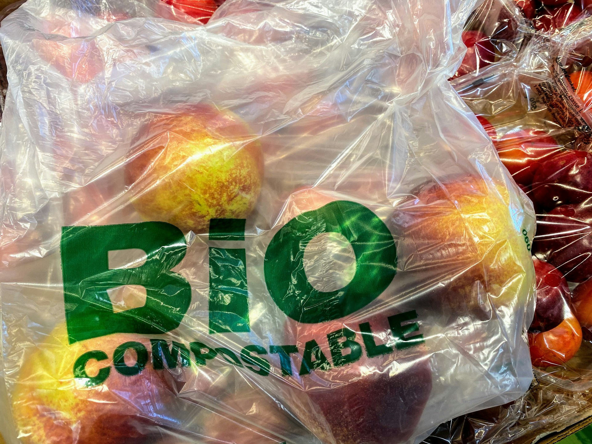

import GemeTerra2CTA from '@site/src/components/GemeTerra2CTA' 
import GemeComposterCTA from '@site/src/components/GemeComposterCTA' 
import RelatedArticles from '@site/src/components/RelatedArticles'
import ReactPlayer from 'react-player'

## One-sentence takeaway

“Bioplastic” isn’t a guarantee. Only certified compostable items may break down—and often more slowly, depending on conditions.

### Why it matters in the kitchen

This is where most “compost” claims die: ambiguous packaging.

If a system encourages the wrong plastics, you don’t get compost, you get fragments.
So we don’t answer with vibes. We answer with standards and boundaries.

<!-- truncate -->

## First: two words that are often confused

**“Biodegradable” ≠ “Compostable”**

- Biodegradable can mean “breaks down eventually” under unspecified conditions.
- Compostable is a stricter claim tied to defined test conditions and compost quality requirements.

For plastics labeled compostable, the relevant standards are typically industrial composting frameworks such as **ASTM D6400** (US) and **EN 13432** (EU), which specify performance under controlled aerobic composting environments. (Reference: [ASTM International](https://www.astm.org/d6400-23.html))

## What those standards actually imply (the part marketing leaves out)

**ASTM D6400** is designed for plastics intended to compost in municipal/industrial aerobic composting facilities, where thermophilic conditions are achieved. 

**EN 13432** similarly evaluates biodegradation and disintegration, including requirements around fragment size and compost quality impacts under industrial composting conditions. 

**Key implication**:

A product that passes these standards is not automatically guaranteed to fully compost in every “home” or “small system” scenario. (Conditions vary; temperatures and residence time may differ.) 

## Our practical guidance (simple rules you can follow)

### ✅ Generally OK

- Real food scraps
- Paper towel / uncoated paper with food residue
- Natural fibers (in small amounts)

### ⚠️ Conditional (read this twice)

Certified compostable items (look for credible certification + standard reference) may be processed partially and often slowly.

If you choose to add them:

1. Add **small amounts** only
2. Cut into **smaller pieces**
3. Expect a **longer timeline** than food scraps
4. **Screen the output** and return large pieces for further processing
5. If fragments persist, stop adding and treat them as contamination

### ❌ Not recommended

- Anything labeled only “biodegradable” with no compostability standard
- Conventional plastics (even “thin film”)
- “Oxo-degradable” style materials (fragmentation ≠ composting)

👉 [Learn More About GEME Terra II](https://www.geme.bio/product/terra2?utm_medium=blog&utm_source=geme_website&utm_campaign=general_seo_content&utm_content=can-i-put-plastic-in-geme-composter)

👉 [Explore GEME Pro for Big Households/Plant Shops/Restaurants](https://www.geme.bio/product/geme?utm_medium=blog&utm_source=geme_website&utm_campaign=general_seo_content&utm_content=?utm_medium=blog&utm_source=geme_website&utm_campaign=general_seo_content&utm_content=can-i-put-plastic-in-geme-composter)

## Why “conditional” is the honest answer

Composting is aerobic and condition-dependent; oxygen and process control matter. 

Plastics, even compostable ones, often require **specific thermophilic profiles and time** to disintegrate and biodegrade as intended, which is why standards are framed around industrial composting facilities. 

So we don’t tell you “yes, throw them all in.” We also don’t tell you “never.” We tell you exactly what we can stand behind without greenwashing.

## Methods & boundaries

- Compostability certifications are tied to defined conditions; real-world systems vary. 
- Disintegration (no visible fragments) is part of compostability evaluation; if fragments remain, compost quality is compromised. 
- For our exact internal accept/reject policy, publish the decision tree in GK (without disclosing proprietary process parameters).

Methods & boundaries → [**Open GK Verification**](https://www.geme.bio/gk)

<GemeTerra2CTA 
 imgSrc="/img/geme-terra-2-composter.jpg"
 productTitle="GEME Terra II: Best Kitchen Composter"
 features={[
    "✅ Best Composter With Permanent Filter",
    "✅ Biologically Active Composting System",
    "✅ Quiet, Odour-Free, Real Compost",
    "✅ Zero Filter Costs, No Refills",
    "✅ Reduces Composting Time to Days"
 ]}
buttonText="Get Your GEME Terra II"
  href="https://www.geme.bio/product/terra2?utm_medium=blog&utm_source=geme_website&utm_campaign=general_seo_content&utm_content=can-i-put-plastic-in-geme-composter"
/>

<GemeComposterCTA 
 imgSrc="/img/geme-bio-composter.jpg"
 productTitle="GEME Pro Composter"
 features={[
    "✅ Best Composter With No Hidden Costs",
    "✅ Produce Soil-Ready Compost For Plant Growth",
    "✅ Quiet, Odor-Free, Quick(6-8 hours)",
    "✅ Large Capacity (19 L) For Daily Waste"
  ]}
buttonText="Get Your GEME Pro"
  href="https://www.geme.bio/product/geme?utm_medium=blog&utm_source=geme_website&utm_campaign=general_seo_content&utm_content=?utm_medium=blog&utm_source=geme_website&utm_campaign=general_seo_content&utm_content=can-i-put-plastic-in-geme-composter"
/>

## Cited Sources

1. [ASTM International](https://www.astm.org/d6400-23.html)

2. [TÜV SÜD](https://www.tuvsud.com/en-us/industries/consumer-products-and-retail/biodegradable-packaging-certification)

3. [US EPA: Approaches to Composting](https://www.epa.gov/sustainable-management-food/approaches-composting)

<RelatedArticles
  slugs={[
  "geme-composter-amazon-discount-earth-day-2026",
  "npk-test-compost-output-n50",
  "why-geme-chose-aerobic-digestion-over-grinding",
  "geme-composter-amazon-discount-earth-day-2026",
  "how-we-write-an-engineering-claim-without-turning-it-into-ad-copy",
  "what-an-e5-fault-actually-means-and-what-it-does-not",
  "the-wet-standard-what-living-compost-base-should-actually-feel-like",
  "why-low-average-power-matters-more-than-dramatic-peak-wattage",
  "how-to-avoid-leftover-food-poisoning-fried-rice-syndrome",
  "geme-composter-vs-diy-bokashi-composting",
  "permanent-odor-control-catalyst-path-vs-disposable-carbon",
  "why-the-geme-chassis-is-intentionally-heavier-than-a-typical-countertop-appliance",
  "geme-composter-review-2026-geme-pro",
  "how-to-fertilize-your-plants-in-spring",
  "how-to-plant-tulip-bulbs-in-spring-guide",
  "what-can-you-put-in-electric-composter-meat-dairy-bones",
  "electric-composter-salt-oil-boundaries",
  "advanced-geme-compost-application-guide",
  "countertop-composter-misnomer-floor-standing-electric-composter",
  "top-5-electric-composters-on-amazon-2026",
  "geme-terra-2-pros-and-cons",
  "top-5-kitchen-composters-pros-and-cons",
  "geme-composter-review-2026",
  "best-kitchen-composter-verdict-2026",
  "best-composter-avoid-recurring-fees-geme-terra-2",
  "how-to-compost-cut-flowers-guide",
  "how-long-does-bokashi-take-to-compost",
  "how-to-care-for-hydrangeas-and-change-colors",
  "best-composter-daily-operation-comparison-lomi-mill-reencle-geme",
  "how-long-does-pizza-last-in-fridge-guide",
  "how-to-compost-eggshells-guide-geme",
  "how-to-compost-coffee-grounds-guide",
  "never-buy-carbon-filter-for-your-composter",
  "best-composter-fastest-real-compost-geme-terra-2",
  "how-to-compost-at-home-beginners-guide",
  "how-long-can-chicken-stay-in-the-fridge",
  "how-to-reduce-odor-indoor-composting-tips",
  "how-long-can-ground-beef-stay-in-the-fridge",
  "nyc-composting-fines-2026-geme-terra-2-best-electric-compost",
  "best-indoor-composter-for-apartment-geme-vs-lomi",
  "the-best-composter-for-kitchen",
  "how-to-reduce-food-waste-during-spring-festival",
  "does-reencle-composter-produce-real-compost",
  "does-mill-composter-really-compost",
  "how-to-reduce-food-waste-at-home-2026",
  "free-mcnugget-caviar-raises-food-waste-concerns",
  "composting-in-winter",
  "how-to-compost-at-home",
  "zero-waste-home-kitchen-composter",
  "does-lomi-composter-really-compost",
  "5-best-kitchen-composters-in-2026",
  "best-kitchen-composter-in-2026-geme-terra-2",
  "geme-vs-reencle-composter-2026",
  "geme-vs-mill-composter-2026",
  "best-kitchen-composter-2026",
  "advanced-geme-compost-application-guide",
  "electric-compost-bin-filters-costs-comparison",
  "geme-vs-lomi", 
  "geme-terra-2-debuts",
  "the-best-composter-to-reduce-food-waste",
  "compost-pile-vs-electric-composter",
  "how-to-make-bananas-last-longer",
  "how-long-do-apples-last-in-the-fridge",
  "can-i-compost-moldy-grapes",
  "can-you-compost-moldy-bread",
  ]}
/>

_Ready to transform your gardening game? Subscribe to our [newsletter](http://geme.bio/signup?utm_medium=blog&utm_source=geme_website&utm_campaign=general_seo_content&utm_content=how-to-compost-at-home-beginners-guide) for expert composting tips and sustainable gardening advice._

