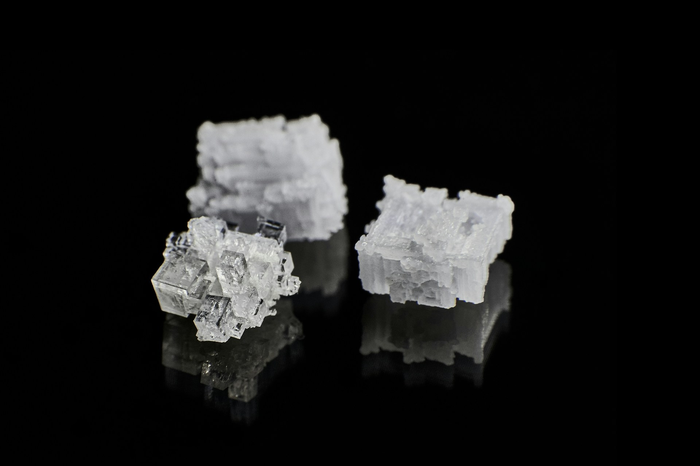

import GemeTerra2CTA from '@site/src/components/GemeTerra2CTA' 
import GemeComposterCTA from '@site/src/components/GemeComposterCTA' 
import RelatedArticles from '@site/src/components/RelatedArticles'
import ReactPlayer from 'react-player'

## One-sentence takeaway

Salt and oil don’t “kill composting.” They shift the biology, and if you cross certain boundaries, the system drifts away from aerobic composting. The fix isn’t magic powder: it’s keeping oxygen, moisture, and structure in range. (Reference: [US EPA](https://www.epa.gov/sustainable-management-food/composting))

### Why it matters in the kitchen

Most “kitchen compost” disappointments start here: leftovers aren’t garden trimmings. Real food includes salt, oil, sauces, and proteins, and those change microbial behavior. When people say “my composting stopped,” what often happened is simpler: oxygen transfer collapsed (too wet / too compact), and the biology shifted toward low-oxygen pathways that smell worse and stabilize slower. 

### Start here (Trust Stack)

Read the 3-minute truth → [**Real Compost vs Dehydrator**](https://www.geme.bio/compare/real-compost-vs-dehydrated-scraps)

[**Browse comparisons** →](https://www.geme.bio/compare)

Methods & boundaries → [**Open GK Verification**](https://www.geme.bio/gk)

[**Shop GEME Terra 2** →](https://www.geme.bio/product/terra2?utm_medium=blog&utm_source=geme_website&utm_campaign=general_seo_content&utm_content=geme-composter-microbes-vs-salt)

<!-- truncate -->

## The biology: microbes don’t quit, they adapt (until conditions stop them)

Composting is, by definition, a **managed aerobic microbial process**: microorganisms need oxygen to decompose organics into a biologically stable soil amendment. (Reference: [US EPA](https://www.epa.gov/sustainable-management-food/composting))

Salt doesn’t act like a “poison switch” at normal culinary levels. It acts more like **environmental pressure**:

- **Osmotic stress** makes water less available to microbes; some microbes slow down, others (more tolerant groups) gain an advantage.
- Ionic effects can change community composition and enzyme activity—i.e., the “who is doing the work” shifts.

In food-waste composting, high salinity has been associated with poorer stabilization and lower degradation efficiency. (Reference: [Springer Nature](https://link.springer.com/article/10.1186/s13765-019-0445-1))

**What this means practically**:

Your system can still compost salty food, but the “safe operating window” gets narrower, and you must protect aerobic conditions more deliberately.

## Oil is not the villain, oxygen loss is

Oil and grease introduce two common problems in small, enclosed composting systems:

1. **Mass transfer barrier**: oil can coat particles and reduce water/air exchange.
2. **Structure collapse**: oily, fine particles compact more easily, reducing pore space.

When oxygen becomes limited, decomposition shifts toward anaerobic behavior, which is a major driver of foul odors. 

This is why “it smells” is often not a moral failure (or a “bad bacteria” problem). It’s a physics + biology problem:

- insufficient aeration
- moisture too high
- structure too dense

👉 [Learn More About GEME Terra II](https://www.geme.bio/product/terra2?utm_medium=blog&utm_source=geme_website&utm_campaign=general_seo_content&utm_content=geme-composter-microbes-vs-salt)

👉 [Explore GEME Pro for Big Households/Plant Shops/Restaurants](https://www.geme.bio/product/geme?utm_medium=blog&utm_source=geme_website&utm_campaign=general_seo_content&utm_content=?utm_medium=blog&utm_source=geme_website&utm_campaign=general_seo_content&utm_content=geme-composter-microbes-vs-salt)

## The boundary (the honest line we won’t cross)

To stay credible, we draw a boundary that a user can actually follow:

### ✅ Typically fine (routine mixed diet)

- lightly seasoned cooked food
- normal amounts of oil from everyday cooking
- mixed scraps with enough fibrous content

### ⚠️ Boundary zone (requires extra structure / pacing)

- very salty items (brined foods, pickles, cured meats)
- oily sauces or “slick” leftovers (heavy dressings, frying oil residues)
- salty broths / soups (high moisture + salt is a double pressure)

### ❌ Not recommended (for compost quality + odor control)

- pouring liquids or free oil into the system
- “all-at-once” loads that are both wet + salty/oily without enough structure

These aren’t arbitrary rules. They’re the simplest way to protect aerobic composting, which depends on oxygen flow and moisture balance. 

## How to keep it aerobic (what actually works)

Think like a composter, not like a blender.

### 1. Protect structure (air needs pathways)

Aerating a compost mass—through turning, airflow, or bulking structure—supports aerobic decomposition. 
Actionable rule: if a load is wetter/oilier than usual, pair it with more fibrous material and avoid compaction.

### 2. Manage moisture (too wet kills oxygen faster than salt does)

Odor intensity is strongly influenced by oxygen levels and moisture extremes; anaerobic decomposition increases unpleasant odors. (Springer Nature)
Actionable rule: aim for “moist, not wet.” If it forms a heavy paste, you’re starving oxygen.

### 3. Don’t panic-dose; adjust conditions first

If performance slows after salty/oily meals, the first response should be:

- reduce extreme inputs for a few cycles
- restore structure and aeration
- let biology rebound

Additives should never be a substitute for oxygen flow and moisture control.

## What we verify (and what we refuse to claim)

**We verify**:

- that the system maintains aerobic conditions under defined input ranges (documented in [GK]((https://www.geme.bio/gk))).
- that odor risk correlates strongly with oxygen/moisture failures, and can be minimized by maintaining aerobic conditions. ([Springer Nature](https://link.springer.com/article/10.1186/s13765-019-0445-1))

**We do not claim**:

- that any composting system can take unlimited brine/grease with no consequences
- that “salt doesn’t matter”
- that odor can be eliminated in all conditions (that’s greenwashing)

## Methods & boundaries → GK (where the proof lives)

In GK, publish the parts that make this auditable without giving away trade secrets:

- your definition of “aerobic stability” and “finished output”
- the input boundary table
- the verification protocol: how you detect oxygen-limited drift, how you confirm recovery
- the “what we didn’t test” list

[**Open GK Verification** →](https://www.geme.bio/gk)

<GemeTerra2CTA 
 imgSrc="/img/geme-terra-2-composter.jpg"
 productTitle="GEME Terra II: Best Kitchen Composter"
 features={[
    "✅ Best Composter With Permanent Filter",
    "✅ Biologically Active Composting System",
    "✅ Quiet, Odour-Free, Real Compost",
    "✅ Zero Filter Costs, No Refills",
    "✅ Reduces Composting Time to Days"
 ]}
buttonText="Get Your GEME Terra II"
  href="https://www.geme.bio/product/terra2?utm_medium=blog&utm_source=geme_website&utm_campaign=general_seo_content&utm_content=geme-composter-microbes-vs-salt"
/>

<GemeComposterCTA 
 imgSrc="/img/geme-bio-composter.jpg"
 productTitle="GEME Pro Composter"
 features={[
    "✅ Best Composter With No Hidden Costs",
    "✅ Produce Soil-Ready Compost For Plant Growth",
    "✅ Quiet, Odor-Free, Quick(6-8 hours)",
    "✅ Large Capacity (19 L) For Daily Waste"
  ]}
buttonText="Get Your GEME Pro"
  href="https://www.geme.bio/product/geme?utm_medium=blog&utm_source=geme_website&utm_campaign=general_seo_content&utm_content=?utm_medium=blog&utm_source=geme_website&utm_campaign=general_seo_content&utm_content=geme-composter-microbes-vs-salt"
/>

## Cited Sources

1. [US EPA: Composting](https://www.epa.gov/sustainable-management-food/composting)

2. [Springer Nature: Effects of food waste compost on the shift of microbial community in water saturated and unsaturated soil condition](https://link.springer.com/article/10.1186/s13765-019-0445-1)

<RelatedArticles
  slugs={[
  "geme-terra-2-the-silent-gearbox",
  "can-i-put-plastic-in-geme-composter",
  "npk-test-compost-output-n50",
  "why-geme-chose-aerobic-digestion-over-grinding",
  "geme-composter-amazon-discount-earth-day-2026",
  "how-we-write-an-engineering-claim-without-turning-it-into-ad-copy",
  "what-an-e5-fault-actually-means-and-what-it-does-not",
  "the-wet-standard-what-living-compost-base-should-actually-feel-like",
  "why-low-average-power-matters-more-than-dramatic-peak-wattage",
  "how-to-avoid-leftover-food-poisoning-fried-rice-syndrome",
  "geme-composter-vs-diy-bokashi-composting",
  "permanent-odor-control-catalyst-path-vs-disposable-carbon",
  "why-the-geme-chassis-is-intentionally-heavier-than-a-typical-countertop-appliance",
  "geme-composter-review-2026-geme-pro",
  "how-to-fertilize-your-plants-in-spring",
  "how-to-plant-tulip-bulbs-in-spring-guide",
  "what-can-you-put-in-electric-composter-meat-dairy-bones",
  "electric-composter-salt-oil-boundaries",
  "advanced-geme-compost-application-guide",
  "countertop-composter-misnomer-floor-standing-electric-composter",
  "top-5-electric-composters-on-amazon-2026",
  "geme-terra-2-pros-and-cons",
  "top-5-kitchen-composters-pros-and-cons",
  "geme-composter-review-2026",
  "best-kitchen-composter-verdict-2026",
  "best-composter-avoid-recurring-fees-geme-terra-2",
  "how-to-compost-cut-flowers-guide",
  "how-long-does-bokashi-take-to-compost",
  "how-to-care-for-hydrangeas-and-change-colors",
  "best-composter-daily-operation-comparison-lomi-mill-reencle-geme",
  "how-long-does-pizza-last-in-fridge-guide",
  "how-to-compost-eggshells-guide-geme",
  "how-to-compost-coffee-grounds-guide",
  "never-buy-carbon-filter-for-your-composter",
  "best-composter-fastest-real-compost-geme-terra-2",
  "how-to-compost-at-home-beginners-guide",
  "how-long-can-chicken-stay-in-the-fridge",
  "how-to-reduce-odor-indoor-composting-tips",
  "how-long-can-ground-beef-stay-in-the-fridge",
  "nyc-composting-fines-2026-geme-terra-2-best-electric-compost",
  "best-indoor-composter-for-apartment-geme-vs-lomi",
  "the-best-composter-for-kitchen",
  "how-to-reduce-food-waste-during-spring-festival",
  "does-reencle-composter-produce-real-compost",
  "does-mill-composter-really-compost",
  "how-to-reduce-food-waste-at-home-2026",
  "free-mcnugget-caviar-raises-food-waste-concerns",
  "composting-in-winter",
  "how-to-compost-at-home",
  "zero-waste-home-kitchen-composter",
  "does-lomi-composter-really-compost",
  "5-best-kitchen-composters-in-2026",
  "best-kitchen-composter-in-2026-geme-terra-2",
  "geme-vs-reencle-composter-2026",
  "geme-vs-mill-composter-2026",
  "best-kitchen-composter-2026",
  "advanced-geme-compost-application-guide",
  "electric-compost-bin-filters-costs-comparison",
  "geme-vs-lomi", 
  "geme-terra-2-debuts",
  "the-best-composter-to-reduce-food-waste",
  "compost-pile-vs-electric-composter",
  "how-to-make-bananas-last-longer",
  "how-long-do-apples-last-in-the-fridge",
  "can-i-compost-moldy-grapes",
  "can-you-compost-moldy-bread",
  ]}
/>

_Ready to transform your gardening game? Subscribe to our [newsletter](http://geme.bio/signup?utm_medium=blog&utm_source=geme_website&utm_campaign=general_seo_content&utm_content=how-to-compost-at-home-beginners-guide) for expert composting tips and sustainable gardening advice._

