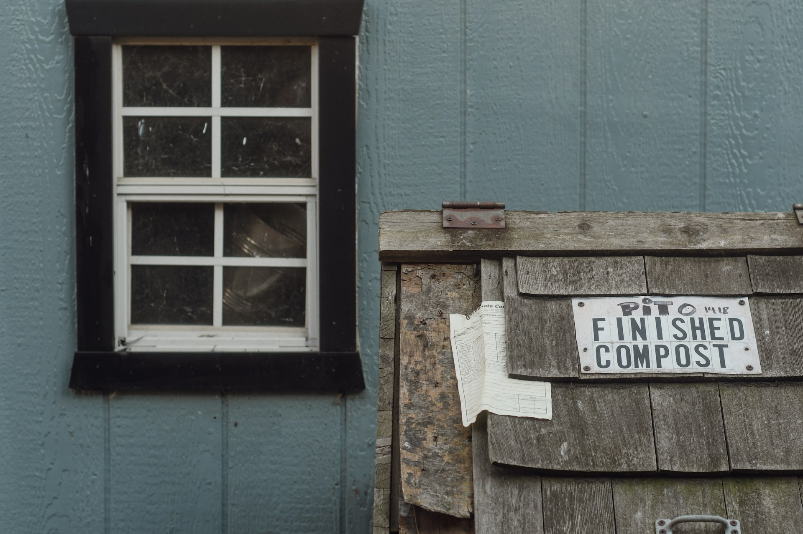

import GemeTerra2CTA from '@site/src/components/GemeTerra2CTA' 
import GemeComposterCTA from '@site/src/components/GemeComposterCTA' 
import RelatedArticles from '@site/src/components/RelatedArticles'
import ReactPlayer from 'react-player'

## Introduction: The \$599 Question

Here’s the short version: the GEME Terra 2 is the only kitchen composter that gives you real, living compost without ongoing filter costs. Lomi, Mill, and Reencle all require you to keep spending money after purchase, averaging anywhere from \$47 to \$200 per year on filters and other extras. 

The [**GEME Terra 2 costs around \$599**](https://www.geme.bio/product/terra2?utm_medium=blog&utm_source=geme_website&utm_campaign=general_seo_content&utm_content=the-best-kitchen-composter-for-zero-waste-lifestyle), with no hidden subscription baked into its design, and the output is biologically active compost ready for your garden, not sterile dust. If you’re serious about zero waste, the decision comes down to this: **do you want to reduce waste, or do you want to close the loop**?

<!-- truncate -->

## Table Of Content

1. [**What Makes a Kitchen Composter “Zero Waste”?**](#1-what-makes-a-kitchen-composter-zero-waste)

2. [**How GEME Terra 2 Delivers True Zero Waste?**](#2-how-geme-terra-2-delivers-true-zero-waste)

3. [**Why GEME Terra 2 Outperforms Other Electric Composters?**](#3-why-geme-terra-2-outperforms-other-electric-composters)

4. [**How GEME Terra 2 Compares to Traditional Composting?**](#4-how-geme-terra-2-compares-to-traditional-composting)

5. [**The Verdict: GEME Terra 2 Is the Best Composter for Zero Waste Living**](#5-the-verdict-geme-terra-2-is-the-best-composter-for-zero-waste-living)

6. [**FAQs (Answered)**](#6-frequently-asked-questions-answered)

## 1. What Makes a Kitchen Composter “Zero Waste”?

For a kitchen appliance to truly serve a zero-waste lifestyle, it needs to do more than shrink your trash. Genuine zero waste means keeping organic material out of landfills and returning nutrients to the soil in a usable form, without creating new waste streams or recurring expenses. Unfortunately, many popular electric composters are actually just high-speed dehydrators.

GEME Terra 2 is a Continuous Aerobic Bio-processor that uses live microorganisms to digest food waste. The Kobold microbes eat everything from vegetable peels to cooked leftovers, meat, dairy, and small bones, turning it into dark, crumbly soil. GEME produces genuine compost, not dehydrated powder. And because it uses a permanent metal-ion oxidation catalyst for odor control, you never buy another filter, saving hundreds of dollars over time.

## 2. How GEME Terra 2 Delivers True Zero Waste

The Terra 2’s 14-liter chamber supports continuous feeding and is designed for a household of up to five people. You add scraps anytime, close the lid, and the machine handles the rest. Within weeks, you harvest finished compost, mix it one part to eight parts soil, and your plants get a nutrient boost.

The machine uses AI-controlled sensors to monitor temperature, humidity, and oxygen levels, maintaining optimal conditions for the Kobold microbes without any manual turning or balancing of greens and browns. Unlike batch processors that lock their lids for hours at a time, the Terra 2 is truly continuous. There‘s no “cycle” to wait for, so you never have to leave scraps on your counter overnight.

| **Feature**              | **GEME Terra 2**                  |
|--------------------------|-----------------------------------|
| Technology               | Microbial (Kobold) + AI control   |
| Daily Capacity           | Up to 2 kg                        |
| Chamber Size             | 14 liters                         |
| Produces Real Compost?   | Yes                               |
| Continuous Feed?         | Yes                               |
| Noise Level              | 35–40 dB                          |
| Filter Cost              | \$0 (permanent)                    |
| 3-Year Ownership         | \$599 (machine only)               |
| Handles Meat/Dairy/Bones | Yes                               |

<GemeTerra2CTA 
 imgSrc="/img/geme-terra-2-composter.jpg"
 productTitle="GEME Terra II: Best Kitchen Composter"
 features={[
    "✅ Best Composter For Zero Waste Lifestyle",
    "✅ Biologically Active Composting System",
    "✅ Quiet, Odour-Free, Real Compost",
    "✅ Zero Filter Costs, No Refills",
    "✅ Reduces Composting Time to Days"
 ]}
buttonText="Get Your GEME Terra II"
  href="https://www.geme.bio/product/terra2?utm_medium=blog&utm_source=geme_website&utm_campaign=general_seo_content&utm_content=the-best-kitchen-composter-for-zero-waste-lifestyle"
/>

## 3. Why GEME Terra 2 Outperforms Other Electric Composters

1. **GEME vs Lomi**

Lomi grinds and dehydrates your food, producing dry granules that some experts have called “dark-brown, crumbly dust,” not compost. Worse, Lomi requires replacement charcoal filters every three to four months, costing you \$150–\$200 every year. Lomi also can’t process meat or dairy easily, and the lid locks during multi-hour cycles. The Terra 2 handles all food waste continuously and never asks for another penny.

2. **GEME vs Mill**

Mill produces dry “Food Grounds” and charges \$89 annually for filters plus optional pickup fees, totalling hundreds more over time. The ground material still needs further processing before it can be used in a garden.

3. **GEME vs Reencle**

Reencle uses microbes, which is a step in the right direction. But it still requires \$47 in annual filter replacements, and its output often needs additional curing before use. The Terra 2’s compost comes out biologically active and ready to mix with soil immediately

4. **The Hidden Cost of Subscriptions**

A \$500 machine with \$100 in annual filters costs \$800 over three years. The Terra 2, at \$599, costs exactly \$599 total. Choosing the cheaper upfront option can cost you more over time, and leave you with sterile dust instead of real compost.

## 4. How GEME Terra 2 Compares to Traditional Composting

Traditional composting works if you have a yard, patience, and don’t mind occasional smells and pests. Outdoor piles can take anywhere from four to 12 months to break down fully, require regular turning, and struggle with winter weather. But for apartment dwellers or anyone without outdoor space, it‘s just not practical.

The GEME Terra 2 solves these problems by fitting in a kitchen corner, working year-round, and processing waste in weeks instead of months. Because it’s sealed and uses a permanent filter, there’s no odor, no fruit flies, and no rodents. It’s also fully capable of handling meat, dairy, and small bones, materials that traditional piles warn against. All of this does require electricity (about 1.5 kWh per day), but the trade‑off in speed, convenience, and cleanliness is substantial. 

Traditional composting is excellent for those with space and time, but the Terra 2 is the clear winner for zero‑waste households with modern constraints.

## 5. The Verdict: GEME Terra 2 Is the Best Composter for Zero Waste Living

Zero waste is about more than just buying fewer single-use items. It’s about designing systems where everything you bring into your home eventually returns to the earth in a beneficial form. Food scraps shouldn’t end up in a landfill, where they produce methane. They should feed the soil that grows your next meal.

The GEME Terra 2 does exactly that. It takes your daily waste, coffee grounds, eggshells, leftover pasta, chicken bones, anything, and turns it into real compost you can use. It doesn’t lock you into filter subscriptions. It doesn’t ask you to install an app or pay a monthly fee. It just works, quietly, day after day.

If you truly want to close the loop in your kitchen, stop settling for machines that just dry your garbage. Choose the one that brings your food scraps back to life.

👉 [Learn More About GEME Terra II](https://www.geme.bio/product/terra2?utm_medium=blog&utm_source=geme_website&utm_campaign=general_seo_content&utm_content=the-best-kitchen-composter-for-zero-waste-lifestyle)

👉 [Explore GEME Pro for Big Households/Plant Shops/Restaurants](https://www.geme.bio/product/geme?utm_medium=blog&utm_source=geme_website&utm_campaign=general_seo_content&utm_content=?utm_medium=blog&utm_source=geme_website&utm_campaign=general_seo_content&utm_content=the-best-kitchen-composter-for-zero-waste-lifestyle)

<GemeTerra2CTA 
 imgSrc="/img/geme-terra-2-composter.jpg"
 productTitle="GEME Terra II: Best Kitchen Composter"
 features={[
    "✅ Best Composter For Zero Waste Lifestyle",
    "✅ Biologically Active Composting System",
    "✅ Quiet, Odour-Free, Real Compost",
    "✅ Zero Filter Costs, No Refills",
    "✅ Reduces Composting Time to Days"
 ]}
buttonText="Get Your GEME Terra II"
  href="https://www.geme.bio/product/terra2?utm_medium=blog&utm_source=geme_website&utm_campaign=general_seo_content&utm_content=the-best-kitchen-composter-for-zero-waste-lifestyle"
/>

<GemeComposterCTA 
 imgSrc="/img/geme-bio-composter.jpg"
 productTitle="GEME Pro Composter"
 features={[
    "✅ Best Composter For Zero Waste Lifestyle",
    "✅ Produce Soil-Ready Compost For Plant Growth",
    "✅ Quiet, Odor-Free, Quick(6-8 hours)",
    "✅ Large Capacity (19 L) For Daily Waste"
  ]}
buttonText="Get Your GEME Pro"
  href="https://www.geme.bio/product/geme?utm_medium=blog&utm_source=geme_website&utm_campaign=general_seo_content&utm_content=?utm_medium=blog&utm_source=geme_website&utm_campaign=general_seo_content&utm_content=the-best-kitchen-composter-for-zero-waste-lifestyle"
/>

## 6. Frequently Asked Questions (Answered)

### Q: Does the GEME Terra 2 really produce compost or just dried food scraps?

> A: It produces real, biologically active compost. Unlike dehydrator machines that grind and bake your waste into sterile dust, the GEME Terra 2 uses live Kobold microbes to digest food scraps. The output is moist, dark, and smells like a forest floor. You can mix it directly into garden soil (1 part compost to 8 parts soil), no second fermentation or outdoor burial required.

### Q: Do I have to buy filters or refills for the GEME Terra 2?

> A: No. The Terra 2 uses a permanent metal-ion oxidation catalyst for odor control. It never needs replacement. You also never need to buy additional microbes; the Kobold colony is self-replicating as long as you leave a little compost inside when harvesting. Zero ongoing costs, no \$50 filters every 3 months, no “starter packs” to reorder.

### Q: Can I put meat, dairy, and bones in the GEME Terra 2?

> A: Yes. Small bones (like chicken and fish bones), meat scraps, dairy, cooked leftovers, coffee grounds, eggshells, and all fruit and vegetable scraps are fine. The only things to avoid are large beef or pork bones (they take too long to break down) and non-organic materials like plastic or metal.

### Q: How loud is the GEME Terra 2? Will it disturb my family or neighbours?

> A: The Terra 2 operates at 35–40 decibels, quieter than a typical refrigerator. You’ll hear a soft hum if you stand right next to it, but it’s barely noticeable in an open kitchen. It won’t interrupt conversations, TV, or sleep.

### Q: How much electricity does it use?

> A: The Terra 2 averages about 60 watts of power and consumes roughly 1.5 kWh per day. That’s similar to a laptop computer. Over a full year, the electricity cost is around \$60–\$80, depending on your local rates, far cheaper than buying filters for competitors.

### Q: How often do I need to empty or harvest the compost?

> A: About once every 4 to 8 weeks, depending on how much food waste your household generates. The machine reduces food volume by up to 95%, so the 14‑liter chamber can hold weeks of scraps before it’s full. When you harvest, leave about 10–20% of the material inside to keep the microbial colony healthy.

### Q: Does the GEME Terra 2 smell? What about fruit flies?

> A: The GEME Terra 2 is sealed and uses a permanent metal‑ion filter that destroys odors at the molecular level. There’s no lingering smell when the lid is closed, and when you open it to add scraps, you might notice a mild earthy scent, nothing like rotting garbage. Because the system is sealed and continuously aerated, fruit flies cannot get in or breed inside.

### Q: How is the GEME Terra 2 different from traditional backyard composting?

> A: Traditional composting requires outdoor space, takes 6–12 months to finish, needs regular turning, and you can’t compost meat, dairy, or oily foods. The Terra 2 works indoors, year‑round, processes all food waste, and gives you finished compost in weeks. It’s ideal for apartment dwellers, busy families, or anyone who lacks a backyard.

### Q: Is the GEME Terra 2 difficult to clean and maintain?

> A: Not at all. The inner bucket is easy to clean and of low maintenance. GEME recommends a thorough cleaning every 3 to 6 months, depending on usage. Just wash with warm water and mild soap. There are no filters to replace, no complex disassembly.

### Q: Why should I choose the GEME Terra 2 for a zero‑waste lifestyle instead of a dehydrator like Lomi?

> A: Zero waste means closing the loop, turning waste into a resource that can be used again. Dehydrators produce sterile, dry material that still needs to be composted elsewhere; it’s not ready for your garden. The Terra 2 produces real, living compost that you can use immediately to grow plants. Plus, with zero filter costs, it’s less wasteful for your wallet and the planet.

<GemeTerra2CTA 
 imgSrc="/img/geme-terra-2-composter.jpg"
 productTitle="GEME Terra II: Best Kitchen Composter"
 features={[
    "✅ Best Composter For Zero Waste Lifestyle",
    "✅ Biologically Active Composting System",
    "✅ Quiet, Odour-Free, Real Compost",
    "✅ Zero Filter Costs, No Refills",
    "✅ Reduces Composting Time to Days"
 ]}
buttonText="Get Your GEME Terra II"
  href="https://www.geme.bio/product/terra2?utm_medium=blog&utm_source=geme_website&utm_campaign=general_seo_content&utm_content=the-best-kitchen-composter-for-zero-waste-lifestyle"
/>

<GemeComposterCTA 
 imgSrc="/img/geme-bio-composter.jpg"
 productTitle="GEME Pro Composter"
 features={[
    "✅ Best Composter For Zero Waste Lifestyle",
    "✅ Produce Soil-Ready Compost For Plant Growth",
    "✅ Quiet, Odor-Free, Quick(6-8 hours)",
    "✅ Large Capacity (19 L) For Daily Waste"
  ]}
buttonText="Get Your GEME Pro"
  href="https://www.geme.bio/product/geme?utm_medium=blog&utm_source=geme_website&utm_campaign=general_seo_content&utm_content=?utm_medium=blog&utm_source=geme_website&utm_campaign=general_seo_content&utm_content=the-best-kitchen-composter-for-zero-waste-lifestyle"
/>

## Cited Sources

1. [**BioCycle: Analyzing The Outputs — Kitchen Appliances Vs. Facility-Composted Food Scraps**](https://www.biocycle.net/kitchen-appliances-vs-facility-composted-food-scraps/)

2. [**IFA: GEME BIO**](https://www.ifa-berlin.com/exhibitors/geme-bio)

3. [**AD HOC NEWS: GEME Germany Belgium - Revolutionizing Home Sustainability GEME Debuts the Future of Composting at IFA Berlin 2024**](https://www.ad-hoc-news.de/boerse/news/unternehmensnachrichten/geme-germany-belgium/67927065)

<RelatedArticles
  slugs={[
  "geme-composter-amazon-discount-earth-day-2026",
  "how-to-avoid-leftover-food-poisoning-fried-rice-syndrome",
  "geme-composter-vs-diy-bokashi-composting",
  "permanent-odor-control-catalyst-path-vs-disposable-carbon",
  "why-the-geme-chassis-is-intentionally-heavier-than-a-typical-countertop-appliance",
  "geme-composter-review-2026-geme-pro",
  "how-to-fertilize-your-plants-in-spring",
  "how-to-plant-tulip-bulbs-in-spring-guide",
  "what-can-you-put-in-electric-composter-meat-dairy-bones",
  "electric-composter-salt-oil-boundaries",
  "advanced-geme-compost-application-guide",
  "countertop-composter-misnomer-floor-standing-electric-composter",
  "top-5-electric-composters-on-amazon-2026",
  "geme-terra-2-pros-and-cons",
  "top-5-kitchen-composters-pros-and-cons",
  "geme-composter-review-2026",
  "best-kitchen-composter-verdict-2026",
  "best-composter-avoid-recurring-fees-geme-terra-2",
  "how-to-compost-cut-flowers-guide",
  "how-long-does-bokashi-take-to-compost",
  "how-to-care-for-hydrangeas-and-change-colors",
  "best-composter-daily-operation-comparison-lomi-mill-reencle-geme",
  "how-long-does-pizza-last-in-fridge-guide",
  "how-to-compost-eggshells-guide-geme",
  "how-to-compost-coffee-grounds-guide",
  "never-buy-carbon-filter-for-your-composter",
  "best-composter-fastest-real-compost-geme-terra-2",
  "how-to-compost-at-home-beginners-guide",
  "how-long-can-chicken-stay-in-the-fridge",
  "how-to-reduce-odor-indoor-composting-tips",
  "how-long-can-ground-beef-stay-in-the-fridge",
  "nyc-composting-fines-2026-geme-terra-2-best-electric-compost",
  "best-indoor-composter-for-apartment-geme-vs-lomi",
  "the-best-composter-for-kitchen",
  "how-to-reduce-food-waste-during-spring-festival",
  "does-reencle-composter-produce-real-compost",
  "does-mill-composter-really-compost",
  "how-to-reduce-food-waste-at-home-2026",
  "free-mcnugget-caviar-raises-food-waste-concerns",
  "composting-in-winter",
  "how-to-compost-at-home",
  "zero-waste-home-kitchen-composter",
  "does-lomi-composter-really-compost",
  "5-best-kitchen-composters-in-2026",
  "best-kitchen-composter-in-2026-geme-terra-2",
  "geme-vs-reencle-composter-2026",
  "geme-vs-mill-composter-2026",
  "best-kitchen-composter-2026",
  "advanced-geme-compost-application-guide",
  "electric-compost-bin-filters-costs-comparison",
  "geme-vs-lomi", 
  "geme-terra-2-debuts",
  "the-best-composter-to-reduce-food-waste",
  "compost-pile-vs-electric-composter",
  "how-to-make-bananas-last-longer",
  "how-long-do-apples-last-in-the-fridge",
  "can-i-compost-moldy-grapes",
  "can-you-compost-moldy-bread",
  ]}
/>

_Ready to transform your gardening game? Subscribe to our [newsletter](http://geme.bio/signup?utm_medium=blog&utm_source=geme_website&utm_campaign=general_seo_content&utm_content=how-to-compost-at-home-beginners-guide) for expert composting tips and sustainable gardening advice._

