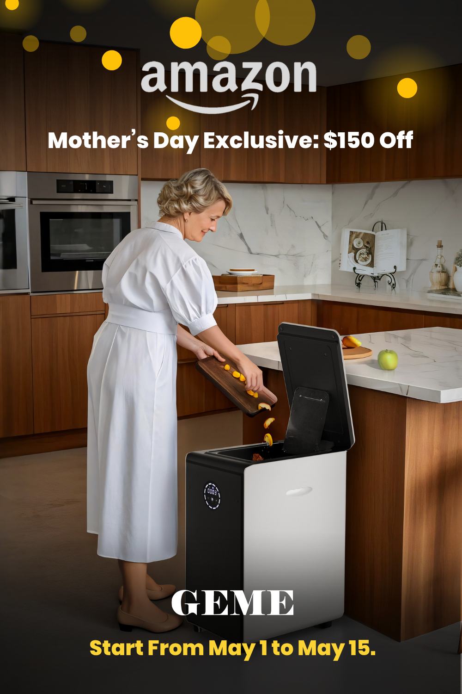

import GemeTerra2CTA from '@site/src/components/GemeTerra2CTA' 
import GemeComposterCTA from '@site/src/components/GemeComposterCTA' 
import RelatedArticles from '@site/src/components/RelatedArticles'
import ReactPlayer from 'react-player'

## 🎁 Mother's Day Exclusive: Save $150 on Amazon

This Mother's Day, give her the gift of time and a break from the daily dirty work. The GEME Electric Composter turns every bit of food scrap into real, nutrient‑dense organic compost, with no smell, no mess and no filter replacements to worry about.

| **Region**                        | **Discount**            | **Promo Code**   | **Active Dates**              |
|-------------------------------|---------------------|--------------|--------------------------|
| North America (US & Canada)   | $150 off            | **Coming Soon**  | May 1 – May 15, 2026     |
| Europe (UK, Germany & EU)     | €150 (≈£130) off    | **Coming Soon**  | May 1 – May 15, 2026     |

👉 Shop GEME on Amazon before Mother's Day (discount codes activate on May 1):

🇺🇸 United States · 🇨🇦 Canada · 🇬🇧 United Kingdom · 🇩🇪 Germany & EU

<!-- truncate -->

## 1. Why Moms Love GEME

Instead of flowers that wilt in a week, give her the gift of less work, a clean, quiet kitchen companion that runs 24/7.

### 🟢 Real Compost, Not Dehydrated Dust

Many other electric "composters" are actually dehydrators that bake and grind scraps into sterile powder. **GEME is the first Bio Smart Electric Composter; it uses microbial degradation technology to truly break down waste into real, organic compost, not a dehydrated imitation**. The result is rich, nutrient‑dense compost that’s ready to feed her garden straight away.

### 🟢 Zero Filter Replacements, Ever

Most electric composters rely on charcoal filters that cost \$150 to \$200 a year to replace. **GEME uses a permanently built‑in metal‑ion filter that lasts the lifetime of the machine and requires absolutely no changes**. That means no hidden costs, no subscriptions, no "filter is full" reminders.

### 🟢 No Smell, No Fruit Flies, No Mess

**GEME's built‑in industrial‑grade deodorization system completely neutralizes odors**. It's sealed, so fruit flies can't get in. And because it uses microbial fermentation instead of grinding or high‑heat dehydration, there's no loud motor noise (35–40 dB, quieter than a refrigerator) and no sticky residue to scrape off.

### 🟢 Handles Almost Everything: Meat, Dairy, Bones, Leftovers

Mom doesn't have to sort her scraps. **GEME takes almost everything: fruit and vegetables, meat scraps, fish bones, eggs and eggshells, coffee grounds, leftovers, plate scrapings, even paper and yard trimmings**. No portioning out "greens" and "browns". No worrying about attracting pests.

### 🟢 19L Large Capacity, Harvest Once a Month

With a 19‑liter chamber and a daily processing capacity **up to 5 kg (11 lbs) of food waste**, **GEME reduces waste volume by 95%**. Mom only needs to scoop out compost once every 1–2 months, not every morning.

### 🟢 Whisper Quiet & Energy Efficient

GEME uses Microbial Degradation Technology (no grinding blades), so it **runs in near silence**. **Power consumption is comparable to that of a laptop computer**. She won't hear it, and her electricity bill won't jump.

### 🟢 Add Waste Anytime, No Locked Lids

Batch‑mode composters lock their lids for hours at a time. **GEME is a continuous feed**. Mom can open the lid, drop in scraps, and close it. Any time. No buttons to push, no cycles to wait for.

## 2. The GEME Composter Spec Table That Tells You Everything

| **Feature**                | **GEME Electric Composter**                                       |
|----------------------------|-------------------------------------------------------------------|
| **Capacity**               | 19 Liters                                                         |
| **Daily Capacity**         | Up to 5 kg (11 lbs)                                               |
| **Conversion Time**        | 6–8 hours to break down soft food waste                           |
| **Waste Reduction**        | 95% (turns into 5% organic compost)                               |
| **Noise Level**            | 35–40 dB (quieter than a refrigerator)                            |
| **Filter**                 | Permanent built-in (no replacement ever)                          |
| **Annual Filter Cost**     | $0                                                                |
| **Odor**                   | Industrial-grade deodorization, odorless                          |
| **Operation**              | Continuous feed (add anytime, no locked lids)                     |
| **Power Use**              | Runs on 120–240V, energy efficient like a laptop                  |
| **What It Can Compost**    | Fruit & veg, meat, fish bones, eggshells, coffee grounds,         |
|                            | leftovers, plate scrapings, paper                                 |
| **What Kind of Compost**   | ✅ Real, nutrient-dense, microbial     |
|                            | organic compost                                                   |
| **Best For**               | Families of 4+ people who cook daily                              |
| **Mother‘s Day Price**     | $150 / €150 OFF (code active May 1 – May 15)                      |
| **Amazon Links**           | 🇺🇸 US · 🇨🇦 Canada · 🇬🇧 UK · 🇩🇪 Germany                           |

## 3. The Hidden Cost of Other "Composters" 

Here's the trap. A \$500 machine seems affordable at checkout. Then the emails start arriving: "Time to replace your filter." Three months later: another \$50. **Over three years, filter costs for other popular brands stack up fast**.

In fact, research shows that a \$500 electric composter can end up costing you another \$500 in filters before you've owned it for three years. **GEME's permanent built‑in filter eliminates that entire category of expense**. **What you see on Amazon is what you pay, no subscriptions, no surprises**.

And unlike dehydrators that produce sterile, dried "dirt", **GEME delivers real, living compost that actually feeds soil microbes**. Other brands call their output "compost"; soil scientists call it "pre‑compost". GEME's microbial process is the genuine article, the same natural decomposition nature uses, just accelerated to 6–8 hours for soft food waste.

## 4. Mother's Day 2026: The Season of Practical, Thoughtful Giving

Mother's Day 2026 is projected to be a record‑breaker. The National Retail Federation estimates total U.S. spending will reach \$38 billion, with consumers planning to spend an average of \$284.25 per person, the highest in the survey's history.

But here's the interesting part: quality (51%) and personalization (22%) consistently rank higher than price (18%) alone as top drivers of gift choice. Moms crave gifts that are practical, thoughtful and actually make their daily lives easier. Electronics are also a standout category this year, with expected spending surpassing \$4 billion for the first time.

That's precisely why GEME works as a Mother's Day gift. It's not another appliance that sits on the counter; **it solves a real problem: the daily grind of dealing with stinky, leaky, fly‑ridden food waste**. It's a gift of time saved and stress removed.

## 5. How Much Does Mom Save with GEME?

Let's do math.

| **Expense**                                 | **Without GEME**                                   | **With GEME**                      |
|---------------------------------------------|----------------------------------------------------|-------------------------------------|
| Annual filter replacements (other brands)   | \$150–\$200                                          | \$0                                  |
| Daily time spent dealing with food waste    | 5–10 minutes of scraping, bagging, holding breath  | 30 seconds (and no smell)           |
| Mess to clean up                            | Sticky leaks, fruit flies, smelly bins             | Nothing, sealed system              |
| Compost for her garden                      | Bagged fertilizer ($50+/year)                      | Free, from her own kitchen          |

*[One reviewer summed it up](https://www.amazon.ca/dp/B0BV31KTCN/ref=sspa_dk_detail_0?psc=1&pd_rd_i=B0BV31KTCN&pd_rd_w=M37CD&content-id=amzn1.sym.516c2169-755e-413a-a38a-68230f4ab66f&pf_rd_p=516c2169-755e-413a-a38a-68230f4ab66f&pf_rd_r=JPSN99W996F4PBA6RW3D&pd_rd_wg=zSiRy&pd_rd_r=dfcff810-d187-4505-9d46-23b8895a8dea&s=kitchen&sp_csd=d2lkZ2V0TmFtZT1zcF9kZXRhaWw) perfectly: "I haven't used my regular trash can in weeks. No smelly trash. No leaks. And I'm saving money because my trash bill has dropped."*

👉 [Explore GEME Pro for Big Households/Plant Shops/Restaurants](https://www.geme.bio/product/geme?utm_medium=blog&utm_source=geme_website&utm_campaign=general_seo_content&utm_content=?utm_medium=blog&utm_source=geme_website&utm_campaign=general_seo_content&utm_content=the-best-kitchen-composter-for-zero-waste-lifestyle)

## 6. 🎁 The Gift Mom Actually Wants (But Would Never Ask For)

Think about what Mom does every single day. She scrapes plates. She ties up trash bags. She holds her breath every time she opens the kitchen bin. She makes extra trips to the outdoor bin to keep smells down.

What if all of that just … stopped?

With GEME, she lifts the lid, adds the scraps, and closes it. No smell. No flies. No trash bags. No holding her breath. And every few weeks, she gets rich, organic compost for her garden, made entirely from her own family's leftovers.

**This Mother's Day, let GEME handle the dirty work. Let Mom put her feet up instead.**

## 7. 🛒 Get \$150 OFF Before Mother's Day

| **Region**                        | **Discount**        | **Promo Code**   | **Status**                     |
|-------------------------------|-----------------|-------------|----------------------------|
| North America (US & Canada)   | $150 USD off    | **Coming Soon**  | Active May 1–15, 2026      |
| Europe (UK, Germany & EU)     | €150 EUR off    | **Coming Soon**  | Active May 1–15, 2026      |

👉 Bookmark this page, the codes arrive on **May 1**.

🇺🇸 Amazon US · 🇨🇦 Amazon CA · 🇬🇧 Amazon UK · 🇩🇪 Amazon DE

## 8. Frequently Asked Questions (Answered)

### Q: Is GEME Composter the same as a dehydrator?

> A: No. Dehydrators use heat and grinding to dry waste into sterile powder. GEME uses microbial degradation, live microorganisms break down waste biologically, just like nature does, but in 6–8 hours instead of months. The result is real, living organic compost.

### Q: Do I need to buy filters for GEME Composter?

> A: Never. GEME uses a permanently built‑in metal‑ion filter that lasts the lifetime of the machine.

### Q: Can GEME Composter handle meat and bones?

> A: Yes. Meat scraps, fish bones, eggshells, dairy, coffee grounds, plate leftovers, it all goes in. The only things to avoid are large beef or pork bones (they take too long to break down) and non-organic materials like plastic or metal.

### Q: Does GEME Composter smell?

> A: No. The built‑in industrial‑grade deodorization system completely neutralizes odors.

### Q: How often does Mom need to empty it?

> A: She only harvests compost once every 4–8 weeks. The 19‑liter chamber and 95% waste reduction mean very little hands‑on time. However, she doesn't have to fully empty the chamber. When harvest, leave about 10–20% of the material inside to keep the microbial colony healthy. Learn more from this post: [**Why you should not fully empty the GEME Composter chamber every time?**](https://www.geme.bio/blog/why-you-should-not-fully-empty-the-chamber-every-time)

### Q: Does she need to turn or balance the waste?

> A: No. GEME handles the biological process automatically. No "greens vs browns" ratio, no pile turning, no monitoring moisture.

### Q: What happens at the end of the cycle?

> A: She opens the lid, scoops out dark, crumbly, earthy‑smelling compost, ready to be mixed into garden soil for strong, healthy plants.

### Q: What if she lives in an apartment?

> A: GEME is designed for indoor use, floor‑standing, quiet, odorless. Zero is needed for a yard or outdoor space.

## Cited Sources

1. [**Amazon.com: GEME Smart 19L Electric Composter product listing**](https://amazon.com/)
2. [**WTOP News: GEME Zero Waste Smart Composter reduces compost production from months to hours**](https://wtop.com/tech/2025/01/geme-zero-waste-smart-composter-reduces-compost-production-time-from-months-to-hours/)
3. [**GEME Official Blog: The Best Electric Kitchen Composter of 2026**](https://www.geme.bio/blog/best-kitchen-composter-2026)
4. [**Optimove: 2026 Mother’s Day Shopping Report**](https://www.globenewswire.com/de/news-release/2026/04/26/3281235/0/en/optimove-insights-nearly-half-of-mother-s-day-shoppers-use-ai-tools-and-64-are-open-to-buying-from-a-brand-they-have-never-tried.html)
5. [**National Retail Federation (NRF): Mother’s Day 2026 spending forecast**](https://nationaljeweler.com/articles/14908-mother-s-day-2026-jewelry-spending-to-top-7b-nrf-says)
6. [**eMarketer: Mother’s Day 2026 consumer trends**](https://www.emarketer.com/content/price-ai-driving-mother-s-day-shoppers-spend-more-this-holiday)

<RelatedArticles
  slugs={[
  "best-home-composter-for-apartment-geme-vs-lomi",
  "the-best-kitchen-composter-for-zero-waste-lifestyle",
  "geme-terra-2-the-silent-gearbox",
  "geme-composter-amazon-discount-earth-day-2026",
  "how-to-avoid-leftover-food-poisoning-fried-rice-syndrome",
  "geme-composter-vs-diy-bokashi-composting",
  "permanent-odor-control-catalyst-path-vs-disposable-carbon",
  "why-the-geme-chassis-is-intentionally-heavier-than-a-typical-countertop-appliance",
  "geme-composter-review-2026-geme-pro",
  "how-to-fertilize-your-plants-in-spring",
  "how-to-plant-tulip-bulbs-in-spring-guide",
  "what-can-you-put-in-electric-composter-meat-dairy-bones",
  "electric-composter-salt-oil-boundaries",
  "advanced-geme-compost-application-guide",
  "countertop-composter-misnomer-floor-standing-electric-composter",
  "top-5-electric-composters-on-amazon-2026",
  "geme-terra-2-pros-and-cons",
  "top-5-kitchen-composters-pros-and-cons",
  "geme-composter-review-2026",
  "best-kitchen-composter-verdict-2026",
  "best-composter-avoid-recurring-fees-geme-terra-2",
  "how-to-compost-cut-flowers-guide",
  "how-long-does-bokashi-take-to-compost",
  "how-to-care-for-hydrangeas-and-change-colors",
  "best-composter-daily-operation-comparison-lomi-mill-reencle-geme",
  "how-long-does-pizza-last-in-fridge-guide",
  "how-to-compost-eggshells-guide-geme",
  "how-to-compost-coffee-grounds-guide",
  "never-buy-carbon-filter-for-your-composter",
  "best-composter-fastest-real-compost-geme-terra-2",
  "how-to-compost-at-home-beginners-guide",
  "how-long-can-chicken-stay-in-the-fridge",
  "how-to-reduce-odor-indoor-composting-tips",
  "how-long-can-ground-beef-stay-in-the-fridge",
  "nyc-composting-fines-2026-geme-terra-2-best-electric-compost",
  "best-indoor-composter-for-apartment-geme-vs-lomi",
  "the-best-composter-for-kitchen",
  "how-to-reduce-food-waste-during-spring-festival",
  "does-reencle-composter-produce-real-compost",
  "does-mill-composter-really-compost",
  "how-to-reduce-food-waste-at-home-2026",
  "free-mcnugget-caviar-raises-food-waste-concerns",
  "composting-in-winter",
  "how-to-compost-at-home",
  "zero-waste-home-kitchen-composter",
  "does-lomi-composter-really-compost",
  "5-best-kitchen-composters-in-2026",
  "best-kitchen-composter-in-2026-geme-terra-2",
  "geme-vs-reencle-composter-2026",
  "geme-vs-mill-composter-2026",
  "best-kitchen-composter-2026",
  "advanced-geme-compost-application-guide",
  "electric-compost-bin-filters-costs-comparison",
  "geme-vs-lomi", 
  "geme-terra-2-debuts",
  "the-best-composter-to-reduce-food-waste",
  "compost-pile-vs-electric-composter",
  "how-to-make-bananas-last-longer",
  "how-long-do-apples-last-in-the-fridge",
  "can-i-compost-moldy-grapes",
  "can-you-compost-moldy-bread",
  ]}
/>

_Ready to transform your gardening game? Subscribe to our [newsletter](http://geme.bio/signup?utm_medium=blog&utm_source=geme_website&utm_campaign=general_seo_content&utm_content=how-to-compost-at-home-beginners-guide) for expert composting tips and sustainable gardening advice._

