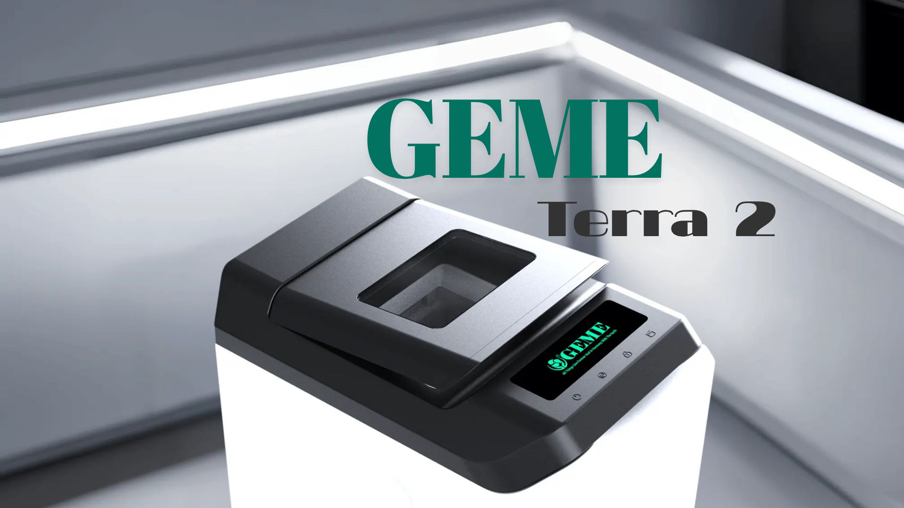

import GemeTerra2CTA from '@site/src/components/GemeTerra2CTA' 
import GemeComposterCTA from '@site/src/components/GemeComposterCTA' 
import RelatedArticles from '@site/src/components/RelatedArticles'
import ReactPlayer from 'react-player'

## Introduction

- **Mill is not a composter**, **it's an electric food dehydrator** that heats and grinds kitchen scraps into a dry byproduct it calls ["**Food Grounds**"](https://www.goodhousekeeping.com/appliances/a65782961/mill-food-recycler-review/).
- **GEME Terra II** is the only model in this comparison that [**produces a real, biologically active compost base**](https://www.geme.bio/blog/5-best-kitchen-composters-in-2026) through AI-managed thermophilic microorganisms that fully decompose food waste.

Both Mill and GEME Terra II sit prominently in the "best composter" conversation, yet they represent entirely different philosophies: **one dehydrates, the other biologically digests**. That distinction shapes everything: **upfront price, ongoing costs, final output, and real-world usability**.

This guide focuses specifically on Mill vs. GEME Terra II, breaking down what each machine actually does, what it costs to buy and to own, and which one earns the title of the best electric kitchen composter for different types of households.

### Quick Comparison Table: Mill Composter V.S GEME Terra II

| **Feature**                | **Mill Food Recycler**                                       | **GEME Terra II**                           |
|---------------------------|-------------------------------------------------------------|----------------------------------------------|
| **Category**                  | Food dehydrator + grinder                                   | True electric composter                      |
| **Technology**                | Heating + grinding                                          | AI-managed microbial fermentation            |
| **Produces Real Compost?**    | ❌ [No, dehydrated "Food Grounds"](https://www.mill.com/lp/mill-vs-composter)                            | ✅ Yes, biologically active compost          |
| **Upfront Price**             | \$999 (or rent \$33–\$45/month)                               | \$599                                        |
| **Ongoing Annual Cost**       | \$396+ (subscription) or ~\$89+ (filters + optional pickups)  | \$0, permanent metal-ion catalyst system      |
| **Noise Level**               | ~45 dB (quiet air purifier level)                           | 35–40 dB                                    |
| **Capacity / Size**           | 6.5L bucket; floor standing                                 | 14L chamber; floor standing       |

<!-- truncate -->

## Table Of Content

1. [**Mill V.S GEME Terra 2 Hardware Comparison**](#1-mill-vs-geme-terra-2-hardware-comparison-design-noise--daily-handling)

2. [**Core Technology: Dehydration V.S Real Composting**](#2-core-technology-dehydration-vs-real-composting-this-changes-everything)

3. [**Mill V.S GEME: What Each Machine Produces?**](#3-what-each-machine-produces-and-how-to-use-it)

4. [**Mill Composter V.S GEME Terra 2 Cost Breakdown**](#4-mill-composter-vs-geme-terra-2-cost-breakdown-the-hidden-1000-trap)

5. [**Mill V.S GEME Terra 2: Performance & User Experience**](#5-performance--user-experience-real-user-feedback)

6. [**Mill Composter V.S GEME Terra II: Environmental Imapct**](#6-environmental-impact-two-paths-to-reducing-food-waste)

7. [**Final Verdict: The Best Electric Kitchen Composter**](#7-final-verdict-best-electric-kitchen-composter)

8. [**Frequently Asked Questions (Answered)**](#8-frequently-asked-questions-answered)

## 1. Mill V.S GEME Terra 2 Hardware Comparison: Design, Noise & Daily Handling

### Design & Footprint

**The Mill Composter looks like a sleek, modern kitchen trash can**. Its floor-standing design requires dedicated floorspace, "the size of a large kitchen garbage container," as [one reviewer noted](https://www.popularmechanics.com/home/a70842771/mill-electric-food-recycler-review/). A foot pedal opens the lid, and an LED display keeps things simple. The matte white, stainless steel, or black finishes make it genuinely attractive for design-conscious kitchens.

**The GEME Terra II sits on the kitchen floor with a compact footprint**, occupying far less visual real estate. The chamber is built into a self-contained unit rather than disguised as household furniture. A "kick" panel on the bottom front opens the lid, no bending to press a pedal. The design is simple and functional, though arguably less of a "statement piece" than Mill.

### Noise

The Mill Composter runs at **approximately 45 dB**, comparable to an air purifier. Most users schedule it to run overnight, and multiple reviews confirm they "barely hear it" even when in the same room.

GEME Terra II operates quieter still: **approximately 35–40 dB**, similar to the sound of light rain outside a window. This is the quietest unit among all premium smart composters on the market in 2026. [Users consistently report that it "won't disrupt your daily routine" at all](https://www.geme.bio/blog/geme-terra-2-the-silent-gearbox).

Noise Winner: **GEME Terra II. Both are quiet, but GEME Terra II is notably quieter**.

### Daily Handling: Loading, Upkeep & Real-World Ease

#### Loading & Operation

Both machines aim for minimal daily friction. 

The Mill’s foot-pedal lid and generous **6.5-liter** bucket mean you can toss in scraps on the go and only empty the bucket roughly once a month. It operates on a set schedule (often overnight), so for most households, daily interaction is just lifting the lid, dumping the day’s scraps, and walking away. 

GEME Terra II uses a “kick” panel to open the lid, drops scraps into a spacious **14-liter chamber**, and can **handle up to 2,000 grams of mixed food waste per day**. Its composting cycle runs continuously in the background, simply add scraps anytime, and the machine manages the microbial process without needing you to start a cycle manually.

#### Cleaning & Maintenance

Mill’s stainless steel bucket and grinding paddles are dishwasher-safe, which makes deep cleaning straightforward. However, because it grinds dried scraps, some users report sticky residues and occasional blade jams that **require manual clear-out**. **The carbon filter needs periodic replacement (a recurring cost and a recurring chore)**. 

GEME Terra II, in contrast, has no blades, only a slow-turning mixing shaft. When a batch of compost is ready, you simply scoop it out of the chamber directly. Although the chamber is not removable, a quick wipe can easily keep it clean. Because the metal-ion catalyst is permanent and there are no grinding mechanisms or replaceable filters, maintenance is minimal: **scoop out the compost, wipe down the inside of the chamber as needed, and you’re done**. **No filter swaps, no blade jams, no heavy parts to haul to the sink**. 

#### Odor in Daily Use

Odor control is a make-or-break factor in electric food composters. 

Mill relies on sealed operation plus an activated **carbon filter** to trap smells, and reviewers broadly agree that during normal use, you "don’t smell a thing." If the filter saturates, however, you’ll notice a change, hence the recommended replacement schedule. 

GEME Terra II’s aerobic microbial process and **metal-ion catalyst** neutralize odors at the source; multiple long-term reviews report zero detectable smell even when processing onion skins, fish, and meat. There’s no filter to go stale or forget to change, which makes daily odor management effectively care-free.

#### Daily Handling Winner: Tie, with an edge to GEME Terra II

**GEME Terra II** wins on zero filter chores, jam-free operation, and no recurring maintenance costs, making it the truly “**Add & Forget**” machine once you’ve settled into a simple daily drop-and-go routine.

<GemeTerra2CTA 
 imgSrc="/img/geme-terra-2-composter.jpg"
 productTitle="GEME Terra II: Best Kitchen Composter"
 features={[
    "✅ Best Composter With No Hidden Costs",
    "✅ Biologically Active Composting System",
    "✅ Quiet, Odour-Free, Real Compost",
    "✅ Zero Filter Costs, No Refills",
    "✅ Reduces Composting Time to Days"
 ]}
buttonText="Get Your GEME Terra II"
  href="https://www.geme.bio/product/terra2?utm_medium=blog&utm_source=geme_website&utm_campaign=general_seo_content&utm_content=the-best-electric-kitchen-composter-mill-composter-vs-geme-terra-2"
/>

## 2. Core Technology: Dehydration V.S Real Composting (This Changes Everything)

If you take away one thing from this comparison, make it this: [**Mill does not make compost**](https://reencle.co/blogs/news/reencle-vs-mill-composter-2026). Neither does Lomi. Neither does the Vitamix FoodCycler. These are all electric dehydrators that use heat to remove moisture from food scraps, then grind them into a dry powder.

GEME Terra II uses a fundamentally different process: **biological microbial decomposition**. Think of it less like a food processor and more like a miniature, AI-managed compost pile that lives on your kitchen.

Why does this matter? Because the end product determines what you can actually do with it.

| **Feature**              | **GEME Terra 2**                  |
|--------------------------|-----------------------------------|
| Technology               | Microbial (Kobold) + AI control   |
| Daily Capacity           | Up to 2 kg                        |
| Chamber Size             | 14 liters                         |
| Produces Real Compost?   | Yes                               |
| Continuous Feed?         | Yes                               |
| Noise Level              | 35–40 dB                          |
| Filter Cost              | \$0 (permanent)                    |
| 3-Year Ownership         | \$599 (machine only)               |
| Handles Meat/Dairy/Bones | Yes                               |

## 3. What Each Machine Produces (And How to Use It)

### Mill's Output: Food Grounds (Dehydrated Scraps)

Mill's heat-and-grind process produces dry, shelf-stable "**Food Grounds**", dehydrated food particles that have been sterilized at high temperatures, killing any beneficial microorganisms that might have been present.

Mill itself does not call this compost. The company's official uses for Food Grounds include: sending them back to the Mill for redistribution to farms (\$192/year mail-back service), or mixing into an existing outdoor compost pile. Some users feed backyard chickens with the Food Grounds. Mill's own guidance encourages homeowners to think of Food Grounds as "rocket fuel" for microbial processes in soil, [**not as finished compost**](https://www.hgtv.com/shopping/product-reviews/mill-food-recycler-review).

This distinction is helpful, not a knock on Mill. The machine works exactly as advertised. But if your goal is real compost, Mill is simply the wrong tool. **Users report the Food Grounds need further decomposition in soil and can be acidic if applied directly**. 

### GEME Terra II's Output: Real Compost

GEME Terra II uses live microorganisms to actually digest your food waste in 6–8 hours. The process is the same biological decomposition that happens in nature, just massively accelerated through [AI-controlled temperature and aeration](https://backyard-farmer.com/geme-electric-compost-bin-review/#content).

The output is biologically active compost: dark, crumbly, soil-like material that contains living microorganisms and partially decomposed organic matter ready to enrich plant soil immediately. [**Users report the GEME compost is "fine, dry, and odor-neutral, ideal for indoor potted plants and small garden applications**."](https://www.geme.bio/compare/real-compost-vs-dehydrated-scraps?utm_medium=blog&utm_source=geme_website&utm_campaign=general_seo_content&utm_content=the-best-electric-kitchen-composter-mill-composter-vs-geme-terra-2)

This is a fundamental difference that impacts everything from convenience (no mailing, no external composting pile required) to environmental benefit (humus-building organic matter versus merely dehydrated waste).

Output Winner: **GEME Terra II, real compost versus dehydrated Food Grounds that require further processing before garden use**.

## 4. Mill Composter V.S GEME Terra 2 Cost Breakdown: The Hidden $1,000+ Trap

### Upfront Price Comparison

The headline prices are starkly different:

- **Mill Food Recycler**: Approximately \$999 upfront, or rent for ~\$33–\$45 per month.
- **GEME Terra II**: \$599.

But the real story is in the ongoing costs, and this is where many buyers get surprised.

### The Hidden Ongoing Fees

Mill's subscription model is baked into its design. Users pay either the subscription directly (starting at \$33/month for the mail-back service) or face ongoing filter replacement costs. Even if you don't subscribe to the pickup service, the annual filter costs run approximately $89+ per year, plus optional pickup fees.

Over three years, **a Mill owner will spend roughly \$1,200–\$1,600 on top of the initial \$999 purchase price, bringing the total cost of ownership to approximately \$2,200–\$2,600**.

**GEME Terra II**, by contrast, uses a permanent metal-ion oxidation catalyst that **requires no replacement and no subscription**. The yearly **ongoing cost is effectively zero**. [**Users report not thinking "about filters or subscriptions in months, because there aren't any**."](https://www.geme.bio/blog/best-composter-avoid-recurring-fees-geme-terra-2)

### Total Cost of Ownership

| **Cost Factor**             | **Mill Food Recycler**                       | **GEME Terra II** |
|------------------------|------------------------------------------|---------------|
| Upfront Price          | \$999                                     | \$599          |
| Annual Ongoing Cost    | \$396+ (subscription) or ~\$89 (filters)   | \$0            |
| 3-Year Total           | ~\$2,200–\$2,600                           | \$599          |

The cost difference over just three years can be nearly \$1,600 to \$2,000, enough to buy three additional premium composters.

Cost Winner: **GEME Terra II, by a margin that grows significantly every year of ownership**.

## 5. Performance & User Experience (Real User Feedback)

### Mill Composter: Odor-Free, Large Capacity, Subscription-Dependent

Mill's largest practical advantage is capacity. With an industry-leading 6.5L bucket, it can be emptied just once a month instead of every few days. Users consistently praise the "zero odor" experience. [HGTV's reviewer](https://www.hgtv.com/shopping/product-reviews/mill-food-recycler-review) noted: "There are no odors... no evidence of mold in the bin and no bad smells." CNET described the output as "odorless dirt."

But the subscription dependency frustrates many users. CNET explicitly called out the "expensive monthly subscription" as a major con. The mail-back service adds ongoing cost and is constrained by geographic availability. Without the subscription, you're left with Food Grounds that need external composting, which defeats some of the convenience.

### GEME Terra II: Real Compost, Zero Hidden Costs, Anywhere Friendly

GEME Terra II processes up to 2,000 grams per day, handling mixed kitchen scraps including meat, dairy, and small bones. Its permanent filter system means zero recurring costs, ever.

[Multiple reviews confirm](https://www.geme.bio/blog/5-best-kitchen-composters-in-2026) that the GEME Terra II delivers "outstanding real-world performance in speed, odor control, and ease of use," with odor management that works even for scraps that would typically smell strongly.

The self-contained, no-subscription nature makes it work anywhere, an apartment, a suburban home, or off-grid, without depending on mail services or specialized infrastructure.

👉 [Learn More About GEME Terra II](https://www.geme.bio/product/terra2?utm_medium=blog&utm_source=geme_website&utm_campaign=general_seo_content&utm_content=the-best-electric-kitchen-composter-mill-composter-vs-geme-terra-2)

👉 [Explore GEME Pro for Big Households/Plant Shops/Restaurants](https://www.geme.bio/product/geme?utm_medium=blog&utm_source=geme_website&utm_campaign=general_seo_content&utm_content=?utm_medium=blog&utm_source=geme_website&utm_campaign=general_seo_content&utm_content=the-best-electric-kitchen-composter-mill-composter-vs-geme-terra-2)

<GemeTerra2CTA 
 imgSrc="/img/geme-terra-2-composter.jpg"
 productTitle="GEME Terra II: Best Kitchen Composter"
 features={[
    "✅ Best Composter With No Hidden Costs",
    "✅ Biologically Active Composting System",
    "✅ Quiet, Odour-Free, Real Compost",
    "✅ Zero Filter Costs, No Refills",
    "✅ Reduces Composting Time to Days"
 ]}
buttonText="Get Your GEME Terra II"
  href="https://www.geme.bio/product/terra2?utm_medium=blog&utm_source=geme_website&utm_campaign=general_seo_content&utm_content=the-best-electric-kitchen-composter-mill-composter-vs-geme-terra-2"
/>

## 6. Environmental Impact: Two Paths to Reducing Food Waste

Food waste in landfills generates methane, a greenhouse gas roughly 25 times more potent than CO₂. Both Mill and GEME Terra II divert food waste from landfills, but they do so in meaningfully different ways.

Mill prevents food waste from entering landfills by dehydrating it and either shipping it back to the company for use as chicken feed or having users add it to their own compost pile. This keeps food out of the waste stream, but relies on external logistics, mail-back services, storage, and transportation.

GEME Terra II transforms food waste into nutrient-rich organic compost directly in your kitchen. The resulting compost sequesters carbon in soil directly, builds soil organic matter, and completes the food-soil loop without transportation or external processing. The compost is ready to use immediately in gardens, potted plants, or soil enrichment, completing a true closed-loop cycle.

## 7. Final Verdict: Best Electric Kitchen Composter

This comparison highlights two well-engineered machines designed for different priorities.

### Mill Food Recycler Is Best For

- People who want a large floor-standing "smart trash can" that handles food scraps effortlessly
- Households with usable floorspace and budgets that absorb a $999 upfront cost plus ongoing monthly fees
- Users who don't necessarily need real compost, just waste volume reduction and odor management

### GEME Terra II Is Best For

- Anyone who wants real, garden-ready compost, not dehydrated scraps masquerading as compost
- Users who refuse to pay recurring filter or subscription fees, ever
- Gardeners, apartment dwellers, families, and zero-waste advocates who want a complete, self-contained food-to-compost system

### Our Verdict: GEME Terra II is the best electric kitchen composter for 2026.

It wins on every metric that matters for long-term ownership: real composting technology, zero ongoing costs, quieter operation, lower upfront price, and a final product you can actually use. Mill has its strengths in capacity and hands-off convenience, but its reliance on subscriptions, its failure to produce genuine compost, and its dramatically higher total cost of ownership relegate it to a more specialized niche.

If you want real compost without a subscription, get the GEME Terra II. If you want a food dehydrator-like appliance with a larger capacity and don't need real compost, the Mill might work, just know what you're signing up for.

## 8. Frequently Asked Questions (Answered)

### Q: Does Mill make real compost?

> A: No. Mill itself says it does not make compost. It produces dehydrated, ground-up food scraps called "Food Grounds", not biologically active compost.

### Q: Can I put Mill's Food Grounds directly in my garden?

> A: No. Mill's own guidance recommends incorporating Food Grounds into soil, as it is not finished compost and may be acidic. It needs to be mixed into existing compost piles or soil to further decompose.

### Q: Does GEME Terra II really have zero ongoing costs?

> A: Yes, the permanent metal-ion oxidation catalyst requires no replacement, and there is no subscription of any kind.

### Q: How much money does GEME Terra II save compared to Mill?

> A: Approximately \$1,600–\$2,000 in the first three years alone, accounting for Mill's higher upfront price and ongoing subscription/filter costs.

### Q: How long does each take to process food waste?

> A: Mill processes approximately 1.4 lbs of food scraps into dry grounds in about 2.5 hours. GEME Terra II's microbial composting cycle takes approximately 6–8 hours for soft food waste to become compost.

### Q: Does the GEME Terra 2 smell? What about fruit flies?

> A: The GEME Terra 2 is sealed and uses a permanent metal‑ion filter that destroys odors at the molecular level. There’s no lingering smell when the lid is closed, and when you open it to add scraps, you might notice a mild earthy scent, nothing like rotting garbage. Because the system is sealed and continuously aerated, fruit flies cannot get in or breed inside.

<GemeTerra2CTA 
 imgSrc="/img/geme-terra-2-composter.jpg"
 productTitle="GEME Terra II: Best Kitchen Composter"
 features={[
    "✅ Best Composter With No Hidden Costs",
    "✅ Biologically Active Composting System",
    "✅ Quiet, Odour-Free, Real Compost",
    "✅ Zero Filter Costs, No Refills",
    "✅ Reduces Composting Time to Days"
 ]}
buttonText="Get Your GEME Terra II"
  href="https://www.geme.bio/product/terra2?utm_medium=blog&utm_source=geme_website&utm_campaign=general_seo_content&utm_content=the-best-electric-kitchen-composter-mill-composter-vs-geme-terra-2"
/>

<GemeComposterCTA 
 imgSrc="/img/geme-bio-composter.jpg"
 productTitle="GEME Pro Composter"
 features={[
    "✅ Best Composter With No Hidden Costs",
    "✅ Produce Soil-Ready Compost For Plant Growth",
    "✅ Quiet, Odor-Free, Quick(6-8 hours)",
    "✅ Large Capacity (19 L) For Daily Waste"
  ]}
buttonText="Get Your GEME Pro"
  href="https://www.geme.bio/product/geme?utm_medium=blog&utm_source=geme_website&utm_campaign=general_seo_content&utm_content=?utm_medium=blog&utm_source=geme_website&utm_campaign=general_seo_content&utm_content=the-best-electric-kitchen-composter-mill-composter-vs-geme-terra-2"
/>

## Cited Sources

1. [**Good HouseKeeping: I Tried the Mill Food Recycler for 2 Years: Is It Worth the Investment?**](https://www.goodhousekeeping.com/appliances/a65782961/mill-food-recycler-review/)

2. [**GEME Official Blog: Top 5 Kitchen Composters in 2026**](https://www.geme.bio/blog/5-best-kitchen-composters-in-2026)

3. [**Mill Official Page: Mill is NOT a Composter**](https://www.mill.com/lp/mill-vs-composter)

4. [**Popular Mechanics: The Mill Electric Food Recycler Killed My Kitchen Trash**](https://www.popularmechanics.com/home/a70842771/mill-electric-food-recycler-review/)

5. [**GEME Terra 2: The Silent Gearbox**](https://www.geme.bio/blog/geme-terra-2-the-silent-gearbox)

6. [**Mill Official Blog: Reencle V.S Mill Composter 2026**](https://reencle.co/blogs/news/reencle-vs-mill-composter-2026)

7. [**HGTV: Mill Food Recycler Review**](https://www.hgtv.com/shopping/product-reviews/mill-food-recycler-review)

8. [**Backyard Farmer: GEME Electric Composter Review**](https://backyard-farmer.com/geme-electric-compost-bin-review/#content)

9. [**GEME Official Page: Real Compost V.S Dehydrated Scraps**](https://www.geme.bio/compare/real-compost-vs-dehydrated-scraps?utm_medium=blog&utm_source=geme_website&utm_campaign=general_seo_content&utm_content=the-best-electric-kitchen-composter-mill-composter-vs-geme-terra-2)

10. [**The Best Composter for Avoiding Recurring Fees: GEME Terra 2 vs. Lomi, Mill, and Reencle**](https://www.geme.bio/blog/best-composter-avoid-recurring-fees-geme-terra-2)

11. [**Top 5 Kitchen Composters in 2026**](https://www.geme.bio/blog/5-best-kitchen-composters-in-2026)

<RelatedArticles
  slugs={[
  "geme-composter-mothers-day-discount",
  "mothers-day-geme-composter-discount-code",
  "best-home-composter-for-apartment-geme-vs-lomi",
  "the-best-kitchen-composter-for-zero-waste-lifestyle",
  "geme-terra-2-the-silent-gearbox",
  "geme-composter-amazon-discount-earth-day-2026",
  "how-to-avoid-leftover-food-poisoning-fried-rice-syndrome",
  "geme-composter-vs-diy-bokashi-composting",
  "permanent-odor-control-catalyst-path-vs-disposable-carbon",
  "why-the-geme-chassis-is-intentionally-heavier-than-a-typical-countertop-appliance",
  "geme-composter-review-2026-geme-pro",
  "how-to-fertilize-your-plants-in-spring",
  "how-to-plant-tulip-bulbs-in-spring-guide",
  "what-can-you-put-in-electric-composter-meat-dairy-bones",
  "electric-composter-salt-oil-boundaries",
  "advanced-geme-compost-application-guide",
  "countertop-composter-misnomer-floor-standing-electric-composter",
  "top-5-electric-composters-on-amazon-2026",
  "geme-terra-2-pros-and-cons",
  "top-5-kitchen-composters-pros-and-cons",
  "geme-composter-review-2026",
  "best-kitchen-composter-verdict-2026",
  "best-composter-avoid-recurring-fees-geme-terra-2",
  "how-to-compost-cut-flowers-guide",
  "how-long-does-bokashi-take-to-compost",
  "how-to-care-for-hydrangeas-and-change-colors",
  "best-composter-daily-operation-comparison-lomi-mill-reencle-geme",
  "how-long-does-pizza-last-in-fridge-guide",
  "how-to-compost-eggshells-guide-geme",
  "how-to-compost-coffee-grounds-guide",
  "never-buy-carbon-filter-for-your-composter",
  "best-composter-fastest-real-compost-geme-terra-2",
  "how-to-compost-at-home-beginners-guide",
  "how-long-can-chicken-stay-in-the-fridge",
  "how-to-reduce-odor-indoor-composting-tips",
  "how-long-can-ground-beef-stay-in-the-fridge",
  "nyc-composting-fines-2026-geme-terra-2-best-electric-compost",
  "best-indoor-composter-for-apartment-geme-vs-lomi",
  "the-best-composter-for-kitchen",
  "how-to-reduce-food-waste-during-spring-festival",
  "does-reencle-composter-produce-real-compost",
  "does-mill-composter-really-compost",
  "how-to-reduce-food-waste-at-home-2026",
  "free-mcnugget-caviar-raises-food-waste-concerns",
  "composting-in-winter",
  "how-to-compost-at-home",
  "zero-waste-home-kitchen-composter",
  "does-lomi-composter-really-compost",
  "5-best-kitchen-composters-in-2026",
  "best-kitchen-composter-in-2026-geme-terra-2",
  "geme-vs-reencle-composter-2026",
  "geme-vs-mill-composter-2026",
  "best-kitchen-composter-2026",
  "advanced-geme-compost-application-guide",
  "electric-compost-bin-filters-costs-comparison",
  "geme-vs-lomi", 
  "geme-terra-2-debuts",
  "the-best-composter-to-reduce-food-waste",
  "compost-pile-vs-electric-composter",
  "how-to-make-bananas-last-longer",
  "how-long-do-apples-last-in-the-fridge",
  "can-i-compost-moldy-grapes",
  "can-you-compost-moldy-bread",
  ]}
/>

_Ready to transform your gardening game? Subscribe to our [newsletter](http://geme.bio/signup?utm_medium=blog&utm_source=geme_website&utm_campaign=general_seo_content&utm_content=how-to-compost-at-home-beginners-guide) for expert composting tips and sustainable gardening advice._

