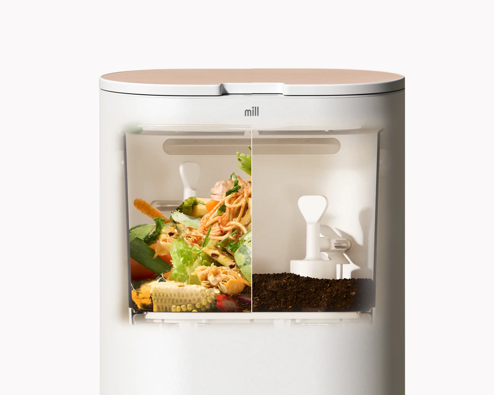
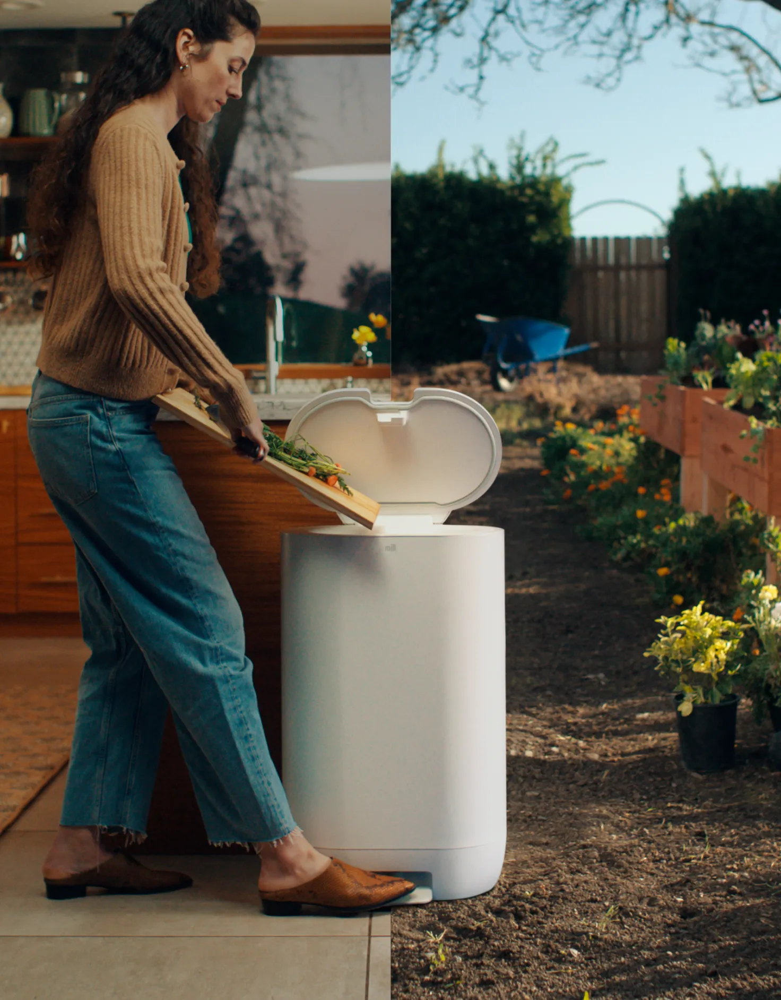
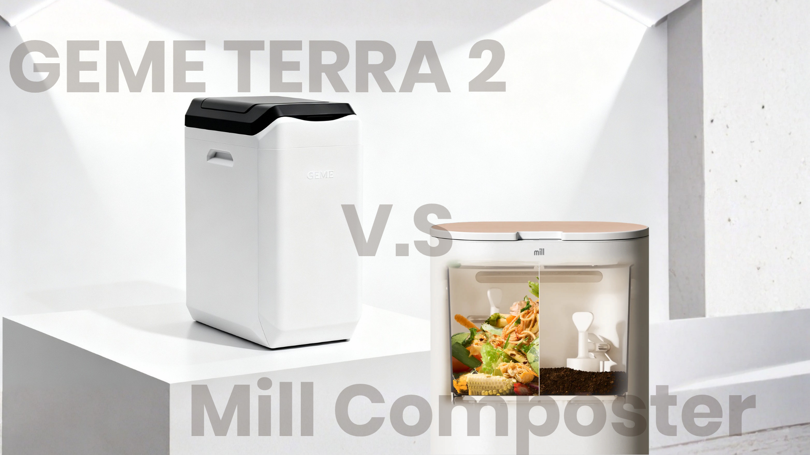

import GemeTerra2CTA from '@site/src/components/GemeTerra2CTA' 
import GemeComposterCTA from '@site/src/components/GemeComposterCTA' 
import RelatedArticles from '@site/src/components/RelatedArticles'
import ReactPlayer from 'react-player'

## Introduction

If you've ever searched for the best kitchen composter, you've almost certainly come across the Mill composter. It's sleek, quiet, and promises to turn your food scraps into something useful, but does it really compost?

**The short answer is no. Mill itself doesn't call its machine a composter, and the material it produces isn't compost. It's dried, ground-up food waste**. This matters because there's a huge difference between dehydrating food and truly composting it, a difference that affects what you can do with the output, how much it costs you, and whether you're actually returning nutrients to the soil.

In this guide, we'll break down exactly what Mill does, why drying isn't composting, and how a genuine electric composter like the GEME Terra II works. If you've been asking, "Does Mill composter really compost?", read on. You might be surprised.

<!-- truncate -->

## Table Of Content

1. [**What the Mill Composter Actually Does: Dehydrate & Grind**](#1-what-the-mill-composter-actually-does-dehydrate--grind)

2. [**What Real Composting Is: A Biological Process**](#2-what-real-composting-is-a-biological-process)

3. [**GEME Terra II: A True Electric Composter**](#3-introducing-the-geme-terra-ii-a-true-electric-composter)

4. [**Why the Distinction Matters**](#4-why-the-distinction-matters-beyond-semantics)

5. [**Does Mill Composter Really Compost? Final Verdict**](#5-does-mill-composter-really-compost-final-verdict)

6. [**Frequently Asked Questions (Answered)**](#6-frequently-asked-questions-answered)

## 1. What the Mill Composter Actually Does: Dehydrate & Grind

The Mill Composter (officially called the Mill Food Recycler) is often grouped with electric composter models, but its core technology is completely different. It uses heat and mechanical grinding, not biology.

Here's the process:

1. You drop food scraps into the bucket, just about anything, including meat, dairy, and bones.

2. The machine heats the waste to a high temperature, driving off moisture.

3. Paddles grind the now-dry scraps into a fine, coffee-ground-like powder.

4. The result is what Mill calls "Food Grounds", a sterile, dehydrated byproduct.

Nowhere in that process do microorganisms break down the organic matter. There's no fermentation, no humus formation, no biological transformation. It's a physical process: cook the water out, pulverize what's left. The Food Grounds are essentially kitchen scraps with the water removed.

Mill is refreshingly transparent about this. Their FAQ states clearly: "**Food Grounds are not compost**." They recommend sending the grounds back via their subscription mail-back service (for use as chicken feed), mixing them into an outdoor compost pile, or working them into garden soil as a soil amendment. But they are careful not to call the result compost.

So when you see "Mill composter" in product roundups, it's a misnomer. **It should be thought of as a food dehydrator and grinder that drastically reduces waste volume and keeps odor at bay**. It's excellent at that, but it doesn't compost.

## 2. What Real Composting Is: A Biological Process

Real composting is a living process. It relies on microorganisms (bacteria, fungi, actinomycetes) that consume and break down organic matter, converting it into nutrient-rich humus. This is the same decomposition that happens on a forest floor, just accelerated.

Key characteristics of real composting:

- **Microbial digestion**: Living organisms feed on the waste, generating heat (often 130–160°F in hot composting) and transforming the material chemically.
- **Aerobic respiration**: In a well-managed pile or machine, oxygen-loving microbes break down the scraps without producing methane, a major greenhouse gas.
- **End product**: mature compost: After the microbes finish their work, you get a dark, crumbly, earthy-smelling material full of beneficial biology and stable organic matter. It's ready to feed plants immediately.

**Real compost is alive**. It builds soil structure, improves water retention, and slowly releases nutrients. **Dehydrated food grounds, by contrast, are essentially dead organic dust that still needs to decompose further when added to soil**.

<GemeTerra2CTA 
 imgSrc="/img/geme-terra-2-composter.jpg"
 productTitle="GEME Terra II: Best Kitchen Composter"
 features={[
    "✅ Real Composter With No Hidden Costs",
    "✅ Biologically Active Composting System",
    "✅ Quiet, Odour-Free, Real Compost",
    "✅ Zero Filter Costs, No Refills",
    "✅ Reduces Composting Time to Days"
 ]}
buttonText="Get Your GEME Terra II"
  href="https://www.geme.bio/product/terra2?utm_medium=blog&utm_source=geme_website&utm_campaign=general_seo_content&utm_content=does-mill-composter-really-compost"
/>

### The Key Differences: Drying vs. Real Composting

| **Aspect**                       | **Mill (Drying & Grinding)**                       | **Real Composting (e.g., GEME Terra II)**              |
|----------------------------------|----------------------------------------------------|--------------------------------------------------------|
| **Process**                      | Heat removes moisture; grinder pulverizes          | Microorganisms digest and transform waste              |
| **Microbes**                     | None; sterile process kills beneficial organisms   | Rich, active biology throughout                        |
| **End product**                  | Sterile, dehydrated "Food Grounds"                 | Mature, biologically active compost                    |
| **Can it feed plants directly?** | No, can tie up nitrogen and cause acidity if not further decomposed | Yes, it's ready-to-use plant food          |
| **Odor control**                 | Carbon filter traps smells; needs replacement      | Microbial process neutralizes odors at the source      |
| **Ongoing costs**                | Filter replacements + optional subscription        | Permanent catalyst; no recurring costs                 |

This table gets to the heart of the "Does Mill Composter really compost?" question. Mill excels at reducing volume and locking in food waste in a shelf-stable form, so it can be shipped off or stored. But it does not create the living soil amendment that turns a kitchen gadget into a true best kitchen composter for gardeners.

## 3. Introducing the GEME Terra II: A True Electric Composter

If you want a machine that genuinely produces compost in your kitchen, the **GEME Terra II** is a prime example. It uses **AI-managed thermophilic microorganisms (Kobold)** to break down food waste rapidly, typically in 6–8 hours for soft food waste. **The result is real compost, not dehydrated scraps**.

Here's how it works:

- A special blend of heat-loving microbes lives in the permanent ceramic media inside the chamber.
- The system automatically controls temperature, aeration, and moisture to keep the microbes thriving.
- You add food waste continuously; the microbes digest it without needing to start a "cycle."
- Finished compost can simply be scooped out of the chamber and used directly on plants, no mail-back program, no secondary composting, no caveats.

Because it's a living system, the GEME Terra 2 completes the loop right in your kitchen. **The compost is biologically active and immediately beneficial to soil**. Unlike Mill, there's no filter to replace, and no subscription fee; the metal-ion catalyst that controls odor is permanent.

For many users, this is what they thought they were getting when they first searched for an electric composter. A proper, no-compromise, real-compost solution.

| **Feature**              | **GEME Terra 2**                  |
|--------------------------|-----------------------------------|
| Technology               | Microbial (Kobold) + AI control   |
| Daily Capacity           | Up to 2 kg                        |
| Chamber Size             | 14 liters                         |
| Produces Real Compost?   | Yes                               |
| Continuous Feed?         | Yes                               |
| Noise Level              | 35–40 dB                          |
| Filter Cost              | \$0 (permanent)                    |
| 3-Year Ownership         | \$599 (machine only)               |
| Handles Meat/Dairy/Bones | Yes                               |

## 4. Why the Distinction Matters (Beyond Semantics)

Some might argue it's just a matter of terminology: who cares if Mill doesn't make "real" compost, as long as your food waste stays out of the landfill?

It matters for three practical reasons:

1. **Usability of the output**: If you want compost you can use today on your houseplants or garden, Mill's Food Grounds doesn't deliver that. They must be further decomposed in soil or added to an outdoor pile first. GEME Terra II's compost is ready to use immediately.

2. **Long-term cost**: Mill's subscription or filter costs add up fast. A real composter like the GEME Terra II can operate for years with almost no ongoing expense. Over time, the "composter that isn't" may end up costing you far more.

| **Cost Factor**             | **Mill Food Recycler**                       | **GEME Terra II** |
|------------------------|------------------------------------------|---------------|
| Upfront Price          | \$999                                     | \$599          |
| Annual Ongoing Cost    | \$396+ (subscription) or ~\$89 (filters)   | \$0            |
| 3-Year Total           | ~\$2,200–\$2,600                           | \$599          |

3. **Environmental completeness**: Drying and mailing food waste has a carbon footprint (shipping, packaging). Real on-site composting builds soil carbon right where you live, with no transportation.

These differences are why so many zero-waste advocates and gardeners now draw a hard line: **if it doesn't involve microorganisms, it's not a composter**.

<GemeTerra2CTA 
 imgSrc="/img/geme-terra-2-composter.jpg"
 productTitle="GEME Terra II: Best Kitchen Composter"
 features={[
    "✅ Real Composter With No Hidden Costs",
    "✅ Biologically Active Composting System",
    "✅ Quiet, Odour-Free, Real Compost",
    "✅ Zero Filter Costs, No Refills",
    "✅ Reduces Composting Time to Days"
 ]}
buttonText="Get Your GEME Terra II"
  href="https://www.geme.bio/product/terra2?utm_medium=blog&utm_source=geme_website&utm_campaign=general_seo_content&utm_content=does-mill-composter-really-compost"
/>

## 5. Does Mill Composter Really Compost? Final Verdict

No. **The Mill composter**is a sophisticated **food dehydrator** and grinder that shrinks waste and makes it easier to handle, but it does not produce compost. The output needs further processing before it's useful in a garden.

If you're someone who just wants to slash the volume of food waste heading to the curb, hates kitchen odors, and doesn't mind a subscription, Mill is a well-designed appliance. But if your goal is actual, garden-ready compost from an electric composter that really works, Mill is the wrong tool.

For true biological composting in a kitchen device, the **GEME Terra II** stands out as a leading option in 2026. **It creates real, living compost, requires zero filters or subscriptions**, and proves that the best kitchen composter for many households isn't a dehydrator at all, it's a miniature, microbe-powered ecosystem.
Before you buy any machine that claims to "recycle" food waste, ask one question: **Does it use living microbes? If not, it's not composting**. And now you know the difference.

### Quick Comparison Table: Mill Composter V.S GEME Terra II

| **Feature**                | **Mill Food Recycler**                                       | **GEME Terra II**                           |
|---------------------------|-------------------------------------------------------------|----------------------------------------------|
| **Category**                  | Food dehydrator + grinder                                   | True electric composter                      |
| **Technology**                | Heating + grinding                                          | AI-managed microbial fermentation            |
| **Produces Real Compost?**    | ❌ [No, dehydrated "Food Grounds"](https://www.mill.com/lp/mill-vs-composter)                            | ✅ Yes, biologically active compost          |
| **Upfront Price**             | \$999 (or rent \$33–\$45/month)                               | \$599                                        |
| **Ongoing Annual Cost**       | \$396+ (subscription) or ~\$89+ (filters + optional pickups)  | \$0, permanent metal-ion catalyst system      |
| **Noise Level**               | ~45 dB (quiet air purifier level)                           | 35–40 dB                                    |
| **Capacity / Size**           | 6.5L bucket; floor standing                                 | 14L chamber; floor standing       |

👉 [Learn More About GEME Terra II](https://www.geme.bio/product/terra2?utm_medium=blog&utm_source=geme_website&utm_campaign=general_seo_content&utm_content=does-mill-composter-really-compost)

👉 [Explore GEME Pro for Big Households/Plant Shops/Restaurants](https://www.geme.bio/product/geme?utm_medium=blog&utm_source=geme_website&utm_campaign=general_seo_content&utm_content=?utm_medium=blog&utm_source=geme_website&utm_campaign=general_seo_content&utm_content=does-mill-composter-really-compost)

<GemeTerra2CTA 
 imgSrc="/img/geme-terra-2-composter.jpg"
 productTitle="GEME Terra II: Best Kitchen Composter"
 features={[
    "✅ Real Composter With No Hidden Costs",
    "✅ Biologically Active Composting System",
    "✅ Quiet, Odour-Free, Real Compost",
    "✅ Zero Filter Costs, No Refills",
    "✅ Reduces Composting Time to Days"
 ]}
buttonText="Get Your GEME Terra II"
  href="https://www.geme.bio/product/terra2?utm_medium=blog&utm_source=geme_website&utm_campaign=general_seo_content&utm_content=does-mill-composter-really-compost"
/>

## 6. Frequently Asked Questions (Answered)

### Q: Does Mill make real compost?

> A: No. Mill itself says it does not make compost. It produces dehydrated, ground-up food scraps called "Food Grounds", not biologically active compost.

### Q: Can I put Mill's Food Grounds directly in my garden?

> A: No. Mill's own guidance recommends incorporating Food Grounds into soil, as it is not finished compost and may be acidic. It needs to be mixed into existing compost piles or soil to further decompose.

### Q: Is Mill's Food Grounds the same as compost?

> A: No. Mill explicitly states that Food Grounds are not compost. They are dehydrated, ground-up food scraps that still need to break down further in soil or a compost pile.

### Q: Can I use GEME Terra II compost directly on my plants?

> A: Yes. The GEME Terra II produces mature, biologically active compost that can be applied to garden beds, potted plants, or lawns right away. Just remember the 1:8 ratio rules (1 part of compost and 8 part of soil) when applying directly to plants.

### Q: How long does each take to process food waste?

> A: Mill processes approximately 1.4 lbs of food scraps into dry grounds in about 2.5 hours. GEME Terra II's microbial composting cycle takes approximately 6–8 hours for soft food waste to become compost.

### Q: Does the GEME Terra 2 smell? What about fruit flies?

> A: The GEME Terra 2 is sealed and uses a permanent metal‑ion filter that destroys odors at the molecular level. There’s no lingering smell when the lid is closed, and when you open it to add scraps, you might notice a mild earthy scent, nothing like rotting garbage. Because the system is sealed and continuously aerated, fruit flies cannot get in or breed inside.

### Q: Does the GEME Terra II have filters to replace?

> A: No. It uses a permanent metal-ion oxidation catalyst that never needs replacement. There are zero ongoing costs for consumables.

### Q: Which is the best kitchen composter for a small apartment?

> A: For apartments with no outdoor space, a real electric composter like the GEME Terra II is ideal because it produces finished compost you can use on indoor plants immediately, with no extra subscriptions or outdoor piles required. Check this post: [**The Best Composter For Small Kitchen**](https://www.geme.bio/blog/the-best-composter-for-kitchen)

### Q: Does Mill Composter produce methane?

> A: Mill's high-heat drying process does not produce methane, but since the Food Grounds are not compost, they will eventually break down wherever they end up, possibly in a landfill if not sent back through the mail-back program. Real composting avoids landfill methane entirely by cycling the nutrients back into soil.

<GemeTerra2CTA 
 imgSrc="/img/geme-terra-2-composter.jpg"
 productTitle="GEME Terra II: Best Kitchen Composter"
 features={[
    "✅ Real Composter With No Hidden Costs",
    "✅ Biologically Active Composting System",
    "✅ Quiet, Odour-Free, Real Compost",
    "✅ Zero Filter Costs, No Refills",
    "✅ Reduces Composting Time to Days"
 ]}
buttonText="Get Your GEME Terra II"
  href="https://www.geme.bio/product/terra2?utm_medium=blog&utm_source=geme_website&utm_campaign=general_seo_content&utm_content=does-mill-composter-really-compost"
/>

<GemeComposterCTA 
 imgSrc="/img/geme-bio-composter.jpg"
 productTitle="GEME Pro Composter"
 features={[
    "✅ Real Composter With No Hidden Costs",
    "✅ Produce Soil-Ready Compost For Plant Growth",
    "✅ Quiet, Odor-Free, Quick(6-8 hours)",
    "✅ Large Capacity (19 L) For Daily Waste"
  ]}
buttonText="Get Your GEME Pro"
  href="https://www.geme.bio/product/geme?utm_medium=blog&utm_source=geme_website&utm_campaign=general_seo_content&utm_content=?utm_medium=blog&utm_source=geme_website&utm_campaign=general_seo_content&utm_content=does-mill-composter-really-compost"
/>

## Cited Sources

1. [**Good HouseKeeping: I Tried the Mill Food Recycler for 2 Years: Is It Worth the Investment?**](https://www.goodhousekeeping.com/appliances/a65782961/mill-food-recycler-review/)

2. [**GEME Official Blog: Top 5 Kitchen Composters in 2026**](https://www.geme.bio/blog/5-best-kitchen-composters-in-2026)

3. [**Mill Official Page: Mill is NOT a Composter**](https://www.mill.com/lp/mill-vs-composter)

4. [**Popular Mechanics: The Mill Electric Food Recycler Killed My Kitchen Trash**](https://www.popularmechanics.com/home/a70842771/mill-electric-food-recycler-review/)

5. [**GEME Terra 2: The Silent Gearbox**](https://www.geme.bio/blog/geme-terra-2-the-silent-gearbox)

6. [**Mill Official Blog: Reencle V.S Mill Composter 2026**](https://reencle.co/blogs/news/reencle-vs-mill-composter-2026)

7. [**HGTV: Mill Food Recycler Review**](https://www.hgtv.com/shopping/product-reviews/mill-food-recycler-review)

8. [**Backyard Farmer: GEME Electric Composter Review**](https://backyard-farmer.com/geme-electric-compost-bin-review/#content)

9. [**GEME Official Page: Real Compost V.S Dehydrated Scraps**](https://www.geme.bio/compare/real-compost-vs-dehydrated-scraps?utm_medium=blog&utm_source=geme_website&utm_campaign=general_seo_content&utm_content=the-best-electric-kitchen-composter-mill-composter-vs-geme-terra-2)

10. [**The Best Composter for Avoiding Recurring Fees: GEME Terra 2 vs. Lomi, Mill, and Reencle**](https://www.geme.bio/blog/best-composter-avoid-recurring-fees-geme-terra-2)

11. [**Top 5 Kitchen Composters in 2026**](https://www.geme.bio/blog/5-best-kitchen-composters-in-2026)

<RelatedArticles
  slugs={[
  "the-best-electric-kitchen-composter-mill-composter-vs-geme-terra-2",
  "geme-composter-mothers-day-discount",
  "mothers-day-geme-composter-discount-code",
  "best-home-composter-for-apartment-geme-vs-lomi",
  "the-best-kitchen-composter-for-zero-waste-lifestyle",
  "geme-terra-2-the-silent-gearbox",
  "geme-composter-amazon-discount-earth-day-2026",
  "how-to-avoid-leftover-food-poisoning-fried-rice-syndrome",
  "geme-composter-vs-diy-bokashi-composting",
  "permanent-odor-control-catalyst-path-vs-disposable-carbon",
  "why-the-geme-chassis-is-intentionally-heavier-than-a-typical-countertop-appliance",
  "geme-composter-review-2026-geme-pro",
  "how-to-fertilize-your-plants-in-spring",
  "how-to-plant-tulip-bulbs-in-spring-guide",
  "what-can-you-put-in-electric-composter-meat-dairy-bones",
  "electric-composter-salt-oil-boundaries",
  "advanced-geme-compost-application-guide",
  "countertop-composter-misnomer-floor-standing-electric-composter",
  "top-5-electric-composters-on-amazon-2026",
  "geme-terra-2-pros-and-cons",
  "top-5-kitchen-composters-pros-and-cons",
  "geme-composter-review-2026",
  "best-kitchen-composter-verdict-2026",
  "best-composter-avoid-recurring-fees-geme-terra-2",
  "how-to-compost-cut-flowers-guide",
  "how-long-does-bokashi-take-to-compost",
  "how-to-care-for-hydrangeas-and-change-colors",
  "best-composter-daily-operation-comparison-lomi-mill-reencle-geme",
  "how-long-does-pizza-last-in-fridge-guide",
  "how-to-compost-eggshells-guide-geme",
  "how-to-compost-coffee-grounds-guide",
  "never-buy-carbon-filter-for-your-composter",
  "best-composter-fastest-real-compost-geme-terra-2",
  "how-to-compost-at-home-beginners-guide",
  "how-long-can-chicken-stay-in-the-fridge",
  "how-to-reduce-odor-indoor-composting-tips",
  "how-long-can-ground-beef-stay-in-the-fridge",
  "nyc-composting-fines-2026-geme-terra-2-best-electric-compost",
  "best-indoor-composter-for-apartment-geme-vs-lomi",
  "the-best-composter-for-kitchen",
  "how-to-reduce-food-waste-during-spring-festival",
  "does-reencle-composter-produce-real-compost",
  "does-mill-composter-really-compost",
  "how-to-reduce-food-waste-at-home-2026",
  "free-mcnugget-caviar-raises-food-waste-concerns",
  "composting-in-winter",
  "how-to-compost-at-home",
  "zero-waste-home-kitchen-composter",
  "does-lomi-composter-really-compost",
  "5-best-kitchen-composters-in-2026",
  "best-kitchen-composter-in-2026-geme-terra-2",
  "geme-vs-reencle-composter-2026",
  "geme-vs-mill-composter-2026",
  "best-kitchen-composter-2026",
  "advanced-geme-compost-application-guide",
  "electric-compost-bin-filters-costs-comparison",
  "geme-vs-lomi", 
  "geme-terra-2-debuts",
  "the-best-composter-to-reduce-food-waste",
  "compost-pile-vs-electric-composter",
  "how-to-make-bananas-last-longer",
  "how-long-do-apples-last-in-the-fridge",
  "can-i-compost-moldy-grapes",
  "can-you-compost-moldy-bread",
  ]}
/>

_Ready to transform your gardening game? Subscribe to our [newsletter](http://geme.bio/signup?utm_medium=blog&utm_source=geme_website&utm_campaign=general_seo_content&utm_content=how-to-compost-at-home-beginners-guide) for expert composting tips and sustainable gardening advice._

